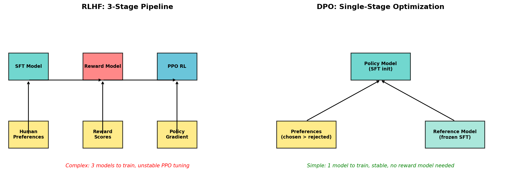
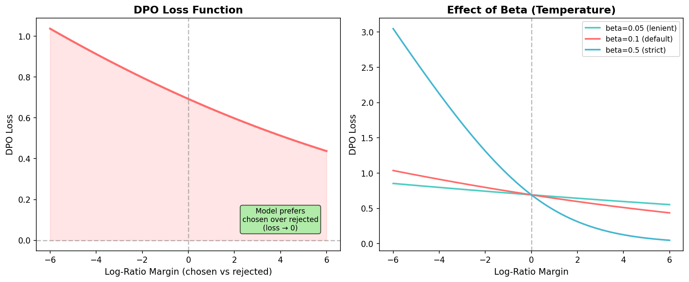
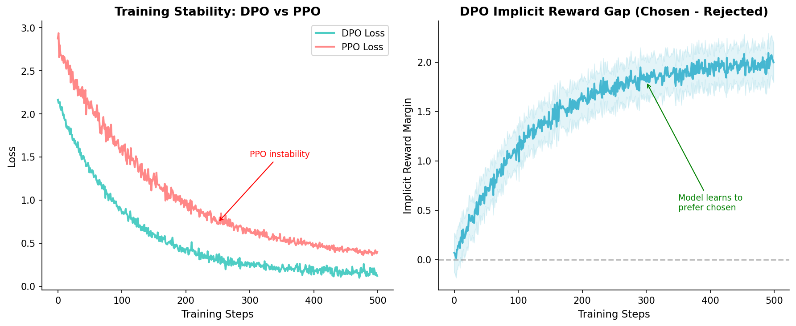
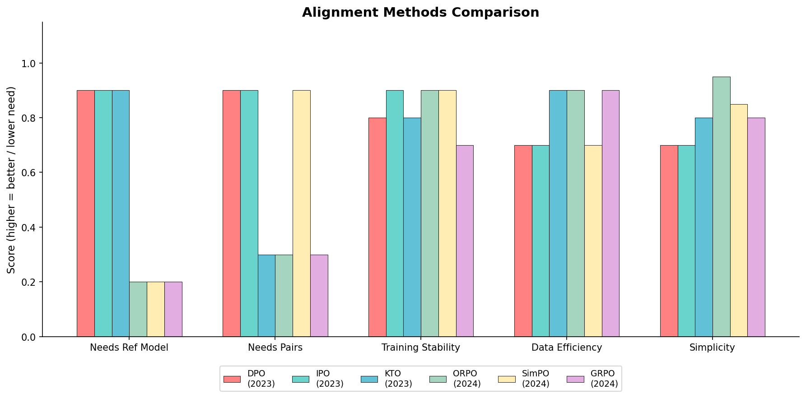
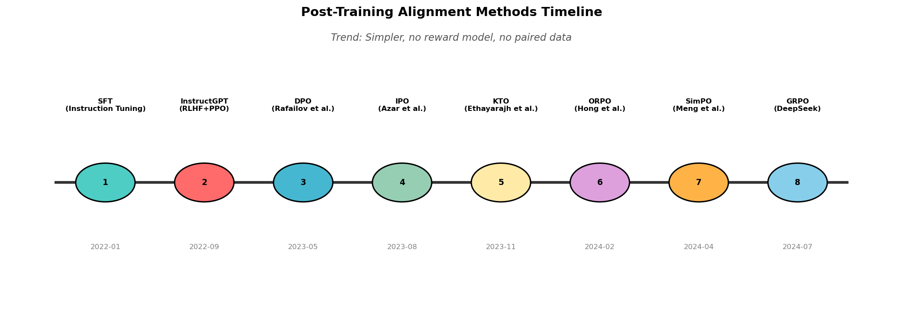

# Day 15: DPO 及替代方案 — 为什么大家都在放弃 PPO

> **核心问题**: 既然 RLHF + PPO 是 ChatGPT 背后的对齐方法，为什么学术界正迅速转向 DPO 等更简单的替代方案？你又该选哪个？

---

## 开篇

想象你是一个批改作文的老师。用 PPO 做 RLHF，你需要：(1) 训练一个单独的「评分 AI」来打分，(2) 用这个分数作为奖励信号，(3) 小心调参一个强化学习算法，让学生 AI 在改进的同时不会崩溃。它确实有效——ChatGPT 证明了这一点——但这就像需要三个教室、两个老师和一间受控环境，只为了给作业写评语。

那如果换成这样：你只需要给学生看「这篇作文比那篇好」，让他们自己琢磨好在哪里呢？这就是 DPO（Direct Preference Optimization，直接偏好优化）及其后继方案的核心思想。从 2023 年开始，这个领域涌现了大量跳过奖励模型的方法，效果惊人：代码更简单、训练更快、输出往往更好。

今天我们来理解为什么 PPO 正在失宠，DPO 的底层原理是什么，以及 2024-2025 年的对齐方法全景图。

---

## 1. PPO-RLHF 的问题

### 1.1 RLHF 快速回顾

如我们在第 13-14 天所讲，标准 RLHF 流程有三个阶段：

1. **监督微调（SFT）**：在优质示范数据上训练模型
2. **奖励模型（RM）训练**：训练一个单独的模型来给回复打分
3. **PPO（近端策略优化）**：用奖励模型通过强化学习微调策略


*说明：三阶段 RLHF 流程（左）vs DPO 的单阶段方案（右）。DPO 完全消除了奖励模型。*

### 1.2 为什么 PPO 令人痛苦

PPO 能用，但实践中非常折磨人：

**四个模型同时驻留内存。** PPO 训练时需要：(1) 正在被优化的策略模型，(2) 冻结的参考模型（用于 KL 惩罚），(3) 奖励模型，(4) 通常还有一个价值头（critic）。对 7B 参数模型来说，约 28B 参数同时在内存中。70B 模型？祝你好运。

**奖励作弊（Reward Hacking）。** 策略学会钻奖励模型的漏洞，而不是真正改进。你可能会得到在奖励模型上得分高、但实际上更差的回复——冗长、重复、或一味迎合用户。

**超参数敏感。** PPO 的超参数搜索空间大得惊人：学习率、裁剪范围、KL 系数、GAE lambda、价值函数系数、折扣因子……一个糟糕的配置可能导致训练静默发散。

**训练不稳定。** 不像监督学习中损失单调下降，PPO 的损失可能不可预测地飙升。研究人员报告需要多次重启和严密监控。

```python
# PPO 需要同时管理多个模型 - 这就是复杂度所在
import torch.nn as nn

class PPOTrainingSetup:
    """你需要所有这些同时运行。"""
    def __init__(self, base_model):
        self.policy = base_model                  # 被优化的模型
        self.ref_policy = copy.deepcopy(base_model)  # 冻结的参考模型
        self.reward_model = RewardModel(base_model.config)  # 单独的模型
        self.value_head = nn.Linear(base_model.config.hidden_size, 1)  # Critic
        
        # 内存：约 4 倍基础模型大小
        total_params = sum(p.numel() for p in self.policy.parameters())
        print(f"基础模型: {total_params/1e9:.1f}B 参数")
        print(f"内存中总计: ~{4 * total_params/1e9:.1f}B 参数")
```

---

## 2. DPO：直接偏好优化

### 2.1 关键洞察

DPO 的突破（Rafailov 等人，NeurIPS 2023）是一个数学技巧：**你可以跳过奖励模型，因为 RLHF 目标下的最优策略有封闭解**。

> **什么是封闭解（closed-form solution）？** "封闭解"意味着你可以用一个公式直接写出精确答案——不需要迭代、不需要试错、不需要逐步逼近。例如，二次方程求根公式 $x = \frac{-b \pm \sqrt{b^2-4ac}}{2a}$ 就是一个封闭解：代入系数，立刻得到答案。相比之下，大多数 RL 问题（包括 PPO）*没有*封闭解——你只能通过反复试错更新来逼近答案。DPO 的关键洞察是，在 KL 正则化的 RLHF 目标下，最优策略*确实*存在封闭解，因此我们可以直接求解，而不需要迭代。

直觉是这样的。在 RLHF 中，我们训练一个奖励模型 $r(x, y)$，然后优化：

$$
\begin{aligned}
\max_{\pi} \; \mathbb{E}_{x,y \sim \pi}[r(x,y)] - \beta \cdot D_{KL}(\pi \| \pi_{ref})
\end{aligned}
$$

> **这个公式在算什么？** 这是 RLHF 的目标函数——两股力量在拉扯：
> - **第一项** $\mathbb{E}[r(x,y)]$：最大化奖励——让模型生成高分的回复
> - **第二项** $\beta \cdot D_{KL}$：别离原始 SFT 模型太远——防止模型跑偏
> - **$\beta$** 是平衡这两股力量的旋钮。β 大 → 保守少变；β 小 → 激进追分

最优解是：

$$
\begin{aligned}
\pi^{*}(y|x) = \frac{1}{Z(x)} \pi_{ref}(y|x) \exp\left(\frac{1}{\beta} r(x,y)\right)
\end{aligned}
$$

> **这个公式在算什么？** 这是上面优化问题的*精确答案*——封闭解。意思是：**最优策略 = 参考模型 × exp(奖励/β)**。
> - $\pi^*(y|x)$（带星号）= **最优策略**——我们要找的那个最好的模型
> - $\pi_{ref}(y|x)$（带 ref 下标）= **参考模型**——冻结的 SFT 模型，我们的起点
> - 唯一的 $\exp\left(\frac{1}{\beta} r(x,y)\right)$ 充当乘数：奖励越高 → 乘数越大 → 该回复的概率越高
> - $Z(x)$ 只是归一化常数（确保概率加起来 = 1）——不重要，后面会消掉

其中 $Z(x)$ 是归一化常数。重新整理，我们可以用策略来表示**隐式奖励**：

$$
\begin{aligned}
r(x,y) = \beta \log \frac{\pi^{*}(y|x)}{\pi_{ref}(y|x)} + \beta \log Z(x)
\end{aligned}
$$

> **这个公式在算什么？** 这是把公式②反过来写——现在不是用奖励算策略，而是*用策略反推奖励*。
> - **关键洞察**：当我们比较两个回复 $y_w$（好的）和 $y_l$（差的）时，$\beta \log Z(x)$ 在两边都出现，相减就消掉了
> - 所以我们根本不需要知道奖励的具体值，只需要知道两个回复的*相对差异*
> - 这就是为什么能跳过奖励模型

关键来了：当我们比较两个回复时，$Z(x)$ 会消掉！所以我们可以直接用偏好对来优化策略，完全不需要训练奖励模型。

### 2.2 DPO 损失函数

给定偏好对 $(y_w, y_l)$，其中 $y_w$ 是被选中的（胜者），$y_l$ 是被拒绝的（败者）：

$$
\begin{aligned}
\mathcal{L}_{DPO} = -\mathbb{E} \left[ \log \sigma \left( \beta \log \frac{\pi(y_w|x)}{\pi_{ref}(y_w|x)} - \beta \log \frac{\pi(y_l|x)}{\pi_{ref}(y_l|x)} \right) \right]
\end{aligned}
$$

> **这个公式在算什么？** 看着吓人，但拆开就很清晰：
> - $\log \frac{\pi(y_w|x)}{\pi_{ref}(y_w|x)}$ = 好回复的概率偏移了多少
> - $\log \frac{\pi(y_l|x)}{\pi_{ref}(y_l|x)}$ = 差回复的概率偏移了多少
> - **两项相减** = 好回复偏移得多、差回复偏移得少的程度
> - 外面的 $\log \sigma()$ 把这个差值变成 0~1 之间的概率，取负 log 来惩罚差距太小的情况
>
> **一句话总结：** 让模型对好回复的概率提升幅度 > 差回复的提升幅度，差距越大 loss 越小。跟训练分类器一模一样的逻辑——只不过这里分类的不是猫和狗，而是"好回复 vs 差回复"。

其中 $\sigma$ 是 sigmoid 函数，$\beta$ 控制策略偏离参考模型的程度。


*说明：左：DPO 损失曲面——当模型已经偏好选中回复（正边际），损失低。右：beta 参数控制模型遵循偏好的严格程度。*

把它想象成**两个赛跑选手的比赛**。你不需要给每个选手打绝对分数（像奖励模型那样），只需要测量他们之间的差距，然后把差距拉大。当策略对 $y_w$ 的概率远高于 $y_l$（相对于参考模型）时，损失就很低。

### 2.3 Beta 到底在做什么

$\beta$ 参数（有时叫温度）是 DPO 中最重要的超参数：

- **低 beta（0.05-0.1）**：策略缓慢变化。更稳定，但可能欠拟合偏好。适合微妙的风格对齐。
- **高 beta（0.5-1.0）**：策略激进地跟随偏好。有过拟合或丧失能力的风险。在偏好强烈且可靠时使用。

实用经验法则：从 $\beta = 0.1$ 开始，如果模型变化不够就增大，如果在丧失能力就减小。

### 2.4 DPO 代码实现

```python
import torch
import torch.nn.functional as F

def dpo_loss(policy_chosen_logps, policy_rejected_logps,
             ref_chosen_logps, ref_rejected_logps, beta=0.1):
    """
    计算 DPO 损失。
    
    参数:
        policy_chosen_logps: 当前策略下 log pi(y_w|x)
        policy_rejected_logps: 当前策略下 log pi(y_l|x)
        ref_chosen_logps: 参考模型下 log pi_ref(y_w|x)
        ref_rejected_logps: 参考模型下 log pi_ref(y_l|x)
        beta: 控制偏离参考模型的温度参数
    """
    # 对数比率：策略相对参考偏移了多少？
    chosen_logratios = policy_chosen_logps - ref_chosen_logps
    rejected_logratios = policy_rejected_logps - ref_rejected_logps
    
    # 边际：策略偏好选中回复比拒绝回复多了多少？
    logits = beta * (chosen_logratios - rejected_logratios)
    
    # Logistic 损失（等同于带边际的二元交叉熵）
    loss = -F.logsigmoid(logits).mean()
    
    return loss

# 关键洞察：只需要 2 次前向传播（选中 + 拒绝）
# 对比 PPO：4 个模型 × 多次采样 × 奖励评分
```

---

## 3. 训练动态与实战考虑

### 3.1 为什么 DPO 更稳定

DPO 收敛到一个固定的目标（像监督学习），而 PPO 是一个迭代的 RL 过程。这个根本差异意味着：

| 特性 | PPO | DPO |
|------|-----|-----|
| 目标函数 | 随策略变化而改变 | 固定数据集，固定损失 |
| 模型数量 | 4（策略、参考、奖励、critic） | 2（策略、参考） |
| 内存 | ~4× 基础模型 | ~2× 基础模型 |
| 超参数 | 7-10 个关键参数 | 1-2 个（beta、学习率） |
| 训练曲线 | 噪声大，可能发散 | 平滑，单调 |
| 奖励作弊 | 常见 | 不可能（没有奖励模型） |


*说明：左：DPO 训练平滑稳定，对比 PPO 的噪声动态。右：隐式奖励边际（选中 - 拒绝）在 DPO 训练中稳步增长。*

### 3.2 参考模型的问题

DPO 仍然需要一个冻结的参考模型（$\pi_{ref}$），这使内存翻倍。因为 DPO 需要知道「策略变了多少」——没有参考模型就没有基线。

一些新方法解决了这个问题：
- **SimPO** 用模型自身的平均对数概率作为隐式参考
- **ORPO** 将对齐集成到 SFT 中，完全消除参考模型

### 3.3 常见陷阱

**编辑距离很重要。** DPO 在 $y_w$ 和 $y_l$ 结构相似但质量不同时效果最好。如果完全不同，模型可能学到虚假特征而非真正的偏好。

**是编辑能力，不是生成能力。** DPO 主要教模型重新排序已有的概率分布，而不是生成全新的能力。如果你需要模型学会新技能，先 SFT，再 DPO。

**过拟合偏好数据。** 在小数据集（< 5K 对）上，DPO 可能记忆特定模式。必须在留出的任务上定期评估。

---

## 4. 更广阔的全景：DPO 替代方案

### 4.1 IPO：Identity Preference Optimization

IPO（Azar 等人，2023）解决了 DPO 的一个理论弱点：它假设偏好数据来自 Bradley-Terry 模型（一种特定的偏好模型）。IPO 直接优化一个后悔值（regret）界：

$$
\begin{aligned}
\mathcal{L}_{IPO} = \mathbb{E}\left[ \left( \log \frac{\pi(y_w|x)}{\pi_{ref}(y_w|x)} - \log \frac{\pi(y_l|x)}{\pi_{ref}(y_l|x)} - \frac{1}{2\beta} \right)^2 \right]
\end{aligned}
$$

关键区别：IPO 用平方损失代替 logistic 损失，使其在偏好数据有噪声时更鲁棒（实践中几乎总是有噪声的）。

### 4.2 KTO：Kahneman-Tversky Optimization

KTO（Ethayarajh 等人，2023）在数据受限场景下是突破性的。灵感来自行为经济学的展望理论：

- **不需要成对偏好数据**——只需要二元标签（好/坏）
- 这很关键，因为成对数据很贵：你需要生成两个回复，然后让人类排序
- KTO 只需要「这个回复好」或「这个回复不好」

损失函数对正例和负例赋予不同权重，反映人类损失厌恶的特点（坏结果比好结果更让人难受）：

```python
def kto_loss(policy_logps, ref_logps, labels, beta=0.1):
    """
    KTO：只需要二元标签，不需要偏好对。
    labels: 1 表示好，0 表示不好
    """
    logratios = policy_logps - ref_logps
    
    # 好的回复：把策略推到参考模型之上
    # 不好的回复：把策略推到参考模型之下
    des_mask = (labels == 1)
    und_mask = (labels == 0)
    
    loss_des = -F.logsigmoid(beta * logratios[des_mask]).mean()
    loss_und = -F.logsigmoid(-beta * logratios[und_mask]).mean()
    
    # 按比例加权（平衡损失）
    total = des_mask.sum() + und_mask.sum()
    w_des = und_mask.sum() / total
    w_und = des_mask.sum() / total
    
    return w_des * loss_des + w_und * loss_und
```

### 4.3 ORPO：Odds Ratio Preference Optimization

ORPO（Hong 等人，2024）走得更远：它**将 SFT 和对齐合并为一个阶段**。没有参考模型，没有单独的 DPO 步骤。

它在标准 SFT 损失上加入一个赔率比（odds ratio）惩罚项：

$$
\begin{aligned}
\mathcal{L}_{ORPO} = \mathcal{L}_{SFT} + \lambda \cdot \mathcal{L}_{OR}
\end{aligned}
$$

其中 $\mathcal{L}_{OR}$ 在选中与拒绝的赔率比太接近 1 时惩罚模型（即模型没有区分它们）。

### 4.4 GRPO：Group Relative Policy Optimization

GRPO（用于 DeepSeek-V2/V3）在推理任务中特别有潜力。它采取了与 DPO 截然不同的方法：

**工作原理：** 对每个 prompt，从当前策略采样一个 **组** 的 $G$ 个回复。对每个回复打分（数学/代码可以用规则验证器，或任何奖励函数）。然后计算**组内相对优势**——每个回复是相对于同组其他回复来评判的，而不是绝对标准。

**为什么对推理特别聪明：** 在数学和编程中，你通常可以验证正确答案。不需要训练有噪声的奖励模型，你可以用精确匹配验证（答案是否等于标准答案？）或测试用例通过率。组的结构提供了自然归一化：一个得 8/10 的回复可能很棒（如果组平均 5/10），也可能很差（如果组平均 9/10）。

**相比 PPO 在推理上的优势：** 不需要 critic（价值函数）。组均值就是基线。如果用规则验证就不需要奖励模型。这正是 DeepSeek-R1 实现突破性推理能力的关键——模型完全通过 GRPO 学会了生成思维链推理过程，不需要任何人类标注的推理步骤。

```python
def grpo_advantages(rewards_per_group):
    """
    GRPO：计算组内相对优势。
    不需要 critic，不需要参考模型来计算优势。
    
    参数:
        rewards_per_group: (batch_size, group_size) 的奖励张量
    返回:
        组内归一化的优势
    """
    mean = rewards_per_group.mean(dim=1, keepdim=True)
    std = rewards_per_group.std(dim=1, keepdim=True) + 1e-8
    advantages = (rewards_per_group - mean) / std
    return advantages

# 示例：一道数学题的 4 个回复，按答案正确性评分
rewards = torch.tensor([[0.0, 1.0, 0.0, 1.0]])  # 2 个正确，2 个错误
advantages = grpo_advantages(rewards)
# 结果：错误答案获得负优势，正确答案获得正优势
# 模型学会在每个组内偏好有效的方案
```


*说明：各维度对比。「需要参考模型」和「需要成对数据」越低越好。稳定性、效率和简洁性越高越好。*

---

## 5. 什么时候用什么

### 5.1 决策框架

根据你的实际情况选择：

| 场景 | 推荐方法 | 原因 |
|------|---------|------|
| 首次做对齐 | DPO | 最简单，经过充分验证，好的默认值 |
| 只有二元标签 | KTO | 不需要成对数据 |
| 计算有限 / 追求简单 | ORPO | 单阶段，无参考模型 |
| 数学/推理且有可验证答案 | GRPO | 组内比较 + 规则奖励 |
| 偏好数据有噪声 | IPO | 对标签噪声鲁棒 |
| 大规模生产（如 ChatGPT） | PPO + RM | 大量数据下仍然扩展最好 |

### 5.2 元趋势

这个领域明显在向更简单的方法演进。进程本身说明了一切：


*说明：对齐方法从 2022-2024 年的快速演化。注意趋势：每个新方法需要的组件越来越少。*

2022 年，你需要 SFT + RM + PPO。到 2024 年，你可以在单阶段完成对齐（ORPO），或不需要成对数据（KTO），或不需要任何参考模型（SimPO）。每年复杂性降低，而效果提升或持平。

### 5.3 PPO 的持续相关性

PPO 并没有死。对于最大的生产系统（GPT-4、Claude），带奖励模型的 PPO 仍有优势：

- **在线学习**：PPO 可以在训练中从新数据学习；DPO 是离线的（固定数据集）
- **可扩展性**：有足够算力时，PPO 可以无限迭代
- **精细的奖励塑形**：奖励模型可以捕捉复杂的权衡

但对大多数从业者和研究人员来说，DPO 系列方法的简洁性使它们在 2025 年成为默认选择。

---

## 6. 常见误解

### ❌ 「DPO 总是比 PPO 好」

不是。DPO 更简单、更稳定，但 PPO 在有足够工程投入和数据的情况下可以达到更好的效果。哪个「更好」取决于你的约束条件。

### ❌ 「用 DPO 不需要参考模型」

你需要一个冻结的参考模型——这是 DPO 衡量策略变化程度的方式。相比纯 SFT，这使内存翻倍。

### ❌ 「DPO 消除了对好数据的需求」

DPO 消除的是*奖励模型*，不是*数据质量要求*。垃圾偏好数据产出垃圾对齐模型，不管用什么优化方法。

### ❌ 「这些方法都完全不同」

大多数 DPO 变体共享同一个核心思想：测量策略与参考之间的对数概率比率，然后把选中回复往上推、拒绝回复往下压。区别在于损失函数的形状和数据要求。

---

## 7. 延伸阅读

### 基础论文
1. [Direct Preference Optimization: Your Language Model is Secretly a Reward Model](https://arxiv.org/abs/2305.18290) — DPO 原始论文（Rafailov 等人，2023）
2. [A General Theoretical Paradigm to Understand Learning from Human Preferences](https://arxiv.org/abs/2310.12036) — IPO 框架（Azar 等人，2023）
3. [KTO: Model Alignment as Prospect Theoretic Optimization](https://arxiv.org/abs/2402.01306) — 使用二元标签的 KTO

### 新方法
4. [ORPO: Monolithic Preference Optimization without Reference Model](https://arxiv.org/abs/2403.07691) — 单阶段对齐（2024）
5. [SimPO: Simple Preference Optimization with Reference-Free Reward](https://arxiv.org/abs/2405.14734) — 无需参考模型（2024）
6. [DeepSeek-V2: A Strong, Economical, and Efficient Mixture-of-Experts Language Model](https://arxiv.org/abs/2405.04434) — 引入 GRPO

### 分析与比较
7. [Insights into Alignment: The Necessity of RLHF](https://arxiv.org/abs/2404.09643) — RLHF 何时仍然值得其复杂性

---

## 思考题

1. 如果 DPO 隐式地恢复了奖励模型，为什么不能直接提取并单独使用那个奖励模型？会出什么问题？
2. KTO 利用前景理论中「损失比收益更令人痛苦」的洞察。这种不对称性如何影响对齐模型学到的行为类型？
3. GRPO 使用组内相对奖励而非绝对奖励。什么样的任务最能从这种相对比较中获益？

---

## 总结

| 概念 | 一句话解释 |
|------|-----------|
| DPO | 直接从偏好优化策略——不需要奖励模型 |
| IPO | 类似 DPO 但用平方损失——对噪声偏好更鲁棒 |
| KTO | 只需要「好/坏」标签，不需要偏好对——数据更便宜 |
| ORPO | 将 SFT + 对齐合并为一个阶段——最简单的流程 |
| GRPO | 组内相对优化——在有可验证答案的推理任务上表现出色 |
| Beta ($\beta$) | 控制策略偏离参考模型的程度 |
| 参考模型 | SFT 模型的冻结副本——用于衡量策略漂移 |
| 奖励作弊 | 策略钻奖励模型漏洞——DPO 中不可能发生 |

**核心要点**：对齐领域自 2023 年以来经历了剧烈的简化。DPO 证明你不需要强化学习来对齐语言模型——只需要精选的偏好数据和一个巧妙的损失函数。更新的替代方案（KTO、ORPO、GRPO）推得更远：更少数据、更少模型、更简单代码。对大多数从业者来说，DPO 系列方法应该是默认选择；PPO 只在有充足工程资源的大规模生产系统中仍然有意义。

---

*LLM 基础课程 第 15 天 / 共 60 天*
*字数：约 3200 字 | 阅读时间：约 16 分钟*
