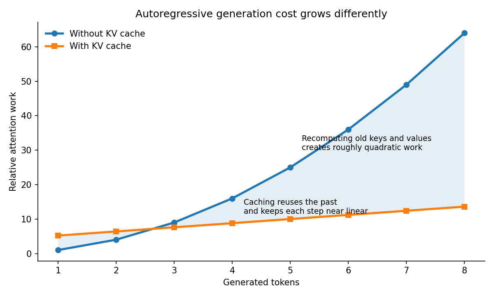
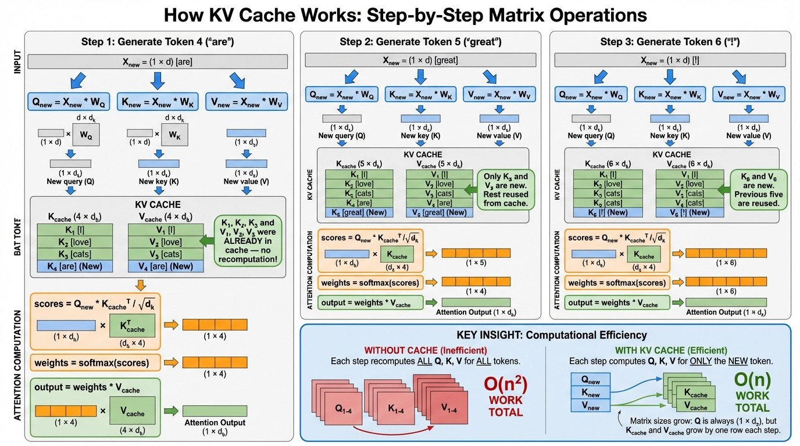
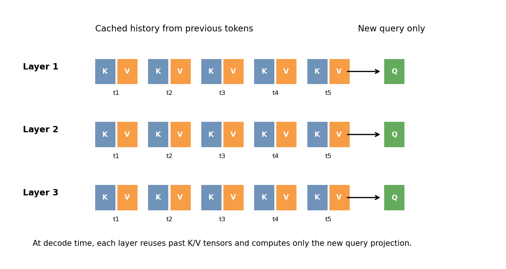
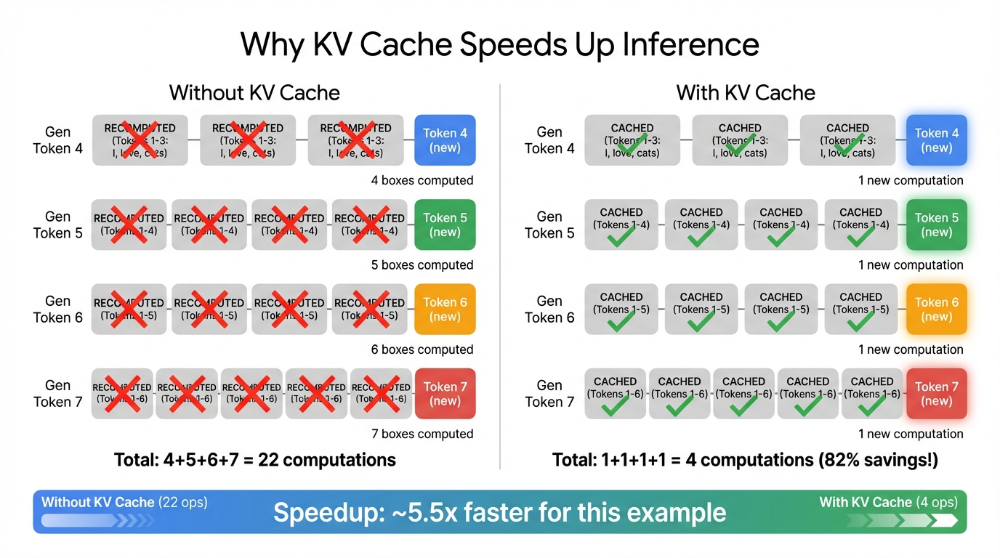
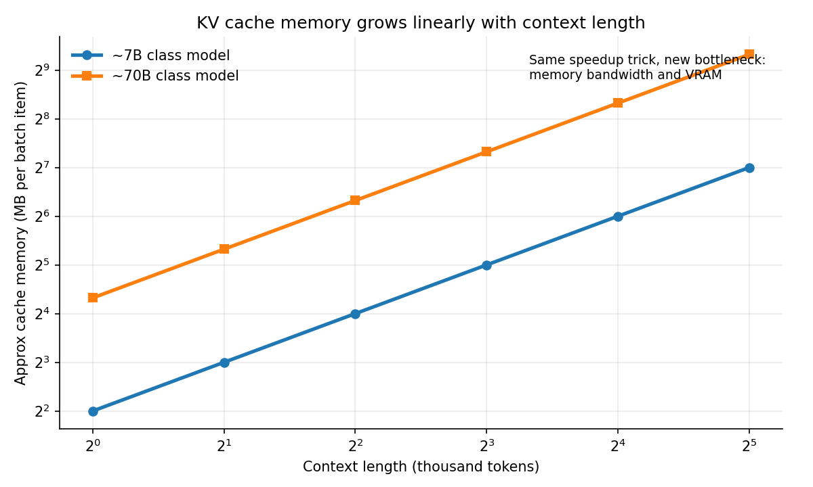
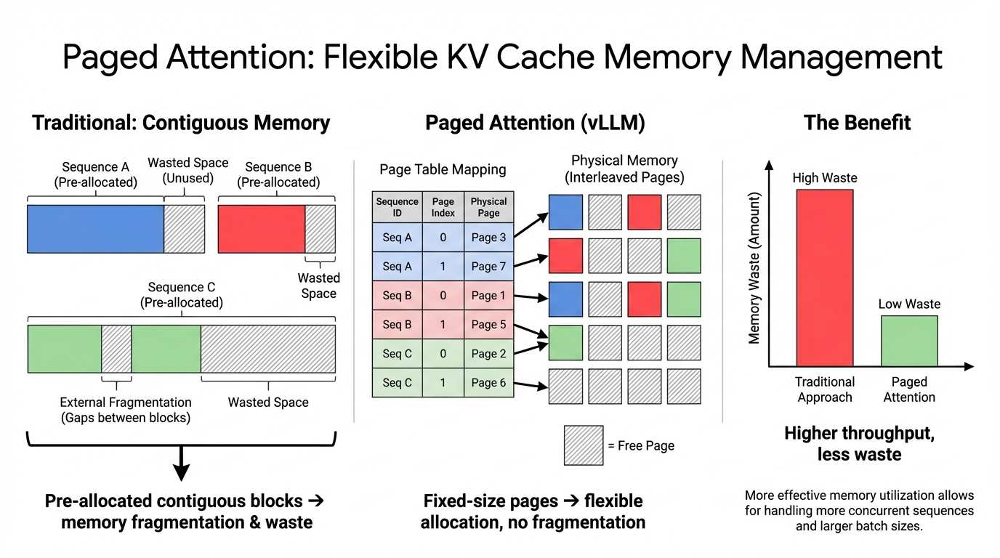
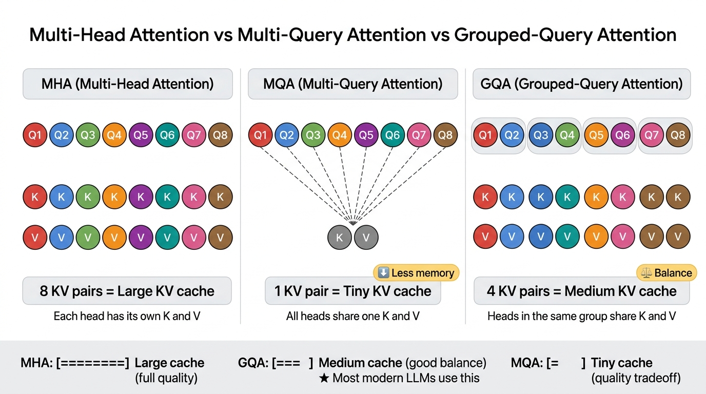

# Day 17: KV Cache

> **核心问题**：大语言模型为什么能一边生成一个 token，一边避免把整段历史注意力全部重算一遍？这种加速背后的代价又是什么？

---

## 开场

如果你看过聊天机器人实时输出答案，会觉得它的生成过程很顺滑，几乎像人在打字。但从计算角度看，自回归生成其实是很别扭的工作负载。模型每次只生成一个 token，然后再生成下一个。问题在于，每个新 token 都应该关注之前的全部上下文。如果我们真的每一步都把整个 Transformer 在所有历史 token 上重新跑一遍，推理成本会高得离谱。

**KV 缓存（KV Cache）**就是用来解决这个浪费的。它的思路非常直接：某个 token 一旦经过过一次自注意力层，它对应的 **key** 和 **value** 向量就已经算出来了。在推理阶段，这些张量不会变化，所以没有必要在每个新的解码步里反复重算。我们把它们存起来，后面直接复用。这就是现代 LLM 服务系统中最关键的工程技巧之一。

你可以把它想象成一次很长的会议。没有笔记时，每次有人提问，你都得在脑子里从头回放整场会议。有了笔记，你只需要结合旧笔记处理刚刚出现的新一句话。会议还是很长，但下一次回答会便宜得多。

KV 缓存看起来像一个实现细节，但它其实连接了理论和产品现实。理解了它，你就更容易理解为什么长上下文推理这么贵，为什么显存带宽如此重要，为什么批处理没想象中那么容易，以及为什么像 vLLM 这样的系统会引入 **paged attention**。这篇文章会把它的机制、收益和代价完整拆开讲清楚。

---

## 1. 为什么朴素的自回归解码会浪费大量计算

语言模型的概率分解仍然是熟悉的形式：

$$
P(x_{1:T}) = \prod_{t=1}^{T} P(x_t \mid x_{1:t-1}).
$$

在推理时，生成是一步一步进行的。假设 prompt 长度是 $n$，模型要生成第 $n+1$、$n+2$、$n+3$ 个 token。在 decoder-only Transformer 中，每一步都要让新 token 对当前已经看到的前缀做自注意力。

对于单个注意力头，我们要计算

> **$X$ 是什么？** $X$ 是**输入矩阵**，包含到目前为止所有 token 的 embedding。如果已经处理了 $n$ 个 token，每个 embedding 维度是 $d$，那 $X$ 就是一个 $n \times d$ 的矩阵——每一行是一个 token 的 embedding。
>
> 三个投影分别产生：
> - **$Q = XW_Q$** — Query 矩阵（"我在找什么？"）
> - **$K = XW_K$** — Key 矩阵（"我能提供什么信息？"）
> - **$V = XW_V$** — Value 矩阵（"我的实际内容是什么？"）
>
> **例子：** Prompt = "I love cats"（3 个 token）。$X$ 是 $3 \times d$ 的矩阵。投影后 $Q, K, V$ 各是 $3 \times d_k$。
>
> **浪费在哪里：** 生成第 4 个 token（"are"）时，$X$ 变成 $4 \times d$，需要重新计算所有 4 个 token 的 $Q, K, V$。但前 3 个 token 的 $K$ 和 $V$ 上一步已经算过了——这就是重复计算。KV cache 就是把这个重复省掉。

$$
Q = XW_Q, \quad K = XW_K, \quad V = XW_V,
$$

然后得到

$$
\text{Attention}(Q, K, V) = \text{softmax}\left(\frac{QK^\top}{\sqrt{d_k}} + M\right)V,
$$

其中 $M$ 是因果掩码（causal mask）。

> **$d_k$ 是什么？** $d_k$ 是每个注意力头中 Key（和 Query）向量的维度。计算方式：$d_k = d / h$，其中 $d$ 是模型隐藏层维度，$h$ 是注意力头数。
>
> **例子：** LLaMA-7B 的 $d = 4096$，$h = 32$，所以 $d_k = 4096 / 32 = 128$。每个头把 Q、K、V 投影到 128 维空间。
>
> **为什么要除以 $\sqrt{d_k}$？** 这就是 Scaled Dot-Product Attention 里缩放的含义。当 $d_k$ 很大时，点积 $QK^T$ 的值会很大，导致 softmax 进入梯度接近 0 的区域（梯度消失）。除以 $\sqrt{d_k}$ 可以归一化方差：如果 $d_k = 128$，随机向量的点积方差约 128，除以 $\sqrt{128} pprox 11.3$ 后方差回到约 1，让 softmax 正常工作。

在训练阶段，一次性处理整段序列很自然，因为整段文本都已知。但在解码阶段，token $t$ 的 $K_t$ 和 $V_t$ 在更早的步骤里其实已经算过了。到了 $t+1$、$t+2$、$t+3$ 步，再把它们重复计算一遍，只增加成本，不增加任何新信息。


*图注：如果没有缓存，每个解码步都会重复处理历史。使用 KV 缓存后，模型主要只为“新 token”付费，而不是为整段历史反复付费。*

这就是核心浪费。如果不使用缓存，总解码成本会随着生成长度近似二次增长，因为第 1 步要看 1 个 token，第 2 步看 2 个，第 3 步看 3 个，依此类推。模型并没有从这些重算中学到任何新东西，它只是忘记了自己已经算过。

---

## 2. KV 缓存的基本思想


*说明：每个解码步只计算新 token 的 Q、K、V。K_new 和 V_new 追加到缓存中。新 query 对所有缓存的 key 和 value 做 attention。历史 token 的 K 和 V 永远不需要重算。*

**关键观察是：在推理阶段，过去 token 的 key 和 value 是固定不变的。** 某个 token 一旦被投影成 $K_i$ 和 $V_i$，这些张量就可以保存下来，在未来的所有解码步骤中复用。

所以在第 $t$ 个解码步，我们不再重算 1 到 $t$ 的全部投影，而是这样做：

1. 计算新 token 在当前层的隐藏状态。
2. 只为这个新 token 计算新的 query、key、value。
3. 把新的 key 和 value 追加进缓存。
4. 用新的 query 去和缓存中的全部 key、value 做注意力计算。

也就是说，在某一层里，缓存可以写成

$$
K_{1:t} = [K_1, K_2, \ldots, K_t], \qquad V_{1:t} = [V_1, V_2, \ldots, V_t].
$$

那么下一个 token 使用的就是

$$
\text{Attention}(Q_{t+1}, K_{1:t+1}, V_{1:t+1}).
$$

只有新位置的 query 必须重新计算，旧的 keys 和 values 全部复用即可。


*图注：在解码时，每一层都会保留过去 token 的 key/value 历史。生成下一个 token 时，只需要计算新 query，并把新的 key/value 追加进去。*

这里有个很重要的细节，缓存是**按层保存**的，通常也是**按注意力头保存**的。它不是全模型共享的一块统一记忆。因为每层的表示空间不同，所以每层都需要自己的历史 key/value。

这也是 KV 缓存特别吃内存的原因。你存下的是“每一层、每个历史 token、两套张量（K 和 V）”的激活值。

一个极简的解码伪代码大概是这样：

```python
for layer in transformer_layers:
    q_new = project_query(x_new)
    k_new = project_key(x_new)
    v_new = project_value(x_new)

    K_cache[layer].append(k_new)
    V_cache[layer].append(v_new)

    x_new = attention(q_new, K_cache[layer], V_cache[layer])
```

这段伪代码省略了很多细节，但它抓住了核心：**算一次，存下来，后面反复复用。**


> **为什么只缓存 K 和 V，不缓存 Q？**
>
> 看 attention 公式：softmax(QK^T / sqrt(d_k)) V
>
> - **Q** 是"提问者"——只有**新 token** 需要问"我应该关注哪些旧 token？"旧 token 的问题对当前步骤没用。
> - **K** 是每个 token 的"索引标签"——新 token 需要跟**所有**旧 token 的 key 做比较。所以必须保留所有旧的 K。
> - **V** 是每个 token 的"实际内容"——attention 权重算好后，需要从**所有**旧 token 的 value 中取内容。所以必须保留所有旧的 V。
>
> **图书馆类比：** 你在图书馆查资料。Q = 你当前的问题（只需要最新的一个问题）。K = 每本书的索引标签（必须全部保留）。V = 每本书的内容（必须全部保留）。你不需要记住以前问过什么问题——但你每次都需要访问完整的目录和藏书。

---

## 3. Prefill 和 Decode，其实是两种不同的推理阶段

要真正理解 KV 缓存，最好把推理拆成两个阶段看。

### 3.1 Prefill 阶段

**Prefill** 阶段负责处理完整 prompt。如果用户给了 4000 个 token 的输入，模型仍然要把这 4000 个 token 穿过所有层，先构建出初始缓存。这个阶段更偏**算力密集**，因为里面有大量矩阵乘法和多 token 的注意力计算。

### 3.2 Decode 阶段

**Decode** 阶段发生在 prompt 编码完之后。此时模型开始一个 token 一个 token 地生成。它依赖已经构建好的缓存，并在每一步上增量扩展这个缓存。这个阶段单步计算量较小，但常常变成**内存访问密集**，因为每个新 query 都要读取一大堆旧的 keys 和 values。

> **Prefill vs Decode 到底谁更快？**
>
> 两者不是简单的"谁更快"——它们的瓶颈不一样：
>
> - **Prefill** 并行处理大量 token——吞吐量高（每秒处理 token 数多），但计算量大（大量矩阵乘法）
> - **Decode** 逐个生成 token——吞吐量低（每秒只生成几个 token），瓶颈是内存带宽（每步都要读取不断增长的 KV cache）
>
> **具体例子：** Prompt = 2,000 token，生成 200 token 回复
> - Prefill：一次性处理 2,000 token，大约 0.5 秒
> - Decode：逐个生成 200 token，大约 2.0 秒
> - 虽然 Decode 每步计算量更小，但因为要串行 200 次，总时间反而更长
>
> **一句话：** Prefill 快而猛（并行），Decode 慢而稳（串行）——生成长文本时 Decode 才是主要瓶颈。

还要澄清一点，我们通常讨论 KV 缓存时说的是**推理阶段**，不是常规训练。训练时模型会并行处理整段序列并进行反向传播，所以“像解码那样不断增长的缓存”并不是训练优化的核心。

这个区分在工程里非常重要。新请求的首 token 延迟往往受 prefill 影响很大，而长文本生成的整体速度则往往由 decode 阶段决定。如果你连瓶颈在哪个阶段都没分清，优化方向很容易跑偏。

可以把它类比成做饭。Prefill 像是切菜、备料、调酱汁，前期准备很重。Decode 像是一盘一盘出菜，单次动作更小，但你必须不断从操作台上取用已经准备好的材料。操作台够不够大、拿取够不够快，直接决定后面出菜速度。

---

## 4. KV 缓存为什么会快这么多


*说明：没有 KV cache 时，每个解码步都要重算所有历史 token 的投影。有了 KV cache 后，每个 token 只算一次——本例中从 22 次计算减少到 4 次（约 5.5 倍加速）。*

没有 KV 缓存时，模型会一次又一次重算旧 token 的投影。有了 KV 缓存后，每个 token 的 key 和 value 只算一次，之后持续复用。

对于第 $t$ 步生成的一个新 token，主要的注意力开销来自“一个 query”和“$t$ 个缓存 key”之间的计算。也就是说，单步主要是和上下文长度成正比，而不是重新把整个前缀从头编码一遍。从整段解码过程看，这个节省会非常显著。

但要注意，KV 缓存**不会让注意力变成免费**。新 query 仍然要和全部历史 key 交互，所以上下文越长，每一步还是越贵。KV 缓存做的是把“整段历史反复重算”变成“历史只存一次，每步扫描一次”。这是巨大的提升，但绝不是魔法。

这也解释了为什么长上下文模型即使有缓存依然昂贵。如果上下文窗口从 8K 提到 128K，缓存会暴涨，每个解码步也要读取更多历史内存。

---

## 5. 隐藏代价，内存

KV 缓存本质上是一个时间换空间的交易。我们把重复计算省下来，但代价是要在显存里长期保存中间张量。

单个序列的缓存内存可以粗略估算为

$$
\text{Cache bytes} \approx 2 \times L \times T \times H_{kv} \times D \times b,
$$

其中：

- $L$ 是层数，
- $T$ 是缓存的 token 数，
- $H_{kv}$ 是 key-value 头数，
- $D$ 是每个头的维度，
- $b$ 是每个元素占用的字节数，
- 前面的 2 表示要同时存 keys 和 values。

如果使用 fp16，那么 $b = 2$。即使采用 grouped-query attention 或 multi-query attention 来减少 KV 头数，缓存仍然会随着上下文长度线性增长。


*图注：KV 缓存降低了重复计算，但它的内存占用会随着上下文长度线性增长。对长 prompt 和大模型来说，这会迅速变成主要瓶颈。*

这会引出一系列很现实的问题：

- 长上下文会降低单张 GPU 能同时容纳的请求数。
- 大 batch 更难做。
- 延迟瓶颈可能从计算转向显存带宽。
- 多请求长度不一致时，内存碎片会越来越严重。

> **"碎片化"是什么意思？**
>
> 同时服务多个用户时，每个请求的 KV cache 大小不同：
> - 用户 A 问了个短问题 → 小 cache（可能 100 token）
> - 用户 B 发了一篇长文档 → 大 cache（可能 4000 token）
> - 用户 C 是中等对话 → 中 cache（可能 500 token）
>
> 如果给每个请求预分配固定大小的内存块，会有两个问题：
> - **过度分配**：用户 A 的块浪费了大部分空间
> - **外部碎片**：释放的块大小不一，难以复用
>
> **具体例子：** 把 GPU 内存想象成停车场。你给每辆车预留 4000 个车位，但大多数车只需要 100 个。很快停车场就"满了"——虽然大部分车位是空的。Paged attention 通过使用小的固定大小"页面"（类似操作系统的虚拟内存）来解决这个问题，可以灵活地分配给任何请求。

所以 KV 缓存不只是一个“加速技巧”，它会直接重塑整个 LLM serving 的系统问题。

---

## 6. 为什么批处理会变复杂

> **什么是 batching（批处理）？**
>
> 批处理就是把多个请求**打包在一起同时处理**，而不是一个一个排队。
>
> **类比：** 没有批处理 = 出租车（一次只载 1 个乘客）。有批处理 = 公交车（一次载 30 个人，吞吐量高得多）。
>
> **在 LLM 推理里：** 如果用户 A、B、C 同时提问，批处理会把它们的输入拼在一起，GPU 并行处理——充分利用算力，而不是每次只用 GPU 的一小部分。
>
> **为什么批处理跟 KV cache 有关？** 批处理中每个请求的 KV cache 大小不同（短问题 = 小 cache，长文档 = 大 cache），把它们同时塞进 GPU 内存就是难点——这就是本节要讨论的内容。

训练里的 batch 很规整，因为序列通常会 padding 后一起跑。但在线推理不同，请求到达时间不同，生成长度也不同。一个用户可能 20 个 token 就停了，另一个用户可能要生成 800 个 token。它们的缓存占用会不断动态变化。

这时，朴素的内存分配方式就会很快出问题。如果给每个请求预留一整块巨大的连续内存，浪费会很严重。如果经常扩容缩容，碎片问题又会越来越难受。

这也是为什么高性能推理引擎会引入更聪明的缓存管理方式。一个典型例子就是 vLLM 推广开的 **paged attention**。它不要求每个序列的缓存都放在一块巨大而连续的数组里，而是把缓存切成更小的块，再灵活地分配和复用。


*图注：Paged attention 把 KV 缓存拆成小块来存，而不是要求每个请求拥有一整段连续内存，因此能减少碎片，提高多请求场景下的利用率。*

你可以把它想象成操作系统的虚拟内存。系统不要求每个程序都拿到一整段完美连续的物理空间，而是把内容放进一页一页的块里，再用映射表把它们串起来。对上层看起来还是一条连续序列，但底层的空间利用率会好很多。

---

## 7. 相关变体和配套技术

KV 缓存并不是孤立存在的，它属于一整类推理优化的一部分。

### 7.1 Multi-query attention 和 grouped-query attention


*说明：MHA 每个 head 有自己的 K 和 V（质量最高，cache 最大）。MQA 所有 head 共享一组 K/V（cache 最小，质量有折衷）。GQA 在组内共享 K/V（平衡方案）。大多数现代 LLM 使用 GQA。*

标准多头注意力里，每个头都有自己的 keys 和 values。**Multi-query attention（MQA）** 让多个 query 头共享同一组 keys/values，**grouped-query attention（GQA）** 则是在组内共享。它们的核心目标都是降低解码时的缓存大小和内存带宽压力。

这是一个很典型的结构换工程收益的例子。共享 KV 会牺牲一部分表示自由度，但在实际推理系统中，往往是值得的。这也是很多现代 LLM 采用 GQA 的原因。

### 7.2 Prefix caching

如果很多请求共享相同的 prompt 前缀，系统可以复用这段前缀的 prefill 结果，而不是每次都重建一遍缓存。对于聊天模板、长 system prompt 或重复的 RAG 背景，这个收益会很明显。

### 7.3 Quantized KV cache

就像模型权重可以量化一样，缓存里的激活值有时也可以用更低精度保存，以换取更低内存占用。当然，这会带来工程复杂度，也可能影响质量，是否值得要看任务场景。

---

## 8. 超长上下文时代的 KV Cache（100K–1M+ token）

现代 LLM 越来越多支持 100K、1M 甚至几百万 token 的上下文窗口。Gemini 2.5 Pro 支持 2M token；Claude Sonnet 4 支持 1M；开源模型如 Qwen2.5-1M 进一步推进边界。但在这些上下文长度下服务推理请求，KV cache 从"优化手段"变成了工程上生死攸关的挑战。

> **1M token 的 KV cache 有多大？**
>
> 以一个 70B 模型为例，GQA（8 个 KV head），隐藏维度 8192，fp16：
> - 每个 token：2（K+V）x 8（head）x 8192（维度）x 2（字节）= 256 KB
> - 1M token：**约 244 GB 每个请求**
>
> 这是一张 A100-80GB GPU 容量的 3 倍。而且只是一个用户的缓存。这就是为什么长上下文服务需要极其激进的优化。

### 8.1 KV cache 淘汰与压缩

当缓存无法容纳所有内容时，系统必须决定保留什么、丢弃什么。

- **Attention sinks**（Streaming LLM，2023）：前几个 token 在所有层中都会获得不成比例的高注意力权重。丢弃它们会严重损害质量。Streaming LLM 保留最近的一个固定窗口加上开头的 "sink" token，丢弃中间的所有内容。
- **Heavy-Hitter Oracle（H2O）**：跟踪哪些 KV pair 累积获得了最多的 attention 分数，淘汰其余的。核心洞察是：少数 token 占据了大部分 attention 权重。
- **SnapKV、TokenSelect**：更精细的淘汰策略，考虑每个 head 和每个层的 attention 模式，而非单一的全局策略。
- **Cache 合并**：不是完全丢弃 token，而是将相邻的 KV pair 合并（取平均），比硬淘汰保留更多信息。

### 8.2 大规模 KV cache 量化

量化是长上下文缓存压缩中效果最显著的技术。

- **FP8 / INT8**：简单直接的 2x 压缩。已在生产环境广泛部署（vLLM、TensorRT-LLM）。
- **4-bit 量化**：4x 压缩，仔细操作的话质量损失极小。需要逐通道校准。
- **KIVI（ICML 2024）**：2-bit 非对称量化，Key 按通道量化、Value 按 token 量化，实现约 8x 压缩，困惑度几乎不增加。无需微调。
- **KVQuant（NeurIPS 2024）**：推到 3-bit 甚至 2-bit 精度，使用逐通道 Key 量化、pre-RoPE Key 量化和异常值处理。可以在**单张 A100-80GB GPU 上服务 1M 上下文的 LLaMA-7B**，多 GPU 设置下甚至可以做到 10M。

> **为什么量化 KV cache 比量化权重更难？**
>
> 权重是静态的，可以离线校准。KV cache 条目是动态的——在运行时产生，幅度差异很大。Key 往往有大的逐通道异常值（因为 RoPE 位置编码），而 Value 按 token 更均匀。这种不对称性就是为什么 KIVI 对 K 和 V 使用不同的量化策略。

### 8.3 分布式与卸载式 KV cache

当单张 GPU 无法容纳缓存时，系统必须超越单设备。

- **KV cache 卸载（offloading）**：将缓存存储在 CPU RAM 或 SSD 中，按需传输到 GPU。以更高延迟为代价降低 GPU 内存压力。当每个解码步只访问缓存的子集时效果很好。
- **DisAttention / Infinite-LLM**：将 KV cache 分布在机器集群中，将聚合内存视为一个逻辑缓存。中央调度器将 attention 查询路由到正确的节点。
- **跨节点前缀缓存**：共享的 prompt 前缀（system prompt、工具定义）只缓存一次，跨请求复用，甚至跨不同机器。

---

## 9. 前沿：为 LLM 推理重新设计硬件架构

KV cache 瓶颈不仅仅是软件问题。它反映了 GPU 设计方式（优化密集矩阵运算）与 LLM 推理实际工作方式（解码阶段由内存带宽主导）之间的根本性不匹配。

### 9.1 内存墙（Memory Wall）

现代 GPU 有巨大的计算能力（数千 TFLOPS），但内存带宽相对有限。解码阶段：
- 每步读取整个 KV cache（数百 MB 到数 GB）
- 做最少的计算（一个 token 的 attention）
- GPU 利用率跌到个位数百分比

这就是**内存墙**：计算能力超过了为它提供数据的能力。

### 9.2 存内计算（Processing-in-Memory, PIM）

存内计算颠覆了传统架构：不是把数据搬到处理器，而是把计算搬到数据所在的地方。

- **HBM-PIM（Samsung）**：在 HBM 内存芯片内部添加小型算术单元。Attention 分数可以在 K 和 V 存储的地方就地部分计算，避免到 GPU 核心的往返。
- **DIMM-PIM**：将这个思路扩展到 DDR 内存模块。**L3** 和 **Hermes**（2025）等项目探索在 DIMM-PIM 上同时处理全连接层和多头注意力，面向缺乏 HBM 的消费级 GPU。
- **AiM、AttAcc、NeuPIMs**：研究架构，在内存内部或附近添加专用的 attention 加速器，专门为 KV-cache 访问模式设计。

> **类比：图书馆问题。**
> 你需要在 1000 本书中搜索一个关键词。传统 GPU：把 1000 本书都搬到你的桌上，搜索完再搬回去。PIM：书架本身就能搜索自己的内容，只把答案发给你。搬运量大幅减少。

### 9.3 专用加速器与 Chiplet 设计

除了 PIM，研究者还在探索全新的芯片架构：

- **IANUS（2024）**：双模架构，在计算密集的 prefill 模式和带宽密集的 decode 模式之间切换，动态重配置内存属性。
- **Chiplet 设计**：不用一个巨大的 GPU，而是用多个小型的专用芯片，通过高速互联连接。一些芯片处理 prefill（计算密集），另一些处理 decode（内存密集），各自为工作负载优化。
- **光互联**：研究使用基于光的芯片间连接，大幅增加内存和计算之间的带宽，有潜力打破内存墙。

### 9.4 为什么这对你重要

你可能不会去设计芯片，但理解硬件趋势有助于你：
- **预判什么会改善**：内存带宽是瓶颈，所以预期 HBM、PIM 和互联技术的快速创新。
- **明智选择模型**：GQA 和更小的 KV 维度直接减少内存压力——这就是大多数生产模型现在使用 GQA 的原因。
- **理解定价**：GPU 租赁成本越来越由内存容量和带宽驱动，而不仅仅是 FLOPS。

---

## 10. 常见误解

### 误解 1：“KV 缓存会让解码变成常数时间。”

不会。它只是消除了重复重算，但每个新 token 仍然要和全部历史 keys 交互，所以单步解码成本仍然会随着上下文长度增长。

### 误解 2：“缓存存的是模型知识。”

不准确。模型真正的知识主要存放在参数里。KV 缓存存的是**当前请求特有的中间激活状态**。

### 误解 3：“只有超长上下文才需要关心缓存。”

也不是。长上下文会放大问题，但普通聊天推理本身就高度依赖 KV 缓存。没有它，逐 token 输出会慢得多。

### 误解 4：“只要显存够大，缓存就不是问题。”

也不对。除了容量，**带宽**同样重要。即使显存装得下，系统仍然可能因为每一步读取缓存太重而变成 decode-bound。

---

## 11. 实践里该怎么看 KV 缓存

如果你在搭建或评估一个 LLM 系统，看到 KV cache 时，脑中应该立刻冒出这些问题：

1. **Prompt 和输出有多长？** 上下文越长，缓存越大，每一步解码也越贵。
2. **模型使用什么注意力变体？** GQA、MQA 会显著影响缓存压力。
3. **服务模式是什么？** 大量并发对话会让内存分配和碎片问题更尖锐。
4. **延迟主要卡在 prefill 还是 decode？** 不同答案对应完全不同的优化策略。
5. **共享前缀能不能复用？** Prefix caching 往往是非常实用的收益点。

很多时候，一个 LLM 系统跑得快不快，不只是“参数多少”的问题，而是“运行时能不能把 KV 缓存管理好”的问题。

---

## 12. 延伸阅读与思考

### 延伸阅读

- Tri Dao 等人的 *FlashAttention: Fast and Memory-Efficient Exact Attention with IO-Awareness*
- vLLM 关于 paged attention 的论文和博客
- Shazeer 的 *Fast Transformer Decoding: One Write-Head is All You Need*（multi-query attention）

### 思考题

如果未来出现能减少甚至消除显式 attention-state 缓存的架构，它需要在表达能力、训练稳定性或硬件效率上付出什么代价？

---

## 结语

KV 缓存属于那种“学会后会觉得理所当然”的点子。既然过去 token 的 key 和 value 已经算过，当然应该存下来复用。但它的重要性怎么强调都不过分。它一方面让 decoder-only Transformer 的交互式生成真正可用，另一方面也把长上下文推理变成了一个赤裸裸的内存系统问题。

所以最浓缩的总结是：**KV 缓存把重复计算变成了持久状态。** 它让生成速度快到可用，但也把瓶颈从纯算力转移到了显存容量、带宽和运行时调度。如果你真的理解了这个交换，你就已经抓住了现代 LLM 推理工程里非常大的一块核心逻辑。
