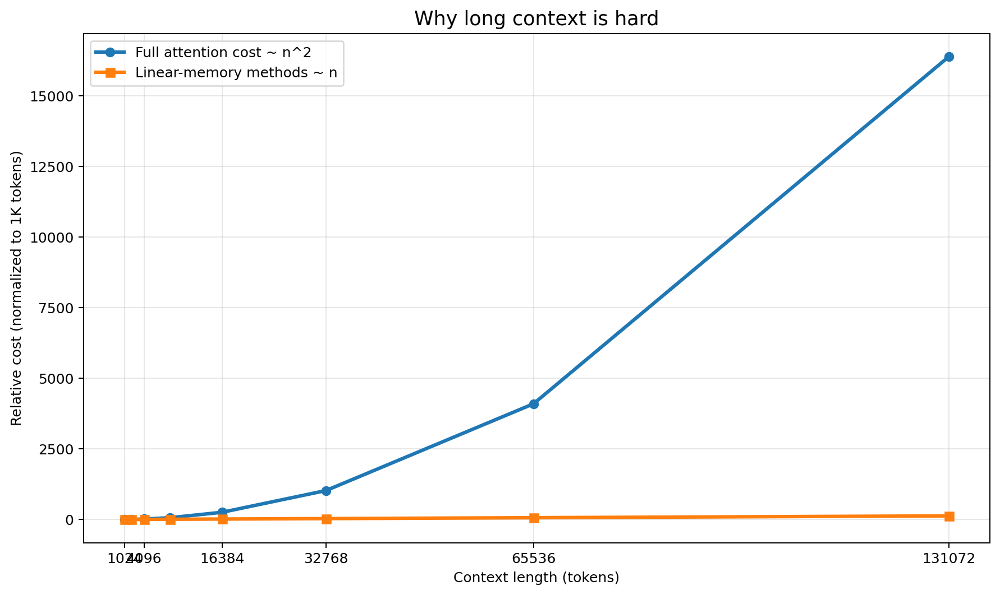
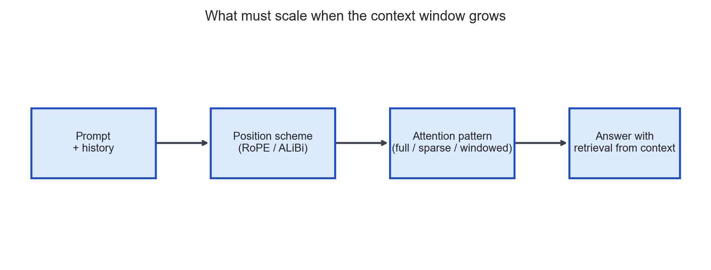
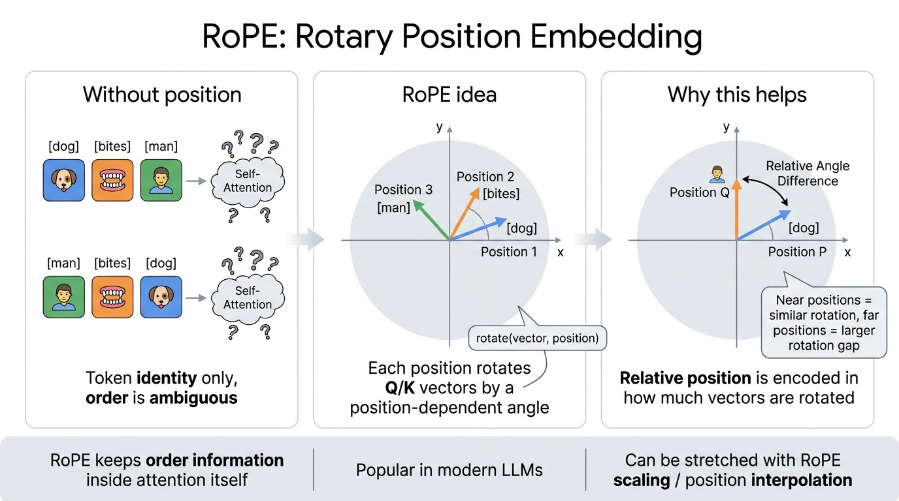
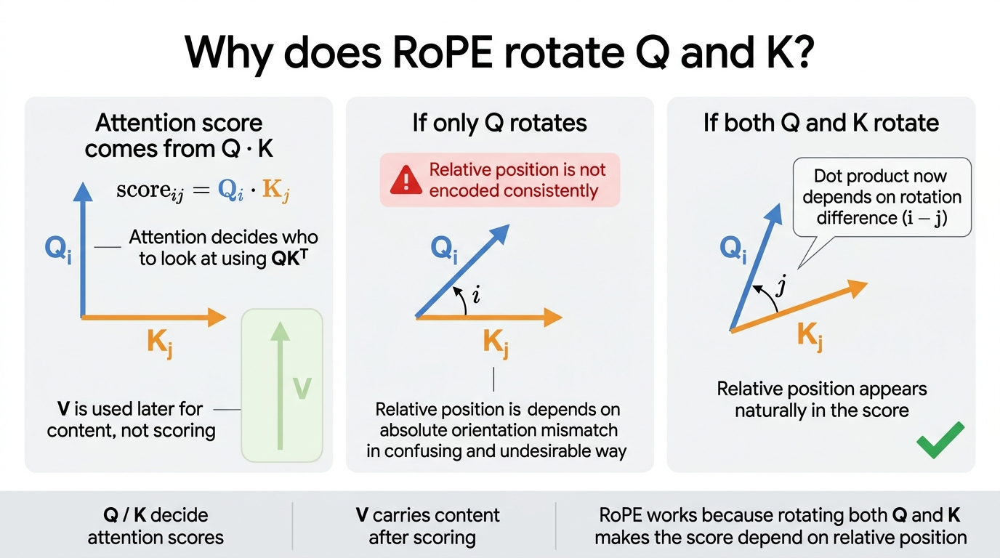
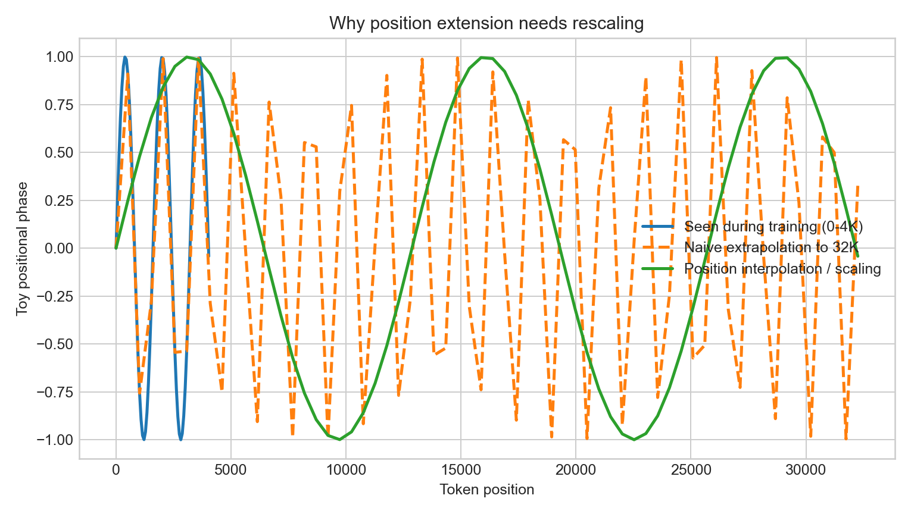
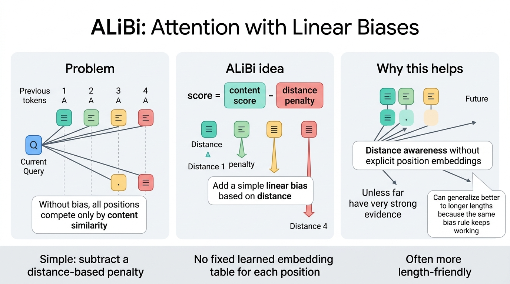
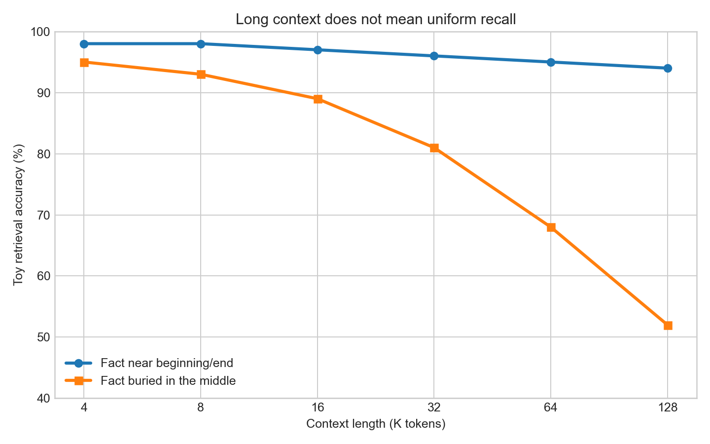

# Day 19：上下文窗口（Context Window）

> **核心问题**：既然很多模型都宣传支持 128K、200K，甚至 1M token 的上下文，为什么超长 prompt 依然常常又贵、又慢、还会“忘东西”？

---

## 开场

所谓**上下文窗口（Context Window）**，就是模型在一次前向计算里，最多能同时看到多少 token。这个定义看起来很简单，但它其实藏着三个完全不同的问题：

1. **模型在技术上能不能接收这么长的输入？**
2. **系统在成本和延迟上能不能承受？**
3. **模型到底能不能真正用好这些信息，而不只是“塞进去”？**

这三个问题，不是一回事。

宣传里的长上下文往往很直接：“这个模型支持 1M token。” 但工程上的真实问题是：“我能不能把这么长的 prompt 放进显存？注意力计算会不会爆炸？位置编码在超出训练范围后会不会失真？如果一个关键事实埋在中间几十万 token 的位置，模型还能不能把它找出来？”

可以把上下文窗口想成一张书桌。桌子变大，当然可以摊开更多资料，这很好。但如果桌上堆满了纸，你找关键文件会越来越慢。如果整理系统本身很差，那么“更大的桌子”可能只是让你把重要文件丢在中间的某一堆里。

所以，长上下文既是模型能力问题，也是系统问题。本文会解释：上下文窗口到底是什么，为什么它会成为瓶颈，模型是如何从 2K 一路扩展到 1M 的，为什么“lost in the middle（中间遗失）”仍然存在，以及长上下文和检索、记忆、推理成本之间到底是什么关系。

---

## 1. 上下文窗口到底意味着什么

**一句话总结**：上下文窗口，就是模型在当前这一步生成时，最多可以条件化的输入与历史 token 数量。

对于自回归语言模型来说，下一个 token 的分布可以写成：

$$
P(x_t \mid x_{1:t-1}).
$$

上下文窗口决定了模型最多能看到多少 $x_{1:t-1}$。如果模型的限制是 8K token，那么对话或文档一旦超过这个长度，就必须做取舍：截断旧内容、压缩成摘要、通过检索重新取回，或者交给某种外部记忆机制处理。

这个限制之所以重要，是因为 Transformer 并不是像人类一样“直接读文字”。它会先把 token 映射成向量，再加入位置信息，然后在 token 与 token 之间计算大量交互。因此，“更多上下文”意味着：

- 更多显存占用，
- 更多计算量，
- 更多注意力分散的风险。

所以，当人们说“这个模型有 128K 上下文窗口”时，通常只意味着它**可以接收** 128K token，而不意味着：

- 它对这 128K 中每个位置的理解都一样好，
- 延迟和成本依然很低，
- 它能稳定找回埋在中间的细节，
- 它在训练时真的大量见过这么长的样本。

这点非常关键：**容量（capacity）不等于有效利用（effective use）**。

---

## 2. 为什么上下文会成为关键瓶颈

**一句话总结**：长上下文难，核心原因是标准自注意力（self-attention）的代价大致会随着序列长度平方增长。

在全连接自注意力中，每个 token 都可以关注其他所有 token。如果序列长度是 $n$，那么注意力矩阵的大小就是 $n \times n$，因此核心计算成本大致是：

$$
\mathcal{O}(n^2).
$$

也就是说，序列长度翻倍，成本不是翻倍，而是接近四倍。


*图注：随着上下文长度增加，全注意力的成本增长非常快。这也是为什么长上下文推理即使模型结构不变，也会显著变贵。*

这种二次增长主要体现在两个方面：

1. **计算量**：token 两两交互越来越多。
2. **内存与带宽**：更长序列意味着更大的 KV Cache，要持续存储并读取更多 key/value。

这也是为什么早期 Transformer 经常停留在 512、1K、2K 这样的位置。几千 token 在当时就已经不便宜。要把上下文扩展到 32K、128K 甚至更大，必须同时依靠算法优化和系统优化。

可以把它想成一个会议室。10 个人时，让每个人都和每个人沟通还算可控。1 万个人时，如果还是“所有人都和所有人交流”，整个系统会立刻失控。长上下文带来的，就是这种组合爆炸。

---

## 3. 长上下文背后的三个技术难点

**一句话总结**：想把上下文做长，至少要同时解决位置表示、注意力效率、和内存管理这三个问题。


*图注：长上下文不是一个单点技巧，而是位置编码、注意力模式和服务系统一起扩展的结果。*

### 3.1 位置表示必须在超长距离下依然成立

Transformer 需要位置信息，因为如果只有自注意力而没有位置编码，模型对输入顺序并不敏感。比如 “dog bites man” 和 “man bites dog” 会变得过于相似。

因此，长上下文模型首先需要一种在超长距离下依然稳定的**位置编码（Positional Encoding）**。常见方案包括：

- **RoPE（Rotary Position Embedding，旋转位置嵌入）**
- **ALiBi（Attention with Linear Biases，线性偏置注意力）**

困难在于，很多模型预训练时只见过 4K 或 8K 左右的长度。如果你直接把它拉到 32K、128K，本质上是在做超出原训练范围的外推。此时位置表示可能失真，或者模型对远距离位置的“感知”不再稳定。

### 3.2 注意力成本不能无限爆炸

就算位置编码还勉强能用，标准全注意力在长序列上仍然太贵。所以工程上常见几种思路：

- 用更高效的 kernel，例如 **FlashAttention**，减少内存搬运；
- 用**稀疏注意力（Sparse Attention）**或**局部注意力（Local Attention）**，避免每个 token 都看所有 token；
- 用**滑动窗口注意力（Sliding-Window Attention）**，让 token 主要关注附近内容，只给少量全局 token 更大可见范围；
- 用 chunk、摘要、递归式状态等方式，把更早的内容压缩处理。

### 3.3 服务系统的内存也必须撑得住

在生成阶段，模型通常会缓存历史 token 的 key 和 value，这就是 **KV Cache**。它的大致增长规律常写成：

$$
\text{KV memory} \propto L \times n \times h,
$$

其中 $L$ 是层数，$n$ 是序列长度，$h$ 代表和隐藏维度相关的规模因子。精确常数会受到 head 数、精度、GQA、实现方式等影响，但核心规律很简单：**上下文越长，缓存越大。**

所以，哪怕数学上“支持 128K”，在真实推理服务里也可能因为显存和带宽压力而很昂贵。

---

## 4. 模型是怎么把上下文从 2K 拉到 1M 的

**一句话总结**：长上下文通常不是靠一个神奇改动实现的，而是位置技巧、继续训练和系统优化共同作用的结果。

没有一种所有模型通用的“长上下文按钮”，但常见做法大致有这些。

### 4.1 在更长序列上继续训练

最直接的方法，就是继续用更长的样本训练或微调模型。这样模型会逐渐学会：远距离依赖是真实存在的，长距离位置关系也需要被认真建模。

这个方法虽然朴素，但代价不低。长样本更难 batch，训练更慢，数据构造也更麻烦。

### 4.2 位置插值（Position Interpolation）与 RoPE 缩放


*图注：RoPE 通过按位置对 query 和 key 向量做旋转，把相对位置信息直接编码进 attention 里。这就是为什么它不需要单独的绝对位置表，也能保留顺序信息。*

> **为什么 RoPE 要作用在 Q 和 K 上，而不是 V 上？**
>
> 因为 attention 分数是通过点积 $Q_i \cdot K_j$ 算出来的。这一步决定的是模型**该关注谁**。如果你想让位置信息直接影响 attention 分数，最自然的地方就是 **Q 和 K**。
>
> - **Q（query）** = 当前 token 在找什么
> - **K（key）** = 每个历史 token 能提供什么信息
> - **V（value）** = 在打分之后真正被取回的内容
>
> 如果只旋转 Q，不旋转 K，那么点积就没法稳定地表达相对位置。但如果 **Q 和 K 都按各自位置旋转**，点积就会自然依赖于**旋转差**，也就是相对位置。
>
> 一句话说：**Q/K 决定“看谁”，所以 RoPE 应该放在这里；V 负责“看到了什么”，它不参与打分。**


*图注：RoPE 作用在 Q 和 K 上，是因为 attention 分数来自 $QK^T$。两边一起旋转后，分数自然会依赖相对位置。V 不参与打分，所以通常不需要旋转。*

对于使用 RoPE 的模型，一个很常见的技巧是对位置做**重缩放（rescaling）**，让更长的推理范围，映射到模型训练时更熟悉的频率空间中。

| 图的直观解释 | 图示 |
|---|---|
| **蓝线：Seen during training (0–4K)**<br><br>表示模型训练时真正见过的位置范围。对模型来说，这是“正常工作区间”，它已经学会了这套平滑的位置变化规律。<br><br>**橙色虚线：Naive extrapolation to 32K**<br><br>表示如果什么都不做，直接把原来的 RoPE 硬拉到 32K，会发生什么。曲线开始剧烈震荡，说明位置信号进入了模型没学过的区域，位置感会失真。<br><br>**绿线：Position interpolation / scaling**<br><br>表示做了位置插值或缩放之后的效果。它把更长的位置范围压缩回模型更熟悉的尺度，所以曲线重新变得平滑、稳定。<br><br>**这张图真正想表达的是：**<br>不是说绿线“更正确”，而是说如果不做 rescaling，RoPE 在超长位置上会进入模型没学过的区域。缩放/插值的目的，是让超长上下文的位置模式看起来更像训练时见过的模式。<br><br>**代价：** 这种压缩虽然更稳定，但也会让很远的位置彼此更难区分。本质上是在用一部分位置精度换更大的上下文范围。 | <br><br>*图注：如果直接把位置编码外推到远超训练范围的位置，位置相位可能会变形。位置插值或缩放，本质上是把更长的范围压回一个更稳定的区域。* |

### 4.3 ALiBi 这类更利于长度外推的方案


*图注：ALiBi 给 attention 分数加入一个简单的距离惩罚。距离越远，惩罚越大，因此模型天然具有距离感，而不需要为每个绝对位置学习一张固定的位置嵌入表。*

ALiBi 通过在线性偏置中编码距离信息，而不是依赖固定的绝对位置嵌入，因此在某些设置下对更长输入长度的泛化会更自然。但它也不是“永远更好”，具体效果仍取决于模型架构和训练方式。

### 4.4 稀疏或混合注意力

有些架构通过局部注意力加少量全局连接来降低成本。可以把它想成读一本很长的书时，你对当前这一章的内容最敏感，同时保留目录、书签或章节摘要作为跨段跳转入口。

> **这是怎么做到的？**
>
> 核心就是修改 **attention mask / 连接模式**。
>
> 在 full attention 里，第 *i* 个 token 可以看 1 到 *n* 的所有 token。到了 sparse attention，第 *i* 个 token 只允许看：
> - 自己附近的一小段 **局部窗口（local window）**
> - 再加上少数几个特殊的 **全局 token（global tokens）**
>
> **例子：** 如果当前 token 在位置 1000，它可能只看位置 992–1008（附近邻居），再加上几个锚点，比如：
> - 第一个 token
> - 某个段落 summary token
> - 或者人工指定的 global token
>
> 所以模型不是“看全世界”，而是只看 **附近 + 少量远程捷径**。
>
> **为什么这样更便宜？** 原来每个 token 都要和全部 *n* 个位置比较；现在只需要和一个小窗口再加几个全局锚点比较。这样成本就能从二次增长，压到更接近线性。
>
> **代价是什么？** 如果重要信息很远，而且不在这些稀疏连接路径上，就更难被取到。信息必须靠局部窗口一层层传过去，或者通过某个全局 token 像中继站一样转发。

### 4.5 外部检索，而不是一股脑全部塞进上下文

超长上下文不是唯一的路。很多系统会通过检索把最相关的几段内容取出来，再放进 prompt。这样做，本质上是把一部分负担从模型的原始上下文容量，转移到了外部索引与检索系统上。

这也是为什么**长上下文**和 **RAG（Retrieval-Augmented Generation，检索增强生成）**并不是非此即彼的替代关系，而往往是互补关系。长上下文适合保留连续性、处理整篇文档、或者要求精确引用的场景。检索则适合“语料库巨大，但当前真正相关的只有少数几段”的情况。

---

## 5. 为什么长上下文依然会失败，“中间遗失”问题

**一句话总结**：模型往往更容易找回 prompt 开头或结尾的信息，而不擅长找回埋在中间的细节。

长上下文研究里，一个非常重要的发现是：模型对不同位置的信息利用能力，并不是均匀的。


*图注：这是一个示意图。常见现象是，位于 prompt 开头或结尾的事实更容易被找回，而埋在中间的信息更容易丢失。*

很多评测都观察到类似规律：如果关键信息位于以下位置，模型通常表现更好：

- prompt 开头，
- prompt 结尾，
- 被重复多次，
- 被结构化标记得很明显。

而如果关键信息被埋在一个很长、很松散、没有结构的中间区域里，模型往往更容易漏掉。这种现象就叫 **lost in the middle（中间遗失）**。

为什么会这样？

1. **注意力稀释（attention dilution）**：候选信息太多，真正重要的信号被噪声淹没。
2. **位置偏置（position bias）**：模型和训练分布可能天然更偏向前面和后面的信息。
3. **提示结构问题**：开头通常是任务说明，结尾通常是最新消息，中间内容往往最缺乏显著标记。

可以类比成翻邮件线程。你通常记得最早的任务要求，也记得最新的一封回复。但第 17 封邮件中间的一句细节，最容易被忽略。

所以，当一个模型宣传“支持 1M context”时，真正该问的问题不只是“能不能装下 1M”，而是“如果关键信息藏在第 523,814 个 token 附近，它还能不能可靠地拿出来？”

---

## 6. 长上下文、记忆（Memory）和 RAG 的区别

**一句话总结**：长上下文更像临时工作记忆，不等于持久记忆，也不等于检索系统。

这三个概念很容易被混在一起，但它们其实是不同层次的问题。

### 6.1 长上下文

这是模型**当前这一轮**能直接看到的内容。

### 6.2 检索

这是模型外部的系统，在更大的语料库中查找相关内容，再把结果塞回 prompt。

### 6.3 记忆

在 agent 系统里，memory 往往指跨轮次、跨会话的持久状态，比如：

- 用户偏好，
- 历史摘要，
- 向量数据库，
- 任务状态，
- 长期笔记。

更大的上下文窗口当然有帮助，因为你可以少做一些摘要，保留更多原始历史。但它并不等于“已经拥有记忆系统”。如果你把 500 页内容一股脑塞进 prompt，模型未必更聪明，反而可能被无关信息拖慢。

一个实用的经验是：

- **长上下文**适合有限范围内的连续信息保留，
- **RAG**适合超大知识库里按需取回关键信息，
- **Memory**适合长期保存跨时间的状态。

真正好用的 agent 系统，通常是三者结合。

---

## 7. 工程上的实际权衡

**一句话总结**：更大的上下文窗口提升了灵活性，但也带来了更高的延迟、成本，以及更严格的 prompt 设计要求。

### 7.1 token 越多，钱和延迟越高

即便模型支持长上下文，把 100K token 喂进去往往也非常贵。很多时候，预填充（prefill）阶段就已经占据了主要延迟，尤其当用户真正只需要一个小答案时，这种做法并不划算。

### 7.2 prompt 结构的重要性更高，而不是更低

长 prompt 很容易变成一个杂物抽屉。任务说明、证据材料、无关文本混在一起时，模型反而更容易抓错重点。因此结构化非常重要：

- 用明确标题分段，
- 用分隔符区分不同来源，
- 给关键信息加引用或编号，
- 先放摘要，再附原文，
- 在关键位置重复提醒任务目标。

### 7.3 名义窗口不等于有效窗口

模型可能“技术上支持 200K”，但在你的任务上真正能稳定利用的部分远小于 200K。所以厂商给出的窗口数字，最好理解成上限，而不是质量保证。

### 7.4 长上下文的收益高度依赖任务类型

有些任务非常适合长上下文：

- 法律文档审阅，
- 大代码库导航，
- 超长会议记录总结，
- 书籍或研究报告级别的长文分析。

但并不是所有问题都适合“暴力塞满”。对于一个短事实问答，检索加短 prompt 往往比整包长文本输入更有效。

---

## 8. 一个很小的代码例子，窗口超限时怎么办

**一句话总结**：当原始对话长度超过窗口时，系统通常会保留最新内容，并对更早历史做截断或摘要。

```python
def fit_into_window(tokens, max_window, reserve_for_answer=1024):
    budget = max_window - reserve_for_answer
    if budget <= 0:
        raise ValueError("max_window must exceed answer reserve")

    if len(tokens) <= budget:
        return tokens

    # 这里只保留最近的 token。
    # 真实系统里，通常还会保留 system prompt、
    # 工具输出、以及对更早历史的摘要。
    return tokens[-budget:]
```

这个例子当然非常简化。真实系统通常会同时保留：

- system prompt，
- 工具调用结果，
- 检索出的证据段落，
- 较早历史的摘要，
- 最近几轮的原始消息。

但这个例子说明了一个很现实的事实：**上下文窗口本质上是预算（budget）**。预算超了，就必须有策略。

---

## 9. 常见误解

### ❌ “1M token 上下文，说明模型能一样好地理解这 1M 中的每一部分。”

不是。能装下，和能均匀高质量利用，是两回事。

### ❌ “长上下文会让 RAG 过时。”

不会。检索依然重要，因为它能减少无关信息，提升模型聚焦程度。

### ❌ “上下文窗口只是一个软件开关。”

不是。它同时牵涉模型架构、位置编码、训练分布、推理 kernel，以及 GPU 内存。

### ❌ “只要 prompt 能塞进去，问题就解决了。”

未必。你可能只是解决了“存得下”，但没有解决“用得好”。

---

## 10. 延伸阅读

### 入门

1. [Lost in the Middle: How Language Models Use Long Contexts](https://arxiv.org/abs/2307.03172)  
   讨论为什么模型对长 prompt 中间位置的信息利用较差，是理解长上下文局限性的代表性论文。

2. [RoFormer: Enhanced Transformer with Rotary Position Embedding](https://arxiv.org/abs/2104.09864)  
   RoPE 的经典论文，很多现代 LLM 都建立在它的思路上。

3. [FlashAttention: Fast and Memory-Efficient Exact Attention with IO-Awareness](https://arxiv.org/abs/2205.14135)  
   解释为什么注意力性能瓶颈很多时候不只是算力，而是内存读写。

### 进阶

1. [Train Short, Test Long: Attention with Linear Biases Enables Input Length Extrapolation](https://arxiv.org/abs/2108.12409)  
   ALiBi 论文，适合理解长度外推的直觉。

2. [Extending Context Window of Large Language Models via Positional Interpolation](https://arxiv.org/abs/2306.15595)  
   位置插值的重要参考文献，解释了 RoPE 系模型如何扩展到更长上下文。

3. [Ring Attention with Blockwise Transformers for Near-Infinite Context](https://arxiv.org/abs/2310.01889)  
   展示了算法和系统如何一起演进，去支持极长上下文。

---

## 思考题

1. 如果一个模型支持 128K context，但对中间位置的信息提取很差，你会怎么重构 prompt 或检索流程？
2. 在什么情况下，即使模型支持长上下文，也仍然更应该优先使用 RAG？
3. 如果位置插值通过压缩距离来扩展上下文，那么在极长距离下可能会引入哪些误差？

---

## 总结

| 概念 | 一句话解释 |
|------|------------|
| Context Window | 模型一次前向中最多能条件化的 token 数量 |
| 核心瓶颈 | 标准自注意力的成本大致随序列长度按 $\mathcal{O}(n^2)$ 增长 |
| 位置扩展 | RoPE 缩放、位置插值、ALiBi 等方法帮助模型超出原训练长度工作 |
| Lost in the Middle | 长 prompt 并不会被均匀利用，中间位置的信息常更难找回 |
| 实践启示 | 更大的窗口很有用，但 prompt 结构、检索和记忆设计依然同样关键 |

**关键结论**：上下文窗口的故事，并不是“2K 变成了 1M”这么简单。真正重要的是，Transformer 在看得更多之后，如何避免自己被成本、位置失真和无关细节拖垮。更大的窗口当然有价值，但更重要的是学会三件事：哪些信息应该直接放进窗口，哪些应该按需检索，哪些应该被总结成更稳定的记忆。

---

*Day 19 of 60 | LLM Fundamentals*  
*字数：约 4300 中文字 | 阅读时间：约 18 分钟*  
