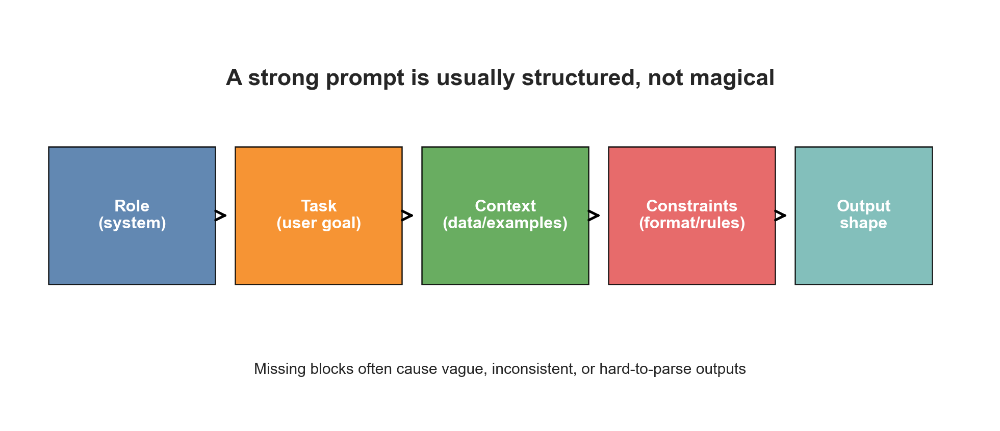
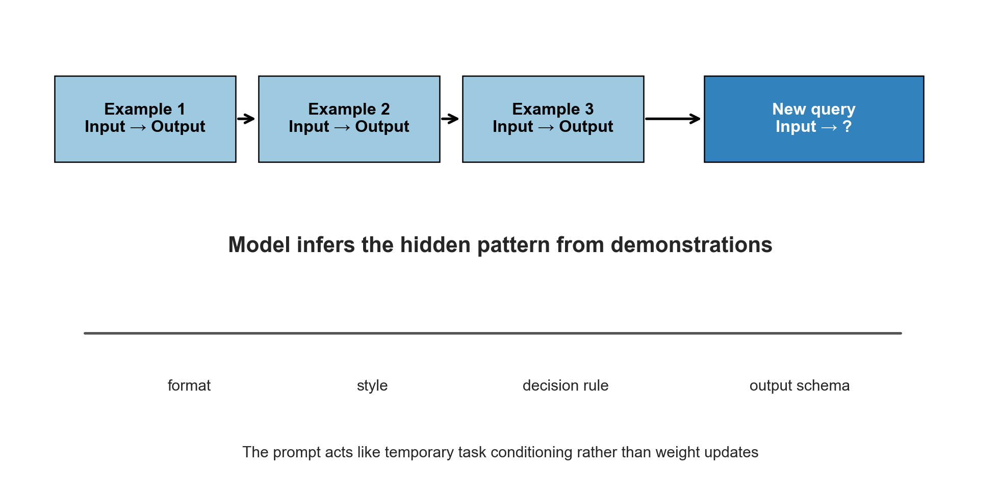
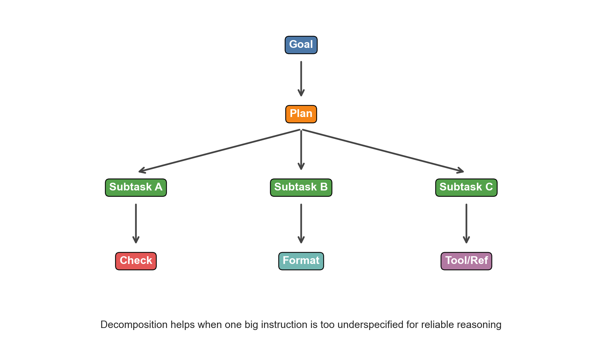
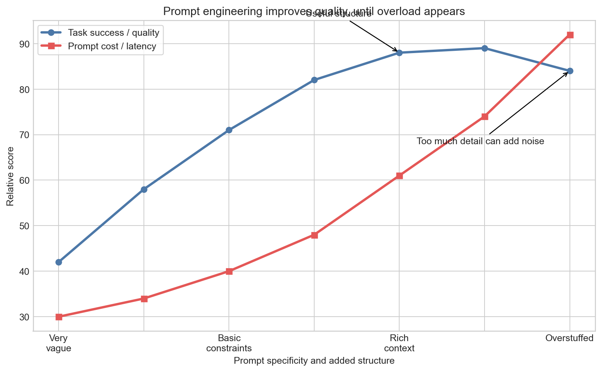

# Day 20：Prompt Engineering（提示工程）

> **核心问题**：如果大语言模型已经在互联网海量文本上预训练过了，为什么 prompt 只改几句话，回答质量就会明显变化？

---

## 开场

很多人第一次听到 Prompt Engineering，会觉得它有点像玄学。无非就是“换个说法”而已，为什么会这么重要？

真正的关键在于，prompt 不只是一个问题，它是模型在当前这一轮推理里看到的**全部工作上下文**。你给模型放进去什么指令、什么例子、什么约束、什么资料，以及这些内容出现的顺序，都会影响它接下来每一个 token 的概率分布。

如果说预训练让模型拥有了一个巨大的压缩知识库，那么 prompt 做的事，就是在当前时刻告诉模型：“请把注意力优先放到这一类知识、这一种任务形式、这一套输出规范上。”

一个很有用的类比是：模型权重像一座图书馆，prompt 像图书管理员。图书馆里书很多，但你要让管理员明确知道，现在要拿的是哪几本书，是写技术报告、做情感分类，还是按照 JSON schema 返回结果。

所以 prompt 的作用，不是凭空给模型增加新知识，而是**激活正确的先验、组织正确的上下文、约束正确的输出行为**。

这也是为什么 prompt engineering 本质上不是“咒语工程”，而是“临时任务设计”。你是在给一个能力很强、但不会主动猜对你全部意图的助手做 briefing。你说“帮我处理一下”，和你说“总结以下日志，只保留用户可见影响、根因和缓解措施，用 5 条 bullet 输出”，效果当然不一样。

这篇文章会讲清楚：prompt engineering 到底改变了什么，它为什么有效，常见的设计模式有哪些，什么时候 prompt 有用，什么时候其实该上 retrieval、tool use 或 fine-tuning。

---

## 1. Prompt engineering 到底改变了什么

**一句话总结**：Prompt engineering 改变的是模型在当前上下文条件下的输出分布，而不是直接改模型参数。

自回归语言模型生成答案的方式可以写成：

$$
P(y \mid x) = \prod_{t=1}^{T} P(y_t \mid x, y_{<t}),
$$

其中 $x$ 是 prompt，$y$ 是输出序列。只要你改了 prompt，也就是改了 $x$，后面每一个 token 的条件概率都会变化。

这个公式看起来平平无奇，但它揭示了一个重要事实：模型并不是在权重里藏着一个固定答案，然后被你“取出来”。它是在很多可能续写之间做概率选择。prompt 发生变化，就可能让概率质量转移到另一种回答风格、另一条推理路径，甚至另一个最终结论上。

这就是为什么同一个模型，可能因为 prompt 不同而表现成：

- 一个严格返回 JSON 的 API，
- 一个从基础概念慢慢讲起的老师，
- 一个啰嗦但不够聚焦的聊天对象，
- 或者一个会先规划、再用工具、最后校验的 agent。

这些能力未必是“新学会”的，很多时候本来就潜伏在模型里。prompt 的作用是把哪一类行为变成当前最有可能的行为。


*图注：一个有效的 prompt 往往不是一句话，而是由角色、任务、上下文、约束和输出格式共同组成。*

实际工程里，可以把 prompt 拆成五个常见模块：

1. **Role（角色）**：模型现在以什么身份来完成任务？
2. **Task（任务）**：到底要它做什么？
3. **Context（上下文）**：应该基于哪些资料、样例或背景信息？
4. **Constraints（约束）**：必须遵守哪些规则？
5. **Output format（输出格式）**：结果应该长成什么样？

很多 prompt 失败，其实不是模型“笨”，而是这五个模块里缺了一块。任务清楚但输出格式没说，结果可能“答对了但不好用”。格式说清楚了，但证据没给够，结果可能“格式很漂亮但内容是错的”。

---

## 2. Prompt 为什么会有效

**一句话总结**：Prompt 有效，是因为 Transformer 本来就是在做“基于上下文的续写”，而 prompt 正是在定义当前这个上下文场景。

预训练阶段，模型见过无数文本模式：问题后面跟答案，文档后面跟摘要，日志后面跟诊断，需求后面跟代码，指令后面跟执行结果。它学到的不是某个固定任务，而是很多“文本场景”对应的续写分布。

因此，当你写 prompt 的时候，你并不是在像传统程序一样给模型发命令，而是在搭建一个**文本环境**，让模型觉得：“哦，现在这是一个应该用某种方式继续写下去的场景。”

如果这个 prompt 看起来像老师给学生讲题，模型更容易继续以讲解风格输出。如果它看起来像几个输入输出示例组成的标注任务，模型更容易去推断其中的映射规则。如果它看起来像 API 规范，模型更容易生成结构化结果。

从注意力机制角度看，prompt 的作用也很好理解：

$$
\text{Attention}(Q, K, V) = \text{softmax}\left(\frac{QK^\top}{\sqrt{d_k}}\right)V.
$$

当你改变 prompt，就相当于改变了当前序列里的 token，从而改变了后续 token 在计算 attention 时能“看见”什么、最容易“聚焦”到哪里。

翻译成直白的话就是：prompt 会影响模型当前轮次里，哪些指令更显眼、哪些例子更像模板、哪些约束更容易被记住。

所以 wording、顺序、分隔符、示例，并不是什么神秘咒语，它们本质上是在做一件很朴素的事：**让正确模式更显著，让错误模式更不显著**。

---

## 3. In-context Learning，是 prompt engineering 的发动机

**一句话总结**：Prompt engineering 之所以强大，很大程度上依赖于 in-context learning，也就是模型能从 prompt 中的示例临时学会任务规则。

大模型一个非常反直觉的能力是：它不需要更新参数，只靠 prompt 里的几个例子，就能推断出你想让它做什么。这就是 **In-context Learning（上下文学习）**。

比如 prompt 里写：

- `great -> positive`
- `terrible -> negative`
- `boring -> negative`
- `excellent -> ?`

模型大概率会推断出这是一个情感分类任务，并输出 `positive`。


*图注：Few-shot prompting 不只是“给几个例子”，它实际上在告诉模型任务边界、输出格式、判断规则。*

为什么 few-shot prompt 往往比纯文字描述更有效？因为例子更具体。自然语言指令有时会含糊，但例子把“真正想要的映射关系”钉死了。

精心选择的示例，通常同时传达了几层信息：

- 输出应该是什么格式，
- 哪些信息算相关证据，
- 需要多详细，
- 边界情况怎么处理，
- 什么样的错误最不能接受。

可以把它想象成教新人做表格。如果你只说“按规范填写”，对方可能一脸茫然。但你给他看三份填好的样例，他就更容易猜到模式。

当然，few-shot prompting 也有代价。它会占用上下文窗口，也可能把模型过度锚定在某几个示例上。如果示例本身选得不好，模型学到的就是错误规则。所以 prompt engineering 很重要的一步，是判断这个任务到底更适合靠**文字规则**，还是靠**样例演示**来定义。

---

## 4. 真正重要的 prompt 模式

**一句话总结**：大多数有价值的 prompt engineering，并不是不断堆小技巧，而是掌握少数稳定有效的设计模式。

### 4.1 Instruction-first，先把任务说清楚

对于现代 instruction-tuned 模型，最稳妥的做法通常是先明确任务，再给补充材料。

不太好的写法：

> 下面是很多日志、背景、备注和上下文，顺便帮我总结一下事故。

更好的写法：

> 请将这次事故总结成 5 条 bullet，重点写用户影响、根因和缓解措施。日志见下方。

先写任务的好处是，模型一开始就建立了任务框架。后面的上下文会更容易被它解释成“完成这个任务所需要的证据”。

### 4.2 用分隔符把指令和资料分开

如果 prompt 里同时包含“指令”和“待分析内容”，最好用明确边界把它们隔开，比如 XML 标签、markdown 代码块或清晰的 section header。

例如：

```text
Task: Answer only from the provided document.

<Document>
...
</Document>
```

这样做的价值在于，模型不容易把资料区里的内容错当成命令，也更容易理解哪些文本是“引用材料”，哪些文本是“操作说明”。

### 4.3 明确输出 schema

如果你要的是给程序消费的结果，不要只说“结构化一点”，而要把结构直接写出来。

```json
{
  "severity": "low|medium|high",
  "root_cause": "string",
  "actions": ["string"]
}
```

模型对显式约束的适应能力，通常比对模糊期待强得多。

### 4.4 Few-shot prompting

当任务边界比较微妙，比如分类、抽取、风格模仿、格式转换时，few-shot 往往很有帮助。它不是在增加知识，而是在把决策边界变具体。

### 4.5 Decomposition，把复杂任务拆小

如果一个 prompt 里同时要求“分析、验证、排序、格式化、总结”，模型很容易顾此失彼。此时更好的办法往往是拆步骤。


*图注：把大任务拆成较小子任务，可以减少歧义，也更容易在中间步骤做检查。*

这也是为什么 agent 系统会越来越重要。很多强 agent 的本质，并不是突然更聪明了，而是把 prompt engineering、工具调用、状态管理和校验流程组合起来了。

### 4.6 不只要答案，也要检查条件

如果任务有客观约束，不妨直接要求模型在输出前做检查。

例如：

- “最终回答前，检查每个结论是否都能在给定文本中找到依据。”
- “如果必填字段缺失，请返回 INVALID。”
- “把事实和假设分开列出。”

这不能保证百分之百正确，但可以显著提高错误可见性。

---

## 5. 为什么有些 prompt 能提升“推理能力”

**一句话总结**：一些 prompt 提升的不是模型本体智力，而是让模型把推理计算花在更合理的中间步骤上。

最著名的例子是 **Chain-of-Thought（思维链）** prompting，也就是要求模型“step by step”地推理。在数学题、逻辑题、符号推理等任务上，这种方法经常会提升表现。

为什么会这样？一种直观理解是：当模型生成中间推理 token 时，这些 token 本身就成了后续推理的新上下文，相当于草稿纸。模型不再是从题目直接跳到答案，而是先构造一个临时的推理轨迹。

如果把答案概率理解成依赖于中间状态 $z$，那么可以写成：

$$
P(y \mid x) = \sum_z P(y \mid z, x) P(z \mid x).
$$

思维链 prompting 可以理解成：把某些有用的中间状态 $z$ 显式地写出来，而不是完全隐含在一次续写里。

但这件事也容易被误解。它并不意味着“只要让模型多写几步，就一定更聪明”。事实上：

- 不是每个任务都需要长推理链，
- 啰嗦的中间步骤有时会把模型带偏，
- 某些产品场景不希望暴露完整推理过程，
- 新一代系统很多时候会用隐藏推理或多阶段 scaffolding 来获得类似收益。

所以更深的结论不是“永远让模型 step by step”，而是：**好 prompt 的作用，是把计算预算引导到真正难的部分上。**

---

## 6. Prompt engineering 和 fine-tuning 的边界

**一句话总结**：Prompt engineering 更灵活、更便宜，fine-tuning 更稳定、更适合高频重复行为固化到模型里。

什么时候该继续调 prompt，什么时候该考虑 fine-tuning？

Prompt engineering 更适合：

- 任务变化快，
- 你需要快速迭代，
- 运行时可以动态提供上下文，
- 行为差异主要体现在格式、策略、路由或工作流程上。

Fine-tuning 更适合：

- 某种行为会被大量重复调用，
- 你希望行为在很多输入上都很稳定，
- few-shot 示例太长，不适合每次都塞进 prompt，
- 你希望模型把某种狭窄分布真正“内化”。

一个很粗略但有用的视角是：

$$
\text{总成本} \approx \text{每次请求的 prompt token 成本} \times N
\quad \text{vs.} \quad
\text{一次性微调成本} + \text{更短的运行时 prompt}。
$$

如果请求次数 $N$ 很大，长 prompt 的推理成本会越来越痛。很多生产系统因此会先靠 prompt engineering 快速验证需求，等任务稳定后，再把一部分行为迁移到 fine-tuning 或系统规则中。

换句话说，prompt engineering 是最快的控制面，fine-tuning 是更重的结构性改造。

---

## 7. Prompt 常见失败模式

**一句话总结**：大多数 prompt 失败，不是因为模型突然失灵，而是因为任务规格、显著性、上下文负担或验证流程出了问题。

### 7.1 目标太模糊

“帮我分析一下”这种指令几乎没有边界。分析什么？风险？情绪？时间线？根因？给谁看？

### 7.2 约束互相冲突

如果你同时要求“尽量简洁”又要求“覆盖所有细节”，模型只能猜哪条指令更重要。

### 7.3 上下文过载

更多上下文不一定更好。无关内容太多，反而会淹没真正有价值的信息。


*图注：有效的 prompt 往往先通过增加结构和约束提升质量，但一旦塞入过多无关信息，效果和延迟都可能恶化。*

一个很好用的经验法则是：**加入那些会改变正确答案的信息，删掉那些只会增加噪声的信息。**

### 7.4 没说输出格式

你要表格、列表、JSON、排序结果还是引用片段？如果不明确说，模型就只能猜。

### 7.5 没要求 grounded answer

如果任务要求“只能基于给定文档回答”，必须明确写出来。否则模型很可能会把外部先验知识也混进来，生成看起来合理但没有依据的内容。

### 7.6 没有验证环节

高风险任务很少能靠一次 prompt 就稳稳完成。更好的做法通常是引入校验、工具、第二轮检查，甚至多阶段 pipeline。

这也是现代 LLM 系统设计的一个重要转向。早期大家迷信“一条完美 prompt”。现在更成熟的做法是：**prompt pipeline + retrieval + tools + validation + structured outputs**。

---

## 8. 一个实用的 prompt 设计流程

**一句话总结**：先定义输出和失败模式，再反推 prompt 里最少需要哪些结构，而不是一上来堆华丽措辞。

这里给一个实用流程。

### 第一步：先定义“什么叫成功”

最终答案应该长什么样？哪些错误最常见，但绝对不能接受？

### 第二步：先锁定输出格式

如果结果要给下游程序或团队成员消费，先把 schema、字段和格式写清楚。

### 第三步：只加入必要上下文

不是所有背景信息都该塞进去。只放那些会改变结论、缩小歧义、提升判断质量的内容。

### 第四步：加入约束

例如：

- “每个结论都要引用原文依据。”
- “如果资料不足，明确说 insufficient information。”
- “不得使用外部知识。”

### 第五步：如果还含糊，再上 few-shot

尤其是分类边界微妙、抽取格式复杂或风格要求细的时候，几个样例常常比大段说明更有效。

### 第六步：用困难样本测试

不要只测容易样本。要测边界条件、噪声输入、缺失字段、冲突证据和反例。

### 第七步：判断这到底是不是 prompt 问题

很多团队会不断改 prompt，但真正的问题可能是：检索没做好、工具缺失、数据不干净，或者模型本身太弱。

Prompt engineering 很强，但它不是万能补丁。

---

## 9. 常见误区

**一句话总结**：Prompt engineering 最大的误区，是把它当成神秘话术，而不是临时任务规格设计。

### 误区 1：存在一条万能 prompt

不存在。prompt 高度依赖任务，也依赖模型。

### 误区 2：prompt 越长越好

也不对。有用信息会帮助模型，无关冗长只会拖累效果和延迟。

### 误区 3：模型越来越强，prompt engineering 就会消失

只对了一半。低级措辞敏感性可能会下降，但**规格设计**永远不会消失。再聪明的助手，也需要清晰目标、正确上下文、明确约束和可验证输出。

### 误区 4：prompt engineering 只是换换说法

这也不对。真正重要的部分是任务设计，包括：示例、结构、检索、工具、验证、输出契约，而不只是措辞修饰。

---

## 可选数学部分：为什么示例会改变决策边界

对于一个类似分类的任务，模型最终会选择：

$$
\hat{y} = \arg\max_y P(y \mid x).
$$

few-shot 示例改变了 prompt，也就是改变了 $x$，于是不同候选标签的相对概率排序就可能变化。如果示例把任务边界表达得更清楚，那么正确标签 $y^*$ 相对于错误标签 $y'$ 的 margin

$$
\Delta = \log P(y^* \mid x) - \log P(y' \mid x)
$$

通常会变大。

这不是在推理时做梯度更新，而是模型在更丰富上下文下进行了一次不同的条件计算。

---

## 延伸阅读

- Brown 等，*Language Models are Few-Shot Learners*（2020）
- Wei 等，*Chain-of-Thought Prompting Elicits Reasoning in Large Language Models*（2022）
- Reynolds 与 McDonell，*Prompt Programming for Large Language Models*（2021）
- Anthropic、OpenAI 等官方 prompt 指南

---

## 思考题

如果你现在要优化一个 LLM 应用，但只能改一个地方，你会改 prompt、retrieval、输出 schema，还是 validation loop？这个选择往往能暴露你认为系统真正的瓶颈在哪里。

---

## Takeaway

Prompt engineering 最适合被理解为：**为模型的临时认知过程做接口设计**。你不是在念咒，而是在安排它此刻应该看到什么、先关注什么、必须遵守什么、最后怎么交付。

最好的 prompt 从来不是因为它用了某个神秘短语，而是因为它让任务变得“可读”了：目标清楚、上下文相关、约束明确、输出可验证。

也正因为如此，prompt engineering 不是什么边角技巧，它其实是 LLM 系统工程的第一层。一旦一条 prompt 不够了，我们自然就会继续往上搭 retrieval、tools、memory 和 agents。