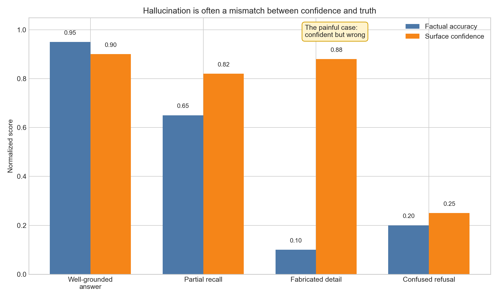
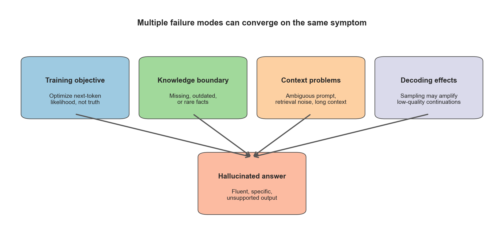
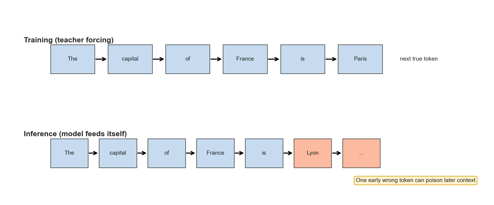
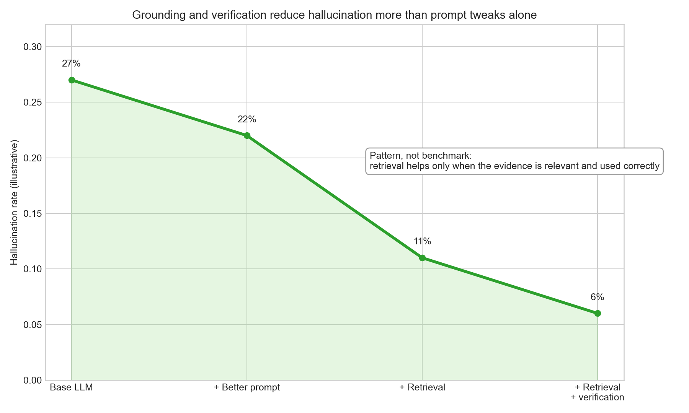

# Day 21：The Hallucination Problem（幻觉问题）

> **核心问题**：为什么大语言模型有时会给出听起来非常自信、细节丰富、措辞专业，但其实是错误的答案？

---

## 开场

如果你问一个计算器 17 × 19 等于多少，你通常只期待两种结果。要么它给出正确答案，要么它因为没电之类的原因直接失效。你**不会**期待它一本正经地写一段话，说答案是 347，因为“在实际场景中这个乘法通常会向上取整”。

而大语言模型最让人不安的地方，就在于它真的会出现这种“第三种失败模式”。

所谓 hallucination（幻觉），并不只是普通的答错。人也会犯错，模型也会算错、理解错。幻觉更特殊，它指的是一种**流畅、合理、却缺乏支撑**的输出。模型会把上下文里统计上“像是应该出现”的内容补齐出来，即使这些内容其实并没有事实依据。

这件事之所以重要，是因为语言模型优化的目标是“把文本续写得像样”，而不是“维护一套内部真值账本”。如果训练数据里某类问题后面，常常跟着的是具体日期、看起来像论文的引用、或者非常完整的解释，那么模型在缺乏可靠依据时，也可能继续生成这些“长得像答案”的东西。

可以把它想象成一个很会即兴表演的演员。舞台上出现空白时，这个演员的本能不是停下来承认“我不知道”，而是尽力让剧情继续圆下去。LLM 很多时候也是这样。**连贯性**和**真实性**经常重合，但它们不是同一个目标。

这篇文章会把几个关键问题讲清楚：什么才算幻觉，它和普通错误有什么区别，为什么模型会出现这种问题，为什么“语气自信”完全不等于“内容可靠”，以及现实里真正有效的缓解手段是什么。

先说结论：幻觉不是一个单点 bug，也没有一个单点修复。它更像是几种设计选择叠加后的自然结果，包括 next-token prediction、参数记忆的不完备、上下文噪声，以及解码过程本身的不稳定性。

---

## 1. 什么才算 hallucination

**一句话总结**：最实用的理解方式是把 hallucination 看成 grounding（基于证据对齐）的失败，也就是模型生成了没有被输入、可靠记忆或外部证据充分支持的说法。

“幻觉”这个词很容易被用滥，所以先把几种情况分开很重要。

### 1.1 普通错误 vs 幻觉

普通错误，可能只是模型算错了、题意理解偏了、或者推理路径选坏了。幻觉则更具体，它包含了**凭空补充或无根据扩展**，而且是以“我知道这件事”的口吻说出来的。

例如：

- **普通错误**：模型在概率题里把条件概率和边缘概率混淆了。
- **幻觉**：模型虚构了一篇并不存在的论文，编了一个 benchmark 分数，或者把某个人从来没说过的话当成引用写出来。

这也是为什么幻觉在法律、医疗、合规、科研这些领域特别危险。越是细节丰富，看起来反而越可信。

### 1.2 几种常见幻觉类型

一个实用的分类方式是：

1. **Factual hallucination（事实性幻觉）**：关于世界的陈述是错的，比如错误的日期、定义、数字、人物信息。
2. **Citation hallucination（引用幻觉）**：虚构论文、链接、章节号、出处、引文。
3. **Reasoning hallucination（推理幻觉）**：推理步骤表面上很完整，但并没有真正被前提支持，或者内部前后矛盾。
4. **Context hallucination（上下文幻觉）**：回答和用户给的文档、消息、工具结果相矛盾。

这几类表面不同，但底层模式一样：**语言上非常顺，认识论上却很虚。**

*图注：最痛的失败模式不是“没把握也没答对”，而是“非常自信地答错”。*

这里有个很有用的词，叫 **factuality（事实性 / 事实一致性）**。它问的不是“这段话好不好看”，而是“这段话是否真的符合世界事实，或者至少符合系统当前可访问的可信证据”。

流畅性很容易做出来，事实性很难。

---

## 2. 为什么 next-token prediction 天生会把模型推向幻觉

**一句话总结**：基础训练目标奖励的是“最像合理续写的 token”，而不是“明确表达不确定性”或“先验证再回答”。

语言模型的基本训练目标是最小化 next-token prediction loss：

$$
\mathcal{L} = - \sum_{t=1}^{T} \log P(x_t \mid x_{1:t-1}).
$$

这个目标非常强大，因为语言里本来就藏着大量结构。它能让模型学到语法、语义、风格、常识、任务模式，甚至一些隐式推理能力。

但注意这个目标**没有直接写进来的东西**是什么：

- 不确定时优先承认不知道，
- 把“观察到的事实”和“自己猜的补全”区分开，
- 遇到冷门数字前先查数据库，
- 证据不足时优雅地 abstain（拒答 / 保留判断）。

如果训练数据里大量模式都是“问题后面跟着一个完整答案”，那在模型知识边界附近时，“继续给一个具体答案”往往仍然比“诚实地说我不确定”更像训练分布里的常见续写。

> **直觉上可以这样理解：** 模型未必真的很确定，但它学到了一种很强的习惯：只要前面出现了一个问题，后面通常就应该接一个具体答案。在那种“好像知道一点、但又不够可靠”的灰色地带里，生成一个看起来像答案的句子，往往仍然比说“我不确定”更像训练数据里的常见模式。换句话说，模型更早学会的是“像答题机器一样继续写下去”，而不是“在知识边界前停下来保持谨慎”。

这也是为什么模型会猜。不是因为它“故意骗人”，而是因为在标准语言建模目标下，**猜一个像样的答案**，很多时候比**停下来表达不确定性**更容易拿到局部高概率。

可以把它理解成一个被放大了无数倍的自动补全系统。自动补全很擅长“把句子接下去”，但“最可能出现的后半句”和“对一个全新问题最真实的回答”，只是一部分重叠，不是完全相同。

> **直觉上可以这样理解：** 有些时候，两者确实一致，比如 “The capital of France is ... Paris.” 这时“最可能的续写”碰巧也是真实答案。但一旦问题变得冷门、新颖，或者超出模型掌握的范围，模型未必真的知道答案。可它依然会受到很强的压力，去继续生成一个**看起来像答案**的东西，比如一个日期、一个数字、一个专有名词，或者一句特别流畅完整的话。所以，“像下一个合理短语” 和 “真的对应现实世界事实” 常常有重叠，但本质上并不是同一个优化目标。

近年的一些讨论就把问题归纳为：如果训练和评测更奖励“给出完整回答”，而不是“正确地承认不知道”，那模型学出来的行为里就会自然包含 confident guessing（自信猜测）。

---

## 3. Knowledge boundary：知识边界、过时记忆与缺乏外部世界访问

**一句话总结**：再大的模型，世界知识也是压缩的、部分的、带时间边界的，所以很多问题天然会把它推到可靠知识边界之外。

LLM 不是数据库。它不是把每条事实按键值对精确存进去，再按需取出来。它是在大量文本上学会了一个分布式的压缩表示。

这种方式非常强，但也有天然上限。

| 问题 | 它是什么意思 | 为什么重要 |
|---|---|---|
| **压缩记忆，不等于精确存储** | 权重里存的是模糊而分布式的统计记忆，不是带 provenance（出处）的可检索表 | 高频稳定事实通常可靠，但冷门 API 更新、罕见论文细节、精确引用就会弱很多 |
| **知识会过时** | 预训练模型知道的是训练截止前的世界，再加上一部分后续微调注入的信息 | 如果世界在 cutoff 之后变化了，模型就可能自信地从旧记忆作答 |
| **长尾事实更脆弱** | 稀有事实、冷门名字、边角案例在训练里获得的支持远弱于高频模式 | 模型往往擅长宏观解释，但对冷门实体、精确引用和快速变化的数据更容易出错 |

可以把 knowledge boundary（知识边界）想象成地图的边缘。地图中心画得很细，越往边缘越模糊。模型到边缘附近时，仍然倾向继续“把路画出来”，只是有些路其实是它编的。

---

## 4. 上下文层面的成因：prompt、retrieval、长上下文都可能出错

**一句话总结**：很多幻觉并不是“底模太差”，而是整个系统给模型喂了模糊、噪声大或错误的上下文。

现实里的很多生产事故，底模其实不差，问题出在系统给它的上下文不够好。

常见原因包括：

1. **Prompt 含糊**：模型分不清你是要它总结、推测、脑补，还是只允许它依据给定材料作答。
2. **约束缺失**：如果你不明确写“只能依据文档回答”，模型就可能把检索结果和自己旧记忆混在一起。
3. **检索质量差**：Retrieval-Augmented Generation（RAG）只有在检索片段相关、可读、足够时才真的能帮助 grounding。
4. **上下文过载**：prompt 很长时，关键证据可能被埋掉，或者被大量干扰信息稀释。
5. **工具输出与提示方式不匹配**：系统拿到了证据，但组织得很乱，模型最后还是总结错了。

*图注：最终暴露出来的是“幻觉答案”，但真正的根因往往来自多个上游环节。*

这也是为什么“上个 RAG 就好了”这句话很不够。RAG 只有在以下三个条件同时成立时，才会显著降低幻觉：

- 检索到了正确证据，
- 模型真的使用了这些证据，
- prompt 让“没有证据时别乱说”比“继续生成一个流畅答案”更有吸引力。

如果检索拿回来的文档看起来很相关，但其实是错的，模型反而可能**更自信地答错**，因为它现在有了“像支撑材料一样的东西”。

---

## 5. Exposure bias：为什么一个小错会越滚越大

**一句话总结**：训练时模型通常看到的是真实前缀，推理时看到的却是自己刚生成出来的前缀，所以一个早期错误会不断污染后续上下文。

另一个结构性问题，是训练和推理之间存在分布差异。

训练阶段，经常使用 **teacher forcing（教师强制）**。也就是说，预测第 $t$ 个 token 时，模型前面看到的是正确前缀 $x_{1:t-1}$。但真正生成时，它看到的是自己前面已经生成出来的内容。

这意味着，推理时的上下文分布和训练时并不一样。如果模型早早生成了一个没有依据的说法，这个说法就会变成后续 token 的输入条件。接着模型会在这个错误前提上继续展开，补出更多“看起来像细节”的内容。

*图注：推理阶段之所以脆弱，是因为模型必须从自己的猜测继续写，而不是从保证正确的前缀继续写。*

这个问题经常用 **exposure bias（暴露偏差）** 来解释。直白地说，就是：模型在训练时更常暴露于“干净、真实”的上下文，而不是“自己刚刚犯过错”的上下文。所以一旦它在生成阶段把自己带偏，后面就更容易一路偏下去。

这也解释了为什么幻觉常常不是单点发生，而是一串发生。前面错了一个事实，后面一连串细节都建立在这个假前提上，整段答案就会越写越像真的。

---

## 6. 为什么“很自信”完全不是安全信号

**一句话总结**：回答的语气、格式、术语密度，都不是可靠的真实性指标，因为模型优化的是“像样的续写”，不是“校准过的不确定性报告”。

人类非常容易被语气骗。具体数字、专业术语、整齐结构、看起来像论文的引用，都会增强“这答案很靠谱”的错觉。但这些东西本身并不保证真实。

所以“它听起来很有道理”，不应该成为你的评估标准。

从概率建模角度看，模型擅长的是给文本 continuation 分配概率，而不是给“这个命题在现实世界里是否为真”给出严格校准的置信度。这两个任务有关，但不是同一个任务。

还有一个微妙但重要的点：instruction tuning 往往会让模型更有帮助、更像助手，也确实会平均提升诚实性。但与此同时，它也可能让答案**更 polished（更像成品）**。于是边界情况里，用户反而更容易被包装骗到。

所以对用户来说，一个很硬的经验法则是：**信心必须来自证据链，而不是来自文风。**

---

## 7. 真正有效的缓解手段是什么

**一句话总结**：最有效的方案通常不是单靠 prompt，而是把 prompt、外部 grounding、不确定性处理和生成后验证组合起来。

没有万能解，但有一套相对可靠的缓解层级。

### 7.1 更好的 prompt 和任务定义

Prompt 最有价值的地方，是减少歧义。你可以明确要求模型：

- 只能依据给定证据回答，
- 每个关键结论都附带支持片段，
- 把 facts 和 assumptions 分开，
- 证据不足时输出 “insufficient evidence”，
- 或在结构化输出里显式给出 uncertainty 字段。

这不能根治幻觉，但常常能减少不必要的脑补。

### 7.2 Retrieval 和工具使用

当问题本质上依赖外部事实时，retrieval 往往比“更花哨的 prompt”更有用。搜索、数据库、文档检索、计算器，这些都能给模型一个底模本来没有的东西：**接触现实世界的通道**。

这也是为什么现代 AI 系统越来越像 **LLM + tools**，而不是“一个单独的大模型解决一切”。

### 7.3 验证与交叉检查

生成之后再做一次验证，通常很值。这个检查器可以是：

- 符号式的，比如 schema validation，
- 检索式的，比如 source attribution，
- 模型式的，比如显式证据支持下的 claim verification。

### 7.4 允许 abstention（保留判断 / 拒答）

在很多高风险领域，一个系统如果不能拒答，反而是不成熟的。带不确定性标记的部分回答，往往比一本正经的完整胡说好得多。

### 7.5 训练阶段的改进

用 grounded data 做 fine-tuning、用偏好优化鼓励诚实、或者引入更重视 factuality 的训练目标，都能起到作用。但它们只能作为补充，不能替代好的系统设计。

*图注：Prompt 当然有用，但在事实可靠性上，grounding 和 verification 往往更关键。*

一个很好记的工程口号是：**prompt 决定行为形状，retrieval 提供证据，verification 负责纪律。**

---

## 8. 常见误解

**一句话总结**：很多人要么把幻觉当成“已经解决的小问题”，要么把它当成“说明 LLM 完全没用的致命缺陷”，这两个极端都不对。

### 误解 1：只要出现幻觉，就说明模型坏掉了

不完全对。幻觉更像是把概率语言模型拿去做“用户期待它追求真实”的任务时，自然暴露出来的偏差。只要任务和防护设计得当，模型仍然可以非常有用。

### 误解 2：只要 prompt 写得够好，就能彻底消灭幻觉

不能。Prompt 可以减少一些由歧义和上下文混乱引起的问题，但它不能凭空给模型实时世界知识，也不能替代真实验证。

### 误解 3：RAG 已经解决了幻觉

也没有。RAG 只是给模型额外证据。检索本身会失败，模型也可能误读、忽略、过度泛化这些证据。

### 误解 4：幻觉只在事实问答里重要

不是。任何“无依据细节会带来成本”的场景都重要，比如摘要、代码生成、合规报告、临床记录、agent 调用工具后的总结。

---

## 9. 给构建者的实用设计规则

**一句话总结**：如果你在做 LLM 产品，就默认幻觉一定会发生，然后把系统设计成“无依据内容可见、可限制、可恢复”。

下面这些规则，比“希望模型别乱说”有效得多：

1. **让工具和任务匹配**。算术用计算器，精确记录查数据库，动态事实用检索，LLM 更适合做语言组织和综合。
2. **尽量要求证据对齐**。让关键结论附带引用、原文片段或 source ID。
3. **把生成和验证分开**。先写，再查，不要指望一次性同时做好。
4. **高风险场景宁可保守拒答，也别瞎补全。**
5. **评测时一定覆盖真实失败场景**，包括过时事实、故意模糊的问题、证据不足的问题。
6. **监控 unsupported claims（无支撑结论）**，不要只看任务是否“完成了”。流畅地完成一个错误流程，仍然是坏结果。

如果你只记住一句工程建议，那就是：**把模型当作一个非常聪明、但没有天然资格替你编事实的实习生。给它文档、给它工具、给它约束、再给它审稿人。**

---

## 可选数学部分：为什么 retrieval 往往有帮助

假设系统回答时，混合使用了两类信息源：参数记忆 $M$ 和检索证据 $R$。一个非常简化的表达可以写成：

$$
P(y \mid q, R) \approx \lambda \; P(y \mid q, R, M) + (1-\lambda) \; P(y \mid q, M),
$$

其中 $q$ 是问题，$\lambda$ 表示系统对检索证据的依赖强度。

如果检索证据是相关的，而且 prompt 强调 grounding，那么提高 $\lambda$ 往往会减少无依据输出。但如果检索本身噪声很大，或者拿回来的就是错材料，那更高的 $\lambda$ 也未必有帮助。

也就是说，retrieval 不是魔法。它只有在整个证据链本身质量过关时，才真的能降低幻觉。

---

## 延伸阅读

- Lewis 等人的 **Retrieval-Augmented Generation for Knowledge-Intensive NLP Tasks**（2020），是经典 RAG 论文。
- Huang 等人的 **A Survey on Hallucination in Large Language Models**（2024/2025 版本），对类型划分和缓解手段做了比较系统的总结。
- OpenAI 的 **Why Language Models Hallucinate**（2025），从训练激励和不确定性角度讨论了问题。

---

## 反思问题

如果一个 LLM 产品给你一个写得非常漂亮、还附了引用的答案，你更应该信什么：它的文风，还是它的证据路径？为什么？

---

## 结尾

幻觉不是一个随着模型越来越大就会自动消失的小瑕疵。它其实贴近语言模型的本质：一个在不确定性下，尽量把文本续写得流畅的系统。

这听起来有点悲观，但反而能帮我们看清问题。一旦你不再把裸语言生成误当成“带验证的数据库”，很多正确设计就会变得很自然。给模型 grounding，限制任务边界，验证关键结论，允许表达不确定性，把证据链显式展示出来。

明天我们会沿着“能力边界”这条线继续往前走，但换一个角度来看：当模型写出一段多步论证时，它到底是真的在 reasoning，还是只是生成了“像推理一样的文本”？这个问题，比它看上去要难得多。
