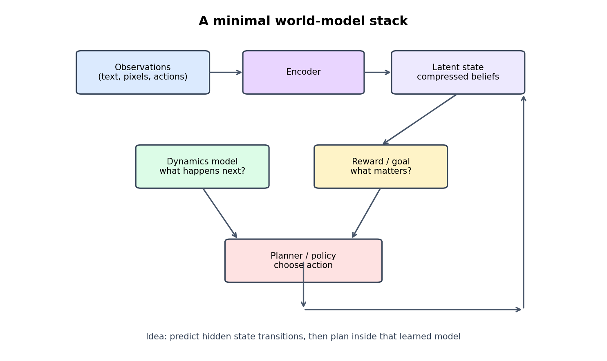
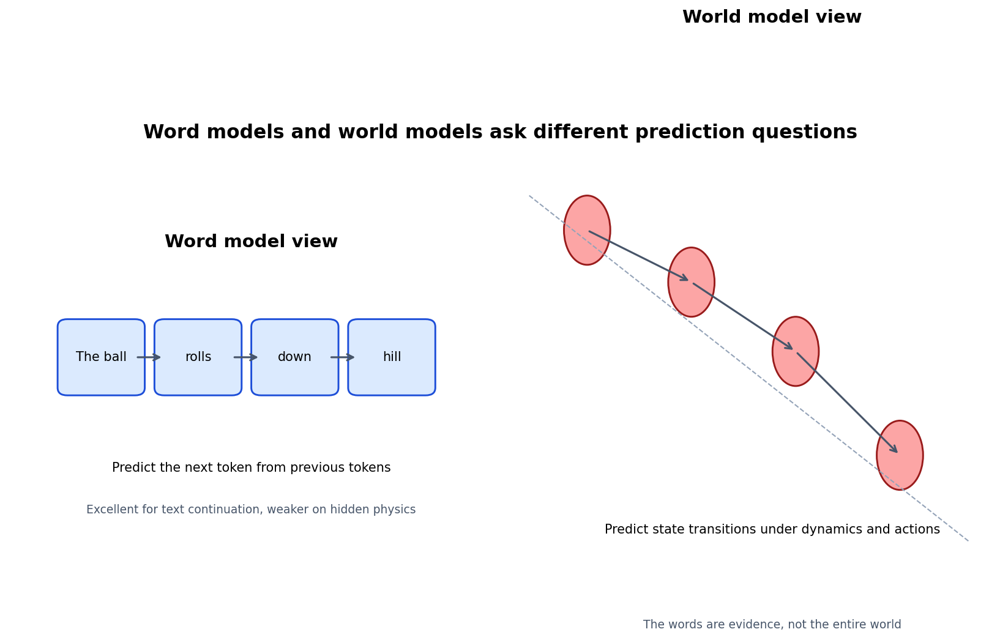
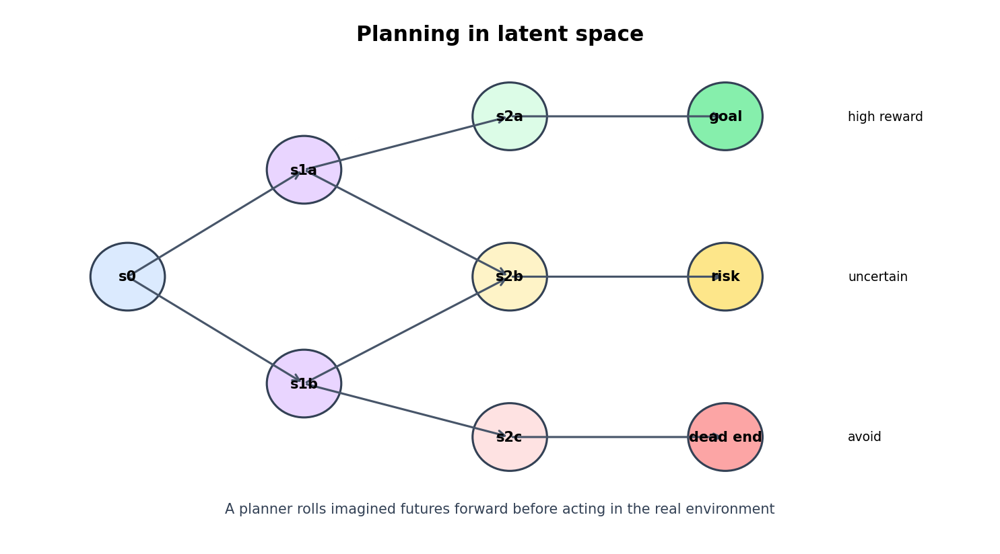
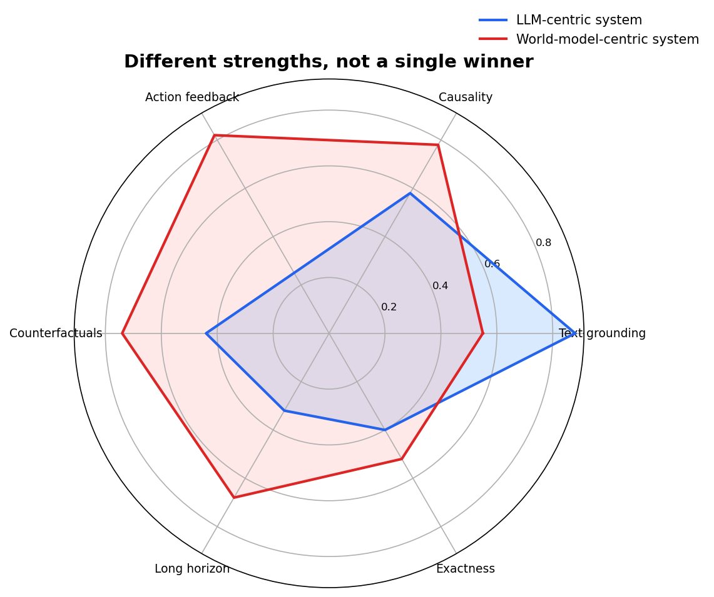

# Day 24: 世界模型

> **核心问题**：LLM 到底有没有“世界模型”？当研究者说未来 AI 需要显式世界模型时，他们真正指的是什么？

---

## 开篇

“世界模型（World Model）”是那种一听好像很好懂，但你真要下定义时就会卡住的词。

当人们说 ChatGPT 好像“理解世界”时，通常指的是类似这样的能力：它知道杯子被推一下会掉，知道律师通常先写合同再签字，也知道如果 Alice 把一本书给了 Bob，那么 Alice 就不再拥有那一本同样的书。这样的知识看起来已经不只是死记硬背的事实，而是带有某种结构感。所以一个很自然的问题就来了：**模型是真的学到了世界模型，还是只是学到了极强的词模式？**

这个问题之所以重要，是因为它正好落在当代 AI 最大的一场争论中央。一派认为，大语言模型通过海量文本预测，已经学到了对世界的压缩抽象。另一派则认为，文本终究太间接，真正稳健的智能，尤其是涉及规划、机器人、长期决策时，需要一个显式的、能够预测世界如何在动作下演化的模型。

你可以把两者的区别想成这样。一个写作能力极强的旅行作家，能够非常准确地描述新加坡雨天开车时通常会发生什么，哪里容易出事故，司机在拥堵时会怎样反应。但一个驾驶模拟器必须真的去预测：如果你晚刹车、猛打方向、或者在并线时加速，接下来会发生什么。前者建模的是**关于世界的描述**，后者建模的是**世界的动力学（dynamics）**。

这就是核心张力。LLM 在建模“关于世界的描述”上已经非常惊人，但很多时候我们想要的是更强的东西：一个能够想象可能未来、估计哪些未来更可能、并在现实付出代价之前先做动作选择的系统。

这篇文章会把这个词讲清楚，区分“弱意义”和“强意义”的世界模型，解释这场争论为什么会出现，并说明显式世界模型在哪些地方有优势、目前又卡在哪里，以及它和整个 LLM 路线图到底是什么关系。

---

## 1. 什么叫世界模型

**世界模型（World Model）**，可以粗略定义为：一个关于环境状态如何演化的内部预测模型，通常还包括动作影响、不确定性，以及那些你看不见但必须推断出来的潜在变量。

这个定义是刻意做得比“语言”更宽的。世界模型不是一个事实库，它更像一个压缩版模拟器，或者一个信念状态追踪器。它试图回答这样的几个问题：

- 当前看到的现象，背后最可能对应什么隐藏状态？
- 如果我在状态 $s_t$ 下采取动作 $a_t$，接下来最可能发生什么？
- 哪些未来轨迹会带来收益、风险或矛盾？
- 当前观察里的哪些部分具有因果意义，哪些只是表面细节？

一个常见的抽象写法是：

$$
P(s_{t+1}, o_{t+1}, r_{t+1} \mid s_t, a_t),
$$

其中 $s_t$ 是潜在状态，$a_t$ 是动作，$o_t$ 是观测，$r_t$ 可以是奖励或任务信号。不同论文记号不完全一样，但核心思想很稳定：模型学习压缩状态，并预测状态转移。

这也是为什么世界模型这个概念，早在 LLM 爆发之前就在强化学习里很重要了。在经典的 model-based RL（基于模型的强化学习）框架里，智能体不会只学一个从观察直接映射到动作的策略，它还会学习或利用一个环境模型，然后在那个模型内部先规划，再行动。


*图注：一个世界模型通常包含编码器、潜在状态、动力学模型，以及基于想象未来来选动作的规划器或策略。*

David Ha 和 Jürgen Schmidhuber 在 2018 年的论文 *World Models*，让很多人第一次直观地理解了这个框架。他们的 agent 学会了环境的压缩表示，甚至可以在模型自己生成的“梦境”里训练策略，然后再迁回真实环境。这件事非常形象地说明了：有用的行为不一定只能从原始观察直接反应出来，也可以来自对潜在动力学的学习和内部规划。

所以，至少在最低限度上，世界模型讲的是**预测结构（predictive structure）**，而不只是事实检索。

---

## 2. 为什么它会在 LLM 时代变得有争议

争议的根源在于，文本预测正好卡在一个很尴尬的中间地带。

如果你在足够大的语料上训练一个模型，它显然会学到很多关于世界的规律。不然它不可能回答常识问题，不可能把故事接得前后连贯，也不可能解释日常事件背后的因果骨架。LLM 确实知道很多关于人、物体、制度、软件系统，甚至部分物理过程的知识。

但它学到这些知识的路径是间接的。模型看到的是**关于世界的描述**，而不是世界本身。它见过无数关于碰撞、婚姻、法律纠纷、代码执行的句子，但它并不像物理引擎、机器人系统或视频智能体那样，直接观察到底层状态如何一步步变化。

于是就会出现两个容易混淆的说法。

### 说法 A：LLM 某种意义上拥有世界模型

这个较弱的说法其实很合理。如果一个 LLM 能回答社会规范、物体用途、因果顺序和后果预测相关的问题，它内部就一定包含了某种反映真实世界结构的抽象。否则它的泛化不可能这么强。

### 说法 B：LLM 本身就足以作为自主智能的世界模型

这个更强的说法就难得多。一个纯文本训练出来的模型，当然可能捕捉了很多相关性，甚至一部分因果模式，但它通常还缺少显式世界模型最看重的几个东西： grounded 的状态估计、动作条件下的状态转移、对 rollout 不确定性的校准，以及在反馈回路里的稳健规划能力。


*图注：LLM 预测的是下一个 token，而世界模型预测的是状态如何演化，很多时候还要考虑动作条件。两者相关，但不是同一个目标。*

所以这场争论听起来常常很夸张，实际上真正的问题并不是“LLM 知不知道世界”。它当然知道一些。真正的问题是：**如果系统需要行动、规划，并在长时程里保持一致性，那么 next-token prediction 这个目标本身，是不是足够好的训练目标？**

---

## 3. Word models 和 world models 到底差在哪

这场讨论里有一句很流行的话，叫 **word models versus world models**。这句话很抓人，但也很容易讲得过头。

所谓 word model，优化的是语言延续：

$$
P(x_t \mid x_{1:t-1}).
$$

所谓 world model，优化的是潜在状态和观测的转移：

$$
P(s_{t+1}, o_{t+1} \mid s_t, a_t).
$$

从公式上看，这像是一个非常干净的区分。但现实里，语言本身就携带着很多世界结构的压缩痕迹。文本不是现实本身，可它充满了现实留下来的因果指纹。所以，一个足够大的语言模型，在某些领域确实可以部分表现得像一个隐式世界模型，尤其是那些人类已经写下大量结构化经验的领域。

不过，还是有三个差别非常关键。

### 3.1 在语言里，动作是可选项；在世界模型里，动作是核心变量

大多数文本是观察式的。它讲“发生了什么”，却不一定讲“如果你改做另一件事会怎样”。世界模型则非常关注干预（intervention）和反事实（counterfactual）。

### 3.2 世界模型更关心隐藏状态，而不是表面表述

两段文字可以完全不同，却描述同一个潜在局面；反过来，同一句话在不同上下文下也可能对应不同底层状态。显式世界模型就是为了把观察压缩成潜在状态而设计的。LLM 内部当然也会做一些类似压缩，但它没有受到同样明确的训练压力，也没有同样可操作的结构暴露出来。

### 3.3 规划质量取决于 rollout 质量

如果你真的想让一个 agent 向前想十步，局部流畅远远不够。它想象出来的未来必须在动力学上持续自洽。哪怕每一步只错一点，滚到后面都会越漂越远。

你可以把 LLM 想成一个很会写“未来日记”的系统，它能把明天可能发生什么写得很像那么回事。而一个强世界模型必须更接近模拟器，它要能承受一连串“如果这样呢”的追问，而不是几步以后就开始幻想。

---

## 4. 为什么研究者还想要显式世界模型

显式世界模型最有说服力的场景，通常不是聊天，而是系统必须在环境中行动的时候。

### 4.1 机器人与具身智能

一个家庭机器人不能只靠文本先验生活。它需要预测物体怎么移动，夹爪和表面会怎样交互，局部观察遮住了哪些关键状态。语言可以帮助理解任务，但真正的控制需要动作条件下的预测。

### 4.2 长时程规划

无论是资源调度、车辆控制、科学实验还是游戏环境导航，你关心的都不是“下一句话最可能是什么”，而是“未来哪些分支更值得走”。规划器需要一个能够被反复 rollout 的模型。

### 4.3 样本效率

显式模型的一个老优势是，它能让智能体从“想象中的轨迹”里学习，而不只是从昂贵的真实交互里学。这是早期 model-based RL 的核心直觉之一，今天依然很有吸引力。

### 4.4 因果和反事实推理

很多现实决策的本质就是反事实：如果做 X 而不是 Y，会发生什么？文本语料里当然有一些这种信息，但它并不能完全替代一个专门学习“干预后果”的系统。

这也是 Yann LeCun 的立场论文 *A Path Towards Autonomous Machine Intelligence* 经常被拿来讨论的原因。把他的观点简化后，大致可以理解为：如果我们真想做出接近人类或动物那样的自主智能，就很可能需要可配置的预测性世界模型、分层表示，以及基于潜在状态的规划，而不仅仅是被动的序列预测。你可以不同意他整套路线图，但他指出的问题本身是严肃的：**自主智能大概率需要比今天 vanilla LLM 更强的动力学建模能力。**

---

## 5. 那么，LLM 已经拥有世界模型的证据是什么？

这部分才是真正有趣的地方，而不是站队。

确实有一些理由让人相信，LLM 学到了**部分世界模型**。

1. **常识与脚本知识（script knowledge）**。它知道很多典型事件顺序、社会预期和物体用途。
2. **潜变量压缩**。如果模型不能把不同表述压缩到更抽象的共享结构上，它就不可能在改写和迁移中表现得这么稳。
3. **某些物理与因果直觉**。它在支撑、容纳、日常因果后果这类定性问题上，经常答得 surprisingly well。
4. **文本中的类规划行为**。给定目标后，它能生成看起来合理的多步计划，这说明它至少编码了某种弱形式的未来结构先验。

但这些证据都还不足以证明，它内部真的有一个稳健、像模拟器一样可持续 rollout 的表示。它们只能说明：**语言建模确实能够诱导出很多关于世界的有用抽象。**

所以，支持 LLM 一方最聪明的说法，通常也不是“文本已经解决了一切”。更准确的版本是：**next-token prediction 可能本身就是一个比批评者想象中更丰富的压缩目标，而 scaling 加上多模态 grounding，也许会把它继续往前推很多。**

我觉得这是一个合理的立场，它既不盲目乐观，也不轻率否定。

---

## 6. 纯 LLM 目前还差在哪里

LLM 这条路线比较弱的地方，主要会在系统需要稳定状态、干预建模和反复 rollout 时暴露出来。

| 局限 | 表现 | 为什么重要 |
|------|------|------------|
| **反事实不够稳** | 能回答很多「如果…会怎样」的问题，但更像高质量模式补全，而不是在持续维护的潜在状态上真正模拟干预后果 | 规划系统需要可靠地预测「如果做了 X，接下来会发生什么」，而不只是生成听起来合理的文字 |
| **缺少强动作反馈回路** | 纯文本训练很少提供密集的行动‑反馈体验；世界模型最有价值的地方——动作改变下一步观察——在 LLM 训练中几乎是缺失的 | 没有密集的行动‑反馈循环，模型很难学到「我的行为改变了环境」这件事 |
| **长时程漂移** | 即使前几步想象是对的，随着步数增加，LLM 常常会慢慢丢掉约束、库存、几何关系或因果承诺 | 规划越深越长，累积误差越大；前半段合理的推理链到后半段可能已经偏离现实 |
| **不确定性校准不够好** | LLM 的自信程度和 rollout 的校准质量不对等；它生成的是「看起来最合理」的未来，而不是可用的未来分布 | 规划系统需要知道「我明确不知道什么」，而不只是给出一个自信但可能偏了的答案 |

简单说，LLM 可以讨论一个棋局、解释为什么某步不好、甚至写出一段很像高手分析的文字。但真正的规划引擎必须精确维护棋盘状态，并可靠比较分支。两者标准不一样。“如果……会怎样”的问题，但它往往更像是在做高质量模式补全，而不是在一个持续维护的潜在状态上真正模拟干预后果。

### 6.2 缺少强动作反馈回路

世界模型最有价值的地方，恰恰是动作会改变下一步观察。纯文本训练很少提供这种密集的行动-反馈体验。

### 6.3 长时程漂移

即使前几步想象是对的，纯 LLM 也常常会慢慢丢掉约束、库存、几何关系或因果承诺。越往后走，越容易漂。

### 6.4 不确定性校准不够好

一个规划系统需要的不只是一个“看起来最合理”的未来，而是一个可用的未来分布，还包括它明确知道自己**不知道什么**。而 LLM 的自信，往往不等于 rollout 的校准质量。


*图注：用世界模型做规划，意味着先在潜在空间里把可能未来向前滚动，再在现实中真正采取动作之前做选择。*

简单说，LLM 可以讨论一个棋局、解释为什么某步不好、甚至写出一段很像高手分析的文字。但真正的规划引擎必须精确维护棋盘状态，并可靠比较分支。两者标准不一样。

---

## 7. 一个更稳妥的中间立场：隐式世界模型 vs 显式世界模型

我觉得看这个问题最清楚的方式，是区分 **隐式世界模型（implicit world model）** 和 **显式世界模型（explicit world model）**。

- **隐式世界模型**：系统没有把状态变量和转移方程明确暴露出来，但它的参数和激活里包含了某种能够预测后果的世界结构。
- **显式世界模型**：系统有更明确的潜在状态、更清楚的转移机制，而且这个模型会被直接用于规划、控制或模拟。

沿着这个框架看，今天的 LLM 很可能已经在很多领域里包含了隐式世界模型。真正有争议的地方，其实是：**这些隐式模型，是否已经可靠、可控、且足够动作敏感，足以支撑下一阶段的 AI？**

这个问题，比那种卡通化的“LLM 到底懂不懂世界”强得多。

---

## 8. 这个领域最终可能会怎么收敛

我认为最可能的未来，不是纯 word model 胜出，也不是纯 world model 胜出，而是混合系统。

语言模型是惊人的接口层。它灵活、组合性强，而且在“人类已经写下很多经验”的领域非常高效。显式世界模型则在你需要 grounded 潜在状态、可控 rollout 和动作感知规划时更有吸引力。

因此最自然的收敛路线是：

$$
\text{让语言模型负责抽象与接口} + \text{让世界模型负责动力学与规划}。
$$

这可以有很多实现方式：

- 带有潜在动力学模块的多模态基础模型，
- 会调用模拟器或学习到的环境模型的 agent 系统，
- 由语言处理任务说明、由世界模型处理控制的机器人栈，
- 在符号工具、语言推理和 learned rollout 之间切换的规划系统。


*图注：以 LLM 为中心和以世界模型为中心的系统，在不同轴上各有强项。更可能的未来是组合，而不是单一赢家。*

这也是为什么这场争论其实可以很有建设性，而不必变成站队。双方很多时候盯住的是不同的失败模式。

- LLM 支持者说得对，scale 的确已经逼出了出人意料的广泛抽象能力。
- 世界模型支持者也说得对，自主行动需要比“漂亮文本”更强的动力学保证。

这两件事完全可以同时成立。

---

## 9. 一个很小的代码草图：怎样用世界模型做规划

一个简化后的规划循环大概会长这样。语言模型或感知模块先把观测压缩成潜在状态，世界模型把若干候选未来向前 rollout，规划器再保留预测回报最高的动作序列。

```python
# 一个玩具级的模型预测规划循环。
def plan_with_world_model(world_model, encoder, planner, obs, horizon=5):
    # 先把当前观测压缩成潜在状态。
    state = encoder(obs)

    best_score = float('-inf')
    best_actions = None

    # 采样若干候选动作序列。
    for actions in planner.sample_action_sequences(horizon=horizon, num_samples=128):
        imagined_state = state
        total_reward = 0.0

        for action in actions:
            # 预测下一步潜在状态和奖励。
            imagined_state, reward = world_model.step(imagined_state, action)
            total_reward += reward

        if total_reward > best_score:
            best_score = total_reward
            best_actions = actions

    return best_actions[0]  # 只执行第一步，然后重新观测、重新规划
```

这种控制模式通常叫 **model-predictive control（模型预测控制）**。具体算法会变，但模式很稳定：先想象多种未来，给它们打分，只执行当前最优轨迹的一小段，然后回到现实重新观察、重新规划。

---

## 10. 数学视角 [Optional]

假设一个模型要在长度为 $H$ 的时间范围内规划动作序列 $a_{t:t+H-1}$。一个 model-based 的目标可以写成：

$$
\hat{a}_{t:t+H-1} = \arg\max_{a_{t:t+H-1}} \mathbb{E}\left[\sum_{k=0}^{H-1} \gamma^k r_{t+k+1}\right],
$$

其中潜在动力学满足：

$$
s_{t+k+1} \sim P_\theta(s_{t+k+1} \mid s_{t+k}, a_{t+k}).
$$

也就是说，规划器会在学习到的转移模型里搜索和比较想象轨迹。如果这个动力学模型足够好，系统就能在真正行动前先评估决策。

相比之下，一个纯语言模型优化的是：

$$
\mathcal{L}_{\text{LM}} = -\sum_t \log P(x_t \mid x_{1:t-1}).
$$

这个目标当然也可能诱导出对规划有帮助的潜在结构，但它不会直接惩罚“动作条件 rollout 很差”这件事。**文本延续损失**和**决策质量损失**之间的这道缝，其实就是整场争论最核心的数学差异。

---

## 11. 常见误解

### ❌ “世界模型就是一个很大的事实数据库。”

不是。事实当然重要，但世界模型最核心的是状态、转移和后果。

### ❌ “只要 LLM 有常识，就等于世界建模已经解决了。”

常识说明它学到了一些有用结构，但这和拥有稳健、动作感知的动力学模型不是一回事。

### ❌ “世界模型就是老派符号 AI 回潮。”

也不一定。很多现代世界模型本身就是学习得到的神经潜在状态模型，而不是手写规则系统。

### ❌ “这场争论一定会有唯一赢家。”

大概率不会。不同任务需要不同程度的语言先验、感知、记忆、工具和预测动力学。

---

## 12. 延伸阅读

### Beginner
1. [World Models](https://arxiv.org/abs/1803.10122)  
   David Ha 和 Jürgen Schmidhuber 在 2018 年那篇非常有影响力的论文，让“世界模型”这个词在现代深度学习语境里真正流行起来。

2. [A Path Towards Autonomous Machine Intelligence](https://openreview.net/forum?id=BZ5a1r-kVsf)  
   Yann LeCun 的立场论文，主张预测性世界模型、分层表示和面向规划的架构。

### Advanced
1. [DreamerV3: Mastering Diverse Domains through World Models](https://arxiv.org/abs/2301.04104)  
   现代 latent world model 很强的代表作之一，展示了世界模型如何支持跨领域控制。

2. [Mastering Atari with Discrete World Models](https://arxiv.org/abs/2010.02193)  
   展示学习到的世界模型如何在高维环境里支持规划和高效控制。

3. [The Platonic Representation Hypothesis](https://arxiv.org/abs/2405.07987)  
   和本文的核心问题相关，它讨论不同模型是否会收敛到共享的潜在世界抽象。

---

## Reflection Questions

1. 如果一个 LLM 仅靠文本就能稳定预测后果，什么时候我们应该说它拥有“隐式世界模型”？
2. 法律、编程、机器人、科学实验这些领域里，哪些最迫切需要显式的动作条件世界模型？
3. 多模态训练会不会把大语言模型变成更强的世界模型，还是说目标函数本身仍然需要变化？

---

## 总结

| 概念 | 一句话解释 |
|------|------------|
| World model | 一个关于潜在状态如何在动作下演化的预测模型。 |
| Implicit world model | 世界结构被编码在模型内部，但没有暴露成显式模拟器。 |
| Explicit world model | 结构化的潜在动力学模型，会被直接用于规划或控制。 |
| Word model | 优化目标是 token 延续，而不是环境状态转移的系统。 |
| Hybrid future | 更可能的路线是把语言抽象能力和动作感知预测模型组合起来。 |

**Key Takeaway**：LLM 几乎肯定学到了一些关于世界的有用抽象，否则它不可能泛化得这么好。但这并不自动意味着，next-token prediction 就是自主智能的全部配方。只要任务涉及动作、反事实和长时程规划，显式世界模型仍然提供了很重要的一样东西：在现实开始收费之前，先在内部模拟未来。

---

*Day 24 of 60 | LLM Fundamentals*  
*Word count: ~2950 | Reading time: ~18 minutes*
