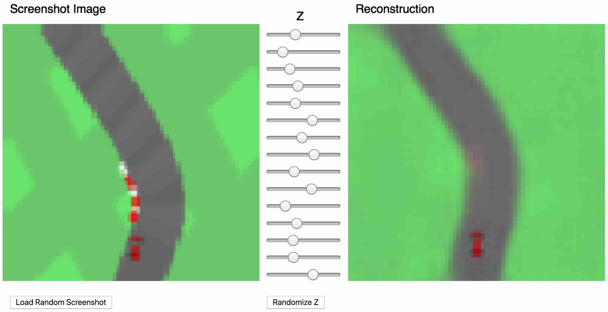
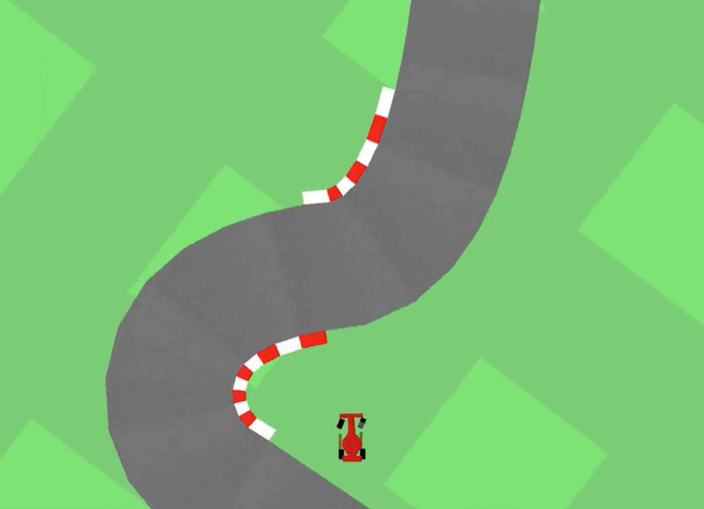
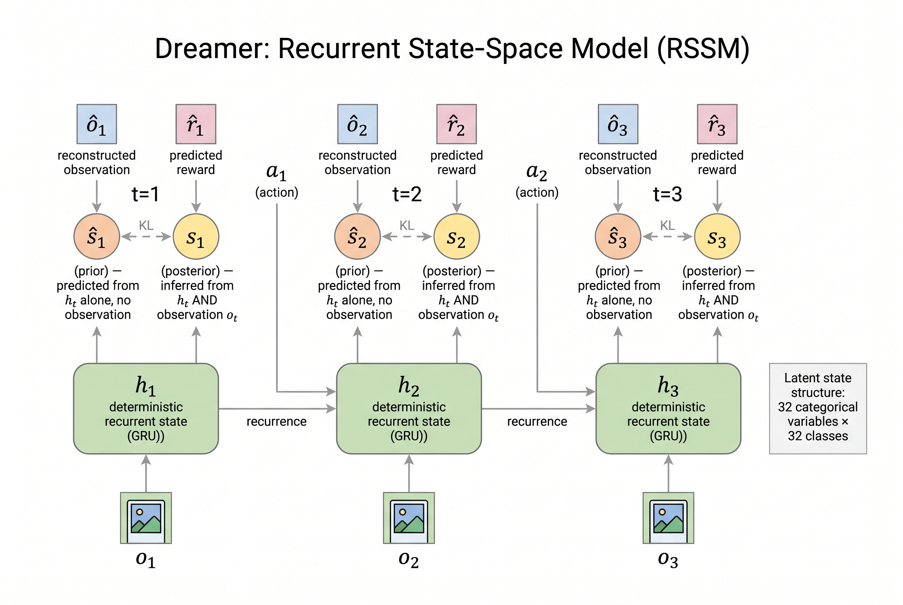
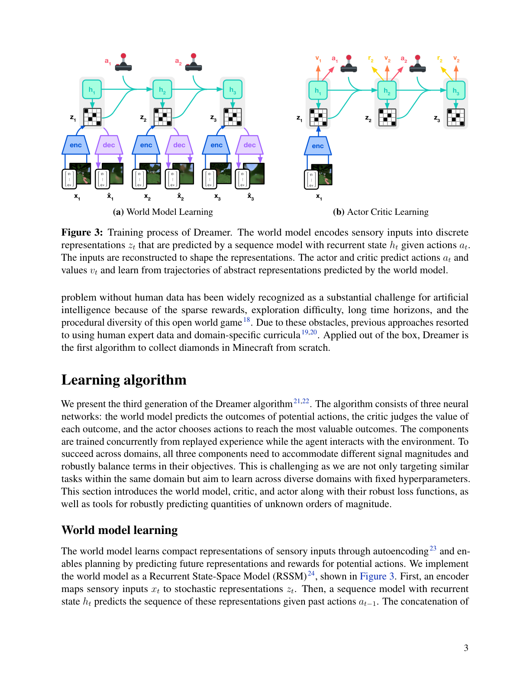
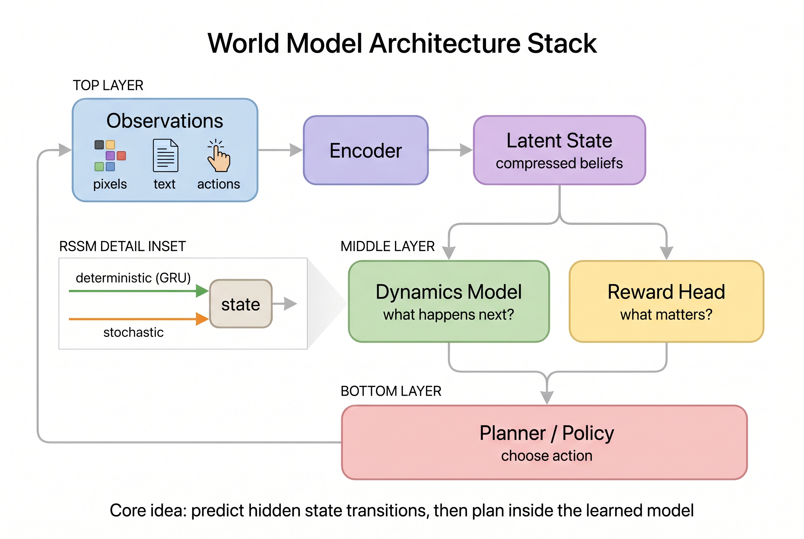

# Day 24: 世界模型 - 学会模拟现实

> **核心问题**:一个系统"建模"世界究竟意味着什么--仅仅是描述它,还是真正预测它在动作下如何演化?这为什么成了 AI 架构设计的核心争论?

---

## 开篇

一个从没看过物理课本的幼儿,依然知道滚到沙发后面的球不会消失。她能大致预测球会从哪里出来。在某种意义上,她已经拥有了一个关于物体持久性和物理动力学的*模型*--不是符号化的,也不是她能说清楚的,但足以支持预测和行动。

机器学习系统是否能够获得类似的东西--一个关于世界状态如何在时间和动作下演化的内部预测模型--已经成为该领域最核心的问题之一。这并不是一个新问题(控制理论家和机器人学家研究状态空间模型已有数十年),而是因为两大研究方向从不同侧面汇聚于此。一方面,强化学习社区在过去十年里构建了越来越精密的"学习型模拟器"--即*世界模型*--用于规划、想象和高效学习。另一方面,仅用文本训练的大语言模型在某些研究者看来,似乎通过"预测下一个词"这个代理任务,隐式地学会了丰富的世界结构。

这场争论不仅仅是哲学层面的。如果 LLM 已经包含了隐式的世界模型,那么继续扩大语言模型的规模可能是通往通用智能最直接的路径。如果并非如此--如果建模文本分布与建模世界动力学之间存在根本性的鸿沟--那么我们可能需要在架构层面做出显式的世界建模承诺,而问题就变成了:这种承诺应该采取什么形式?

本文将世界模型视为一个严谨的研究课题,而非一个流行词。我们将追溯从经典控制到现代潜在动力学模型的学术谱系,推导它们实际训练的数学过程,剖析使它们生效的架构创新,然后直面那个困难的问题:学习到的世界模型与 LLM 隐式获得的能力相比,到底有什么不同?

---

## 1. 学术谱系:从状态估计到学习型模拟器

### 1.1 经典根源

"智能体应该维护其环境的内部模型"这一思想远早于机器学习本身。在经典控制理论中,一个*状态空间模型*包含:

$$s_{t+1} = f(s_t, a_t) + \epsilon_t, \quad o_t = g(s_t) + \eta_t$$

其中 $s_t$ 是(可能部分可观测的)状态,$a_t$ 是控制输入,$o_t$ 是观测,$\epsilon_t, \eta_t$ 是噪声项。卡尔曼滤波器(Kalman, 1960)为线性-高斯情形提供了最优递归估计器。整个框架有一个前提:必须由工程师手工指定 $f$ 和 $g$。

**理解卡尔曼滤波。** 卡尔曼滤波在两个步骤之间交替运行。在*预测步*中,上一时刻的状态估计通过动力学模型向前传播,得到先验。在*更新步*中,新的观测用来修正这个先验,得到后验。融合过程由**卡尔曼增益**控制:

$$\hat{s}_{t|t} = \hat{s}_{t|t-1} + K_t\,(o_t - \hat{o}_{t|t-1})$$

其中 $\hat{s}_{t|t-1}$ 是预测状态(先验),$\hat{s}_{t|t}$ 是修正后状态(后验),$o_t$ 是观测值,$\hat{o}_{t|t-1}$ 是预测观测值。$(o_t - \hat{o}_{t|t-1})$ 是*新息*(innovation)或残差--传感器读数与模型预期之间的差距。卡尔曼增益 $K_t$ 由预测协方差和观测协方差自动计算得到:当模型的不确定性相对于传感器较大时,$K_t$ 较大(更信任传感器);当传感器噪声大时,$K_t$ 较小(更信任模型)。这不是一个需要调节的超参数,而是直接从数学推导出来的。

**为什么线性-高斯假设很重要。** 一个自然的疑问是:既然已经拿到了观测值,为什么还要关心预测值?原因有几个:观测是有噪声的(GPS 读数可能偏差 10 米),是部分的(传感器只给位置不给速度),而且有时会丢失(进隧道后 GPS 信号中断)。预测步提供了一个有原则的先验,更新步在此基础上加以修正。

但线性-高斯假设才是让整个事情*可计算*的关键。核心性质是**线性变换下的封闭性**:如果 $x \sim \mathcal{N}(\mu, \Sigma)$ 且 $y = Ax + b$,则 $y \sim \mathcal{N}(A\mu + b, A\Sigma A^\top)$。高斯分布在经过线性变换后仍然是高斯分布。这意味着在整个预测-更新循环中--线性状态转移、加高斯噪声、线性传感器观测、再加高斯噪声--每一步的后验分布都保持高斯形态。你只需要追踪两个量:均值和协方差。一旦系统变为非线性或噪声不再是高斯的,后验可能变成多峰的或偏斜的,简单的递推公式就失效了--你必须使用扩展卡尔曼滤波、粒子滤波等近似方法,而在现代深度学习语境下,就是用神经网络配合变分推断。这恰好是从经典控制到现代世界模型的演进路径。

### 1.2 基于模型的强化学习

向"学习型"模型的转变始于 Sutton 的 Dyna 架构(Sutton, 1991)。Dyna 将真实经验与*模拟*经验交替使用:智能体同时学习值函数和单步模型 $\hat{P}(s_{t+1} | s_t, a_t)$,然后用模型生成想象轨迹来做额外的策略更新。

这个想法简单而精妙。普通强化学习里,智能体在环境中走一步,拿到一条经验 $(s_t, a_t, r_t, s_{t+1})$,用它来更新策略。一步一个教训。Dyna 加了一个关键操作:**同时学一个环境模型,然后用它免费练习**。每走一步真实经验,模型就变好一点;变好的模型可以凭空生成成百上千条模拟经验;策略在所有这些经验上训练。真实经验很贵(你必须在环境中实际试错,承担失败风险),模拟经验几乎免费(就是跑一次模型前向传播)。这个洞察是根本性的:即使是不完美的模型,也能极大地放大每次真实交互的价值。

打个比方:学开车的时候,每上一节真实驾驶课都很贵、很有限。但课间你可以闭上眼在脑中反复演练--前车突然刹车怎么办?黄灯刚好亮起怎么办?你脑子里的"驾驶模拟器"并不完美,但靠它演练能让每一节真实课程比不演练时收获大得多。Dyna 就是把这个直觉形式化了。

当然有一个前提:如果模型不准确,靠它的幻想来训练可能比不练还差。这就是为什么后续工作重点放在提升模型质量和管理模型误差上。

后续工作进一步收紧了这个循环。PILCO(Deisenroth & Rasmussen, 2011)使用高斯过程作为前向模型,通过预测轨迹传播不确定性,在低维控制任务上实现了惊人的样本效率。PETS(Chua et al., 2018)用概率神经网络的集成替代了高斯过程,扩展到更高维度,同时通过模型预测控制(MPC)保持了不确定性感知的规划能力。

### 1.3 Ha & Schmidhuber (2018):转折点

那篇标题就叫 *World Models* 的论文（Ha & Schmidhuber, 2018）为深度学习时代重新定义了这个对话。系统包含三个组件：VAE 编码器将视觉观测压缩为潜在向量；MDN-RNN 根据当前潜在状态和动作预测下一个潜在状态；一个小型控制器将潜在状态映射到动作。关键结果是：控制器可以*完全在模型自己的“梦境”中*训练——从学到的动力学中采样的想象轨迹——然后迁移到真实环境。

论文以一个引人入胜的比喻开头：


*图：一个人骑自行车的同时在脑中想象自己翘起前轮——智能行为作为心理模拟。论文的核心论点是：智能体不需要直接对原始感知输入做出反应，而是可以构建一个内部的世界模型，并在其中练习。*

他们的架构有三个模块，分别称为 **V**、**M** 和 **C**：


**图注：**
- **x₁, x₂, x₃** — 观测（环境给出的原始像素帧）
- **V₁, V₂, V₃** — Vision 模块（VAE 编码器），把高维像素压缩成低维潜在向量
- **z₁, z₂, z₃** — 潜在编码（V 的输出），例如把一张 64×64 的图片压缩成 32 维向量
- **M₁, M₂, M₃** — Memory 模块（MDN-RNN），根据历史潜在状态、隐状态和动作预测未来的潜在状态
- **h₁, h₂** — 隐状态（RNN 记忆），把过去的经历压缩成向量，在时间步之间传递
- **C₁, C₂, C₃** — Controller 模块，根据当前的 z（看到了什么）和 h（记住了什么）决定下一步做什么动作
- **a** — 动作（C 的输出），发回给环境，同时也反馈给 M（因为 M 需要知道做了什么动作才能预测下一个状态——不同的动作导致不同的未来）
- **World Model** — V + M 合在一起就是“世界模型”，负责感知和预测

**数据流一句话版：** 环境给图片 x → V 压缩成 z → M 结合 z、h 和动作 a 预测未来 → C 根据 z 和 h 选动作 a → 动作发回环境 → 循环。

VAE（**V**）学会将高维游戏帧压缩为一个小型潜在向量，保留足够的任务相关结构用于控制：


*图：原始游戏帧（左）、潜在表示（中）和 VAE 重建结果（右）。重建图虽然模糊，但保留了场景的关键结构——道路形状、障碍物、车辆位置——而这正是下游控制器实际需要的。*

MDN-RNN（**M**）可以生成完整的梦境轨迹，看起来足够逼真，可以用来训练控制器：


*图：完全由世界模型“梦境”生成的帧——MDN-RNN 从学到的潜在动力学中幻觉出合理的游戏场景。控制器可以在这个梦境中训练，然后部署到真实环境中。*

这个结果很有冲击力，但架构上有局限。VAE 和 RNN 是分开训练的，潜在空间是纯随机的（没有确定性路径），也没有对完整序列做变分推断。但概念上的影响是巨大的：它表明学习型模拟器可以替代手工设计的模拟器，在想象中训练的策略在现实中也能工作。

### 1.4 Dreamer: 循环状态空间模型

Dreamer 系列（Hafner et al., 2020; 2023）代表了学习型世界模型在控制领域的当前最佳水平。核心创新是**循环状态空间模型（RSSM）**，它结合了确定性循环路径和随机潜在路径。

#### 直觉：Dreamer 和原版 World Models 有什么不同？

想象原版 Ha & Schmidhuber 系统是分开上三门课来学开车的：先上视力课（练眼睛），再上想象力课（练脑中模拟器），最后上驾驶课（练手脚）。每门课独立——你不会根据方向盘的需要来调整想象力。

Dreamer 说：**一起练**。视觉、想象力和控制共享同一个训练目标，一起优化。三个组件在协作中共同进步，而不是各自独立变强但配合不好。具体有三个关键改进：

**1. 端到端训练。** 原版 World Models 的 V、M、C 是分别训练的。Dreamer 用变分推断统一优化整个世界模型——编码器、动力学模型、奖励预测器都从同一个损失函数学习。这意味着各组件会进化成“配合得很好”的状态，而不是“各自很强但拼在一起不行”。

**2. 双路径状态（确定性 + 随机性）。** 原版只有随机想象——每次想象未来都不同，不稳定。Dreamer 加了一条确定性循环路径（GRU）和随机路径并行。就像你脑中有两部分：
- **确定性部分**记住事实：“我开了 3 公里，过了两个红绿灯。”这是稳定的长期记忆。
- **随机部分**处理不确定性：“前面那个模糊的东西可能是行人也可能是垃圾桶。”这是对不确定情况的推测。

两个一起用，既有可靠记忆又能量化不确定性——就像卡尔曼滤波同时用预测和观测一样。

**3. 梯度穿过想象。** 原版用进化算法训练控制器（本质上是随机试错），很慢。Dreamer 在想象中规划一条路径，评估结果，然后**直接把梯度反传穿过想象的未来**来改进策略。因为整个想象管线都是可微的神经网络，模型能精确算出“如果刚才方向盘多打 2 度，结果会好多少”——然后据此调整。这比盲目试错高效得多。

#### 数学表达

双路径状态的更新规则：

$$h_t = \text{GRU}(h_{t-1},\, s_{t-1},\, a_{t-1})$$

这是确定性循环——把记忆向前传播。然后从当前观测推断随机状态：

$$s_t \sim q_\theta(s_t \,|\, h_t,\, o_t)$$

这是**后验**——模型在看到观测后认为当前状态是什么。在想象模式（没有真实观测）时，模型改用**先验**：

$$\hat{s}_t \sim p_\theta(s_t \,|\, h_t)$$

世界模型的训练目标是让先验尽可能匹配后验（通过 KL 散度损失），这样它就可以在没有真实观测的情况下想象出逼真的未来。


*图：RSSM 架构。绿色方框是确定性循环状态（h）。每个时间步有一个先验和一个后验随机状态，通过 KL 损失连接。观测从下方编码；重建观测和预测奖励在上方生成。潜在状态使用 32 个类别型变量，每个有 32 个类别。*

世界模型训练好之后，Dreamer 完全在模型的想象中学习策略和价值函数：


*图：**左面板**：世界模型学习——观测被编码为随机潜在状态，通过循环动力学传播，并重建。**右面板**：在想象中训练 actor-critic——从一个真实编码状态出发，actor 提出动作，世界模型预测未来潜在状态，critic 评估它们。梯度穿过整条想象轨迹反传。*

**一句话总结：** 原版 World Models 是三个分开训练的模块拼在一起；Dreamer 是一个端到端统一训练的系统，有双路径状态（确定性记忆 + 随机推测），并且用梯度穿过想象来高效训练策略。核心理念一样——学一个世界模型，然后在里面训练智能体——但三个工程改进让它真正又好又通用。

#### 从 DreamerV2 到 DreamerV3

**DreamerV2（2021）** 证明了世界模型可以和最强方法竞争。

它的主要创新是把连续高斯潜在变量换成了**离散类别型潜在变量**——32 个类别型变量，每个有 32 个类别。打个比方：DreamerV1 描述"路上有什么"用的是连续数值（"前方障碍物大约在角度 23.7°"），DreamerV2 改成了离散分类（"前方障碍物：类型 A / 类型 B / 类型 C..."）。就像从"用小数描述颜色"变成"从 32 个色卡里选"。

为什么这很重要？现实世界的很多状态本质上是**离散的**——"门是开还是关"、"敌人是死还是活"。用连续数值描述离散状态，就像用尺子量开关——能凑合但不好用。换成类别型变量后，DreamerV2 第一次在 Atari 游戏上匹配或打败了当时最强的 model-free 方法，证明了世界模型不只是理论玩具。

**但 DreamerV2 有个实际问题：** 每个游戏都需要单独调超参数。换一个游戏就要重新调学习率、KL 权重、想象长度等等——就像换一条赛道就要重新调引擎。

**DreamerV3（2023）** 证明了世界模型可以不用调参就到处通用。

核心贡献：**一套固定的超参数配置，在 150+ 个不同的任务上全部达到最优或接近最优**——包括连续控制（机器人走路、机械臂抓取）、离散控制（Atari 游戏）、3D 导航（Minecraft 里的钻石挑战）、竞技游戏（赛车、弹球）。

怎么做到的？几个工程改进：
1. **更鲁棒的损失归一化**：给各个损失项加归一化，不让某个损失项压过其他损失。就像一个合唱团，不让一个大嗓门盖过所有人。
2. **更稳定的训练**：用指数移动平均更新目标网络，训练过程更平滑。
3. **更聪明的想象起点**：不是从随机状态开始想象，而是从真实经验回放缓冲区里选起点。

**一句话总结：DreamerV2 证明了"世界模型可以很强"；DreamerV3 证明了"世界模型可以不用调参就到处通用"。** 它把世界模型从研究方法变成了拿来即用的工具。

### 1.5 LeCun 的 JEPA 及更远

Yann LeCun 的联合嵌入预测架构(JEPA)提案(LeCun, 2022)将世界建模从像素级重构中解放出来。JEPA 预测的是下一个状态的*表征*而非观测本身:

$$z_{t+1} = P_\theta(z_t, a_t)$$

其中 $z_t = \text{Enc}(o_t)$，预测器 $P_\theta$ 在嵌入空间中操作。一个判别器网络强制要求预测的嵌入落在有效表征的流形上，用一致性约束替代了重构。动机很清楚：我们看到的大部分东西与规划无关，强迫模型重构像素是在浪费容量。

#### 直觉：JEPA 和 Ha & Schmidhuber 的 M 有什么不同？

两者都在隐空间里学习和预测，但关键区别在于**预测什么**和**要不要重建观测**。

**Ha & Schmidhuber 的 M（MDN-RNN）：** 给定当前潜在状态 z 和动作 a，预测下一个潜在状态 z'。然后从 z' **重建出像素画面**——模型必须学会"画出"下一帧长什么样，包括路面纹理、天空颜色、草地深浅，所有细节。

**JEPA：** 给定当前嵌入 z 和动作 a，预测下一个嵌入 z'。**永远不回到像素层面。** 模型只需要知道下一个状态在抽象表示空间里的位置——不需要知道它长什么样。

开车的比喻：你在开车，需要预测前方路况。
- **Ha 版 M** 是闭上眼，在脑子里**完整地想象**下一秒的画面——天空是蓝的、路是灰的、左边有棵树、右边有辆车。每帧都是一幅完整的"画"。
- **JEPA** 是只需判断"前方安全"还是"前方危险"——不需要想象天空什么颜色、树长什么样。那些细节跟你的决策无关。

LeCun 认为 JEPA 更好，原因有两个：
1. **省力**：逼模型重建像素，大量算力花在了"路面纹理""天空颜色"这些跟决策无关的细节上。就像逼一个象棋选手每次走棋前先在脑子里画出棋盘的木纹——木纹有什么用？
2. **更聪明**：如果只要求模型"画出"下一帧，它可能走捷径——记住表面模式而不是理解底层结构。如果要求它在抽象空间里预测，它就被迫学到真正有用的抽象。

**一句话总结：** Ha 版 M 在隐空间里预测但最终要重建像素（要"画出来"）；JEPA 在隐空间里预测而且永远不回到像素层面（只"理解"，不"画画"）。LeCun 认为逼模型重建观测是浪费算力，还会阻碍它学到真正有用的抽象。

演进路线很清晰：**手工设计的模拟器 → 固定表征的学习型动力学 → 端到端学习的潜在模拟器 → 在抽象嵌入空间中的预测**。每一步都在用通用性换取效率，而当前的前沿正在问这条路径是否能够与大规模基础模型的能力融合。

---

## 2. 核心公式：潜在动力学上的变分推断

这一节进入数学。公式看起来吓人，但每一个都回答一个具体的问题。把世界模型想象成一个*能生成逼真游戏录像的食谱*：给定一个起始状态和一系列动作，它能幻想出你会看到什么、得到多少分数、场景如何演化。下面的数学只是把这个食谱精确地写出来。

### 2.1 生成模型

#### 大白话：一个生成模拟经验的食谱

想象你脑子里有一个游戏引擎。每一瞬间，三件事在发生：
1. 世界根据你做的事情从当前状态变到下一个状态（**转移**）
2. 你看到新状态的画面（**观测/解码器**）
3. 你得到一个分数告诉你做得好不好（**奖励**）

生成模型把这件事写成一个概率分布。对于观测序列 $o_{1:T}$、动作序列 $a_{1:T}$ 和奖励序列 $r_{1:T}$，模型分解为：

$$p_\theta(o_{1:T}, r_{1:T}, s_{1:T} | a_{1:T}) = \prod_{t=1}^{T} \underbrace{p_\theta(o_t | s_t)}_{\text{解码器}} \, \underbrace{p_\theta(r_t | s_t)}_{\text{奖励}} \, \underbrace{p_\theta(s_t | s_{t-1}, a_{t-1})}_{\text{转移}}$$

每个因子回答一个问题：

| 因子 | 回答的问题 | 通俗解释 |
|------|-----------|----------|
| $p_\theta(s_t \mid s_{t-1}, a_{t-1})$ | 转移 | “如果我在这个状态做了这个动作，我会到哪里？” |
| $p_\theta(o_t \mid s_t)$ | 解码器 | “如果状态是这个，屏幕上会显示什么？” |
| $p_\theta(r_t \mid s_t)$ | 奖励 | “如果状态是这个，我能得多少分？” |

对于 RSSM（Dreamer 的架构），转移因子进一步拆分：先计算确定性循环状态 $h_t$，再从以它为条件的先验 $p_\theta(s_t \mid h_t)$ 中抽取随机状态。

### 2.2 通过 ELBO 训练

#### 大白话：为什么不能直接算答案

理想的训练目标是：“找到让观测数据概率最大的参数 $\theta$。”这意味着要计算真实后验 $p(s_{1:T} \mid o_{1:T}, a_{1:T})$ —— 能解释我们观测到的所有可能潜在状态序列的精确分布。

**问题：** 这需要对所有可能的潜在序列 $s_{1:T}$ 做积分。潜在空间是高维的，序列很长，积分不可计算。就像一个侦探试图同时考虑犯罪现场的所有可能解释——无穷多的理论，没法一一列举。

**解决方案：** 与其找*完美*的解释，不如训练一个神经网络（编码器）来产生一个*足够好*的近似。我们称之为**近似后验** $q_\theta(s_t \mid h_t, o_t)$ —— 编码器根据观测和确定性上下文对潜在状态的最佳猜测。

然后我们最大化**证据下界（ELBO）** —— 模型解释数据能力的一个保守估计：

$$\mathcal{L} = \underbrace{\mathbb{E}_{q(s_{1:T})} \left[ \sum_{t=1}^{T} \left( \log p_\theta(o_t | s_t) + \log p_\theta(r_t | s_t) \right) \right]}_{\text{"我的总结能解释证据吗？"}} - \underbrace{\sum_{t=1}^{T} \text{KL}\left( q_\theta(s_t | h_t, o_t) \, \| \, p_\theta(s_t | h_t) \right)}_{\text{"我的总结是否保持合理？"}}$$

拆开来看三个项：

- **重构**："给定我对当前状态的总结，我能重建我实际看到的东西吗？" 总结好的话，重建图应该跟原图匹配。数学上是 $\log p_\theta(o_t \mid s_t)$。

- **奖励预测**："给定我的总结，我能预测得到了多少奖励吗？" 这迫使总结保留与任务相关的信息——不只是视觉细节，而是*对游戏来说重要的东西*。数学上是 $\log p_\theta(r_t \mid s_t)$。

- **KL 正则化**："看了证据之后的总结，跟*没看*之前的猜测还接近吗？" 这防止作弊——编码器不能直接把原始观测复制到潜在状态里。它必须产生一个与模型学到的动力学一致的总结。数学上是 KL 散度。

就像写读书笔记：
- **重构** = “你能根据笔记描述场景吗？”（准确性）
- **奖励预测** = “你能找出关键情节点吗？”（相关性）
- **KL** = “你的笔记简洁吗，还是把整本书抄了一遍？”（简洁性）

这*不仅仅是*“预测下一个状态”。这是近似贝叶斯推断：模型维护一个关于潜在状态的*信念*，通过编码器用观测更新，并通过学到的动力学进行正则化。KL 项使这成为一个有原则的概率模型，而不是一个加了预测头的确定性自编码器。

### 2.3 确定性与随机性：RSSM 为什么重要

#### 大白话：你的日记 vs 你的猜测

想象你每天写两样东西：
- **日记**（确定性）：“开了 50 公里。停了 3 次红灯。买了菜。” 这些是事实——稳定、可靠、没有歧义。
- **预测手账**（随机性）：“明天可能下雨（60%）也可能晴天（40%）。” 这些是猜测——不确定、概率性、可能会变。

早期的世界模型（Ha & Schmidhuber, 2018）只保留了预测手账——纯随机状态。这带来两个问题：

1. **梯度噪声大。** 每次从随机分布中采样，结果都略有不同。穿过这些采样做反向传播就像走一条会在脚下移动的路——训练不稳定。
2. **长期遗忘。** 随机状态每步重新采样。100 步之后，采样链离现实越来越远——就像传话游戏，每个人说的都略有不同。

RSSM 的修复：在预测手账旁边加上日记。**确定性路径** $h_t = f(h_{t-1}, s_{t-1}, a_{t-1})$ 用 GRU 维持稳定、流动的记忆。**随机状态** $s_t$ 只需要在那个稳定上下文的基础上捕捉*当前时刻的不确定性*。

这跟卡尔曼滤波器很像，它同时维护两样东西：
- **均值**（最佳猜测——类似确定性路径）
- **协方差**（不确定性——类似随机路径）

两个都有才好：纯确定性会错过意外；纯随机会忘记过去。加在一起就强大了。

### 2.4 Dreamer 风格的完整损失函数

#### 大白话：四个音量旋钮

实际上，DreamerV3 优化的是：

$$\mathcal{L}_{\text{world}} = \mathbb{E}_q \left[ \sum_t \underbrace{\beta_o \log p(o_t|s_t)}_{\text{重构}} + \underbrace{\beta_r \log p(r_t|s_t)}_{\text{奖励}} + \underbrace{\beta_c \log p(\text{cont}_t|s_t)}_{\text{继续}} \right] - \underbrace{\beta_{\text{kl}} \sum_t \text{KL}(q_t \| p_t)}_{\text{正则化}}$$

每个 $\beta$ 是一个**音量旋钮**，控制那一项有多重要：

| 旋钮 | 控制什么 | 太高 → | 太低 → |
|------|---------|--------|--------|
| $\beta_o$ | 潜在状态必须重构多少像素细节 | 浪费容量在视觉细节上 | 潜在状态可能丢失场景信息 |
| $\beta_r$ | 潜在状态必须多好地预测奖励 | 过拟合奖励，忽视动力学 | 智能体学不到什么是好的 |
| $\beta_c$ | 潜在状态必须多好地预测回合是否继续 | 过度关注"死没死"，挤占其他重要信息的空间 | 智能体无法规划回合结束 |
| $\beta_{\text{kl}}$ | 后验必须多接近先验 | 后验太泛化（欠拟合） | 后验复制观测（过拟合） |

**DreamerV3 相比早期版本的新东西：**

- **继续标志** `cont_t` ：一个小预测器，回答“回合还在继续吗？”这很重要，因为智能体需要知道轨迹什么时候结束——在游戏里死掉和活着是完全不同的。
- **Symlog 预测**：不假设奖励是高斯分布（实际上经常是偏斜的或有巨大离群值），DreamerV3 应用对称 log 变换。这让同一个网络能优雅地处理微小奖励（+0.01）和巨大奖励（+1000）。
- **离散潜在变量**：不用连续高斯变量，DreamerV3 用 32 个类别型变量，每个 32 个类别。这匹配了很多现实世界状态的结构（“门是开*还是*关”，不是“门开了 0.73”），也让 KL 项计算更稳定。

---

## 3. 架构深入


*世界模型架构:编码器将观测映射到潜在状态;RSSM 维护确定性和随机性状态路径;奖励和继续头预测任务信号;解码器可选地重构观测。*

### 3.1 编码器

#### 大白话：你的眼睛在压缩世界

当你走进一个房间，你不会记住看到的每个像素。你的眼睛和视觉皮层把原始感官输入压缩成一个*心理印象*——你会注意到“有一张桌子，上面放着笔记本电脑，旁边是窗户。”编码器做的就是这件事：它把高维观测（一张 64×64 的 RGB 图像 = 12,288 个数字）压缩成紧凑的潜在表示。

**实际做了什么：** 一个浅层 CNN 用几层卷积处理图像，然后一个线性层产生分类分布的 *logits*。在 DreamerV3 中，输出是 $32 \times 32$ 的网格——32 个独立的类别型变量，每个在 32 个类别中选择。想象成 32 道选择题，每道有 32 个选项，共同描述“这帧画面里有什么。”

为什么要以确定性状态 $h_t$ 为条件？因为编码器不应该每帧都从零开始。如果你的确定性记忆说“你在赛车游戏里”，编码器应该用这个上下文来解释模糊的像素——同一块棕色斑点，在赛车游戏里可能是石头，在冒险游戏里可能是树。

替代方案包括连续高斯潜在变量（DreamerV1）、VQ-VAE 离散化，或从视觉 Transformer 借用的分块编码器。

### 3.2 转移模型（RSSM）

#### 大白话：先验 vs 后验——你期望的 vs 你看到的

这是系统的核心。每个时间步，四件事按顺序发生：

**第 1 步——确定性更新**（更新日记）：
$$h_t = \text{GRU}(h_{t-1}, \text{concat}(s_{t-1}, a_{t-1}))$$
GRU 接收上一步的确定性状态、随机状态和动作，产生新的确定性状态。这是稳定记忆的向前流动——“我之前在这里，做了那个动作，现在到了这里。”

**第 2 步——先验**（睁眼前先猜）：
$$p_\theta(s_t \mid h_t)$$
仅基于确定性状态，模型对随机状态应该是什么做最佳猜测。这就是*先验*——“睁眼之前我期望看到什么。”如果模型学到了好的动力学，这个猜测应该很接近现实。

**第 3 步——后验**（看了再修正）：
$$q_\theta(s_t \mid h_t, o_t)$$
编码器看到实际观测，产生更新后的估计。这就是*后验*——“睁眼之后我觉得是什么。”如果先验已经很好，后验几乎不用调整。如果发生了意外的事，后验会明显偏移。

**第 4 步——KL 散度**（量化惊讶程度）：
$$\text{KL}(q_\theta \| p_\theta)$$
先验和后验之间的 KL 散度衡量模型对观测有多*惊讶*。小 KL → “意料之中。”大 KL → “没想到。”这个信号驱动学习：模型训练自己的先验变得更准确，让惊讶变小。

**在想象阶段**（没有真实观测时），第 3、4 步跳过——先验*就是*状态。这让模型可以无锚定地随时间向前推进，凭空做梦出合理的未来。

### 3.3 奖励和继续头

这些是简单的小型 MLP（2-3 层），坐在潜在状态 $(h_t, s_t)$ 之上，回答两个实际问题：

- **奖励头**：“这个状态有多好？”——预测标量奖励 $\hat{r}_t$。它告诉智能体哪些想象的未来值得追求。
- **继续头**：“回合还在继续吗？”——预测一个二值标志（1 = 继续，0 = 游戏结束）。这很重要，因为到达终止状态和存活在本质上是不同的——智能体需要学会避开死亡，而不是只追着奖励跑。

两个头都作为世界模型损失的一部分训练（见 2.4 节）。它们很小但很关键：没有奖励头，智能体没有方向；没有继续头，它分不清“赢了”和“死了”。

### 3.4 解码器

#### 大白话：它为什么存在，以及为什么有人讨厌它

解码器从潜在状态 $s_t$ 重构原始观测 $o_t$。本质上是把编码器反过来——把压缩的心理印象重新画回像素。

**为什么存在：** 解码器起*正则化*作用。没有它，潜在状态可能坍缩到某种平凡的东西——比如只编码奖励值，其他什么都不管。重构损失强制潜在状态保留关于场景的丰富信息。想象成质量检查：“如果能从总结重建出图像，那总结一定够详细。”

**为什么有些研究者觉得不该存在：** LeCun 的 JEPA 论点（1.5 节）说逼模型重构像素是在浪费容量处理无关细节。你真的需要记住天空的精确色调才能决定要不要刹车吗？模型本来可以把那些参数花在学更好的动力学上。

**DreamerV3 的妥协：** 保留解码器，但把它的音量旋钮调低。重构损失的权重 $\beta_o$ 很小——足以防止坍缩，但不至于让模型浪费容量去做像素级完美重构。一个务实的中庸之道。

### 3.5 规划器 / 策略

#### 大白话：学会在梦里行动

世界模型训练好之后，它变成了一个智能体可以在里面练习的*模拟器*。有两种主要的使用方式：

**方式 1：学习型策略（Dreamer 的 actor-critic）**

Dreamer 训练一个独立的 actor 网络和 critic 网络，完全在潜在空间中操作：

1. 从一个真实编码状态出发
2. **actor** 提出一个动作；世界模型向前想象一步
3. 重复 $H$ 步产生一条想象轨迹
4. **奖励头**给每一步打分；**critic** 估计长期价值
5. 梯度穿过整条想象轨迹反传，改适 actor 和 critic

这就像高尔夫选手在脑子里演练挥杆 50 次，每次根据想象的结果稍作调整，然后走上球位执行一个优化过的动作。关键洞察：因为世界模型是可微的，智能体能精确算出动作的微小变化会怎样影响想象的未来。

**方式 2：在线规划（CEM / MPC）**

不用学习型策略，而是用**采样式规划**：生成很多候选动作序列，通过世界模型模拟每一条，挑最好的，执行第一个动作，然后重新规划。这就是交叉熵方法（CEM）或模型预测控制（MPC）。

想象往飞镖盘上扔 100 支飞镖，看它们落在哪里，然后瞄准离靶心最近的那个簇。你不需要预先训练一个投掷策略——只要评估很多选项然后挑赢家。

**权衡：**

| | 学习型策略（Dreamer） | 在线规划（CEM/MPC） |
|---|---|---|
| **速度** | 推理快（一次前向传播） | 慢（要模拟很多轨迹） |
| **适应性** | 需要训练；训练后固定 | 能在线适应新情况 |
| **质量** | 受训练限制 | 给够算力能找到更好的解 |
| **适用场景** | 实时控制（机器人、游戏） | 离线或慢速决策 |

Dreamer 使用学习型策略来保证效率——训练好后，actor 只需一次前向传播就能选动作，快到足够实时控制。

---

## 4. 世界模型能提供而 LLM 不能的东西


*对比训练目标:下一个词的交叉熵 vs 状态转移的 ELBO。*

"词模型 vs 世界模型"的说法很吸引人但很浅。真正的差异是结构性的，远不止一个双关语。下面从六个维度系统对比：

| 维度 | 世界模型 | LLM | 为什么重要 |
|---|---|---|---|
| **训练目标** | 生成式：潜在状态上的 ELBO，重构观测并预测奖励 | 判别式：下一个词的交叉熵 | 世界模型学习"状态是什么"；LLM 学习"下一个词是什么"。目标不同 → 能力不同。 |
| **信息来源** | 原始感知运动数据（像素、关节角度、点云） | 压缩过的语言（文本） | 语言是有损瓶颈——"猫把花瓶从桌上碰掉了"丢掉了轨迹、质量、摩擦力。世界模型看到完整信号。 |
| **动作条件化** | 架构核心：转移以 $(s_t, a_t)$ 为输入，预测"如果我这样做会怎样" | 偶然通过文本获得（"我把马移到了 e4"） | 规划需要回答"如果呢？"——世界模型为此而生；LLM 没有对应的架构机制。 |
| **状态持久性** | 通过 RSSM 维护显式潜在状态：h_t 是历史的充分统计量 | 没有显式状态——从上下文窗口重构历史 | 在窗口内效果不错但超出时灾难性退化。世界模型可以无限期维护信念。 |
| **复合误差** | KL 正则化 + 确定性路径 + 短想象视野 | 没有类似机制——以自己的输出（包括错误）为条件 | 世界模型有内建的误差修正；LLM 思维链会累积误差。 |
| **不确定性** | 随机潜在变量捕获认知不确定性（后验宽 = "我不确定"） | 词概率反映文本分布，不是世界状态的不确定性 | 世界模型能在新情况下发出"我不确定"的信号；LLM 置信度对状态估计校准很差。 |

### 训练目标详解

LLM 通过最小化下一个词预测的交叉熵来训练：

$$\mathcal{L}_{\text{LM}} = -\sum_{t=1}^{T} \log p_\theta(x_t \mid x_{<t})$$

世界模型通过最大化潜在状态序列上的 ELBO 来训练：

$$\mathcal{L}_{\text{WM}} = \mathbb{E}_q \left[ \sum_t \log p(o_t \mid s_t) + \log p(r_t \mid s_t) \right] - \text{KL}(q \parallel p)$$

LLM 损失问的是："哪个词跟在后面？" 世界模型损失问的是："潜在状态是什么，它是否连贯地解释了观测、奖励和动力学？" ELBO 强制潜在空间具有一致的几何结构——潜在空间中接近的状态产生相似的未来。任何词级目标都不保证这一点。

### 信息瓶颈：为什么文本不够

语言是世界状态的*有损观测通道*。当一段文字描述"猫把花瓶从桌上碰掉了"时，它将一个高维物理事件——轨迹、质量、摩擦力、玻璃碎片——压缩成了几个词。在文本上训练意味着你对世界动力学的信号经过了这个瓶颈。世界模型在原始感知运动数据上训练，保留了交互的全部信息。

### 动作条件化："如果呢"的问题

世界模型围绕反事实构建。转移函数*必须*预测如果智能体执行动作 $a_t$ 会发生什么。这是规划的核心。LLM 只通过文本偶然获得动作信息——没有架构机制强制 LLM 在不同动作序列下维护反事实的状态估计。

### 其他维度为什么重要

- **状态持久性**：RSSM 的 $h_t$ 是整个历史的确定性函数。LLM 没有显式状态变量——KV 缓存是替代品，不是有原则的信念状态。
- **复合误差**：世界模型用 KL 正则化、确定性路径和短想象视野控制误差累积。LLM 没有类似机制。
- **不确定性**：随机潜在变量提供认知不确定性——当模型处于新情况时，后验很宽，KL 散度很大。这个信号驱动探索和风险感知规划。LLM 的词概率反映文本分布，不是世界状态的不确定性。

---

## 5. LLM 在哪些方面确实有竞争力

尽管有这些结构性优势,将 LLM 视为"仅仅是词模型"是错误的。多条证据线表明,LLM 通过规模获得了类似世界结构的东西。

### 5.1 规模带来的涌现世界建模

探针研究表明 LLM 内部表征编码了惊人的丰富结构。OthelloGPT(Li et al., 2023)证明了在黑白棋对局记录上训练的 GPT-2 模型发展出了线性编码棋盘状态的内部表征--尽管它从未看到棋盘。模型学会了维护世界状态,因为预测下一步*需要*这样做,而且训练分布足够干净以至于信号是可恢复的。

类似发现在空间推理(隐式需要空间地图的阅读理解任务)、时间推理(追踪事件序列)和因果推理(从相关文本中识别因果方向)中都有出现。

### 5.2 文本作为惊人的丰富训练信号

文本不仅是世界的有损压缩--它是智能体精心策划的压缩,突出了因果、时间和空间结构。物理教科书、新闻报道和小说都编码了世界动力学,只是在不同抽象层次上。在足够大的规模下,文本的统计结构可能足够丰富,以至于预测它的模型*必须*学习世界结构作为中间表征--因为这是压缩训练分布最有效的方式。

### 5.3 "隐式世界模型"论证

正式陈述这个论证:如果 $P(x_t | x_{<t})$ 依赖于某个潜在世界状态 $s_t$,且文本分布足够丰富使得 $s_t$ 从 $x_{<t}$ 近似可识别,那么 LLM 在第 $l$ 层、位置 $t$ 的内部表征必须编码功能上类似于 $s_t$ 的东西--因为这是实现条件分布最高效的参数化方式。

这是一个合理但未经证明的论证。关键问题是*可识别性*:世界状态是否被文本充分确定?在很多领域(游戏、形式推理、简单物理场景),是的。在开放式、部分可观测、具身的场景中--几乎肯定不行,或者至少不能没有巨大的冗余。

### 5.4 局限性

最有力的反驳:

- **覆盖度**:文本不覆盖智能体可能遇到的所有状态,特别是新颖的物理配置。
- **粒度**:文本在物体、事件和关系的层面描述世界,而非控制所需的连续动力学层面。
- **动作接地**:文本是事后描述动作的;它不提供尝试动作并观察结果的反事实经验。
- **分布偏移**:LLM 在人类书写的文本上训练。当智能体在世界中行动并产生新情况时,文本分布不再覆盖相关的状态空间。

---

## 6. 当前前沿：融合与开放问题


*智能体通过学到的潜在动力学想象轨迹，然后在真实世界中执行动作。*

这个领域正在快速收敛。多条研究脉络正在把世界模型从单一环境的工具推向通用智能：

### 6.1 视频生成作为世界建模

**直觉：** 如果你能生成逼真的"接下来会发生什么"的视频，你一定理解了某种物理规律。

Sora（OpenAI, 2024）证明了大规模视频生成模型能学到隐含的物理规律——物体持久性、遮挡、重力和碰撞。Sora 2（2025 年 9 月）增加了同步音频、更好的物理准确性和移动端应用。这些本质上是在被动数据上训练的世界模型，解码器是视频生成器。

打个比方：一个小孩能画出逼真的弹球动画，他就隐含地学到了重力、弹性和摩擦力。这些视频模型做的是同样的事，只是在像素层面。

**还缺什么：**

| 能力 | 当前视频模型 | 规划所需的 |
|---|---|---|
| 动作条件化 | 可选的或粗粒度的 | 细粒度、每步控制 |
| 奖励/价值信号 | 没有 | 必须知道哪些未来是值得追求的 |
| 交互式使用 | 生成并观察 | 必须规划、行动、观察、重新规划 |
| 潜在状态结构 | 隐式的（模型内部） | 显式的（用于规划和推理） |

收敛方向很清晰：视频生成器正在学习世界动力学。差距在于让这些动力学变得*可控*和*可规划*。

### 6.2 空间智能：World Labs 与 3D 世界模型前沿

**直觉：** 在预测"接下来会发生什么"之前，你需要先理解场景的 3D 结构。

李飞飞的创业公司 **World Labs** 发布了 **Marble**（2025 年 11 月），一个从文本、图片或视频生成可探索 3D 环境的世界模型。Marble 不仅仅是生成像素——它构建完整的空间结构，包含持久的几何、光照和物体关系。电影制作人、游戏设计师和建筑师可以实时走进生成的世界。

这是与 2D 视频生成根本不同的方法：不是预测像素序列，而是构建显式的 3D 表示——更接近人类理解空间的方式。这是*几何层面*的世界建模。

与此同时，Google DeepMind 发布了 **Genie 3**（2026 年 1 月），他们迄今为止最强的世界模型。Genie 1（2024 年 3 月）生成 2D 交互环境；Genie 2（2024 年 12 月）扩展到 3D；Genie 3 提供实时交互、环境一致性和动态场景修改——用户可以在 AI 生成的场景中移动并实时重新生成变体。

**当前格局：**

| 系统 | 生成内容 | 核心创新 | 能用于规划吗？ |
|---|---|---|---|
| Sora 2（OpenAI） | 带音频的 2D 视频 | 逼真物理、社交集成 | 还不行——没有动作控制或奖励 |
| Marble（World Labs） | 可探索的 3D 世界 | 空间智能、持久几何 | 部分——3D 结构支持规划 |
| Genie 3（DeepMind） | 交互式 3D 环境 | 实时交互、动态修改 | 最接近——支持用户交互 |
| Cosmos（NVIDIA） | 面向机器人的物理感知视频 | 开源平台，为物理 AI 训练设计 | 可以——专为机器人/自动驾驶设计 |

NVIDIA 的 **Cosmos** 平台（2025 年 1 月发布，9 月更新）走的是另一条路：专门为物理 AI——机器人和自动驾驶——设计的开源世界基础模型。Cosmos 生成物理感知的合成视频用于训练，并提供后训练脚本供定制。它是当前一代中最"可规划"的。

### 6.3 LLM 智能体作为（语言层面的）世界模型

**直觉：** 一个用英文写计划来玩 Minecraft 的 LLM，就是在做世界建模——只是用语言而不是像素。

早期的 Voyager（Wang et al., 2023）在游戏环境中用 LLM 做规划器。LLM 写出计划（"做木镐 → 挖石头 → 建熔炉"），执行它，然后接收文本反馈。它维护显式的技能库和状态库——本质上是一个语言层面的世界模型。

**此后，LLM 智能体早已超越了 Minecraft。** 2025 年，重点从游戏世界转向了真实的数字世界：

- **OpenAI 的 Operator**（2025 年 1 月）和 **ChatGPT Agent**（2025 年 7 月）可以浏览网页、点击按钮、填写表单、完成真实任务。智能体观察网页截图，决定点击什么，然后迭代——把浏览器当成它的"环境"。在 WebArena 上达到 58.1% 成功率，WebVoyager 上达到 87%。
- **Anthropic 的 Computer Use**（Claude）对桌面应用采用类似方法。
- **Google DeepMind 的 Mariner**（Gemini 2.0）作为网页浏览智能体运行。

这些智能体维护了数字环境的隐式世界模型——理解"点击这个按钮会提交表单"或"滚动会显示更多结果"。它们规划、行动、观察反馈、重新规划，就像 Voyager 在 Minecraft 中做的一样，但现在是在真实的网页/桌面界面中。

**权衡：**

| 方面 | 语言世界模型（LLM 智能体） | 潜在世界模型（Dreamer） |
|---|---|---|
| **规划粒度** | 高层（"订一张机票"） | 底层（关节角度、像素移动） |
| **鲁棒性** | 脆弱——语言计划可能模糊或错误 | 精确——从实际交互数据中学到 |
| **泛化能力** | 广——通过语言跨多个任务 | 窄——逐环境训练 |
| **速度** | 慢——每步需要多次 LLM 调用 | 快——单次前向传播 |
| **领域** | 数字（网页、应用、代码） | 物理（机器人、游戏） |

新兴愿景：两者结合。LLM 处理高层规划（"去村子"），潜在世界模型处理底层控制（移动关节、避障）。在数字领域，LLM 智能体*已经是*主流方法——因为网站本质上是结构化文本，不需要像素级动力学。在物理领域，潜在世界模型仍然是王者。

### 6.4 多模态基础模型 + 动力学头

**直觉：** 拿最好的语言模型，给它眼睛（视觉），然后教它预测接下来会发生什么。

一种新兴架构把大型预训练视觉-语言模型（VLM）和动力学预测头结合起来。VLM 提供丰富的语义理解（"这是厨房，那是炉子"）；动力学头学习在动作条件下预测未来状态（"如果我拧旋钮，火焰会变大"）。

这已经不是理论了。2024-2025 年已经有多个重要系统落地：

**Google DeepMind 的 Gemini Robotics**（2025 年 3 月）是基于 Gemini 2.0 的视觉-语言-动作（VLA）模型，将多模态推理带入物理世界。模型理解自然语言指令，通过摄像头感知场景，输出机器人动作——结合了语义理解和物理控制。它的前身 RT-2（2023）首次证明了网页规模的视觉-语言预训练可以迁移到机器人；Gemini Robotics 是成熟版本。

**Physical Intelligence 的 π₀**（2024 年 10 月发布，2025 年 2 月开源）是在多任务、多机器人数据上训练的通用机器人策略。这家创业公司在 2025 年 11 月融资 6 亿美元，估值 56 亿美元。π₀ 使用 VLM 主干理解场景，用 flow-matching 动作头生成灵巧的机器人动作——叠衣服、泡咖啡、装箱子。它是迄今最强的通用机器人策略，而且可以在不同机器人硬件上工作，无需重新训练。

**NVIDIA 的 Cosmos**（2025 年 1 月）提供了开源的世界基础模型平台，这些系统可以在其基础上构建——生成物理感知的合成视频用于训练物理 AI。

**学术界也在收敛。** 一篇综合综述（"Bridging the Gap Between Multimodal Foundation Models and World Models," arXiv, 2025 年 10 月）梳理了 VLM 和世界模型如何融合为单一架构。关键洞察：VLM 提供*理解*，世界模型提供*预测*，动力学头是两者之间的桥梁。

**大白话：** 这些系统就像是给世界模型做了个"大脑移植"——把手工设计的编码器换成预训练的 VLM，它已经理解了物体、场景和语言。结果是一个泛化能力远超训练环境的世界模型。

### 6.5 开放问题

四个未解决的大问题：

| 问题 | 具体含义 | 为什么难 |
|---|---|---|
| **扩展性** | Dreamer 风格的模型能否从单一游戏扩展到互联网规模的多样数据？ | 单环境训练精确但窄；互联网数据广但噪声大。Hafner & Yan 2025 的工作是首次认真尝试。 |
| **接地** | 在被动 YouTube 视频上训练的世界模型能用于规划吗？ | 视频没有动作标签。你看到的是发生了什么，不是*为什么*或*还可能发生什么*。 |
| **长期可靠性** | 世界模型能在数千步想象后保持连贯吗？ | 复合误差是根本瓶颈。最新工作正在正面攻克这个问题：**H-WM**（arXiv, 2026 年 2 月）用层次化世界模型指导机器人的任务和运动规划；**Hierarchical Planning with Latent World Models**（arXiv, 2026 年 4 月）在*多个时间尺度*上学习世界模型——高层规划器设定子目标，底层规划器执行。早期结果显示这大幅缩短规划时间，同时能处理平坦规划器无法处理的长期任务。 |
| **统一架构** | 一个 Transformer 能否同时当语言模型和世界模型？ | 语言建模优化文本分布；动力学建模优化物理一致性。这两者可能冲突——也可能是同一枚硬币的两面。我们还不知道。 |


*当前世界模型在关键维度上的局限性雷达图。*


*当前世界模型在关键维度上的局限性雷达图。*

---

## 7. 代码示例:Dreamer 风格的潜在空间规划

```python
import torch
import torch.nn as nn

class RSSM(nn.Module):
    """简化版循环状态空间模型。"""
    def __init__(self, det_dim=200, stoch_dim=30, stoch_classes=32, action_dim=7):
        super().__init__()
        self.det_dim = det_dim
        self.stoch_dim = stoch_dim
        self.stoch_classes = stoch_classes
        # 确定性路径:GRU
        self.gru = nn.GRUCell(det_dim, det_dim)
        # 先验:从确定性状态预测随机状态
        self.prior_net = nn.Linear(det_dim, stoch_dim * stoch_classes)
        # 后验:以确定性状态 + 编码观测为条件
        self.post_net = nn.Linear(det_dim + 256, stoch_dim * stoch_classes)
        # 动作嵌入
        self.action_embed = nn.Linear(action_dim, det_dim)

    def get_dist(self, logits):
        """将 logits 重塑为分类分布参数。"""
        return logits.view(-1, self.stoch_dim, self.stoch_classes)

    def forward(self, prev_det, prev_stoch, action, obs_embed=None):
        # 确定性更新
        x = prev_stoch.flatten(-2).mean(-1) if prev_stoch.dim() == 3 else prev_stoch
        gru_input = self.action_embed(action) + x
        det_state = self.gru(gru_input.unsqueeze(0), prev_det.unsqueeze(0)).squeeze(0)
        # 先验
        prior_logits = self.get_dist(self.prior_net(det_state))
        if obs_embed is None:
            # 想象:使用先验
            stoch_state = torch.softmax(prior_logits, -1)
        else:
            # 推断:使用后验
            post_logits = self.get_dist(self.post_net(
                torch.cat([det_state, obs_embed], -1)))
            stoch_state = torch.softmax(post_logits, -1)
        return det_state, stoch_state, prior_logits


class WorldModel(nn.Module):
    """最小世界模型:RSSM + 奖励头 + 解码器。"""
    def __init__(self):
        super().__init__()
        self.rssm = RSSM()
        self.encoder = nn.Sequential(
            nn.Linear(64 * 64 * 3, 512), nn.ELU(),
            nn.Linear(512, 256))
        self.reward_head = nn.Sequential(
            nn.Linear(200 + 30 * 32, 256), nn.ELU(),
            nn.Linear(256, 1))
        self.decoder = nn.Sequential(
            nn.Linear(200 + 30 * 32, 512), nn.ELU(),
            nn.Linear(512, 64 * 64 * 3))

    def imagine(self, initial_det, initial_stoch, policy, horizon=15):
        """使用学到的动力学想象一条轨迹。"""
        det, stoch = initial_det, initial_stoch
        rewards = []
        for _ in range(horizon):
            latent = torch.cat([det, stoch.flatten(-2).mean(-1)], -1)
            action = policy(latent)  # 学到的 actor
            det, stoch, _ = self.rssm(det, stoch, action, obs_embed=None)
            reward = self.reward_head(torch.cat([det, stoch.flatten(-2).mean(-1)], -1))
            rewards.append(reward)
        return torch.stack(rewards)
```

这段代码展示了核心循环:RSSM 维护确定性状态并采样随机状态;想象阶段使用先验(无观测);奖励头评估想象的未来;策略学习最大化想象的回报。

---

## 8. 常见误解

**"世界模型就是模拟器。"** 模拟器(如 MuJoCo、Unity)是用已知物理手工设计的。学习型世界模型从数据中发现动力学,包括难以或无法手工指定的动力学(如可变形物体、多智能体交互、新光照下的视觉外观)。

**"世界模型需要像素重构。"** JEPA 的一系列工作明确反对这一点。在潜在空间中预测,加上一致性约束,可能比重构更高效。重构是否必要还是仅仅是方便,这个争论仍在继续。

**"LLM 已经有世界模型了,所以这是无意义的争论。"** 拥有能*探针*出类世界状态的表征,不等于拥有支持可靠多步规划、带动作条件化和不确定性估计的动力学模型。差距可能随规模缩小,但尚未弥合。

**"世界模型解决了样本效率问题。"** 它们在交互昂贵的领域中有巨大帮助,但引入了自己的失败模式:如果模型是错的,在想象中训练的策略会利用模型的误差(模型型 RL 中经典的"模型利用"问题)。

---

## 9. 延伸阅读

| 论文 | 年份 | 核心贡献 |
|------|------|----------|
| Sutton, "Dyna, an Integrated Architecture for Learning, Planning, and Reacting" | 1991 | 首次在 RL 中整合学习模型与规划 |
| Deisenroth & Rasmussen, "PILCO" | 2011 | 基于高斯过程的模型实现高效策略搜索 |
| Ha & Schmidhuber, "World Models" | 2018 | VAE + MDN-RNN;在想象中训练 |
| Hafner et al., "Dream to Control" (Dreamer) | 2020 | RSSM;端到端潜在 actor-critic |
| Hafner et al., "Mastering Diverse Domains" (DreamerV3) | 2023 | 固定超参数跨 150+ 基准 |
| LeCun, "A Path Towards Autonomous Machine Intelligence" (JEPA) | 2022 | 在嵌入空间中预测,而非观测空间 |
| Li et al., "OthelloGPT" | 2023 | LLM 在对局记录上训练涌现出棋盘状态 |
| Bruce et al., "Genie" | 2024 | 从视频生成交互环境 |
| OpenAI, "Sora" | 2024 | 视频生成作为隐式世界建模 |

---

## 思考题

1. 如果 LLM 的内部表征可以线性解码出世界状态(如 OthelloGPT),这是否构成世界模型?它还需要具备哪些额外能力你才会称之为世界模型?

2. JEPA 提案反对重构。但没有重构,如何防止潜在空间坍缩?什么约束使得"在潜在空间中预测"成为非平凡的问题?

3. 考虑复合误差问题。如果世界模型的推演在 $k$ 步后偏离现实,这对规划视野 $H$ 有什么影响?Dreamer 架构如何规避这个问题?

4. 单一 Transformer 架构能否同时作为语言模型和世界模型?训练目标会是什么样?根本性的权衡有哪些?

---

## 总结

| 方面 | 世界模型(Dreamer 风格) | LLM(下一个词) |
|------|--------------------------|-----------------|
| 训练目标 | ELBO:重构 + 奖励 + KL | 词的交叉熵 |
| 状态表征 | 显式潜在 $s_t$(确定性 + 随机性) | 隐式(上下文窗口 + KV 缓存) |
| 动作条件化 | 架构内置 | 通过文本偶然获得 |
| 不确定性 | 通过随机潜在变量建模 | 词概率(对状态估计校准差) |
| 规划 | 潜在空间中的想象推演 | 思维链 / 上下文推理 |
| 复合误差 | 通过 KL、确定性路径、短推演缓解 | 无架构级缓解 |
| 数据模态 | 感知运动(像素、动作、奖励) | 文本(可选多模态) |
| 样本效率 | 高(模型复用于想象经验) | 高(互联网规模预训练) |
| 通用性 | 受限于单环境训练 | 广泛但物理推理浅层 |

世界模型不是 LLM 的竞争范式--它们是互补的。核心问题不是"哪个更好",而是"如何将基础模型的广泛知识与学习型模拟器的结构化动力学建模结合起来?"这个问题的答案将塑造下一代 AI 系统。

---

*Day 24 of 60 | LLM Fundamentals*
