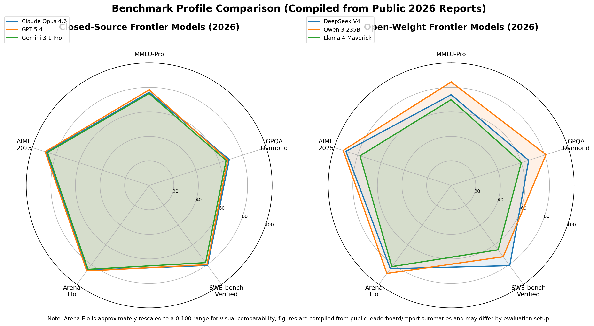

# Day 25: 评估与基准测试

> **核心问题**: 我们怎么知道一个 LLM 到底好不好——以及为什么最受欢迎的基准测试正在变得不可靠？

---

## 开篇

想象你在买手机。两款机型：一个"手机跑分"98 分，另一个 92 分。选前者，对吧？但如果"手机跑分"只测自家 App 的启动速度呢？98 分那款可能只是在刷分。

这基本就是 2026 年 LLM 评估面临的情况。最著名的基准测试 MMLU（Massive Multitask Language Understanding）已经饱和——顶级模型全在 90% 以上。HumanEval 这个编程基准，模型们跑到了 95%+。当人人都能考高分，考试就失去了区分度。

这篇文章讲的是：我们怎么衡量 LLM、为什么衡量比看起来难得多、以及当旧基准失效新基准崛起时，评估格局是什么样的。


*图 1: LLM 基准测试的主要类别——知识与推理、编程、人类偏好——各有不同的评估目标。*

---

## 1. 为什么评估重要，以及为什么它比看起来更难

#### 直觉：考试问题

评估 LLM 有点像评估学生，但更麻烦。

- 选择题考试能测出学生会不会认标准答案。
- 论文作业能测出学生会不会组织观点，但也可能借助外部帮助。
- 面试看得出现场思考能力，但面试官本身会有偏好。
- 实习最接近真实工作，但成本高、很难标准化。

LLM 也是一样。没有任何一个 benchmark 能真正代表“智能”本身。每个 benchmark 都只是在测某一个切面。

### 1.1 我们到底想测什么？

在谈 benchmark 之前，先问一个更根本的问题：**“好模型”到底是什么意思？**

| 如果你关心... | 你真正想测的东西 | 常见 benchmark |
|---|---|---|
| 知识 | 模型能否回忆正确事实 | MMLU, TriviaQA |
| 推理 | 模型能否多步思考、解难题 | GSM8K, GPQA, AIME |
| 编程 | 模型能否写出真的能工作的代码 | HumanEval, SWE-bench |
| 指令遵循 | 模型是否准确完成用户要求 | IFEval |
| 安全 / 真实性 | 模型是否避免有害或虚假输出 | TruthfulQA, ToxiGen |
| 人类偏好 | 人们是否真的更喜欢用它 | Chatbot Arena |

问题在于，这些目标往往彼此冲突。

一个模型可能：
- 很会写代码，但不太会处理模糊的人类指令，
- 很安全，但拒绝过多正常请求，
- 聊天很讨喜，但推理不够深，
- 考试分数很高，但在真实产品里很脆。

所以 benchmark 的核心，不是找出**唯一最好的模型**，而是找到**最适合某类工作的模型**。

### 1.2 评估流水线

实际评估通常怎么做？


*图 2：标准评估流程，从选 benchmark 到运行模型，再到最终评分。*

表面上看，这个流程很简单：

1. 选一个 benchmark，
2. 组织 prompt，
3. 跑模型，
4. 收集输出，
5. 评分和比较。

但每一步都有坑：

| 步骤 | 看起来很简单 | 实际可能出的问题 |
|---|---|---|
| 选 benchmark | “那就用 MMLU 吧” | MMLU 可能已经饱和 |
| 组织 prompt | “把题问给模型就行” | prompt 细节会显著影响分数 |
| 跑推理 | “temperature 设成 0 就行” | 解码设置仍然会影响结果 |
| 评分 | “对答案就好” | 输出格式、歧义、judge 偏差 |
| 比较模型 | “分高的赢” | 不同 benchmark 测的是不同能力 |

所以评估表面上看很客观，但底层其实很 messy。

---

## 2. 主流 benchmark，按“它到底在测什么”来整理

与其一个个列 benchmark，不如按**它试图完成什么任务**来组织，会更清楚。

### 2.1 知识考试：MMLU 这一类

#### 直觉：教材式考试

MMLU 很像一个超大型大学期末考试。它在问：跨多个学科，这个模型能不能选出正确答案？

MMLU（Massive Multitask Language Understanding）由 Dan Hendrycks 及其合作者在 2021 年提出，这项工作通常也和 Center for AI Safety 这条研究脉络联系在一起。它之所以经典，是因为它覆盖了 57 个学科，从法律到生物到数学。很多年里，它几乎是大家默认会引用的 benchmark。

**它为什么重要：** 覆盖面广，运行简单，最后能得到一个干净的数字。

**它为什么现在没那么有用了：** 到了 2025-2026，前沿模型几乎都拿到了很高的分数。大家都在 90% 左右时，分差就很难再说明太多问题。

所以大家开始转向更难的版本，比如 **MMLU-Pro** 和 **MMLU-CF**。

| Benchmark | 测什么 | 过去为什么流行 | 现在为什么变弱 |
|---|---|---|---|
| MMLU | 广泛学科知识 | 简单、全面、标准化 | 饱和、污染风险高 |
| MMLU-Pro | 更难的专家级题目 | 更能拉开差距 | 仍然是考试型选择题 |
| MMLU-CF | 去污染版本（尽量排除模型训练时可能见过的原题/近似题） | 信号更干净 | 仍继承 MMLU 的根本限制 |

它的分数计算非常简单：

$$
\text{Accuracy} = \frac{\text{答对题数}}{\text{总题数}}
$$

这个简单性，正是它当年流行的原因，也是后来容易被过度优化的原因。

### 2.2 深度推理：GPQA、AIME、ARC-AGI

#### 直觉：不是“你背过没有”，而是“你会不会想”

有些 benchmark 试图测的不是记忆，而是真正的推理能力。

- **GPQA** 由 David Rein、Betty Li Hou、Samuel Bowman 等合作者在 2023 年提出，测的是研究生级别的科学推理。更准确地说，它更像是一个研究团队提出的学术 benchmark，而不是某个单一机构推出的产品。
- **AIME** 来自美国邀请数学考试（American Invitational Mathematics Examination）这类竞赛题型，测的是奥数级别的数学多步推理。
- **ARC-AGI** 源自 François Chollet 在 2019 年提出的 ARC，并在 ARC-AGI 2（2025）中进一步加强，测的是抽象模式归纳和小样本泛化。

它们更像是在问：

> 当答案不能靠表面熟悉感直接认出来时，这个模型还能不能真的想明白？

| Benchmark | 最接近的现实类比 | 为什么到 2026 仍然重要 |
|---|---|---|
| GPQA Diamond | PhD 口试 | 依然能明显拉开前沿模型差距 |
| AIME 2025 | 数学竞赛 | 很强的多步符号推理测试 |
| ARC-AGI 2 | 抽象智力谜题 | 更测泛化，不容易靠背答案过关 |

### 2.3 编程：HumanEval vs SWE-bench

#### 直觉：小作业 vs 真工单

这个区别特别重要。

**HumanEval** 由 OpenAI 在 2021 年提出，更像给学生一道小编程题：给你函数签名和 docstring，你把函数补出来。

**SWE-bench** 由 Princeton 的研究者在 2024 年提出，更像给工程师一个真实 GitHub issue：进入一个又大又乱的代码库，真的把 bug 修掉。

所以 HumanEval 是早期很好的编程 benchmark，但现在已经不够了。

| Benchmark | 任务体感 | 核心弱点 |
|---|---|---|
| HumanEval | 写一个小而独立的函数 | 太干净、太小、脱离真实工程 |
| SWE-bench Verified | 修一个真实代码库里的问题 | 更贵、更难跑、更难标准化 |

HumanEval 常用 **pass@k** 作为指标，也就是：生成 k 个答案，只要有一个正确就算成功的概率。

$$
\text{pass@k} = 1 - \frac{\binom{n-c}{k}}{\binom{n}{k}}
$$

大白话理解：
- **pass@k** 的意思是，允许模型一次生成 **k 个不同答案**
- 只要这 **k 个里面有 1 个是对的**，就算成功
- 所以这个指标衡量的是："如果我让模型多试几次，它写出至少一个正确答案的概率有多高？"

其中：
- $n$ 是总共采样的答案数，
- $c$ 是其中正确的答案数，
- $k$ 是允许尝试的次数。

大白话总结：**HumanEval 问的是“你能不能写对一个小函数”，SWE-bench 问的是“你能不能像软件工程师一样工作”。**

### 2.4 人类偏好：Chatbot Arena

#### 直觉：餐厅回头客测试

传统 benchmark 更像美食评论家打分。

Chatbot Arena 更像问成千上万真实用户：

> 你下次还愿不愿意来这家餐厅？

Arena 不用固定试题，而是让用户把两个匿名模型的回答放在一起比，选更喜欢的那个。Chatbot Arena 由 **LMSYS Org** 在 2023 年推出，最后把这些真实用户投票聚合成 **Elo rating**。

所以是的：**它不是一个在固定题库上自动打分的静态 benchmark，而是需要真实用户参与投票的动态评测系统。** 这恰恰也是它比普通选择题 benchmark 更能反映人类偏好的原因。

$$
R_{\text{new}} = R_{\text{old}} + K(S - E)
$$

大白话理解：
- **Elo** 是一种相对排名分，最早来自国际象棋
- 两个模型放在一起对战，由人类投票选更喜欢的回答
- 如果一个原本分数较低的模型打赢了高分模型，它会涨更多分
- 所以 Elo 衡量的是："当人类把它和别的模型放在一起比较时，他们更常偏好它吗？"

其中：
- $R$ 是评分，
- $K$ 控制分数变化幅度，
- $S$ 是实际结果（赢/输/平），
- $E$ 是根据旧评分推算出的预期结果。

Arena 为什么重要：
- 它更接近真实使用，
- 比静态考试更难过拟合，
- 它测的是用户喜欢、可用性和风格，而不只是“答对没有”。

为什么它仍然不完美：
- 用户可能更喜欢长而自信的回答，
- 不同任务的人类偏好不一样，
- 聊天质量不等于科学推理能力。

### 2.5 超难前沿 benchmark：HLE

#### 直觉：专门用来阻止排行榜通货膨胀的考试

当老 benchmark 饱和以后，社区就会造一个更难的新 benchmark。

**Humanity's Last Exam (HLE)** 就是这样诞生的。它在 2025 年初由 **Center for AI Safety** 和 **Scale AI** 联合推出，特点是规模大、专家撰写，而且故意设计成让前沿模型也很难拿高分。

它的前世今生可以这样理解：
- **HLE 之前**，领域里大量引用的是 MMLU、HumanEval 这类经典 benchmark。
- **后来这些 benchmark 开始饱和**，前沿模型之间的差距越来越小，排行榜变得不再有信息量。
- **与此同时，污染问题越来越严重**，大家开始怀疑高分到底是“真会了”，还是“训练时见过类似题了”。
- **于是 HLE 被设计出来，作为一次“重新拉开差距”的尝试**：题目更多、更难、专家性更强，目标就是重新建立 frontier 模型之间的区分度。

所以，HLE 重要的不是它名字里那个“Last”，而是它代表着 benchmark 演化的一个新阶段：从课堂式考试，走向故意设计得足够难、足够前沿的“终极大考”。

| 维度 | 传统经典 benchmark | HLE |
|---|---|---|
| 规模 | 通常几百到几千题 | 超过 12,000 道专家题 |
| 难度 | 很多已经接近饱和 | 故意保持高难 |
| 目标 | 一般性比较 | 重新建立 frontier 区分度 |
| 它主要解决什么问题 | 覆盖不足、区分不够 | 饱和 + 排行榜通货膨胀 |

重点不是它真的是“最后一场考试”，而是它重新建立了区分度。

---

## 3. 现代 benchmark 的三大问题

这其实才是这一章最核心的部分。Benchmark 很有用，但它们一直在以三种方式反复失效。

### 3.1 问题一：饱和（saturation）

#### 直觉：如果人人都考 A，考试就不再能区分学生

一个 benchmark 刚出来时，分数差距很有意义。
当 top 5 模型都在 90 到 94 之间时，它的区分能力就大幅下降。

这正是 MMLU 和 HumanEval 后来发生的事。


*图 3：benchmark 饱和时间线。MMLU 和 HumanEval 基本已接近饱和，而 GPQA Diamond 仍有明显区分能力。*

典型生命周期是：

1. 新 benchmark 出现，
2. 模型起初表现很差，
3. 各家开始围绕它优化，
4. 分数迅速上升，
5. benchmark 失去区分度，
6. 社区再造一个更难的 benchmark。

所以当你看到某个实验室宣传“我们在 MMLU 上 SOTA”，你真正该问的是：

> 这个 benchmark 到 2026 年还足够有信息量吗？

很多时候，答案是：已经不太有了。

### 3.2 问题二：污染（contamination）

#### 直觉：学生提前看过考题

benchmark 只有在模型没提前见过答案时才有意义。

但 LLM 是在海量互联网数据上训练的，而很多 benchmark 本身就公开挂在网上，这就形成了**数据污染**。


*图 4：当 benchmark 问题出现在训练语料中时，模型分数会被“记忆”抬高，而不是靠真正能力得到。*

污染的方式包括：
- 原题直接出现在训练集，
- 改写版题目出现在博客或论坛，
- 答案讨论出现在教程、repo 或笔记里。

最麻烦的是：污染很难完全证明，也很难完全排除。

| 缓解方法 | 核心思路 | 限制 |
|---|---|---|
| 私有 holdout 题库 | 不公开 benchmark | 不利于开放研究 |
| 改写题目 | 重写现有 benchmark | 可能改变难度 |
| 动态 benchmark | 持续生成新题 | 维护成本很高 |
| 污染检测工具 | 搜训练集重合 | 很难抓住隐性改写 |

所以 benchmark 分数从来不只是能力分数，它总是能力 **加上可能的曝光效应**。

### 3.3 问题三：benchmark 与真实任务不匹配

#### 直觉：会开车考试，不代表就能当好出租车司机

即使一个 benchmark 没污染、也没饱和，也不代表它能预测真实产品表现。

因为真实工作就是更 messy：

- 真实用户的问题经常含糊不清，
- 真实编程是在大型代码库里进行，
- 真实客服是长对话，
- 真实科研带着大量不确定性。

所以一个模型可能 benchmark 很强，但产品表现一般。

---

## 4. 那 2026 年到底该看什么？

#### 直觉：用和岗位匹配的考试来选人

如果你在招人：
- 不会用诗歌比赛成绩去招会计，
- 也不会用拼写比赛去招物理学家。

LLM benchmark 也是同样道理。

### 4.1 实用 benchmark 选择表

| 你的真实问题 | 最适合先看的 benchmark | 为什么 |
|---|---|---|
| 用户整体更喜欢哪个模型？ | Chatbot Arena Elo | 最接近真实人类偏好 |
| 哪个模型科学推理最强？ | GPQA Diamond | 仍然难、仍然能拉开差距 |
| 哪个模型最适合真实编程？ | SWE-bench Verified | 真 repo、真 issue |
| 哪个模型最会做难数学？ | AIME 2025 | 强多步数学推理 |
| 哪个模型抽象泛化最强？ | ARC-AGI 2 | 不容易靠背答案取巧 |
| 哪个模型最听指令？ | IFEval | 直接测指令遵循 |
| 现阶段最硬的通用考试是什么？ | HLE | 分数仍低，区分力高 |

### 4.2 看 profile，不要看单一神奇数字

评估里最大的误区之一，就是想把一切压缩成一个总排名。

更好的方式是看一个**能力画像（profile）**。


*图 3b：基于 2026 年公开 leaderboard / benchmark 报告整理的真实前沿模型能力画像，对比了几种闭源和开源/开放权重模型在 MMLU-Pro、GPQA Diamond、SWE-bench Verified、Arena Elo 和 AIME 2025 上的表现。重点不是看谁的多边形“绝对最大”，而是看不同模型的能力形状。注：为了便于同图展示，Arena Elo 做了近似缩放；数值来自公开汇总，不代表单一官方统一口径。*

看的是**形状**，不是单个 headline number。

### 4.3 真做产品时，必须自己建 eval

这是这一章最实用的一点。

如果你真的在部署 LLM 系统，公共 benchmark 只能是起点，不能是终点。

你还需要：

1. 用真实用户 query 建自己的任务集，
2. 为自己的业务定义成功标准，
3. 做真实用户 A/B 测试，
4. 持续监控随时间漂移的效果。

公共 benchmark 告诉你模型在实验室里怎么样。
你自己的 eval 才告诉你它在你业务里好不好用。

---

## 5. 2025-2026 发生了哪些新变化？

### 5.1 评估从“静态考试”转向“动态任务”

到 2025-2026，社区越来越意识到：静态多项选择题太容易污染，也太容易饱和。

所以评估开始转向：
- 更难的专家级 benchmark，比如 HLE，
- 更注重去污染的版本，比如 MMLU-CF，
- 更真实的工程任务，比如 SWE-bench Verified，
- 实时人类偏好系统，比如 Arena，
- 面向 agent 的 benchmark，比如 WebArena 和 WebVoyager。

这代表一个很大的转变：领域正在从

> “模型能不能答题？”

转向

> “模型到底能不能真的完成工作？”

### 5.2 agent 时代改变了“评估”的定义

一旦模型从 chatbot 变成 agent，评估方式也必须跟着变。

对网页智能体来说，普通聊天 benchmark 根本不够。你还得测：
- 出错后能不能恢复，
- 多步流程能不能走通，
- 在开放环境里能不能安全行动。

这也是为什么 WebArena、WebVoyager 这类 benchmark 在 2026 比两年前重要得多。

### 5.3 LLM-as-judge 变主流了，但仍然有争议

越来越多实验室开始用更强的模型去评估较弱的模型。

原因很简单：
- 人工评估慢，
- 成本高，
- 一致性差。

但争议也很明显：
- judge 本身也是模型，
- 它自己也有偏见，
- 它的偏好不等于客观真理。

所以 LLM-as-judge 很有用，但不能把它当作绝对客观的裁判。

---

## 6. 常见误解

### ❌ “benchmark 分数更高，模型就更聪明”

不一定。它可能只是：
- benchmark 已经饱和，
- 模型专门针对这个 benchmark 做了优化，
- benchmark 只测了一个窄能力，
- 数据污染抬高了分数。

### ❌ “只要 benchmark 更难就行了”

更难只是一时有效。最终还是会再次被饱和。

### ❌ “Chatbot Arena 用真人投票，所以最完美”

Arena 很有价值，但人类偏好本身就噪声大、受风格影响，而且高度依赖任务类型。

### ❌ “benchmark 是客观真理”

benchmark 一直都带着设计选择：
- 选什么任务，
- 怎么写 prompt，
- 用什么 metric，
- 谁来 judge，
- 来自什么数据分布。

所以评估更像“测量工程”，而不是纯粹的真理发现。

## 7. 代码示例：运行一个简单的评估

以下是如何使用 Hugging Face 数据集运行 MMLU 风格评估：

```python
"""
简单的 MMLU 风格评估，使用 Hugging Face 数据集。
通过模型运行多选题并计算准确率。
"""

from datasets import load_dataset
from transformers import AutoModelForCausalLM, AutoTokenizer
import torch

# 加载 MMLU 的一小部分（STEM 学科）
dataset = load_dataset("cais/mmlu", "all", split="test", trust_remote_code=True)
dataset = dataset.filter(lambda x: x["subject"] in ["abstract_algebra", "astronomy"])

# 加载模型和分词器
model_name = "gpt2"  # 替换为你的模型
tokenizer = AutoTokenizer.from_pretrained(model_name)
model = AutoModelForCausalLM.from_pretrained(model_name)
model.eval()

def format_mmlu_prompt(question, choices):
    """将多选题格式化为提示词。"""
    labels = ["A", "B", "C", "D"]
    options = "\n".join(f"{l}. {c}" for l, c in zip(labels, choices))
    return f"{question}\n{options}\nAnswer:"

def evaluate_one(question, choices, answer_idx):
    """
    通过比较每个选项的对数概率来评估单个问题。
    """
    prompt = format_mmlu_prompt(question, choices)
    inputs = tokenizer(prompt, return_tensors="pt")

    with torch.no_grad():
        outputs = model(**inputs)
        logits = outputs.logits[0, -1, :]  # 最后一个 token 的 logits

    # 比较 A, B, C, D token 的对数概率
    label_tokens = [tokenizer.encode(l)[0] for l in ["A", "B", "C", "D"]]
    log_probs = torch.log_softmax(logits, dim=-1)
    scores = [log_probs[t].item() for t in label_tokens]

    predicted = scores.index(max(scores))
    return predicted == answer_idx

# 运行评估
correct = 0
total = 0
for example in dataset.select(range(min(50, len(dataset)))):
    if evaluate_one(example["question"], example["choices"], example["answer"]):
        correct += 1
    total += 1

accuracy = correct / total
print(f"Accuracy: {accuracy:.2%} ({correct}/{total})")
```

这展示了基本模式：格式化问题、获取模型分数、比较预测和答案。生产评估系统会加入提示工程、少样本示例、思维链和更复杂的评分——但核心循环是一样的。

---

## 8. 延伸阅读

### 入门
1. [LMSYS Chatbot Arena](https://chat.lmsys.org)——亲自试试，给模型对比投票
2. [Hugging Face Open LLM Leaderboard](https://huggingface.co/spaces/HuggingFaceH4/open_llm_leaderboard)——社区基准追踪
3. [LLM Benchmarks Compared (LXT, 2026)](https://www.lxt.ai/blog/llm-benchmarks/)——当前格局的优质概览

### 进阶
1. ["A Survey on Data Contamination for Large Language Models"](https://arxiv.org/abs/2502.14425)——数据污染综合综述
2. ["Are We Done with MMLU?"](https://arxiv.org/abs/2406.04127)——MMLU 局限性分析
3. ["When Benchmarks Leak: Inference-Time Decontamination for LLMs"](https://arxiv.org/abs/2601.19334)——2026 年 1 月的污染缓解方案

### 关键论文
1. ["Measuring Massive Multitask Language Understanding" (MMLU)](https://arxiv.org/abs/2009.03300)——Hendrycks 等人, 2021
2. ["Evaluating Large Language Models Trained on Code" (HumanEval)](https://arxiv.org/abs/2107.03374)——Chen 等人, 2021
3. ["Google-Proof Question Answering" (GPQA)](https://arxiv.org/abs/2311.12022)——Rein 等人, 2023
4. ["Chatbot Arena: An Open Platform for Evaluating LLMs by Human Preference"](https://arxiv.org/abs/2403.04132)——Zheng 等人, 2024
5. ["SWE-bench: Can Language Models Resolve Real-World GitHub Issues?"](https://arxiv.org/abs/2310.06770)——Jimenez 等人, 2023

---

## 思考题

1. 如果你在搭建一个客服聊天机器人，你会信任哪些基准来选择合适的模型——为什么光看 MMLU 不够？
2. 你觉得为什么基准饱和发生得这么快？是因为基准设计得不好，还是领域发展太快？
3. 你会如何为一个 LLM 产品设计评估方案，避免这篇文章讨论的各种陷阱？

---

## 总结

| 概念 | 一句话解释 |
|------|-----------|
| MMLU | 多学科知识测试，已饱和至 90%+ |
| GPQA Diamond | 研究生级科学题，仍能区分模型 |
| HumanEval | 函数级编程测试，接近饱和 |
| SWE-bench | 真实 GitHub issue 解决，更适合现代编程评估 |
| ARC-AGI 2 | 视觉模式推理，测试泛化而非记忆 |
| HLE | 14 个领域的专家级题目，分数很低 |
| Chatbot Arena | 人类偏好投票配 Elo 评分，600 万+ 投票 |
| 数据污染 | 基准问题泄漏到训练数据，虚高分数 |
| 基准饱和 | 所有顶级模型得分相近时，基准失去区分度 |

**核心要点**: LLM 评估是基准创建者和模型建造者之间的军备竞赛。旧基准饱和，数据污染破坏有效性，没有单一数字能反映真实表现。2026 年的最佳做法是使用多个互补基准（GPQA、SWE-bench、Arena Elo），并且始终在你自己的具体场景上评估。

---

*Day 25 of 60 | LLM 基础课程*
*字数: ~2900 | 阅读时间: ~14 分钟*
