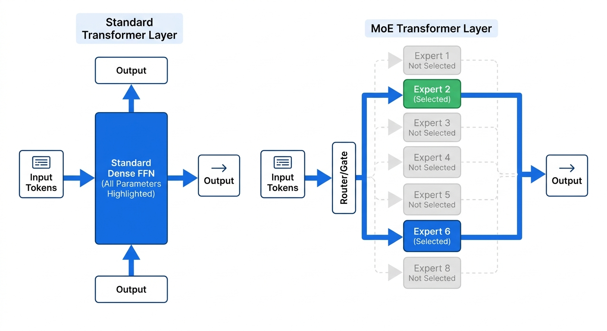
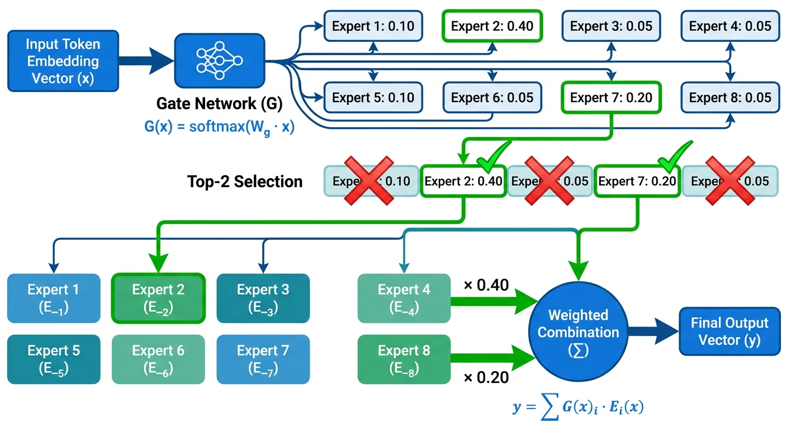
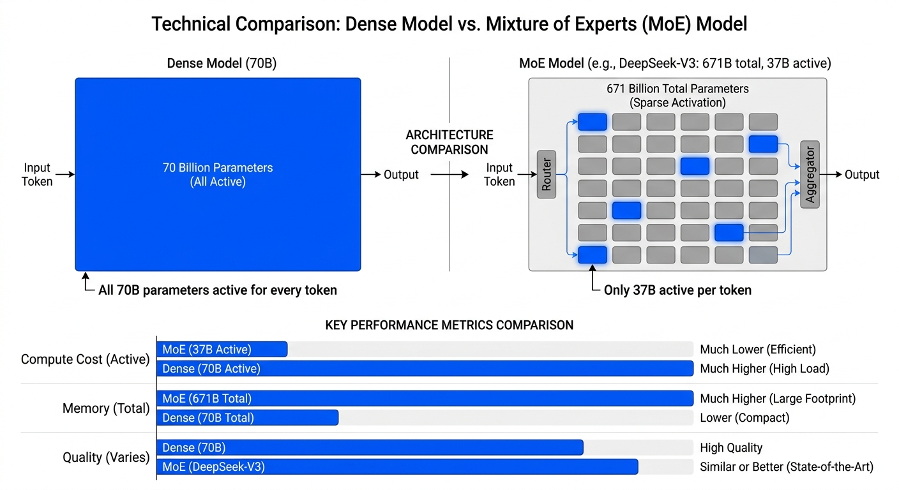
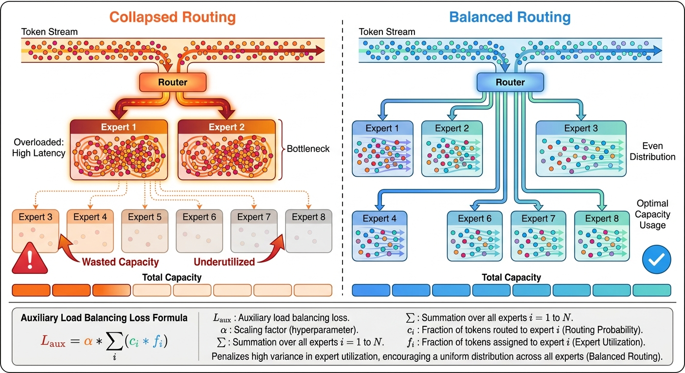
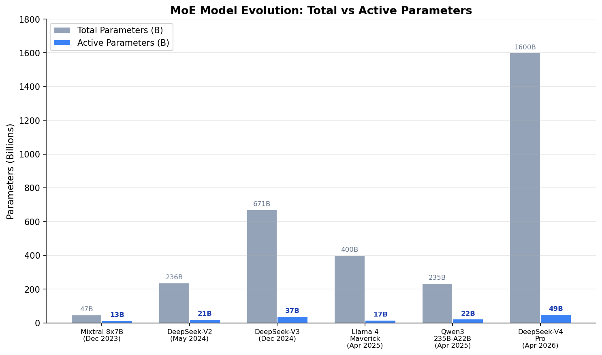

# Day 26: 混合专家模型（MoE）—— 稀疏激活，用更少算力驱动更大模型

> **核心问题**：一个拥有 6710 亿参数的模型，推理时只激活 370 亿参数 —— 这是怎么做到的？为什么有效？

---

## 开篇

想象一家医院。病人走进来，不会同时看所有医生 —— 分诊台护士会把他们引导到合适的专科。骨折去找骨科，胸痛去心内科，视力模糊去眼科。每位医生都训练有素，但任何一天里，大多数医生都在等待接诊。医院的总 expertise 极其庞大，但每个病人只需要几位专科医生。

这正是混合专家模型（Mixture of Experts, MoE）在大语言模型中的工作方式。MoE 不像传统模型那样让每个 token 都经过所有参数（好比每个病人都看遍所有医生），而是包含多个"专家"子网络，但每个 token 只激活其中一小部分。路由器 —— 那个分诊护士 —— 决定哪些专家处理哪些 token。

结果呢？一个拥有巨大 *知识容量* 的模型，但 *计算开销* 远小于同等规模。DeepSeek-V3 有 6710 亿总参数，但每个 token 只激活 370 亿 —— 约 5.5% 的利用率。DeepSeek-V4 Pro 更进一步：1.6 万亿总参数，仅 490 亿激活。利用率仅 3%。

MoE 已经不再是边缘技巧了。在 2025–2026 年，它已成为前沿模型的 *主流* 架构。Llama 4 Maverick、Qwen3-235B、DeepSeek-V3/V4 —— 全是 MoE。如果你想理解现代大语言模型，就必须理解 MoE。

---

## 1. 什么是混合专家模型？

### 1.1 从稠密到稀疏

在标准（稠密）Transformer 中，每个 token 都会经过前馈网络（FFN）的所有参数。一个 70B 参数的模型对每个 token 都使用全部 70B 参数。这简单但浪费 —— 并非每段文字都需要同一种处理。

#### 直觉：餐厅厨房

把稠密模型想象成一个厨房，每个厨师都要参与每道菜。MoE 则是一个有专业工位的厨房 —— 甜点师负责甜品，烤肉师负责牛排，调味师负责酱汁。每道菜只经过相关的工位。厨房的总人才更多，但每份订单只用到一小部分人手。

MoE 将 Transformer 每层中的稠密 FFN 替换为一组并行专家网络加上一个门控网络（路由器），由路由器决定使用哪些专家：


*图 1：MoE 层架构。路由器为每个输入 token 选择一部分专家，未选中的专家保持非激活状态。*

### 1.2 关键术语

| 术语 | 定义 |
|------|------|
| **专家（Expert）** | 前馈子网络，通常是标准的两层 MLP |
| **路由器/门控（Router/Gate）** | 一个小型神经网络，输出各专家的概率分布 |
| **Top-K 路由** | 选择路由器得分最高的 K 个专家（通常 K=1、2 或 8） |
| **总参数（Total parameters）** | 所有专家的所有参数（需要存储在内存中的） |
| **激活参数（Active parameters）** | 每个 token 实际使用的参数（决定计算开销） |
| **稀疏率（Sparsity ratio）** | 总参数 / 激活参数 —— 每个 token 有多少模型在"沉睡" |

### 1.3 核心机制

对于隐藏状态为 $h$ 的每个 token，路由器计算：

$$
\begin{aligned}
G(h) &= \text{softmax}(W_g \cdot h) \\
\text{TopK}(G(h), K) &= \text{选择得分最高的 K 个专家}
\end{aligned}
$$

MoE 层的输出是所选专家输出的加权和：

$$
y = \sum_{i \in \text{TopK}} G(h)_i \cdot E_i(h)
$$

这里的 $E$ 指的是 **Expert**。所以 $E_i(h)$ 的意思是：**第 $i$ 个 expert 网络对输入 $h$ 给出的输出**。

可以把这个公式拆开理解：
- $G(h)_i$ = 路由器分配给第 $i$ 个 expert 的权重
- $E_i(h)$ = 第 $i$ 个 expert 实际算出来的结果

所以整条式子的含义是：

> 最终输出 $y$，等于“每个被选中的 expert 的输出”乘上对应的 gate 权重，再把它们加起来。

也就是说，router 决定“谁上场、各占多大比重”，expert 负责“各自给出处理结果”。

只有被选中的专家执行计算，其余的闲置。


*图 2：路由工作原理 —— 门控网络为每个专家打分，选择 top-K，然后加权组合它们的输出。*

---

## 2. 稠密 vs MoE：核心权衡

### 2.1 计算与内存

MoE 创造了一种不寻常的权衡：

| 维度 | 稠密模型 | MoE 模型 |
|------|---------|---------|
| 每个 token 的计算量 | 与总参数成正比 | 与激活参数成正比 |
| 内存（VRAM） | 与总参数成正比 | 与总参数成正比 |
| 模型质量（每 FLOP） | 较低 | 较高 |
| 模型质量（每字节） | 较高 | 较低 |
| 通信量（多 GPU） | 较低 | 较高 |

#### 直觉：图书馆 vs 书架

稠密模型就像一个小书架 —— 每本书都触手可及，获取成本低，但容量有限。MoE 模型就像可以访问一座巨大的图书馆 —— 知识量惊人，但你需要走到正确的区域（路由），而且图书馆需要占地面空间（内存）来存放所有书。

这里最容易让人困惑的是三句话：**“每 FLOP 的模型质量更高”**、**“每字节的模型质量更低”**、以及 **“激活参数更少但通信量反而更高”**。可以这样理解：

- **每 FLOP 的模型质量**：意思是“同样花 1 单位计算，谁换来的效果更好”。MoE 虽然总参数更多，但每个 token 只激活一小部分 expert，所以它常常能用较少的实际计算，借助更大的总参数池，换来更强效果。
- **每字节的模型质量**：这里的“字节”本质上是在说显存 / 内存占用。Dense 模型把存进去的参数几乎都用上了，而 MoE 需要把大量 expert 都存着，但一次只激活其中少数几个，所以从“每 1GB 显存换来多少能力”的角度看，Dense 往往更划算。
- **为什么通信量更高**：因为“激活参数少”只说明乘加计算少了，不代表数据搬运少了。MoE 的 router 要先决定 token 去哪个 expert，如果这些 expert 分布在不同 GPU 上，就必须把 token 跨卡发送过去，算完后再把结果收回来。这种 all-to-all 路由与回传，会显著增加通信开销。

换句话说，Dense 的瓶颈更常是**纯计算**，而 MoE 的瓶颈更容易变成**路由、调度和跨 GPU 通信**。

核心洞察：**如果计算是你的瓶颈（训练时通常如此），MoE 能给你更高的每美元质量。** 如果内存是你的瓶颈（部署时往往如此），MoE 的服务难度更大。


*图 3：稠密模型每个 token 激活全部参数；MoE 模型只激活一小部分，以更低的计算成本获得相近质量。*

### 2.2 为什么 MoE 有效：条件计算

MoE 有效的深层原因是 *条件计算（Conditional Computation）* —— 不同的输入走不同的处理路径。这更高效是因为：

1. **专业化**：每个专家可以聚焦于特定模式（语法、推理、事实回忆、代码等）
2. **容量**：总参数量提供了海量知识存储，即使每个 token 只访问其中一片
3. **效率**：激活参数保持在低位，训练和推理的单位 token 成本更低

DeepSeek-V3 的研究表明，专家并不总是按主题清晰地专业化。相反，它们往往按 *token 频率和位置* 专业化 —— 有些专家处理常见 token，有些处理罕见 token。模型在训练过程中自行发现有意义的分工。

#### 最新研究在追问什么：expert 到底在专门化什么？

这个问题现在已经变成 MoE 研究里的一个活跃方向。一个比较准确的总结是：**expert 的确会形成分工，但这种分工通常比“数学专家”“历史专家”这种人类直觉更混杂、更统计化。**

下面是几项比较有代表性的进展：

| 论文 / 项目 | 机构 | 年份 | 主要发现 |
|---|---|---|---|
| **OpenMoE** | Colossal-AI / 新加坡国立大学等合作者 | 2024 | 报告了 **context-independent specialization**、早期路由快速成形，以及后期层路由多样性下降，说明 expert 往往很早就锁定在某些稳定的 token 模式上。 |
| **DeepSeekMoE** | DeepSeek-AI | 2024 | 强调更细粒度的 expert specialization，并引入 **shared experts**，因为有些知识过于通用，不适合被硬切分到某一个 routed expert。 |
| **OLMoE** | Allen Institute for AI 及合作者 | 2024/2025 | 直接定义并测量 routing properties，发现 expert 的高专业化、低共激活，以及更像 **domain / vocabulary specialization** 的现象，而不是整齐的学科式分工。 |
| **Soft MoE** | Google DeepMind | 2024 | 说明更软的分配方式可以缓解硬路由带来的 token dropping、负载不稳等问题，也提醒我们：specialization 有时更像连续谱，而不是非黑即白的 top-k 指派。 |
| **Expert Choice Routing** | Google Research | 2022 | 表明 routing 规则本身会显著改变哪些 expert 被使用、负载是否均衡，所以我们观察到的“expert specialization”有一部分其实也是路由设计的产物。 |

研究者也开始做更直接的 **expert ablation / lesion study**：关掉某个 expert、关掉一组 expert，或者把某些 token 强制改送到别的 expert，再看模型在哪些地方退化。当前形成的认识比较一致：

- 有些 expert 的确比别的更关键；
- 有些 expert 更像在处理词频、格式、位置模式；
- 更深层的 expert 有时更接近语义层面或任务层面的行为；
- 但很多功能仍然是分布式的，所以“去掉一个 expert = 去掉一个明确概念”通常过于简单。

所以，当前前沿研究更接近这样一种看法：

> MoE 学到的确实是一种稀疏分工，但这种分工是由优化压力、路由规则、负载均衡约束和数据统计结构共同塑造的，而不只是由人类容易命名的主题决定。

如果把它翻成一句更实用的话，那就是：MoE 研究的重点，正在从 **“稀疏路由能不能 work”**，转向 **“形成了什么样的 specialization，它稳不稳定，能不能被解释和控制”**。

> #### 研究笔记：MoE 像不像在“工程化地逼近流形”？
>
> 一个很有启发性的理解是：MoE 并不是显式地去学习一个连续流形，但它很像是在用工程化、离散化的方法，去逼近这样一种结构：**不同输入位于表示空间中的不同局部区域，因此更适合走不同的局部计算路径。**
>
> 这和流形学习的直觉有相通之处，因为两者都强调 **locality（局部性）**。如果输入分布本身具有某种局部结构，那么 expert specialization 可以被看成是在做一种 **分段的、条件化的函数逼近**。当然，这里也不能说过头：MoE 不是严格意义上的流形模型，它的路由是离散的、工程化的、受系统约束的。但把它看成“在局部区域上分配不同计算专家”的机制，往往能帮助我们更深地理解为什么 sparse routing 会有效。

---

## 3. 路由问题，以及 MoE 的其他现实挑战

### 3.1 负载均衡

MoE 最大的挑战是路由坍塌（Routing Collapse） —— 路由器倾向于将所有 token 发送到相同的少数专家，让其他专家闲置。这完全违背了设置多个专家的初衷。


*图 4：坍塌的路由浪费专家容量；均衡的路由将工作均匀分配。辅助损失惩罚不均衡。*

#### 直觉：人气餐厅

想象一个美食广场，所有人都挤进同一家餐厅，其他餐厅空空如也。热门厨房超载变慢；空着的店铺浪费租金。MoE 需要一套机制将顾客分散开来。

### 3.2 辅助损失

标准解决方案由 Switch Transformers（Fedus 等人，2022）引入，在训练目标中添加辅助负载均衡损失：

$$
L_{\text{aux}} = \alpha \cdot N \cdot \sum_{i=1}^{N} f_i \cdot P_i
$$

其中：
- $f_i$ = 路由到专家 $i$ 的 token 比例
- $P_i$ = 专家 $i$ 的平均路由概率
- $N$ = 专家数量
- $\alpha$ = 小系数（通常 0.01）

### 3.3 MoE 的挑战不只是负载均衡

负载均衡是 MoE 最经典的问题，但不是唯一的问题。真正落地时，MoE 面临的是一整串挑战：

| 挑战家族 | 典型问题 |
|---|---|
| **路由动态** | routing collapse、expert 利用不足、训练早期不稳定、token dropping |
| **系统代价** | all-to-all 通信昂贵、跨 GPU 调度复杂、延迟波动更大 |
| **优化难度** | 稀疏路由更难训练、辅助损失敏感、某些 expert 学得很慢 |
| **specialization 问题** | expert 可能更偏浅层统计模式，而不是稳定的任务级能力 |
| **部署成本** | 总参数仍然要常驻内存，因此服务成本依然可能很高 |
| **安全与控制** | 不同 expert 的对齐效果可能不一致，路由变化也可能带来行为漂移 |
| **评估方法** | 很难判断性能提升究竟来自真实能力、路由技巧，还是 benchmark 偶然优势 |

#### 直觉：MoE 省的是计算，不是复杂度

一个很好的理解方式是：
- 稠密模型更常被 **纯计算** 限制；
- MoE 确实减少了部分计算；
- 但作为交换，它引入了更大的 **协调问题**。

所以，MoE 不是“更便宜的稠密模型”这么简单。它更像一个分布式组织系统，需要路由、均衡、同步和监控才能运行良好。

这也是为什么现在的 MoE 研究，往往同时分成三条线：
1. **算法线**：改进 routing 和 expert specialization；
2. **系统线**：降低通信成本、提升部署效率；
3. **科学问题线**：理解 expert 到底学到了什么。

当某些专家收到过多 token（高 $f_i$）且路由器强烈偏好它们（高 $P_i$）时，损失增大，从而惩罚不均衡。

**问题**：较大的辅助损失会干扰主训练目标，降低模型质量。较小的可能无法防止坍塌。这种张力是 MoE 设计的核心挑战。

### 3.3 无辅助损失的方法

近期研究探索了替代方案。DeepSeek-V2 引入了基于偏置的方法：不使用辅助损失，而是动态调整路由器的偏置项来维持均衡。如果某专家收到过多 token，降低其偏置；过少则增加。

Han 等人（2025）提出了无辅助损失负载均衡的理论框架，证明了偏置调整方法可以在不干扰主损失梯度信号的情况下实现均衡。

| 方法 | 工作原理 | 优点 | 缺点 |
|------|---------|------|------|
| 辅助损失 | 在训练目标中惩罚不均衡 | 简单，研究充分 | 干扰主损失 |
| 偏置调整 | 动态调整路由器偏置项 | 无梯度干扰 | 实现更复杂 |
| 专家选择 | 专家选择 token（而非反过来） | 天然完美均衡 | 更难控制单 token 质量 |
| 容量因子 | 硬性限制每个专家的 token 数 | 防止过载 | 可能丢弃 token |

---

## 4. 实践中的 MoE：主要模型

### 4.1 MoE 模型演进


*图 5：MoE 模型演进，展示总参数 vs 激活参数。总参数与激活参数之间的差距急剧扩大，DeepSeek-V4 Pro 仅激活其 1.6T 参数的 3%。*

### 4.2 主要 MoE 模型对比

| 模型 | 时间 | 总参数 | 激活参数 | 专家数 | Top-K | 特色 |
|------|------|--------|---------|--------|-------|------|
| Mixtral 8x7B | 2023.12 | 47B | 13B | 8 | 2 | 首个有竞争力的开源 MoE LLM |
| DeepSeek-V2 | 2024.5 | 236B | 21B | 160 | 6 | 共享专家 + 路由专家 |
| DeepSeek-V3 | 2024.12 | 671B | 37B | 256 | 8 | 无辅助损失路由 |
| Gemma 4 26B A4B | 2025.4 | 26B | 4B | — | — | Google 推出的轻量高效 MoE |
| Llama 4 Maverick | 2025.4 | 400B | 17B | 128 | — | 多模态 MoE |
| Qwen3-235B | 2025.4 | 235B | 22B | 128 | 8 | 无共享专家 |
| DeepSeek-V4 Pro | 2026.4 | 1.6T | 49B | — | — | 混合注意力 + MoE |

### 4.3 DeepSeek 的共享 + 路由专家设计

DeepSeek-V2/V3 引入了一个重要的架构创新：**共享专家**。除了路由专家（由路由器选择）之外，还有少量"共享"专家无条件处理每个 token。

#### 直觉：全科医生与专科医生

在医院里，有些处理太常见了（体检、基本化验），不管看哪个专科都需要。共享专家就像全科医生 —— 处理通用逻辑。路由专家是专科医生 —— 只在需要其专长时激活。

这种设计减轻了路由专家的负担。共享专家捕获常见模式，让路由专家更自由地进行更精细的专业化。

Qwen3 采取了相反的做法 —— 没有共享专家，所有 128 个专家都是路由的，使用 top-8 选择。模型在没有强制共享的情况下学习分配知识。两种方法都有效；领域尚未收敛到唯一最佳设计。

---

## 5. MoE 的训练与部署

### 5.1 训练挑战

MoE 模型引入了独特的训练难题：

1. **通信开销**：在分布式训练中，路由到不同 GPU 上专家的 token 需要全对全（all-to-all）通信，这可能主导训练时间。
2. **负载不均**：若不仔细均衡，某些 GPU 处理的 token 远多于其他 GPU，导致空闲。
3. **训练不稳定**：MoE 产生的稀疏梯度可能使训练不如稠密模型稳定。
4. **专家利用不足**：某些专家可能收不到足够的训练信号来学习有用功能。

### 5.2 部署考量

部署 MoE 模型需要仔细的工程设计：

- **内存**：需要将所有参数保存在内存（或快速存储）中，即使每个 token 只激活一小部分
- **批处理**：批次中不同 token 可能路由到不同专家，需要动态批处理
- **延迟**：路由在每层增加少量开销
- **量化**：MoE 模型可以量化（如 DeepSeek-V3 使用 FP8），但专家路由增加了复杂性

#### 直觉：仓库

部署稠密模型像经营一家小店 —— 所有东西都在展示架上，随手可取。部署 MoE 像经营一座巨型仓库 —— 你需要整栋建筑（内存），但每个顾客只逛几个过道（激活参数）。仓库能存更多货（知识），但维护成本更高（内存），即使每次取货很快（每 token 计算量低）。

---

## 6. 代码示例：最小 MoE 层

```python
import torch
import torch.nn as nn
import torch.nn.functional as F

class MoELayer(nn.Module):
    """一个最简单的混合专家层，使用 top-K 路由。"""
    
    def __init__(self, d_model, d_ff, num_experts=8, top_k=2):
        super().__init__()
        self.num_experts = num_experts
        self.top_k = top_k
        
        # 路由器：将隐藏状态映射到专家概率
        self.gate = nn.Linear(d_model, num_experts, bias=False)
        
        # 专家：每个是标准的两层 FFN
        self.experts = nn.ModuleList([
            nn.Sequential(
                nn.Linear(d_model, d_ff),
                nn.SiLU(),
                nn.Linear(d_ff, d_model)
            ) for _ in range(num_experts)
        ])
    
    def forward(self, x):
        # x 形状: (batch_size, seq_len, d_model)
        batch_size, seq_len, d_model = x.shape
        
        # 展平以进行路由: (batch * seq, d_model)
        x_flat = x.view(-1, d_model)
        
        # 计算路由器得分: (batch * seq, num_experts)
        gate_logits = self.gate(x_flat)
        gate_probs = F.softmax(gate_logits, dim=-1)
        
        # 选择 top-K 专家
        top_k_probs, top_k_indices = torch.topk(gate_probs, self.top_k, dim=-1)
        # 重新归一化选中概率
        top_k_probs = top_k_probs / top_k_probs.sum(dim=-1, keepdim=True)
        
        # 计算选中专家输出的加权和
        output = torch.zeros_like(x_flat)
        for i in range(self.top_k):
            for b in range(x_flat.shape[0]):
                expert_idx = top_k_indices[b, i].item()
                expert_output = self.experts[expert_idx](x_flat[b:b+1])
                output[b:b+1] += top_k_probs[b, i] * expert_output
        
        return output.view(batch_size, seq_len, d_model)

# 使用示例
moe = MoELayer(d_model=512, d_ff=2048, num_experts=8, top_k=2)
x = torch.randn(2, 10, 512)  # batch=2, seq_len=10
y = moe(x)
print(f"输入: {x.shape} -> 输出: {y.shape}")
# 每个 token 只激活 8 个专家中的 2 个！
```

---

## 7. 常见误解

### ❌ "MoE 专家按主题分工（一个负责代码，一个负责数学……）"

实际情况更微妙。研究表明，专家往往按 token 频率和位置模式专业化，而非清晰的语义类别。模型在训练过程中自行发现分工方式 —— 而且不一定可解释。

### ❌ "MoE 总是比稠密模型更高效"

MoE 计算效率更高（每 FLOP 质量更高），但内存效率更低。如果 VRAM 是瓶颈，稠密模型可能更实用。MoE 在内存充足但想最大化训练计算效率或推理吞吐量时表现出色。

### ❌ "专家越多越好"

增加专家能提升容量，但也增加路由难度、通信成本和专家训练不足的风险。收益递减很快出现。最佳专家数量取决于模型大小、数据量和硬件。

---

## 8. 前沿：2025–2026 年最新进展

### DeepSeek-V4（2026 年 4 月）
DeepSeek-V4 Pro 使用 1.6 万亿总参数，仅 490 亿激活 —— 3% 的激活率。其核心创新是混合注意力机制，结合了压缩稀疏注意力（CSA）和高压缩注意力（HCA），使百万 token 上下文变得实用。MoE 架构延续了 DeepSeek 无辅助损失路由 + 偏置调整的传统。([技术报告](https://huggingface.co/deepseek-ai/DeepSeek-V4-Pro/blob/main/DeepSeek_V4.pdf))

### DeepSeek-V4-Flash（2026 年 4 月）
配套模型，284B 总参数 / 13B 激活参数，专为速度优化。展示了 MoE 设计中的"智能密度"权衡 —— 每激活参数能承载多少质量。([Forbes 分析](https://www.forbes.com/sites/geruiwang/2026/04/26/deepseek-v4-shows-that-the-next-ai-race-is-about-efficiency/))

### 无辅助损失负载均衡理论框架（2025 年 12 月）
Han 等人形式化了基于偏置的负载均衡的理论框架，证明了收敛保证。这验证了 DeepSeek 的实践方法，为社区提供了替代辅助损失的原则性方案。([论文](https://arxiv.org/abs/2512.03915))

### MoE 综述（2025 年 7 月）
Zhang 等人的全面综述梳理了门控策略、稀疏和层级变体、多模态扩展及部署考量，表明评估越来越强调专家多样性和校准。([综述](https://arxiv.org/abs/2507.11181))

---

## 9. 延伸阅读

### 基础论文
1. ["Switch Transformers: Scaling to Trillion Parameter Models"](https://arxiv.org/abs/2101.03961) — Fedus 等人，2022。引入了简化的 top-1 路由和辅助损失。
2. ["Outrageously Large Neural Networks: The Sparsely-Gated Mixture-of-Experts Layer"](https://arxiv.org/abs/1701.06538) — Shazeer 等人，2017。深度学习中 MoE 的原始论文。
3. ["Mixture-of-Experts with Expert Choice Routing"](https://arxiv.org/abs/2202.09368) — Zhou 等人，2022。专家选择 token，而非 token 选择专家。

### 模型技术报告
4. [DeepSeek-V3 技术报告](https://arxiv.org/abs/2412.19437) — 无辅助损失 MoE 架构详情。
5. [Qwen3 技术报告](https://arxiv.org/abs/2505.09388) — 128 专家、top-8 路由设计。
6. [Llama 4 模型卡](https://www.llama.com/docs/model-cards-and-prompts/llama4/) — Meta 的 128 专家 MoE 方案。

### 进阶阅读
7. ["A Theoretical Framework for Auxiliary-Loss-Free Load Balancing"](https://arxiv.org/abs/2512.03915) — Han 等人，2025。
8. ["Mixture of Experts in Large Language Models"](https://arxiv.org/abs/2507.11181) — 2025 年全面综述。

---

## 思考题

1. 为什么条件计算（路由）在大模型中比小模型更有帮助？这说明了缩放与架构之间怎样的关系？
2. 如果 MoE 专家并不是按主题清晰地分工，那什么决定了它们的专业化？你会如何设计实验来验证？
3. MoE 用内存换计算。随着硬件发展（更多内存、更快互连），这个权衡会如何变化？MoE 会变得更主流还是更边缘？

---

## 总结

| 概念 | 一句话解释 |
|------|-----------|
| 混合专家模型 | 用多个子网络替代稠密 FFN，每个 token 只激活其中几个 |
| 路由器/门控 | 决定每个 token 使用哪些专家的小型网络 |
| Top-K 路由 | 选择门控得分最高的 K 个专家（通常 K=2 或 8） |
| 负载均衡 | 确保 token 均匀分布到各专家，防止坍塌 |
| 辅助损失 | 对专家利用率不均衡的训练惩罚 |
| 共享专家 | 处理每个 token 的通用专家（专科旁的全科医生） |
| 稀疏率 | 总参数 / 激活参数 —— 关键效率指标 |
| 条件计算 | 不同输入使用不同的计算路径 |

**核心要点**：MoE 已成为前沿 LLM 的主流架构，因为它将知识容量与计算成本解耦。通过将每个 token 路由到一小部分专家，DeepSeek-V3（671B 总 / 37B 激活）和 DeepSeek-V4 Pro（1.6T 总 / 49B 激活）等模型以稠密模型所需计算量的一小部分达到了前沿质量。路由、负载均衡和服务效率等核心挑战仍是活跃的研究方向，无辅助损失方法和混合注意力设计正在推动前沿。

---

*Day 26 of 60 | LLM Fundamentals*
*字数：约 3000 | 阅读时间：约 15 分钟*
