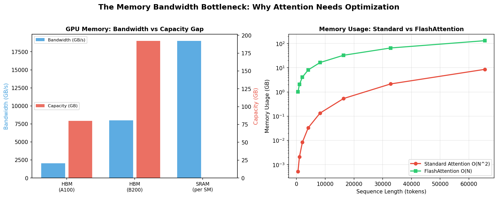
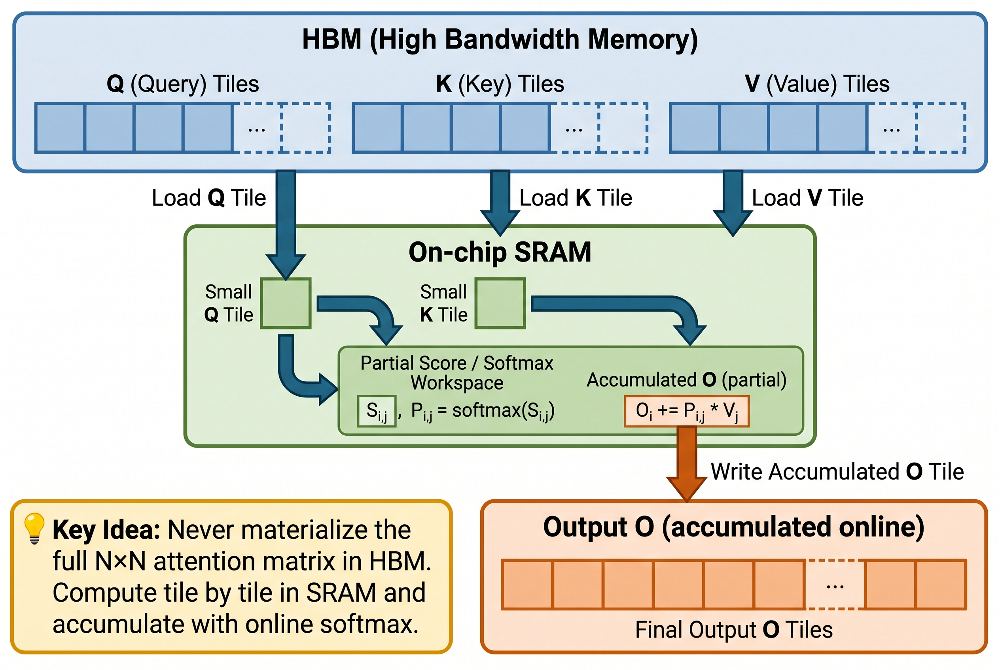
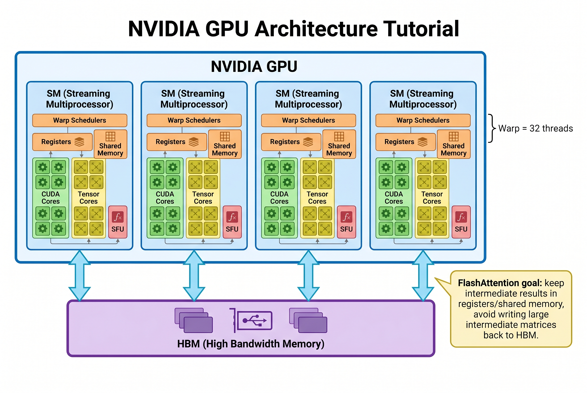
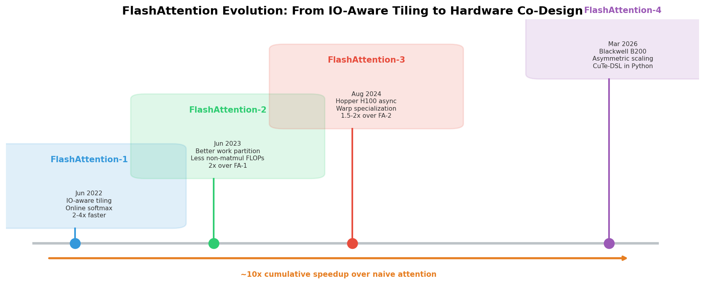
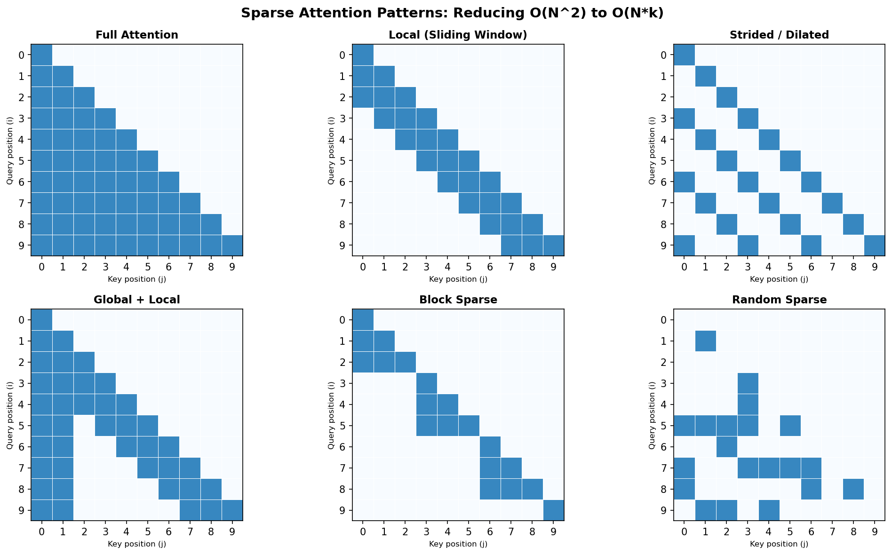

# Day 28: FlashAttention 与稀疏注意力

> **核心问题**：为什么注意力机制是 Transformer 的瓶颈？FlashAttention 和稀疏注意力如何突破内存墙？

---

## 开篇

想象你是一个要为 10,000 位宾客准备宴会的厨师。你有一个巨大的仓库（HBM，High Bandwidth Memory，高带宽内存）存满了食材，但厨房台面（SRAM）很小，一次只能放几样东西。笨办法是把 10,000 盘菜的食材全部搬到台面上——不可能。聪明的做法是分批处理：一次准备 50 盘，维护累计统计，永远不需要同时持有所有东西。

这正是现代 LLM 中注意力机制面临的问题。对于长度为 N 的序列，注意力矩阵的大小是 N²。一个 128K token 的上下文，意味着 128K × 128K 的矩阵——仅一个注意力层就大约需要 64 GB 内存。FlashAttention 和稀疏注意力从两个不同角度解决这个问题：FlashAttention 更高效地计算*精确*注意力，稀疏注意力则用更少的操作计算*近似*注意力。

今天我们来理解这两种方法——以及它们为什么对你使用的每个 LLM 都至关重要。

---

## 1. 内存带宽瓶颈

#### 直觉：数据搬运问题

把注意力想象成一条工厂流水线。工人（计算单元）很快——他们可以整天做矩阵乘法。但原料（数据）要从城对面的仓库（HBM，高带宽内存）运过来，装卸才是真正的瓶颈。如果工人大部分时间都在等原料到货，工人再快也没用。


*图 1：GPU 内存存在根本性矛盾——HBM 大但慢，SRAM 快但小。注意力的瓶颈在于两者之间的数据搬运。注：图中 SRAM 的容量柱看起来接近 0，不是因为 SRAM 没有容量，而是因为它通常只有 MB 量级；和 HBM 的几十到上百 GB 放在同一坐标轴上时，会被压得几乎看不见。*

标准注意力计算过程：

$$
\begin{aligned}
S &= Q K^T \quad &(N \times N \text{ 得分矩阵}) \\
P &= \text{softmax}(S) \quad &(N \times N \text{ 注意力权重}) \\
O &= P V \quad &(N \times d \text{ 输出})
\end{aligned}
$$

中间矩阵 S 和 P 都是 N × N。对于 N = 128K token、FP16（每个元素 2 字节），每个矩阵为 128K × 128K × 2 = **32 GB**。加上多头和多层，很快就会耗尽 HBM。

但 FlashAttention 论文（Dao 等人，2022）给出了关键洞察：**注意力的计算不是瓶颈，内存带宽才是。** GPU 的张量核心做数学运算的速度远超数据在 HBM 中进出的速度。瓶颈是 *IO*，不是 *FLOPs*。

在正式介绍 FlashAttention 之前，这里先不要急着逐项读右边这列公式。你只需要先抓住一个**定性结论**：

- **标准注意力** 会反复把大量中间矩阵写进 HBM 再读出来；
- **FlashAttention** 的关键思想是尽量把中间计算留在更快、更小的 SRAM 里完成，只把真正必要的输出写回 HBM。

所以下面这张表你可以先把它当成“预告版”：它想提前告诉你，FlashAttention **不是换了注意力定义**，而是**换了实现方式**，因此内存占用和 HBM 数据搬运显著减少。等看到下一节原理后，这张表就会自然变得好懂。

| 指标 | 标准注意力 | FlashAttention |
|------|-----------|----------------|
| 内存 | O(N²) | O(N) |
| HBM 读取 | O(N²d) | O(N²d / M)，其中 M = SRAM 大小 |
| HBM 写入 | O(N²) | O(Nd) |
| 数学结果 | 精确 | 精确（结果相同） |

FlashAttention 没有做近似——它不改变注意力的最终定义，得到的是与标准注意力一致的结果。节省完全来自更智能的数据搬运。

> #### 延伸思考：为什么不把计算直接下推到“存储层”甚至硬盘附近？
>
> 这是一个很自然、而且很有研究味道的问题。直觉上你会想：既然搬数据这么贵，为什么不在更靠近存储的地方加一个小计算模块，先把加法、累计、计数之类的简单操作做完，再把压缩后的结果返回？
>
> 这个方向并不荒唐，它和 **processing-in-memory (PIM)**、**near-memory computing** 这些硬件思路是相通的。不过，对 FlashAttention 来说，问题在于：它真正贵的部分并不只是“简单加法累计”，而是 **QK^T 的矩阵乘法、tile 级别 softmax、online max / sum 更新、再乘 V，以及数值稳定控制**。这些步骤需要高吞吐、低延迟、频繁复用局部数据，今天最适合它们的地方仍然是 **GPU 的计算单元 + 片上 SRAM**。
>
> 更进一步说，如果把这个想法推到“硬盘”层面，问题会更明显。硬盘（或者更广义的持久化存储）相比 HBM / SRAM，**延迟高得多、带宽低得多、访问粒度也更粗**。就算你在那一层放一个简单计算模块，它也更适合做：
> - 过滤（filtering）
> - 简单聚合（aggregation）
> - 压缩 / 预处理
> - 数据库式 scan / search
>
> 但它并不适合像 attention 这样需要大量细粒度矩阵运算和快速中间状态更新的计算图。所以 FlashAttention 的现实工程路线不是“把完整 attention 下推到存储层”，而是：
>
> > **尽量减少 HBM 和计算单元之间的往返，把原本会反复进出 HBM 的中间工作尽可能留在更近、更快的 SRAM 里做完。**
>
> 也就是说，这里不是“越靠近存储越好”，而是要看：**哪一层存储附近，既足够靠近数据，又仍然具备承担这类计算所需的吞吐和控制能力。**

---

## 2. FlashAttention 的原理

### 2.1 Online Softmax：关键技巧

#### 直觉：用滚动平均代替重读所有数据

想象你要计算 1,000 个学生的班级平均分。笨办法：读完全部 1,000 个成绩，求和，除法。聪明的做法：维护一个滚动累计和与计数，你永远不需要同时持有 1,000 个成绩。

标准 softmax 需要在归一化之前看到所有值：

$$
\text{softmax}(s_i) = \frac{e^{s_i}}{\sum_j e^{s_j}}
$$

这要求对所有 j 知道分母——意味着你无法逐块计算。FlashAttention 用 **online softmax**（Milakov & Gimelshein，2018）解决这个问题：它维护滚动统计量（当前最大值和总和），当新 tile 到达时重新缩放之前计算的结果。

### 2.2 分块计算：永远不实例化完整矩阵


*图 2：FlashAttention 的分块策略。这里的 tile 可以理解成从大矩阵里切出来的一小块“分块 / 小块”。FlashAttention 不是在 HBM 中实例化完整的 N×N 注意力矩阵，而是将 Q、K、V 的 tile 加载到快速的 SRAM 中，计算部分注意力，用 online softmax 累积结果。*

算法步骤如下：
1. 将 Q 的一个 tile（第 i₁ 到 i₂ 行）和 K 的一个 tile（第 j₁ 到 j₂ 行）加载到 SRAM
2. 计算这个块的局部注意力分数
3. 使用 online softmax 重缩放来更新滚动输出 O
4. 移动到下一个 K tile，重复直到所有 K tile 处理完毕
5. 移动到下一个 Q tile，重复

结果：不用从 HBM 读写 N × N 矩阵，只需读 Q、K、V（各 N × d）并写 O（N × d）。内存使用从 O(N²) 降到 O(N)。这里所谓 tile-level computation，本质上就是“在这些小分块粒度上组织和执行计算”，而不是一次处理整个大矩阵。

这里有一个非常关键、也最容易让读者误解的点：**FlashAttention 省掉的 IO，主要不是因为 Q、K、V 原始输入读取量突然少了很多，而是因为它不再把巨大的中间矩阵 `S = QK^T` 和 `P = softmax(S)` 回写到 HBM，再从 HBM 读回来继续算。**

换句话说：
- **标准注意力** 常常会显式 materialize 出 `S` 和 `P`，于是产生大量 HBM 写入与后续重读；
- **FlashAttention** 则把这些中间计算尽量留在 SRAM 中就地完成，只维护 rolling max、rolling sum 和输出累计值，最后只把真正需要的输出写回 HBM。

所以它真正节省的，是**中间结果的 materialization、回写和重读**，而不仅仅是“把读取改成分块读取”。

### 2.3 代码对比：标准注意力为什么会回写 HBM，FlashAttention 又省在什么地方？

先看一个“更接近标准注意力思路”的伪代码。它的问题不是数学错了，而是**会显式 materialize 中间矩阵**：

```python
import torch

def standard_attention_forward(Q, K, V):
    """
    标准注意力的直观写法。
    重点不是工程最优，而是帮助你看清：
    哪些中间结果会被显式保存下来。
    """
    d = Q.shape[-1]

    S = torch.matmul(Q, K.transpose(-2, -1)) / (d ** 0.5)
    # ↑ 这里显式得到完整的分数矩阵 S = QK^T
    # 在真实 GPU 执行里，这类大中间结果通常需要落到 HBM

    P = torch.softmax(S, dim=-1)
    # ↑ 这里又显式得到完整的概率矩阵 P = softmax(S)
    # 这意味着 S 和 P 都可能成为需要回写 / 重读的大块中间状态

    O = torch.matmul(P, V)
    # ↑ 最后再用 P 去乘 V 得到输出

    return O
```

这段代码最该盯住的不是公式本身，而是两次“完整中间矩阵显式存在”：
- `S = QK^T`
- `P = softmax(S)`

也正因为这两个矩阵是 `N × N`，所以当序列很长时，**真正炸掉带宽和显存的，不只是输入 Q/K/V，而是这些中间结果的 materialization、回写和重读。**

再看 FlashAttention 的简化版：

```python
import torch

def flash_attention_forward(Q, K, V, block_size=64):
    """
    简化的 FlashAttention 前向传播。
    Q, K, V: (batch, heads, seq_len, head_dim)
    产生与 torch.nn.functional.scaled_dot_product_attention 完全相同的结果
    """
    B, H, N, d = Q.shape
    O = torch.zeros_like(Q)           # 输出累加器
    l = torch.zeros(B, H, N, 1, device=Q.device)  # exp 的滚动求和
    m = torch.full((B, H, N, 1), float('-inf'), device=Q.device)  # 滚动最大值
    
    for j_start in range(0, N, block_size):
        j_end = min(j_start + block_size, N)
        K_block = K[:, :, j_start:j_end, :]   # 加载 K tile
        V_block = V[:, :, j_start:j_end, :]   # 加载 V tile
        
        for i_start in range(0, N, block_size):
            i_end = min(i_start + block_size, N)
            Q_block = Q[:, :, i_start:i_end, :]  # 加载 Q tile
            
            # 计算该块的局部注意力分数
            S_block = torch.matmul(Q_block, K_block.transpose(-2, -1)) / (d ** 0.5)
            # ↑ 这里只有一个局部 S_block，而且它是“当前块的临时结果”
            # 关键点：不会把所有块拼成完整的 N×N 矩阵再写回 HBM
            
            # Online softmax：更新滚动最大值并重缩放
            m_new = torch.max(m[:, :, i_start:i_end, :], 
                              S_block.max(dim=-1, keepdim=True).values)
            
            # 重缩放之前的累积值
            exp_diff = torch.exp(m[:, :, i_start:i_end, :] - m_new)
            exp_S = torch.exp(S_block - m_new)
            # ↑ 这里也不会显式保存完整 P = softmax(S)
            # 只对当前块算 exp_S，并立刻消费掉
            
            # 更新滚动求和与输出
            l[:, :, i_start:i_end, :] = l[:, :, i_start:i_end, :] * exp_diff + exp_S.sum(dim=-1, keepdim=True)
            O[:, :, i_start:i_end, :] = O[:, :, i_start:i_end, :] * exp_diff + torch.matmul(exp_S, V_block)
            # ↑ 这里是最核心的“不再回写”优化点：
            # 不是把完整 S / P 存起来，而是立刻把局部结果并入 rolling statistics 和输出 O
            
            m[:, :, i_start:i_end, :] = m_new
    
    # 最终归一化
    O = O / l
    return O
```

如果把两段代码放在一起看，最关键的对比就是：

- **标准注意力**：先得到完整 `S`，再得到完整 `P`，所以中间状态很大；
- **FlashAttention**：只保留局部 `S_block` 和少量滚动统计，算完当前块就立刻并入输出，不再把完整 `S`、`P` 回写出去。

这就是“IO 省在哪里”的代码级直观答案。

---

## 3. 先补硬件背景：理解 FlashAttention 为什么要“贴着 NVIDIA GPU 写”

如果你对下面这些名词还不熟，后面 FA-2 / FA-3 / FA-4 的很多优化会显得像黑魔法：
- SM
- warp
- tensor core
- register
- shared memory / SRAM
- HBM
- SFU

所以这里先补一个够用的 NVIDIA GPU 硬件速写。


*图 3：可以把 NVIDIA GPU 理解成由多个 SM（计算车间）组成，每个 SM 内部有 tensor cores、CUDA cores、registers、shared memory、warp schedulers 等组件；数据从 HBM 进入 SM。FlashAttention 这类优化，核心就是尽量把中间结果留在 registers / shared memory 中，而不是把大型中间矩阵反复写回 HBM。*

### 3.1 GPU 是怎么组织的？

可以先把一块 NVIDIA GPU 想成一个大工厂：

- **GPU**：整座工厂
- **SM（Streaming Multiprocessor）**：工厂里的一个个计算车间
- **warp**：车间里 32 个线程组成、一起行动的小组
- **thread**：单个工人

FlashAttention、Triton kernel、CUDA kernel 这些性能优化，很多时候本质上都在回答两个问题：

1. **怎么把工作分给更多 SM，让更多车间同时忙起来？**
2. **怎么让每个 SM 里面的 warp 少等待、多计算？**

### 3.2 SM：GPU 里的计算车间

每个 **SM** 可以理解成 GPU 中一个相对独立的执行单元。它内部通常包含：

- **CUDA cores**：做一般标量 / 向量运算
- **tensor cores**：做高吞吐矩阵乘法的专用单元
- **registers（寄存器）**：离计算单元最近、最快、最小的存储
- **shared memory**：同一个线程块内部共享的片上高速存储
- **warp schedulers**：安排哪些 warp 先执行、哪些等待
- 某些代际里还会包含更强的异步搬运与调度支持

理解 SM 的关键不是背组件名单，而是抓住一句：

> **很多 GPU 性能优化，本质上都在争夺 SM 内部的算力、片上存储和调度机会。**

### 3.3 warp：GPU 的基本调度小组

在 NVIDIA GPU 里，通常：

- **1 个 warp = 32 个线程**

这 32 个线程会被硬件当作一个整体来调度。也就是说，GPU 不是一个线程一个线程地单独安排工作，而是按 warp 这个粒度派活。

这就是为什么 **warp specialization** 会成立：
- 有些 warp 负责搬数据
- 有些 warp 负责做计算
- 让不同 warp 像不同岗位一样协作

### 3.4 一个 SM 和多个 warp 的关系：为什么 GPU 能靠调度隐藏延迟？

这里有一个很容易误解的点：**一个 SM 不是只对应一个 warp，而是通常会同时驻留多个 warp。** 更准确地说，关系更接近：

> **1 个 SM : 多个 warps**

为什么要这样设计？因为 GPU 的基本策略不是“等”，而是“切换到别的 ready warp 继续干活”。

例如，某个 warp 如果正在等待：
- 数据从 HBM 返回
- 某个依赖完成
- 某个执行槽位空出来

那 SM 不会像串行程序那样停住，而是会让 **warp scheduler** 去挑选另一个已经 ready 的 warp 来执行。

这就是 GPU 隐藏延迟（latency hiding）的核心直觉：

> **谁在等，就先晾着；谁 ready，就先上。**

#### warp 的上下文放在哪里？

没被当前调度到的 warp，通常并不会被“换出到很远的地方”，而是仍然驻留在该 SM 上。它们的上下文主要包括：

- **寄存器状态**：保存在该 SM 的 register file 中
- **程序计数器和执行状态**：由硬件维护
- **共享数据**：放在该 block 可访问的 shared memory 中

也正因为这些上下文大多常驻在 SM 本地，GPU 才能非常快地在 warp 之间切换，而不需要像 CPU 那样做昂贵的上下文保存与恢复。

#### 一个 SM 能驻留多少个 warp？

这不是无限的，而是受资源限制：
- register 数量
- shared memory 大小
- block 配置
- GPU 架构本身的上限

如果一个 kernel 每线程吃太多 register，或者每个 block 占太多 shared memory，那么一个 SM 能同时驻留的 warp 数就会下降。这也就是为什么大家常说 **occupancy** 很重要。

从 FlashAttention 的角度看，这一点非常关键，因为很多优化本质上都在平衡：
- tile 大小
- register pressure
- shared memory 占用
- 一个 SM 上能驻留多少个 warp
- 是否还有足够多 ready warp 来隐藏延迟

### 3.5 tensor core vs CUDA core：为什么 matmul 那么重要？

如果只看大方向，可以先这样理解：

- **CUDA core**：更通用，适合一般算术和控制相关操作
- **tensor core**：更专用，擅长矩阵乘法这类 AI 主算子

这也是为什么 FlashAttention 系列一直强调：

> **真正该尽量“喂饱”的，是 tensor core 上的矩阵乘法路径。**

因为在现代训练 / 推理里，大规模 matmul 往往才是 GPU 最值钱、吞吐最高的部分。

### 3.6 register、shared memory、HBM：三层速度完全不同的存储

理解 FlashAttention，最重要的硬件背景其实是这三层存储。

#### register（寄存器）
- 最快
- 最靠近计算单元
- 容量极小
- 通常只给当前线程保存最临时的数据

#### shared memory / SRAM（片上共享高速存储）
- 很快
- 比 register 大，但仍然很小
- 同一个线程块里的线程可以共享
- 很适合放 tile、局部累计值、临时中间结果
- 需要特别注意：它是 **SM 本地** 的，不是整个 GPU 上所有 SM 都能直接互通的全局共享池；如果不同 SM 之间要交换数据，通常还是要经过更高层的 cache 或 global memory

#### HBM（High Bandwidth Memory，高带宽内存）
- 容量大得多
- 带宽高，但相对片上存储仍然慢
- 一旦反复读写巨大的中间矩阵，就会成为瓶颈

FlashAttention 的很多优化，归根结底都在做这件事：

> **尽量把中间工作留在 register / shared memory 里，少把中间结果送回 HBM。**

### 3.7 SFU：为什么连 `exp()` 都可能成为瓶颈？

**SFU（Special Function Unit）** 是 GPU 里负责一些特殊数学函数的单元，比如指数、对数、三角函数等。

平时做普通深度学习时，大家不太会专门盯着它。但到了像 FlashAttention-4 这种把主 matmul 已经优化得非常极致的场景，连 `exp()` 这样的特殊函数吞吐都可能开始冒出来变成新瓶颈。

这就是为什么到了 FA-4，作者会开始认真讨论：
- 硬件 `exp()` 是否够快
- 是否要用软件近似替代部分 `exp()`

### 3.8 为什么说“贴着硬件特性优化”？

现在你就能更自然地理解这个说法了。所谓“贴着硬件特性优化”，并不是一句空话，而是非常具体地在问：

- 工作怎么分给更多 **SM**？
- 不同 **warp** 怎么分工？
- 如何让 **tensor core** 少空转？
- 哪些中间结果应该留在 **register / shared memory**？
- 哪些一旦回到 **HBM** 就会开始拖慢整个 kernel？
- 哪些看似小的操作，比如 `exp()`，会不会卡在 **SFU** 上？

后面你再看 FlashAttention 不同版本的演进，就可以把它们理解成：

> **不断重写同一个 attention kernel，让它越来越像这代 GPU 最喜欢的工作方式。**

---

## 4. FlashAttention 的演进：从 v1 到 v4


*图 4：FlashAttention 经历了四代演进，每代都与其目标 GPU 架构协同设计。*

| 版本 | 时间 | 目标 GPU | 核心创新 | 加速比 |
|------|------|---------|---------|--------|
| FlashAttention-1 | 2022.06 | A100 (Ampere) | IO 感知分块、online softmax | 比 baseline 快 2-4x |
| FlashAttention-2 | 2023.06 | A100/H100 | 更好的工作划分、更少的非矩阵乘法操作 | 比 FA-1 快 2x |
| FlashAttention-3 | 2024.08 | H100 (Hopper) | 异步执行、warp 专门化 | 比 FA-2 快 1.5-2x |
| FlashAttention-4 | 2026.03 | B200 (Blackwell) | 非对称扩展、CuTe-DSL | 比 cuDNN 快 1.3x |

下面按版本把每一代 FlashAttention 的关键创新拆开讲。

### 3.1 FlashAttention-1（Tri Dao 及其合作者，2022）

FlashAttention-1 的两大关键创新是：

#### 创新 1：IO-aware tiling（IO 感知分块）

**原理**：不是一次构造完整的 `S = QK^T` 和 `P = softmax(S)`，而是把 Q、K、V 切成适合 SRAM 容量的小块，按块读入、按块计算。

**它解决什么问题？**
- 避免在 HBM 中实例化完整的 `N × N` 注意力矩阵
- 大幅减少中间矩阵的回写与重读
- 让更多计算在更快的 SRAM 中闭环完成

#### 创新 2：online softmax

**原理**：softmax 本来需要看完整行才能归一化，但 FlashAttention 用 rolling max 和 rolling sum 的方式，一边处理 tile，一边维护数值稳定的累计统计。

**它解决什么问题？**
- 让“分块算 attention”在数学上仍然成立
- 不必先把完整分数矩阵存下来再做 softmax
- 既保留精确结果，又避免巨大的中间存储

所以 FlashAttention-1 的真正突破可以总结成一句：

> **它没有改 attention 的定义，而是第一次把“精确 attention 的高 IO 成本”系统性地打了下来。**

### 3.2 FlashAttention-2（延续 Tri Dao 研究线的后续迭代，2023）

FA-2 的重点不是重新发明算法，而是进一步榨干 GPU 的并行度。它的两类关键创新可以理解成：

#### 创新 3：更好的工作划分（better work partitioning）

**原理**：沿序列长度维度更细地并行化，把工作更均匀地摊给线程块，而不是让一些线程块闲着、另一些过载。

**它解决什么问题？**
- 提高 GPU occupancy
- 让更多 SM（Streaming Multiprocessor，可以理解为 GPU 内部的计算单元簇）同时有活干
- 减少因为分工不均导致的吞吐浪费

#### 创新 4：减少非矩阵乘法操作

**原理**：GPU 最擅长的是张量核心上的矩阵乘法，而 softmax、缩放、mask、归一化、索引搬运这些“非 matmul 操作”会拖后腿。FA-2 的思路是：

> **尽量把时间花在 tensor core 最擅长的 matmul 上，把其他操作压到最低。**

**它解决什么问题？**
- 不是删掉必须的非 matmul 计算，而是减少它们的额外工程开销
- 让 GPU 更多时间停留在高吞吐计算路径上
- 把理论优化真正变成端到端速度提升

### 3.3 FlashAttention-3（同一研究线面向 Hopper 的进一步优化，2024）

**FlashAttention-3** 专为 NVIDIA Hopper H100 GPU 设计，重点是：**开始更强地贴着硬件特性写算法。**

这里先补一个背景。**Hopper** 是 NVIDIA 在 Ampere 之后的一代 GPU 架构，代表产品是 **H100**。它之所以在这里重要，不是因为“名字新”，而是因为它在异步数据搬运、并行执行组织、tensor core 路径等方面提供了更强的硬件支持，所以很多在 A100 上只能部分实现的优化，在 H100 上可以做得更彻底。也就是说，Hopper 不是神秘的新概念，但它确实是一个**对高性能 attention kernel 特别友好的硬件代际升级**。

这里有三个非常值得展开的创新点。

#### 创新 5：异步执行（asynchronous execution）

**原理**：把“加载下一批数据”和“计算当前这批数据”重叠起来，让数据搬运和计算并行进行。

如果你读到这里，会觉得它很像经典的 CPU 流水线、预取（prefetching）、double buffering 或 latency hiding，这个感觉其实是对的。它的底层直觉并不陌生，核心就是：

> **不要让“取数”和“计算”串行排队，而是尽量重叠起来。**

它真正的新意不在“流水线”这个思想本身，而在于：**如何把这种经典体系结构思路，具体落实到 Hopper 上的 FlashAttention tile 级执行过程中。**

**它解决什么问题？**
- 如果每次都“先等数据到，再开始算”，GPU 会空转
- 异步执行可以隐藏一部分内存访问延迟
- 让计算单元更少等数据，更多时间真正工作

#### 创新 6：warp 专门化（warp specialization）

**原理**：不是让所有 warp 都做同样的杂活，而是让：
- 一部分 warp 专门负责数据加载
- 另一部分 warp 专门负责计算

**它解决什么问题？**
- 减少不同任务在同一批 warp 里互相打架
- 提升流水线化程度
- 更好利用 Hopper 的并行执行特性

#### 创新 7：张量核心路径优化 / 寄存器内转置

**原理**：通过更适合 Hopper 的数据布局和寄存器内转置，减少共享内存 bank conflict，并让数据喂给 tensor core 的路径更顺。

**它解决什么问题？**
- 降低 shared memory 冲突
- 提升 tensor core 饱和度
- 让算力不被数据排布细节卡住

所以 FA-3 的本质是：

> **在算法思想不变的前提下，进一步把 FlashAttention 写成“更像 Hopper 原生想要的样子”。**

### 3.4 FlashAttention-4（Zadouri 等人，2026 年 3 月）

**FlashAttention-4** 面对一个新挑战：NVIDIA Blackwell B200 GPU 上的**非对称硬件扩展**。这里的意思是，不同硬件部件的增强幅度并不一致。

具体来说：
- **涨得很明显的**：主要是 **tensor core / matmul 吞吐量**，例如 BF16 峰值算力从约 1 PFLOPs 提升到约 2.25 PFLOPs；
- **没有同步大幅提升的**：主要是 **shared memory 带宽**、**SFU（特殊函数单元，例如 `exp()`）吞吐**，以及其他支撑 softmax、缩放、局部重排这类非 matmul 路径的部件。

这意味着 Blackwell 不是“整张卡所有环节一起同比例变强”，而更像是“主发动机突然强了很多，但若干配套链路没有一起跟上”。于是 FA-3 在上一代里好用的很多技巧，在这一代上就会遇到新瓶颈：瓶颈不再主要是张量核心，而开始更多转移到非矩阵乘法操作和数据通路上。

这时最关键的三个创新点是：

#### 创新 8：软件模拟指数函数

**提出者 / 背景**：Zadouri 等人面向 Blackwell 的优化思路。

**原理**：用多项式近似替代部分硬件 `exp()` 调用，因为 SFU（特殊函数单元）数量没有和 tensor core 一起线性扩张。

**它解决什么问题？**
- 避免 SFU 成为新的瓶颈
- 让指数计算不再卡住整条 softmax 路径
- 把 Blackwell 新增的 matmul 吞吐真正释放出来

#### 创新 9：条件 softmax 重缩放

**原理**：online softmax 里本来会有很多重缩放操作，FA-4 通过更精细的条件判断，减少不必要的 rescaling 次数。

这里的“重缩放”可以这样直觉理解：前面几个 tile 的累计结果，本来是按旧最大值记账的；如果后面某个 tile 里突然出现了更大的分数，那么全局 softmax 的数值基准就变了，前面那部分累计值就要先按新基准统一换算一次，才能和后面的结果正确合并。FA-4 的关键不是“不要重缩放”，而是**只在真的有必要时才做重缩放**。

**它解决什么问题？**
- 降低 softmax 路径中的额外标量操作
- 减少“不是 matmul、但又必须做”的杂项开销
- 让更多时间留给主算子

#### 创新 10：张量内存 + 2-CTA MMA 模式

**原理**：利用 Blackwell 新的 tensor memory 特性，以及 2-CTA（cooperative thread array）级别的矩阵乘法组织方式，减少 shared memory traffic。

**它解决什么问题？**
- 缓解 shared memory 带宽压力
- 更好匹配 Blackwell 的新数据通路
- 避免“算力翻倍了，但喂数还跟不上”

FA-4 在 B200 上达到最高 1613 TFLOPs/s（71% 利用率）——比 Triton 快 2.7x，比 cuDNN 9.13 快 1.3x。

如果把四代放在一起看，一个很好的总理解是：

- **FA-1**：先解决“精确 attention 为什么这么费 IO”
- **FA-2**：再解决“GPU 并行划分不够高效”
- **FA-3**：开始强贴 Hopper 的硬件执行模型
- **FA-4**：继续针对 Blackwell 的新瓶颈重新做系统协同设计

---

## 4. 稀疏注意力：跳过不重要的部分

FlashAttention 更高效地计算*精确*注意力。但如果我们不需要关注*每个* token 呢？稀疏注意力采用了不同的策略：**不计算那些本来就近零的注意力分数**。

#### 直觉：读书 vs 逐字扫描

读一篇长文章时，你不会对每个字投入同等注意力。你聚焦于当前段落，偶尔看一眼章节标题，很少跳到远处翻看。稀疏注意力模拟了这种行为：大多数 token 只关注附近 token（局部窗口），少数特殊 token（全局 token）连接所有内容。


*图 5：不同的稀疏注意力模式。蓝色单元表示计算的注意力；白色单元被跳过。每种模式捕捉关于哪些 token 需要交互的不同结构假设。*

### 4.1 常见稀疏模式

| 模式 | 复杂度 | 适用场景 | 代表模型 |
|------|--------|---------|---------|
| 局部（滑动窗口） | O(N × w) | 局部上下文、代码 | Mistral、Gemma |
| 步幅/膨胀 | O(N × s) | 周期性模式、音乐 | Longformer 变体 |
| 全局 + 局部 | O(N × (w + g)) | 文档级任务 | Longformer、BigBird |
| 块稀疏 | O(N²/b²) | 结构化数据 | Block-Sparse Transformer |
| 随机稀疏 | O(N × r) | 近似全注意力 | Sparse Transformer |

其中 w = 窗口大小，g = 全局 token 数，b = 块大小，r = 随机采样数。

### 4.2 实践中的滑动窗口

当今最流行的稀疏模式是 Mistral 和 Gemma 等模型使用的**滑动窗口注意力**。每个 token 只关注前 w 个 token（通常 w = 4096 或 8192）：

$$
A_{ij} = \begin{cases} \text{softmax}(Q_i K_j^T / \sqrt{d}) & \text{if } |i - j| \leq w \\ 0 & \text{otherwise} \end{cases}
$$

通过多层堆叠，信息仍然能传播到整个序列。位置 0 的 token 可以通过 L 跳影响位置 1000，每跳扩展有效感受野 w 个 token。经过 L 层后，感受野为 L × w 个 token。

### 4.3 FlexAttention：让稀疏注意力变简单

稀疏注意力的一个挑战是实现自定义模式需要编写底层 CUDA 内核——极其困难且容易出错。**FlexAttention**（PyTorch 团队，2024）解决了这个问题，让用户用纯 PyTorch 定义任意注意力修改，自动编译为高效内核。

截至 2026 年 3 月，FlexAttention 已集成 FlashAttention-4 后端，对自定义注意力变体比之前后端快 1.2x。这意味着你可以这样写：

```python
from torch.nn.attention.flex_attention import flex_attention

def sliding_window_mask(score, b, h, q_idx, kv_idx):
    return (q_idx - kv_idx) < 512  # 窗口为 512 个 token

# 自动编译为高效的 FlashAttention 内核
output = flex_attention(Q, K, V, score_mod=sliding_window_mask)
```

FlexAttention 自动处理块稀疏优化——如果你的 mask 去掉了 80% 的注意力权重，你无需写任何 CUDA 代码就能获得大约 5x 的加速。

---

## 5. FlashAttention 与稀疏注意力的结合

这两种方法是互补的：

| 方法 | 优化对象 | 是否近似？ |
|------|---------|-----------|
| FlashAttention | 内存带宽（精确计算） | 否——逐位精确 |
| 稀疏注意力 | 计算的元素数量 | 是——丢弃部分连接 |
| 两者结合 | 内存带宽 × 稀疏比 | 稀疏近似，高效计算 |

现代 LLM 通常同时使用两者：以 FlashAttention 作为后端内核，在上面应用稀疏 mask（如滑动窗口）。两者的组合非常强大——如果你的稀疏模式去掉了 80% 的条目，而 FlashAttention 对每个*确实需要计算*的条目快 3x，总共能获得约 15x 的加速。

---

## 6. 常见误解

### ❌ "FlashAttention 通过近似加速注意力"

不是。FlashAttention 产生与标准注意力**逐位相同**的精确结果。加速完全来自减少内存读写（IO），而不是近似计算。你可以通过比较输出来验证——它们在浮点精度内完全匹配。

### ❌ "稀疏注意力总是损害质量"

不一定。研究表明训练好的 LLM 中的注意力矩阵天然就是稀疏的——大部分注意力权重接近零。稀疏注意力模式通常与这种天然稀疏性一致，因此质量影响可以很小。Mistral（滑动窗口）和 Longformer（全局 + 局部）等模型用稀疏模式取得了强劲的结果。

### ❌ "FlashAttention-4 让稀疏注意力变得不必要"

FlashAttention-4 加速了*每次注意力计算*，但全注意力的总成本仍然是 O(N²)。对于极长序列（100K+ token），将 FlashAttention 与稀疏模式结合仍然必不可少。它们解决问题中的不同部分。

---

## 7. 前沿动态（2025-2026）

1. **FlashAttention-4**（Zadouri 等人，2026 年 3 月）——为 NVIDIA Blackwell B200 的非对称硬件扩展协同设计。通过用软件模拟替代硬件 `exp()` 并利用新的张量内存特性，达到 71% 利用率（1613 TFLOPs/s）。([论文](https://arxiv.org/abs/2603.05451)，[Together AI 博客](https://www.together.ai/blog/flashattention-4))

2. **FlexAttention + FlashAttention-4 后端**（PyTorch 团队，2026 年 3 月）——FlexAttention 现在使用 FA-4 作为后端，支持自定义稀疏模式并接近最优性能。对自定义注意力变体比之前后端快 1.2x。([PyTorch 博客](https://pytorch.org/blog/flexattention-flashattention-4-fast-and-flexible/))

3. **用稀疏注意力实现长上下文泛化**（Peters 等人，被 ICLR 2026 接收）——使用 α-entmax 产生*天然稀疏*的注意力分布（精确零值，而非近似零值），无需手工设计的稀疏模式即可改善长度泛化能力。([论文](https://arxiv.org/abs/2506.16640))

4. **高效注意力机制综述**（2025 年 7 月）——全面综述了注意力变体的爆发式增长：硬件感知（FlashAttention）、稀疏、线性和混合方法。([论文](https://arxiv.org/abs/2507.19595))

---

## 8. 延伸阅读

### 基础
1. [FlashAttention: Fast and Memory-Efficient Exact Attention with IO-Awareness](https://arxiv.org/abs/2205.14135) ——原始 FlashAttention 论文（Dao 等人，2022）
2. [FlashAttention-2: Faster Attention with Better Parallelism and Work Partitioning](https://arxiv.org/abs/2307.08691) ——Dao，2023

### 稀疏注意力
3. [Generating Long Sequences with Sparse Transformers](https://arxiv.org/abs/1904.10509) ——Child 等人，2019。原始稀疏注意力论文
4. [Longformer: The Long-Document Transformer](https://arxiv.org/abs/2004.05150) ——Beltagy 等人，2020。全局 + 局部注意力

### 硬件感知
5. [FlashAttention-3: Fast and Accurate Attention with Asynchrony and Low-precision](https://arxiv.org/abs/2407.08608) ——Dao 等人，2024
6. [FlashAttention-4: Algorithm and Kernel Pipelining Co-Design for Asymmetric Hardware Scaling](https://arxiv.org/abs/2603.05451) ——Zadouri 等人，2026

### 工具
7. [FlexAttention: The Flexibility of PyTorch with the Performance of FlashAttention](https://pytorch.org/blog/flexattention/) ——PyTorch，2024

---

## 思考题

1. 为什么内存带宽（而非计算）是注意力的瓶颈？这对 GPU 硬件发展方向有什么启示？
2. 如果 FlashAttention 给出精确结果，为什么不能在所有场景直接使用它？（提示：想想 FlashAttention *没有*优化什么。）
3. 稀疏注意力假设我们可以在计算注意力之前预测哪些 token 重要。这个假设是否成立？在什么情况下可能失效？

---

## 总结

| 概念 | 一句话解释 |
|------|-----------|
| 内存带宽瓶颈 | 注意力是 IO 密集型而非计算密集型——数据搬运才是真正代价 |
| FlashAttention 分块 | 将 Q、K、V 的 tile 加载到 SRAM，计算部分注意力，用 online softmax 累积 |
| Online softmax | 维护滚动最大值和总和，无需看到所有值即可归一化 |
| O(N²) → O(N) 内存 | FlashAttention 永远不在 HBM 中实例化完整的 N×N 注意力矩阵 |
| 稀疏注意力 | 跳过可能不相关的 token 对的注意力计算 |
| 滑动窗口 | 每个 token 只关注附近 token；信息通过多层传播 |
| FlexAttention | PyTorch API，支持自定义注意力模式并自动优化内核 |
| FlashAttention-4 | 为 Blackwell 优化，使用软件 `exp()` 和张量内存应对非对称扩展 |

**核心要点**：注意力瓶颈是一个*数据搬运*问题，不是*计算*问题。FlashAttention 通过在快速 SRAM 中分块计算来解决它，稀疏注意力通过减少所需计算量来解决它。两者共同实现了我们今天使用的长上下文 LLM——而每一代新 GPU 都需要重新思考如何将注意力映射到变化的硬件特性上。

---

*Day 28 of 60 | LLM Fundamentals*
*字数：约 3100 | 阅读时间：约 15 分钟*
