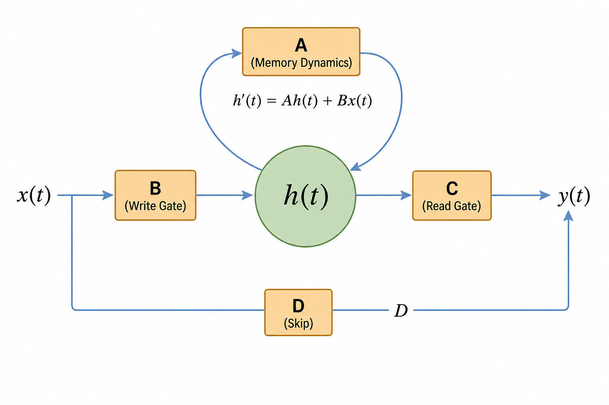
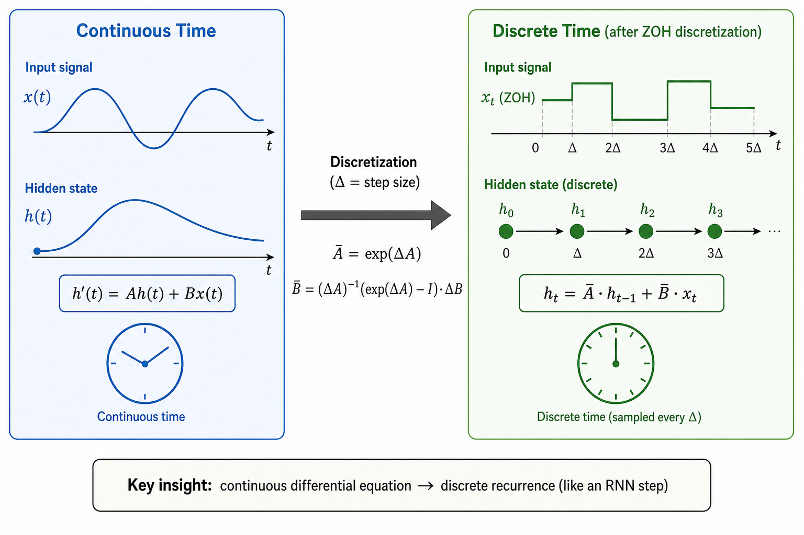
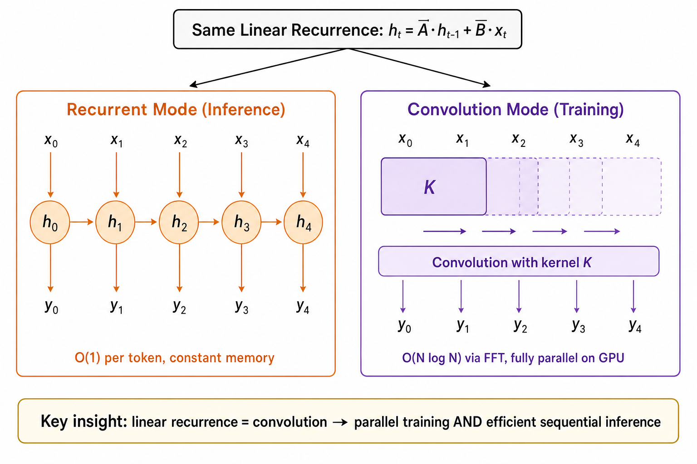
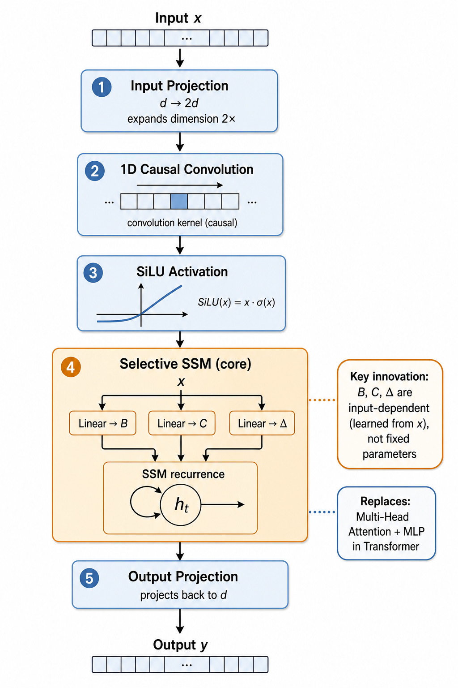

# Day 29: 无注意力架构 — Mamba、RWKV 与状态空间模型

> **核心问题**：如果注意力机制是 Transformer 的"秘密武器"，我们能不能在*不用注意力*的情况下构建强大的序列模型？为什么需要这样做？

---

## 开篇

Transformer 的自注意力机制很优雅：每个 token 都能在一步之内"看到"所有其他 token。但这份优雅有代价——二次复杂度。序列长度翻倍，注意力计算量就翻四倍。到了 100K token 的上下文长度，你花在计算注意力上的时间比真正用于推理和生成内容的计算（姑且称之为"思考"）还多。

如果我们能构建训练时间*线性*增长、推理时使用*常量*内存、同时质量不输 Transformer 的模型呢？这正是无注意力架构的承诺：Mamba 等状态空间模型（State Space Model, SSM）和 RWKV 等线性 RNN。

它们已经不是学术玩具了。2026 年 3 月，Together AI 发布了 [Mamba-3](https://www.together.ai/blog/mamba-3)，在解码速度上超越 Transformer，同时比 Mamba-2 更强。NVIDIA 的 [Nemotron-H](https://arxiv.org/abs/2504.03624)（2025 年 4 月）用 Mamba-2 模块替换了 92% 的注意力层，吞吐量达到 LLaMA-3.1 的 3 倍。IBM 的 [Granite 4.0](https://www.infoq.com/news/2025/11/ibm-granite-mamba2-enterprise/)（2025 年 11 月）使用混合 Mamba-2 骨干网络做企业级 AI。

现在的问题不再是"无注意力模型能不能用"——而是"什么时候该用它们来替代 Transformer"。

---

## 1. 注意力的问题在哪

### 直觉：晚宴类比

想象你在一场晚宴上。自注意力就像跟*每一位宾客*分别交谈来决定什么重要。10 位宾客，45 对对话。100 位宾客，4,950 对。对话数量按平方增长——到某个点你所有时间都花在说话上（两两沟通），没时间思考了（理解、消化、推理）。

无注意力架构就像有一个*记事本*：你维护一份关于"什么重要"的实时摘要。每位新宾客发言，你更新笔记，然后继续。每位宾客的精力消耗是恒定的。


*图 1：序列建模的三种思路。Transformer 连接每对 token（二次复杂度），SSM 维护压缩的隐藏状态，RWKV 使用线性递推。*

### 1.1 二次瓶颈

标准自注意力计算每对 token 之间的兼容性分数：

$$
\text{Attention}(Q, K, V) = \text{softmax}\!\left(\frac{QK^\top}{\sqrt{d_k}}\right) V
$$

对于长度为 $N$ 的序列，这需要 $O(N^2 d)$ 次运算和 $O(N^2)$ 的注意力矩阵内存。推理时，KV 缓存随序列长度线性增长，消耗 $O(N \cdot d \cdot L)$ 内存（$L$ 为层数）。

短序列没问题。到了 128K 上下文，这就成了主要开销。


*图 2：左 — Transformer 计算量随序列长度二次增长，SSM 和线性 RNN 线性增长。右 — Transformer KV 缓存线性增长，SSM 隐藏状态恒定。*

---

## 2. 状态空间模型：从控制论到序列建模

### 直觉：滚动摘要

把 SSM 想象成新闻主播的实时提词器。主播不需要为每个新段落从头重读整个文稿。相反，他们维护一个"持续理解"——一个压缩状态，随每条新信息更新。有些细节被强调，有些逐渐淡化。状态远小于完整历史，但携带了关键信号。

SSM 最初起源于控制理论（1960 年代），用于建模连续动态系统。核心思想：系统通过一个总结历史的隐藏状态演化，并基于该状态产生输出。

> **🔍 扩展阅读：SSM 的前世今生**  
>  
> 状态空间模型的故事要从 1960 年代的航空航天说起。当时 R. E. Kalman（卡尔曼滤波器的发明者）提出了一套用"状态变量"描述动态系统的数学框架——这就是 SSM 的雏形。最初的应用场景非常硬核：Apollo 登月飞船的导航系统就用卡尔曼滤波器实时估计飞船位置，输入是噪声传感器的读数，输出是飞船的状态估计。
>  
> 在控制理论里，SSM 描述的是物理系统：**h'(t) = Ah(t) + Bx(t)** 中的 **x(t)** 是外部输入（比如推力），**h(t)** 是系统的内部状态（比如位置和速度），**y(t)** 是观测输出。**A** 矩阵编码了系统的物理特性——一个弹簧的 A 和一个电路的 A 完全不同。
>  
> 半个世纪后的 2020 年代，Albert Gu（当时在斯坦福读 PhD）发现了一个绝妙的联系：**如果把"物理系统的状态"换成"序列的上下文表示"，整套数学工具可以直接搬到深度学习里**。传统 RNN 的困境——梯度消失、难以并行训练——恰好可以被 SSM 的线性结构和卷积等价性解决。
>  
> Gu 的关键创新是 HiPPO 初始化（让 **A** 天然具有记忆衰减特性）和结构化状态空间（S4，2021 年），让 SSM 第一次在长序列建模上匹敌 Transformer。2023 年底的 Mamba 又加入了"选择性"机制，让 SSM 在语言任务上真正起飞。从 Apollo 到 ChatGPT 的替代架构，这套数学走了 60 年。
>  
> 如果你对这段历史感兴趣，推荐阅读：
> - Kalman 的原始论文：[A New Approach to Linear Filtering and Prediction Problems](https://courses.engr.illinois.edu/ece420/sp2017/kalman.pdf)（1960）
> - Albert Gu 的博士论文：[Modeling Sequences with Structured State Spaces](https://searchworks.stanford.edu/view/14689893)（2022）
> - S4 论文：[Efficiently Modeling Long Sequences with Structured State Spaces](https://arxiv.org/abs/2111.00396)（2021）

### 2.1 连续 SSM

连续时间状态空间模型由两个线性方程定义：

$$
\begin{aligned}
h'(t) &= A \, h(t) + B \, x(t) \quad &\text{（状态演化）} \\
y(t) &= C \, h(t) + D \, x(t) \quad &\text{（输出）}
\end{aligned}
$$

其中：
- $h(t)$ 是隐藏状态（"滚动摘要"）
- $x(t)$ 是输入信号
- $y(t)$ 是输出
- $A$ 控制状态如何自主演化（记忆动力学）
- $B$ 控制输入如何影响状态（写入门）
- $C$ 控制状态如何产生输出（读取门）
- $D$ 是跳跃连接（通常省略）


*图 3：输入 x(t) 通过 B 写入隐藏状态 h(t)，h(t) 通过 A 自演化，通过 C 读出为 y(t)，D 是直接跳连。公式 h'(t) = Ah(t) + Bx(t) 描述了状态更新过程。*

#### 直觉：A、B、C 到底在做什么

把 $h(t)$ 想象成一本笔记本。$A$ 决定笔记如何老化——保持新鲜还是逐渐褪色？$B$ 是你的笔——新信息被写得多深？$C$ 是你的放大镜——生成输出时聚焦笔记的哪些部分？

### 2.1.1 HiPPO 初始化：为什么 $A$ 的起点很重要

$A$ 矩阵控制着隐藏状态的“记忆动力学”——信息保持多久、以多快速度衰减。如果 $A$ 从随机初始化开始，模型需要浪费大量训练时间才能学会“该记住什么、该忘掉什么”。

S4 使用了 HiPPO（High-order Polynomial Projection Operator）框架来初始化 $A$，让隐藏状态天然具有“近期信息清晰、远处信息逐渐模糊”的衰减特性——就像人脑对最近发生的事记得清楚，越久远的记忆越模糊。这个数学上的先验让模型从训练的第一步就拥有了合理的记忆结构，而不是从零开始摸索。

值得注意的是，HiPPO 只是初始化策略。训练过程中 $A$ 会继续被优化，模型可以学到比 HiPPO 初始假设更灵活的记忆模式。Mamba 进一步让 $B, C, \Delta$ 都成为输入的函数（第 3 节会详细展开），使记忆行为完全数据驱动。

### 2.2 离散化：从连续到离散

因为我们处理的是离散 token（不是连续信号），需要将系统离散化。使用零阶保持（Zero-Order Hold, ZOH），步长为 $\Delta$：


*图 5：左侧是连续时间的 SSM，信号和状态都是平滑曲线；右侧是离散化后，信号变为阶梯状（零阶保持），状态变为离散点之间的递推。核心变换：连续微分方程变成离散递推。*

$$
\begin{aligned}
\bar{A} &= \exp(\Delta A) \\
\bar{B} &= (\Delta A)^{-1}(\exp(\Delta A) - I) \cdot \Delta B
\end{aligned}
$$

离散化后的递推变为：

$$
\begin{aligned}
h_t &= \bar{A} \, h_{t-1} + \bar{B} \, x_t \\
y_t &= C \, h_t
\end{aligned}
$$

看起来就是一个 RNN！但关键区别：这是*线性*递推，不是 LSTM 或 GRU 的非线性递推。线性性带来了两种强大的计算模式。

### 2.3 双模式：递推与卷积

线性递推的美妙之处在于训练时可以当作卷积来计算：


*图 6：同一个线性递推可以用两种方式计算。推理时用递推模式：逐步更新状态，每个 token 只需 O(1) 时间和常量内存。训练时用卷积模式：所有输出可以并行计算，通过 FFT 实现 O(N log N)。注意：图中的输出 y 来自另一个公式 y_t = C·h_t（用矩阵 C 从隐藏状态读出），本图重点展示的是 h_t 的两种计算方式。*

**递推模式**（推理）：逐 token 处理，更新状态。每 token $O(1)$，常量内存。

**卷积模式**（训练）：使用从 $\bar{A}$ 和 $\bar{B}$ 推导的卷积核同时计算所有输出。通过 FFT 实现 $O(N \log N)$，在 GPU 上完全可并行。

这种双重性是关键洞察：同一个数学对象同时实现了并行训练和高效顺序推理。

---

## 3. Mamba：选择性状态空间

原始 SSM（S4，由 [Gu 等人, 2021](https://arxiv.org/abs/2111.00396) 提出）使用*固定*参数 $A$、$B$、$C$——对所有输入使用相同的矩阵。这很高效但不灵活：模型无法根据内容调整"遗忘"行为。

[Mamba](https://arxiv.org/abs/2312.00752)（Gu & Dao，2023 年 12 月）引入了关键创新：**选择性状态空间**，其中 $B$、$C$ 和 $\Delta$ 是*依赖于输入*的函数。


*图 4：标准 SSM 使用固定参数（对所有输入相同），而 Mamba 使 B、C、Δ 依赖于输入，允许模型根据内容选择性地记忆或遗忘。*

### 3.1 为什么选择性很重要

#### 直觉：聪明的记笔记者

标准 SSM 像一台录音机——对所有时刻一视同仁。Mamba 像一个*聪明的记笔记者*，随时判断："这个细节很关键，仔细记下来"（大的 $\Delta$，精确的 $B$）或"这是废话，别浪费墨水"（小的 $\Delta$，模糊的 $B$）。正是这种选择性门控让 Mamba 在语言任务上能匹配 Transformer 的质量——而早期 SSM 做不到。

当你在文本中看到"然而"这个词时，你知道后面跟着重要内容。Mamba 可以学会在此刻扩大"注意力孔径"——标准 SSM 做不到。

### 3.2 Mamba 模块

Mamba 模块用以下结构替代 Transformer 中的多头注意力 + MLP 组合：

<table><tr>
<td width="55%" valign="top">

1. 输入投影 → 维度扩展 2 倍
2. 因果卷积（1D）
3. SiLU 激活
4. **选择性 SSM**（核心创新）
5. 输出投影

选择性 SSM 通过线性投影从输入计算 B、C 和 Δ：

- **B** = Linear_B(x_t) — 写入门，从输入计算
- **C** = Linear_C(x_t) — 读出门，从输入计算
- **Δ** = softplus(Linear_Δ(x_t)) — 步长，从输入计算

然后用依赖于输入的 Δ 离散化并运行递推。硬件感知实现使用内核融合和重计算来避免物化完整状态，实际效率接近优化的注意力内核。

</td>
<td width="45%" valign="top">


*图 7：Mamba 模块流水线。选择性 SSM（橙色块）是核心：B、C、Δ 由输入动态生成。*

</td>
</tr></table>

### 3.3 Mamba-2 与 Mamba-3

[Mamba-2](https://arxiv.org/abs/2405.21060)（Dao & Gu，2024 年 5 月）揭示了 SSM 与注意力之间的结构联系：状态空间对偶（State Space Dual, SSD）框架表明，结构化 SSM 是*半可分矩阵变换*的特例，可以利用 FlashAttention 的技术实现更快的硬件计算。

[Mamba-3](https://www.together.ai/blog/mamba-3)（Together AI，2026 年 3 月）更进一步：在基准测试上强于 Mamba-2，解码速度超过 Transformer，首发即开源。该架构优化了选择性机制，提升了更大规模的训练稳定性。

---

## 4. RWKV：线性注意力 RNN

Mamba 从控制论角度出发，而 [RWKV](https://www.rwkv.com/)（发音"RwaKuv"）走了一条不同的路：从注意力出发，让它变成线性的。

### 直觉：档案柜类比

标准注意力像一个档案柜，保存*所有*文件，每次需要时在所有文件中搜索。RWKV 像一个"当前文件夹"，你持续归档和总结文件。不保留原件——只维护一个持续更新的加权平均。空间少得多，访问快得多。

### 4.1 WKV 机制

RWKV 用一个叫 WKV（加权键值）的线性递推替代 softmax 注意力：

$$
wkv_t = \frac{\sum_{i=1}^{t-1} e^{-(t-1-i) \cdot w + k_i} \cdot v_i}{\sum_{i=1}^{t-1} e^{-(t-1-i) \cdot w + k_i}}
$$

其中 **w** 是可学习的衰减因子，**k_i** 是键，**v_i** 是值。关键洞察：这可以作为递推计算（每步常量时间），而不是完整的两两注意力矩阵。

### 4.2 RWKV-7 "Goose"

[RWKV-7 "Goose"](https://openreview.net/forum?id=ayB1PACN5j)（Peng 等人，2025 年 3 月）是最新版本，引入了"表达性动态状态演化"。核心亮点：

- 常量内存使用，每 token 推理时间恒定
- 不需要 KV 缓存（与 Transformer 不同）
- 2.9B 参数模型在多语言任务上达到 3B 级别新 SOTA，尽管训练 token 数远少于竞争对手
- 训练时完全可并行（像 Transformer），推理时完全递推（像 RNN）

---

## 5. 对比：什么时候用什么？

| 特性 | Transformer | SSM (Mamba) | RWKV |
|------|------------|-------------|------|
| 训练复杂度 | O(N²) | O(N log N) | O(N) |
| 推理每 token 开销 | O(N) KV 缓存 | O(1) 状态更新 | O(1) 状态更新 |
| 推理内存 | 随上下文增长 | 恒定 | 恒定 |
| 回忆精度 | 精确（全注意力） | 近似（压缩状态） | 近似（压缩状态） |
| 强项 | 推理、检索密集型任务 | 长上下文生成 | 平衡效率 |
| 成熟度 | 行业标准 | 生产可用（混合架构） | 生态成长中 |

### 5.1 混合方案

2025-2026 年最实际的趋势是*混合*架构——用少量注意力层搭配大量 SSM 层：

| 模型 | 发布 | 架构 | 关键结果 |
|------|------|------|----------|
| [Jamba](https://www.ai21.com/blog/announcing-jamba/) | AI21, 2024.03 | Mamba + Attention + MoE | 首个生产级混合模型 |
| [Nemotron-H](https://arxiv.org/abs/2504.03624) | NVIDIA, 2025.04 | 92% Mamba-2 + 8% Attention | 吞吐量为 LLaMA-3.1 的 3 倍 |
| [Nemotron Nano 2](https://arxiv.org/abs/2508.14444) | NVIDIA, 2025.08 | 混合 Mamba-Transformer | 9B 级别 SOTA 精度 |
| [Granite 4.0](https://www.infoq.com/news/2025/11/ibm-granite-mamba2-enterprise/) | IBM, 2025.11 | 混合 Mamba-2 | 企业级效率优先 |
| [Mamba-3](https://www.together.ai/blog/mamba-3) | Together AI, 2026.03 | 纯 SSM | 解码速度超过 Transformer |

#### 直觉：两全其美

混合模型就像同时拥有一个档案柜（注意力——精确回忆具体事实）和一个智能助手的记忆（SSM——高效维护上下文）。大多数时候助手处理事务，需要逐字回忆具体细节时查阅档案柜。SSM 与注意力层的比例通常为 8:1 或更高。

---

## 6. 常见误解

### ❌ "无注意力模型就是更差的 Transformer"

不再是这样了。在很多基准上，混合模型达到或超过同大小的纯 Transformer。NVIDIA 的 Nemotron-H 在 MMLU、GSM8K、HumanEval 和 MATH 上匹配 LLaMA-3.1 和 Qwen-2.5，同时快 3 倍。纯 SSM 在精确回忆任务上仍有差距，但差距在快速缩小。

### ❌ "SSM 就是换个名字的 RNN"

虽然 SSM 与 RNN 共享递推结构，但关键区别在于：(1) 线性性使得通过卷积实现并行训练，(2) 控制系统的理论提供了有原则的初始化和分析方法，(3) Mamba 的选择性机制添加了经典 RNN 所没有的结构化输入依赖门控。

### ❌ "长序列应该总是用 SSM"

取决于任务。需要精确 token 级别回忆的任务（比如"第 47 个词是什么"），注意力的精确查找仍然更优。SSM 擅长维护长上下文的*压缩理解*，而非逐字检索。混合模型两者兼得。

---

## 7. 前沿：2025-2026 年最新进展

- **Mamba-3**（Together AI，2026 年 3 月）：纯 SSM 架构，超越 Mamba-2，解码速度快于 Transformer，首发即开源。([博客](https://www.together.ai/blog/mamba-3))
- **NVIDIA Nemotron-H**（2025 年 4 月）：混合 Mamba-2/注意力模型族，匹配 Transformer 精度，吞吐量提升 3 倍。([arXiv](https://arxiv.org/abs/2504.03624))
- **NVIDIA Nemotron Nano 2**（2025 年 8 月）：9B 混合 Mamba-Transformer 推理模型，在同等规模达到 SOTA。([arXiv](https://arxiv.org/abs/2508.14444))
- **RWKV-7 "Goose"**（2025 年 3 月）：新的线性 RNN，常量内存和推理时间，达到 3B 多语言 SOTA。([OpenReview](https://openreview.net/forum?id=ayB1PACN5j))
- **IBM Granite 4.0**（2025 年 11 月）：企业级混合 Mamba-2 模型，面向成本高效的部署。([InfoQ](https://www.infoq.com/news/2025/11/ibm-granite-mamba2-enterprise/))
- **SSM-Transformer 混合分析**（2025 年 10 月）：系统性研究混合架构的设计轴——SSM 层类型、层比例、混合模式。([arXiv](https://arxiv.org/abs/2510.26912))


*图 5：从纯 SSM（2021-2023）到早期混合（2024）再到生产级系统（2025-2026）的快速演进。*

---

## 8. 代码示例：最小 SSM 前向传播

```python
import torch
import torch.nn as nn
import torch.nn.functional as F

class SimpleSSMBlock(nn.Module):
    """用于教学目的的简化 SSM 模块。
    
    实现了类似 Mamba 的基本选择性状态空间模型，
    为清晰起见做了简化。真正的 Mamba 使用融合 CUDA 内核。
    """
    def __init__(self, d_model, d_state=16, d_conv=4, expand=2):
        super().__init__()
        self.d_model = d_model
        self.d_state = d_state
        self.d_inner = d_model * expand
        
        # 输入投影
        self.in_proj = nn.Linear(d_model, self.d_inner * 2, bias=False)
        
        # 因果卷积
        self.conv1d = nn.Conv1d(
            self.d_inner, self.d_inner,
            kernel_size=d_conv, padding=d_conv - 1,
            groups=self.d_inner
        )
        
        # SSM 参数：A 是对角矩阵，存储为向量
        self.A_log = nn.Parameter(
            torch.log(torch.arange(1, d_state + 1).float().repeat(self.d_inner, 1))
        )
        
        # 从输入投影 B、C 和 dt（离散化步长）
        self.x_proj = nn.Linear(self.d_inner, d_state * 2 + 1, bias=False)
        self.dt_proj = nn.Linear(1, self.d_inner, bias=True)
        
        # 输出投影
        self.out_proj = nn.Linear(self.d_inner, d_model, bias=False)
    
    def forward(self, x):
        """x: (batch, seq_len, d_model)"""
        batch, seq_len, _ = x.shape
        
        # 投影并分为两支
        xz = self.in_proj(x)
        x_branch, z = xz.chunk(2, dim=-1)
        
        # 因果卷积
        x_conv = self.conv1d(x_branch.transpose(1, 2))[:, :, :seq_len]
        x_conv = x_conv.transpose(1, 2)
        x_conv = F.silu(x_conv)
        
        # 从输入计算 SSM 参数（选择性机制）
        ssm_params = self.x_proj(x_conv)
        B = ssm_params[..., :self.d_state]
        C = ssm_params[..., self.d_state:2*self.d_state]
        dt = F.softplus(self.dt_proj(
            ssm_params[..., -1:].unsqueeze(-1)
        )).squeeze(-1)
        
        # 离散化 A
        A = -torch.exp(self.A_log)
        
        # 运行递推（顺序扫描）
        A_disc = torch.exp(A * dt.unsqueeze(-1))
        B_disc = B.unsqueeze(2) * dt.unsqueeze(-1).unsqueeze(-1)
        
        h = torch.zeros(batch, self.d_inner, self.d_state, device=x.device)
        outputs = []
        for t in range(seq_len):
            h = A_disc[:, t] * h + B_disc[:, t] * x_conv[:, t].unsqueeze(-1).unsqueeze(-1)
            y = (h * C[:, t].unsqueeze(1).unsqueeze(-1)).sum(-1)
            outputs.append(y)
        
        y = torch.stack(outputs, dim=1)
        
        # 门控和输出
        y = y * F.silu(z)
        return self.out_proj(y)

# 快速测试
model = SimpleSSMBlock(d_model=64)
x = torch.randn(2, 128, 64)
out = model(x)
print(f"输入形状: {x.shape}, 输出形状: {out.shape}")
```

---

## 9. 延伸阅读

### 入门
1. [Mamba: Linear-Time Sequence Modeling with Selective State Spaces](https://arxiv.org/abs/2312.00752) — 原始 Mamba 论文，出乎意料地好读
2. [The Annotated S4](https://srush.github.io/annotated-s4/) — 优秀的结构化状态空间交互式教程

### 进阶
1. [Transformers are SSMs: Generalized Models and Efficient Algorithms](https://arxiv.org/abs/2405.21060) — Mamba-2 论文，揭示 SSM 与注意力的联系
2. [RWKV-7 "Goose" with Expressive Dynamic State Evolution](https://openreview.net/forum?id=ayB1PACN5j) — 最新 RWKV 架构

### 论文
1. ["Efficiently Modeling Long Sequences with Structured State Spaces" (S4)](https://arxiv.org/abs/2111.00396) — Gu 等人, 2021。奠基性 SSM 论文。
2. ["Nemotron-H: A Family of Accurate and Efficient Hybrid Mamba-Transformer Models"](https://arxiv.org/abs/2504.03624) — NVIDIA, 2025。生产级混合架构。
3. ["Understanding and Enhancing Mamba-Transformer Hybrids"](https://arxiv.org/abs/2510.26912) — 系统性研究混合设计轴, 2025。

---

## 思考题

1. 为什么线性递推可以当作卷积计算，而非线性递推（如 LSTM）不行？线性性的什么性质使这成为可能？
2. 如果 SSM 这么高效，为什么混合模型仍然保留注意力层？注意力提供了什么压缩状态无法提供的具体能力？
3. 考虑一个 100K token 上下文的代码生成应用。你会如何在纯 Transformer、纯 SSM 和混合模型之间选择？哪些因素最重要？

---

## 总结

| 概念 | 一句话解释 |
|------|-----------|
| 状态空间模型（SSM） | 通过线性递推维护压缩隐藏状态的序列模型 |
| 离散化 | 将连续时间 SSM 方程转换为逐 token 的离散更新 |
| Mamba 的选择性 | 让 SSM 参数依赖于输入，使模型能自适应地记忆或遗忘 |
| RWKV | 用递推式加权键值机制替代 softmax 注意力的线性 RNN |
| 混合架构 | 以 SSM/RWKV 层为主、搭配少量注意力层，兼顾效率和精度 |
| SSD 框架 | Mamba-2 的洞察：结构化 SSM 是半可分矩阵变换的特例 |

**核心要点**：无注意力架构不是在替代 Transformer——而是在补充它。纯 SSM 和线性 RNN 提供线性时间训练和常量内存推理，非常适合长上下文生成。混合模型（以 SSM 为主 + 少量注意力层）实现了两全其美：以远低于 Transformer 的成本达到同等质量。"非 Transformer 不可"的时代已经结束了。

---

*Day 29 of 60 | LLM Fundamentals*
*字数：约 2400 | 阅读时间：约 12 分钟*
