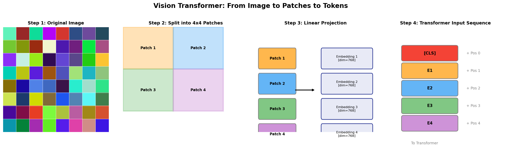
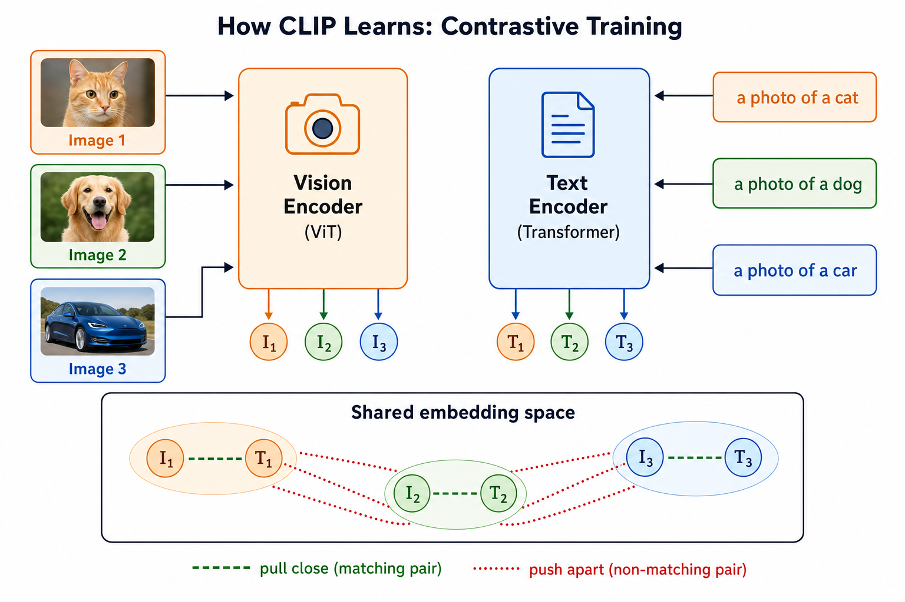
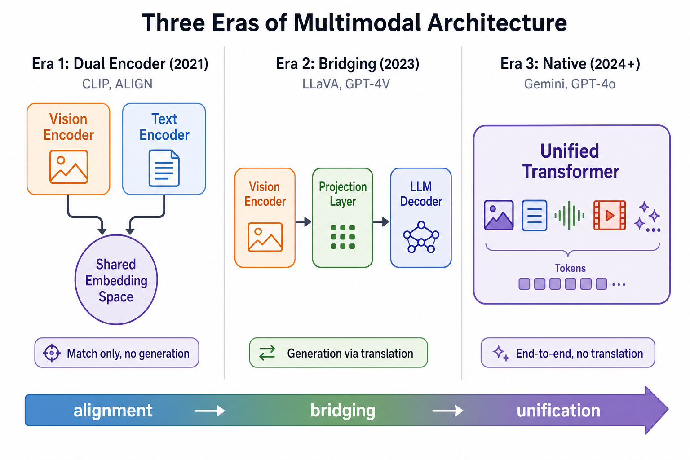
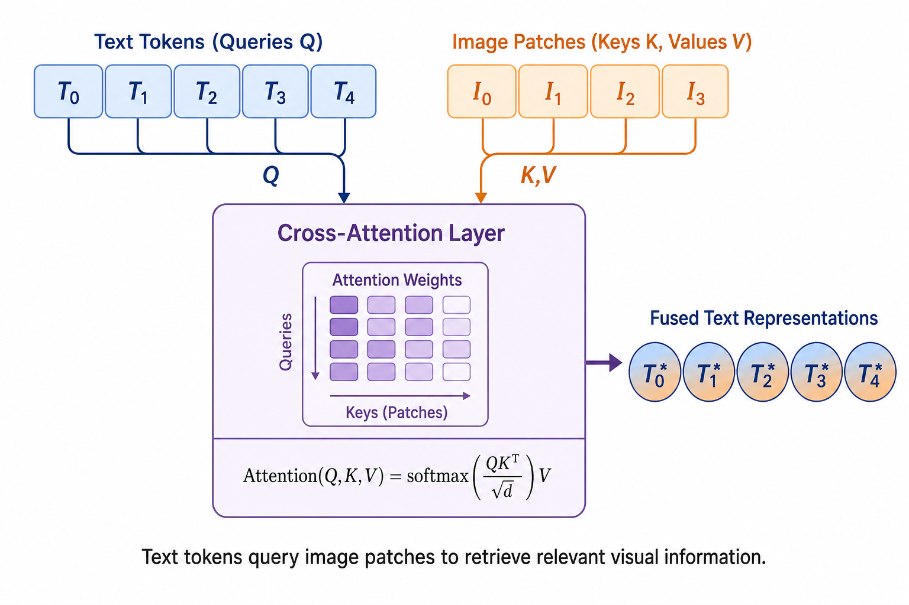

# Day 30: 多模态基础 — CLIP、Vision Transformer、GPT-4V

> **核心问题**：怎么教会语言模型"看见"世界？

---

## 开篇

你已经花了 29 天学语言模型的工作原理：读文本、预测下一个 token、某种程度上还能推理。但问题是：世界不是由文本组成的。世界由图像、声音、视频和物理感受构成。

如果你给 GPT-3 看一张猫的照片，它完全不知道你在说什么。它能写一首关于猫的十四行诗——但它没法*看见*猫。

2021 到 2024 年间，这一切改变了。CLIP、Vision Transformer（ViT）和 GPT-4V 背后的桥接架构，教会了语言模型"看见"。今天的前沿模型——Gemini 2.5 Pro、GPT-4.1——不仅能处理文本，还能通过同一个 Transformer 原生理解图像、视频和音频。

#### 直觉：翻译官问题

想象你有一个只说中文的朋友和一个只说法语的朋友。两人都是专家，但没法交流。你需要什么？一个**翻译**——能把一种语言的想法转换成另一种的人。

多模态 AI 面对同样的问题。视觉编码器"说"空间网格和像素模式；语言模型"说" token 嵌入。多模态 AI 的整个发展史，就是在这两种"语言"之间建造更好翻译的故事。

---

## 1. Vision Transformer（ViT）— 把图片当成句子

### 1.1 为什么不用 CNN？

卷积神经网络（CNN）主导计算机视觉长达十年。它在图像上滑动滤波器，从边缘到物体逐层提取特征。但 CNN 有一个结构性限制：它假设**局部性**——每个滤波器一次只看一小块。

Transformer 的超能力是**全局注意力**——每个 token 可以关注到所有其他 token。问题是：能把图像当成句子来处理吗？

### 1.2 ViT 的核心洞察：Patch Embedding

Vision Transformer（Google Brain 的 Dosovitskiy 等人于 2020 年提出，论文：["An Image is Worth 16x16 Words"](https://arxiv.org/abs/2010.11929)）用一个简单的想法回答了这个问题：

1. 把图像切成固定大小的 patch（比如 16×16 像素）
2. 把每个 patch 展平成一个向量
3. 对每个向量做线性投影得到嵌入——就像 word token 一样
4. 加一个特殊的 `[CLS]` token 和位置编码
5. 把整个序列送进标准 Transformer 编码器


*图 1：ViT 流水线——图像被切成 patch，每个投影为嵌入，然后被 Transformer 当成句子中的词来处理。*

#### 直觉：拼图游戏

把图像想象成一幅拼图。ViT 把拼图切成碎片（patch），给每块编号（位置编码），然后让 Transformer 自己搞清楚这些碎片之间的关系。自注意力机制就像一个人同时研究所有拼图块的关联——不是一块一块地比对，而是一下子全部看。

### 1.3 ViT vs CNN：规模决定胜负

| 方面 | CNN | ViT |
|------|-----|-----|
| 归纳偏置 | 强（局部性、平移等变性） | 弱（从数据中学习） |
| 数据效率 | 小数据集也能用 | 需要大数据（1400 万–3 亿张图） |
| 全局推理 | 只在深层，通过逐渐扩大的感受野 | 从第 1 层就有，通过自注意力 |
| 计算扩展 | 收益递减 | 随数据和计算强扩展 |

ViT 并没有立刻取代 CNN。在小数据集（如 ImageNet 的 130 万张图）上，ViT 表现不如 ResNet。但在超大数据集（JFT-300M，3 亿张图）上训练时，ViT 反超了——而且扩展上限比 CNN 高得多。

这和 Day 9 的 Scaling Law 故事一样：数据量够大时，归纳偏置弱但灵活性强的架构往往能赢。

### 1.4 延展：\[CLS\] Token 深度解析

在 ViT（以及 BERT）中，序列最前面插入了一个特殊的 `[CLS]` token：

```
[CLS]  patch_1  patch_2  patch_3  ...  patch_N
```

它**不对应图像中的任何一块区域**，而是一个从零开始的可学习嵌入。经过 Transformer 多层自注意力之后，`[CLS]` token 通过与所有 patch 的交互，**聚合了整张图的全局信息**，最终用于分类等全局任务。

直觉上，可以把它想象成一场会议：所有 patch token 是各部门的汇报人，`[CLS]` 是 CEO。CEO 不代表任何部门，但他在会上听取了所有部门的信息，最后由他给出一个综合判断。

#### 为什么 `[CLS]` 比 GAP 更好？

如果只需要整张图的特征，为什么不直接对所有 patch token 求平均（GAP，Global Average Pooling）？

- **GAP 是固定的操作**——所有 patch 一视同仁，模型没法学习"该怎么聚合"。如果图里有大量背景噪声 patch，它们也会被平等地混进最终表示里。
- **`[CLS]` 是通过注意力学习怎么聚合的**——它可以学会忽略无关 patch、关注重要 patch，本质上是一种可学习的加权聚合。

#### 不用 `[CLS]` 会怎样？

完全可行！替代方案包括：

- **GAP（Global Average Pooling）**：直接求平均，简单但无法区分 patch 重要性。Swin Transformer（微软，2021）就用了 GAP。
- **注意力池化（Attention Pooling）**：用一个可学习的查询向量做注意力，让模型自己决定每个 patch 该给多少权重。这其实就是 `[CLS]` 的变体。

实际上，很多现代模型已经不用 `[CLS]` 了。ViT 原论文沿用 BERT 的设计更多是**历史惯性**——作者想证明"把图像当句子、用 NLP 的架构就能做视觉"，保持和 BERT 尽可能一致让论证更有说服力。严格来说 `[CLS]` 不是最优解，但也不是个差的选择。

---

## 2. CLIP — 通过阅读学会看见

### 2.1 核心思想

CLIP（Contrastive Language-Image Pre-training），OpenAI 于 2021 年提出（论文：["Learning Transferable Visual Models From Natural Language Supervision"](https://arxiv.org/abs/2103.00020)），问了一个激进的问题：如果我们不用"猫""狗"这样的标签来训练视觉模型，而是让它理解自然语言描述呢？

训练方法很优雅：

1. 从互联网收集 4 亿个（图像，文本）配对
2. 用 ViT（或 ResNet）编码每张图
3. 用文本 Transformer 编码每条描述
4. **对比目标**：把匹配的配对拉近，不匹配的推远


*图 2：CLIP 的对比训练——匹配的图文配对在嵌入空间中被拉近，不匹配的配对被推远。*

#### 直觉：派对游戏

想象一个派对，每个人都戴了名字标签。你从没见过这些人，但得把每个名字标签匹配到正确的人。你的策略：看看每个人，读读每个名字，想想哪对说得通。"拿篮球的高个子"匹配"Michael"。"拿画笔的矮个子"匹配"Picasso"。

CLIP 在海量规模上做完全相同的事。在 4 亿个配对上训练后，它学会了猫的图像嵌入应该接近文本"a photo of a cat"，远离"a photo of a car"。

### 2.2 零样本分类

CLIP 的杀手级功能是**零样本分类（Zero-shot Classification）**。不需要为特定类别训练分类器，只需要：

```
image = encode_image(photo)
text_cat = encode_text("a photo of a cat")
text_dog = encode_text("a photo of a dog")

# 哪个文本和图像最接近？
similarity = cosine_similarity(image, [text_cat, text_dog])
prediction = argmax(similarity)
```

不需要微调。在 ImageNet 上，CLIP 不用任何 ImageNet 标签训练，就达到了 ResNet-50 的准确率。

### 2.3 CLIP 的遗产

CLIP 成了几乎所有多模态应用的默认视觉编码器：
- **Stable Diffusion** 用 CLIP 的文本编码器引导图像生成
- **LLaVA** 用 CLIP 的视觉编码器把图像送入 LLM
- **DALL-E 2/3** 用 CLIP 对齐文本和图像表示
- **SigLIP**（Google, 2023, ["Sigmoid Loss for Language Image Pre-Training"](https://arxiv.org/abs/2303.15343)）用更简单的 sigmoid loss 替代 softmax 对比损失，去掉了全局归一化的需求——训练更高效、更可扩展

**SigLIP 2**（Google, 2025 年 2 月, ["Multilingual Vision-Language Encoders with Improved Semantic Understanding"](https://arxiv.org/abs/2502.14786)）进一步加入自监督学习目标和在线数据筛选，在定位、密集预测和多语言检索上大幅提升。

> **💡 扩展：CLIP 没有解码器，那谁来解码？**
>
> CLIP 本身是一个**纯编码器系统**——它的工作到生成 embedding 就结束了，不生成图像也不生成文字。它只做一件事：把图像和文字映射到同一个向量空间，然后比较相似度。
>
> 解码工作交给下游模型：
> - **Stable Diffusion** 用 CLIP 文本编码器引导 U-Net + VAE 解码器生成图像
> - **LLaVA** 用 CLIP 视觉编码器把图像喂给 LLaMA（语言模型本身就是解码器）
>
> 那编码器和解码器不是一起训练的，embedding 能复用吗？**能，但需要翻译。** LLaVA 就是在冻住的 CLIP 和冻住的 LLaMA 之间加了一个可训练的投影层，学习把 CLIP 的向量“翻译”成 LLaMA 能理解的格式。这也正是原生多模态模型（如 Gemini）更强的原因——它从头联合训练，不需要这种“打补丁”式的翻译。

---

## 3. 桥接架构 — LLaVA 和 GPT-4V

### 3.1 问题：视觉和语言说着不同的"语言"

到 2023 年，我们有了很强的视觉编码器（CLIP/ViT）和很强的语言模型（LLaMA、GPT）。但它们活在两个世界里。视觉编码器输出空间特征向量；LLM 期望的是 token 嵌入。

怎么把两者连起来？

### 3.2 LLaVA：最简单的桥

LLaVA（Large Language-and-Vision Assistant），Liu 等人于 2023 年提出（论文：["Visual Instruction Tuning"](https://arxiv.org/abs/2304.08485)），建了最简单可能的桥：

1. 拿一个冻结的 CLIP ViT 视觉编码器
2. 拿一个冻结的 LLaMA 语言模型
3. 在两者之间加一个**可训练的投影层**
4. 只在视觉指令数据上训练投影层

投影层充当翻译：它把 CLIP 的视觉特征转换成 LLM 的 token 嵌入空间。投影之后，LLM 把图像特征当作普通文本 token 来处理。

#### 直觉：交换生

就像一个交换生（视觉编码器）有丰富的知识但说着不同的语言，学校（LLM）有强大的推理能力但听不懂交换生的话。投影层就是语言课——教交换生用学校的语言表达自己的知识。

### 3.3 GPT-4V：商业化的桥

GPT-4V（GPT-4 with Vision），OpenAI 于 2023 年底发布，内部很可能使用了类似的桥接架构，但规模更大。与 LLaVA 的关键区别：

- 更大的视觉编码器和 LLM
- 训练数据量级可能大得多
- 针对空间推理、OCR 和文档理解的额外训练
- 图像输入的安全防护

OpenAI 没有公开 GPT-4V 的架构细节，但研究界普遍认为它遵循"视觉编码器 → 投影 → LLM"的范式，可能用多层交叉注意力代替简单的线性投影。

---

## 4. 多模态架构的三个时代

这个领域经历了三个不同的架构范式：


*图 3：从双编码器（CLIP），到桥接架构（LLaVA、GPT-4V），再到原生多模态 Transformer（Gemini、GPT-4o）的演进。*

### 时代 1：双编码器（2021）

视觉和文本分别有独立的编码器，只通过共享嵌入空间连接。适合检索和零样本分类，但不能生成关于图像的文字。

- **CLIP**（OpenAI, 2021）
- **ALIGN**（Google, 2021, ["Scaling Up Visual and Vision-Language Representation Learning With Noisy Text Supervision"](https://arxiv.org/abs/2102.05918)）

### 时代 2：桥接（2023）

冻结的视觉编码器 + 投影层 + LLM。简单有效，催生了第一波实用的多模态助手。

- **LLaVA**（2023）—— 开源，证明了这条路可行
- **GPT-4V**（2023）—— 商业，证明了这条路能扩展
- **Qwen-VL**（阿里巴巴, 2023, ["Qwen-VL: A Versatile Vision-Language Model"](https://arxiv.org/abs/2308.12966)）—— 强力的开源替代

### 时代 3：原生多模态（2024–2026）

从零开始在交错多模态数据上训练的单一 Transformer。没有独立的编码器，没有投影层——模型通过相同的注意力层处理文本、图像、音频和视频 token。

- **Gemini 1.0/2.5**（Google DeepMind, 2023–2025）—— 从一开始就原生多模态
- **GPT-4o**（OpenAI, 2024）—— "omni"模型，处理文本、图像、音频
- **LLaMA 4**（Meta, 2025, [Meta AI Blog](https://ai.meta.com/blog/llama-4-multimodal-ai/)）—— 在统一 Transformer 框架中集成多模态输入

#### 为什么原生多模态会赢

桥接方案有一个根本局限：视觉编码器是独立训练的，它的表示可能对 LLM 的推理来说不是最优的。原生多模态模型把所有东西联合训练，让视觉和语言表示共同进化。这带来了：
- 更好的视觉推理（模型学会了"视觉思考"）
- 更高效的推理（没有独立编码器 + 投影的开销）
- 模态间的无缝交替（比如："图 1 和图 2 之间有什么变化？"）

---

## 5. 交叉注意力如何融合模态

让多模态融合在技术上可行的机制是**交叉注意力（Cross-Attention）**。

### 5.1 机制

标准自注意力中，查询（Q）、键（K）和值（V）都来自同一个输入。在交叉注意力中：

- **Q** 来自一个模态（比如文本 token）
- **K、V** 来自另一个模态（比如图像 token）

这让文本 token 可以"查找"相关的视觉信息，就像侦探向照片实验室索取与某个问题相关的证据。


*图 4：交叉注意力融合——文本 token 查询图像 token，将视觉信息整合到语言模型的推理中。*

### 5.2 在哪里发生

不同架构在不同深度放置交叉注意力：

| 架构 | 融合策略 | 交叉注意力位置 |
|------|---------|--------------|
| LLaVA | 仅线性投影 | 无（投影一次，然后自注意力） |
| Flamingo（DeepMind, 2022, ["Flamingo: a Visual Language Model for Few-Shot Learning"](https://arxiv.org/abs/2204.14198)） | 交叉注意力插入 | LLM 中每隔 N 层 |
| Gemini | 原生联合注意力 | 每一层（单一模型） |

趋势很清楚：早期架构把交叉注意力当作事后补充；现代架构把它写进每一层。

> **💡 延展：Self-Attention vs Cross-Attention**
>
> 核心区别在于 Q、K、V 的来源：
>
> - **Self-Attention**：Q、K、V 全部来自同一个序列。序列内部 token 互相理解关系。
> - **Cross-Attention**：Q 来自序列 A，K/V 来自序列 B。一个序列去"查询"另一个序列的信息。
>
> | | Self-Attention | Cross-Attention |
> |---|---|---|
> | Q 来源 | 自己 | 序列 A |
> | K,V 来源 | 自己 | 序列 B |
> | 做什么 | 序列内部互相理解 | 跨序列查找信息 |
> | 类比 | 团队内部开会讨论 | 带着问题去另一个部门查资料 |
>
> Cross-attention 最早出现在 Transformer 原始论文（2017）中，用于**机器翻译**的编码器-解码器架构：Q 来自解码器（已生成的目标语言词），K/V 来自编码器（源语言表示）。它不是多模态的专属发明——本质是"一个序列查询另一个序列"，装的是文本、图像还是音频都无所谓。
>
> 后来 GPT 等 decoder-only 模型砍掉了独立编码器，所有信息在同一条序列里用 self-attention 处理，cross-attention 似乎"消失"了。但实际上它只是换了场景——从"翻译中的英→法"变成了"多模态中的文→图"。机制完全一样。

### 5.3 CLIP 对比损失的数学原理

CLIP 的对比目标是 InfoNCE 损失。对于一个批次中的 N 个图文配对：

$$
\begin{aligned}
L &= -\frac{1}{N} \sum_{i=1}^{N} \log \frac{\exp(\text{sim}(I_i, T_i) / \tau)}{\sum_{j=1}^{N} \exp(\text{sim}(I_i, T_j) / \tau)}
\end{aligned}
$$

其中 sim(I, T) 是图像和文本嵌入之间的余弦相似度，τ 是可学习的温度参数。本质上是一个 softmax 分类器——每张图必须从 N 个候选文本中找到匹配的那一个（反之亦然）。

---

## 6. 代码示例：用 CLIP 做零样本分类

```python
import torch
from transformers import CLIPModel, CLIPProcessor

# 加载 CLIP 模型和处理器
model = CLIPModel.from_pretrained("openai/clip-vit-base-patch32")
processor = CLIPProcessor.from_pretrained("openai/clip-vit-base-patch32")

# 准备一张图片和候选标签
from PIL import Image
image = Image.open("photo.jpg")

# 零样本分类：描述图像可能包含什么
candidate_texts = [
    "a photo of a cat",
    "a photo of a dog",
    "a photo of a car",
    "a photo of a building"
]

# 编码图像和文本
inputs = processor(text=candidate_texts, images=image, 
                   return_tensors="pt", padding=True)

# 前向传播
with torch.no_grad():
    outputs = model(**inputs)
    
# 计算相似度（图像和文本嵌入之间的余弦相似度）
logits = outputs.logits_per_image  # shape: [1, num_texts]
probs = logits.softmax(dim=1)

# 打印结果
for text, prob in zip(candidate_texts, probs[0]):
    print(f"{text}: {prob.item():.3f}")
# 输出：
# a photo of a cat: 0.872
# a photo of a dog: 0.089
# a photo of a car: 0.023
# a photo of a building: 0.016
```

不需要针对这些特定类别做任何训练。CLIP 从 4 亿个互联网图文配对中学到了这些视觉概念。

---

## 7. 常见误解

### ❌ "多模态模型就是把视觉模型和语言模型粘在一起"

早期桥接架构确实大约是这样做的，但即使是它们也需要精心设计投影层和训练数据。现代原生多模态模型如 Gemini 是从零开始作为单一模型训练的——根本没有"粘"的过程。模型在多种模态之间学习联合表示。

### ❌ "CLIP 像人类一样理解图像"

CLIP 学到的是图像和文本之间的统计对应关系。它可以高准确率地把"a photo of a cat"匹配到猫的图片，但它没有人类那样的物体关系、物理或空间推理能力。一个模型可能正确标注图像为"cat on table"，但完全没有重力或支撑面的概念。

### ❌ "ViT 完全取代了 CNN"

ViT 在大规模下确实优于 CNN，但在数据稀缺和计算受限的场景下，CNN 仍然有竞争力。很多生产系统仍在使用基于 CNN 的骨干网络（特别是 MobileNet 变体）用于边缘部署。结合卷积和注意力层的混合架构也很常见。

---

## 8. 前沿：最新动态（2025–2026）

多模态领域发展很快：

1. **SigLIP 2**（Google, 2025 年 2 月）—— 升级版视觉-语言编码器，加入自监督学习目标，在定位、密集预测和多语言检索上大幅提升。成为 2025 年时代 VLM 的默认视觉编码器。([arXiv](https://arxiv.org/abs/2502.14786))

2. **LLaVA-OneVision-1.5**（2025 年 12 月）—— LLaVA 家族最新版本，加入基于强化学习的后训练。8B 模型在 27 个基准中的 18 个上超过 Qwen2.5-VL-7B，表明 RL 对齐技术可以迁移到视觉领域。([arXiv](https://arxiv.org/abs/2509.23661), [GitHub](https://github.com/EvolvingLMMs-Lab/LLaVA-OneVision-1.5))

3. **Gemini 2.5 Pro**（Google, 2025 年 3 月至今）—— 原生多模态，100 万 token 上下文窗口，通过单一模型处理文本、图像、音频和视频。2026 年持续占据多模态基准榜首。([Google AI Blog](https://blog.google/technology/google-deepmind/gemini-model-thinking-updates-march-2025/))

4. **基于 Next-Token Prediction 的多模态学习**（Nature, 2026 年 1 月）—— 研究表明，驱动 LLM 的 next-token prediction 目标可以扩展到在单一模型中学习文本、图像和视频的统一表示。验证了"一个模型、多种模态"范式。([Nature](https://www.nature.com/articles/s41586-025-10041-x))

5. **LLaMA 4**（Meta, 2025）—— 在统一 Transformer 框架中无缝集成多模态输入，联合关注文本和视觉 token。标志着 Meta 进入原生多模态时代。([Meta AI Blog](https://ai.meta.com/blog/llama-4-multimodal-ai/))

6. **高效边缘 VLM**（Nature Communications, 2025 年 7 月）—— 轻量级多模态 LLM 在边缘设备上达到 GPT-4V 级别性能，让多模态 AI 走出云端。([Nature Communications](https://www.nature.com/articles/s41467-025-61040-5))

---

## 9. 延伸阅读

### 基础论文

1. ["An Image is Worth 16x16 Words: Transformers for Image Recognition at Scale"](https://arxiv.org/abs/2010.11929) — ViT 原始论文（Dosovitskiy 等人, 2020）
2. ["Learning Transferable Visual Models From Natural Language Supervision"](https://arxiv.org/abs/2103.00020) — CLIP 论文（Radford 等人, 2021）
3. ["Visual Instruction Tuning"](https://arxiv.org/abs/2304.08485) — LLaVA（Liu 等人, 2023）

### 关键架构论文

4. ["Flamingo: a Visual Language Model for Few-Shot Learning"](https://arxiv.org/abs/2204.14198) — 基于交叉注意力的融合（Alayrac 等人, 2022）
5. ["Sigmoid Loss for Language Image Pre-Training"](https://arxiv.org/abs/2303.15343) — SigLIP（Zhai 等人, 2023）
6. ["Qwen-VL: A Versatile Vision-Language Model"](https://arxiv.org/abs/2308.12966) — 强力开源 VLM（Bai 等人, 2023）

### 最新进展

7. ["SigLIP 2: Multilingual Vision-Language Encoders"](https://arxiv.org/abs/2502.14786) — 下一代视觉编码器（Google, 2025 年 2 月）
8. ["Multimodal learning with next-token prediction"](https://www.nature.com/articles/s41586-025-10041-x) — 统一多模态目标（Nature, 2026 年 1 月）

---

## 思考题

1. 为什么 ViT 比 CNN 需要更多数据才能达到同样的准确率？这对理解归纳偏置在神经架构中的作用有什么启示？

2. 如果 CLIP 已经能做零样本分类了，为什么还需要 LLaVA 或 Gemini 这样的复杂架构？它们能做什么 CLIP 做不到的事？

3. 随着我们走向原生多模态模型，"视觉模型"和"语言模型"之间的界限是否在消失？这对我们思考 AI 能力有什么影响？

---

## 总结

| 概念 | 一句话解释 |
|------|-----------|
| Vision Transformer (ViT) | 把图像 patch 当成词 token，用自注意力做全局视觉推理 |
| CLIP | 通过 4 亿图文配对的对比学习，联合训练视觉和文本编码器 |
| 对比学习 | 把匹配的配对在嵌入空间中拉近，不匹配的推远 |
| 零样本分类 | 不需要特定训练数据就能对图像进行任意类别分类 |
| 桥接架构 | 投影层把视觉特征转换成 LLM 的 token 嵌入 |
| 交叉注意力 | 文本 token 查询图像特征以整合视觉信息 |
| 原生多模态 | 从零开始在对交错多模态数据上训练的单一 Transformer |
| SigLIP / SigLIP 2 | 用 sigmoid loss 和自监督目标改进的 CLIP 变体 |

**核心收获**：从 CLIP 到 Gemini 的旅程，代表了 AI 处理信息方式的根本转变——从通过适配器连接的独立专业模型，到原生理解多种模态的单一模型。同一个改变了语言的 Transformer 架构，正在成为通用的信息处理引擎，把图像、音频和视频当作另一种"语言"来处理。

---

*Day 30 of 60 | LLM Fundamentals*
*字数：约 3100 | 阅读时间：约 15 分钟*
