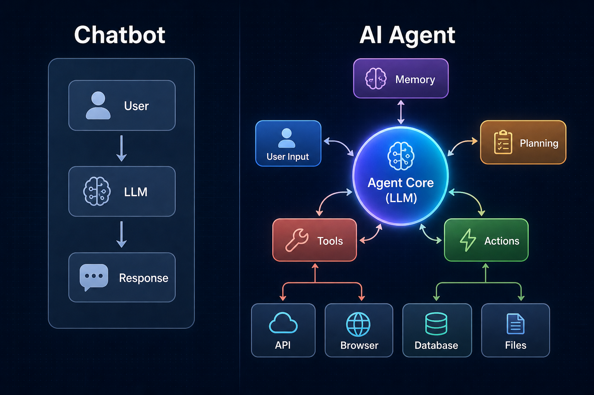
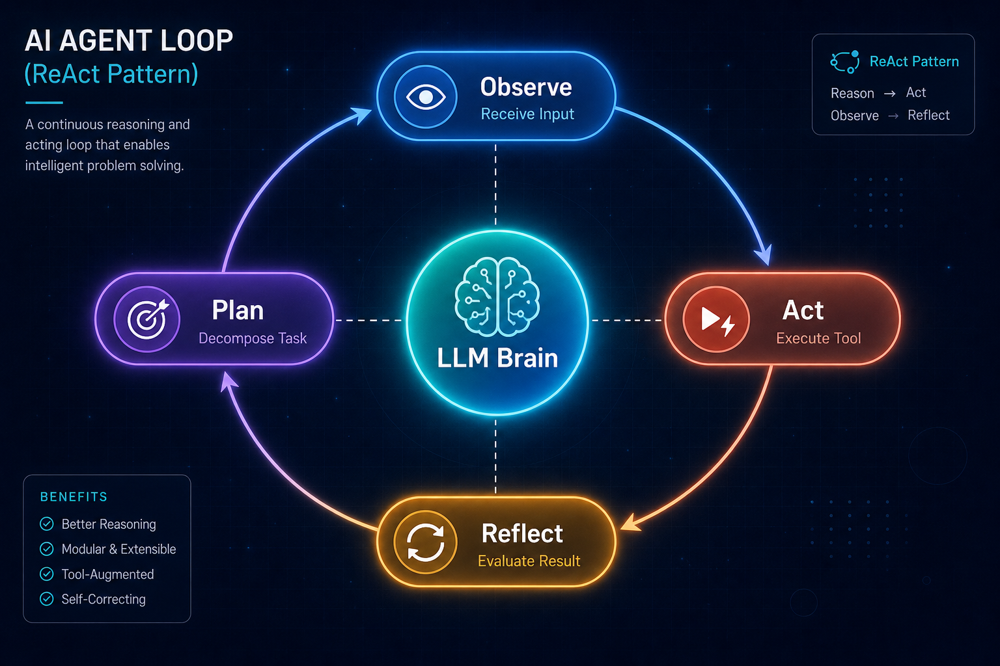
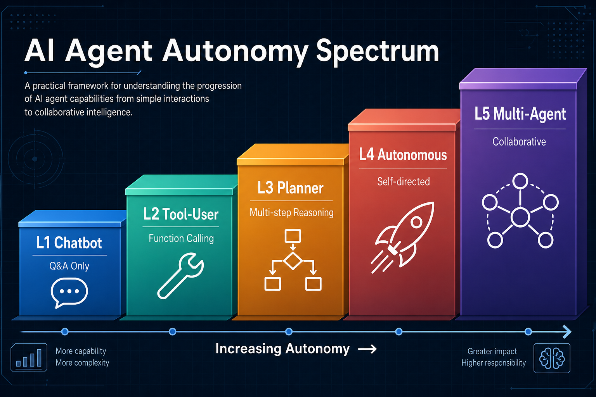

# Day 31: 什么是 AI Agent？—— 从聊天机器人到自主系统

> **核心问题**："AI Agent" 和聊天机器人到底有什么本质区别？为什么 2026 年所有人都在造 Agent 而不是继续调 Prompt？

---

## 开篇

想象你让一个人"帮我安排下周末去东京的旅行"。聊天机器人会给你一份漂亮的行程表——航班、酒店、餐厅——全部凭记忆生成。而 Agent 会打开你的日历检查空闲时间，搜索预算内的航班，预订酒店，把行程加到日程里，然后给你的旅伴发条消息。一个生成文字，另一个**把事情做完**。

这个区别——生成答案还是执行动作——就是 AI Agent 的核心所在。到 2026 年初，"AI Agent" 已经成为行业最热门的词汇，Google Trends 上的搜索热度甚至超过了 "LLM" 本身。Google 在 2026 年 4 月推出了 Agent Development Kit（ADK）；Anthropic 的 Computer Use 和 OpenAI 的 Operator 已经运行了一年多。问题不再是 Agent 是否重要，而是**它到底是什么**。

这篇文章将拆解 AI Agent 的解剖结构，解释为什么聊天机器人不是 Agent，并描绘从简单工具调用到完全自主的多 Agent 系统的自治谱系。

---

## 1. 聊天机器人 vs. Agent：本质区别

#### 直觉：实习生 vs. 正式员工

把聊天机器人想象成一个只回答问题的实习生。你问，他答。他从不离开自己的工位。Agent 是一个正式员工——他有工位（LLM），但也有电话（工具）、笔记本（记忆）、项目计划（规划），以及执行决策的权限（行动）。你交给他一个任务，他会自己拆解步骤，打电话联系相关人员，做笔记以备下次使用，然后带着结果回来汇报。


*图 1：聊天机器人是请求-响应循环。Agent 在 LLM 外围包裹了记忆、工具、规划和行动模块，使其能够自主与外部世界交互。*

下面的表格概括了关键区别：

| 维度 | 聊天机器人 | AI Agent |
|------|-----------|----------|
| 核心循环 | 单轮：用户问，LLM 答 | 多轮：观察、规划、行动、反思 |
| 外部交互 | 无——文本进，文本出 | 工具、API、浏览器、文件系统 |
| 记忆 | 仅在上下文窗口内 | 短期 + 长期 + 工作记忆 |
| 规划能力 | 无——单次生成 | 任务分解、多步推理 |
| 自治性 | 零——等待用户指令 | 可变——能自主发起行动 |
| 错误处理 | 无——输出什么就是什么 | 重试、回退、请求澄清 |

Agent **不仅仅是加了额外功能的 LLM**。架构上的转变更深层：LLM 成为了一个循环中的*决策核心*，这个循环观察环境、推理该做什么、执行动作、评估结果。这个循环——通常被称为 **Agent Loop** 或 **ReAct Loop**——正是 Agent 力量的来源。

---

## 2. Agent Loop：Agent 到底怎么工作

#### 直觉：侦探的工作方法

侦探不会听完案情就大喊"管家干的！"他们会观察犯罪现场，形成假设，收集证据（访谈、指纹、记录），更新理论，然后重复直到有把握。AI Agent 也是如此——它不是一次性给出答案。它会*调查*。

ReAct 模式（**Re**asoning + **Act**ing 的缩写），由 Yao 等人在 2023 年底提出，将这个过程形式化为清晰的循环：


*图 2：Agent 循环的四个阶段——观察、规划、行动、反思——以 LLM 为中心推理引擎。*

循环的工作方式如下：

1. **观察（Observe）**：接收来自用户或环境的输入。可能是用户消息、API 响应、或上一步行动的结果。
2. **规划（Plan）**：LLM 推理下一步该做什么——把复杂任务分解为子任务、选择使用哪个工具、或判断任务是否完成。
3. **行动（Act）**：执行一个动作——调用 API、搜索网页、读取文件、运行代码、或发送消息。
4. **反思（Reflect）**：评估行动的结果。成功了吗？需要更多信息吗？应该换一种方式重试吗？

这个循环持续进行，直到任务完成或 Agent 判断无法继续并请求帮助。

### 2.1 一个具体例子

考虑这个任务："找到下周五从新加坡到东京最便宜的航班并预订。"

聊天机器人会生成一段关于如何搜索航班的话——完全没用。

Agent 会：
1. **观察**：解析请求。识别约束：新加坡 → 东京，下周五，最便宜。
2. **规划**："我需要查看日历确定下周五的日期，然后搜索航班比价 API，然后把选项呈现给用户确认。"
3. **行动**：调用日历 API 查找日期。调用航班搜索 API 查询参数。
4. **反思**："得到了 5 个结果。最便宜的是酷航 320 美元。等等——用户说的是'预订'，不是'给我看看选项'。我应该直接预订还是先确认？"
5. **规划**："安全策略：花钱之前必须确认。先展示最佳选项并询问。"
6. **行动**：显示结果并请求确认。

那种停下来确认的行为——关于何时自主行动、何时询问的*判断力*——是 Agent 架构中的关键设计决策。

---

## 3. Agent 的五大组件

2026 年所有严肃的 Agent 框架——无论是 Google ADK、LangChain、CrewAI 还是 Anthropic 的工具使用模式——都围绕五个核心组件：

### 3.1 LLM 核心（大脑）

LLM 是推理引擎。它读取观察结果，决定该做什么，并生成行动计划。2026 年，大多数 Agent 使用 GPT-5.5、Claude 4 或 Gemini 3.5 作为核心。模型的选择至关重要——推理能力更强的模型产生更可靠的 Agent。

### 3.2 记忆（笔记本）

Agent 需要跨越单次对话的记忆：

- **工作记忆**：当前的上下文窗口——正在发生什么。
- **短期记忆**：会话内最近的交互（通常通过对话历史或摘要管理）。
- **长期记忆**：跨会话的持久知识——存储在向量数据库、知识图谱或简单文件中。

没有记忆，Agent 每次都从头开始——就像一个一夜之间忘记一切的员工。

### 3.3 工具（双手）

工具是 Agent 与外部世界交互的方式。常见工具类别：

| 类别 | 示例 | 功能 |
|------|------|------|
| 网页搜索 | Brave API、Google Search | 查找最新信息 |
| 代码执行 | Python 沙箱、Shell | 运行计算 |
| 文件读写 | 读取、写入、编辑文件 | 文档处理 |
| 通信 | Email、Slack、SMS | 联系人类 |
| 浏览器自动化 | Puppeteer、Playwright | 浏览网站 |
| API 调用 | REST、GraphQL | 集成外部服务 |

**MCP（Model Context Protocol）**，由 Anthropic 在 2024 年底推出，到 2026 年已被广泛采用，标准化了工具如何描述和连接到 Agent。不必为每个工具做定制集成，MCP 提供了通用接口——就像 AI Agent 的 USB 接口。

### 3.4 规划（策略）

复杂任务需要分解。规划策略包括：

- **ReAct**：实时交替推理和行动步骤。
- **Plan-and-Execute**：先生成完整计划，然后逐步执行。
- **Tree-of-Thought**：探索多条推理路径并选择最优的。
- **Reflexion**：完成任务后反思错误，用改进的策略重试。

### 3.5 行动执行（双腿）

行动层把 LLM 的计划变成*实际操作*。包括函数调用（结构化 API 调用）、计算机使用（控制 GUI）和代码生成（编写并运行脚本）。

Anthropic 的 Computer Use（2024 年 10 月）和 OpenAI 的 Operator（2025 年 1 月）代表了一种新范式：Agent 不是调用特定的 API，而是*看着屏幕*、*点击按钮*，就像人类一样。这更慢但灵活得多——它适用于任何应用，不仅仅是那些有 API 的。

---

## 4. 自治度谱系

#### 直觉：驾驶的类比

并非所有 Agent 的自治程度相同。想象一下驾驶：

- **L1（聊天机器人）**：你是乘客，问司机问题。他回答但不驾驶。
- **L2（工具使用者）**：定速巡航——车保持速度，但你控制方向。
- **L3（规划者）**：高速公路自动驾驶——车自己导航，但你监督。
- **L4（自主）**：无人驾驶出租车——你给目的地，它处理一切。
- **L5（多 Agent）**：一队出租车协调接送城市里的所有人。


*图 3：AI Agent 自治度的五个级别，从简单问答到协作式多 Agent 系统。*

2026 年大多数生产环境的 Agent 处于 L2–L3。真正的 L4 自治——你可以信任 Agent 在没有监督的情况下完成复杂任务——对大多数场景来说仍然是目标。行业正在积极解决可靠性、安全和评估问题来弥合这个差距。

---

## 5. 2026 年的 Agent 框架

Agent 生态已经快速成熟。以下是主要框架概览：

### 框架与协议

| 名称 | 提供方 | 核心特点 | 状态（2026 年 5 月） |
|------|--------|---------|---------------------|
| [Google ADK](https://google.github.io/adk-docs/) | Google | 代码优先、多 Agent、A2A 协议 | 2026 年 4 月发布 |
| [MCP](https://modelcontextprotocol.io/) | Anthropic | 通用工具接口标准 | 广泛采用 |
| [LangGraph](https://github.com/langchain-ai/langgraph) | LangChain | 有状态的图式 Agent 工作流 | 生产就绪 |

### 著名 Agent 产品

| 产品 | 类型 | 核心特点 | 状态（2026 年 5 月） |
|------|------|---------|---------------------|
| [Claude Code](https://www.anthropic.com/product/claude-code) | 编程 Agent | 终端原生、自主代码编辑、多 Agent 编排 | Anthropic 旗舰开发工具 |
| [Codex](https://developers.openai.com/codex) | 编程 Agent | 云端沙箱、Computer Use、多日自动化任务 | OpenAI 桌面编程 Agent |
| [OpenClaw](https://openclaw.ai/) | 个人 Agent | 开源、自托管、持久记忆、多平台支持 | 48 小时内 GitHub 10 万+ Star |
| [Hermes Agent](https://hermes-agent.org/) | 个人 Agent | 自进化技能、跨会话学习、模型无关 | Nous Research，2026 年 2 月 |
| [Cursor](https://cursor.com/) | AI IDE | Agent 模式、代码库索引、自主长时任务 | 领先的 AI 原生编辑器 |

### 多 Agent 协作：两种路线

随着 Agent 能力增强，一个新挑战浮现：*多个 Agent* 之间如何协作？两个有代表性的平台展示了不同的哲学：

**[CrewAI](https://github.com/crewAIInc/crewAI)** 采用*基于角色的自上而下*模式。你定义一组 Agent——研究员、写手、审阅者——每个角色有明确的职责、目标和工具集。编排器负责任务分配和信息路由。这种模式适合结构化的重复流程，比如"调研 → 分析 → 报告"。

**[Slock](https://slock.ai/)**，由 Kimi CLI 的开发者创建，采用*人类参与的自下而上*模式。人类和 AI Agent 以平等队友的身份共存于一个类 Slack 的工作空间中——不是工具，而是协作伙伴。Agent 可以自主认领任务（task claiming），维护跨会话的持久记忆，并通过 channel 和 DM 实时协调。这非常适合小团队和独立开发者，他们需要的是真正的 AI 同事，而不仅仅是自动化工人。

两者的对比很有启发：CrewAI 优化的是**纯 Agent-to-Agent 自动化**，而 Slock 优化的是**人机混合协作**。两者都合理——选择取决于你的工作流需要完全自治，还是需要人类在环。

---

**Google ADK**（2026 年 4 月）作为最新入局框架值得关注。它提供了代码优先的 Python/TypeScript 框架，原生支持多 Agent 编排、托管工具集成，以及部署到 Google Cloud 的 Agent Platform。关键是，它集成了 **A2A（Agent-to-Agent）协议**——一种新标准，让用不同框架构建的 Agent 能相互通信。

在产品端，**Claude Code** 和 **Codex** 代表了编程 Agent 的最前沿——能自主编辑文件、运行测试、管理多步骤开发流程。**OpenClaw** 和 **Hermes** 则走了一条不同的路线：它们是驻留在本地机器上的持久化个人 Agent，维护长期记忆，能跨平台运行（Telegram、Slack、Discord、终端）。**Cursor** 将 IDE 和 Agent 范式融合，提供了带 Agent 模式的 AI 原生编程环境，支持自主执行长时间任务。

---

## 6. Agent 为什么会失败（以及如何解决）

Agent 很令人兴奋，但远非完美。主要失败模式：

1. **错误累积**：每一步都有小概率失败。如果每步成功率是 $p$，那么 $n$ 步之后，整体可靠性是：

$$
R = p^n
$$

当 $p = 0.95$、$n = 10$ 步时，$R = 0.95^{10} \approx 0.60$——意味着"95% 准确率"的 Agent 完成一个 10 步任务的成功率只有 60%。这就是为什么 Agent 的可靠性比单轮聊天机器人的准确性难得多。

2. **幻觉式工具调用**：LLM 编造不存在的参数或以错误顺序调用工具。
3. **无限循环**：Agent 卡在重复同一个行动而不推进。
4. **上下文窗口溢出**：长时间的 Agent 会话耗尽上下文窗口，导致 Agent "忘记"之前的步骤。
5. **安全违规**：没有适当的防护栏，Agent 可能执行有害操作（删除文件、发送不当消息、花钱）。

针对这些问题的研究很活跃。Du 等人（2026）的综述 [《A Survey on the Optimization of Large Language Model-based Agents》](https://arxiv.org/abs/2503.12434) 将优化方法分类为提示工程、微调和强化学习。

---

## 7. 代码示例：最小 Agent Loop

```python
import json

# 一个最小的 ReAct Agent Loop 实现
# 需要：LLM API 客户端和工具注册表

def agent_loop(task: str, llm_client, tools: dict, max_steps: int = 10):
    """
    实现 ReAct 模式的最小 Agent。
    
    参数:
        task: 用户的任务描述
        llm_client: 接收 prompt 并返回文本的可调用对象
        tools: {工具名: 工具函数} 的字典
        max_steps: 防止无限循环的安全限制
    """
    messages = [
        {"role": "system", "content": f"""你是一个 Agent。逐步解决任务。
可用工具: {list(tools.keys())}

用 JSON 格式回复:
{{"thought": "你的推理", "action": "工具名", "action_input": {{...}}, "final_answer": null}}
或者如果完成:
{{"thought": "...", "action": null, "final_answer": "你的答案"}}"""},
        {"role": "user", "content": task}
    ]
    
    for step in range(max_steps):
        response = llm_client(messages)
        decision = json.loads(response)
        
        print(f"步骤 {step+1} — 思考: {decision['thought']}")
        
        # 任务完成了吗？
        if decision.get("final_answer"):
            return decision["final_answer"]
        
        # 执行工具
        tool_name = decision["action"]
        tool_input = decision["action_input"]
        
        if tool_name not in tools:
            observation = f"错误: 找不到工具 '{tool_name}'。"
        else:
            try:
                observation = tools[tool_name](**tool_input)
            except Exception as e:
                observation = f"错误: {e}"
        
        print(f"  -> 调用 {tool_name}({tool_input})")
        print(f"  -> 观察: {str(observation)[:200]}")
        
        # 把观察结果反馈给 Agent
        messages.append({"role": "assistant", "content": response})
        messages.append({"role": "user", "content": f"观察结果: {observation}"})
    
    return "Agent 达到最大步数但未完成任务。"

# 使用示例:
# tools = {"search_web": search_web, "read_file": read_file}
# result = agent_loop("查找新加坡的人口", my_llm, tools)
```

这个最小示例展示了核心循环：LLM 思考、选择工具、执行、观察结果、然后循环。生产框架会加上错误恢复、流式传输、并行工具调用和人机协作检查点。

---

## 8. 关键里程碑：Agent 革命

AI 中"Agent"的概念比 LLM 更早——可以追溯到 1990 年代的经典 AI 研究。但现代基于 LLM 的 Agent 时代发展极快。以下是真正有影响力的里程碑：

**2023 — 基础奠定**
- **ReAct 论文**（Yao 等人，ICLR 2023）——证明了交替推理和行动能显著提高任务完成率。现代 Agent 架构的基石。
- **AutoGPT 爆火**（2023 年 3 月）——第一波 Agent 热潮。展示了公众对自主 AI 的巨大需求，即使早期版本并不可靠。

**2024 — Agent 走向真实世界**
- **Anthropic Computer Use**（2024 年 10 月）——Agent 能像人类一样看屏幕、点按钮。超越了纯 API 交互的新范式。
- **OpenAI Operator**（2025 年 1 月）——将自主网页浏览和任务执行带给了主流用户。

**2025 — 基础设施层**
- **MCP 协议**（Anthropic）——标准化了工具如何连接到 Agent。就像 AI 的 USB 接口——一个通用接口代替每个工具的定制集成。
- **Claude Code**（Anthropic）——终端原生编程 Agent，成为行业首选开发工具。
- **Codex**（OpenAI）——基于云端的编程 Agent，支持沙箱执行和多日自动化任务。

**2026 — Agent 走向主流**
- **OpenClaw**（2026 年 1 月）——开源个人 Agent，48 小时内 GitHub 10 万+ Star。持久记忆、多平台、自托管。
- **Hermes Agent**（Nous Research，2026 年 2 月）——自进化个人 Agent，随使用积累可复用技能。
- **Slock**（2026）——Kimi CLI 开发者打造的 Agent-Human 协作平台。Agent 是队友，不是工具。
- **Google ADK**（2026 年 4 月）——代码优先的多 Agent 框架，支持 A2A 协议。
- **A2A 协议**——新标准，让不同框架构建的 Agent 能互相通信，类似 HTTP 之于 Web 服务器。

---

## 9. 常见误解

### ❌ "Agent 就是带函数调用的聊天机器人"

函数调用是必要条件但不是充分条件。Agent 还需要一个*循环*——观察结果、对结果进行推理、自主决定下一步行动的能力。带函数调用的聊天机器人每条用户消息执行一个工具。Agent 可以在没有人类干预的情况下跨多个步骤串联多次工具调用。

### ❌ "Agent 会取代所有软件"

Agent 在开放式、多步骤任务上很强大。但对于定义明确、确定性的工作流（计算工资、路由网络数据包、渲染网页），传统软件仍然更快、更便宜、更可靠。Agent 擅长灵活性和推理比速度和可预测性更重要的场景。

### ❌ "自治度越高越好"

更高的自治意味着更高的风险。一个完全自主的 Agent 能预订航班、发送邮件、管理你的财务——听起来很棒，直到它犯错。行业正在向**人机协作**模式收敛，Agent 在低风险操作中自主行动，但在高风险决策前暂停等待确认。

---

## 10. 前沿动态：最新进展（2025-2026）

Agent 领域发展迅速。以下是最重要的最新动态：

1. **Google ADK（Agent Development Kit）**—— 2026 年 4 月发布，Google 的代码优先框架，用于构建支持原生 A2A 协议的多 Agent 系统。([官方文档](https://google.github.io/adk-docs/))

2. **A2A（Agent-to-Agent）协议**—— 2026 年的标准，让用不同框架构建的 Agent 能够通信和协作，类似于 HTTP 让不同 Web 服务器能互操作。([GitHub](https://github.com/google/adk-python))

3. **MCP 生态爆发**—— 到 2026 年中，数千个 MCP 服务器可用，让 Agent 通过标准化接口连接到几乎任何 SaaS 产品或数据源。([MCP 文档](https://modelcontextprotocol.io/))

4. **Agent 优化综述**—— Du 等人（2026 年 2 月）发表了一篇关于通过提示工程、微调和 RL 优化 LLM Agent 的综合综述，发表于 ACM Computing Surveys。([arXiv](https://arxiv.org/abs/2503.12434))

5. **Agentic AI 综述**—— Abou Ali 等人（2025 年 11 月）提供了 Agentic AI 架构的详尽分类，涵盖推理增强、工具增强、多 Agent 和记忆增强类别。([Springer](https://link.springer.com/article/10.1007/s10462-025-11422-4))

---

## 11. 延伸阅读

### 入门
1. [ReAct: Synergizing Reasoning and Acting in Language Models](https://arxiv.org/abs/2210.03629)—— 开创现代 Agent 范式的基础论文（Yao 等人，ICLR 2023）
2. [LangChain Agent 文档](https://python.langchain.com/docs/concepts/agents/)—— 使用 LangChain 构建 Agent 的实践指南

### 进阶
1. [A Survey on the Optimization of LLM-based Agents](https://arxiv.org/abs/2503.12434)—— Du 等人，ACM Computing Surveys 2026
2. [Agentic AI: Architectures, Applications, and Future Directions](https://link.springer.com/article/10.1007/s10462-025-11422-4)—— Abou Ali 等人，AI Review 2025
3. [Agent Systems: Architectures, Applications, and Evaluation](https://arxiv.org/abs/2601.01743)—— 2026 年 arXiv 综合综述

### 论文
1. ["ReAct: Synergizing Reasoning and Acting in Language Models"](https://arxiv.org/abs/2210.03629)—— Yao 等人，2022
2. ["Toolformer: Language Models Can Teach Themselves to Use Tools"](https://arxiv.org/abs/2302.04761)—— Schick 等人，2023

---

## 思考题

1. 如果 LLM 的每步准确率是 95%，Agent 可以走多少步才使整体可靠性降到 50% 以下？这对 Agent 设计意味着什么？
2. 为什么 MCP 协议被比作 USB？USB 作为标准成功的属性是什么，MCP 是否具备这些属性？
3. 你什么时候会选择 Plan-and-Execute 架构而不是 ReAct？各自的权衡是什么？

---

## 总结

| 概念 | 一句话解释 |
|------|-----------|
| AI Agent | LLM 被包裹在观察、规划、行动、反思的循环中，能够自主完成多步骤任务 |
| ReAct 模式 | 交替推理（思考）和行动（工具使用）直到任务完成 |
| Agent Loop | 观察 → 规划 → 行动 → 反思 → 重复 |
| MCP | Model Context Protocol——连接工具和 Agent 的通用标准 |
| 自治度谱系 | L1（聊天机器人）到 L5（多 Agent），自治和风险递增 |
| 工具使用 | Agent 调用外部 API、运行代码、浏览网页或操作文件的能力 |
| 记忆 | 工作记忆、短期记忆和长期记忆，让 Agent 在交互间维持上下文 |
| 规划 | 针对复杂目标的任务分解策略（ReAct、Plan-and-Execute、Tree-of-Thought） |

**核心要点**：AI Agent 不是加了额外功能的聊天机器人——它是一种根本不同的架构，LLM 成为自主循环中的推理核心。Agent 观察环境、规划行动、通过工具执行、然后反思结果。随着框架的成熟（Google ADK、MCP、A2A）和模型的改进，Agent 正在从研究演示走向生产系统——但可靠性、安全性和评估仍然是关键挑战。

---

*Day 31 of 60 | LLM Fundamentals*
*字数：约 2600 | 阅读时间：约 13 分钟*
