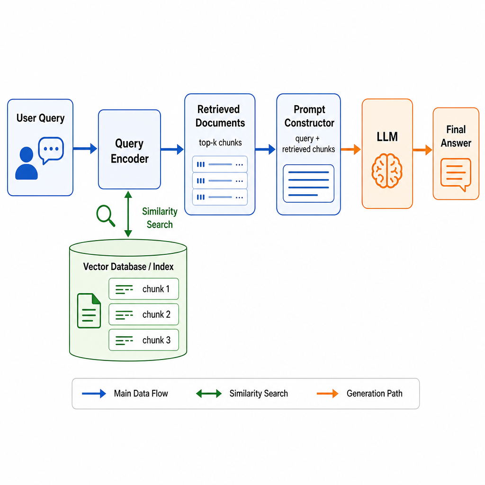
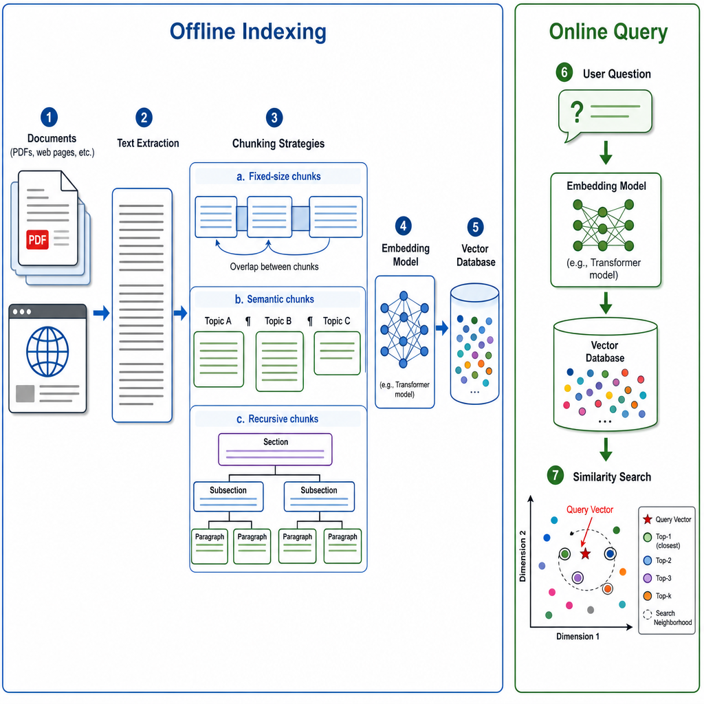
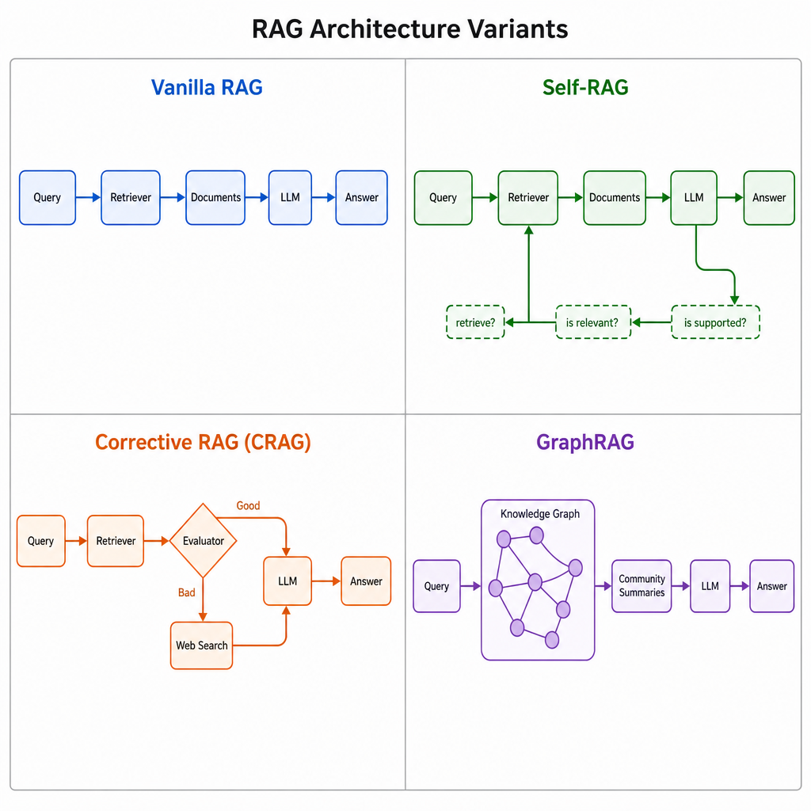
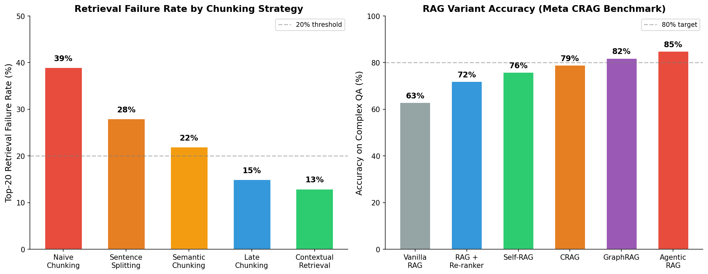
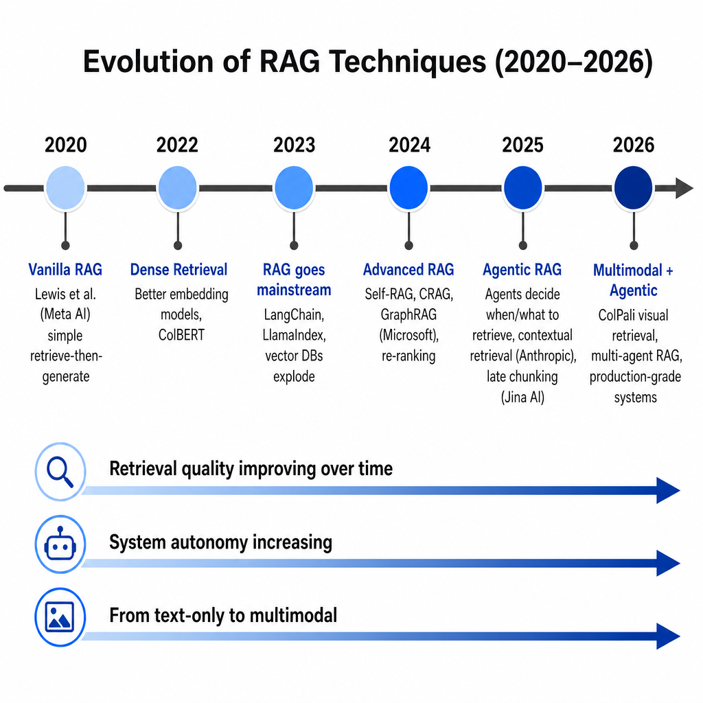

# Day 35: RAG 详解 — 检索增强生成

> **核心问题**: 怎样让一个 LLM 获取它训练时没见过的知识，而不用重新训练它？

---

## 开篇

想象你是一位学识渊博的教授，把 2023 年之前出版的教科书都背得滚瓜烂熟。几乎什么问题都能脱口而出。但有人问你昨天刚发表的论文——你可以猜一个，而且猜得很有自信——但大概率是错的。

LLM 面临的正是这个处境。它们的时间定格在训练数据的截止日期，无法访问私有文档、最新新闻、或者你公司的内部知识库。RAG（Retrieval-Augmented Generation，检索增强生成）就是解决方案：与其让模型记住一切，不如让它在回答之前先*查资料*。

RAG 由 Meta AI（当时的 Facebook AI Research）的 Patrick Lewis 及其合作者（来自伦敦大学学院和纽约大学）在 2020 年 NeurIPS 论文 ["Retrieval-Augmented Generation for Knowledge-Intensive NLP Tasks"](https://arxiv.org/abs/2005.11401) 中提出。核心想法很优雅：把预训练的参数化模型（LLM）和非参数化记忆（检索索引）结合起来。这个最初的研究想法，如今已成为生产环境中最广泛部署的 LLM 架构之一——从企业聊天机器人到编程助手，无处不在。

---

## 1. RAG 为什么存在：知识问题

#### 直觉：开卷考试 vs. 闭卷考试

把标准的 LLM 想象成一个参加*闭卷考试*的学生——只能用训练时记住的东西。RAG 把它变成了*开卷考试*——模型在组织答案之前可以先翻书找到相关段落。关键洞察是：如果你擅长找到正确的那一页，就不需要把整座图书馆都背下来。

LLM 面临的几个知识限制，RAG 都能直接应对：

| 限制 | 描述 | RAG 的解决方案 |
|------|------|----------------|
| **知识截止** | 训练数据有固定的截止日期 | 从最新来源检索 |
| **私有数据** | 企业 Wiki、医疗记录、法律文件 | 索引并检索内部文档 |
| **幻觉问题** | 模型编造看起来合理但错误的事实 | 用检索到的证据来约束生成 |
| **领域专业性** | 通用知识强，垂直领域弱 | 专用语料库提升领域准确率 |
| **更新成本** | 重新训练既昂贵又缓慢 | 几分钟就能更新检索索引 |

---

## 2. RAG 如何工作：完整流水线

RAG 流水线包含两大阶段：**离线索引阶段**（做一次）和**在线查询阶段**（每个用户问题执行一次）。

### 2.1 离线索引

在用户提问之前，先准备好知识库：

1. **文档收集** — 收集你的来源：PDF、Wiki 页面、工单、代码仓库。
2. **分块（Chunking）** — 将文档切分成较小的段落（通常 256–512 个 token）。这一步非常关键，因为把整篇文档送入检索既昂贵又不精确。
3. **嵌入（Embedding）** — 将每个文本块通过嵌入模型（例如 OpenAI 的 [text-embedding-3-large](https://platform.openai.com/docs/guides/embeddings)，或开源的 [BGE](https://huggingface.co/BAAI/bge-large-en-v1.5)）生成稠密向量表示。
4. **索引** — 将这些向量存入向量数据库（如 [Pinecone](https://www.pinecone.io/)、[Weaviate](https://weaviate.io/)、[Chroma](https://www.trychroma.com/) 或 [Qdrant](https://qdrant.tech/)），这些数据库针对快速近邻搜索做了优化。

### 2.2 在线查询

当用户提出问题时：

1. **查询编码** — 用户的问题用同一个嵌入模型生成向量。
2. **检索** — 将查询向量与数据库中所有文本块向量做比较，检索出最相似的 top-k 个（通常 k=3 到 k=10）。
3. **Prompt 构建** — 检索到的文本块被注入到 LLM 的 prompt 中，通常使用类似模板："根据以下上下文回答问题。上下文：[文本块]。问题：[查询]。"
4. **生成** — LLM 读取包含检索上下文的 prompt，生成有据可依的答案。


*图 1：完整的 RAG 流水线——从用户查询，经过检索，到最终答案生成。*

---

## 3. 分块问题：RAG 成败的关键

#### 直觉：把小说切成随意的碎片

想象你有一本 500 页的小说，按每 50 页一切，但切口完全随机——可能切在句子中间、段落中间。然后有人问"主角为什么去了巴黎？"你递给他第 200–250 页，但这部分恰好从一场晚宴的中间开始，在追逐戏中间结束。上下文支离破碎。

糟糕的分块策略对 RAG 系统的影响正是如此。分块策略可以说是 RAG 流水线中影响最大的工程决策，因为它决定了检索器能找到什么。

### 3.1 分块策略对比

| 策略 | 原理 | 优点 | 缺点 |
|------|------|------|------|
| **固定大小** | 每隔 N 个 token 切一刀，带重叠 | 简单，可预测 | 会切断句子，丢失语义连贯性 |
| **基于句子** | 在句子边界处切割 | 干净的语言单元 | 块可能太小或太大 |
| **递归** | 按标题 → 段落 → 句子的层级切分 | 尊重文档结构 | 需要结构化输入（Markdown、HTML） |
| **语义** | 按嵌入相似度对句子分组 | 语义连贯的块 | 计算量更大，块大小不均匀 |
| **Late Chunking** | 先嵌入整篇文档，*再*分块 | 保留跨块上下文 | 需要特殊的嵌入模型 |

### 3.2 Late Chunking 革命

[Jina AI 的 Late Chunking](https://jina.ai/news/late-chunking-in-long-context-embedding-models/) 技术（2024 年）带来了重要进展。传统 RAG 的流程是先分块再嵌入——每个块的嵌入与文档其他部分完全隔离。Late Chunking 反过来：先嵌入*整篇文档*，然后把嵌入向量分割成块。这样保留了块间的上下文关联，在复杂查询上检索失败率降低了多达 30%。

类似地，[Anthropic 的 Contextual Retrieval](https://www.anthropic.com/news/contextual-retrieval)（2024 年 9 月）在嵌入之前为每个文本块添加一段简短的、由 LLM 生成的上下文说明——解释这个块在父文档中的位置。Anthropic 报告称这项简单的技术将 top-20 检索失败率降低了 67%。


*图 2：离线索引流水线——从原始文档，经过分块和嵌入，到向量存储。*

---

## 4. 检索：找到正确的信息

#### 直觉：带有神奇卡片目录的图书馆

在实体图书馆里，你通过书名或作者来搜索卡片目录——但如果你想找"关于面对失败时韧性的书"呢？你需要已经知道正确的关键词。稠密检索就像有一个理解*含义*而不仅仅是关键词的图书管理员。

### 4.1 稀疏检索 vs. 稠密检索

| 方面 | 稀疏检索（BM25） | 稠密检索（嵌入） |
|------|------------------|------------------|
| **方法** | 关键词频率匹配 | 语义向量相似度 |
| **优势** | 精确关键词匹配、专有名词 | 概念匹配、同义词 |
| **劣势** | 漏掉改写、同义词 | 对罕见词、人名较弱 |
| **速度** | 非常快（倒排索引） | 快（近似最近邻） |
| **适用场景** | 法律文档、代码、技术术语 | FAQ、对话式查询 |

#### BM25 是怎么工作的？

**BM25**（Best Matching 25）由 Stephen Robertson 和 Karen Spärck Jones 在 1990 年代提出，是信息检索领域的经典算法。它基于一个直觉：**一个词在文档中出现次数越多，这个文档越相关；但如果这个词在所有文档中都很常见，它的区分度就越低。**

核心公式可以简化理解为：

```
BM25 得分 = Σ 对每个查询词:
    IDF(词) × freq(词, 文档) × (k1 + 1)
    ─────────────────────────────────────────
    freq(词, 文档) + k1 × (1 - b + b × 文档长度 / 平均文档长度)
```

三个关键参数：

- **IDF（逆文档频率）**：衡量词的稀有程度。"the" 出现在几乎所有文档中，IDF 接近 0；"BM25" 很少出现，IDF 很高。这让罕见词对匹配的贡献更大。
- **词频饱和（k1 参数）**：一个词出现 10 次不一定比出现 5 次好 2 倍。BM25 用饱和函数让边际收益递减——第 1 次出现贡献最大，后面每次出现贡献越来越小。通常 k1 = 1.2–2.0。
- **文档长度归一化（b 参数）**：长文档天然更容易匹配到更多词，BM25 通过 b 参数惩罚过长的文档。b = 0 表示不归一化，b = 1 表示完全归一化。通常 b = 0.75。

**举个例子**：

查询："BM25 算法的应用场景"

- 文档 A："BM25 是经典的搜索算法，在电商搜索中被广泛应用"（短，精确匹配 2 个关键词）
- 文档 B："搜索引擎使用了包括 TF-IDF、BM25、BERT 等多种算法，涵盖多种应用场景..."（长，也匹配了关键词，但因长度惩罚得分较低）

BM25 会给文档 A 更高的分数——关键词匹配更集中，文档更简洁。

**为什么 2026 年还在用？**

尽管有了嵌入模型和语义搜索，BM25 仍然是生产 RAG 系统的标配组件：
- 对**精确匹配**（人名、产品编号、代码变量名）比嵌入模型更可靠
- **零延迟开销**——基于倒排索引，不需要 GPU
- 和稠密检索**互补**——BM25 抓精确匹配，嵌入抓语义相似

这就是为什么混合检索（BM25 + 稠密检索）是目前生产环境的标准做法。

现代 RAG 系统通常使用**混合检索**——结合 BM25（稀疏）和稠密检索——来获得两者的优势。结果通过倒数排名融合（RRF）或学习型重排器来合并。

### 4.2 重排：质量过滤器

初始检索（不管是 BM25 还是稠密检索）都有一个根本问题：**它们在给文档打分时，都没有同时看过查询和文档。**

#### 为什么初始检索不够？

**双编码器（Bi-Encoder）**——也就是稠密检索用的模型——把查询和文档*分别*编码成向量，然后计算向量间的余弦相似度。问题在于：

- 查询和文档各自压缩成一个向量，大量细节信息丢失了
- "苹果" 这个词在查询里可能指水果，在文档里可能指公司——单独编码时无法区分
- BM25 也有类似问题：它只看关键词是否出现，不理解上下文

打个比方：双编码器像只看两个人的证件照来判断他们是否匹配——快速但粗糙。

**重排器（Cross-Encoder）** 则是让两个人站在一起，面对面交流后再判断——慢但精确。

#### 交叉编码器是怎么工作的？

交叉编码器把查询和文档*拼在一起*，作为一个整体输入给 Transformer：

```
输入: [CLS] 苹果公司最新发布了什么产品 [SEP] 苹果公司于2026年5月发布了新一代MacBook Pro [SEP]
                              ↕
                  Transformer 联合编码
                              ↕
                  相关性得分: 0.94

输入: [CLS] 苹果公司最新发布了什么产品 [SEP] 苹果富含维生素C，每天吃一个有助于健康 [SEP]
                              ↕
                  Transformer 联合编码
                              ↕
                  相关性得分: 0.12
```

关键区别：每个词都能同时 *attend* 到查询和文档中的所有其他词。模型能直接看到"苹果公司"在查询中指公司，在第二个文档中指水果——不需要猜测。

#### 两阶段设计的必要性

为什么不直接用交叉编码器？因为**它太慢了**。

| | 双编码器（初始检索） | 交叉编码器（重排） |
|---|---|---|
| **查询 vs 文档** | 分別编码，比向量 | 拼接编码，联合理解 |
| **速度** | 极快（预计算文档向量） | 慢（每对都要跑一遍 Transformer） |
| **适合规模** | 100 万+ 文档 | 50–100 个候选 |
| **精度** | 中等 | 高 |
| **计算成本** | 低 | 高 |

如果你有 100 万篇文档，对每篇都跑一次交叉编码器，每次查询需要几分钟——用户等不了。所以两阶段策略是必要的：

1. **阶段 1**：用快速双编码器从 100 万篇中检索 top-50（毫秒级）
2. **阶段 2**：用交叉编码器对这 50 篇精确打分，保留 top-5（秒级）

#### 重排解决什么问题？

- **消歧**："苹果"是公司还是水果？交叉编码器能根据查询上下文判断
- **多义词/同义词**："便宜"和"实惠"在向量空间中可能不够近，但交叉编码器能理解它们在当前查询语境下是同义的
- **长尾查询**：用户问了很具体的问题，双编码器可能匹配到关键词但不理解意图，重排器能修正
- **跨语言**：查询是中文但文档是英文时，重排器对跨语言语义的理解通常更好

流行的重排器包括 [Cohere Rerank](https://cohere.com/rerank) 和开源模型 [bge-reranker-large](https://huggingface.co/BAAI/bge-reranker-large)。

---

## 5. RAG 变体：超越基础版

最初的 RAG 设计（检索 → 塞入 prompt → 生成）现在被称为**"Vanilla RAG"**或**"Naive RAG"**。随着领域的成熟，研究者们发现了系统性的弱点，并提出了越来越复杂的变体。


*图 3：四种主要 RAG 架构变体——每种针对 Vanilla RAG 的一个特定弱点。*

### 5.1 Self-RAG（Asai 等人，2023）

["Self-RAG: Learning to Retrieve, Generate, and Critique through Self-Reflection"](https://arxiv.org/abs/2310.11511) 让模型学会问自己三个问题：
- **需要检索吗？** — 不是每个问题都需要外部知识。
- **检索到的文档相关吗？** — 如果不相关，再试一次。
- **我的回答有文档支撑吗？** — 如果没有，修改答案。

模型学习了特殊的*反思 token*来触发这些自检，使其能够自适应地决定是否检索，而不是盲目地每次都检索。

### 5.2 纠正性 RAG / CRAG（Yan 等人，2024）

["Corrective Retrieval Augmented Generation"](https://arxiv.org/abs/2401.15884) 添加了一个轻量级的*评估器*，对检索到的文档质量打分。如果文档不相关：
- 系统触发**网络搜索**作为后备，寻找更好的信息
- 如果文档部分相关，它会提取并精炼有用的部分

这种"自愈"检索层在生产环境中特别有价值，因为你的索引永远不会完美地覆盖所有需求。

### 5.3 GraphRAG（微软，2024）

微软的 [GraphRAG](https://microsoft.github.io/graphrag/) 采用了完全不同的索引方法。它不是将文档切分成扁平的文本段落，而是：
1. 用 LLM 从文档中提取实体和关系
2. 构建连接跨文档实体的**知识图谱**
3. 检测图谱中的社区并为每个社区生成摘要
4. 查询时，同时从图谱结构和社区摘要中检索

GraphRAG 擅长**全局性问题**——需要在大量文档间综合信息的问题，比如"这一万份文档的主要主题是什么？"Vanilla RAG 在这类查询上表现不佳，因为没有单个文本块包含完整答案。

---

## 6. RAG 背后的数学

对于想了解形式化定义的读者，以下是 RAG 的原始数学表述：

$$
\begin{aligned}
p(y \mid x) &= \sum_{z \in \mathcal{Z}} p(y \mid x, z) \cdot p(z \mid x)
\end{aligned}
$$

其中：
- **x** 是输入查询
- **y** 是生成的输出
- **z** 是检索到的文档
- **p(z | x)** 是检索概率（文档 z 与查询 x 的相关程度）
- **p(y | x, z)** 是生成概率（给定查询 + 文档后 LLM 的回答）

在实际中，求和由 top-k 检索到的文档来近似：

$$
\begin{aligned}
p(y \mid x) &\approx \sum_{i=1}^{k} p(y \mid x, z_i) \cdot p(z_i \mid x)
\end{aligned}
$$

检索分数 **p(z | x)** 通常通过嵌入空间中的余弦相似度来计算：

$$
\begin{aligned}
\text{sim}(q, d) &= \frac{\mathbf{E}(q) \cdot \mathbf{E}(d)}{\|\mathbf{E}(q)\| \cdot \|\mathbf{E}(d)\|}
\end{aligned}
$$

其中 **E(q)** 和 **E(d)** 分别是查询和文档的嵌入向量。

---

## 7. RAG 性能：基准测试告诉我们什么


*图 4：不同分块策略的检索失败率（左）和不同 RAG 变体在复杂问答上的准确率（右）。数据来自 Meta CRAG Benchmark 和 Anthropic contextual retrieval 评估。*

从数据中可以得出几个关键洞察：

1. **分块策略影响巨大** — 朴素分块（39% 失败率）与 contextual retrieval（13% 失败率）之间相差 26 个百分点——检索质量提升了 3 倍。
2. **高级变体一致优于 Vanilla RAG** — 在 Meta 的 CRAG 基准上，Vanilla RAG 只有 63% 的准确率，而 Agentic RAG 达到了 85%。
3. **复杂度带来的边际收益递减** — 每增加一层复杂性（重排器、自反思、纠正机制）增加 4-7% 的准确率，但也增加了延迟和基础设施复杂度。

---

## 8. 实践中构建 RAG

### 8.1 技术栈

| 组件 | 热门选择 | 备注 |
|------|---------|------|
| **嵌入模型** | OpenAI text-embedding-3, BGE, E5, Cohere Embed | 根据语言/领域选择 |
| **向量数据库** | Pinecone, Weaviate, Qdrant, Chroma, pgvector | 云托管 vs. 自托管的权衡 |
| **框架** | [LangChain](https://www.langchain.com/), [LlamaIndex](https://www.llamaindex.ai/), Haystack | LlamaIndex 专注 RAG；LangChain 更通用 |
| **LLM** | GPT-4, Claude, Gemini, Llama 3 | 更大的模型处理长上下文更好 |
| **重排器** | Cohere Rerank, bge-reranker, ColBERT | 交叉编码器做最终质量提升 |

### 8.2 代码示例：最小 RAG 流水线

```python
# 使用 LangChain 和 OpenAI 的最小 RAG 流水线
from langchain_openai import OpenAIEmbeddings, ChatOpenAI
from langchain_community.vectorstores import Chroma
from langchain_text_splitters import RecursiveCharacterTextSplitter

# 步骤 1：加载并分块文档
splitter = RecursiveCharacterTextSplitter(
    chunk_size=500,       # 每个块的 token 数
    chunk_overlap=50,     # 块之间的重叠
    separators=["\n\n", "\n", ". ", " ", ""],  # 切分层级
)
chunks = splitter.split_documents(documents)

# 步骤 2：嵌入并索引
embedding_model = OpenAIEmbeddings(model="text-embedding-3-small")
vectorstore = Chroma.from_documents(
    documents=chunks,
    embedding=embedding_model,
    collection_name="my_knowledge_base"
)

# 步骤 3：检索相关文本块
retriever = vectorstore.as_retriever(search_kwargs={"k": 5})
relevant_docs = retriever.invoke("我们公司的退款政策是什么？")

# 步骤 4：生成有据可依的回答
llm = ChatOpenAI(model="gpt-4o", temperature=0)
context = "\n\n".join(doc.page_content for doc in relevant_docs)

response = llm.invoke(f"""根据下面的上下文回答问题。
如果上下文中不包含答案，请说"我没有足够的信息"。

上下文：
{context}

问题：我们公司的退款政策是什么？""")

print(response.content)
```

这是一个基础但功能完整的 RAG 系统，大约 25 行代码。生产系统还会加入重排、混合搜索、查询改写、评估流水线和缓存——但核心循环是一样的。

---

## 9. 常见误解

### ❌ "RAG 消除了幻觉"

RAG 通过让模型基于检索到的证据来*减少*幻觉，但并不能消除它。模型仍然可能误解检索到的文本、从相互矛盾的文档中摘取片面信息、或者直接忽略上下文。在对抗性环境中，RAG 系统甚至可能被检索索引中的投毒文档所操纵。

### ❌ "更大的上下文窗口会让 RAG 过时"

长上下文模型（Gemini 的 200 万 token、Claude 的 20 万 token）确实可以吸收整篇文档。但把所有东西都塞进上下文：
- **昂贵** — 上下文窗口中的每个 token 都要付费
- **慢** — 注意力机制是二次复杂度的；更长的上下文 = 更慢的推理
- **不精确** — "Lost in the middle" 效应意味着模型可能遗漏被埋在大量文本中的相关信息

RAG 和长上下文是互补的：RAG 找到那根针，长上下文在需要时给你更大的草垛。

### ❌ "只用向量搜索就够了"

纯语义搜索会漏掉那些重要的精确关键词匹配（产品 ID、错误代码、专有名词）。生产系统几乎总是使用混合检索，同时结合稀疏（BM25）和稠密（嵌入）方法。

---

## 10. 前沿：RAG 的发展方向（2025–2026）

RAG 领域发展迅速。以下是最重要的近期进展：

### Agentic RAG（2025–2026）

最大的趋势是 **Agentic RAG**——AI 智能体自己决定*何时*、*从哪里*、*如何*检索信息，而不是遵循固定的流水线。[Singh 等人的 Agentic RAG 综述（2025 年 1 月）](https://arxiv.org/abs/2501.09136)提出了基于智能体数量、控制结构和自主性的分类体系。在 Agentic RAG 中，LLM 可以：
- 决定当前查询是否需要检索
- 在多个数据源之间选择（内部 Wiki、网络搜索、数据库查询）
- 根据中间结果迭代地优化搜索
- 在文档检索的同时使用 SQL 查询或 API 调用等工具

### ColPali：视觉文档检索（2025）

[ColPali](https://arxiv.org/abs/2407.01449) 由 Faysse 等人于 2024 年 7 月提出，并在 2025 年持续优化，它将文档检索视为一个*视觉*问题。ColPali 不再提取文本再嵌入，而是直接用视觉 Transformer 处理页面图像，配合晚期交互（ColBERT 风格）匹配。这对于包含表格、图表和复杂排版的文档特别有效——文本提取往往会丢失关键的格式信息。

### RAG 评估：RAGAS 及其他

[RAG 系统评估](https://docs.ragas.io/)已经显著成熟。RAGAS（Retrieval Augmented Generation Assessment）框架最初于 2023 年发布并持续更新，测量以下指标：
- **忠实度（Faithfulness）** — 答案是否基于检索到的上下文？
- **答案相关性（Answer Relevance）** — 答案是否回应了问题？
- **上下文精确度（Context Precision）** — 检索到的文本块是否确实相关？
- **上下文召回率（Context Recall）** — 检索是否找到了所有必要信息？

[Chen 等人的 RAG 评估综合综述（2026 年 1 月）](https://arxiv.org/abs/2504.14891)发现，基于 LLM 的评判器在 RAG 评估中越来越可靠，2024 年下半年和 2025 年上半年是评估方法发表率最高的时期。

### GraphRAG 的成熟（2025–2026）

微软的 GraphRAG 已经催生了一个完整的研究子领域。[ACM TOIS 上发表的图检索增强生成综述（2025）](https://dl.acm.org/doi/10.1145/3777378)收录了数十种图增强 RAG 方法。GraphRAG 在多跳推理和跨文档综合上始终优于 Vanilla RAG，尽管索引构建成本显著更高（贵 100–1000 倍）。


*图 5：RAG 从 2020 年的基础检索-生成到 2026 年的多模态智能体系统的演进——检索质量、系统自主性和模态覆盖都有了显著提升。*

---

## 延伸阅读

### 入门
1. [LangChain RAG 教程](https://python.langchain.com/docs/tutorials/rag/) — 构建RAG系统的实操教程
2. [LlamaIndex 文档](https://docs.llamaindex.ai/) — 专为 RAG 应用设计的框架
3. [Pinecone 学习中心](https://www.pinecone.io/learn/) — 优秀的向量搜索和 RAG 教程

### 进阶
1. [RAGAS 框架文档](https://docs.ragas.io/) — 系统化评估你的 RAG 流水线
2. [微软 GraphRAG](https://microsoft.github.io/graphrag/) — 用于复杂推理的图增强检索
3. [Anthropic Contextual Retrieval 博文](https://www.anthropic.com/news/contextual-retrieval) — 显著提升检索的简单技术

### 论文
1. ["Retrieval-Augmented Generation for Knowledge-Intensive NLP Tasks"](https://arxiv.org/abs/2005.11401) — Lewis 等人，2020（RAG 开山之作）
2. ["Self-RAG: Learning to Retrieve, Generate, and Critique through Self-Reflection"](https://arxiv.org/abs/2310.11511) — Asai 等人，2023
3. ["Corrective Retrieval Augmented Generation"](https://arxiv.org/abs/2401.15884) — Yan 等人，2024
4. ["Agentic Retrieval-Augmented Generation: A Survey on Agentic RAG"](https://arxiv.org/abs/2501.09136) — Singh 等人，2025 年 1 月
5. ["Retrieval-Augmented Generation Evaluation in the Era of Large Language Models: A Comprehensive Survey"](https://arxiv.org/abs/2504.14891) — Chen 等人，2026 年 1 月
6. ["Graph Retrieval-Augmented Generation: A Survey"](https://dl.acm.org/doi/10.1145/3777378) — ACM TOIS，2025

---

## 思考题

1. 在什么场景下你会选择 RAG 而不是微调来构建领域特定应用？各自的权衡是什么？
2. 为什么分块策略在大多数 RAG 系统中比嵌入模型的选择更重要？
3. 如果 Agentic RAG 系统可以自主决定是否检索，当它*选择不检索*但本应该检索时会发生什么？你会如何检测和修复这个问题？

---

## 总结

| 概念 | 一句话解释 |
|------|-----------|
| **RAG** | 检索相关文档，注入 LLM prompt，生成有据可依的回答 |
| **分块（Chunking）** | 将文档切分成段落用于检索；策略选择至关重要 |
| **嵌入（Embedding）** | 将文本转换为稠密向量用于语义相似度搜索 |
| **向量数据库** | 专门为嵌入向量快速近邻搜索优化的存储系统 |
| **重排（Re-ranking）** | 两阶段检索：快速初筛 → 精细质量评分 |
| **Self-RAG** | 模型学会自我反思：需要检索吗？相关吗？答案有支撑吗？ |
| **CRAG** | 添加自愈评估器，在检索失败时触发网络搜索 |
| **GraphRAG** | 从文档中构建知识图谱，用于跨文档推理 |
| **Agentic RAG** | 智能体自主决定何时/如何检索，在多种策略间选择 |
| **Contextual Retrieval** | 在嵌入前为每个文本块添加 LLM 生成的上下文描述 |

**核心要点**：RAG 解决了让 LLM 获取训练数据之外知识的根本问题。核心流水线很简单——检索相关文本块、注入 prompt、生成答案——但生产质量很大程度上取决于分块策略、检索方法，以及越来越多地依赖智能体式控制。2026 年，前沿已经从"能不能检索到"发展到了"系统能不能自主决定*何时*以及*如何*检索"。

---

*Day 35 of 60 | LLM Fundamentals*
*字数：约 3000 | 阅读时间：约 15 分钟*
