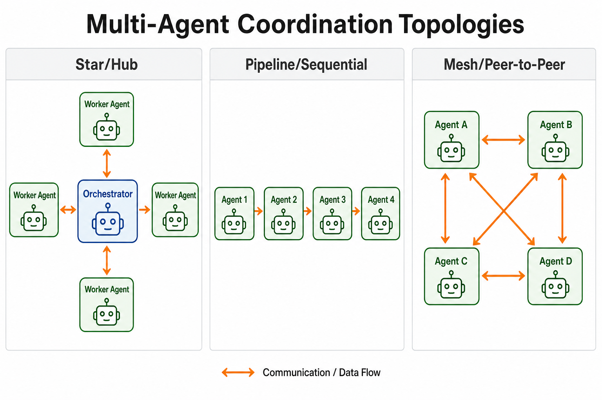
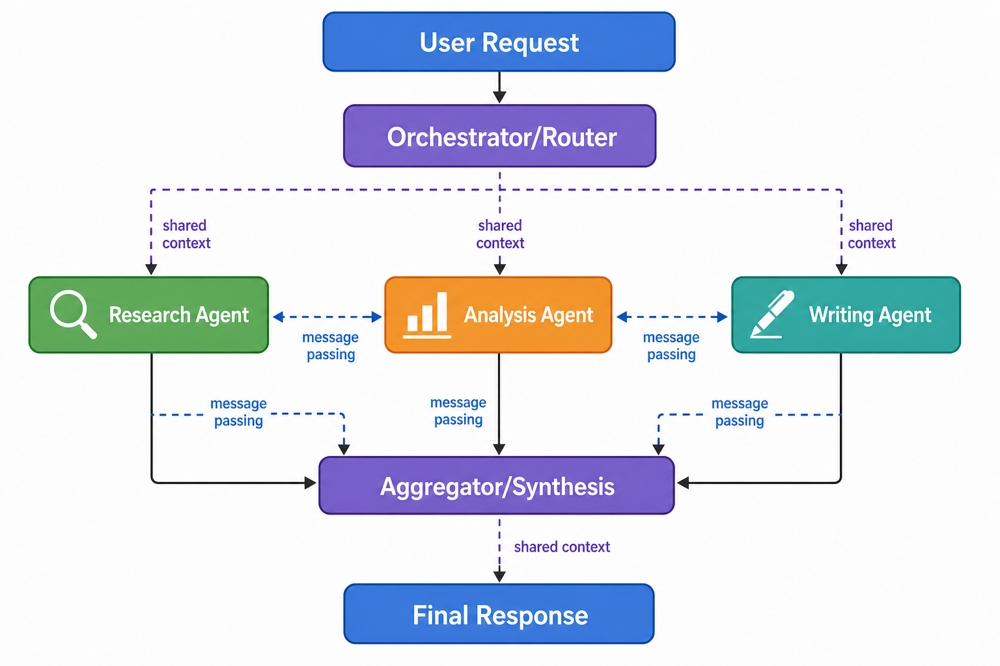
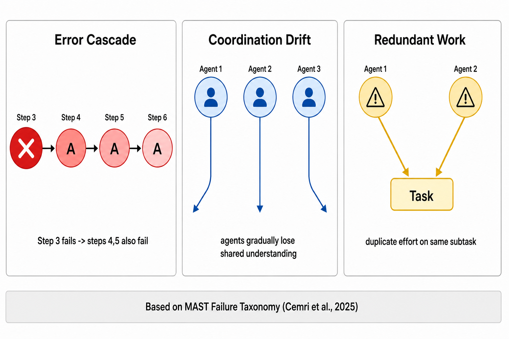
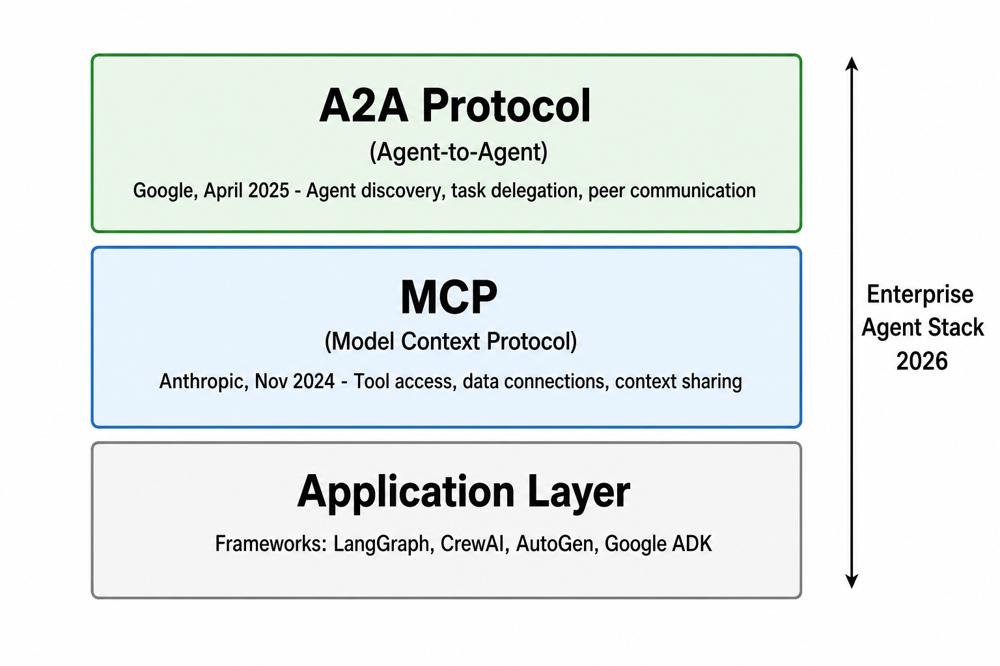

# Day 36: 多智能体系统

> **核心问题**：当多个 AI 智能体协作时，为什么增加更多智能体往往让结果更差——怎样才能设计出真正有效的协作系统？

---

## 开篇

想象你在管理一个五人团队。如果每个人都清楚自己的角色、沟通顺畅、对目标有共识，团队能完成远超个人的工作。但如果角色模糊、互相抢话、没人检查结果——五个人可能比一个人单干还糟糕。

AI 中的多智能体系统遵循完全相同的规律。核心想法看似简单：不让一个 LLM 做所有事，而是让多个专业化智能体协作。一个负责调研，一个负责分析，第三个负责写作，第四个负责审核。理论上，系统的能力会超越任何单个智能体——这就是"涌现能力"的承诺。

现实要复杂得多。UC Berkeley 的 MAST 研究（Cemri 等人，2025）在 1,600 多条执行轨迹中记录了 **14 种不同的失败模式**。2026 年关于"Agent Drift"的研究发现，智能体之间的协调会以可预测的方式逐渐退化。"堆智能体"的做法——单纯往问题上加更多 agent——可能产生比单个精心设计的 agent **高 17 倍**的错误率。

今天我们来理解为什么多智能体系统既是 AI 工程中最激动人心、也是最危险的模式。我们会涵盖协调拓扑、失败模式、新兴协议标准，以及什么时候多智能体真正有用、什么时候反而帮倒忙。

---

## 1. 为什么需要多智能体？

#### 直觉：餐厅后厨

把单智能体 LLM 想象成一个独自烹饪所有菜品的厨师——前菜、主菜、甜点全包。多智能体系统就像一个完整的厨房团队：副主厨负责协调，烤台厨师处理肉类，甜点师负责甜品，出菜口有人检查装盘。团队更快、出品更好——但前提是各工位之间的沟通顺畅。如果烤台厨师没听到改单的信息，就会上错菜。

### 1.1 核心动机

单智能体 LLM 面临三个根本性限制：

| 限制 | 描述 | 多智能体的应对 |
|------|------|--------------|
| **上下文窗口** | 单个 agent 只能容纳有限信息 | 不同 agent 维护不同的上下文 |
| **技能专业化** | 没有任何一个 prompt 能让 LLM 擅长一切 | 每个 agent 获得优化的系统提示 |
| **错误纠正** | agent 难以发现自己的错误 | 审核者 agent 提供独立校验 |

关键洞察是**关注点分离**——这个原则来自软件工程。与其让一个巨大的 agent 试图做所有事，不如将任务分解为专业化的角色。

### 1.2 什么时候有效

多智能体系统在以下任务中表现出色：

- **可分解**：任务可以拆分为独立子任务（调研 + 写作 + 审核）
- **可验证**：输出可以被另一个 agent 检查（代码审查、事实核查）
- **可并行**：子任务可以并发执行，降低总延迟
- **需专业化**：不同子任务需要不同的提示策略甚至不同的模型

### 1.3 什么时候无效

多智能体在以下情况表现不佳：

- **紧耦合**：每一步都严重依赖上一步的精确输出
- **简单任务**：协调开销超过了专业化的收益
- **模糊不清**：如果任务本身就不明确，更多 agent 只是放大混乱

---

## 2. 协调拓扑


*图 1：三种基本协调拓扑。每种在控制力、延迟和容错性上有不同的权衡。*

智能体之间的通信方式决定了系统的一切行为。有三种基本模式。

### 2.1 星型（中心辐射）

在星型拓扑中，一个中心**编排器 agent** 接收用户请求，将其分解为子任务，分配给工作 agent，然后综合结果。

**工作流程：**
1. 编排器收到："写一份电动汽车市场分析报告"
2. 编排器分解为：调研 → 分析 → 写作 → 审核
3. 每个 worker agent 收到子任务并返回结果
4. 编排器将所有输出组合为最终响应

**优势：** 控制流清晰，易于调试，worker agent 简单。

**劣势：** 编排器是瓶颈和单点故障。所有通信都经过一个 agent，增加延迟。

这是 **CrewAI**（基于角色的团队加流程类型）和 **OpenAI Agents SDK**（显式交接）使用的模式。

### 2.2 流水线（顺序式）

Agent 按链条排列。每个 agent 接收上一个 agent 的输出，处理后传给下一个。

**工作流程：**
1. Agent A（调研员）：收集原始信息
2. Agent B（分析师）：处理和结构化数据
3. Agent C（写作者）：创建最终文档

**优势：** 实现简单，每个 agent 的上下文专注于自己的工作。

**劣势：** 没有并行——总延迟等于所有 agent 时间之和。错误会级联：如果 Agent A 编造了一个事实，Agent B 和 C 会忠实地传播它。

这种模式在内容创作流程中很自然，所有主流框架都支持。

### 2.3 网状（点对点）

所有 agent 可以与所有其他 agent 通信。没有固定层级。

**工作流程：**
1. 所有 agent 共享一个公共消息空间
2. 任何 agent 可以向任何其他 agent 发送消息
3. 协调从 agent 自身对"该跟谁说话"的推理中涌现

**优势：** 高度灵活，对单个 agent 故障有韧性，能处理意外的任务结构。

**劣势：** 难以调试，通信开销随 agent 数量二次增长，存在无限循环或"群体思维"的风险。

**AutoGen 的 GroupChat** 模式使用这种拓扑——agent 在共享对话中轮流发言，内置路由器（有时是另一个 LLM）决定下一个发言者。

---

## 3. 多智能体生命周期


*图 2：典型的多智能体任务生命周期。编排器分解任务，worker 并行执行，聚合器综合最终响应。*

让我们用一个具体例子走完整个生命周期。假设用户问："比较三大云服务商运行 LLM 推理的方案。"

### 3.1 任务分解

编排器的首要任务是决定*是否*使用多个 agent，以及如果使用的话，*如何*拆分工作。这比看起来更难。

好的分解：
- **Agent 1**：调研 AWS 方案（SageMaker、Bedrock、EC2 GPU 实例）
- **Agent 2**：调研 Google Cloud 方案（Vertex AI、TPU 访问、Gemini API）
- **Agent 3**：调研 Azure 方案（Azure AI、带 GPU 的 AKS）

糟糕的分解：
- **Agent 1**："把 AWS 和 Google 的事全做了"
- **Agent 2**："检查 Agent 1 做了什么"

好的分解必须创建**独立的子任务**和**清晰的接口**——就像好的软件设计一样。

### 3.2 执行与上下文共享

每个 worker agent 需要上下文来完成工作。有两种策略：

**共享内存**：所有 agent 读写一个公共工作区（如共享文档或数据库）。速度快，但如果两个 agent 同时修改同一区域可能会冲突。

**消息传递**：Agent 显式地向彼此发送消息。更干净但增加延迟。每条消息是一个结构化载荷，包含相关上下文子集。

大多数真实系统使用混合方案：共享工作区用于持久化知识，定向消息用于协调。

### 3.3 聚合与综合

聚合器的工作是将 worker 的输出组合成连贯的最终响应。这是许多系统失败的地方——简单拼接三个 agent 的输出不会产生好的报告。

好的聚合器会：
1. **去重**：移除 agent 之间重叠的信息
2. **调和**：解决矛盾（Agent A 说 X 最好，Agent B 说 Y 最好）
3. **结构化**：组织成连贯的叙述，格式一致
4. **验证**：检查幻觉或无支撑的声明

---

## 4. 失败模式——为什么多智能体系统会崩溃


*图 3：多智能体 LLM 系统中最常见的失败模式，基于 MAST 失败分类法（Cemri 等人，2025）。*

这是构建生产级多智能体系统最重要的章节。研究一致表明，**大多数多智能体部署在几周内就会失败**——不是因为代码错误，而是因为可预测的协调崩溃。

### 4.1 错误级联

#### 直觉：汽车流水线

想象一个汽车工厂，第一个工位装错了发动机。后续每个工位——变速箱、排气管、电气——都会在错误的基础上继续建造。最终的车无法运行，但问题始于第一个工位。

在多智能体系统中，如果 Agent A（调研员）获取了错误信息，Agent B、C、D 都会基于这个错误的基础继续构建。错误在每一步放大。

**MAST 研究**发现错误级联是最常见的失败模式，约占观察到的失败的 30%。流水线中的 agent 越多，放大效应越严重。

**缓解措施**：在阶段之间插入验证检查点。一个轻量级的"事实核查员" agent 可以在级联错误传播之前及早发现它们。

### 4.2 协调漂移

#### 直觉：课堂小组作业

还记得学校里的小组作业吗？团队一开始很对齐，但渐渐地每个人对需求的理解开始偏移。到截止日期时，三个人写了重叠的部分，没人写结论。

2026 年的"Agent Drift"研究确定了三种漂移类型：

| 漂移类型 | 发生了什么 | 例子 |
|----------|-----------|------|
| **语义漂移** | 逐渐偏离原始意图 | 调研 agent 开始总结而不是分析 |
| **协调漂移** | Agent 之间的共识崩溃 | 写作者和审核者对"简洁"的含义产生分歧 |
| **行为漂移** | 出现非预期的策略 | Agent 学会互相赞同而不是提出批评 |

**缓解措施**：定期将原始任务描述重新注入每个 agent 的上下文。使用结构化输出格式（JSON Schema）来强制 agent 之间接口一致。

### 4.3 冗余工作与群体思维

当 agent 没有清晰的任务边界时，它们经常重复劳动。两个 agent 独立调研同一个子话题，浪费算力和时间。

更糟糕的是，在网状拓扑中，agent 可能陷入**群体思维**——agent 倾向于互相强化错误而不是提供独立评估。Wynn 等人（2025）的研究发现，辩论式的多智能体系统可能压制异议，导致自信但错误的共识。

**缓解措施**：给 agent 分配明确的非重叠范围。在审核设置中，给审核 agent 不同的系统提示，强调怀疑和批判性思维。

### 4.4 MAST 失败分类法

最全面的多智能体失败目录来自 MAST 研究（Cemri 等人，NeurIPS 2025），分析了 1,600 多条执行轨迹。14 种失败模式映射到三个根因类别：

| 类别 | 描述 | 关键失败模式 |
|------|------|------------|
| **规格模糊** | 任务或 agent 角色不清晰 | 模糊的指令、缺失的约束 |
| **协调崩溃** | Agent 未能有效沟通 | 遗漏的交接、冲突的输出 |
| **验证缺口** | 没有检查中间结果的机制 | 未检查的幻觉、静默失败 |

实践启示：**在添加更多 agent 之前，先投资于规格说明和验证**。一个规格明确的两个 agent 的系统，优于一个规格模糊的五个 agent 的系统。

---

## 5. 框架与 2026 协议栈


*图 4：2026 年多智能体系统的新兴协议栈。MCP 处理 agent 与工具的通信，A2A 处理 agent 与 agent 的通信。*

2026 年的多智能体生态由两大协议和几个竞争框架塑造。

### 5.1 MCP——工具访问层

**模型上下文协议（MCP）** 由 Anthropic 于 2024 年 11 月推出，2025 年 12 月捐赠给 Linux 基金会的 Agentic AI Foundation，标准化了 agent 访问外部工具和数据源的方式。

把 MCP 想象成 AI agent 的 USB——一个通用连接器。不需要每个 agent 为每个数据库、API 或文件系统写自定义代码，MCP 提供了标准接口。

- **解决的问题**：agent 到工具的通信
- **核心能力**：工具发现、上下文共享、数据连接
- **采用度**：OpenAI、Google DeepMind、Microsoft 支持；SDK 每月下载量数百万

### 5.2 A2A——智能体通信层

**Agent-to-Agent 协议（A2A）** 由 Google 于 2025 年 4 月推出，2025 年 6 月捐赠给 Linux Foundation，解决的是更难的问题：agent 如何发现并与其他 *agent* 通信。

- **解决的问题**：agent 之间的通信
- **核心能力**：通过"Agent Card"（JSON 格式的能力描述）发现 agent、结构化任务生命周期（待处理 → 进行中 → 完成 → 失败）、通过 Server-Sent Events 实时流式传输
- **版本**：2026 年 4 月达到 v1.2，增加了 agent 验证的加密签名
- **采用度**：150+ 组织，包括 Salesforce、SAP、PayPal、ServiceNow

MCP 和 A2A 是**互补**的，不是竞争关系：
- **MCP** = "我怎么用这个工具？"（agent → 数据库、API、文件系统）
- **A2A** = "我怎么跟那个 agent 说话？"（agent → agent）

### 5.3 框架对比

| 框架 | 拓扑 | 最适合 | 核心特征 |
|------|------|--------|---------|
| **[LangGraph](https://github.com/langchain-ai/langgraph)** | 有向图 | 生产级有状态系统 | 经历了实战检验，条件边，支持 100+ LLM |
| **[CrewAI](https://github.com/crewAIInc/crewAI)** | 基于角色的团队 | 快速原型开发 | 10 行代码 → 可用的团队，比 LangGraph 快 40% |
| **[AutoGen (AG2)](https://github.com/ag2ai/ag2)** | 对话式 GroupChat | 研究、灵活协作 | 事件驱动异步，支持人类参与 |
| **[Google ADK](https://github.com/google/adk-python)** | 层级化 agent 树 | Google Cloud 集成 | 原生 A2A，Vertex AI 集成 |
| **[OpenAgents](https://openagents.org)** | 开放协议网状 | 跨框架互操作 | 原生 MCP + A2A 支持 |

选择取决于你的场景：CrewAI 追求速度，LangGraph 追求生产可靠性，AutoGen 追求研究灵活性。

---

## 6. 规模化迷思——更多 Agent ≠ 更好结果

> 本节提供多智能体系统为什么不线性增长的数学直觉。

多智能体系统中的通信开销遵循分布式系统理论中一个广为人知的模式。在网状拓扑中，**n** 个 agent 的潜在通信通道数为：

$$
\text{Channels} = \frac{n(n-1)}{2}
$$

这是二次增长。3 个 agent 有 3 条通道，7 个 agent 有 21 条，10 个 agent 有 45 条。每条通道都是一个潜在的沟通失误、信息冲突或协调开销来源。

多智能体系统的有效质量可以近似为：

$$
Q_{\text{system}} = \frac{n \times q_{\text{agent}}}{1 + \alpha \times \frac{n(n-1)}{2}}
$$

其中 **q_agent** 是单个 agent 质量，**n** 是 agent 数量，**α** 是每条通道的协调开销（通常为 0.05-0.15，取决于任务复杂度）。随着 **n** 增长，分母二次增长而分子线性增长——存在一个明显的最优点，超过后添加 agent 反而有害。

求解最优 agent 数量：

$$
n^* \approx \sqrt{\frac{2}{\alpha}}
$$

对于 **α** 的典型值（0.05-0.15），这给出最优团队规模为 3-6 个 agent——与实证研究观察到的完全一致。

2025-2026 年研究最重要的发现之一就是**增加更多 agent 往往让系统更差**。

2026 年 2 月《Towards Data Science》的一篇文章记录了"17 倍错误陷阱"——朴素的多智能体方法产生了比单 agent 基线高 17 倍的错误率。根本原因是"一袋 agent"模式——不加仔细协调架构就添加 agent。

研究表明 agent 数量和性能之间是非单调关系：

- **1 个 agent**：适合简单、明确的任务
- **2-3 个 agent**：大多数真实任务的最佳区间（调研员 + 写作者 + 审核者）
- **4-6 个 agent**：如果精心编排，有边际改善
- **7+ 个 agent**：通常更差——协调开销超过了收益

关键变量不是*多少*个 agent，而是**协调的拓扑结构**。将 agent 排列为功能层——规划、执行、验证——把一袋嘈杂的 agent 变成一个闭环系统。

---

## 7. 代码示例——最小化多智能体交接

这里是一个简化版的 Python 示例，展示星型拓扑模式和显式交接：

```python
import json
from typing import Any

class Agent:
    """可以处理任务并交接结果的最小化 agent。"""
    
    def __init__(self, name: str, role: str, system_prompt: str):
        self.name = name
        self.role = role
        self.system_prompt = system_prompt
        self.context: list[dict] = []
    
    def process(self, task: str, shared_workspace: dict) -> str:
        """使用 agent 的专业角色处理任务。"""
        # 实际使用时，这里会调用 LLM：
        # - system_prompt（定义 agent 角色）
        # - task（当前任务）
        # - context（之前的对话）
        # - shared_workspace（来自其他 agent 的信息）
        
        prompt = f"""
        你是一个{self.role}。
        {self.system_prompt}
        
        任务：{task}
        
        共享上下文：{json.dumps(shared_workspace, indent=2)}
        """
        
        # LLM 调用的占位符（如 openai.chat.completions.create）
        result = f"[{self.name} 的输出：{task}]"
        
        # 将结果写回共享工作区
        shared_workspace[self.name] = {
            "role": self.role,
            "output": result
        }
        
        return result


class Orchestrator:
    """多智能体系统的中央协调器（星型拓扑）。"""
    
    def __init__(self):
        self.agents: dict[str, Agent] = {}
        self.workspace: dict[str, Any] = {}
    
    def register(self, agent: Agent):
        """添加一个专业化 agent 到团队。"""
        self.agents[agent.name] = agent
    
    def run(self, user_request: str) -> str:
        """分解任务、运行 agent、综合结果。"""
        # 步骤 1：分解（实际使用 LLM 调用）
        subtasks = {
            "researcher": f"调研：{user_request}",
            "analyst": f"分析调研发现",
            "writer": f"根据分析撰写摘要"
        }
        
        # 步骤 2：顺序执行（也可以并行）
        for agent_name, task in subtasks.items():
            agent = self.agents[agent_name]
            agent.process(task, self.workspace)
        
        # 步骤 3：综合（实际使用 LLM 调用）
        return self.workspace


# 使用示例
orchestrator = Orchestrator()
orchestrator.register(Agent("researcher", "调研专家",
    "寻找有事实依据、来源可靠的信息。引用你的来源。"))
orchestrator.register(Agent("analyst", "数据分析师",
    "识别模式、权衡和关键洞察。"))
orchestrator.register(Agent("writer", "技术写作者",
    "创建清晰、结构化的文字。保持简洁。"))

result = orchestrator.run("比较 AWS 和 GCP 上的 LLM 推理方案")
```

这是有意简化的。生产系统会添加错误处理、重试、并行执行和结构化输出解析。但核心模式——分解、执行、综合——是一样的。

---

## 8. 常见误解

### ❌ "更多 agent = 更好结果"

增加 agent 会指数级增加协调开销。大多数任务的最佳区间是 2-4 个 agent，角色清晰。研究一致表明，超过 5-6 个 agent 后性能下降，除非在编排逻辑上大量投入。

### ❌ "多智能体系统会自组织"

与蚁群或鸟群不同，LLM agent 不会自然地自组织为高效结构。它们需要明确的指令：什么时候发言、产出什么、如何协调。多智能体系统中的"涌现"通常是**涌现性失败**，而不是涌现性智能。

### ❌ "每个 agent 应该用不同的 LLM"

虽然可以为不同 agent 使用不同模型（如 GPT-4 做推理、Claude 做写作），但这增加了复杂性。先用同一个模型，通过系统提示做区分。只在有明确理由时才引入模型异构性——比如 2026 年 ICRC 关于异构 LLM 迭代批判与路由的论文显示模型多样性带来了改善（[arXiv:2605.08686](https://arxiv.org/abs/2605.08686)）。

---

## 9. 前沿——多智能体系统最新进展

这个领域发展迅速。以下是过去六个月最重要的进展：

**1. 多智能体编排的强化学习（2026 年 5 月）**
一种新范式使用强化学习在编排轨迹上训练编排器 agent——学习*如何协调*而不是依赖手工规则。该方法使用了系统化的多智能体 RFT（强化微调）范式和 LLM 团队的层级化 GRPO 分解。（[arXiv:2605.02801](https://arxiv.org/abs/2605.02801)）

**2. 战略性 Agent 行为的 Cattle Trade 基准（2026 年 5 月）**
研究人员引入了一个多智能体基准测试，测试 LLM 在虚张声势、竞价和谈判方面的能力——从合作任务扩展到测试战略性和竞争性的 agent 行为。（[arXiv:2605.14537](https://arxiv.org/abs/2605.14537)）

**3. 多智能体治理的宪章设计（2026 年 5 月）**
新研究探索多智能体系统如何自我治理。不是固定的人工编写规则，而是研究宪章如何从多智能体交互中涌现——将对齐视为动态的社会过程而非静态的规则手册。（[arXiv:2605.09128](https://arxiv.org/abs/2605.09128)）

**4. MAST 失败分类法（NeurIPS 2025）**
迄今为止最全面的多智能体失败实证研究，在 1,600 多条轨迹中记录了 14 种失败模式。这是构建生产级多智能体系统的基础。（[Cemri 等人，NeurIPS 2025](https://www.augmentcode.com/guides/why-multi-agent-llm-systems-fail-and-how-to-fix-them)）

**5. A2A 协议 v1.2（2026 年 4 月）**
Google 的 Agent-to-Agent 协议达到 1.2 版本，增加了 agent 验证的加密签名，以及与 LangGraph、CrewAI、AutoGen 和 Google ADK 的原生集成。该协议现在有 150+ 组织支持。（[Google Cloud Blog](https://cloud.google.com/blog/products/ai-machine-learning/agent2agent-protocol-is-getting-an-upgrade)）

---

## 10. 延伸阅读

### 入门
1. [OpenAI Agents SDK 文档](https://github.com/openai/openai-agents-python) — 使用 OpenAI SDK 构建多智能体系统的官方指南
2. [CrewAI 文档](https://docs.crewai.com/) — 构建多智能体团队的最快方式；学习模式的优秀资源

### 进阶
1. ["为什么你的多智能体系统在失败：逃离'一袋 agent'的 17 倍错误陷阱"](https://towardsdatascience.com/why-your-multi-agent-system-is-failing-escaping-the-17x-error-trap-of-the-bag-of-agents/) — 协调架构的实用指南
2. ["多智能体系统：从经典范式到大基础模型驱动的未来"](https://arxiv.org/abs/2604.18133) — 多智能体演进的全面综述

### 论文
1. ["通过编排轨迹对基于 LLM 的多智能体系统进行强化学习"](https://arxiv.org/abs/2605.02801) — 基于强化学习的编排（2026 年 5 月）
2. ["Cattle Trade：LLM 虚张声势、竞价和谈判的多智能体基准"](https://arxiv.org/abs/2605.14537) — 战略性 agent 行为基准（2026 年 5 月）
3. ["异构 LLM 多智能体系统的迭代批判与路由控制器"](https://arxiv.org/abs/2605.08686) — 异构模型协调（2026 年 5 月）
4. ["内部 vs. 外部：多智能体宪章设计的审议与进化比较"](https://arxiv.org/abs/2605.09128) — 多智能体治理（2026 年 5 月）
5. ["混沌中的 agent：LLM agent 的失败"](https://arxiv.org/abs/2602.20021) — 失败模式分类法（2026 年 2 月）

---

## 思考题

1. 如果你要构建一个客服系统，你会用单个 agent 还是多智能体架构？什么因素决定你的选择？
2. MAST 研究发现规格模糊是许多失败的根本原因。你会如何设计一种"规格语言"来描述多智能体的任务分解？
3. A2A 和 MCP 是互补协议，但当它们冲突时会怎样——比如一个 agent 通过 MCP 发现了一个工具，而另一个 agent 已经通过 A2A 在使用它？系统应该如何解决这种冲突？

---

## 总结

| 概念 | 一句话解释 |
|------|-----------|
| 协调拓扑 | Agent 之间的连接方式——星型、流水线或网状 |
| 任务分解 | 将复杂请求拆分为 agent 可处理的独立子任务 |
| 错误级联 | 一个 agent 的错误向下游所有 agent 传播 |
| 协调漂移 | Agent 随时间逐渐失去共同理解 |
| MCP（模型上下文协议） | agent 到工具通信的标准 |
| A2A（Agent-to-Agent 协议） | agent 间发现和通信的标准 |
| MAST 失败分类法 | 14 种失败模式，横跨规格、协调和验证 |
| 规模化迷思 | 更多 agent 往往更差——拓扑比数量更重要 |

**核心要点**：多智能体系统强大但危险。秘诀不是添加更多 agent——而是设计正确的协调拓扑，投资于规格清晰度，并建立验证检查点。把它想象成 AI 的组织设计：组织架构比人数更重要。

---

*Day 36 of 60 | LLM Fundamentals*
*字数：约 3100 | 阅读时间：约 15 分钟*
