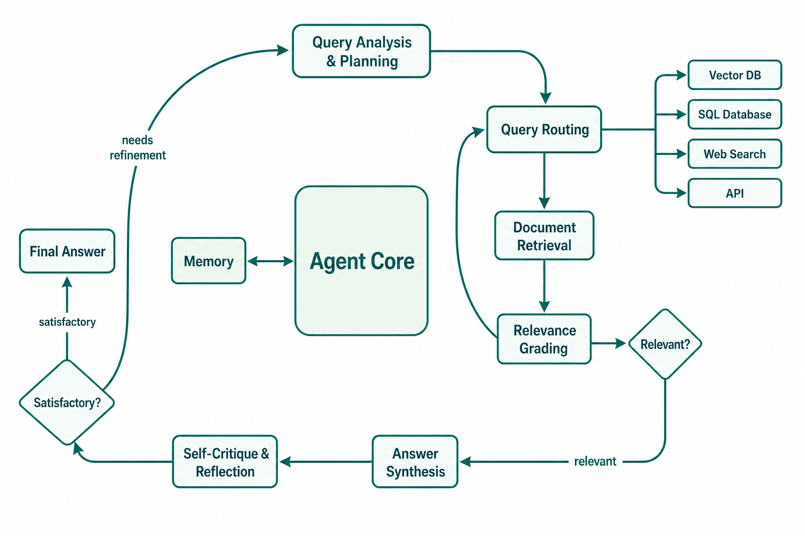

# Day 37: Agentic RAG —— 当检索系统长出了大脑

> **核心问题**：当你赋予 RAG 系统规划、反思和迭代的能力，会发生什么？它对真实世界的 AI 应用又意味着什么？

---

## 开篇

想象你是一名研究助理。老板问你："东南亚固态电池的竞争格局如何？"

一个偷懒的助理跑一次 Google 搜索，把前三条结果复制粘贴交差。这就是传统 RAG —— 检索一次，生成一次，到此为止。

一个好助理——真正好的那种——会先把问题拆开：竞争格局意味着谁在做固态电池；固态电池限定了技术方向；东南亚限定了地理范围。然后她会搜索多个来源——行业报告、专利数据库、新闻资讯。她会交叉验证事实，发现矛盾就重新搜索，确认没有遗漏后才写出一份完整的综合报告。这就是 **Agentic RAG**。

两者的差距不是渐进式的。这是自动售货机和个人购物顾问之间的区别。一个按你按的按钮出货；另一个理解你真正需要什么，一直工作到你满意为止。

在这篇文章中，我们将拆解 Agentic RAG 为什么是 AI 领域增长最快的方向之一（Google Trends：+300% 并持续攀升）、底层架构如何运作、最新研究成果、以及什么时候该用——什么时候不该用。

---

## 1. 从流水线到智能体：一次范式转变

### 1.1 传统 RAG：一次性流水线

我们在 [Day 35](day35-rag-explained.md) 中介绍过，传统 RAG 遵循一个简单的线性流程：

$$
\text{Query} \rightarrow \text{Retrieve} \rightarrow \text{Augment} \rightarrow \text{Generate}
$$

系统将用户问题编码为向量，在向量数据库中找到最相似的文档片段，拼接到提示词前面，然后让 LLM 生成回答。一次检索。一次生成。结束。

这对简单的事实性问题很好用："法国的首都是什么？"答案就在一个文档片段里，一次检索就够了。

#### 直觉：图书管理员 vs 研究员

把传统 RAG 想象成一个热心的图书管理员。你递给她一个问题，她走到书架前，抽出标题最匹配的书，给你念相关的那一页。高效，但有限——她无法追问、无法重新措辞、也无法深挖。

### 1.2 一次性检索的困境

真实世界的问题很少是单跳的。比如："哪个由前 Google 工程师创立的公司在固态电池领域拥有最多专利？"

回答这个问题至少需要三步：(1) 找出由前 Google 工程师创立的电池技术公司，(2) 查看每家公司的专利申请，(3) 比较并选出最多的那家。传统 RAG 试图用单次查询解决，通常以失败告终。[MultiHop-RAG](https://arxiv.org/abs/2401.15391) 的研究表明，标准 RAG 系统在多跳问题上的准确率只有约 34%，而简单事实性问题上能达到 80% 以上。

这是结构性的问题。单次查询无法同时捕获所有约束条件。检索索引中甚至可能不存在一个将三部分证据关联起来的文档片段。

### 1.3 Agentic RAG 登场

Agentic RAG 用 **自主智能体循环（autonomous agent loop）** 替换了固定流水线。不再是"检索一次然后祈祷"，智能体会：

1. **规划** 如何拆解问题
2. **路由** 子查询到正确的数据源
3. **检索** 并 **评估** 文档的相关性
4. **反思** 已收集的证据是否充分
5. **迭代** —— 重新措辞查询、尝试新来源、或改进答案

这个循环持续进行，直到智能体确信自己有足够的高质量证据来生成可靠的回答。


*图 1：传统 RAG 遵循线性流水线（左），Agentic RAG 将检索包裹在规划-反思循环中（右）。*

---

## 2. Agentic RAG 如何工作：架构解析

### 2.1 核心循环

每个 Agentic RAG 系统，无论用什么框架实现，都有某种形式的控制循环：


*图 2：Agentic RAG 架构——规划、路由、评估和反思围绕检索形成迭代循环。*

让我们逐一拆解各个组件：

**查询分析与规划（Query Analysis & Planning）。** 智能体审视用户的问题，判断：这是一个简单查找还是需要拆解？对于多跳问题，它制定一个计划——一系列子查询或一个策略，决定先查哪些来源、按什么顺序。

**查询路由（Query Routing）。** 并非所有问题都应该去同一个数据源。智能体可能会路由到：
- **向量数据库** 做语义相似性搜索
- **SQL 数据库** 做结构化数据查询
- **网络搜索 API** 获取实时信息
- **内部 API** 获取私有数据

这正是 Agentic RAG 得名的原因——智能体 *主动决定* 如何检索，而不是按固定脚本执行。

**文档评估（Document Grading）。** 检索之后，智能体不会盲目相信结果。它评估每个检索到的文档与原始问题的相关性。如果文档不相关或不充分，它可以重新组织查询再试一次。

**推理与综合（Reasoning & Synthesis）。** 收集到足够证据后，智能体将事实串联起来，解决矛盾，构建一个连贯的答案。

**自我批评与反思（Self-Critique & Reflection）。** 输出之前，智能体自问：这个答案完整吗？是否涵盖了问题的所有方面？有没有未经证实的断言？如果不满意，它就回到规划阶段重新开始。

### 2.2 记忆组件

与传统 RAG 的无状态设计不同，Agentic RAG 在检索循环中维护记忆：

- **草稿本记忆（Scratchpad Memory）**：单次查询中的中间推理步骤、已检索事实和部分结论
- **对话记忆（Conversation Memory）**：多轮对话中来自前几轮的上下文
- **长期记忆（Long-term Memory）**：随时间积累的持久知识（如常见问题、已纠正的错误）

记忆让智能体能够避免重复失败的检索策略，并在之前的交互基础上继续构建。

### 2.3 数据流图

为了让路由和反馈循环更直观，下面是 Agentic RAG 系统中数据流动的详细视图：


*图 3：查询路由决策逻辑——不同类型的问题被智能体路由到不同的数据源，每个数据源有其适用场景和典型查询示例。*

---

## 3. 传统 RAG vs Agentic RAG：对比一览

| 维度 | 传统 RAG | Agentic RAG |
|------|---------|-------------|
| **检索方式** | 单次 | 迭代、多步 |
| **查询处理** | 固定的用户查询 | 智能体改写、拆解 |
| **数据源** | 通常单一索引 | 多个（向量 DB、SQL、网页、API） |
| **质量控制** | 无或事后检查 | 内联评估 + 反思 |
| **推理能力** | 仅生成 | 规划 + 推理 + 综合 |
| **记忆** | 无状态 | 草稿本 + 对话 + 长期 |
| **延迟** | 低（1 次 LLM 调用） | 较高（3-10+ 次 LLM 调用） |
| **成本** | 低 | 3-5 倍 |
| **适用场景** | 简单事实性问答 | 多跳、多来源、复杂推理 |

#### 直觉：快餐 vs 精致餐厅

传统 RAG 是快餐：下单、拿到菜单上的东西、快且便宜。Agentic RAG 是精致餐厅：厨师询问你的偏好、调整菜谱、反复品尝调味、最后呈上一道精心搭配的菜品。两者各有各的位置——你不会为了半夜加餐请一位私厨，但也不会在晚宴上信任一台自动售货机。

---

## 4. 性能：为什么复杂度值得

Agentic RAG 的核心承诺是在复杂问题上大幅提升准确率。以下是两种方法在不同任务类型上的对比：


*图 4：不同任务类型的准确率对比。Agentic RAG 的优势随任务复杂度增长而扩大。*

注意这个模式：在简单的事实性问题上，差异微乎其微（82% vs 85%）。但在多跳推理和多源综合——也就是生产环境中真正重要的任务——Agentic RAG 从 30-40% 的范围跳到了 75-80%。A-RAG 论文（[2026 年 2 月](https://arxiv.org/abs/2602.03442)）在 HotpotQA 上达到了 94.5%，在 2WikiMultiHop 上达到了 89.7%，这是两个标准的多跳基准测试。

这不是边际改善。这是从演示玩具到可以真正上线交付给用户的系统之间的区别。

---

## 5. 关键设计模式

Agentic RAG 不是一个单一架构——它是一系列模式的集合。以下是当今生产环境中部署的最常见模式：

### 5.1 路由模式（Router Pattern）

最简单的形式：一个智能体将查询路由到正确的检索器。智能体对问题进行分类（事实性？分析性？实时性？），然后发送到合适的工具。这增加了最小的延迟，同时获得了多源覆盖。

```
用户查询 → 路由智能体 → [向量 DB | 网页搜索 | SQL] → LLM → 回答
```

### 5.2 纠正性 RAG（Corrective RAG, CRAG）

由俄亥俄州立大学和亚马逊的研究团队在 2024 年底提出，[CRAG](https://arxiv.org/abs/2401.15884) 添加了一个 **相关性评估** 步骤。如果检索到的文档得分低于阈值，智能体会触发网络搜索作为后备。这抓住了最常见的 RAG 失败模式：检索到不相关的文档，然后自信地编造答案。

### 5.3 Self-RAG

[Self-RAG](https://arxiv.org/abs/2310.11511)（自反思检索增强生成），由华盛顿大学的 Akari Asai 及同事在 2023 年提出，让 LLM 本身学会决定何时检索、何时批评、何时生成。模型学习特殊的反思标记：`[Retrieve]`、`[NoRetrieve]`、`[Relevant]`、`[Irrelevant]`、`[Supported]`、`[NotSupported]`。这使得检索决策可以端到端训练。

### 5.4 多智能体 RAG（Multi-Agent RAG）

对于最复杂的任务，多个专业化的智能体协同工作。**规划智能体** 拆解问题，**检索智能体** 并行搜索不同来源，**评审智能体** 评估证据，**写作智能体** 综合最终答案。[CrewAI](https://www.crewai.com/) 和 [AutoGen](https://microsoft.github.io/autogen/) 是实现这一模式的热门框架。

---

## 6. 实战：用 LangGraph 实现最小 Agentic RAG

[LangGraph](https://github.com/langchain-ai/langgraph) 已成为 2026 年构建 Agentic RAG 的主流框架，因为它原生支持循环图（loops）——这是传统基于 DAG 的框架（如 LangChain）做不到的。

以下是一个简化但完整的实现：

```python
from langgraph.graph import StateGraph, END
from typing import TypedDict, List

# State: 所有步骤共享的记忆
class AgentState(TypedDict):
    question: str
    rewritten_query: str
    documents: List[str]
    relevance_scores: List[float]
    answer: str
    iterations: int
    is_satisfactory: bool

# 节点 1: 分析与规划
def plan_query(state: AgentState) -> AgentState:
    """拆解问题并创建检索计划"""
    question = state["question"]
    # 实际中调用 LLM 来拆解
    rewritten = f"decomposed: {question}"  # 简化示意
    return {**state, "rewritten_query": rewritten, "iterations": state.get("iterations", 0) + 1}

# 节点 2: 检索文档
def retrieve(state: AgentState) -> AgentState:
    """用改写后的查询搜索向量数据库"""
    query = state["rewritten_query"]
    # 实际中查询向量存储
    docs = [f"doc_result_{query}_1", f"doc_result_{query}_2"]
    return {**state, "documents": docs}

# 节点 3: 评估文档相关性
def grade_documents(state: AgentState) -> AgentState:
    """对每个文档与原始问题的相关性打分"""
    # 实际中使用 LLM 对每个文档打分
    scores = [0.9, 0.3]  # 第一个相关，第二个不相关
    return {**state, "relevance_scores": scores}

# 节点 4: 综合答案
def synthesize(state: AgentState) -> AgentState:
    """从相关文档中构建答案"""
    relevant_docs = [d for d, s in zip(state["documents"], state["relevance_scores"]) if s > 0.5]
    # 实际中调用 LLM 综合生成
    answer = f"基于 {len(relevant_docs)} 份文档: 综合答案"
    return {**state, "answer": answer}

# 节点 5: 自我反思
def reflect(state: AgentState) -> AgentState:
    """检查答案是否令人满意"""
    # 实际中使用 LLM 评估质量
    is_good = len(state["answer"]) > 20 and state["iterations"] < 3
    return {**state, "is_satisfactory": is_good}

# 路由逻辑
def should_retry(state: AgentState) -> str:
    if state["is_satisfactory"]:
        return "done"
    return "retry"

# 构建图
graph = StateGraph(AgentState)
graph.add_node("plan", plan_query)
graph.add_node("retrieve", retrieve)
graph.add_node("grade", grade_documents)
graph.add_node("synthesize", synthesize)
graph.add_node("reflect", reflect)

graph.set_entry_point("plan")
graph.add_edge("plan", "retrieve")
graph.add_edge("retrieve", "grade")
graph.add_edge("grade", "synthesize")
graph.add_edge("synthesize", "reflect")

# 条件边: 重试或结束
graph.add_conditional_edges(
    "reflect",
    should_retry,
    {"done": END, "retry": "plan"}
)

app = graph.compile()
result = app.invoke({"question": "固态电池领域有哪些最新进展？"})
print(result["answer"])
```

这是一个简化示例——生产系统还会添加重排序、混合搜索、人工审批节点和可观测性——但它抓住了核心思想：**将检索包裹在规划-反思循环中**。

---

## 7. RAG 的演化：四个阶段


*图 5：从 Naive RAG（2020）到 Agentic RAG（2025-2026）——每个阶段都在检索过程中增加了更多的自主性和智能。*

**阶段 1：Naive RAG（2020）。** Facebook AI Research（现 Meta FAIR）提出的原始方案：编码查询、检索片段、生成。简单但脆弱。对检索结果没有质量控制。

**阶段 2：Advanced RAG（2023）。** 社区添加了检索前处理（查询扩展、HyDE）、更好的分块策略和检索后重排序。仍然是线性的，但每一步都得到了改进。

**阶段 3：Modular RAG（2024）。** RAG 流水线变得可组合——你可以替换不同的检索器、重排器和生成器。LlamaIndex 推广了这种方式。流水线仍然固定，但每个模块可互换。

**阶段 4：Agentic RAG（2025-2026）。** 流水线变成了循环。智能体决定检索什么、什么时候检索、从哪里检索、以及结果是否够好。这是当前的前沿。

每个阶段并没有取代前一个——简单的问题仍然受益于 Naive RAG 的速度。但 Agentic RAG 是唯一能处理真正复杂、多跳、多源推理的方法。

---

## 8. 什么时候不该用 Agentic RAG

这点重要到值得明确指出：Agentic RAG 并不总是正确选择。

**使用传统 RAG 的场景：**
- 问题是简单的事实查询（单跳）
- 延迟比准确率更重要（聊天界面、实时助手）
- 预算有限（Agentic RAG 每次查询成本是传统 RAG 的 3-5 倍）
- 数据存在于单一且精心管理的索引中

**使用 Agentic RAG 的场景：**
- 问题需要跨来源的多跳推理
- 准确率至关重要，错误代价高昂（医疗、法律、金融）
- 数据是异构的（文档 + 数据库 + API + 网页）
- 需要引用和证据溯源
- 问题可能有歧义，需要澄清

很多团队犯的错误是在调优过的传统 RAG 流水线就够用时，就去上了 Agentic RAG。更复杂不总是意味着更好。

---

## 9. 前沿：现在正在发生什么

Agentic RAG 是 AI 研究和产品开发中发展最快的领域之一。以下是近期最重要的发展：

### 9.1 研究

1. **SoK: Agentic RAG**（2026 年 3 月）—— 来自一个国际研究团队的知识系统化论文，将 Agentic RAG 形式化为有限视野部分可观察马尔可夫决策过程（POMDP）。提供了规划机制、检索编排、记忆范式和工具调用的统一分类法。([arXiv:2603.07379](https://arxiv.org/abs/2603.07379))

2. **A-RAG：分层检索接口**（2026 年 2 月）—— 引入了三种检索工具（关键词搜索、语义搜索、片段阅读），让智能体可以自适应地以不同粒度搜索。在 HotpotQA 上达到 94.5%，显著优于静态检索。([arXiv:2602.03442](https://arxiv.org/abs/2602.03442))

3. **LatentRAG**（2026 年 5 月）—— 一个新颖的框架，将推理和检索都转移到连续潜在空间中，直接从隐藏状态生成子查询。在单次前向传播中完成，实现了与显式 Agentic RAG 相当的准确率，同时大幅降低延迟——有望解决"慢智能体"的问题。([arXiv:2605.06285](https://arxiv.org/abs/2605.06285))

4. **AgenticRAGTracer**（2026 年 2 月）—— 一个跳数感知的基准测试，诊断 Agentic RAG 系统在多步推理链的 *哪个环节* 失败。关键发现：失败主要由扭曲的推理链驱动——要么过早坍缩（放弃太快），要么游荡到过度延伸（追逐无关方向）。([arXiv:2602.19127](https://arxiv.org/abs/2602.19127))

### 9.2 产品与平台

1. **Progress Agentic RAG**（2026 年 Q1 发布）—— Progress Software 在收购 Nuclia（2025 年 7 月）之后推出了 Agentic RAG 即服务平台。它可以摄取并推理文档、视频和音频，内置 AI 智能体。([Progress Agentic RAG](https://www.progress.com/agentic-rag))

2. **NVIDIA AI-Q Blueprint**（2025-2026）—— NVIDIA 将 Nemotron 推理模型、Nemotron RAG 和 NeMo Agent 工具包组合成完整的 Agentic RAG 企业部署栈。([NVIDIA AI-Q](https://build.nvidia.com/nvidia/aiq))

3. **LangGraph** 已成为 2026 年构建 Agentic RAG 的事实标准框架，原生支持循环图、持久化检查点和人工审批——这些都是传统 DAG 框架无法处理的智能体循环必需的特性。([LangGraph 文档](https://docs.langchain.com/oss/python/langgraph/agentic-rag))

### 9.3 大趋势

一个值得关注的转变正在发生：LlamaIndex 创始人 Jerry Liu [公开承认](https://www.mindstudio.ai/blog/llm-frameworks-replaced-by-agent-sdks)"框架时代"正在终结。未来属于智能体 SDK 和智能体架构，RAG 不再是独立的流水线，而是智能体在需要信息时调用的一个 *工具*。这与我们追踪的轨迹一致：流水线 → 模块化流水线 → 智能体工具。

---

## 10. 常见误解

### ❌ "Agentic RAG 就是多检索几步的 RAG"

不是。关键区别在于 **自主性**。传统 RAG 按固定脚本执行：检索、增强、生成。Agentic RAG 会 *做决策*：我需要检索吗？从哪里？这个结果够好吗？我需要换个方法吗？控制权在智能体手里，不在流水线手里。

### ❌ "Agentic RAG 会完全取代传统 RAG"

也不对。对于简单的事实性问题，传统 RAG 更快、更便宜，通常准确率也一样高。Agentic RAG 适用于单次检索失败的复杂、多跳、多源场景。根据场景选择合适的工具。

### ❌ "迭代次数越多结果越好"

未必。AgenticRAGTracer 的研究表明，智能体的失败往往不是因为迭代太少，而是因为推理链变得 *扭曲*——要么过早坍缩（太早放弃），要么过度延伸（追逐无关方向）。迭代的质量比数量更重要。

---

## 11. 延伸阅读

### 基础论文

1. ["Retrieval-Augmented Generation for Knowledge-Intensive NLP Tasks"](https://arxiv.org/abs/2005.11401)（Lewis 等人，2020）—— 来自 Meta FAIR 的原始 RAG 论文
2. ["Self-RAG: Learning to Retrieve, Generate, and Critique through Self-Reflection"](https://arxiv.org/abs/2310.11511)（Asai 等人，2023）—— 端到端可训练的检索决策
3. ["Corrective RAG (CRAG)"](https://arxiv.org/abs/2401.15884)（Yan 等人，2024）—— 添加相关性评估和网页搜索后备

### 最新 Agentic RAG 论文

4. ["SoK: Agentic Retrieval-Augmented Generation"](https://arxiv.org/abs/2603.07379)（2026 年 3 月）—— 综合分类法和形式化框架
5. ["A-RAG: Scaling Agentic RAG via Hierarchical Retrieval Interfaces"](https://arxiv.org/abs/2602.03442)（2026 年 2 月）—— 多粒度自适应检索
6. ["LatentRAG: Latent Reasoning and Retrieval for Efficient Agentic RAG"](https://arxiv.org/abs/2605.06285)（2026 年 5 月）—— 潜空间推理降低延迟
7. ["AgenticRAGTracer: A Hop-Aware Benchmark"](https://arxiv.org/abs/2602.19127)（2026 年 2 月）—— 诊断多步推理失败
8. ["Agentic RAG: A Survey"](https://arxiv.org/abs/2501.09136)（2026 年 4 月修订）—— 架构与设计权衡综述

### 框架与工具

9. [LangGraph Agentic RAG 文档](https://docs.langchain.com/oss/python/langgraph/agentic-rag) —— 用 LangGraph 构建 Agentic RAG 的官方指南
10. [LlamaIndex Agentic RAG](https://www.llamaindex.ai/blog/agentic-rag-with-llamaindex-2721b8a49ff6) —— 多文档智能体检索
11. [NVIDIA AI-Q Blueprint](https://build.nvidia.com/nvidia/aiq) —— 企业级 Agentic RAG 技术栈

---

## 思考题

1. 如果你在构建一个客服机器人，在什么情况下你会从传统 RAG 切换到 Agentic RAG？哪些具体的问题模式会触发这个升级？
2. Agentic RAG 用延迟和成本换取准确率。在你的领域，用户放弃系统前能接受的最大延迟是多少？这如何约束你的架构选择？
3. AgenticRAGTracer 论文发现推理链经常"过早坍缩"或"过度延伸"。你能在智能体中添加什么机制来检测和纠正这两种失败模式？

---

## 总结

| 概念 | 一句话解释 |
|------|-----------|
| **Agentic RAG** | 由自主智能体在迭代循环中控制检索决策的 RAG |
| **查询路由（Query Routing）** | 智能体根据问题类型决定查哪个数据源（向量 DB、SQL、网页） |
| **文档评估（Document Grading）** | 智能体在使用检索到的文档前评估其相关性 |
| **自我反思（Self-Reflection）** | 智能体审视自己的答案，决定是否继续迭代 |
| **纠正性 RAG（CRAG）** | 不相关结果触发后备数据源的模式 |
| **Self-RAG** | 端到端可训练的模型，学习何时检索、何时批评 |
| **多智能体 RAG** | 多个专业化智能体协作：规划者、检索者、评审者、写作者 |
| **LangGraph** | 支持循环智能体图的框架（区别于基于 DAG 的前身） |

**核心要点**：Agentic RAG 用自主智能体的规划、路由、评估、反思和迭代替代了一次性的检索-生成流水线。这增加了成本和延迟，但将复杂多跳问题的准确率从 ~35% 提升到 ~80%+。关键在于判断何时值得引入这份复杂度——简单的问题仍然应该得到简单的答案。

---

*Day 37 of 60 | LLM Fundamentals*
*字数：约 2800 | 阅读时间：约 14 分钟*
