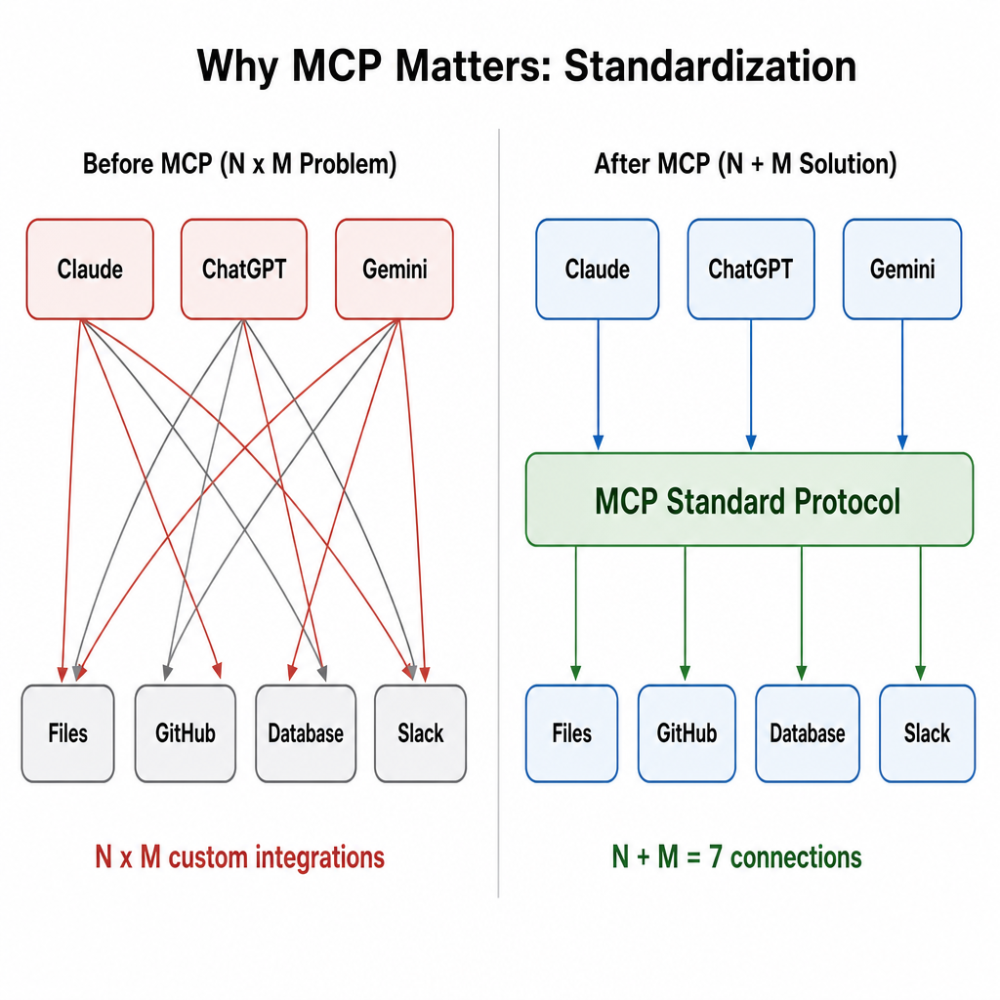
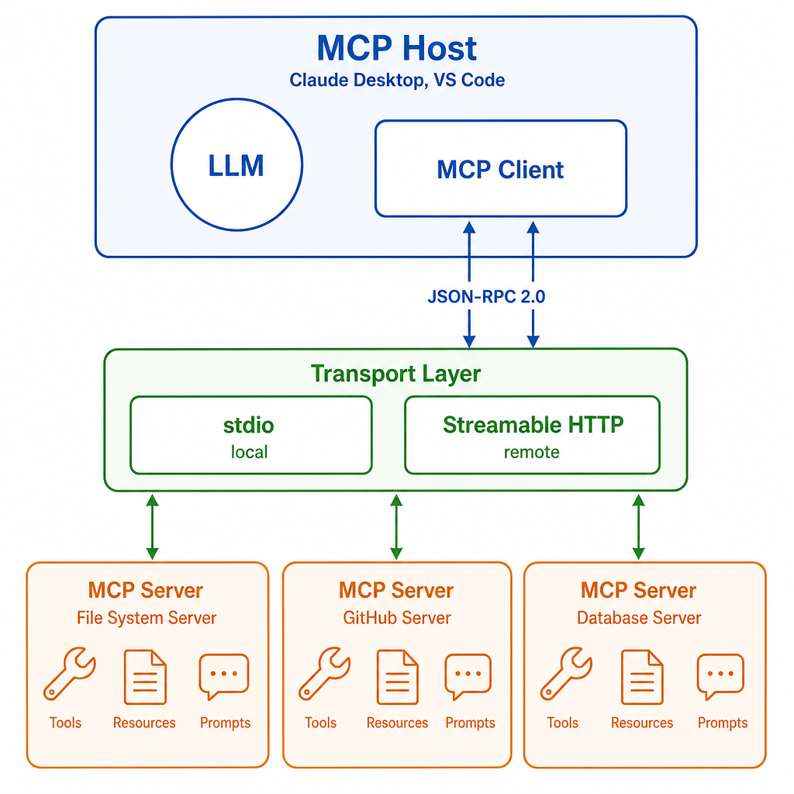
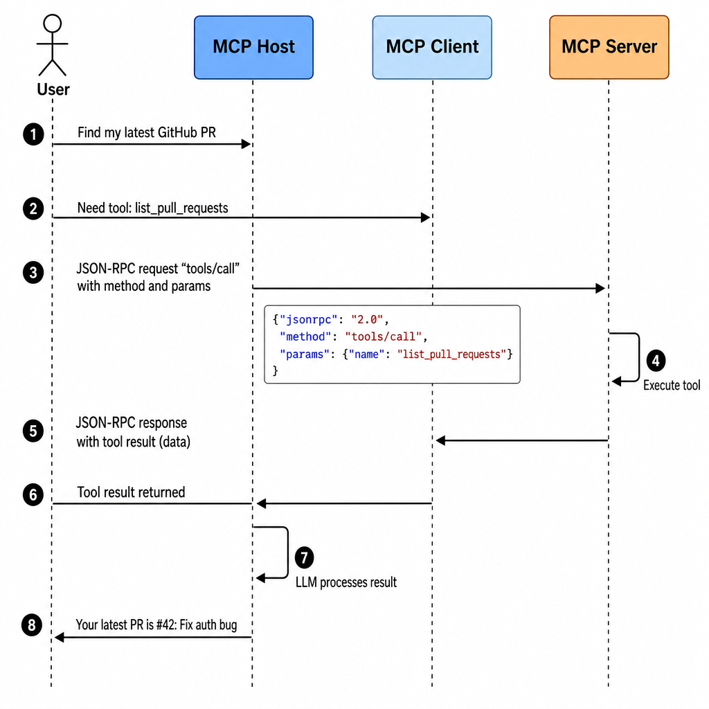
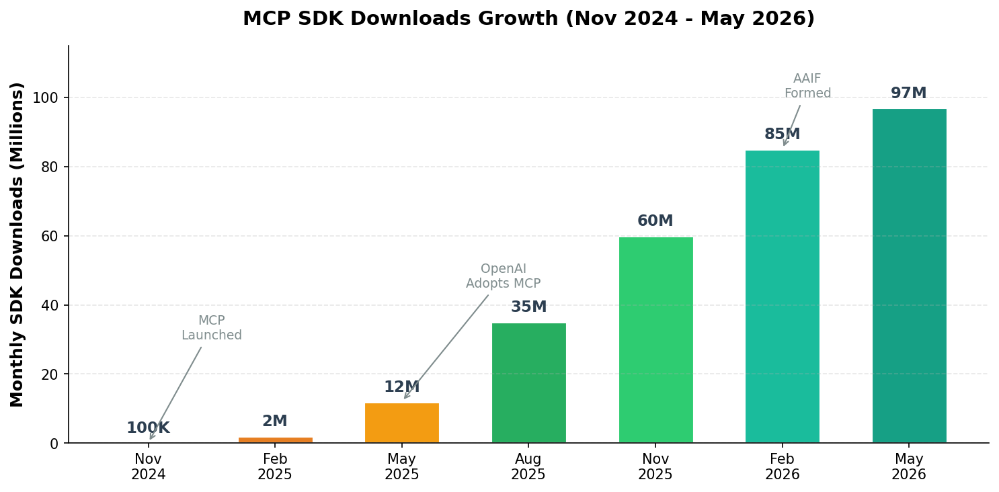

# Day 38: MCP（模型上下文协议）—— AI 世界的 USB-C 标准

> **核心问题**：如何让每一个 AI 助手都能连接每一个数据源和工具，而不需要写 N×M 个定制化集成？

---

## 开篇

想象一下，如果每个 USB 设备都需要为每台笔记本设计一个专属插头。你的鼠标得有一个 Dell 专用插头、一个 MacBook 专用插头、再有一个 ThinkPad 专用插头。这就是 USB-C 出现之前的世界——然后 USB-C 说：*一个接口，所有设备*。

这正是 2024 年 11 月之前 AI 行业面临的困境。每个 AI 助手（Claude、ChatGPT、Gemini）都有自己专有的方式连接外部工具和数据源。如果你想让 AI 读取 GitHub、查询数据库、搜索 Slack，你得写三个独立的集成——换成另一个 AI 助手还得重写。

**模型上下文协议（Model Context Protocol，MCP）** 就是 AI 领域的 USB-C。它是由 Anthropic 在 2024 年 11 月推出的开放标准，定义了 AI 应用连接外部系统的*统一方式*。18 个月内，它从一个实验性协议变成行业标准，获得了 Anthropic、OpenAI、Google、Microsoft 的支持——到 2026 年 5 月，SDK 月下载量超过 9700 万次。

这篇文章，我们拆解 MCP 的底层机制、它为什么能迅速普及，以及对 AI 开发者意味着什么。

---

## 1. MCP 解决的问题

### 直觉：排插类比

把 MCP 想象成一个万能排插。没有排插之前，5 个设备、2 个插座，你得不停地拔了插、插了拔。排插给你一个标准化接口——什么都能插，插上就能用。

MCP 出现之前，AI 生态系统面临 **N × M 集成问题**：

- **N** 个 AI 助手（Claude、ChatGPT、Gemini、Copilot 等）
- **M** 个数据源和工具（GitHub、Slack、数据库、文件系统、API 等）
- 每个 AI 助手需要为每个数据源写**定制集成**
- 总共需要 **N × M** 个集成，每增加一个 AI 或数据源，工作量就翻倍

MCP 把这缩减为 **N + M**：每个 AI 助手实现一个 MCP 客户端，每个数据源实现一个 MCP 服务器。协议就是它们之间的标准化接口。


*图 1：MCP 通过提供 AI 助手和数据源之间的标准协议，消除了 N×M 集成问题。*

### 为什么不直接用 REST API？

好问题。REST API 在服务器间通信方面很棒，但在 AI 场景下有三个问题：

1. **没有发现机制**：AI 助手没有标准方式问"你能做什么？"——每个 API 的文档格式都不一样
2. **没有语义上下文**：REST 不携带关于工具*功能*的信息，而且这些信息的格式要能被 LLM 理解
3. **没有统一认证**：每个 API 有自己的认证、限流和错误处理机制

MCP 同时解决了这三个问题：内置能力发现机制，工具使用自然语言注解描述（LLM 能直接解析），最新规范还包含标准化的 OAuth 2.0 流程。

---

## 2. MCP 架构：底层原理

### 直觉：餐厅类比

想象你在餐厅里。你（**Host/宿主**）不会自己进厨房。你告诉服务员（**Client/客户端**）你要什么，服务员用标准的点单格式（**JSON-RPC**）把订单传给厨房（**Server/服务器**），厨房通过服务员把菜送回来。

关键洞察：**你从不直接跟厨房对话**。协议（点单格式）让任何顾客都能在任何厨房点菜，双方都不需要了解对方的内部设置。

### 核心组件

MCP 有四个核心组件：

| 组件 | 角色 | 举例 |
|------|------|------|
| **MCP Host（宿主）** | 用户交互的 AI 应用 | Claude Desktop、VS Code + Copilot、ChatGPT |
| **MCP Client（客户端）** | 内嵌在宿主中，管理与服务器之间的通信 | 宿主应用内的协议处理器 |
| **MCP Server（服务器）** | 向 AI 提供工具、资源和提示词 | GitHub MCP Server、文件系统 MCP Server |
| **Transport（传输层）** | 客户端与服务器之间的通信层 | stdio（本地）或 Streamable HTTP（远程） |


*图 2：MCP 架构。宿主应用同时包含 LLM 和 MCP 客户端，后者通过标准传输层与一个或多个 MCP 服务器通信。*

### 三种原语

每个 MCP 服务器可以暴露三种能力：

**1. Tools（工具）** —— AI 可以调用来执行操作的函数
- 示例：`create_issue`、`search_code`、`send_email`
- 把工具理解为*动词*——AI 可以*做*的事情

**2. Resources（资源）** —— AI 可以读取的数据
- 示例：文件内容、数据库记录、GitHub issue
- 把资源理解为*名词*——AI 可以*读*的东西

**3. Prompts（提示词）** —— 可复用的提示词模板
- 示例："总结这个代码库"，附带预配置的上下文
- 把提示词理解为*菜谱*——预先打包好的指令

### 传输层：stdio vs Streamable HTTP

MCP 定义了两种标准传输机制：

| 传输方式 | 适用场景 | 工作原理 |
|----------|----------|----------|
| **stdio** | 本地开发、桌面应用 | 客户端将服务器作为子进程启动；消息通过 stdin/stdout 传递 |
| **Streamable HTTP** | 远程/生产部署 | 客户端发送 HTTP POST 请求；服务器可通过 Server-Sent Events (SSE) 流式响应 |

#### 直觉：stdio vs HTTP

把 **stdio** 想象成和同一房间的人说话——快、直接、不需要网络。**Streamable HTTP** 像电话——跨距离也能用，但需要拨号音（HTTP），而且可以处理长时间的停顿（SSE 流式传输）。

stdio 传输更简单：客户端启动 MCP 服务器进程，往 stdin 写 JSON-RPC 消息，从 stdout 读响应。非常适合本地工具。

Streamable HTTP 更强大：服务器作为独立 HTTP 服务运行。客户端发送包含 JSON-RPC 消息的 POST 请求，服务器可以返回单个 JSON 响应，也可以通过 SSE 流式返回多条消息。这使远程 MCP 服务器、负载均衡和生产部署成为可能。

---

## 3. 具体示例：工具调用流程

让我们追踪用户问"我最新的 GitHub PR 是什么？"时发生的事情。


*图 3：MCP 工具调用的逐步流程，展示自然语言请求如何转化为结构化的 JSON-RPC 调用并返回。*

底层发生了什么：

**步骤 1 —— 能力发现**

MCP 客户端首次连接服务器时，会发送一个 `initialize` 请求：

```json
{
  "jsonrpc": "2.0",
  "method": "initialize",
  "params": {
    "protocolVersion": "2025-11-25",
    "capabilities": {},
    "clientInfo": {"name": "claude-desktop", "version": "1.0"}
  }
}
```

服务器响应其能力——提供哪些工具、资源和提示词。这就是让 MCP 自描述的**发现**步骤。

**步骤 2 —— 工具列表**

客户端请求可用工具：

```json
{
  "jsonrpc": "2.0",
  "method": "tools/list",
  "id": 1
}
```

服务器返回工具列表，每个工具都有名称、描述和输入参数的 JSON Schema。这些描述专为 **LLM 可读**而设计——模型用它来决定调用哪个工具以及如何调用。

**步骤 3 —— 工具调用**

当 LLM 决定需要 GitHub 数据时，客户端发送：

```json
{
  "jsonrpc": "2.0",
  "method": "tools/call",
  "id": 2,
  "params": {
    "name": "list_pull_requests",
    "arguments": {
      "state": "open",
      "sort": "updated",
      "direction": "desc",
      "per_page": 1
    }
  }
}
```

**步骤 4 —— 响应**

服务器执行工具并返回结构化结果：

```json
{
  "jsonrpc": "2.0",
  "id": 2,
  "result": {
    "content": [
      {
        "type": "text",
        "text": "PR #42: Fix authentication token refresh bug (updated 2 min ago)"
      }
    ]
  }
}
```

LLM 随后将此结果整合到对用户的回复中。

---

## 4. 协议规范：关键技术细节

### JSON-RPC 2.0 基础

MCP 建立在 **JSON-RPC 2.0** 之上，这是一个成熟的远程过程调用协议。这是刻意的设计选择——通过使用已知标准，MCP 避免了重新发明消息编码、错误处理和请求/响应关联的轮子。

每条 MCP 消息都是有效的 JSON-RPC 消息，有三种可能的类型：
- **请求（Requests）**：有 `id`，期望得到响应
- **通知（Notifications）**：没有 `id`，发出即忘
- **响应（Responses）**：对特定请求的回复（包含匹配的 `id`）

集成复杂度的缩减可以用一个简单的公式表达：

$$
\text{MCP 之前: } N \times M \text{ 个集成} \quad \rightarrow \quad \text{MCP 之后: } N + M \text{ 个集成}
$$

对于 4 个 AI 助手和 10 个数据源，就是从 40 个定制集成缩减到 14 个——减少了 65%，而且随着生态扩展，缩减幅度会越来越明显。

### 协议版本管理

MCP 使用基于日期的版本号（如 `2024-11-05`、`2025-11-25`）。当前稳定规范是 **2025-11-25**，在 MCP 一周年时发布。**2026-07-28** 的候选版本于 2026 年 5 月公布，支持无状态操作和扩展框架。

#### 直觉：基于日期的版本号

就像手机上的软件更新日期。MCP 不说"v2.0"或"v3.0"，而是说"2025 年 11 月版"——不含糊，直接告诉你规范是什么时候定稿的。

### 2025-11-25 规范的主要特性

2025 年 11 月版本是一个重要里程碑。以下是最关键的更新：

| 特性 | 功能 | 意义 |
|------|------|------|
| **Streamable HTTP 传输** | 用更简洁的设计替代了旧的 HTTP+SSE | 生产部署、负载均衡 |
| **异步任务（Tasks）** | 服务器可以运行长时间操作而不阻塞 | 数据分析、代码生成 |
| **OAuth 2.0 授权** | 远程服务器的标准认证流程 | 企业安全、多租户访问 |
| **服务器身份标识** | 服务器可以标识自己 | 信任、审计 |
| **扩展框架** | 扩展协议的正式机制 | 创新而不碎片化 |
| **解耦 Schema** | 请求载荷与 RPC 方法定义分离 | 更容易生成 SDK |

### 扩展框架

最具前瞻性的新功能之一是**扩展系统**。MCP 不再把所有功能都塞进核心规范，而是有了正式的扩展机制——服务器和客户端可以协商的可选能力。

第一个官方扩展是 **MCP Apps**（2026 年 1 月发布），它让 MCP 服务器可以直接在聊天窗口中交付交互式 UI 组件——仪表盘、表单、数据可视化。这意味着 MCP 服务器不仅能返回文本数据，还能渲染实时图表或可点击的表单。

---

## 5. 安全考量

MCP 的快速普及超过了安全最佳实践的发展。2026 年 5 月，**NSA 发布了 MCP 部署的官方安全指南**——这明确表明该协议已成为企业级关键基础设施。

### 主要安全风险

| 风险 | 描述 | 缓解措施 |
|------|------|----------|
| **工具投毒** | 恶意 MCP 服务器提供有害的工具描述 | 验证服务器身份；使用白名单 |
| **通过工具的提示注入** | 工具返回结果中包含操控 LLM 的指令 | 清洗工具输出；使用内容边界 |
| **OAuth 重定向窃取** | 攻击者在 OAuth 流程中截获授权码 | 使用 PKCE；严格验证重定向 URI |
| **DNS 重绑定** | 远程网站与本地 MCP 服务器交互 | 验证 `Origin` 头；仅绑定 localhost |
| **权限提升** | 工具获得了超出预期的访问权限 | 最小权限原则；精确限定工具范围 |

#### 直觉：恶意酒保问题

把 MCP 安全想象成给餐厅（宿主）雇酒保（MCP 服务器）。如果你不做背景调查就雇人，酒保可能在酒里掺东西（工具投毒）。或者有顾客递给酒保一张伪造的点单（提示注入）。解决方案：验证你雇了谁（服务器身份），检查每张点单（输入验证），限制酒保能接触的东西（最小权限原则）。

---

## 6. 生态系统与普及

### 从实验到行业标准


*图 4：MCP SDK 下载量从发布时的 10 万增长到 2026 年 5 月的月均 9700 万以上，受到所有主要 AI 提供商采用的推动。*

增长曲线非常惊人：

| 里程碑 | 日期 | 意义 |
|--------|------|------|
| MCP 发布 | 2024 年 11 月 | Anthropic 开源该协议 |
| OpenAI 接入 MCP | 2025 年 9 月 | 最大竞争对手采用该标准 |
| MCP Registry 上线 | 2025 年 9 月 | 发现 MCP 服务器的中心索引 |
| 规范 2025-11-25 | 2025 年 11 月 | 包含生产级功能的重要规范更新 |
| MCP Apps 发布 | 2026 年 1 月 | 交互式 UI 作为官方扩展 |
| 捐赠给 Linux Foundation | 2026 年 3 月 | 成立 AAIF，由 Anthropic、Block、OpenAI 共建 |
| NSA 安全指南 | 2026 年 5 月 | 政府层面的企业重要性认可 |
| 规范 2026-07-28 RC | 2026 年 7 月 | 无状态操作、扩展框架、生命周期管理 |

### 谁在用 MCP？

到 2026 年中，MCP 已经嵌入 AI 行业的生产环境：

- **ChatGPT**（OpenAI）：2025 年 9 月起支持 MCP 第三方工具访问
- **Claude Desktop**（Anthropic）：超过 75 个基于 MCP 的连接器
- **VS Code / Copilot**（Microsoft）：MCP 用于代码智能和项目上下文
- **Gemini**（Google）：MCP 集成用于工具连接
- **Replit、Cursor、Sourcegraph**：基于 MCP 上下文的 AI 编程助手
- **企业级**：Databricks、Stripe、Notion、Bloomberg——都在发布 MCP 服务器

### MCP Registry

[MCP Registry](https://github.com/modelcontextprotocol/registry) 是发现可用 MCP 服务器的中心索引。2025 年 9 月上线后，几个月内就从初始批次增长了 407%，达到近 2000 个条目。主要条目包括：

- [GitHub MCP Server](https://github.com/github/github-mcp-server) — 自动化工程工作流
- [Stripe MCP Server](https://docs.stripe.com/mcp) — 支付处理
- [Notion MCP Server](https://github.com/makenotion/notion-mcp-server) — 笔记管理
- [Hugging Face MCP Server](https://github.com/huggingface/hf-mcp-server) — 模型和数据集搜索

---

## 7. 构建你的第一个 MCP 服务器

来看看用官方 Python SDK 创建一个 MCP 服务器有多简单：

```python
from mcp.server.fastmcp import FastMCP

# 创建 MCP 服务器
mcp = FastMCP("my-tools")

# 定义一个工具——任何 MCP 客户端都能发现并使用它
@mcp.tool()
def get_weather(city: str) -> str:
    """获取城市的当前天气。
    
    Args:
        city: 城市名，如 "Singapore"
    
    Returns:
        天气摘要字符串
    """
    # 实际中，这里会调用真正的天气 API
    return f"Weather in {city}: 28°C, partly cloudy"

# 定义一个资源——只读数据
@mcp.resource("config://app-settings")
def get_settings() -> str:
    """返回应用设置作为资源。"""
    return '{"theme": "dark", "language": "en"}'

# 定义一个提示词模板
@mcp.prompt()
def summarize_code(code: str) -> str:
    """生成代码摘要的提示词。"""
    return f"请总结以下代码并解释其用途：\n\n{code}"

# 使用 stdio 传输运行服务器（本地开发）
if __name__ == "__main__":
    mcp.run()
```

非常简洁。用几个装饰器，你就创建了一个任何 MCP 兼容 AI 助手都能发现和使用的 MCP 服务器。`FastMCP` 类自动处理 JSON-RPC 消息路由、能力广播和传输协商。

---

## 8. 常见误解

### ❌ "MCP 只是一个 API 框架"

不是。MCP 是**协议**，不是框架。区别很重要：协议定义双方*如何通信*，框架定义*你如何写代码*。MCP 不关心你用 Python、TypeScript、Rust 还是 Go 构建服务器——它只关心消息遵循 JSON-RPC 2.0 格式和 MCP 方法定义。

### ❌ "MCP 只适用于 Anthropic/Claude"

MCP 由 Anthropic 创建，但现在由 Linux Foundation 下的 **Agentic AI Foundation (AAIF)** 管理，由 Anthropic、Block 和 OpenAI 共同发起，并获得 Google、Microsoft、AWS、Cloudflare 和 Bloomberg 的支持。每个主要 AI 提供商都已采用。

### ❌ "MCP 取代 REST API"

MCP 是 REST 的补充，不是替代。MCP 服务器内部通常封装 REST API——MCP 服务器充当翻译层，让 REST 端点变得可发现、可被 LLM 理解。把 MCP 想象为*接口*，REST 是一种可能的*实现*。

---

## 9. 2026 年路线图：下一步

MCP 社区规划了 2026 年的四个优先方向：

| 优先方向 | 目标 | 状态 |
|----------|------|------|
| **传输层演进** | 无状态操作、水平扩展、`.well-known` 发现 | 进行中（2026-07-28 RC） |
| **Agent 通信** | 任务生命周期管理（重试、过期） | 实验性 |
| **治理成熟** | 将 SEP 审查委托给工作组 | 活跃中 |
| **企业就绪** | 审计日志、SSO、网关行为、配置可移植性 | 社区驱动 |

即将发布的 2026-07-28 规范候选版本尤其重要：它让 MCP 变成**无状态的**，意味着服务器可以在标准 HTTP 基础设施上运行而不需要维护会话状态——这是大规模生产部署的前提条件。

---

## 10. 延伸阅读

### 官方资源
1. [MCP 规范 (2025-11-25)](https://modelcontextprotocol.io/specification/2025-11-25) — 标准规范文档
2. [MCP 文档](https://modelcontextprotocol.io/) — 官方文档、教程和 SDK 参考
3. [MCP GitHub 仓库](https://github.com/modelcontextprotocol/modelcontextprotocol) — 规范、问题和贡献

### 博客和深度分析
4. ["One Year of MCP: November 2025 Spec Release"](https://blog.modelcontextprotocol.io/posts/2025-11-25-first-mcp-anniversary/) — 官方回顾和规范变更日志
5. ["The 2026 MCP Roadmap"](https://blog.modelcontextprotocol.io/posts/2026-mcp-roadmap/) — 优先方向和工作组结构
6. ["Why the Model Context Protocol Won" — The New Stack](https://thenewstack.io/why-the-model-context-protocol-won/) — MCP 成功的行业分析

### 安全
7. [NSA MCP 安全指南（2026 年 5 月）](https://www.nsa.gov/Portals/75/documents/Cybersecurity/CSI_MCP_SECURITY.pdf) — 官方政府安全建议
8. [MCP 安全最佳实践](https://modelcontextprotocol.io/docs/tutorials/security/security_best_practices) — 社区维护的安全指南

### 重要公告
9. [Anthropic 将 MCP 捐赠给 Linux Foundation](https://www.anthropic.com/news/donating-the-model-context-protocol-and-establishing-of-the-agentic-ai-foundation) — AAIF 成立
10. [MCP Apps 正式发布（2026 年 1 月）](https://modelcontextprotocol.info/blog/mcp-apps-ui-capabilities/) — 交互式 UI 扩展

---

## 思考题

1. **为什么 MCP 能在许多 AI 标准化尝试失败的情况下成功？** 考虑时机、简洁性和竞争格局的作用。
2. **如果 MCP 让任何 AI 都能轻松连接任何工具，大规模下会出现什么新的安全风险？** 思考"一个标准 = 一个攻击面"的问题。
3. **MCP 的扩展框架如何平衡创新速度和碎片化风险？** 对比 Web 标准的演进方式（CSS 前缀、WebGL 扩展）。

---

## 总结

| 概念 | 一句话解释 |
|------|-----------|
| **MCP** | 标准化 AI 应用连接外部工具和数据的开放协议 |
| **MCP Host（宿主）** | 用户交互的 AI 应用（如 Claude Desktop、VS Code） |
| **MCP Client（客户端）** | 宿主内部的协议处理器，管理服务器连接 |
| **MCP Server（服务器）** | 向 AI 应用暴露工具、资源和提示词的服务 |
| **Tools（工具）** | 可调用的函数——AI 可以*做*的事（如创建 GitHub issue） |
| **Resources（资源）** | 可读的数据——AI 可以*读*的东西（如文件内容） |
| **Prompts（提示词）** | 可复用的提示词模板——预先打包好的指令 |
| **stdio 传输** | 通过 stdin/stdout 的本地通信（客户端将服务器作为子进程启动） |
| **Streamable HTTP** | 通过 HTTP POST + SSE 流式传输的远程通信 |
| **JSON-RPC 2.0** | MCP 所基于的消息编码格式 |
| **MCP Registry** | 发现可用 MCP 服务器的中心索引 |
| **AAIF** | Agentic AI Foundation——管理 MCP 的 Linux Foundation 机构 |
| **MCP Apps** | 支持在聊天窗口内展示交互式 UI 的官方扩展 |
| **SEPs** | 规范增强提案——社区推动 MCP 演进的方式 |

**核心要点**：MCP 用一个建立在 JSON-RPC 2.0 上的简洁优雅的协议，解决了 AI 行业的 N×M 集成问题。它的快速普及——从发布到 18 个月内月 SDK 下载量达到 9700 万以上，所有主要 AI 提供商都已接入——使其成为 AI 连接真实世界的事实标准。理解 MCP 现在是任何构建 AI 应用的人的必备知识。

---

*Day 38 of 60 | LLM Fundamentals*
*Word count: ~2800 | Reading time: ~14 minutes*
