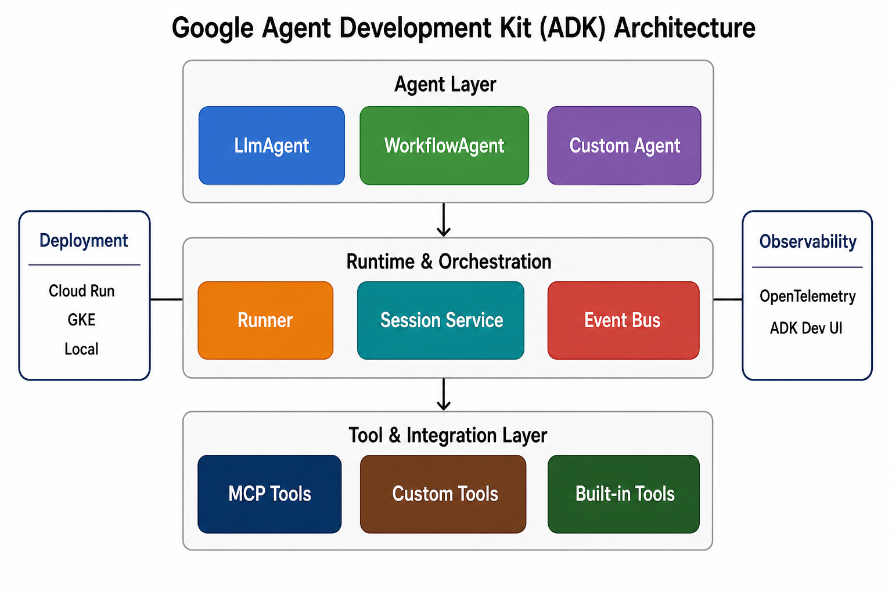
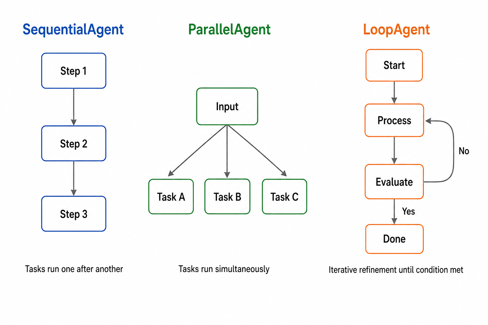
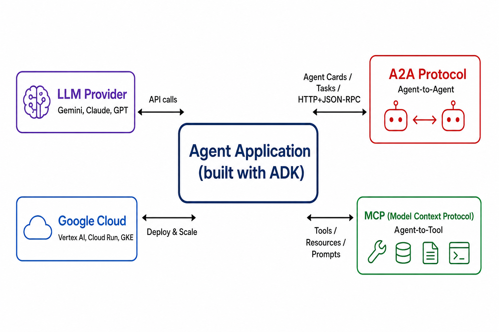
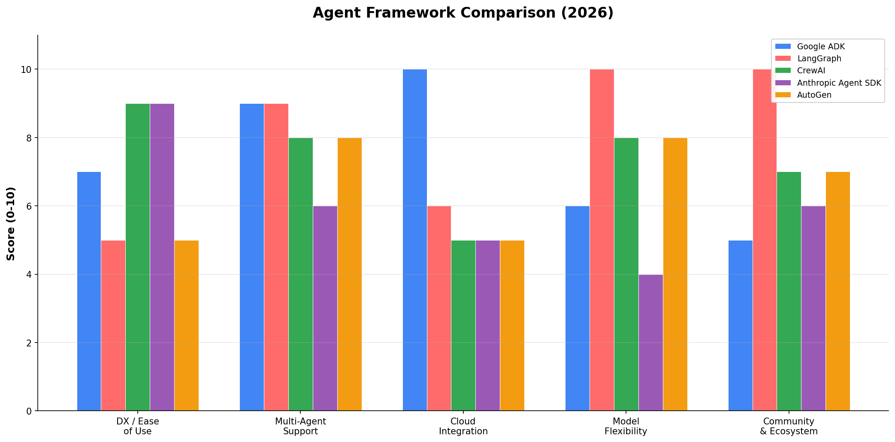

# Day 39: Google ADK — Agent Development Kit

> **核心问题**: Google 的 Agent Development Kit 是什么？它为什么正在成为构建生产级 AI Agent 的一流框架？

---

## 开篇

想象你在开一家餐厅。你可以自己去买原木、打铁做钉子、手雕每把椅子——也可以租一间已经配备好的商用厨房：标准化操作台、预装好的水管、符合卫生规范的通风系统。这就是从零拼装 Agent 和使用 Google ADK 之间的区别。

2025 年之前，如果你想构建一个 AI Agent——能推理、调工具、维护记忆、也许还能和其他 Agent 协作——你本质上就是个木匠。你把 LangChain 的 chain 粘在一起，手写编排循环，手动管理 session 状态，祈祷错误处理够用。能用，但每个项目都在重复造同样的管道。

2025 年 4 月，Google 开源了 Agent Development Kit（ADK），提出了一个不同的方案：如果框架帮你搞定基础设施——会话、事件、工具、部署、可观测性——你只需要专注 Agent *做什么*？

到 2026 年 5 月，ADK 经历了快速迭代，Python 版本已升级到 2.0，增加了 Java、Go、Kotlin 和 Android 支持，并引入了基于图的 Workflow Runtime，直接对标 LangGraph。让我们看看它是什么、怎么运作、以及它在 Agent 框架生态中的位置。

---

## 1. 什么是 Google ADK？

### 直觉：Agent 的操作系统

把 ADK 想象成专为 AI Agent 设计的操作系统。就像你笔记本电脑的操作系统管理进程、内存、文件系统访问和进程间通信，你不需要写底层代码——ADK 管理 Agent 的生命周期、工具调用、会话状态、Agent 间通信和部署，你不用自己把这些全部手搓。

你写"应用"（Agent 做什么），ADK 提供"内核"（让它可靠运行的一切）。

### 关键事实

Google ADK 是一个**开源的、代码优先的、事件驱动的框架**，用于构建、评估和部署 AI Agent。2025 年 4 月首次发布，2026 年 5 月 19 日 **ADK Python 2.0 正式发布（GA）**（[GitHub: google/adk-python](https://github.com/google/adk-python)）。

核心设计原则：
- **代码优先**：你写 Python（或 Java、Go、Kotlin），不是 YAML 或可视化拖拽
- **事件驱动**：所有操作——工具调用、状态变更、Agent 切换——都通过事件流传递
- **模型灵活**：针对 Gemini 优化，但通过 Vertex AI Model Garden 支持 200+ 模型，通过 LiteLLM 支持其他模型
- **生产就绪**：内置 OpenTelemetry、评估框架、一行命令部署到 Cloud Run


*图 1：ADK 的分层架构。Agent 在顶层，运行时在中间负责编排执行，工具和集成在底层。*

### 架构分层

ADK 分为三层清晰的结构：

| 层级 | 组件 | 职责 |
|------|------|------|
| **Agent 层** | LlmAgent、WorkflowAgent、Custom Agent | 定义 Agent *做什么*、怎么推理 |
| **运行时与编排层** | Runner、Session Service、Event Bus | 管理 Agent *如何*执行、持久化状态、流式事件 |
| **工具与集成层** | MCP Tools、Custom Tools、Built-in Tools | 连接 Agent 和外部世界 |

两个横切关注点贯穿所有层：
- **部署**：Cloud Run、Google Kubernetes Engine（GKE）或本地执行
- **可观测性**：OpenTelemetry 链路追踪、ADK Dev UI 实时调试

---

## 2. 三种 Agent 类型

### 直觉：三种工人

想象你在管理一个项目团队。有时候你需要一个**专家**——一个人负责对话和做决策（LlmAgent）。有时候你需要一条**流水线**——一串工人，每人做一步然后把结果传给下一个人（SequentialAgent）。有时候你需要一个**突击队**——多人同时解决同一个问题的不同部分（ParallelAgent）。

Google ADK 给你恰好这些模式，外加一个 LoopAgent 用于迭代优化。

### 2.1 LlmAgent — 对话核心

`LlmAgent` 是主力。它把 LLM 包装上指令、工具和可选的子 Agent：

```python
from google.adk import Agent

research_agent = Agent(
    name="research_agent",
    model="gemini-2.5-flash",
    instruction="""你是一个研究助手。
    使用搜索工具查找信息，提供有引用的准确回答。""",
    tools=[google_search, arxiv_lookup],
)
```

当你调用 `agent.run()` 时，ADK 会：
1. 把用户消息 + 指令 + 工具定义发给 LLM
2. 如果 LLM 请求工具调用，ADK 执行它并将结果反馈回去
3. 重复直到 LLM 产生最终响应
4. 通过事件总线流式传递所有中间事件（工具调用、推理过程、部分输出）

#### 直觉：带着名片夹的经理

LlmAgent 就像一个资深经理，有一大本专家名片夹（工具）。有人提问时，经理会思考是自己直接回答还是需要找专家。如果找了专家，等结果回来，再综合成回复。

### 2.2 Workflow Agent — 结构化编排

ADK 2.0 引入了 **Workflow API**，一个基于图的执行引擎，让你可以组合确定性的执行流。三种内置 workflow agent 是：


*图 2：ADK 的三种工作流原语。Sequential 顺序执行，Parallel 并发执行，Loop 迭代优化。*

**SequentialAgent** — 依次运行子 Agent，将结果向后传递：

```python
from google.adk import Agent, Workflow

# 定义各个 Agent
extract_agent = Agent(name="extract", instruction="从文本中提取关键实体。")
analyze_agent = Agent(name="analyze", instruction="分析提取出的实体之间的关系。")
summarize_agent = Agent(name="summarize", instruction="基于分析结果写一个简洁的总结。")

# 组合成顺序工作流
pipeline = Workflow(
    name="document_pipeline",
    edges=[("START", extract_agent, analyze_agent, summarize_agent)],
)
```

**ParallelAgent** — 同时运行子 Agent，适用于任务之间互不依赖的场景：

```python
parallel_check = Workflow(
    name="parallel_verification",
    edges=[
        ("START", [fact_check_agent, grammar_check_agent, tone_check_agent]),
        ([fact_check_agent, grammar_check_agent, tone_check_agent], "END"),
    ],
)
```

**LoopAgent** — 迭代运行子 Agent 直到满足条件，非常适合自我修正和优化：

```python
refinement_loop = Workflow(
    name="code_review_loop",
    edges=[("START", write_code, review_code)],
    # 如果 review 发现问题就继续循环
    loop_until=lambda state: state.get("review_passed") == True,
)
```

### 2.3 Task API — Agent 间委托

ADK 2.0 还引入了 **Task API**，实现 Agent 之间的结构化委托。这不同于 workflow——它是关于一个 Agent 把工作*托付*给另一个 Agent，而不是预定义流程。

```python
# 一个协调者向专家们委托任务
coordinator = Agent(
    name="coordinator",
    model="gemini-2.5-flash",
    instruction="将任务委托给合适的专家。",
    sub_agents=[code_agent, math_agent, writing_agent],
)
```

Task API 支持三种委托模式：

| 模式 | 行为 | 类比 |
|------|------|------|
| **Chat** | 与子 Agent 完整对话，手动返回 | "把电话转给专家" |
| **Task** | 目标导向执行，完成后自动返回 | "让专家处理这个并汇报" |
| **Singleton** | 持久 Agent，跨轮次维护上下文 | "你的专属客户经理" |

---

## 3. 全局视角：A2A、MCP 与 Agent 生态系统

Google ADK 不是孤立存在的。它是 Google 为 Agentic Web 构建的三协议栈的一部分：


*图 3：ADK 在中心，连接 LLM（推理）、MCP（工具）、A2A（其他 Agent）和 Google Cloud（部署）。*

### 3.1 MCP — Agent 与工具的通信

**Model Context Protocol（MCP）**，我们在 [Day 38](day38-mcp-model-context-protocol.md) 已经讲过，是 Agent 连接外部工具和数据源的方式。ADK 有**原生 MCP 支持**——你可以接入任何 MCP 兼容的工具服务器，Agent 就能直接使用这些工具。

这一点很重要。在 MCP 之前，每个框架都有自己的工具集成格式。有了 MCP，工具构建一次就能在所有 MCP 兼容的 Agent 框架中使用。

### 3.2 A2A — Agent 与 Agent 的通信

**Agent2Agent Protocol（A2A）** 由 Google 于 2025 年 4 月发布（[Google Developers Blog](https://developers.googleblog.com/en/a2a-a-new-era-of-agent-interoperability/)），是一个用于 Agent 间通信的开放协议。它定义了：

- **Agent Card**：JSON 格式，声明一个 Agent 能做什么
- **Task**：Agent 之间交换的工作单元
- **传输层**：HTTP + Server-Sent Events（SSE）+ JSON-RPC 2.0

#### 直觉：通用翻译器

A2A 就像 Agent 之间的通用翻译器。想象一个法国厨师和一个日本工程师需要合作项目。他们不说对方的语言，但如果都会英语作为通用语，就能一起工作。A2A 就是 AI Agent 的通用语——不管 Agent 是用 ADK、LangGraph 还是其他框架构建的。

ADK 2.0 有**原生 A2A 支持**，意味着一个 ADK Agent 可以发现并与任何 A2A 兼容的 Agent 通信，即使对方运行在不同服务器上、用不同框架构建。

### 3.3 三协议栈

| 协议 | 作用域 | 类比 |
|------|--------|------|
| **MCP** | Agent → 工具 | USB 接口（连接外设） |
| **A2A** | Agent → Agent | HTTP/API（连接服务） |
| **ADK** | Agent 生命周期 | 操作系统（管理一切） |

三者共同构成了完整的生态系统：ADK 构建和运行 Agent，MCP 连接工具，A2A 让它们互相协作。

---

## 4. 多语言支持与端侧 Agent

ADK 的一个显著特征是多语言 SDK 策略。截至 2026 年 5 月：

| SDK | 状态 | 最佳场景 |
|-----|------|----------|
| **Python** | v2.1.0（GA） | 通用 Agent 开发，功能最全 |
| **Java** | v1.0.0（GA） | 企业后端集成 |
| **Go** | v1.0.0（GA） | 高性能、高并发服务 |
| **Kotlin** | v0.1.0（预览） | Android 应用开发，云+端混合 |
| **Android** | v0.1.0（预览） | 端侧 Agent，使用 Gemini Nano |

#### 直觉：一次编写，到处部署（差不多）

ADK 的多语言策略就像 Web 框架存在于多种语言中一样。Express.js（Node）、Flask（Python）和 Gin（Go）解决同一个问题，只是用你团队已经在用的语言。ADK 对 Agent 做了同样的事。

### 端侧 Agent：边缘计算的新机会

**ADK for Android** 在 Google I/O 2026 上发布（[Google Developers Blog, 2026 年 5 月 21 日](https://developers.googleblog.com/adk-kotlin-android-building-ai-agents/)），特别值得关注。它实现了**混合编排**：一个云端的编排 Agent 可以把特定子任务委托给运行 Gemini Nano 的端侧 Agent。

```kotlin
val orchestrator = LlmAgent(
    name = "travel_assistant",
    model = Gemini(apiKey = apiKey, name = "gemini-2.5-flash"),
    instruction = "你是一个旅行助手，帮助用户处理行程。",
    tools = listOf(GetTripDetailsTool(tripId)),
    subAgents = listOf(onDeviceRetrievalAgent, validationAgent),
)
```

为什么重要？隐私敏感操作——比如读取用户的预订确认邮件或解析个人文档——可以完全在设备上完成。云端 Agent 从不看到原始数据，只接收端侧子 Agent 返回的结构化结果。

随着 Gemini Nano 等端侧 LLM（已覆盖 1.4 亿+ Android 设备）的成熟，这种模式会越来越普遍。

---

## 5. 开发者体验：Dev UI 与评估

### 直觉：Agent 的飞行模拟器

构建 Agent 就像驾驶飞机——你需要一个仪表盘实时显示正在发生什么。ADK 的 Dev UI 就是这个仪表盘。

ADK 内置了基于 Web 的开发者工具，提供：

1. **实时执行可视化**：实时查看每个工具调用、模型推理步骤和状态变更
2. **可视化图谱视图**：展示 Agent 架构图，显示哪个 Agent 正在活跃以及原因
3. **结构化追踪视图**：带过滤和搜索的执行日志
4. **会话管理**：查看和恢复历史对话，检查会话状态
5. **人机协作（HITL）**：在关键决策点暂停执行等待人类审批

启动方式：
```bash
adk web path/to/agents_dir
```

### 内置评估框架

ADK 包含评估框架，用于衡量 Agent 性能：

```python
from google.adk.evaluation import AgentEvaluator

evaluator = AgentEvaluator(agent=my_agent)
results = evaluator.evaluate(
    test_cases=[
        {"input": "东京天气怎么样？", "expected_tool": "weather_api"},
        {"input": "预订去巴黎的机票", "expected_tool": "flight_booking"},
    ],
    metrics=["tool_accuracy", "response_quality", "latency"],
)
```

这很重要，因为 Agent 评估确实很难（我们会在 Day 42 详细讲）。框架内置评估意味着你可以为 Agent 建立 CI/CD——在每次部署前自动测试工具调用是否正确、响应是否切题、延迟是否可接受。

---

## 6. 框架对比：ADK 的位置


*图 4：2026 年主流 Agent 框架对比。ADK 在云集成和多 Agent 支持上表现出色；LangGraph 在社区生态和模型灵活性上领先。*

| 框架 | 编排模型 | 模型支持 | 云集成 | 最适合 |
|------|---------|---------|--------|--------|
| **Google ADK** | 层级 Agent 树 + 图工作流 | Gemini 优先，Vertex AI 200+ 模型 | 原生 Google Cloud | Google Cloud 团队，生产级多 Agent |
| **LangGraph** | 带条件边的有向图 | 任意模型（Claude、GPT、开源） | 可插拔（任意云） | 复杂工作流，最大灵活性 |
| **CrewAI** | 基于角色的团队 | 任意模型 | 有限内置 | 快速原型，基于角色的协作 |
| **Anthropic Agent SDK** | 显式移交 | 仅 Claude | Anthropic API | Claude 生态应用 |
| **OpenAI Agents SDK** | 基于移交 | OpenAI 模型 | OpenAI API | OpenAI 生态应用 |

注意：这些框架面向重叠但不同的场景。ADK 的优势是 Google Cloud 上的生产级多 Agent 系统；LangGraph 的优势是最大的灵活性和生态；CrewAI 的优势是简洁和快速原型。它们不是直接的"谁好谁差"——而是针对不同场景的优化。

---

## 7. 实战：一个完整示例

让我们构建一个多 Agent 研究系统，展示 ADK 的核心特性：

```python
from google.adk import Agent, Workflow
from google.adk.tools import google_search, mcp_tool

# 第 1 步：定义专家 Agent
search_agent = Agent(
    name="searcher",
    model="gemini-2.5-flash",
    instruction="搜索信息并返回带来源的原始发现。",
    tools=[google_search],
)

analysis_agent = Agent(
    name="analyst",
    model="gemini-2.5-flash",
    instruction="分析发现，识别模式并评估可信度。",
)

writer_agent = Agent(
    name="writer",
    model="gemini-2.5-flash",
    instruction="基于分析结果写一份清晰、结构良好的研究报告。",
)

# 第 2 步：组合成顺序工作流
research_pipeline = Workflow(
    name="research_system",
    edges=[
        ("START", search_agent),         # 先搜索
        (search_agent, analysis_agent),   # 再分析
        (analysis_agent, writer_agent),   # 再写
        (writer_agent, "END"),
    ],
)

# 第 3 步：运行
result = research_pipeline.run("状态空间模型的最新进展是什么？")
print(result.output)
```

这个例子展示了：
- **三个专家 Agent**，各有明确的单一职责
- 通过 Workflow API 的**顺序组合**
- 阶段间的**自动状态传递**（上一阶段的输出自动成为下一阶段的输入）
- **一条命令部署**：`adk deploy cloud-run research_system`

---

## 8. Agent 编排背后的数学

对于想理解形式化模型的读者：

ADK Agent 可以看作一个状态机。在每一轮，Agent 接收一个观测并产生一个动作：

$$
\begin{aligned}
a_t &= \pi_\theta(s_t, \text{instruction}, \text{tools}) \\
s_{t+1} &= T(s_t, a_t, o_t)
\end{aligned}
$$

其中：
- **a_t** 是第 t 步的动作（工具调用或最终响应）
- **s_t** 是会话状态（对话历史 + 持久化状态）
- **instruction** 是系统提示
- **tools** 是可用的工具定义
- **T** 是转换函数（由 ADK 运行时处理）
- **o_t** 是观测（工具结果或用户输入）

对于 **WorkflowAgent**，编排是一个有向图：

$$
G = (V, E), \quad V = \{v_1, v_2, ..., v_n\}, \quad E \subseteq V \times V
$$

每个顶点 **v_i** 是一个 Agent 或 Python 函数。每条边 **(v_i, v_j)** 代表一个依赖——**v_j** 在 **v_i** 完成后执行。条件边添加一个谓词：

$$
(v_i, v_j, c) \in E_{\text{cond}} \implies \text{当 } c(s) = \text{true} \text{ 时执行 } v_j
$$

运行时根据共享的工作流状态评估条件，实现分支、循环和动态路由。

---

## 9. 常见误解

### ❌ "ADK 只能用 Gemini"

虽然 ADK 针对 Gemini 优化了体验（与 Gemini 2.0/2.5 配合最佳），但它通过 Vertex AI Model Garden 支持 200+ 模型，通过 LiteLLM 集成 Claude、GPT、Mistral 等。你不会被锁定——只是用 Google 模型体验更顺滑。

### ❌ "ADK 就是又一个 LangChain 封装"

ADK 是从头构建的框架，有自己的运行时、事件系统、会话管理和部署管道。它不是 LangChain 的封装。设计哲学上有显著差异：LangChain/LangGraph 优先考虑灵活性和生态广度；ADK 优先考虑有主见的生产就绪性和 Google Cloud 集成。

### ❌ "ADK 只能用于 Google Cloud"

你可以在本地用 `adk run` 运行 ADK Agent，部署到任何 Docker 兼容环境，或使用 Vertex AI 上的 Agent Engine。Google Cloud 是支持最好的部署目标，但不是唯一的。

### ❌ "Workflow 编排跟把流程写进 Skills/Prompt 里没区别"

表面上看起来相似——都是"给 agent 一套规则，让它照着执行"。但本质上有三个关键区别：

**1. 控制权在运行时 vs 编译时。** Skills/Prompt 里的工作流是"编译时确定的"——agent 本质上在"读说明书"，执行深度取决于 LLM 的指令跟随能力。如果中间某步出了意外（API 挂了、返回格式变了），agent 只能靠自己的推理能力去应对。ADK 的 Workflow Agent（SequentialAgent、ParallelAgent、LoopAgent）是**运行时引擎**——不依赖 LLM "记住"该走哪一步，框架强制保证执行顺序。错误处理、超时、重试、状态持久化都是框架内建的。

> 类比：Skills 像"给员工一本手册让他自己照着做"，Workflow 像"流水线上的传送带，到哪一站就做哪一步"。一个靠自觉，一个靠机制。

**2. 状态管理和持久化。** Skills 的"记忆"就是上下文窗口——塞满了就丢，跨会话状态需要你自己想办法。ADK 有 Session Service 管理状态持久化、Event Bus 追踪每一步执行记录、LoopAgent 的迭代状态是框架维护的，工作流可以暂停、恢复、回滚。

**3. 组合性和可扩展性。** 两个 skill 之间的协作靠 agent 自己判断"现在该用哪个 skill"，并行执行需要 agent 自己理解"我可以同时做这两件事"。ADK 的 ParallelAgent 天然支持并发，LoopAgent 支持条件循环，A2A 协议让不同框架构建的 agent 可以互相委托任务。

| 场景 | Skills/Prompt | ADK Workflow |
|------|-------------|-------------|
| 简单单步任务 | ✅ 足够 | 杀鸡用牛刀 |
| 固定 2-3 步流程 | ✅ 可以 | 也行，但可能过重 |
| 多步推理+条件分支 | ⚠️ 靠 LLM 推理，不稳定 | ✅ 框架保证 |
| 需要并行执行 | ❌ | ✅ ParallelAgent |
| 需要迭代+自检 | ⚠️ 靠 prompt engineering | ✅ LoopAgent |
| 需要持久化+可恢复 | ❌ | ✅ Session Service |
| 跨框架/跨服务 agent 协作 | ❌ | ✅ A2A 原生支持 |

**一句话总结**：Skills 是 agent 的"知识"，Workflow 是 agent 的"骨架"。Skills 告诉 agent *怎么想*，Workflow 告诉系统 *怎么执行*。前者依赖 LLM 的推理，后者依赖框架的机制。对简单任务两者看起来一样，但对复杂、多步、需要可靠性的生产场景，差距就从"暗示"变成了"保证"。

---

## 10. 前沿：最新动态与未来方向

### 近期进展（过去 6 个月）

| 日期 | 事件 | 意义 |
|------|------|------|
| **2025 年 12 月** | ADK Java & Go v1.0.0 发布 | Python 之外的多语言扩展 |
| **2026 年 3 月** | ADK Python v1.20+，API 成熟 | API 稳定性，改进的会话管理 |
| **2026 年 4 月** | A2A Protocol 集成到 ADK | 跨框架的原生 Agent 间通信 |
| **2026 年 5 月 15 日** | [ADK Python 2.0 GA](https://github.com/google/adk-python) 发布 | Workflow Runtime、Task API、1.x 的破坏性变更 |
| **2026 年 5 月 18 日** | [ADK Python v2.1.0 发布到 PyPI](https://pypi.org/project/google-adk/) | Bug 修复，改进 Workflow 和 Task API |
| **2026 年 5 月 21 日** | [ADK for Kotlin & Android 0.1.0](https://developers.googleblog.com/adk-kotlin-android-building-ai-agents/) 在 Google I/O 2026 发布 | 端侧 Agent + Gemini Nano，混合云-端编排 |

### 值得关注的方向

1. **ADK Python 2.x 的成熟**：Workflow Runtime 和 Task API 刚刚发布（2026 年 5 月）。随着生产用户的压力测试，预计会快速迭代。
2. **A2A Protocol 的采用**：随着更多框架加入 A2A 支持，跨框架 Agent 互操作的承诺正在变为现实。关注 [A2A GitHub](https://github.com/a2aproject/A2A) 的参考实现。
3. **端侧 Agent**：ADK for Android 还在 v0.1.0，但混合云-端模式——云端编排器向端侧子 Agent 委托隐私敏感任务——可能重塑我们对 Agent 架构的思考方式。
4. **企业级功能**：Google 正在将 ADK 定位为 Google Cloud 上企业 Agent 部署的框架。预计会有更多内置合规性、审计日志和治理功能。

---

## 11. 延伸阅读

### 入门
1. [ADK 官方文档](https://google.github.io/adk-docs/) — 最佳入门资源，包含教程和 API 参考
2. [Google ADK GitHub 仓库](https://github.com/google/adk-python) — 源码、示例和贡献指南
3. [Building Smart in 2026: A Hands-On First Look at Google's ADK](https://dev.to/njericodecraft/building-smart-in-2026-a-hands-on-first-look-at-googles-agent-development-kit-adk-3n0) — 面向初学者的实操教程

### 进阶
1. [The Complete Guide to Google's ADK](https://sidbharath.com/blog/the-complete-guide-to-googles-agent-development-kit-adk/) — 深度架构分析
2. [ADK 2.0: From Chatbots to Collaborative Deterministic AI Workflows](https://dr-arsanjani.medium.com/adk-2-0-from-chatbots-to-collaborative-deterministic-ai-workflows-c8656f3beab4) — Workflow Runtime 深度解析
3. [Multi-Agent Deployment with ADK and GKE](https://medium.com/google-cloud/multi-agent-deployment-with-the-agent-development-kit-adk-gke-gke-mcp-server-and-gemini-cli-f517ea7436db) — 生产部署模式

### 论文与规范
1. ["Agent2Agent Protocol (A2A)" 规范](https://a2a-protocol.org/latest/) — Agent 间通信的开放协议
2. ["Model Context Protocol" 规范](https://modelcontextprotocol.io/) — Agent 与工具通信的标准
3. ["The Agent Framework Wars: Google ADK vs LangGraph vs CrewAI"](https://1337skills.com/blog/2026-04-17-agent-framework-wars-google-adk-langchain-crewai-comparison/) — 2026 年全面对比

---

## 思考题

1. 为什么 Google 为 ADK 选择了*事件驱动*架构，而不是更简单的请求-响应模型？这种架构带来了什么能力？
2. 如果你要构建一个多 Agent 客服系统，你会选择 ADK 的层级 Agent 树还是 LangGraph 的图模型？你会考虑哪些权衡？
3. 混合云-端模式（云端编排器 + 端侧子 Agent）带来了有趣的隐私影响。这种模式使得哪些以前不可能的新应用成为可能？

---

## 总结

| 概念 | 一句话解释 |
|------|-----------|
| **ADK** | Google 开源的 AI Agent 构建、评估和部署框架 |
| **LlmAgent** | 核心类型，将 LLM 包装上工具和指令 |
| **WorkflowAgent** | 基于图的 Agent，按顺序、并行或循环模式编排子 Agent |
| **Task API** | 结构化的 Agent 间委托，支持 chat、task 和 singleton 模式 |
| **Runner** | 执行引擎，管理会话、事件和工具编排 |
| **A2A Protocol** | 跨框架 Agent 间通信的开放标准 |
| **MCP 集成** | 原生支持 Model Context Protocol 工具 |
| **ADK Dev UI** | 内置 Web 工具，用于实时调试、追踪和评估 |
| **端侧 Agent** | ADK for Android 支持 Gemini Nano 的混合云-端编排 |

**核心要点**：Google ADK 代表了 Google 的一个赌注——AI Agent 开发需要像 Web 开发有 Django 或 Rails 那样的、有主见的、生产就绪的框架。它不是最灵活的选项——这方面 LangGraph 胜出——但如果你在 Google 生态内，它提供了从原型到生产最顺畅的路径。真正的故事是三协议栈（ADK + MCP + A2A），它可能定义整个行业如何构建、装备和互联 Agent。

---

*Day 39 of 60 | LLM Fundamentals*
*字数：约 2800 | 阅读时间：约 14 分钟*
