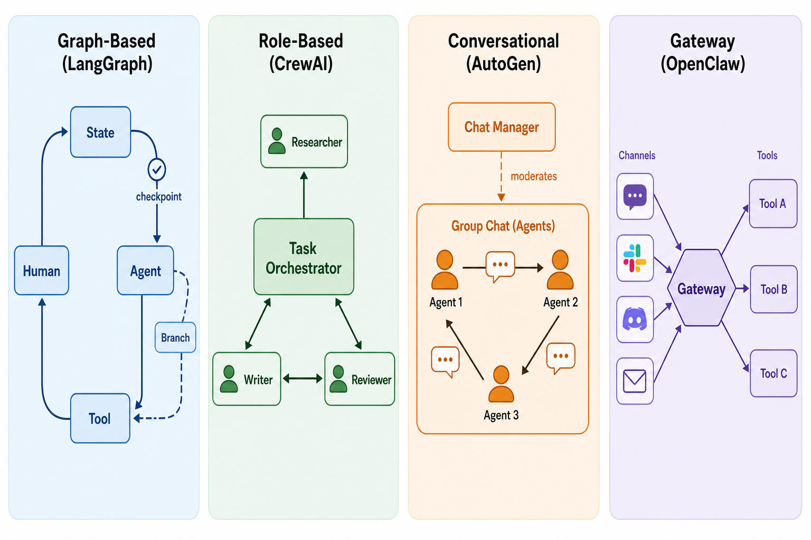

# Day 40: Agent 工具对比 —— 在拥挤的框架生态中找到方向

> **核心问题**：2026 年有几十种 Agent 框架可选，如何为你自己的项目选到合适的——或者至少理解它们为什么都存在？

---

## 开篇

你是一个想构建 AI Agent 的开发者。你在搜索引擎里输入"best AI agent framework 2026"，然后立刻后悔了。LangGraph、CrewAI、AutoGen、OpenClaw、Google ADK、OpenAI Agents SDK、Claude Agent SDK、Semantic Kernel——列表越来越长。每一个都声称自己是最好的。每一个都有不同的架构。似乎没有一个做的事情完全相同。

#### 直觉：五金店的动力工具货架

想象你走进一家五金店，想找"能切割的东西"。你发现了手锯、圆锯、曲线锯、链锯和激光切割机。它们都能切割，但没有人会把链锯和激光切割机放在一起比较然后宣布哪个"更好"。每一种都是为特定的材料、精度级别和规模而设计的。

Agent 框架也是这样。它们都帮你构建 Agent，但针对的是根本不同的使用场景——个人自动化、生产工作流、编码辅助或企业部署。正确的问题不是"哪个最好"，而是"哪个是为我正在做的事情而设计的"。

这篇文章梳理了整个格局，在多个有意义的维度上比较了主要玩家，并给你一个决策框架——而不是一个胜者。

---

## 1. 分类法：Agent 工具的三个层次

在比较具体框架之前，我们需要理解"Agent 框架"是一个被过度使用的术语。这个领域的工具运行在三个不同的抽象层次上。

### 1.1 全栈 Agent 平台

这些是端到端运行 Agent 的完整系统——它们处理模型选择、工具执行、记忆、用户交互和部署，作为一个集成体验。

| 平台 | 来源 | 主要使用场景 | 部署模型 |
|----------|--------|------------------|-----------------|
| **OpenClaw** | 开源（Peter Steinberger, 2025） | 个人 AI 助手，自托管 | 本地机器，自托管 |
| **Google ADK** | Google（2025） | 云原生 Agent 开发 | Google Cloud / Vertex AI |
| **OpenAI Codex** | OpenAI（2025） | 云端编程 Agent | OpenAI 云 |

#### 直觉：全栈 vs. 自己组装

把这些想象成买车还是从零件造车。全栈平台给你一辆开箱即用的车——引擎、方向盘、导航都有。你牺牲了一些自定义空间，但几分钟就能上路，而不是几周。

### 1.2 编排框架

这些提供布线——状态管理、Agent 协调、工作流逻辑——但期望你自带模型、工具和部署基础设施。

| 框架 | 来源 | 核心抽象 | 最适合 |
|-----------|--------|-----------------|----------|
| **LangGraph** | LangChain（2024） | 带状态的有向图 | 复杂有状态工作流 |
| **CrewAI** | CrewAI Inc.（2023） | 基于角色的 Agent 团队 | 快速多 Agent 原型开发 |
| **AutoGen / MAF** | 微软研究院（2023） | 对话式群聊 | 研究和代码执行 |

#### 直觉：骨架

如果全栈平台是汽车，编排框架就是底盘套件——它们给你结构框架和悬挂系统，但引擎、车身面板和油漆由你选择。工作量更大，但自定义空间无限。

### 1.3 模型原生 SDK

这些是来自模型提供商的轻量级官方 SDK。它们以最小的抽象处理 Agent 循环（模型调用 → 工具使用 → 模型调用），针对自家模型进行了优化。

| SDK | 提供商 | 关键特性 |
|-----|----------|-------------|
| **OpenAI Agents SDK** | OpenAI | 原生沙箱执行，交接模式 |
| **Claude Agent SDK** | Anthropic | MCP 集成，内置文件系统工具 |

#### 直觉：引擎

这些就像买一个特定的引擎。它们在自己做的事情上非常出色——用一流的工具支持运行自家模型——但不附带底盘。你需要自己构建工作流逻辑，或者将它们与编排框架结合使用。

> **为什么这个分类法很重要**：将 OpenClaw（全栈平台）直接与 LangGraph（编排框架）比较，就像把一辆特斯拉和一台变速箱放在一起比较。它们是不同产品类别，服务于不同需求。本文剩余部分将在类别内部进行比较，并解释何时选择哪一个。


*图 1：2026 年 Agent 工具的三个层次，从高层平台（上）到底层 SDK（下）。*

---

## 2. 全栈平台：深入解读

### 2.1 OpenClaw —— 自托管的个人 Agent

OpenClaw（[github.com/openclaw/openclaw](https://github.com/openclaw/openclaw)）在 2025 年底以"Clawdbot"的名字出现，2026 年 1 月更名为 OpenClaw。到 2026 年中，它已经拥有超过 35.5 万 GitHub stars 和 320 万活跃用户——可以说是最受欢迎的开源 AI Agent 平台。

**独特之处：**
- **消息优先架构**：作为 Node.js 网关运行，连接 Telegram、Discord、Slack、Signal、iMessage 和 WhatsApp。你可以像给朋友发短信一样跟你的 Agent 聊天。
- **默认自托管**：一切都在本地机器上运行。你的文件、你的数据、你的规则。不依赖云。
- **模型无关**：自带 OpenAI、Anthropic、Gemini、DeepSeek 的 API Key——或通过 Ollama 运行本地模型。
- **技能市场**：截至 2026 年 4 月，"ClawHub"上有超过 4.4 万个社区构建的技能。

**架构**：OpenClaw 作为长期运行的网关服务运行。当消息从任何连接的频道到达时，网关将其路由到一个 Agent 会话，该会话具有持久记忆（以 Markdown 文件存储在磁盘上）、Shell 命令访问权限和可配置的技能库。

**取舍：**
- ✅ 隐私优先，本地运行，生态系统庞大
- ❌ 需要熟悉命令行设置；Shell 访问存在安全考量

### 2.2 Google ADK —— 云原生工具包

Google 的 Agent Development Kit（[adk.dev](https://adk.dev)）于 2025 年底推出，2026 年 5 月达到 2.0 GA 版本。它是 Google Cloud 上构建 Agent 的原生框架。

**独特之处：**
- **原生多模态**：从第一天就为 Gemini 的多模态能力而构建——文本、图像、音频、视频。
- **云原生部署**：一键部署到 Vertex AI Agent Runtime、Cloud Run 或 GKE，具有托管身份验证、追踪和安全功能。
- **A2A + MCP 双协议支持**：原生支持 Google 的 Agent-to-Agent（A2A）协议和 Anthropic 的 Model Context Protocol（MCP）。
- **ADK Go**：Go 语言版本于 2026 年 3 月达到 1.0，扩展到 Python 之外。

**架构**：ADK 提供工作流原语——`SequentialAgent`、`ParallelAgent`、`LoopAgent`——用于组合多 Agent 系统。Task API 支持带人在环检查点的结构化 Agent 间委托。

**取舍：**
- ✅ 深度 Google Cloud 集成，多模态，企业级基础设施
- ❌ 锁定 Google 生态系统；在 GCP 之外用处较小

### 2.3 OpenAI Codex —— 编程 Agent

OpenAI Codex（[openai.com/codex](https://openai.com/codex/)）是一个云端编程 Agent，于 2025 年中推出并快速演进。到 2026 年 5 月，它已集成到 ChatGPT 中，可用作 CLI、桌面应用和 IDE 扩展。

**独特之处：**
- **并行工作树**：Agent 在隔离的 Git worktree 中工作，配合云沙箱环境，可并行完成任务。
- **技能系统**：可通过任务特定的技能扩展，技能打包了指令、资源和脚本。
- **MultiAgentV2**：Codex 环境内的多 Agent 协作配置（2026 年 5 月更新）。
- **Codex Security**：2026 年 3 月引入的专业安全扫描 Agent。

**架构**：Codex 在 OpenAI 的云中运行，配合沙箱环境。用户通过 ChatGPT、CLI 或 IDE 提交任务，Codex 创建隔离的执行环境，具有文件访问和工具使用能力。

**取舍：**
- ✅ 零设置，强大的编程 Agent，并行执行
- ❌ OpenAI 生态系统锁定；主要聚焦于软件开发

---

## 3. 编排框架：深入解读

### 3.1 LangGraph —— 生产级主力

LangGraph（[github.com/langchain-ai/langgraph](https://github.com/langchain-ai/langgraph)）是 LangChain 的 Agent 专用库，围绕图执行模型构建。截至 2026 年，它被认为是生产 Agent 部署的黄金标准。

**独特之处：**
- **带显式状态的有向图**：每个工作流都是一个状态机。节点是函数，边是转换，整个状态在每一步都有检查点。
- **持久执行**：Agent 能在崩溃中存活并从检查点恢复。生产部署使用 PostgreSQL、MongoDB 或 DynamoDB 后端进行状态持久化。
- **人在环**：在任何图节点上内置中断和恢复，支持审批门和手动覆盖。
- **时间旅行调试**：从任何检查点回放 Agent 执行，诊断问题。

**架构**：

```
[开始] → [路由器] → [研究 Agent] → [综合] → [人工审核] → [结束]
                ↓                              ↑
          [网络搜索]              [起草 Writer Agent]
```

每个节点接收完整状态，修改它，然后传递。检查点自动保存。

**取舍：**
- ✅ 最大控制力，生产级可靠性，通过 LangSmith 提供出色的可观测性
- ❌ 学习曲线更陡，样板代码比替代方案多

**生产用户**：截至 2026 年，Uber、LinkedIn、Replit 和 Elastic 都在生产中使用 LangGraph。

### 3.2 CrewAI —— 快速原型工具

CrewAI（[crewai.com](https://crewai.com/)）是一个基于角色的多 Agent 框架，以人类团队动态为模型设计 Agent 协作。

**独特之处：**
- **基于角色的设计**：定义具有角色、目标和背景故事的 Agent。"你是一位擅长寻找学术论文的资深研究员。"
- **Crews + Flows 双层架构**：Crews 用于自主 Agent 团队，Flows 用于使用 Python 装饰器的确定性事件驱动编排。
- **检查点和回放**：在每一步捕获运行时状态，从特定点回放，分叉工作流。
- **A2A 协议支持**：连接不同的 Crew 进行跨系统异步执行。

**架构**：

```python
from crewai import Agent, Task, Crew

researcher = Agent(
    role="Senior Researcher",
    goal="Find comprehensive information about the topic",
    backstory="Expert at academic research and data synthesis",
    tools=[search_tool, web_scraper]
)

writer = Agent(
    role="Technical Writer",
    goal="Write clear, engaging content",
    backstory="Former tech journalist with deep LLM knowledge",
)

crew = Crew(
    agents=[researcher, writer],
    tasks=[research_task, writing_task],
    process=Process.sequential  # 或 hierarchical
)
```

**取舍：**
- ✅ 从想法到可工作的多 Agent 原型最快
- ❌ 比 LangGraph 控制粒度低；抽象对复杂工作流可能有限制

### 3.3 AutoGen / Microsoft Agent Framework —— 研究利器

AutoGen（[github.com/microsoft/autogen](https://github.com/microsoft/autogen)）由微软研究院于 2023 年推出。截至 2026 年初，它正在过渡为 **Microsoft Agent Framework (MAF)**，将 AutoGen 的编排与 Semantic Kernel 的企业稳定性合并。MAF 于 2026 年 2 月达到 Release Candidate 状态。

**独特之处：**
- **对话范式**：Agent 通过群聊中的消息传递进行交互。编排从它们的响应中涌现，而非预先定义。
- **代码执行沙箱**：Agent 可以编写代码，在 Docker 容器中执行，观察结果，然后迭代。
- **事件驱动异步架构**：AutoGen v0.4 引入了完整的异步重新设计，用于并发 Agent 执行。
- **Azure 生态集成**：与 Azure AI 服务深度集成，用于企业部署。

**取舍：**
- ✅ 研究场景强大，代码执行出色，微软生态集成好
- ❌ 架构过渡（AutoGen → MAF）带来迁移不确定性；非微软环境学习曲线更陡

---

## 4. 模型原生 SDK：深入解读

### 4.1 OpenAI Agents SDK

OpenAI Agents SDK（[github.com/openai/openai-agents-python](https://github.com/openai/openai-agents-python)）在 2026 年 4 月收到重大更新，增加了原生沙箱执行。

**关键特性：**
- **沙箱环境**：Agent 在隔离的计算环境（E2B、Modal 或 Daytona）中运行，只访问特定任务所需的文件和代码。
- **交接模式**：内置 Agent 间交接，具有干净的上下文传递。
- **MCP 集成**：对 Model Context Protocol 工具服务器的一流支持。

**何时使用**：你专门在 OpenAI 模型上构建 Agent，想要最简化的路径，抽象开销最小。

### 4.2 Claude Agent SDK

Anthropic 的 Claude Agent SDK（[github.com/anthropics/claude-agent-sdk-python](https://github.com/anthropics/claude-agent-sdk-python)），前身为 Claude Code SDK，于 2026 年初更名，反映了超越编程的更广泛雄心。

**关键特性：**
- **内置工具**：文件系统访问和 Shell 执行开箱即用——样板代码更少。
- **深度 MCP 集成**：以最少的配置连接到 Playwright、Slack 和 GitHub 等 MCP 服务器。
- **钩子事件流**：实时观察 Agent 决策（工具使用、停止事件）。
- **100 万 token 上下文窗口**：通过 API beta 功能支持扩展上下文。

**何时使用**：你正在构建 Anthropic 原生 Agent，想要安全优先的工具使用和 MCP 作为主要集成层。

---

## 5. 架构模式对比


*图 2：Agent 框架使用的四种基本架构模式——基于图、基于角色、对话式和网关。*

下表总结了每种架构模式如何映射到框架选择：

| 模式 | 框架 | 优势 | 劣势 |
|---------|-----------|----------|----------|
| **基于图的状态机** | LangGraph | 精确控制，检查点 | 设置更多，曲线更陡 |
| **基于角色的团队** | CrewAI | 直观，快速原型 | 边缘情况控制较少 |
| **对话式群聊** | AutoGen / MAF | 涌现式协作，代码执行 | 不可预测，更难调试 |
| **消息网关** | OpenClaw | 始终在线，多频道 | 不为批处理工作流设计 |
| **云原生服务** | ADK, Codex | 零基础设施管理 | 供应商锁定 |

---

## 6. 如何选择：决策框架


*图 3：根据项目主要约束导航框架选择的决策树。*

### 第一步：识别你的主导约束

每个项目都有一个最重要的约束。按重要性排序：

1. **原型速度** → CrewAI
2. **生产可靠性** → LangGraph
3. **生态系统集成**（Google、Microsoft、OpenAI）→ ADK / MAF / Codex
4. **隐私和自托管** → OpenClaw
5. **模型原生简洁性** → OpenAI Agents SDK 或 Claude Agent SDK

### 第二步：考虑组合策略

很多生产系统组合使用框架：

| 模式 | 示例 |
|---------|---------|
| OpenClaw + LangGraph | OpenClaw 处理消息，LangGraph 处理复杂工作流 |
| CrewAI + LangGraph | CrewAI 做研究 Agent，LangGraph 做生产编排 |
| Claude Agent SDK + MCP | 用 Claude SDK 构建，通过 MCP 协议集成工具 |
| ADK + A2A | 用 ADK 构建专业 Agent，通过 A2A 协调 |

### 第三步：评估协议层

2026 年，两个协议正在重塑 Agent 互操作性：

- **MCP（Model Context Protocol）**：Anthropic 的工具集成标准。OpenClaw、Claude Agent SDK、OpenAI Agents SDK、ADK 以及越来越多的框架都支持。
- **A2A（Agent-to-Agent Protocol）**：Google 的 Agent 间通信标准。ADK 原生支持，CrewAI 也支持。

如果你的架构需要来自不同提供商的 Agent 协作，协议支持是首要选择标准。

---

## 7. 趋同趋势

2026 年最显著的趋势之一是趋同。框架越来越多地采纳彼此最好的想法：

| 趋势 | 示例 |
|-------|---------|
| 所有人都支持 MCP | OpenClaw、ADK、OpenAI Agents SDK、Claude Agent SDK 都支持 MCP 工具集成 |
| 基于图的编排扩散 | LangGraph 开创了它；CrewAI 和 ADK 现在提供类似的检查点 |
| 沙箱执行标准化 | OpenAI Agents SDK（2026 年 4 月）、Claude Agent SDK 和 ADK 都提供沙箱工具执行 |
| 技能/市场生态 | OpenClaw 的 ClawHub（4.4 万+ 技能）、Codex Skills、Claude Agent Skills |

这种趋同意味着你今天选择的框架比一年前没那么重要了。协议层（MCP、A2A）正在成为真正的差异化因素。

---

## 8. 前沿：最新动态（2026）

| 日期 | 事件 | 意义 |
|------|-------|--------------|
| **2026 年 5 月 19 日** | [Google ADK 2.0 GA 发布](https://adk.dev/2.0/)，包含破坏性 API 变更和 Task API | ADK 作为生产平台成熟 |
| **2026 年 5 月** | [OpenAI Codex MultiAgentV2](https://developers.openai.com/codex/changelog) 配置和 Goal 模式毕业 | Codex 成为多 Agent 编程环境 |
| **2026 年 4 月 15 日** | [OpenAI Agents SDK 沙箱更新](https://openai.com/index/the-next-evolution-of-the-agents-sdk/)，原生沙箱执行和 Harness 架构 | 企业级 Agent 任务隔离 |
| **2026 年 2 月** | [Microsoft Agent Framework RC](https://devblogs.microsoft.com/agent-framework/migrate-your-semantic-kernel-and-autogen-projects-to-microsoft-agent-framework-release-candidate/) 合并 AutoGen + Semantic Kernel | 微软整合其 Agent 战略 |
| **2026 年 3 月** | [OpenClaw 超越 35.5 万 GitHub stars](https://medium.com/data-science-collective/355k-github-stars-in-5-months-17-defense-rate-the-complete-honest-guide-to-openclaw-28d2f59598e1)，320 万活跃用户 | 开源个人 Agent 进入主流 |
| **2026 年 6 月** | [Anthropic 分离 Agent SDK 计费](https://www.anthropic.com/engineering/equipping-agents-for-the-real-world-with-agent-skills)与 Claude 订阅 | 标志着 Agent SDK 成为独立产品线 |


*图 4：2022 年至 2026 年主要 Agent 框架里程碑时间线。*

---

## 9. 常见误解

### ❌ "LangChain 和 LangGraph 是一回事"
LangChain 是一个通用 LLM 应用框架，有 600+ 集成。LangGraph 是其 Agent 专用库，专注于有状态图工作流。你可以在不使用 LangChain 更广泛抽象的情况下使用 LangGraph。

### ❌ "你必须选一个框架然后一直用它"
生产系统越来越多地组合使用框架。常见模式：OpenClaw 处理用户交互，LangGraph 处理复杂工作流，Claude Agent SDK 处理工具执行。MCP 和 A2A 协议使之可互操作。

### ❌ "AutoGen 被放弃了"
AutoGen 正在过渡为 Microsoft Agent Framework (MAF)，将 AutoGen 的编排与 Semantic Kernel 的企业稳定性合并。AutoGen 这个名字正在被淘汰，但技术仍然存续。

### ❌ "框架 X 客观上最好"
框架为不同约束而优化。LangGraph 优化生产可靠性。CrewAI 优化原型速度。OpenClaw 优化个人自主性。没有唯一的最好——只有对你的使用场景来说最好。

---

## 10. 代码示例：同一个任务，三个框架

让我们用三个不同的框架构建一个简单的"研究并总结"Agent，看看抽象层次如何不同。

### LangGraph（显式状态机）

```python
from langgraph.graph import StateGraph, END
from typing import TypedDict

class AgentState(TypedDict):
    topic: str
    research_notes: str
    summary: str

def research_node(state: AgentState) -> AgentState:
    """搜索关于主题的信息"""
    topic = state["topic"]
    notes = search_tool(topic)  # 你的搜索工具
    return {"research_notes": notes}

def summarize_node(state: AgentState) -> AgentState:
    """总结研究笔记"""
    notes = state["research_notes"]
    summary = llm.invoke(f"总结以下笔记: {notes}")
    return {"summary": summary}

# 构建图
graph = StateGraph(AgentState)
graph.add_node("research", research_node)
graph.add_node("summarize", summarize_node)
graph.add_edge("research", "summarize")
graph.add_edge("summarize", END)
graph.set_entry_point("research")

app = graph.compile()
result = app.invoke({"topic": "LLM 中的混合专家模型"})
```

### CrewAI（基于角色的团队）

```python
from crewai import Agent, Task, Crew, Process

researcher = Agent(
    role="Research Analyst",
    goal="Find key information about the given topic",
    backstory="Expert researcher with 10 years of experience",
    tools=[search_tool]
)

writer = Agent(
    role="Technical Writer",
    goal="Create a clear, concise summary",
    backstory="Former tech journalist specializing in AI",
)

research_task = Task(
    description="Research {topic} and compile key findings",
    agent=researcher
)

write_task = Task(
    description="Write a 200-word summary based on the research",
    agent=writer
)

crew = Crew(
    agents=[researcher, writer],
    tasks=[research_task, write_task],
    process=Process.sequential
)

result = crew.kickoff(inputs={"topic": "LLM 中的混合专家模型"})
```

### OpenAI Agents SDK（模型原生）

```python
from openai import Agent, Runner
from openai.tools import web_search

research_agent = Agent(
    name="Research Agent",
    instructions="Research the given topic and provide key findings.",
    tools=[web_search],
)

summary_agent = Agent(
    name="Summary Agent",
    instructions="Create a concise 200-word summary of the provided research.",
)

# 交接模式：research → summarize
research_agent.handoffs = [summary_agent]

result = await Runner.run(
    research_agent,
    input="Research and summarize: Mixture of Experts in LLMs"
)
```

注意每个框架如何以不同方式表达同一个工作流：
- **LangGraph**：你显式定义状态模式和控 制流。
- **CrewAI**：你定义角色，让框架自己搞清楚协调。
- **OpenAI Agents SDK**：你定义 Agent 和交接规则，仪式感最少。

---

## 11. 总结

| 框架 | 类型 | 最适合 | 抽象层次 |
|-----------|------|----------|------------------|
| **OpenClaw** | 全栈平台 | 个人 AI，自托管 | 高 |
| **Google ADK** | 全栈平台 | 云原生，多模态 Agent | 高 |
| **OpenAI Codex** | 全栈平台 | 云端编程 Agent | 高 |
| **LangGraph** | 编排 | 生产有状态工作流 | 中 |
| **CrewAI** | 编排 | 快速多 Agent 原型 | 中 |
| **AutoGen / MAF** | 编排 | 研究，代码执行 | 中 |
| **OpenAI Agents SDK** | 模型原生 SDK | OpenAI 原生 Agent | 低 |
| **Claude Agent SDK** | 模型原生 SDK | Anthropic 原生 Agent，MCP | 低 |

**核心要点**：2026 年的 Agent 框架生态已经成熟为不同的类别。不要跨类别比较——在类别内比较。你的主导约束（速度、可靠性、隐私或生态）决定了类别；你的具体需求决定了框架。得益于 MCP 和 A2A 协议，组合使用框架越来越可行。


*图 5：六个维度的说明性对比。这些分数代表一般特征描述，不是基准测试结果。每个框架在其目标领域表现最佳。*

---

## 思考题

1. 如果 MCP 成为工具集成的通用标准，框架特定的工具生态的价值主张会如何变化？
2. 在生产中组合多个框架有哪些风险？你将如何处理跨框架边界的可观测性和调试？
3. 随着模型原生 SDK 添加更多编排功能（沙箱、交接），它们何时会变得等同于编排框架？

---

## 延伸阅读

### 文档
1. [LangGraph 文档](https://langchain-ai.github.io/langgraph/) — 基于图的 Agent 编排
2. [CrewAI 文档](https://docs.crewai.com/) — 基于角色的多 Agent 框架
3. [Google ADK 文档](https://adk.dev/) — Agent Development Kit
4. [OpenAI Codex 文档](https://developers.openai.com/codex/) — 云端编程 Agent
5. [OpenClaw 文档](https://docs.openclaw.ai/) — 自托管个人 AI

### 论文与文章
1. ["AutoGen v0.4: Reimagining the Foundation of Agentic AI"](https://www.microsoft.com/en-us/research/blog/autogen-v0-4-reimagining-the-foundation-of-agentic-ai-for-scale-extensibility-and-robustness/) — 微软研究院，2025 年 11 月
2. ["The Next Evolution of the Agents SDK"](https://openai.com/index/the-next-evolution-of-the-agents-sdk/) — OpenAI，2026 年 4 月
3. ["Equipping Agents for the Real World with Agent Skills"](https://www.anthropic.com/engineering/equipping-agents-for-the-real-world-with-agent-skills) — Anthropic 工程博客

---

*Day 40 of 60 | LLM Fundamentals*
*Word count: ~3100 | Reading time: ~16 minutes*
