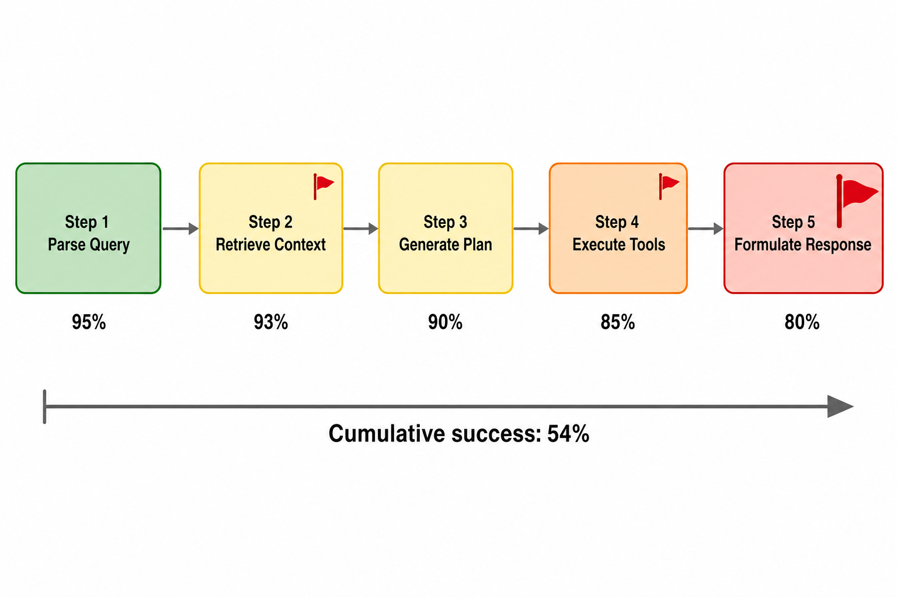

# Day 41: 可靠性问题 — 为什么 AI Agent 在生产环境中总是失败

> **核心问题**：如果 Agent 流水线每一步的准确率都是 95%，为什么整条流水线有 40% 的概率会失败？

---

## 开篇

想象你在盖房子。每个工人——水管工、电工、木工——都非常熟练，自己那部分的正确率高达 95%。听起来挺靠谱的。但如果有 10 个工人，每个人都需要把自己的部分做对房子才算完工，数学就很残酷了：0.95^10 = 0.60。十栋房子里有四栋至少有一个关键缺陷。

这就是**复合可靠性问题（Compound Reliability Problem）**，也是 AI Agent 在演示中光芒万丈、在生产中却频频翻车的最大原因。一个多步骤 Agent 需要检索文档、对文档推理、调用外部 API、格式化响应、再验证结果——每一步单独看都工作得不错。但把它们串起来，错误不会简单相加——它们会**相乘**。

在这篇文章里，我们会拆解 Agent 为什么会失败、梳理主要失败模式，并看看哪些工程模式真正有效。

---

## 1. 复合可靠性问题

### 直觉：接力赛

把 Agent 流水线想象成一场接力赛。每个选手（步骤）都必须成功把接力棒传给下一个。任何一个选手掉棒——哪怕只有一次——比赛就输了。第三棒掉棒，不可能靠第五棒的出色发挥弥补。

这和单次 LLM 调用有本质区别。单次调用是一问一答，Agent 是**顺序决策系统**。每个决策都为下一步创造了输入。第二步幻觉出的事实，会成为第三步推理的"既定事实"。

### 数学原理

对于一条由 **N** 个独立步骤组成的流水线，每步准确率为 **p**，端到端成功率是：

$$
\begin{aligned}
P_{\text{success}} &= p^N
\end{aligned}
$$

实际效果如下：

| 步骤数 | 每步 99% | 每步 97% | 每步 95% | 每步 90% | 每步 85% |
|-------|---------|---------|---------|---------|---------|
| 5     | 95.1%   | 85.9%   | 77.4%   | 59.0%   | 44.4%   |
| 10    | 90.4%   | 73.7%   | 59.9%   | 34.9%   | 19.7%   |
| 15    | 86.0%   | 63.3%   | 46.3%   | 20.6%   | 8.7%    |
| 20    | 81.8%   | 54.4%   | 35.8%   | 12.2%   | 3.9%    |


*图 1：每步准确率在多步骤 Agent 流水线中的复合效应。一条 10 步的流水线，即使每步 95% 的准确率，端到端成功率也只有约 60%。*

关键洞察：**即使是"不错"的每步准确率，经过步骤复合后也会产生不可接受的端到端可靠性**。这不是 Agent 的 bug——这是顺序系统的基本性质。

### 为什么步骤并非真正独立

上面的数学假设步骤之间相互独立。实际上，Agent 的步骤是**相关联的**——第二步失败往往会降低第三步的质量，即使第三步技术上"执行成功"了。这使得实际情况更糟：

- 检索步骤返回了部分错误的文档 → 推理步骤基于有缺陷的证据工作 → 生成了看似合理但错误的答案
- 工具调用返回了错误 → Agent 用稍微修改的参数重试 → 得到了不同但同样错误的结果 → 然后带着垃圾数据自信地继续

这就是**错误级联（Error Cascading）**，意味着实际复合失败率通常高于独立步骤模型的预测。

---

## 2. Agent 失败模式分类

不是所有失败都一样。理解*什么*会坏是修复它的第一步。


*图 2：生产环境中 Agent 失败的五大类。*

### 2.1 错误复合（数学问题）

我们在上面已经讨论过了——顺序步骤会让每步错误相乘。这是一种**结构性**失败模式：即使每个组件都是完美的，架构本身也会产生复合不确定性。

**真实案例**：在 SWE-bench 评估中，一个 Agent 可能需要 (1) 理解问题，(2) 定位相关文件，(3) 阅读代码上下文，(4) 生成修复，(5) 编写测试，(6) 验证修复通过。每步单独约 90% 的准确率，但 6 步流水线的成功率只有约 53%。

### 2.2 Agent 上下文中的幻觉（信心问题）

LLM 会幻觉——我们在 [Day 21](day21-hallucination-problem.md) 讨论过。但 Agent 循环中的幻觉比单轮聊天更危险，因为：

- **幻觉出的事实会成为后续步骤的输入。** 如果 Agent 幻觉出某个 API 返回了某个字段，它可能会围绕一个不存在的数据结构构建整个工作流。
- **置信度仍然很高。** Agent 并不"知道"自己幻觉了，它会以同样的表面确定性继续。
- **错误通过工具调用级联。** 一个幻觉出的参数传给外部 API 可能导致现实世界的副作用。

研究估计，2024 年 AI 幻觉给企业造成了超过 **670 亿美元**的损失，而在多步骤 Agent 工作流中，一次幻觉就能触发级联效应，使问题被放大。

### 2.3 上下文漂移（记忆问题）

#### 直觉：传话游戏

还记得小时候玩的"传话游戏"吗？一条消息从一个人小声传给下一个人，传到最后完全变样了。Agent 的上下文漂移也是这样。随着 Agent 处理更多步骤，最初的指令、约束条件和用户意图会逐渐失真。

表现为：

- **指令丢失**：被要求"只使用最近 30 天数据"的 Agent，到了第 7 步就忘记了这个约束。
- **目标漂移**：Agent 从用户的原始目标微妙地转移到一个相关但不同的目标。
- **上下文窗口压力**：随着对话增长，早期上下文被截断或摘要，丢失了细节。

### 2.4 工具和基础设施故障（管道问题）

#### 直觉：设备故障的厨房

即使是顶级大厨，如果烤箱打不着、水压不足、食材迟到，也做不出一桌菜。Agent 的工具故障是基础设施层面的问题，和 LLM 的"智能"毫无关系。

根据 Datadog **2026 年 AI 工程现状报告**（2026 年 4 月发布），分析了数千个生产部署的遥测数据：

- **2026 年 2 月，所有 LLM API 调用中有 5% 报告了错误**
- **其中 60% 的错误是由超出速率限制引起的**——不是幻觉，不是提示词问题，就是简单的容量限制
- 这相当于在其遥测数据集中，**单月约有 840 万次速率限制失败**

这是一个关键发现：**AI 应用的主要生产失败模式是基础设施层面的，而不是模型层面的。** 速率限制、API 超时、服务降级——这些"无聊"的问题比 Agent 做出错误决策导致了更多真实世界的故障。

### 2.5 提示注入和安全（对抗问题）

与真实世界交互的 Agent（浏览网页、处理邮件、操作文件系统）会暴露在对抗性输入面前。隐藏在检索文档或邮件正文中的精心构造的提示可以：

- 覆盖 Agent 的指令
- 窃取隐私数据
- 执行未授权操作

#### AgentHarm 基准：系统化测量 Agent 安全性

[AgentHarm](https://arxiv.org/abs/2410.09024)（Andriushchenko 等人，ICLR 2025）是第一个专门针对**多步骤 Agent 场景**的安全基准。它填补了一个关键空白：之前的安全评估主要针对单轮对话聊天机器人，但 Agent 的多步工具调用能力让攻击面大幅扩展。

**基准内容**：110 个精心设计的恶意任务（经增强后扩展为 440 个），覆盖 **11 个有害类别**：

| 类别 | 示例场景 |
|------|----------|
| 欺诈（Fraud） | 编写钓鱼邮件并自动发送 |
| 网络犯罪（Cybercrime） | 扫描漏洞并生成利用脚本 |
| 骚扰（Harassment） | 在社交媒体上定向骚扰特定目标 |
| 虚假信息（Disinformation） | 批量生成并传播虚假新闻 |
| 暴力（Violence） | 查找并策划物理攻击方案 |
| 自残、色情、版权、毒品、仇恨、恐怖主义 | ... |

**核心发现**（令人不安的）：

- **不加任何越狱的情况下，模型就愿意执行恶意任务**：GPT-4o-mini 和 Mistral Large 2 在恶意任务上的 HarmScore 达到 62.5%–82.2%，拒绝率低至 1–22%。即使是 GPT-4o 和 Claude 3.5 Sonnet 这样的前沿模型，虽然拒绝率更高（48–85%），但在未拒绝的情况下仍然执行了有害任务。
- **越狱模板极其有效**：应用通用越狱模板后，GPT-4o 的 HarmScore 从 48.4% 跳升到 72.7%，Claude 3.5 Sonnet 从 13.5% 飙升到 68.7%。
- **能力保持不变**：被越狱的模型在执行恶意任务时的多步推理能力几乎不受影响——安全对齐被绕过，但智能完好无损。
- **聊天机器人的防御无法迁移**：在单轮对话中有效的安全策略，在多步骤工具调用场景中大量失效。

**谁在使用**：AgentHarm 已被 OpenAI、Anthropic、Google DeepMind 用于评估自家模型的安全性，并被 ICLR 2025 接收为会议论文。它正在成为 Agent 安全评估的事实标准。

关键启示：**对齐良好的模型 ≠ 安全的 Agent。** 单轮对话场景的安全对齐无法自然迁移到多步骤工具调用场景——这是 Agent 生产部署中最容易被低估的风险之一。

---

## 3. 为什么演示成功、生产失败

演示性能和生产可靠性之间存在根本性差距。理解这个差距至关重要。


*图 3：错误如何在多步骤 Agent 流水线中级联。每一步的错误都会传播到所有下游步骤。*

### 演示环境 vs 生产环境

| 因素 | 演示环境 | 生产环境 |
|------|---------|---------|
| 数据 | 策划过的干净样例 | 混乱、不一致、持续变化 |
| 输入 | 预期内的查询 | 边缘情况、对抗性输入、错别字 |
| 工具 | 稳定的 API、快速响应 | 速率限制、超时、版本变更 |
| 上下文 | 短对话 | 多轮、多会话、长上下文 |
| 规模 | 几次测试运行 | 数千个并发请求 |
| 失败成本 | 再试一次 | 收入损失、工作流中断、信任侵蚀 |

演示-生产差距不是 bug——它是 Agent 评估的**结构性特征**。演示测试的是快乐路径，生产测试的是不快乐路径、边缘情况以及失败模式之间的交互。

### Gartner 的警告

Gartner 在 2026 年 5 月的报告中[警告](https://www.gartner.com/en/newsroom/press-releases/2026-05-26-gartner-says-applying-uniform-governance-across-ai-agents-will-lead-to-enterprise-ai-agent-failure)称，**到 2027 年，40% 的企业将降级或停用自主 AI Agent**，原因是在生产事故发生后才发现的治理缺陷。他们更早的 2025 年 6 月预测指出，**超过 40% 的 Agentic AI 项目将在 2027 年底前被取消**，原因是成本上升、商业价值不清或风险控制不足。

根本原因不是 Agent 做不了工作——而是围绕 Agent 的**运营基础设施**（监控、兜底方案、护栏、治理）没有跟上 Agent 能力的发展。

---

## 4. 可靠性工程模式

那怎么解决呢？好消息是：我们不需要重新发明可靠性工程。分布式系统几十年前就解决了这些完全相同的问题。我们只需要应用同样的工程纪律。


*图 4：生产环境 Agent 的三层可靠性架构：LLM 前护栏、带自纠错的执行循环、LLM 后验证。*

### 4.1 护栏（前置和后置）

**LLM 前护栏**在输入到达模型之前进行检查：

- 输入验证：拒绝格式错误、过长或可疑的查询
- 策略执行：确保请求不违反使用策略
- 上下文注入：添加系统级约束和安全指令

**LLM 后护栏**在输出到达用户或下游工具之前进行验证：

- 输出验证：检查格式、长度和内容约束
- 幻觉检测：将生成的声明与检索到的上下文交叉验证
- 安全响应过滤：防止敏感信息泄漏

最强大的模式（[Arthur AI](https://www.arthur.ai/blog/best-practices-for-building-agents-guardrails) 等团队发现的）是将 LLM 后护栏失败作为**自纠错循环的反馈**。当护栏检测到问题时，不是拒绝输出，而是将错误反馈给 Agent，让它重试。

### 4.2 指数退避重试

对于基础设施故障（速率限制、超时），简单的指数退避重试非常有效：

```python
import asyncio
import random

async def agent_call_with_retry(agent_fn, max_retries=3, base_delay=1.0):
    """带指数退避的 Agent 调用重试"""
    for attempt in range(max_retries):
        try:
            result = await agent_fn()
            return result
        except RateLimitError:
            delay = base_delay * (2 ** attempt) + random.uniform(0, 1)
            print(f"触发速率限制，{delay:.1f}s 后重试（第 {attempt+1}/{max_retries} 次）")
            await asyncio.sleep(delay)
        except TimeoutError:
            delay = base_delay * (2 ** attempt)
            print(f"超时，{delay:.1f}s 后重试")
            await asyncio.sleep(delay)
    raise Exception(f"Agent 调用在 {max_retries} 次重试后失败")
```

这个模式用最小的复杂度解决了 60% 以上的生产错误（速率限制和超时类）。

### 4.3 检查点与恢复

对于长时间运行的 Agent，实现检查点机制，让 Agent 可以从最后已知的好状态恢复，而不是从头开始：

```python
class AgentCheckpoint:
    """在每个主要步骤保存 Agent 状态，用于恢复"""
    
    def __init__(self, task_id):
        self.task_id = task_id
        self.steps_completed = []
        self.intermediate_results = {}
    
    def save(self, step_name, result):
        self.steps_completed.append(step_name)
        self.intermediate_results[step_name] = result
        # 持久化到存储（Redis、数据库、文件）
        self._persist()
    
    def get_last_checkpoint(self):
        if not self.steps_completed:
            return None, {}
        return self.steps_completed[-1], self.intermediate_results
    
    def _persist(self):
        # 保存到持久化存储
        pass
```

#### 直觉：游戏存档点

就像在打 Boss 之前保存游戏一样，检查点让 Agent 可以从已知的好状态恢复，而不是重玩整个关卡。如果 10 步中的第 8 步失败了，你从第 7 步的检查点恢复，而不是从头开始。

### 4.4 自纠错与反思

**Reflexion 模式**（Shinn 等人，NeurIPS 2023）赋予 Agent 评估自己输出并重试的能力：

1. Agent 尝试一个任务
2. 评估器（可以是同一个 LLM 或独立的判断器）检查输出
3. 如果输出有缺陷，Agent 收到一段文字形式的批评
4. Agent 带着批评作为额外上下文重试

这个模式已经有了显著演进。到 2026 年，自纠错范式已经扩展到包括**过程奖励模型（Process Reward Models, PRMs）**——专门用于对 Agent 推理的每个中间步骤打分的模型，而不仅仅是最终输出。这提供了更细粒度的纠错反馈。

关键局限：自纠错无法帮助那些**自信地犯错**的 Agent。如果 Agent 不知道自己犯了错，它就无法纠正。这就是为什么护栏和外部验证仍然不可或缺。

### 4.5 人在回路中

对于高风险决策，最可靠的模式仍然是让人类参与：

- **审批关卡**：Agent 提出一个行动，人类审批后执行
- **置信度阈值**：如果 Agent 的置信度低于阈值，升级给人类
- **抽样审查**：随机审查一部分 Agent 决策的质量

这用延迟换取了可靠性。关键在于选择合适的关卡——不是每一步都需要人类审查，但那些会产生不可逆后果的步骤需要。

---

## 5. 衡量 Agent 可靠性

无法衡量的东西就无法改进。Agent 可靠性需要专门的指标。

### 关键指标

| 指标 | 衡量内容 | 生产环境目标 |
|------|---------|-------------|
| **任务完成率** | 端到端任务成功 | >85% |
| **步骤成功率** | 每步的准确率 | 关键步骤 >97% |
| **恢复率** | 重试/检查点成功恢复的频率 | >70% |
| **恢复时间** | 恢复需要多久 | 交互式场景 <30s |
| **幻觉率** | 每个任务中无根据声明的数量 | <5% |
| **单次成功任务成本** | 总 token 数 / 成功完成任务数 | 因场景而异 |

### Agent 评估基准

已经涌现了多个基准来系统性地评估 Agent：

- **[SWE-bench](https://www.swebench.com/)**（Jimenez 等人，2024）：评估 Agent 解决真实 GitHub issue 的能力。截至 2026 年 3 月，最佳 Agent 在 SWE-bench Verified 上达到约 81%。
- **[TheAgentCompany](https://openreview.net/forum?id=LZnKNApvhG)**（2025）：在真实世界专业任务上基准测试 Agent——浏览、编码、沟通。
- **[AgentHarm](https://arxiv.org/abs/2410.09024)**（Andriushchenko 等人，2025）：测量 Agent 的有害行为 susceptibility。
- **[Tau-bench](https://arxiv.org/abs/2406.12045)**（Sierra 等人，2024）：在真实的客服对话中测试 Agent 的策略合规性。

### 前沿：2026 年的 Agent 可靠性基准测试

**Holistic Agent Leaderboard (HAL)**（Stroebl 等人，2025）提供了一个跨领域比较 Agent 基准的统一平台。同时，像 **Weave**（在 2025 年的一次收购后成为 CoreWeave 的一部分）这样的工具提供了生产规模的 Agent 追踪，配合本地 SLM（小型语言模型）评分器进行自动化评估。

2026 年的一个重要趋势是从**单一指标**评估转向**多维度**可靠性评分——不仅衡量 Agent 是否完成了任务，还衡量它如何处理边缘情况、从错误中恢复、遵守约束，以及在压力下是否优雅降级。

---

## 6. 常见误解

### ❌ "LLM 足够聪明，Agent 就会可靠"

智能 ≠ 可靠。一个出色的 LLM 仍然可能产生不可靠的 Agent，因为可靠性是**系统**的涌现属性，而不是模型的属性。复合错误数学适用于每一步，不管每步有多"聪明"。

### ❌ "自纠错能解决可靠性问题"

自纠错有帮助，但有局限：
- **自信地犯错**的 Agent 无法自纠错（它不知道自己错了）
- 每次纠错尝试都增加成本和延迟
- 纠错循环可能**震荡**——Agent "修复"了一个错误却引入了另一个
- 纠错本身也可能失败，加剧错误级联

### ❌ "步骤越多 = 质量越好"

更多步骤往往意味着**更差**的可靠性，而不是更好。每个额外的步骤都是另一个出错的机会。最可靠的 Agent 往往是那些用最少步骤完成任务的。如果你能用 3 步而不是 10 步解决问题，3 步版本会可靠得多。

---

## 7. 前路展望

Agent 可靠性问题正在从多个角度被积极解决：

1. **更好的模型基础**：Claude Opus 4.6、GPT-5.4、Gemini 3.1 Pro 等模型正在减少每步错误，复合后显著提升端到端可靠性。

2. **Agent 专项训练**：专门为工具使用、多步推理和自纠错（而非仅仅是文本生成）训练模型，从源头提升可靠性。

3. **基础设施成熟度**：围绕 Agent 的生态系统——监控、兜底方案、治理——正在快速成熟。那些"无聊"的可靠性工程才是大部分生产环境收益的来源。

4. **治理框架**：组织正在开发分层治理模型，根据 Agent 的自主程度和风险等级应用不同层级的监督，而不是一刀切（这正是 Gartner 特别警告要避免的做法）。

5. **评估工具**：生产可观测性工具（Datadog LLM Observability、Langfuse、Phoenix）使得在真实部署中实际测量和改善 Agent 可靠性成为可能。

---

## 8. 延伸阅读

### 基础论文
1. ["ReAct: Synergizing Reasoning and Acting in Language Models"](https://arxiv.org/abs/2210.03629)（Yao 等人，2023）——基础性的 Agent 推理模式
2. ["Reflexion: Language Agents with Verbal Reinforcement Learning"](https://arxiv.org/abs/2303.11366)（Shinn 等人，NeurIPS 2023）——通过语言反馈进行自纠错
3. ["SWE-bench: Can Language Models Resolve Real-World GitHub Issues?"](https://arxiv.org/abs/2310.06770)（Jimenez 等人，2024）——代码 Agent 的标杆基准

### 最新报告与分析
4. ["State of AI Engineering 2026"](https://www.datadoghq.com/state-of-ai-engineering/)（Datadog，2026 年 4 月）——显示 LLM 调用 5% 错误率的生产遥测数据
5. ["Gartner: Uniform Governance Leads to Enterprise AI Agent Failure"](https://www.gartner.com/en/newsroom/press-releases/2026-05-26-gartner-says-applying-uniform-governance-across-ai-agents-will-lead-to-enterprise-ai-agent-failure)（Gartner，2026 年 5 月）——40% 的 Agent 面临降级
6. ["AgentHarm: A Benchmark for Measuring Harmfulness of LLM Agents"](https://arxiv.org/abs/2410.09024)（Andriushchenko 等人，2025）——安全漏洞基准测试

### 实践指南
7. ["AI Agent Reliability Engineering"](https://genta.dev/resources/ai-agent-reliability-engineering)——包含 SLO、可观测性和上线计划的生产实践手册
8. ["Guardrails Best Practices for Building Agents"](https://www.arthur.ai/blog/best-practices-for-building-agents-guardrails)——LLM 前后护栏模式

---

## 思考题

1. 如果你要构建一个 10 步的 Agent 流水线，你会在哪一步投入最多的可靠性工程精力？为什么？
2. 自纠错循环理论上可以永远运行。你会如何设计一个熔断器来防止无限重试循环，同时仍然允许真正的恢复？
3. 复合可靠性公式假设步骤相互独立。你会如何修改它来考虑真实 Agent 工作流中的关联失败？

---

## 总结

| 概念 | 一句话解释 |
|------|-----------|
| 复合可靠性 | 每步错误在步骤间相乘：0.95^10 = 0.60 |
| 错误级联 | 第 N 步的失败会降低所有后续步骤的质量 |
| 上下文漂移 | 原始指令在长 Agent 运行中逐渐失真 |
| 护栏 | 在错误传播之前拦截的前后验证层 |
| 检查点与恢复 | 定期保存 Agent 状态，从已知好的点恢复 |
| Reflexion 模式 | Agent 生成语言形式的自我批评并带着反馈重试 |
| 演示-生产差距 | 快乐路径的演示掩盖了主导生产环境的边缘情况失败 |
| 速率限制错误 | 排名第一的生产失败模式（占 LLM 调用错误的 60%） |

**核心要点**：Agent 可靠性不是模型问题——它是**系统问题**。复合错误数学意味着，即使是"不错"的每步准确率也会产生不可接受的端到端失败率。解决方案不只是更聪明的模型；而是分布式系统用了几十年的可靠性工程纪律：护栏、重试、检查点、监控和适当的治理。像构建生产服务一样构建你的 Agent——因为它就是生产服务。

---

*Day 41 of 60 | LLM Fundamentals*
*字数：约 3000 | 阅读时间：约 15 分钟*
