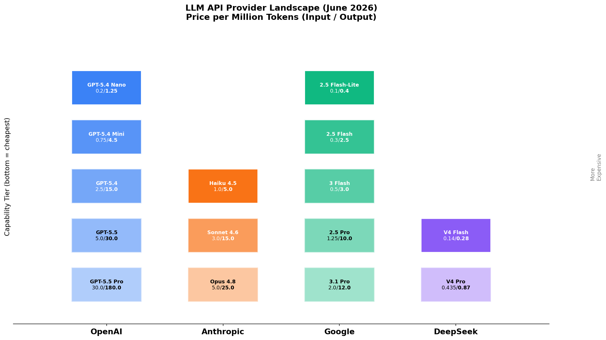
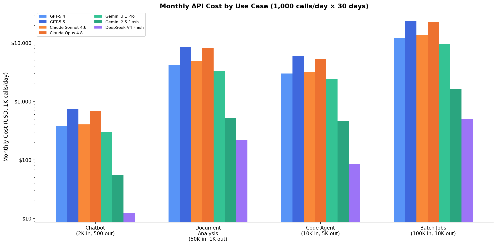
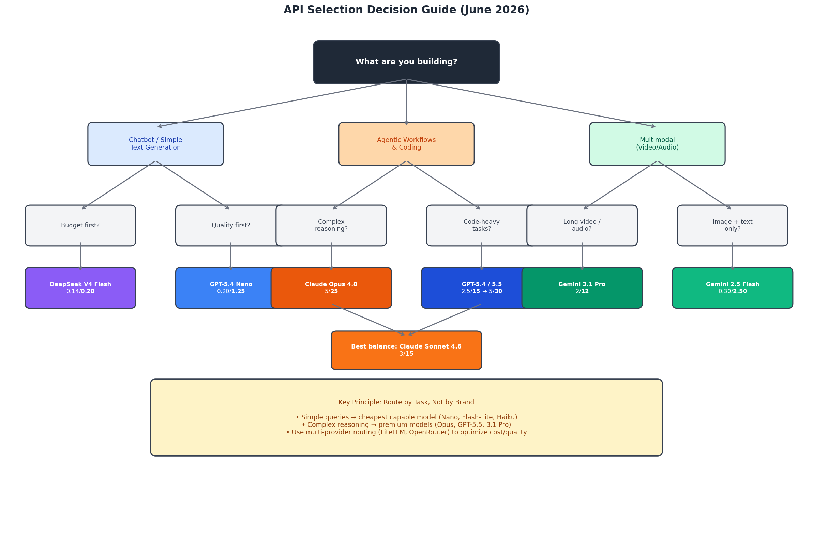
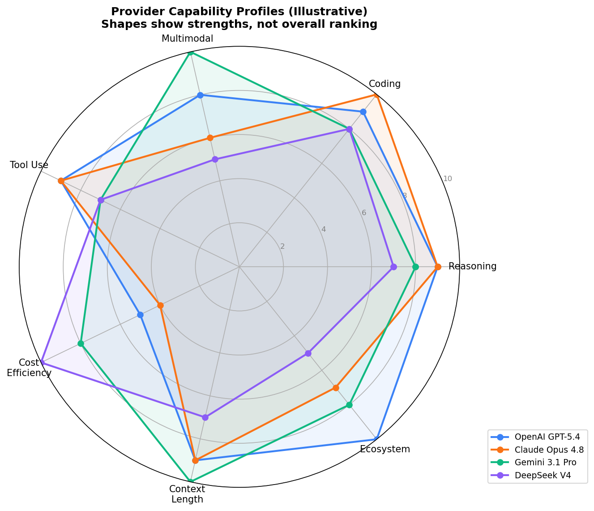

# Day 46: API 设计与选型 — 如何选择合适的 LLM 提供商

> **核心问题**：OpenAI、Anthropic、Google、DeepSeek 等都在提供 LLM API，你怎么为项目选对提供商——又怎么设计系统避免被锁死？

---

## 开篇

假设你在做一个 AI 客服工具，需要一个 LLM API。打开浏览器，面对一整面选项：OpenAI 有 GPT-5.4 和 GPT-5.5，Anthropic 提供 Claude Opus 4.8 和 Sonnet 4.6，Google 有 Gemini 3.1 Pro 和 Flash 系列，DeepSeek 以零头的价格截胡。

每个提供商都声称自己最强。各项 benchmark 数据都很好看。定价页面用的单位不同、分层不同、附加条件不同。三个月后，API 账单是预算的 10 倍，或者模型在你以为它能搞定的任务上频频翻车。

2026 年 LLM API 市场的真相：**没有唯一最优的提供商**。正确的选择取决于你在构建什么、延迟容忍度、预算规模，以及是否需要多模态输入、结构化输出或 agent tool use。这篇文章给你一个系统化的决策框架。

---

## 1. 提供商全景图（2026 年 6 月）

#### 直觉：把 LLM 提供商想象成云服务商

就像 AWS、Azure、GCP 各有优势（AWS 生态最广，Azure 企业集成好，GCP 数据/AI 强），LLM 提供商也各有定位。你不会把整个公司迁移到一个云上——2026 年最聪明的团队也不会绑定单个 LLM 提供商。


*图 1：2026 年 6 月 LLM API 提供商全景。每个提供商提供分层模型家族，从经济实惠到高端旗舰。价格单位为每百万 token（输入/输出）。*

### 1.1 OpenAI — 生态领导者

OpenAI 在 2026 年保持着最广的模型目录和最成熟的开发者工具链。模型家族横跨五个层级：

| 模型 | 输入（每 MTok） | 输出（每 MTok） | 上下文窗口 | 最佳场景 |
|------|------------------|------------------|------------|----------|
| GPT-5.5 Pro | **$30.00** | **$180.00** | 1M | 最难的问题 |
| GPT-5.5 | **$5.00** | **$30.00** | 1M | 复杂推理、Agent |
| GPT-5.4 | **$2.50** | **$15.00** | 1.1M | 通用生产 |
| GPT-5.4 Mini | **$0.75** | **$4.50** | 128K | 性价比平衡 |
| GPT-5.4 Nano | **$0.20** | **$1.25** | 128K | 大批量低成本 |

2026 年两种 API 范式并存：
- **Chat Completions API** — 行业标准的无状态接口。发送消息，获得回复。简单且广泛兼容。
- **Responses API** — 2025 年 3 月推出，推荐用于新项目。支持内置工具调用（网页搜索、文件搜索、代码解释器）、服务端状态管理和语义流式输出。OpenAI 和微软都推荐它作为新项目的默认选择（[OpenAI 迁移指南](https://developers.openai.com/api/docs/guides/migrate-to-responses)）。

核心差异化优势：
- **结构化输出 + JSON Schema 验证**：在 API 层面原生支持，是所有提供商中实现最成熟的
- **Prompt Caching**：重复的系统 prompt 可节省最高 90% 的费用（GPT-5.4 缓存输入价 **$0.25**/MTok）
- **Batch API**：非紧急负载可享 50% 折扣
- **实时语音模型**（2026 年 5 月）：GPT-Realtime-2、GPT-Realtime-Translate 和 GPT-Realtime-Whisper（[OpenAI 语音发布](https://openai.com/index/advancing-voice-intelligence-with-new-models-in-the-api/)）
- **GPT-5.5 Instant**（2026 年 5 月 5 日）：ChatGPT 新默认模型，在高风险 prompt（医学、法律、金融）上的幻觉率降低了 52.5%

### 1.2 Anthropic — Agent 编程之王

Anthropic 的 Claude 模型在复杂推理、代码生成和自主 Agent 工作流方面表现出色。2026 年定价经历重大变化——2 月 Opus 4.6 发布时价格直降 67%（从 Opus 4.1 的 $15/$75 降到 $5/$25）。

| 模型 | 输入（每 MTok） | 输出（每 MTok） | 上下文窗口 | 最佳场景 |
|------|------------------|------------------|------------|----------|
| Opus 4.8 | **$5.00** | **$25.00** | 1M | 复杂 Agent、编程 |
| Sonnet 4.6 | **$3.00** | **$15.00** | 1M | 平衡生产 |
| Haiku 4.5 | **$1.00** | **$5.00** | 1M | 快速经济 |

核心差异化优势：
- **Claude Opus 4.8**（2026 年 5 月 28 日）：编程、agent 任务和诚实度全面提升——遗漏代码缺陷的概率约为 Opus 4.7 的 1/4（[Anthropic 公告](https://www.anthropic.com/news/claude-opus-4-8)）
- **长上下文定价简化**：2026 年 3 月起取消长上下文附加费——所有上下文长度统一费率
- **MCP（Model Context Protocol）**：原生支持标准化的工具/数据源连接，已开源并在业界获得广泛采用
- **Prompt caching** 最高 90% 节省；**batch 处理** 50% 折扣
- **Claude Code**：自主编程 agent，支持终端访问、文件操作和多步工作流

需要注意的限制：2026 年初 Anthropic 尚未提供原生 embedding 模型和 fine-tuning，需要这些功能的团队可能需要搭配第二个提供商。

### 1.3 Google — 多模态与性价比之王

Google 的 Gemini 模型在 2026 年提供最强的性价比和最全面的多模态支持。其基于上下文长度的分级定价增加了一层其他提供商没有的复杂度。

| 模型 | 输入（每 MTok） | 输出（每 MTok） | 上下文窗口 | 最佳场景 |
|------|------------------|------------------|------------|----------|
| 3.1 Pro | **$2.00** | **$12.00** | 1M | 通用推理 |
| 2.5 Pro | **$1.25** | **$10.00** | 1M | 品质平衡 |
| 3 Flash | **$0.50** | **$3.00** | 1M | 快速生产 |
| 2.5 Flash | **$0.30** | **$2.50** | 1M | 经济实惠 |
| 2.5 Flash-Lite | **$0.10** | **$0.40** | 1M | 最便宜的付费选项 |

核心差异化优势：
- **原生视频和音频理解** — Gemini 在多模态长上下文任务上明显领先
- **Context caching** 约 90% 节省
- **Batch API** 所有模型 50% 折扣
- **免费额度** 可用于开发和测试 — 所有主要提供商中最慷慨
- **Vertex AI 集成**：fine-tuning、部署、监控一站式 Google Cloud 解决方案
- **Gemini 3.1 Pro**（2026 年 3 月）：被多位评测者称为"最聪明的默认选择"，以 Opus 一半的价格提供接近的品质

局限性：function calling 和结构化输出的成熟度不如 OpenAI。高度依赖 tool-use JSON 准确性的团队有时报告 Gemini 比 Claude 或 GPT 需要更多重试。

### 1.4 DeepSeek — 价格颠覆者

DeepSeek 是专注于开源的中国 AI 实验室，在 2026 年成为价格领导者。其兼容 OpenAI 的 API 让切换成本极低。

| 模型 | 输入（每 MTok） | 输出（每 MTok） | 上下文窗口 | 最佳场景 |
|------|------------------|------------------|------------|----------|
| V4 Pro | **$0.435** | **$0.87** | 1M | 低成本高品质 |
| V4 Flash | **$0.14** | **$0.28** | 1M | 最便宜的能力型选项 |

DeepSeek V4 Flash 大约比 GPT-5.5 或 Claude Opus 4.8 **便宜 35–100 倍**。对于预算敏感的应用——批量分类、摘要、数据提取——DeepSeek 通常以极低的成本提供够用的质量（[DeepSeek 定价](https://api-docs.deepseek.com/quick_start/pricing)）。

代价是：DeepSeek 缺乏生态广度（没有原生 embedding、有限的 fine-tuning、较少的企业功能），且部分团队反馈实时场景下延迟较高。

---

## 2. 超越价格的提供商对比

每 token 价格是最显眼的数字，但很少是最重要的。真正决定 API 是否适合你应用的维度如下。

### 2.1 总拥有成本（TCO）

每 token 价格只是起点。真实的成本方程包括：

$$
\begin{aligned}
\text{Monthly Cost} &= \sum_{\text{requests}} \left( \text{tokens}_{\text{in}} \times \text{price}_{\text{in}} + \text{tokens}_{\text{out}} \times \text{price}_{\text{out}} \right) \\
&\quad + \text{retries} + \text{infrastructure} + \text{engineering time}
\end{aligned}
$$

输出 token 的成本通常比输入 token 高 5–6 倍（所有提供商都如此）。这意味着生成长回复的应用（代码 agent、文档起草）比处理大量输入但返回短答案的应用（分类、提取）昂贵得多。


*图 2：按每天 1,000 次 API 调用估算的月度成本。注意纵轴是对数刻度——DeepSeek 和 Gemini Flash 在高量场景下便宜了几个数量级。*

成本优化手段：
- **Prompt caching**（三大提供商均支持）：重复的系统 prompt 或上下文可节省最高 90%
- **Batch API**（所有提供商）：非紧急异步处理 50% 折扣
- **上下文窗口附加费**：OpenAI 在 GPT-5.4 超过 272K token 后输入价格翻倍；Gemini 在超过 200K 后收费 2 倍。Anthropic 2026 年 3 月取消了附加费。
- **模型降级**：很多应用可以用更小的模型处理 80% 以上的请求，只将复杂情况路由到高端模型

### 2.2 功能成熟度矩阵

不同提供商在关键功能的实现上差异很大。以下是对生产系统最重要的能力对比：

| 功能 | OpenAI | Anthropic | Google | DeepSeek |
|------|--------|-----------|--------|----------|
| 结构化输出（JSON） | ★★★★★ 内置 Schema 验证 | ★★★★☆ 可靠、格式正确 | ★★★☆☆ 持续改进，重试较多 | ★★★☆☆ 基础支持 |
| Function Calling | ★★★★★ 并行执行、strict 模式 | ★★★★☆ 准确率高、JSON 干净 | ★★★☆☆ 成熟度稍低 | ★★★☆☆ 兼容 OpenAI |
| 流式输出 | ★★★★★ 语义流式（Responses API） | ★★★★☆ 可靠 SSE | ★★★★☆ SSE 支持良好 | ★★★☆☆ 基础 |
| Prompt Caching | ★★★★★ 最高 90% 节省 | ★★★★★ 最高 90% 节省 | ★★★★★ ~90% 节省 | ★★☆☆☆ 有限 |
| Embeddings | ★★★★★ 多种模型 | ★☆☆☆☆ 原生不可用 | ★★★★★ 原生模型 | ★☆☆☆☆ 不可用 |
| Fine-tuning | ★★★★★ 支持 | ★☆☆☆☆ 不可用 | ★★★★★ 通过 Vertex AI | ★★☆☆☆ 有限 |
| 多模态（视觉） | ★★★★☆ 较强 | ★★★☆☆ 支持 | ★★★★★ 原生视频/音频 | ★★☆☆☆ 基础 |
| 企业合规 | ★★★★★ SOC 2, HIPAA, ISO | ★★★★☆ SOC 2，扩展中 | ★★★★★ 完整 Google Cloud 认证 | ★★☆☆☆ 有限 |

### 2.3 延迟与可靠性

Benchmark 不能反映延迟的全貌。生产环境中真正重要的是：
- **首 Token 时间（TTFT）**：发送请求后第一个 token 出现的速度
- **每秒 Token 数（TPS）**：首 token 之后的生成吞吐量
- **P99 延迟**：负载下的尾部延迟，即用户体验到的最坏情况
- **速率限制与限流**：提供商如何处理突发流量

2026 年标准请求的延迟大致排序（从快到慢）：DeepSeek V4 Flash ≈ Gemini Flash > Claude Haiku > GPT-5.4 Mini > Claude Sonnet > GPT-5.4 > Claude Opus > GPT-5.5。不过这些数据受地区、负载大小和提供商负载影响很大——务必用自己的实际工作负载做基准测试。

---

## 3. 提供商选择框架

#### 直觉：按任务路由，不按品牌选择

把 LLM API 想象成一个出租车车队。你不会每次出行都叫豪华轿车——短途打经济型，重要客户会面才用商务车。多模型路由也是同样的道理。


*图 3：根据主要使用场景选择提供商的实用决策指南。价格单位为每百万 token。*

### 3.1 决策原则

**原则 1：模型层级匹配任务复杂度。** 不要把简单的分类任务发给 GPT-5.5 或 Claude Opus。对 80% 不需要前沿推理的请求，用 Nano、Flash-Lite 或 Haiku 就够了。

**原则 2：使用多提供商路由。** [LiteLLM](https://github.com/BerriAI/litellm) 和 [OpenRouter](https://openrouter.ai/) 等工具提供跨提供商的统一接口，按成本、延迟或能力路由请求，无需重写应用代码。

**原则 3：从第一天起就为可切换性做设计。** 在接口层后面封装 LLM 调用。永远不要在业务逻辑中硬编码提供商特定的逻辑。前期几乎零成本，但能在迁移时省下巨大痛苦。

**原则 4：用你自己的数据做评测。** 提供商的 benchmark 测量的是标准化数据集上的表现，不一定反映你的领域。在做出承诺之前，用 100–500 个代表性样本做自己的评估。

### 3.2 常见架构

**单提供商多层级** — 最简单。用一个提供商的完整模型家族，按任务复杂度路由。

```
用户请求 → 路由器 → GPT-5.4 Nano（简单）
                  → GPT-5.4（中等）
                  → GPT-5.5（复杂）
```

**多提供商路由** — 最优成本。每个请求发给在该任务类型上性价比最好的提供商。

```
用户请求 → LiteLLM/OpenRouter → DeepSeek V4 Flash（分类）
                               → Claude Sonnet 4.6（Agent 任务）
                               → Gemini 3.1 Pro（多模态）
```

**降级链** — 最高可靠性。先尝试主提供商，出错或超时时自动切换到备选。

```
用户请求 → Claude Sonnet →（超时）→ GPT-5.4 →（错误）→ Gemini Flash
```


*图 4：雷达图展示各提供商独特的能力画像。多边形的形状比面积更重要——每个提供商都有独特的"指纹"。这些是用于教学目的的说明性评分。*

---

## 4. 代码示例：构建多提供商路由器

下面是一个使用 LiteLLM 跨提供商路由并自动降级的实际例子：

```python
from litellm import completion
import os

# 配置 API Key（设为环境变量）
# OPENAI_API_KEY, ANTHROPIC_API_KEY, GOOGLE_API_KEY, DEEPSEEK_API_KEY

# 定义不同任务复杂度的模型层级
MODEL_TIERS = {
    "fast": "deepseek/deepseek-v4-flash",       # $0.14/$0.28 — 最便宜
    "balanced": "gemini/gemini-2.5-flash",       # $0.30/$2.50 — 性价比好
    "capable": "anthropic/claude-sonnet-4-6",    # $3.00/$15.00 — 生产品质
    "premium": "openai/gpt-5.5",                 # $5.00/$30.00 — 最佳推理
}

def classify_complexity(prompt: str) -> str:
    """简单的启发式规则来分类请求复杂度。"""
    prompt_lower = prompt.lower()
    
    # 简单任务：分类、提取、简短回答
    if any(w in prompt_lower for w in ["classify", "extract", "summarize", "is this"]):
        return "fast"
    
    # 中等任务：写作、分析、问答
    if any(w in prompt_lower for w in ["write", "analyze", "explain", "compare"]):
        return "balanced"
    
    # 复杂任务：多步推理、代码生成
    if any(w in prompt_lower for w in ["debug", "implement", "plan", "reason"]):
        return "capable"
    
    # 默认走平衡层
    return "balanced"

def llm_call(prompt: str, tier: str = None) -> str:
    """将 LLM 调用路由到合适的模型层级。"""
    tier = tier or classify_complexity(prompt)
    model = MODEL_TIERS[tier]
    
    try:
        response = completion(
            model=model,
            messages=[{"role": "user", "content": prompt}],
            temperature=0.3,
        )
        return response.choices[0].message.content
    except Exception as e:
        # 降级：如果主模型失败，尝试 GPT-5.4 作为可靠备选
        print(f"Error with {model}: {e}. Falling back to GPT-5.4.")
        response = completion(
            model="openai/gpt-5.4",
            messages=[{"role": "user", "content": prompt}],
            temperature=0.3,
        )
        return response.choices[0].message.content

# 使用示例
result = llm_call("Classify this text as positive or negative: 'Great product!'")
# → 使用 DeepSeek V4 Flash（fast 层）— 约 $0.0001

result = llm_call("Implement a binary search tree with insert, delete, and search.")
# → 使用 Claude Sonnet 4.6（capable 层）— 约 $0.05

result = llm_call("Solve this step by step: ...", tier="premium")
# → 使用 GPT-5.5（premium 层）— 约 $0.10
```

核心架构洞见：**你的应用代码永远不需要知道它在和哪个提供商对话**。路由逻辑是一层薄薄的封装，可以随时调整而不触碰业务逻辑。

---

## 5. LLM 集成的 API 设计模式

除了提供商选择，API 集成的设计方式同样重要。

### 5.1 抽象层

始终将 LLM 调用封装在接口后面。这个模式只需几分钟实现，却能省下几周的迁移成本：

```python
from abc import ABC, abstractmethod

class LLMProvider(ABC):
    @abstractmethod
    def complete(self, prompt: str, **kwargs) -> str:
        pass

class OpenAIProvider(LLMProvider):
    def complete(self, prompt: str, **kwargs) -> str:
        from openai import OpenAI
        client = OpenAI()
        response = client.chat.completions.create(
            model=kwargs.get("model", "gpt-5.4"),
            messages=[{"role": "user", "content": prompt}],
        )
        return response.choices[0].message.content

class AnthropicProvider(LLMProvider):
    def complete(self, prompt: str, **kwargs) -> str:
        import anthropic
        client = anthropic.Anthropic()
        response = client.messages.create(
            model=kwargs.get("model", "claude-sonnet-4-6"),
            max_tokens=4096,
            messages=[{"role": "user", "content": prompt}],
        )
        return response.content[0].text
```

### 5.2 成本追踪

从第一天起就在抽象层里内置成本追踪。每次请求的 token 数和费用应按请求、按模型、按功能记录：

```python
import time

class TrackedLLMCall:
    def __init__(self, provider: LLMProvider, model: str):
        self.provider = provider
        self.model = model
        self.total_input_tokens = 0
        self.total_output_tokens = 0
        self.total_cost = 0.0

    def complete(self, prompt: str, **kwargs) -> str:
        start = time.time()
        response = self.provider.complete(prompt, model=self.model, **kwargs)
        latency = time.time() - start
        
        # 记录指标（生产环境中发送到 Prometheus/DataDog 等）
        print(f"[{self.model}] {latency:.2f}s | "
              f"tokens: ~{len(prompt.split())}in | cost: ~${self._estimate_cost(prompt):.4f}")
        return response

    def _estimate_cost(self, prompt: str) -> float:
        # 粗略估算；生产中应使用 API 返回的实际 token 数
        PRICES = {
            "gpt-5.4": (2.50, 15.00),
            "claude-sonnet-4-6": (3.00, 15.00),
            "gemini-2.5-flash": (0.30, 2.50),
        }
        in_price, _ = PRICES.get(self.model, (1.0, 5.0))
        return len(prompt.split()) / 1_000_000 * in_price
```

---

## 6. 常见误区

### ❌ "选最便宜的提供商就行"

每 token 价格只是起点。一个便宜 10 倍但需要 3 倍重试、输出质量更低、或缺少你需要的功能（结构化输出、tool calling）的模型，在工程时间和用户沮丧上花的钱远超你在 API 账单上省下的。

### ❌ "一个提供商搞定一切"

LLM API 的 vendor lock-in 特别危险，因为市场变化极快。今天最好的提供商半年后未必还是最好。多提供商路由既是成本优化，也是风险缓解。

### ❌ "Benchmark 能告诉你一切"

MMLU、HumanEval、SWE-bench 等 benchmark 有助于了解相对能力，但它们不反映你的具体领域、prompt 风格或延迟要求。务必用自己的数据验证。

### ❌ "什么都要用 GPT-5.5 或 Claude Opus"

绝大多数生产工作负载——聊天机器人、内容分类、摘要、提取——用 GPT-5.4 Nano、Gemini Flash 或 Claude Haiku 就能以极低成本提供完全够用的质量。把高端模型留给真正需要它们的任务。

---

## 7. 前沿：快速变化中的市场

2026 年 LLM API 格局正在快速演进。以下是最值得关注的近期动态：

| 动态 | 日期 | 影响 |
|------|------|------|
| [Claude Opus 4.8](https://www.anthropic.com/news/claude-opus-4-8) 发布，含 dynamic workflows | 2026.05.28 | 代码诚实度提升 4 倍，与 Opus 4.7 同价 |
| [GPT-5.5 Instant](https://openai.com/research/index/release/) 成为 ChatGPT 新默认 | 2026.05.05 | 高风险 prompt 幻觉率降低 52.5% |
| [OpenAI Realtime Voice API](https://openai.com/index/advancing-voice-intelligence-with-new-models-in-the-api/) 发布 | 2026.05.07 | 语音应用新范式：推理、翻译、转录一体化 |
| [Anthropic 取消长上下文附加费](https://www.anthropic.com/claude/opus) | 2026.03 | 所有上下文长度（最高 1M token）统一费率 |
| [DeepSeek V4](https://api-docs.deepseek.com/quick_start/pricing) 定价 **$0.14/0.28**/MTok | 2026.04 | 比高端提供商便宜 35–100 倍 |
| [Gemini 3.1 Pro](https://ai.google.dev/) 定价 **$2/12**/MTok | 2026.03 | Opus 级品质、一半价格 |
| [Anthropic Mythos](https://www.reuters.com/business/anthropic-roll-out-claude-mythos-coming-weeks-launches-opus-48-2026-05-28/) 公告 | 2026.05.28 | 下一代模型"数周内"发布，可能再次改变市场 |

趋势很清楚：**价格快速下降，能力趋于收敛，差异化正从原始模型品质转向生态功能**（tool calling、结构化输出、语音、多模态、企业合规）。

---

## 8. 延伸阅读

### 官方文档
1. [OpenAI API 文档](https://developers.openai.com/api/docs) — 完整 API 参考和指南
2. [Anthropic Claude API 文档](https://docs.anthropic.com/en/docs) — Claude API 指南和参考
3. [Google Gemini API 文档](https://ai.google.dev/gemini-api/docs) — Gemini API 指南和定价
4. [DeepSeek API 文档](https://api-docs.deepseek.com/) — DeepSeek API 参考

### 工具
1. [LiteLLM](https://github.com/BerriAI/litellm) — 100+ LLM 提供商的统一接口
2. [OpenRouter](https://openrouter.ai/) — 跨提供商 API 网关路由
3. [Instructor](https://python.useinstructor.com/) — Python 结构化输出库，支持多提供商

### 分析
1. ["OpenAI vs Anthropic vs Google Cost Comparison" (LLM Gateway, 2026)](https://llmgateway.io/blog/openai-vs-anthropic-vs-google-cost-comparison)
2. ["Top LLM API Providers in 2026" (Fireworks AI)](https://fireworks.ai/blog/best-llm-api-providers)
3. ["LLM API Pricing Comparison 2026" (CloudZero)](https://www.cloudzero.com/blog/llm-api-pricing-comparison/)

---

## 思考题

1. 如果你的主提供商明天宕机 4 小时，你的应用会怎样？损失多大？
2. 在你的具体场景中，有多大比例的请求真正需要高端模型？把其余部分路由到更便宜的选项能省多少？
3. 你会如何衡量切换提供商是否改善或恶化了应用质量？你会追踪哪些指标？

---

## 总结

| 概念 | 一句话解释 |
|------|-----------|
| 多提供商路由 | 把每个请求发给能处理好它的最便宜模型 |
| Prompt caching | 重复上下文 token 可节省最高 90% |
| Batch API | 非紧急请求 50% 折扣异步处理 |
| LiteLLM / OpenRouter | 抽象掉提供商差异的统一接口 |
| 抽象层 | 将 LLM 调用封装在接口后面，切换提供商无需重写业务代码 |
| 拥有成本 | 每 token 价格 × 重试次数 × 工程时间 × 基础设施 = 真实成本 |

**核心要点**：2026 年，致胜策略不是选"最好"的 LLM 提供商——而是构建一种架构，让你能为每个任务使用合适的模型，在市场变化时切换提供商，在不牺牲质量的前提下优化成本。最好的 API 调用，是能可靠完成工作的最便宜的那一个。

---

*Day 46 of 60 | LLM Fundamentals*
*Word count: ~3000 | Reading time: ~15 minutes*
