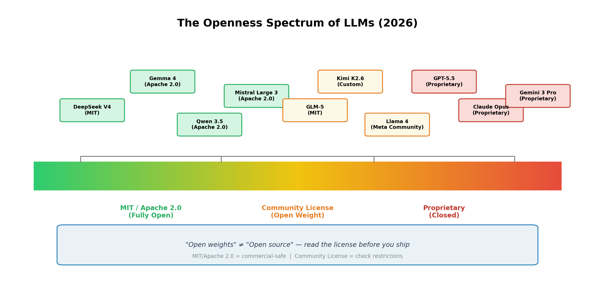
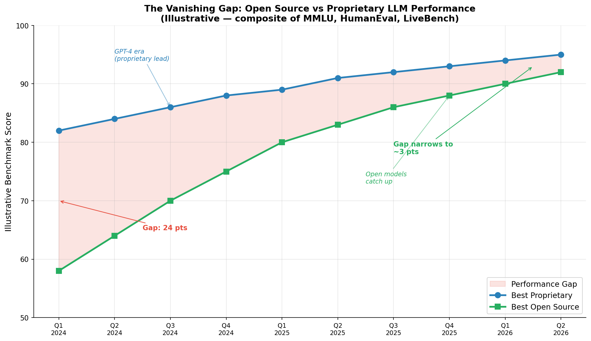
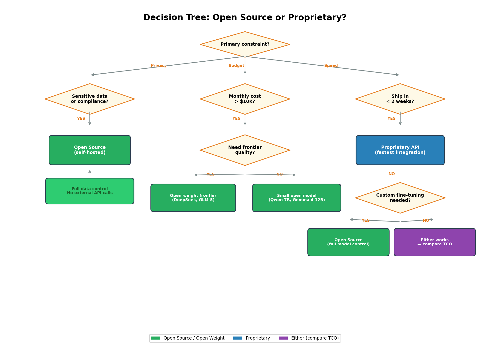
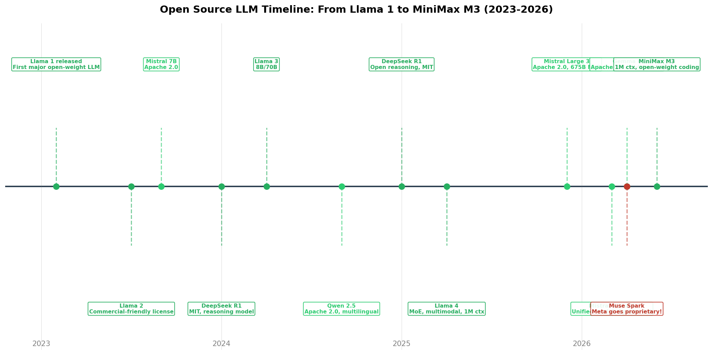

# Day 47: 开源 vs 闭源 LLM — 到底该用哪个

> **核心问题**：当开源模型在基准测试上已经追平闭源模型，你该如何为自己的项目做出选择？

---

## 开篇

2024 年初，想要 GPT-4 级别的性能，你只有一个选择：付钱给 OpenAI。当时最好的开源模型和最好的闭源模型之间差距巨大——在标准基准测试上差了 20 多个百分点。

两年后，这个差距几乎消失了。2026 年，DeepSeek R2（2026 年 3 月发布）和 MiniMax M3（2026 年 6 月发布）等开放权重模型在编程和推理基准测试上与 GPT-5.5 和 Claude Opus 只差几个百分点。现在的问题不再是"开源模型够不够好"——而是"既然两个选项都可用，哪个更符合我的约束条件？"

本文拆解真正的决策因素：许可证、总体拥有成本（TCO）、数据隐私、部署灵活性，以及经常被忽略的工程投入。我们用 2026 年的真实数据，而不是假设场景。

---

## 1. 开放度光谱：不是非黑即白

#### 直觉：把 LLM 的开放度想象成餐厅厨房

完全闭源的模型就像一家开放式厨房的餐厅——你可以看到菜出来，但食谱、食材和技术都是秘密。MIT 许可的模型就像一本出版的食谱：你拿到精确配方，可以修改、用它做菜去卖、分享你的改进。"社区许可证"模型介于两者之间——你免费拿到食谱，但厨师说"别用我的配方开竞争餐厅"。

大多数人忽略的关键区别：**"开放权重"不等于"开源"。** 开源意味着你可以检查、修改和重新分发训练代码和数据。开放权重意味着你拿到训练好的模型参数，但可能面临使用限制。


*图 1：各大 LLM 在开放度光谱上的位置，从完全开放（MIT/Apache 2.0）到完全闭源。位置决定了你对模型的法律使用权。*

### 1.1 许可证类别详解

| 许可证类型 | 你获得什么 | 商业使用 | 代表模型 |
|---|---|---|---|
| **MIT** | 权重 + 完全商业自由 | 可以，无限制 | DeepSeek V4/R2, GLM-5, Phi-4 |
| **Apache 2.0** | 权重 + 专利授权 + 商业自由 | 可以，无限制 | Qwen 3.5, Gemma 4, Mistral Large 3 |
| **社区许可证** | 权重 + 使用限制 | 可以，但有限制（如 MAU 上限、禁止竞争） | Llama 4 (Meta), Kimi K2.6 |
| **闭源** | 仅 API 访问，无权重 | 按 API 条款 | GPT-5.5, Claude Opus 4.6, Gemini 3 Pro |

实际影响：如果你在构建商业产品，MIT 和 Apache 2.0 基本零烦恼。社区许可证需要仔细阅读细则——例如 Meta 的 Llama 许可证限制月活超过 7 亿用户的公司使用，并禁止用该模型训练竞争性基础模型。

---

## 2. 差距为什么消失了

#### 直觉：食谱公开效应

想象世界顶级厨师开始公开他们精确的食谱。一开始，只有少数人能复制——你需要同样昂贵的设备和多年训练。但随着烹饪技术进步和知识传播，越来越多的厨师能匹敌甚至超越原版。这基本就是 LLM 领域发生的事情。

三股力量推动了趋同：

### 2.1 Llama 效应（2023-2025）

2023 年 2 月 Meta 发布 Llama 1，这是个分水岭。第一次有接近 GPT-3.5 水平的模型以开放权重形式发布。社区在几天内就完成了微调，产生了 Vicuna、Alpaca 等数十个变体。这证明开源模型可以具有竞争力——并吸引了人才和资金进入开源生态。

Llama 2（2023 年 7 月）让商业使用成为可能。Llama 3（2024 年 4 月）在多项任务上达到 GPT-4 级别。Llama 4（2025 年 4 月）引入了 Mixture-of-Experts 架构，具备多模态能力和 100 万 token 的上下文窗口，进入前沿领域。

然后，2026 年 4 月，Meta 做了一个出人意料的转向：[Muse Spark](https://ai.meta.com/blog/introducing-muse-spark-msl/)，Meta 超级智能实验室的新前沿模型，是**闭源的**。现有的 Llama 4 权重仍然可用，但 Meta 的前沿开发已经转向闭源。这是个警示故事——即使是启动开源 LLM 革命的公司也可能改变策略。

### 2.2 中国开源浪潮（2024-2026）

中国 AI 实验室成为真正开源 LLM 的主要推动者：

- **DeepSeek**（梁文锋创立）于 2025 年 1 月以 MIT 许可发布 R1——一个与 OpenAI o1 竞争的推理模型，成本只有一小部分。[DeepSeek R2](https://decodethefuture.org/en/deepseek-r2-explained/)（2026 年 3 月）延续这一路线，以 320 亿参数的稠密 Transformer 在 AIME 2025 上达到 92.7%。
- **通义千问 Qwen**（阿里巴巴达摩院）以 Apache 2.0 发布 Qwen 3.5，参数从 70 亿到 3970 亿不等，支持 140+ 种语言。
- **GLM-5**（[智谱 AI / Z.AI](https://huggingface.co/blog/daya-shankar/open-source-llms)）采用 MIT 许可，在智能体工程任务上排名前列。
- **MiniMax** 于 2026 年 6 月发布 [MiniMax M3](https://www.minimax.io/blog/minimax-m3)——首个结合前沿编程能力、100 万 token 上下文和原生多模态的开放权重模型，在 SWE-Bench Pro 开放权重排行榜上达到 59.0%。

### 2.3 效率突破

不仅是模型变好了——效率提升更为显著。DeepSeek R2 在 4-bit 量化下可以在单张消费级 GPU（RTX 4090）上运行，仅使用约 20GB 显存。Qwen3-Coder-Next 仅用 800 亿 MoE 中的 30 亿活跃参数就在 SWE-bench Verified 上达到 70.6%。这意味着开源模型可以部署在以前只有闭源 API 才能触及的环境中。

---

## 3. 真实成本对比

#### 直觉：买车还是租车

使用闭源 API 就像租车：前期成本低，不用维护，但按里程持续付费。自托管开源模型就像买车：前期成本高，你要自己维护，但边际成本趋近于零。盈亏平衡点取决于使用量。


*图 2：示意性综合基准分数，展示闭源与开源 LLM 之间的性能差距从 2024 年初的约 24 个百分点缩小到 2026 年中期的约 3 个百分点。*

### 3.1 总体拥有成本（TCO）

| 因素 | 闭源 API | 开源（自托管） |
|---|---|---|
| **每 token 成本** | $1-15 / 1M tokens | 接近零（电费） |
| **基础设施** | 无 | GPU 服务器（$2-8/小时/H100） |
| **工程投入** | API 集成（数小时） | 部署、监控、更新（数周到数月） |
| **微调** | 有限（通过厂商工具） | 完全控制（LoRA, QLoRA, DPO） |
| **数据流出** | 所有数据发送给提供商 | 零（留在你的服务器上） |
| **厂商锁定** | 高（API 专用代码） | 低（模型可移植） |
| **扩容** | 自动 | 需要容量规划 |

**盈亏平衡分析**：如果你每月处理超过约 5000 万 token（前沿质量），自托管通常更便宜。低于这个阈值，自托管的工程开销通常超过 API 成本。这不是硬性规则——取决于你的团队的 MLOps 成熟度和是否已有 GPU 基础设施。

### 3.2 开源的隐性成本

自托管不是免费的。经常被低估的成本包括：

1. **MLOps 基础设施**：模型服务（vLLM, TGI）、监控、A/B 测试、负载均衡
2. **人才**：能大规模部署和维护 LLM 的工程师薪资不菲
3. **模型更新**：前沿开源模型每 3-6 个月发布一次；保持最新需要重新部署周期
4. **安全测试**：闭源提供商负责红队测试；用开源模型，这是你的责任

---

## 4. 什么时候开源更合适

### 4.1 TCO 盈亏平衡公式

你可以用简单的公式近似计算自托管比 API 更便宜的盈亏平衡点：

$$
\begin{aligned}
C_{\text{api}} &= r \times n \times t \\
C_{\text{self}} &= F + e \times n \times t + s \\
\text{盈亏平衡点:} \quad n^* &= \frac{F + s}{(r - e) \times t}
\end{aligned}
$$

其中：
- **r** = API 每百万 token 成本（如 GPT-5 级别为 $5）
- **e** = 每百万 token 的电力 + 基础设施成本（如自托管约 $0.50）
- **n** = 月数
- **t** = 每月 token 数（百万）
- **F** = 一次性设置成本（服务器采购、工程部署）
- **s** = 每月维护成本（监控、更新、MLOps 工程师工时）

具体例子：如果你每月处理 1 亿 token，API 成本约 $500/月（按 $5/M tokens），而用 H100 自托管 GPU 成本约 $2,160/月，加上 MLOps 工程师部分工时约 $2,000/月。但在更高量级下盈亏平衡会大幅变化——10 亿 token/月时 API 成本 $5,000，而 GPU 成本仍然是 ~$2,160。

### 4.2 数据隐私与合规

如果你在医疗（HIPAA）、金融（SOC 2, PCI-DSS）、国防或任何受监管行业工作——在这些领域将数据发送到外部 API 受到限制或禁止——开源不仅仅是更好的选择，通常也是唯一合法的选项。自托管意味着数据永远不会离开你的网络。

这也适用于在数据主权法律严格地区（欧盟 AI 法案、中国数据本地化要求）构建产品的公司。

### 4.3 大规模自定义微调

当你的用例需要领域特定知识（法律合同、医疗记录、专有代码库）时，在自己的数据上微调是必要的。开源模型给你完全控制：

```python
# 使用 LoRA 微调开源模型（简化示例）
from transformers import AutoModelForCausalLM, AutoTokenizer
from peft import LoraConfig, get_peft_model

model = AutoModelForCausalLM.from_pretrained("deepseek-ai/DeepSeek-R2")
tokenizer = AutoTokenizer.from_pretrained("deepseek-ai/DeepSeek-R2")

# LoRA: 只训练不到 1% 的参数
lora_config = LoraConfig(
    r=16,                    # 低秩 — 更少的可训练参数
    lora_alpha=32,
    target_modules=["q_proj", "v_proj", "k_proj", "o_proj"],
    task_type="CAUSAL_LM"
)

model = get_peft_model(model, lora_config)
# model.print_trainable_parameters()
# 输出: trainable params: ~50M / 32B total (~0.15%)

# 在你的专有数据上训练
# trainer.train(dataset="your_domain_data")
```

闭源 API 只能使用厂商提供的微调工具——如果他们提供的话。

### 4.4 长时间运行的智能体和高量级应用

每次任务做数千次 LLM 调用的智能体系统会快速耗尽 API 预算。一个使用 100 万 token 上下文窗口的自主编程智能体可能在一次会话中消耗数百万 token。按闭源 API 定价，这可能每次运行花费 $50-200。用开源模型自托管可以将边际成本降到接近零。

---

## 5. 什么时候闭源更合适

### 5.1 上市速度

如果你需要几天而不是几个月就做出可用产品，闭源 API 无可匹敌。一次 API 调用就能获得前沿性能，零基础设施。这对以下场景很重要：

- 正在验证产品市场匹配的创业公司
- 用户量少的内部工具
- 在投入基础设施之前的原型开发

### 5.2 最难任务上的前沿质量

虽然差距已经缩小，但闭源模型在最苛刻的任务上仍然领先。截至 2026 年中，Claude Opus 4.6 和 GPT-5.5 在以下方面保持优势：
- 复杂的多步骤推理
- 细致的指令遵循
- 开箱即用的安全性和 alignment

差距在最难的基准测试上约 3-5 个百分点——小到许多应用不会注意到，但对于每个百分点都很重要的关键任务部署来说仍然显著。

### 5.3 托管可靠性

闭源提供商处理正常运行时间、扩展、冗余和更新。当 GPT-5.5 更新时，你自动受益。开源模型每次升级都需要你的团队验证、部署和监控。

---

## 6. 混合方案（大多数团队的实际做法）

实际上，2026 年大多数生产系统使用**混合策略**：

1. **先用闭源 API** 做原型和验证
2. **识别高量级、低复杂度的路径** 可以迁移到开源模型
3. **保留闭源 API 处理复杂推理** 需要前沿质量的任务
4. **自托管开源模型处理数据敏感或高量级** 用例

这种"流量路由"模式使用轻量级分类器将简单查询路由到自托管开源模型，复杂查询路由到闭源 API。结果是：60-80% 的流量由低成本自托管模型处理，前沿质量保留给真正需要的场景。


*图 4：基于主要约束条件（数据隐私、预算或上市速度）选择开源或闭源 LLM 的实用决策树。*

---

## 7. 前沿：过去 6 个月的变化

开源 LLM 领域在 2026 年初经历了剧变：

| 事件 | 日期 | 意义 |
|---|---|---|
| [Gemma 4 发布](https://blog.google/innovation-and-ai/technology/developers-tools/introducing-gemma-4-12b/) | 2026 年 4 月 2 日 | Google 的完全开源模型，Apache 2.0，多模态 |
| [Muse Spark](https://ai.meta.com/blog/introducing-muse-spark-msl/) | 2026 年 4 月 8 日 | Meta 从开源 Llama 转向闭源——说明开源并非必然趋势 |
| [Mistral Small 4](https://mistral.ai/news/mistral-3/) | 2026 年 3 月 16 日 | 统一推理 + 编程 + 视觉的 Apache 2.0 模型 |
| [DeepSeek R2](https://decodethefuture.org/en/deepseek-r2-explained/) | 2026 年 3 月 | 320 亿参数推理模型，MIT 许可，可在消费级 GPU 上运行 |
| [MiniMax M3](https://www.minimax.io/blog/minimax-m3) | 2026 年 6 月 1 日 | 首个结合前沿编程 + 100 万上下文 + 多模态的开放权重模型 |


*图 3：从 Llama 1（2023）到 MiniMax M3（2026 年 6 月）的开源 LLM 发展里程碑。注意红色标记的 Muse Spark 事件——Meta 转向闭源。*

最重要的趋势：**中国 AI 实验室（DeepSeek、MiniMax、智谱 AI、月之暗面）已成为真正开源 LLM 的主要推动者**，而一些西方公司（Meta）正在转向闭源模型。

---

## 8. 常见误解

### ❌ "开源模型总是更便宜"

如果你把工程时间、基础设施和机会成本都算进去，就不一定了。一个月 1 万用户量的创业公司自托管几乎肯定比用 API 花得更多。TCO 取决于规模、团队能力和是否已有 GPU 基础设施。

### ❌ "开放权重 = 开源"

开放权重意味着你可以下载和运行模型。开源（按 OSI 定义）意味着你还可以检查、修改和重新分发训练代码和数据。大多数"开源" LLM 实际上是带有不同许可证限制的"开放权重"。

### ❌ "闭源模型总是更好"

截至 2026 年中，这对大多数实际用例来说是不成立的。开放权重模型在编程基准测试上匹敌甚至超越闭源模型，推理差距已经缩小到个位数百分点。

---

## 9. 延伸阅读

### 入门
1. [Open-Source vs Commercial LLMs: The Complete Guide (2026)](https://www.sitepoint.com/opensource-vs-commercial-llms-the-complete-guide-2026/) — 含 Node.js 示例的实用对比
2. [Best Open-Source LLMs in 2026 (Hugging Face)](https://huggingface.co/blog/daya-shankar/open-source-llms) — 全面的逐模型分析

### 进阶
1. [How to Choose the Right Open-Source LLM for Production](https://www.clarifai.com/blog/how-to-choose-the-right-open-source-llm-for-production) — 部署和基础设施考量
2. [What Happens to Local LLMs When Models Go Closed-Source](https://dasroot.net/posts/2026/05/local-llms-closed-source-impact-strategies/) — Meta 转向的影响分析

### 论文
1. ["Attention is All You Need"](https://arxiv.org/abs/1706.03762) — 开启 Transformer 革命的论文，所有现代 LLM 的基础
2. ["Scaling Data-Constrained Language Models"](https://arxiv.org/abs/2305.16264)（Muennighoff et al., 2023）— 为什么数据可用性比算力更能决定开源与闭源的差距
3. ["A Survey of Large Language Models"](https://arxiv.org/abs/2303.18223)（Zhao et al., 2023）— 包括开源生态在内的全面综述

---

## 思考题

1. 如果你要构建一个医疗诊断助手，哪些具体的监管和技术因素会决定你使用开源还是闭源模型？
2. Meta 从开源 Llama 转向闭源 Muse Spark。什么商业动机可能导致其他公司做出类似转变？这对开源生态意味着什么？
3. "混合路由"方案根据复杂度将查询路由到不同模型。构建这种系统的工程挑战是什么？你会怎么衡量它是否运作良好？

---

## 总结

| 概念 | 一句话解释 |
|---|---|
| 开放权重（Open Weights） | 模型参数可下载；可能有使用限制 |
| 开源（OSI 定义） | 完全访问权重、代码和数据，具有再分发权利 |
| MIT 许可证 | 最宽松——做什么都行，无限制 |
| Apache 2.0 | 宽松且含专利保护——商业安全 |
| 社区许可证 | 免费但有限制（用户上限、竞争使用禁令） |
| TCO（总体拥有成本） | 所有成本：token、基础设施、工程、维护 |
| 混合路由 | 简单查询路由到低成本开源模型，复杂查询路由到闭源 API |

**核心要点**：2026 年的开源与闭源之争已经不再是质量问题——而是约束问题。如果你需要数据隐私、自定义微调或高量级低成本部署，开源更合适。如果你需要上市速度、托管可靠性或最难任务上的绝对前沿水平，闭源 API 更合适。大多数生产系统两者都用。

---

*Day 47 of 60 | LLM Fundamentals*
*字数: ~2400 | 阅读时间: ~12 分钟*
