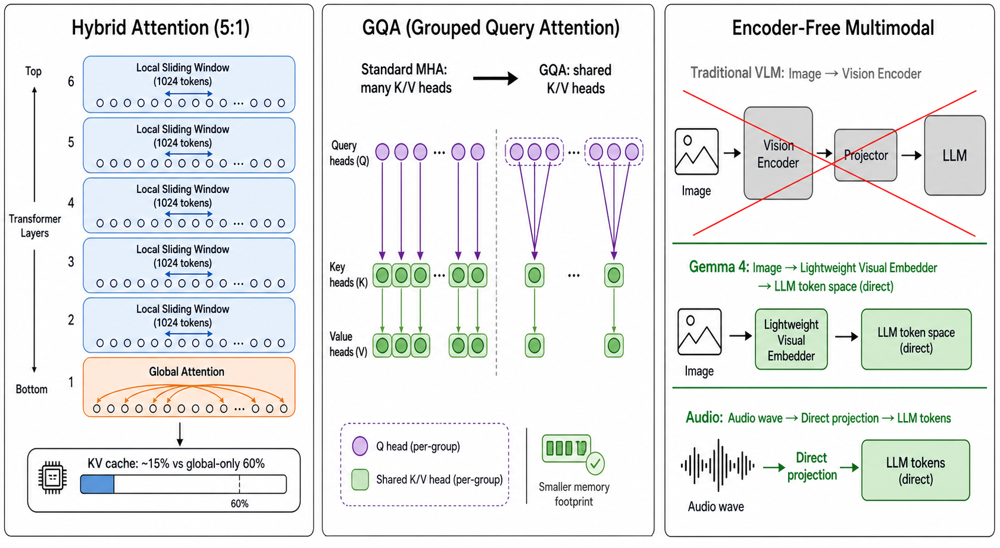
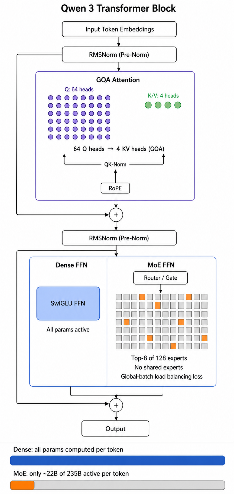
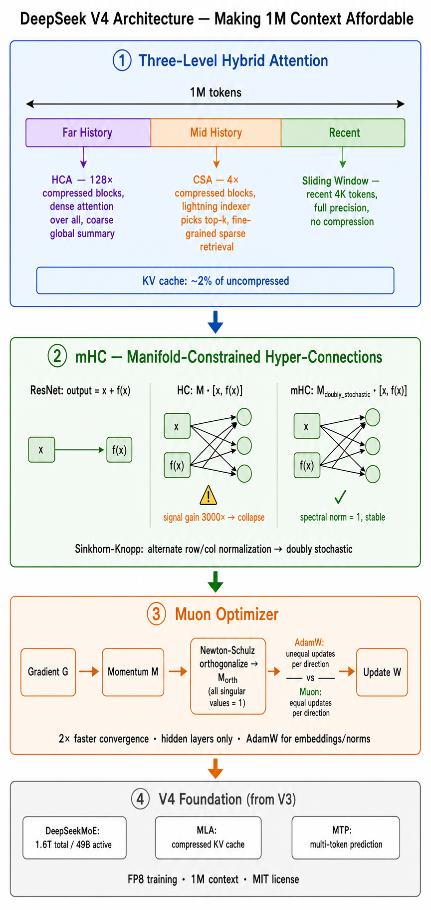

# Day 47: 顶级开源模型深入 — 用架构对比读懂 Gemma 4、Qwen 3、DeepSeek V4

> **核心问题**：不要只问“哪个开源模型最强”。更好的问题是：这些模型为什么会长成今天这样？它们分别把算力、显存、长上下文、多模态、MoE 路由和端侧部署之间的矛盾，压到了哪里？

---

## 开篇

上一篇文章讨论了开源 vs 闭源的整体格局。今天我们不再把 Gemma、Qwen、DeepSeek 当成三个产品名来背，而是把它们当成三种架构路线来比较：

- **Gemma 4**：端侧优先，把“能在普通设备上跑”放在第一位。
- **Qwen 3**：通用能力优先，用 dense + MoE 的完整矩阵覆盖不同规模，并强调 thinking / non-thinking 的统一。
- **DeepSeek V4**：长上下文和推理效率优先，用更激进的稀疏化、压缩注意力和工程优化，把 1M context 变成常规能力。

读完这篇，你应该能学会一件更通用的事：**看到一个新开源模型时，如何从架构表判断它真正适合什么，而不是被 benchmark 排名牵着走。**

---

## 1. 先建立读模型的坐标系

一个 LLM 的“架构性格”，通常不是由单个指标决定的，而是由五组取舍共同决定：

| 维度 | 要问的问题 | 影响什么 |
|------|------------|----------|
| 参数组织 | Dense 还是 MoE？总参数和活跃参数差多少？ | 知识容量、推理成本、部署门槛 |
| Attention | MHA、GQA、MLA、稀疏注意力、压缩注意力？ | 长上下文成本、KV cache、吞吐 |
| 长上下文 | 靠 RoPE 外推、滑动窗口、压缩 KV，还是专门训练？ | RAG、代码仓库理解、长文档任务 |
| 多模态 | 独立 encoder、轻量 embedder，还是 encoder-free？ | 视觉/音频延迟、微调复杂度 |
| 后训练 | SFT、RLHF/RLAIF、thinking mode、agent 数据？ | 指令跟随、推理深度、工具调用 |

很多模型介绍只讲“跑分高”。但工程上更关键的是：**这个分数是用什么成本换来的？**

例如：

- 一个 235B MoE 模型如果每 token 只激活 22B 参数，算力成本接近 22B，但显存仍要容纳 235B 权重。
- 一个 1M context 模型如果仍保留完整 KV cache，显存和带宽会快速爆炸；它必须在 attention 结构上做压缩或稀疏化。
- 一个端侧模型如果追求手机可运行，就不能只堆参数；它必须在量化、局部 attention、多模态输入路径和推理 runtime 上一起设计。

这就是为什么我们要用“对比学习”的方式读 Gemma、Qwen、DeepSeek。

---

## 2. Gemma 4：端侧模型不是“小模型”，而是另一套系统设计

### 2.1 Why：为什么 Google 要把 Gemma 做成端侧优先？

很多开源模型的默认假设是：你有一张或多张数据中心 GPU。Gemma 的默认假设不同：**模型要能进入手机、笔记本、浏览器、边缘设备和本地 agent。**

这带来两个约束：

1. **显存预算很小**：手机和普通笔记本无法承受大模型权重和长上下文 KV cache。
2. **延迟比峰值能力更重要**：端侧应用常常需要即时响应，不能每次都把请求发到云端。

所以 Gemma 的重点不是“最大模型有多大”，而是“在有限硬件上如何保留尽可能多的能力”。

### 2.2 How：从 Gemma 3 到 Gemma 4 的演进

Gemma 3 已经展示了这条路线：模型规模覆盖 1B、4B、12B、27B，引入视觉理解、至少 128K context，并通过更多局部 attention 层来降低长上下文 KV cache 压力。Gemma 3 技术报告明确指出，它通过提高 local/global attention 的比例、缩短 local attention 的 span 来控制 KV cache 增长。

Gemma 4 继续往端侧 agent 方向推进。官方发布信息强调三件事：

- **Apache 2.0**：商业使用友好。
- **端侧 agent**：多步规划、离线代码生成、视觉/音频处理可以在设备上完成。
- **Gemma 4 12B 的 encoder-free 多模态**：传统多模态模型常用独立视觉 encoder / 音频 encoder，再把特征投给 LLM；Gemma 4 12B 试图把多模态输入直接接入 decoder-only backbone，减少多 encoder 带来的延迟和内存碎片。

### 2.3 What：Gemma 路线的关键架构点


*图 2：混合 attention、GQA、encoder-free 多模态输入——端侧模型的三板斧。*

**1. 局部 + 全局 attention 的混合**

Gemma 3 的典型设计是 5 个 local sliding-window attention 层配 1 个 global attention 层。local 层只看附近窗口，global 层周期性整合全局信息。

直觉上可以这样理解：

```text
Local layers:  低成本地处理邻近上下文
Global layer:  偶尔做一次全局信息同步
```

这和人读长文有点像：大部分时候按段落局部理解，偶尔回到全文结构做整合。它牺牲了“每一层都看全局”的表达自由度，换来更低的 KV cache 和更稳定的长上下文成本。

**2. GQA 降低 KV cache**

Grouped Query Attention (GQA) 让多组 query heads 共享较少的 key/value heads。它的好处不是让模型更聪明，而是让 KV cache 更小、推理更快。端侧模型尤其需要这种优化，因为 memory bandwidth 往往比 FLOPs 更先成为瓶颈。

这里需要澄清一个常见误解：**「共享」不是指不同用户或不同请求之间共享，而是同一个 token 在同一层内，多个 query head 共用同一组 K/V。**

标准 Multi-Head Attention (MHA) 中，每个 query head 都有自己独立的 K head 和 V head。比如 32 个 query heads 就需要 32 个 K heads + 32 个 V heads，KV cache 存 32 份。

GQA 则把 32 个 query heads 分成若干组（比如 8 组），每组 4 个 query heads **共用 1 个 K head 和 1 个 V head**。结果只有 8 个 K/V heads，KV cache 只存 8 份——内存省 75%。

关键点在于：**所有 query heads 仍然各自独立计算 attention**。它们用各自不同的 Q 矩阵和共享的 K 做点积，得到不同的 attention pattern。共享的只是 K 和 V 的存储，不是注意力计算结果。

打个比方：MHA 是 32 个人各自带了 32 本不同的参考书；GQA 是 32 个人分成 8 组，每组 4 人共用 1 本参考书，但每个人**读法不同**（不同的 Q），所以得到的理解也不同。

这之所以可行，是因为不同 attention heads 学到的 K/V 表示存在大量冗余——很多 heads 的 K/V 几乎一样。GQA 显式地把这种冗余「合并」掉，几乎不损失质量，但大幅降低推理时的显存和带宽压力。

**3. 多模态输入路径变短**

Gemma 4 12B 的 encoder-free 方向值得注意。要理解为什么这条路能省这么多，先看传统 VLM 的输入路径：

```text
传统 VLM：图像 → Vision Encoder (ViT/SigLIP，几百M~1B参数) → Projector (MLP/Q-Former) → LLM token 空间
```

Vision Encoder 是一个完整的独立 Transformer，专门用来「看图」。它把像素变成一组特征向量，然后 Projector 再把这些向量对齐到 LLM 能理解的 embedding 空间。两个大模块，路径很长。

Gemma 4 12B 换了一个思路：它不是用一个完整的 ViT，而是用一个**轻量的 patch embedding 层**——把图像切成小块（patch），每个 patch 用一个很浅的 CNN 或线性层映射成一组向量，然后直接喂进 LLM。没有几百 M 的独立 vision transformer，没有额外的 projector 对齐阶段。音频也类似：传统做法是音频 → Mel 频谱图 → 独立音频 encoder → projector → LLM，而 Gemma 4 直接把音频波形分成短帧，用轻量投影层映射成 token。

**这为什么能行？** 关键在于 LLM 本身就有足够的容量来处理这些输入，前提是输入对齐到 token 空间。传统 VLM 用重型 encoder 是因为早期 LLM 不够强，需要 encoder 先「提炼」好视觉/音频特征。但当你有 12B 级别的 LLM 时，它自己就能学会处理这些浅层 embedding。

**但这意味着训练必须端到端。** 训练时，图像被切成 patch，每个 patch 经过轻量 embedder 变成一个向量，和文本 token embedding 拼在同一个序列里。模型用标准 next-token prediction 来训练——它必须自己学会理解这些 patch 向量的含义，否则 loss 降不下来。经过足够多的图文对照训练后，LLM 的 attention 层自然学会了「这个 patch 向量代表红色像素块」「这组 patch 组合起来是一只猫」。

这和传统 VLM 有本质区别：传统 VLM 里，Vision Encoder 是预训练好的，它已经知道怎么把像素变成有意义的特征，Projector 再把这些特征「翻译」给 LLM。LLM 本身从来没见过原始像素，它只见到翻译好的高级特征。Encoder-free 的代价就是需要海量的图文/音频-文本对照训练数据，因为 LLM 要从零学会视觉理解，而不是站在 ViT 的肩膀上。但好处是一旦学会，推理时就不再需要那个独立的 encoder 了。

**端侧内存碎片为什么也减少了？** 传统多模态路径里，端侧要同时跑好几个大模块，它们的内存形态很不一样：

```text
图像 → Vision Encoder → Projector → LLM
音频 → Audio Encoder → Projector → LLM
```

这会带来三类碎片问题：

1. **模块多，生命周期不同** — Vision encoder、audio encoder、projector、LLM 各自有自己的权重、activation、temporary buffers。有的只在前处理阶段用，有的在整个生成阶段持续用。端侧内存分配器要不断申请、释放不同大小的块，久了留下很多不连续的小洞。
2. **buffer 尺寸差异大** — Vision encoder 里是 patch feature、attention map、hidden states；音频 encoder 里是频谱或帧级特征；LLM 里是 token embedding 和 KV cache。这些张量大小、形状、对齐要求都不同，内存 planner 很难提前规划复用。
3. **多个 runtime 之间难复用** — 如果 vision encoder、audio encoder 和 LLM 用的是不同算子路径，端侧 GPU/NPU/CPU 混合执行时还涉及跨设备拷贝和临时 staging buffer。

而轻量 embedder + wave projection 把输入更早地统一成 `image patches / audio frames → LLM token embeddings → LLM 主干`，前端不再保留大型独立 encoder 的完整中间激活，后面都进入同一个 LLM 内存模式。内存分配更集中、更可预测，buffer 复用更容易。**不是 projection 本身神奇地「整理内存」，而是它减少了独立大模块和异构中间张量，让推理过程更像单一 LLM pipeline。**

除了延迟和内存，还有第三个好处：LoRA 或 full fine-tuning 时，不需要同时协调多个大型 frozen encoder。

### 2.4 学到什么？

Gemma 告诉我们：**小模型不是大模型的缩水版。真正好的端侧模型是从 attention、KV cache、多模态输入、量化和 runtime 一起设计出来的。**

当你看到一个模型声称“适合端侧”，不要只看参数量，还要问：

- 它的 KV cache 怎么控制？
- attention 是全局的、局部的，还是混合的？
- 多模态是否依赖笨重 encoder？
- 官方是否提供 LiteRT、MediaPipe、llama.cpp、Ollama 等真实端侧路径？

> **LiteRT、MediaPipe 是什么？**
>
> **LiteRT**（原名 TensorFlow Lite / TFLite，2024 年改名）是 Google 的设备端推理运行时，专为手机、平板、IoT 设备设计。它把模型转换成 .tflite 格式，通过 CPU/GPU/NPU Delegate 执行推理，支持 INT8/INT4 量化。Gemma 4 E2B/E4B 官方提供 LiteRT 部署路径，可以在手机上用 NPU 加速。
>
> **MediaPipe** 是 Google 的跨平台 ML pipeline 框架——不只是推理引擎，更像是「把模型串成应用」的工具。比如你要做「拍照 → 人脸检测 → 表情识别 → 输出」，MediaPipe 帮你把多个模型串联起来，处理相机输入、预处理、后处理。2024 年开始集成 LLM 推理能力（MediaPipe LLM Inference API），支持 Gemma 等小模型在手机端运行。
>
> 简单类比：**LiteRT ≈ 端侧的 vLLM/SGLang**（负责高效跑模型），**MediaPipe ≈ 端侧的 LangChain**（负责把模型、输入输出、预处理后处理串成完整应用）。MediaPipe 底层可以用 LiteRT 作为推理后端。
>
> 文章里提到它们是因为 Gemma 4 不只是「小」，还配套了完整的端侧部署工具链——模型再小，没有好的 runtime 和 pipeline 工具也跑不起来。

---

## 3. Qwen 3：能力矩阵的核心不是“模型多”，而是 dense/MoE 统一设计

### 3.1 Why：为什么 Qwen 需要这么多模型？

Qwen 的路线和 Gemma 不一样。Gemma 先问“怎样在设备上跑”，Qwen 先问“怎样覆盖尽可能多的能力边界”：通用推理、代码、多语言、agent、长上下文、不同显存档位。

这就是 Qwen 3 同时发布 dense 和 MoE 的原因。但「dense」和「MoE」到底差在哪？这不只是参数量的问题——它影响部署、fine-tuning、显存、框架兼容性的每一个环节。

#### Dense vs MoE：不只是参数量的区别

**Dense 模型的计算路径：**

每个 token 都经过**所有参数**的计算。一个 397B 的 dense 模型，每次推理都要跑完全部 397B 参数的前向传播——所有 transformer 层、所有 attention heads、所有 FFN 权重，一个不少。

```text
输入 token → [Layer 1 (全部权重)] → [Layer 2 (全部权重)] → ... → [Layer N (全部权重)] → 输出
```

**MoE 模型的计算路径：**

每个 token 只经过**一小部分参数**。一个 235B 的 MoE 模型，每个 token 只激活 22B——router 先决定「这个 token 该发给哪些专家」，然后只有被选中的专家参与计算。

```text
输入 token → Router 选 8/128 个专家 → [Layer 1: 只跑选中的专家] → ... → 输出
```

从这四条线理解差异：

**1. 部署不用考虑 router**

MoE 推理时，框架需要管理 128 个专家的权重全部驻留在显存里，还要处理动态路由——每个 token 的计算路径不同，GPU kernel 要做条件分支或 scatter/gather。Dense 模型没有 router，没有专家选择，就是线性地跑完每一层，部署逻辑简单很多。

**2. Fine-tuning 更稳定**

Dense 模型做 LoRA/full fine-tuning 时，梯度直接回传到所有权重，优化目标清晰。MoE fine-tuning 时，router 的决策会随训练变化——某个专家突然被选更多/更少，导致负载不均衡、训练不稳定。你需要额外的 auxiliary loss 来约束 router，调参更麻烦。

**3. 显存计算更可预测**

Dense 模型的显存 = 模型权重 + KV cache，推理 FLOPs 固定不变。MoE 模型虽然每次激活少，但**全部专家权重都要驻留在显存**，而且不同 batch 里每个专家被选中的频率不同，计算时间和显存使用模式更难预测。

**4. 框架兼容性更好**

vLLM、SGLang、llama.cpp、Ollama 这些框架对 dense 模型的支持都非常成熟。MoE 需要额外的 expert-parallel、router kernel 支持，不同框架的 MoE 优化程度差异很大。

一句话总结：**Dense 简单不是因为它「低级」，而是因为它没有 routing 这个额外的复杂度维度。** 对于要做 fine-tuning 或自部署的团队来说，少一个复杂度维度就意味着 fewer bugs、faster iteration。

- **Dense 模型**适合：中小规模部署、确定性推理、需要 fine-tuning 的场景、框架兼容性要求高。
- **MoE 模型**适合：追求更高能力/成本比、云端多 GPU 服务、大规模推理场景。

### 3.2 How：Qwen 3 的基础结构


*图 3：同一个 transformer 结构，FFN 部分可以选择 Dense（全部参数参与计算）或 MoE（router 只选 top-8 个专家）。这就是 Qwen 3「一套架构两种模型」的核心设计。*

Qwen 3 技术报告给出的 dense 架构并不神秘：GQA、SwiGLU、RoPE、RMSNorm、pre-normalization。这些已经是现代 decoder-only LLM 的主流配置。如果你对这些术语不熟，这里快速过一遍：

> **RoPE（Rotary Positional Embedding，旋转位置编码）**
>
> Transformer 本身不知道 token 的顺序——你需要某种方式告诉模型「这个词在第 5 个位置，那个词在第 100 个位置」。老办法是给每个位置加一个固定的或可学习的向量（Positional Encoding）。RoPE 换了一个思路：它用旋转矩阵作用于 Q 和 K 向量，把位置信息编码进向量的角度里。
>
> 好处是什么？两个 token 之间的相对位置关系（「它们隔了多远」）直接体现在 Q·K 点积的结果里，而不需要额外的位置参数。这使得 RoPE 特别适合长上下文——你可以用不同的旋转频率来处理不同距离的位置关系，而且天然支持上下文外推。
>
> **RMSNorm（Root Mean Square Normalization）**
>
> 传统 LayerNorm 会做两件事：先把 hidden state 减去均值、除以标准差（归一化），再用两个可学习参数做缩放和偏移。RMSNorm 砍掉了「减均值」和「偏移」这两步，只做按 RMS（均方根）缩放。
>
> 为什么？因为在大规模训练中，减均值这一步的计算开销不可忽视，而实验表明它对最终效果贡献很小。RMSNorm 只需要一次乘法和一次开方，比 LayerNorm 快约 10-50%，而效果几乎相同。几乎所有 2024 年以后的开源 LLM（Llama、Qwen、Gemma、DeepSeek）都用 RMSNorm 而非 LayerNorm。
>
> **Pre-normalization**
>
> 告诉你 RMSNorm 放在 transformer 层的哪个位置。Pre-norm 是指：先做归一化，再进入 attention 或 FFN。
>
> ```text
> Pre-norm:  x → RMSNorm → Attention → + x（残差）
> Post-norm: x → Attention → + x（残差） → RMSNorm
> ```
>
> Pre-norm 的优势是训练更稳定——梯度能通过残差连接直接回传到早期层，不会因为经过太多归一化+非线性变换而消失或爆炸。Post-norm 在早期深度模型中常导致训练崩溃。现代 LLM 几乎都用 pre-norm。
>
> **SwiGLU（Swish-Gated Linear Unit）**
>
> 这是 FFN（Feed-Forward Network）层的激活函数设计。标准 FFN 是：`x → Linear → ReLU → Linear`。SwiGLU 把它变成：`x → 两个并行 Linear → 其中一个过 Swish 激活 → 两个结果相乘 → Linear`。
>
> 直觉上理解：SwiGLU = 门控 + 非线性。一个分支算出「值」，另一个分支算出「门开多大」，两者相乘决定最终输出。Swish 函数（`x · sigmoid(βx)`）比 ReLU 更平滑，在 0 附近不会像 ReLU 那样有「突然断崖」，梯度更友好。
>
> 代价是参数多了一个 Linear 层（因为需要两个并行分支），但实验表明同等参数预算下 SwiGLU 的效果优于 ReLU 和 GeLU 变体。Llama、Qwen、Gemma 都用 SwiGLU。

GQA 我们前面已经讲过了。真正值得注意的是两个变化：

1. **去掉 QKV bias，引入 QK-Norm**

   先说 QKV bias 是什么。在标准 attention 中，Q、K、V 三个投影矩阵各自有一个 bias 向量：

   ```text
   Q = x · W_q + b_q
   K = x · W_k + b_k
   ```

   attention logits 的核心运算是 `Q · K^T`。展开看看会发生什么：

   ```text
   Q · K^T = (x·W_q + b_q) · (x·W_k + b_k)^T
           = x·W_q·W_k^T·x^T     ← 第 1 项：数据相关，受梯度约束
           + x·W_q·b_k^T          ← 第 2 项：数据相关
           + b_q·W_k^T·x^T        ← 第 3 项：数据相关
           + b_q·b_k^T            ← 第 4 项：常数项，和数据无关！
   ```

   关键在第 4 项 `b_q · b_k^T`。这是一个完全不受输入 x 影响的常数矩阵。

   这有什么问题？attention logits 要过 softmax：`softmax(Q·K^T / √d)`。softmax 对输入的绝对尺度很敏感——如果 logits 整体被一个正的常数垫高，softmax 输出会趋近均匀分布（每个 token 的 attention weight 差距缩小）；如果被垫得太高，梯度会趋近于零（softmax 饱和）。

   问题在于：`b_q · b_k^T` 这个常数矩阵的值不受输入控制。训练过程中，`b_q` 和 `b_k` 的更新取决于 batch 数据，但它们的乘积产生的是一个全局偏移——它会推高或压低所有 token 的 attention logits，而且每个 head 的偏移方向和幅度都不一样。在大规模训练中（数百层、数百亿 token），这些不受控的偏移会累积。某些 head 可能因为 bias 累积导致 logits 持续偏高，softmax 饱和，梯度消失——这就是「logits 爆掉」的一种来源。

   去掉 bias 后：

   ```text
   Q = x · W_q
   K = x · W_k

   Q · K^T = x · W_q · W_k^T · x^T
   ```

   没有第 4 项了。attention logits 完全由输入数据和权重决定，不存在「凭空多出来的常数」。训练更可控，配合 QK-Norm 进一步约束 Q/K 范数，基本消除了 logits 爆掉的风险。

   这也解释了为什么 Qwen 3、DeepSeek V3、Llama 3 等新一代大模型都不约而同地去掉了 attention bias——它们不是在优化效果，而是在移除一个在大规模训练中不可控的风险源。

   QK-Norm 则是另一层保险。它是对 Q 和 K 矩阵做 RMSNorm 归一化——在 attention 计算之前，先把 Q 和 K 每个 head 的向量按均方根缩放到单位尺度。

   为什么需要这个？在大规模训练（数千亿 token、数百层）中，Q 和 K 向量的范数（norm）会逐渐增长。`Q·K^T` 的值正比于两者的范数乘积，所以范数增长意味着 attention logits 会越来越大，softmax 之后梯度越来越集中在少数 token 上——这就是所谓的 "logits 爆掉"。一旦爆掉，梯度要么消失要么爆炸，训练就崩了。

   QK-Norm 把这个风险在源头掐住：不管训练多久、向量怎么漂移，Q 和 K 的范数始终被约束在 1 附近。这不是一个 "提升能力" 的设计，而是一个 "让训练能跑下去" 的基础设施。

   值得注意的是 Gemma 3 也用了 QK-Norm（前面 2.3 节提过）——这说明它已经成为 2025-2026 年大规模 LLM 的标配。

2. **MoE 和 dense 共享基础设计**  
   Qwen 3 MoE 不是另起炉灶，而是在同一套 transformer 结构上替换 FFN 部分：把原来的 dense FFN 换成多个 expert FFN，再由 router 为每个 token 选择专家。

### 3.3 What：Qwen 3 MoE 到底在做什么？

以 Qwen3-235B-A22B 为例：

| 指标 | 数值 |
|------|------|
| 总参数 | 235B |
| 每 token 活跃参数 | 22B |
| 层数 | 94 |
| Attention heads | Q 64 / KV 4 |
| Experts | 128 total / 8 activated |
| Context | 128K |

这里有三个关键点。

**1. MoE 的“省”只省计算，不省权重存储**

235B-A22B 的意思是：模型总共有 235B 参数，但每个 token 只激活约 22B 参数。推理时的矩阵乘法成本接近 22B dense 模型，但显存仍然要放下 235B 权重。

所以 MoE 适合云端和多 GPU 服务，不等于适合本地单卡。

**2. 128 个专家，每 token 选 8 个**

Router 会为每个 token 选择 top-8 experts。理想状态下，不同专家会学到不同能力区域：代码、数学、多语言、格式化、工具调用、领域知识等。但路由有两个麻烦：

- 如果某些专家总被选中，会造成负载不均；
- 如果强行加入负载均衡损失，又可能伤害模型能力。

Qwen 3 使用 global-batch load balancing loss 来鼓励专家分工。它不是没有成本的技巧，而是在“专家专精”和“设备负载均衡”之间找平衡。

**3. 没有 shared experts**

Qwen 3 技术报告提到，Qwen3-MoE 不再使用 Qwen2.5-MoE 中的 shared experts。shared expert 的作用通常是兜底通用能力；去掉它意味着模型更依赖 router 把 token 分给合适专家。这会让专家分工更彻底，但也更考验路由训练。

### 3.4 Thinking / Non-thinking：不是 prompt 花样，而是推理预算控制

Qwen 3 的一个重要产品化设计是统一 thinking 和 non-thinking 模式。它背后的核心问题是：**同一个模型，什么时候应该快速回答，什么时候应该花更多 token 做推理？**

这不是简单的“输出 chain-of-thought”。更准确地说，它是在控制 test-time compute：

```text
简单问题：少量推理 token -> 低延迟、低成本
复杂问题：更多推理 token -> 更高正确率、更高成本
```

这条路线对开发者很重要，因为未来模型选型不只是“选哪个模型”，还包括“给它多少推理预算”。

### 3.5 学到什么？

Qwen 告诉我们：**MoE 的核心不是参数越大越好，而是 router、专家粒度、负载均衡、上下文长度和后训练共同决定能力/成本曲线。**

看到一个 MoE 模型时，至少要问：

- total params 和 active params 分别是多少？
- 每层有多少 experts？每 token 选几个？
- 有没有 shared experts？
- 负载均衡靠 auxiliary loss、global-batch loss，还是其他机制？
- thinking mode 是否只是 prompt，还是训练和服务系统都支持的推理预算机制？

---

## 4. DeepSeek V4：把 1M context 做便宜，才是真正的架构问题


*图 4：DeepSeek V4 的核心设计：三级混合 attention、mHC、Muon optimizer，以及来自 V3 的 MoE / MLA / MTP 基础。*

### 4.1 Why：为什么长上下文会变成 DeepSeek 的主战场？

普通聊天 8K、32K 已经够用，但 agent、代码仓库理解、企业知识库、长文档分析、长期任务执行需要更长上下文。问题是：Transformer 的 attention 和 KV cache 对长上下文非常敏感。

如果上下文从 128K 拉到 1M，真正麻烦的不是“能不能塞进去”，而是：

- prefill 成本会非常高；
- decode 时每生成一个 token 都要访问巨大的历史 KV；
- KV cache 会吃掉大量显存；
- 多用户服务时，缓存调度和前缀复用会变成系统瓶颈。

DeepSeek V4 的重点正是：**让 1M context 不只是 demo，而是可以常规服务的能力。**

### 4.2 How：从 DeepSeek V3 到 V4

DeepSeek V3 已经奠定了三块基础：

- **DeepSeekMoE**：671B total / 37B active，用稀疏专家降低每 token 计算量。
- **MLA (Multi-head Latent Attention)**：压缩 key/value 表示，降低 KV cache。
- **MTP (Multi-Token Prediction)**：训练时预测多个未来 token，增强训练信号，也可用于 speculative decoding。

DeepSeek V4 在此基础上继续推进，技术报告给出两个模型：

| 模型 | 总参数 | 活跃参数 | 上下文 |
|------|--------|----------|--------|
| DeepSeek-V4-Pro | 1.6T | 49B | 1M |
| DeepSeek-V4-Flash | 284B | 13B | 1M |

它新增的重点包括：

- **CSA + HCA 混合注意力**；
- **mHC (Manifold-Constrained Hyper-Connections)**；
- **Muon optimizer**；
- routed expert 使用更低精度；
- 更复杂的 KV cache 管理和长上下文推理系统。

### 4.3 What：CSA + HCA 为什么重要？

要先理解为什么 DeepSeek V4 需要新的 attention 机制。问题根源：**1M context 下的 KV cache 太大了。**

一个简单估算：1M token × 49B active params × 多层 attention = KV cache 轻松超过 100GB。即便是 H100 80GB 也放不下。如果用传统的 sliding window，窗口外的信息直接丢失；如果用全局 dense attention，计算量是 O(n²)，1M token 下完全不可行。

DeepSeek V4 的方案是把 attention 分成两种模式，配合使用：

#### CSA (Compressed Sparse Attention)

CSA 做了两件事：**压缩 + 稀疏选择。**

**第一步：压缩。** 把每 m 个 token 的 KV 压缩成一个 entry。比如 m=4，就是把 4 个 token 的 key/value 压缩成一组，序列长度直接缩短 4 倍。

```text
原始 KV 序列:  [t1][t2][t3][t4] [t5][t6][t7][t8] [t9][t10][t11][t12] ...
压缩后:        [C1]             [C2]             [C3]             ...
```

压缩怎么做？用一个轻量的 token compressor（小型 MLP 或 attention pooling），把 m 个 token 的 K/V 信息汇聚成一个压缩向量。

**第二步：稀疏选择。** 压缩后仍然可能有 25 万个 entry（1M/4）。CSA 不对全部 entry 做 attention，而是用一个轻量的「闪电索引器」（lightning indexer）为每个 query 挑选 top-k 个最相关的压缩 entry，只对这 k 个做 attention。

```text
Query Q_i → 闪电索引器评估所有压缩 entry → 选 top-k → 只 attend 这 k 个
```

直觉理解：CSA 像一个**带检索的长期记忆**——先把历史压缩成摘要卡片，再根据当前问题检索最相关的几张卡片细看。

#### HCA (Heavily Compressed Attention)

HCA 用同样的压缩思路，但**压缩更狠 + 不做稀疏选择。**

它把 m′ ≫ m 个 token（比如 128 个）压缩成一个 entry，序列长度缩短 128 倍。1M token 压缩后只剩约 8000 个 entry——这个量级可以做 dense attention 了（全部都看）。

```text
CSA:  4× 压缩 + 稀疏选择 → 细粒度但只看相关部分
HCA:  128× 压缩 + 全局 dense → 粗粒度但覆盖全部历史
```

#### 为什么需要两种？

因为它们解决不同的问题：

- **CSA** 保留较细粒度的信息（4 token 一个 entry），但通过稀疏选择控制成本。适合「我需要找到 500 页前提到的某个具体细节」。
- **HCA** 丢失了细节，但提供了全局摘要。适合「整篇文档的主题是什么」。

还有一个关键设计：**最近的 token 不压缩。** DeepSeek V4 在 CSA 和 HCA 之外，还保留了一个 sliding-window 分支，处理最近的 token（比如最近 4096 个），这些 token 的 KV 不压缩、不稀疏，保持完整精度。这保证了近期上下文的质量不打折扣。

```text
最终 attention = CSA(细粒度稀疏历史) + HCA(粗粒度全局摘要) + Sliding Window(近期完整上下文)
```

这就是 DeepSeek V4 能在 1M context 下把 KV cache 压缩到原来 2% 的核心原因。它不是单一技巧，而是三级混合策略。

### 4.4 mHC：为什么残差连接也要升级？

要理解 mHC，需要从残差连接的演进看起。

#### 第一代：标准残差连接（ResNet）

Transformer 中每一层的输出 = `x + Attention(x)` 或 `x + FFN(x)`。那个 `x` 就是残差连接——把输入直接加到输出上。好处是梯度可以通过这条「短路」直接回传到早期层，不会因为网络太深而消失。

```text
输出 = x + f(x)    ← f 是 attention 或 FFN
```

#### 第二代：Hyper-Connections（HC）

标准残差只有一条「短路」。Hyper-Connections 把它扩展成**多条并行的残差路径**——不只是一条 shortcut，而是多条可学习的混合路径，让信息能在层间更丰富地流动。

问题是：当这些路径的权重不受约束时，信号可能在传播中指数级放大或衰减。DeepSeek 在 27B 模型上实验发现，不受约束的 HC 信号增益超过 3000 倍——直接导致训练崩溃。

#### 第三代：Manifold-Constrained Hyper-Connections（mHC）

mHC 的核心创新：**把残差路径的混合矩阵约束到一个特殊的数学流形上——Birkhoff Polytope。**

什么是 Birkhoff Polytope？它是所有**双随机矩阵（doubly stochastic matrix）**构成的空间。双随机矩阵有两个性质：

1. 所有元素 ≥ 0
2. 每一行的和 = 1，每一列的和 = 1

为什么这个约束有用？因为双随机矩阵的谱范数（spectral norm）恰好等于 1。这意味着信号经过这个矩阵后，既不会放大也不会衰减——无论经过多少层。

```text
标准残差:   输出 = x + f(x)                         ← 一条路径，简单但信息带宽有限
HC:         输出 = M · [x, f(x)]                     ← 多条路径，但 M 不受约束，信号会爆炸
mHC:        输出 = M_doubly_stochastic · [x, f(x)]   ← 多条路径 + 谱范数 = 1，信号稳定
```

训练时怎么保证 M 是双随机的？用 **Sinkhorn-Knopp 算法**——交替地按行归一化和按列归一化，迭代几次后 M 就近似双随机了。这个过程是可微的，不影响梯度回传。

直觉比喻：标准残差像一条单车道公路；HC 修了多条并行车道但没装红绿灯（交通事故频发）；mHC 给每条车道装上了精确的流量控制——无论多少条路、多少层，总流量守恒。

这类改动提醒我们：大模型 scaling 到后期，创新不只发生在 attention 和 MoE，也会发生在看起来不起眼的连接结构和优化器上。

### 4.5 Muon optimizer：训练效率也是架构的一部分

要理解 Muon 为什么重要，先看传统优化器的问题。

#### AdamW 的问题

AdamW 是目前 LLM 训练的标准优化器。它为每个参数维护一个动量（历史梯度的指数移动平均）和一个自适应学习率（基于历史梯度的平方）。但 AdamW 有一个隐含假设：**所有参数方向同等重要。**

实际上不是。权重矩阵的不同方向（奇异向量）对损失的影响差异巨大——某些方向的微小变动就会大幅改变输出，另一些方向则近乎无关紧要。AdamW 用同一个标量学习率去更新所有方向，导致「重要方向学得太慢、不重要方向学得太快」。

#### Muon 的核心思路：对更新矩阵做正交化

Muon（MomentUm Orthogonalized by Newton-Schulz）针对 2D 权重矩阵做了一个额外步骤：**把动量更新矩阵正交化。**

具体来说，标准优化器的更新流程是：

```text
1. 计算梯度 G
2. 累积动量 M = β·M_prev + (1-β)·G
3. 更新权重 W = W - lr · M
```

Muon 在第 3 步之前插入了一步：

```text
1. 计算梯度 G
2. 累积动量 M = β·M_prev + (1-β)·G
3. 【Muon 新增】用 Newton-Schulz 迭代把 M 正交化： M_orth ≈ orthogonalize(M)
4. 更新权重 W = W - lr · M_orth
```

#### Newton-Schulz 正交化是什么？

给定一个矩阵 M，它的极分解是 M = U·P（U 是正交矩阵，P 是半正定矩阵）。Newton-Schulz 是一种迭代算法，用一系列矩阵乘法来近似 U——不需要做昂贵的 SVD。

正交化之后，更新矩阵的所有奇异值都等于 1。这意味着什么？**每个参数方向获得相同大小的更新——不管它原来更重要还是更不重要。**

直觉比喻：AdamW 像「大家投票，但有钱人票更多」；Muon 正交化后变成「一人一票，每个方向平等」。这反而让模型学得更快——因为被 AdamW 压制的「弱方向」往往也携带有用信息。

#### 为什么不全用 Muon？

DeepSeek V4 只对隐藏层的 2D 权重矩阵用 Muon，embedding、prediction head、RMSNorm 等部分仍用 AdamW。原因：

- Newton-Schulz 正交化需要矩阵是 2D 的（行 × 列）。Embedding 是查表操作，不是矩阵乘法，不适用。
- 实验表明，Muon 对隐藏层权重效果最好，对其他部分改用 Muon 收益不明显。

#### 为什么这重要？

Muon 让 DeepSeek V4 的训练收敛速度提高约 2 倍，节省了大量 GPU 时间。对于 1.6T 参数的模型，训练效率提升 2 倍意味着节省数百万美元的算力成本。

对课程读者来说，不必记住 Newton-Schulz 的公式，但要记住这个判断：**当模型规模进入万亿级 MoE 后，优化器、并行策略、checkpointing、kernel、KV cache 存储，都不再是「工程细节」，而是模型能力能否落地的一部分。**

### 4.6 学到什么？

DeepSeek 告诉我们：**长上下文不是把 context window 数字写大，而是 attention、KV cache、稀疏路由、低精度、推理系统一起解决的问题。**

看到一个模型宣传 1M context，要问：

- 训练时是否真的覆盖长上下文？
- attention 是 dense、sparse，还是 compressed sparse？
- KV cache 如何压缩和存储？
- 1M 下的 single-token decode 成本是多少？
- 长上下文 benchmark 是 synthetic retrieval，还是真实文档/代码/agent 场景？

---

## 5. 三条路线放在一起看


*图 1：三大开源模型家族的能力画像。现在再看这张图，重点不是谁面积更大，而是每个形状背后的架构取舍。*

| 问题 | Gemma 4 | Qwen 3 | DeepSeek V4 |
|------|---------|--------|-------------|
| 首要目标 | 端侧可用、本地 agent | 综合能力矩阵 | 1M context 与推理效率 |
| 参数路线 | 小/中模型 + 端侧优化 | Dense + MoE 全矩阵 | 大规模 MoE + 高稀疏 |
| Attention 重点 | local/global 混合、GQA | GQA、QK-Norm、RoPE | CSA + HCA、压缩/稀疏 attention |
| MoE 重点 | 部分型号使用轻量 MoE | 128 experts / top-8，global-batch balance | DeepSeekMoE，极高 total/active 比 |
| 多模态路线 | 端侧视觉/音频，12B encoder-free | 部分模型支持视觉，代码/agent 强 | 主要聚焦文本、推理、长上下文 |
| 适合场景 | 手机、笔记本、离线、本地隐私 | 多语言、代码、通用 agent | 长文档、代码仓库、低成本推理、复杂推理 |
| 核心风险 | 绝对能力上限 | 变体复杂、部署门槛 | 系统复杂、延迟和服务工程要求高 |

这三条路线不是简单的强弱关系，而是三种不同的答案：

- Gemma 4 问：**能不能把 agent 带到设备上？**
- Qwen 3 问：**能不能用一套模型矩阵覆盖最多能力场景？**
- DeepSeek V4 问：**能不能把超长上下文和强推理做得足够便宜？**

---

## 6. 为什么有些模型支持多模态，有些不支持？

多模态不是在文本模型旁边“加一个摄像头”这么简单。它至少需要解决三件事：

1. **输入表示**：图像 patch、音频帧、视频帧要先变成 LLM 能处理的 token-like representation。
2. **跨模态对齐**：模型要学会把视觉/音频特征和语言概念对齐，例如“这张图里的表格”和文本里的 row / column 对应起来。
3. **推理成本**：图像和音频会引入大量额外 token 或特征，长上下文、KV cache、batching 都会变贵。

所以，一个模型家族是否支持多模态，通常取决于它的主目标。

**Gemma 4 更适合把多模态做进核心路线**，因为它的目标是端侧 agent。手机、浏览器和本地助手天然会遇到相机、截图、录音、屏幕理解这些输入。如果 Gemma 只做文本，就很难支撑“设备上的 agent”。因此它会强调轻量视觉/audio 输入路径，甚至探索 encoder-free 或近似 encoder-free 的方式，减少端侧延迟和内存压力。

**Qwen 3 是“部分模型多模态，部分模型专精文本/代码”**。原因是 Qwen 的核心不是单一路线，而是模型矩阵：有些变体负责视觉语言任务，有些变体负责 coding、agentic coding、数学、多语言和 thinking。视觉能力需要额外数据、encoder/embedder、对齐训练和评测体系；如果一个模型主要面向代码 agent，把预算放在 repo 数据、tool-use 数据和代码执行反馈上，往往比加入图像输入更划算。

**DeepSeek V4 更偏文本、推理和长上下文**，不是因为多模态“不重要”，而是因为它的主要架构问题已经很重：1M context、压缩/稀疏 attention、MoE 路由、KV cache、低成本服务。多模态会进一步增加输入 token 和缓存压力，和“把超长文本上下文做便宜”这个目标存在资源竞争。对于 DeepSeek 这条路线，先把文本长上下文和推理成本打穿，比同时加入视觉/audio 更符合它的技术主线。

可以用一句话概括：

| 模型家族 | 多模态能力为什么这样设计？ |
|---------|----------------------------|
| Gemma 4 | 端侧 agent 需要看图、听音频、理解屏幕，所以多模态是核心能力的一部分 |
| Qwen 3 | 模型矩阵覆盖不同任务，视觉是其中一条分支，不是所有型号都必须支持 |
| DeepSeek V4 | 技术预算主要投向文本推理、1M context 和低成本服务，多模态会加重 KV/cache 和训练复杂度 |

这也是读模型时很重要的一点：**“不支持多模态”不一定代表落后，有时只是架构预算被投到了另一条能力曲线上。**

---

## 7. 实战选型：从“排行榜”改成“约束反推”

### 7.1 如果你要做本地应用

优先看 Gemma。

原因不是它永远最强，而是它的系统假设和你一致：端侧 runtime、量化、低延迟、多模态输入、本地 API server，这些都比纯 benchmark 更关键。

适合：

- 本地写作助手；
- 离线会议记录；
- 手机端视觉问答；
- 隐私敏感的个人知识库；
- 本地 coding / data analysis 小工具。

### 7.2 如果你要做通用 AI 产品

优先看 Qwen。

它的优势是模型矩阵完整：从小 dense 到大 MoE，从通用模型到 coder，从 non-thinking 到 thinking。你可以从小模型原型开始，再逐步换到更大模型，而不是一开始就被某个单点模型锁死。

适合：

- 多语言客服；
- 代码助手；
- 企业内部 agent；
- 需要 fine-tuning 的行业模型；
- 既要成本可控又要保留升级路径的产品。

### 7.3 如果你要做长上下文和高强度推理

优先看 DeepSeek。

尤其是这些场景：

- 代码仓库级理解；
- 大型 PDF / 合同 / 研报分析；
- 长周期 agent 任务；
- 成本敏感的大规模 API 调用；
- 数学、科学、工程推理。

DeepSeek 的关键价值不是“便宜”，而是它把便宜做成了架构结果：MoE 稀疏化、KV 压缩、长上下文 attention、低精度训练/推理和服务系统共同作用。

---

## 8. 常见误区

### 误区 1：“MoE 就一定更省”

MoE 省的是每 token 计算，不一定省显存。总参数越大，权重存储越重；专家分布在多卡上时，还会引入通信成本。

### 误区 2：“1M context 就等于会读 1M”

不等于。长上下文能力至少有三层：

- 训练和位置编码是否支持；
- attention / KV cache 是否撑得住；
- 模型是否真的能在长文档中稳定检索、归纳和推理。

很多模型能“放进”长文本，但不能“用好”长文本。

### 误区 3：“端侧模型就是能力弱”

端侧模型的目标函数不同。它追求的是隐私、低延迟、离线、低成本和可嵌入，而不是在所有 benchmark 上赢最大云端模型。对许多真实应用来说，这些约束比 2-3 个百分点的 benchmark 差距更重要。

### 误区 4：“开源模型只是在复刻闭源”

现在已经不是这样。Gemma 在端侧 agent，Qwen 在开源 MoE 矩阵和 agentic coding，DeepSeek 在长上下文效率和稀疏化工程上，都有自己的路线。开源模型不只是闭源模型的廉价替代品，而是在一些工程方向上反过来推动前沿。

---

## 9. 延伸阅读

### 官方资料与技术报告

1. [Gemma 4 launch: Bring state-of-the-art agentic skills to the edge](https://developers.googleblog.com/bring-state-of-the-art-agentic-skills-to-the-edge-with-gemma-4/)
2. [Gemma 4 12B: The Developer Guide](https://developers.googleblog.com/gemma-4-12b-the-developer-guide/)
3. [Gemma 3 Technical Report](https://arxiv.org/abs/2503.19786)
4. [Qwen3 Technical Report](https://arxiv.org/abs/2505.09388)
5. [Qwen3: Think Deeper, Act Faster](https://qwenlm.github.io/blog/qwen3/)
6. [Qwen3-Coder: Agentic Coding in the World](https://qwenlm.github.io/blog/qwen3-coder/)
7. [DeepSeek V4 Preview Release](https://api-docs.deepseek.com/news/news260424)
8. [DeepSeek-V4 Technical Report](https://huggingface.co/deepseek-ai/DeepSeek-V4-Pro/blob/main/DeepSeek_V4.pdf)
9. [DeepSeek-V3 Technical Report](https://arxiv.org/abs/2412.19437)

---

## 思考题

1. 如果你要为一个本地知识库选择模型，为什么“最大参数量”可能不是第一指标？
2. Qwen3-235B-A22B 的 active params 只有 22B，但为什么它仍然不适合普通消费级单卡？
3. DeepSeek V4 的 CSA + HCA 和 Gemma 的 local/global attention 都在降低长上下文成本。它们分别牺牲了什么，又保留了什么？
4. 如果未来模型都支持 thinking mode，产品定价应该按输入输出 token 收费，还是按 reasoning effort 收费？

---

## 总结

| 模型家族 | 一句话定位 | 你真正该学到的架构知识 |
|---------|-----------|--------------------------|
| Gemma 4 | 端侧 agent 路线 | 端侧能力来自 KV cache、局部 attention、多模态输入路径和 runtime 的共同设计 |
| Qwen 3 | 开源能力矩阵路线 | MoE 的关键是 total/active params、router、专家粒度、负载均衡和推理预算 |
| DeepSeek V4 | 长上下文效率路线 | 1M context 需要压缩/稀疏 attention、KV cache 工程、低精度和训练系统协同 |

**核心要点**：顶级开源模型的差异，已经不只是“谁的 benchmark 更高”。Gemma、Qwen、DeepSeek 分别代表端侧化、能力矩阵化、长上下文效率化三条路线。真正的学习价值，是从它们的架构选择中理解：LLM 能力永远是在算力、显存、延迟、数据、训练稳定性和服务系统之间做取舍。

---

*Day 47 of 60 | LLM Fundamentals*
*Length: ~11,500 Chinese characters | Reading time: ~25 minutes*
