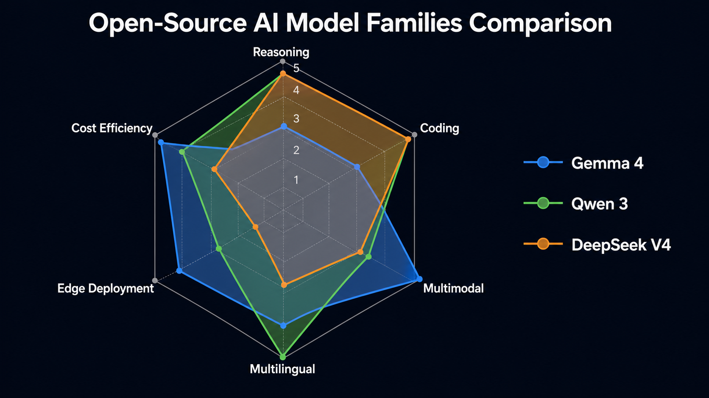

# Day 47: 顶级开源模型深入 — 用架构对比读懂 Gemma 4、Qwen 3、DeepSeek V4

> **核心问题**：不要只问“哪个开源模型最强”。更好的问题是：这些模型为什么会长成今天这样？它们分别把算力、显存、长上下文、多模态、MoE 路由和端侧部署之间的矛盾，压到了哪里？

---

## 开篇

上一篇文章讨论了开源 vs 闭源的整体格局。今天我们不再把 Gemma、Qwen、DeepSeek 当成三个产品名来背，而是把它们当成三种架构路线来比较：

- **Gemma 4**：端侧优先，把“能在普通设备上跑”放在第一位。
- **Qwen 3**：通用能力优先，用 dense + MoE 的完整矩阵覆盖不同规模，并强调 thinking / non-thinking 的统一。
- **DeepSeek V4**：长上下文和推理效率优先，用更激进的稀疏化、压缩注意力和工程优化，把 1M context 变成常规能力。

读完这篇，你应该能学会一件更通用的事：**看到一个新开源模型时，如何从架构表判断它真正适合什么，而不是被 benchmark 排名牵着走。**

---

## 1. 先建立读模型的坐标系

一个 LLM 的“架构性格”，通常不是由单个指标决定的，而是由五组取舍共同决定：

| 维度 | 要问的问题 | 影响什么 |
|------|------------|----------|
| 参数组织 | Dense 还是 MoE？总参数和活跃参数差多少？ | 知识容量、推理成本、部署门槛 |
| Attention | MHA、GQA、MLA、稀疏注意力、压缩注意力？ | 长上下文成本、KV cache、吞吐 |
| 长上下文 | 靠 RoPE 外推、滑动窗口、压缩 KV，还是专门训练？ | RAG、代码仓库理解、长文档任务 |
| 多模态 | 独立 encoder、轻量 embedder，还是 encoder-free？ | 视觉/音频延迟、微调复杂度 |
| 后训练 | SFT、RLHF/RLAIF、thinking mode、agent 数据？ | 指令跟随、推理深度、工具调用 |

很多模型介绍只讲“跑分高”。但工程上更关键的是：**这个分数是用什么成本换来的？**

例如：

- 一个 235B MoE 模型如果每 token 只激活 22B 参数，算力成本接近 22B，但显存仍要容纳 235B 权重。
- 一个 1M context 模型如果仍保留完整 KV cache，显存和带宽会快速爆炸；它必须在 attention 结构上做压缩或稀疏化。
- 一个端侧模型如果追求手机可运行，就不能只堆参数；它必须在量化、局部 attention、多模态输入路径和推理 runtime 上一起设计。

这就是为什么我们要用“对比学习”的方式读 Gemma、Qwen、DeepSeek。

---

## 2. Gemma 4：端侧模型不是“小模型”，而是另一套系统设计

### 2.1 Why：为什么 Google 要把 Gemma 做成端侧优先？

很多开源模型的默认假设是：你有一张或多张数据中心 GPU。Gemma 的默认假设不同：**模型要能进入手机、笔记本、浏览器、边缘设备和本地 agent。**

这带来两个约束：

1. **显存预算很小**：手机和普通笔记本无法承受大模型权重和长上下文 KV cache。
2. **延迟比峰值能力更重要**：端侧应用常常需要即时响应，不能每次都把请求发到云端。

所以 Gemma 的重点不是“最大模型有多大”，而是“在有限硬件上如何保留尽可能多的能力”。

### 2.2 How：从 Gemma 3 到 Gemma 4 的演进

Gemma 3 已经展示了这条路线：模型规模覆盖 1B、4B、12B、27B，引入视觉理解、至少 128K context，并通过更多局部 attention 层来降低长上下文 KV cache 压力。Gemma 3 技术报告明确指出，它通过提高 local/global attention 的比例、缩短 local attention 的 span 来控制 KV cache 增长。

Gemma 4 继续往端侧 agent 方向推进。官方发布信息强调三件事：

- **Apache 2.0**：商业使用友好。
- **端侧 agent**：多步规划、离线代码生成、视觉/音频处理可以在设备上完成。
- **Gemma 4 12B 的 encoder-free 多模态**：传统多模态模型常用独立视觉 encoder / 音频 encoder，再把特征投给 LLM；Gemma 4 12B 试图把多模态输入直接接入 decoder-only backbone，减少多 encoder 带来的延迟和内存碎片。

### 2.3 What：Gemma 路线的关键架构点

**1. 局部 + 全局 attention 的混合**

Gemma 3 的典型设计是 5 个 local sliding-window attention 层配 1 个 global attention 层。local 层只看附近窗口，global 层周期性整合全局信息。

直觉上可以这样理解：

```text
Local layers:  低成本地处理邻近上下文
Global layer:  偶尔做一次全局信息同步
```

这和人读长文有点像：大部分时候按段落局部理解，偶尔回到全文结构做整合。它牺牲了“每一层都看全局”的表达自由度，换来更低的 KV cache 和更稳定的长上下文成本。

**2. GQA 降低 KV cache**

Grouped Query Attention (GQA) 让多组 query heads 共享较少的 key/value heads。它的好处不是让模型更聪明，而是让 KV cache 更小、推理更快。端侧模型尤其需要这种优化，因为 memory bandwidth 往往比 FLOPs 更先成为瓶颈。

**3. 多模态输入路径变短**

Gemma 4 12B 的 encoder-free 方向值得注意：传统 VLM 需要“图像 encoder -> projector -> LLM”，音频也类似。Gemma 4 12B 用更轻的视觉 embedder 和音频 wave projection，把图像 patch / 音频帧更直接地变成 LLM token 空间中的输入。这样做的优势是：

- 延迟更低；
- 端侧内存碎片更少；
- LoRA 或 full fine-tuning 时，不需要同时协调多个大型 frozen encoder。

### 2.4 学到什么？

Gemma 告诉我们：**小模型不是大模型的缩水版。真正好的端侧模型是从 attention、KV cache、多模态输入、量化和 runtime 一起设计出来的。**

当你看到一个模型声称“适合端侧”，不要只看参数量，还要问：

- 它的 KV cache 怎么控制？
- attention 是全局的、局部的，还是混合的？
- 多模态是否依赖笨重 encoder？
- 官方是否提供 LiteRT、MediaPipe、llama.cpp、Ollama 等真实端侧路径？

---

## 3. Qwen 3：能力矩阵的核心不是“模型多”，而是 dense/MoE 统一设计

### 3.1 Why：为什么 Qwen 需要这么多模型？

Qwen 的路线和 Gemma 不一样。Gemma 先问“怎样在设备上跑”，Qwen 先问“怎样覆盖尽可能多的能力边界”：通用推理、代码、多语言、agent、长上下文、不同显存档位。

这就是 Qwen 3 同时发布 dense 和 MoE 的原因：

- **Dense 模型**：结构简单，部署和 fine-tuning 更直接，适合中小规模和确定性部署。
- **MoE 模型**：用更大的总参数承载知识容量，但每 token 只激活一部分专家，适合追求更高能力/成本比。

### 3.2 How：Qwen 3 的基础结构

Qwen 3 技术报告给出的 dense 架构并不神秘：GQA、SwiGLU、RoPE、RMSNorm、pre-normalization。这些已经是现代 decoder-only LLM 的主流配置。

真正值得注意的是两个变化：

1. **去掉 QKV bias，引入 QK-Norm**  
   QK-Norm 用来稳定 attention query/key 的尺度，降低大规模训练时 attention logits 爆掉的风险。

2. **MoE 和 dense 共享基础设计**  
   Qwen 3 MoE 不是另起炉灶，而是在同一套 transformer 结构上替换 FFN 部分：把原来的 dense FFN 换成多个 expert FFN，再由 router 为每个 token 选择专家。

### 3.3 What：Qwen 3 MoE 到底在做什么？

以 Qwen3-235B-A22B 为例：

| 指标 | 数值 |
|------|------|
| 总参数 | 235B |
| 每 token 活跃参数 | 22B |
| 层数 | 94 |
| Attention heads | Q 64 / KV 4 |
| Experts | 128 total / 8 activated |
| Context | 128K |

这里有三个关键点。

**1. MoE 的“省”只省计算，不省权重存储**

235B-A22B 的意思是：模型总共有 235B 参数，但每个 token 只激活约 22B 参数。推理时的矩阵乘法成本接近 22B dense 模型，但显存仍然要放下 235B 权重。

所以 MoE 适合云端和多 GPU 服务，不等于适合本地单卡。

**2. 128 个专家，每 token 选 8 个**

Router 会为每个 token 选择 top-8 experts。理想状态下，不同专家会学到不同能力区域：代码、数学、多语言、格式化、工具调用、领域知识等。但路由有两个麻烦：

- 如果某些专家总被选中，会造成负载不均；
- 如果强行加入负载均衡损失，又可能伤害模型能力。

Qwen 3 使用 global-batch load balancing loss 来鼓励专家分工。它不是没有成本的技巧，而是在“专家专精”和“设备负载均衡”之间找平衡。

**3. 没有 shared experts**

Qwen 3 技术报告提到，Qwen3-MoE 不再使用 Qwen2.5-MoE 中的 shared experts。shared expert 的作用通常是兜底通用能力；去掉它意味着模型更依赖 router 把 token 分给合适专家。这会让专家分工更彻底，但也更考验路由训练。

### 3.4 Thinking / Non-thinking：不是 prompt 花样，而是推理预算控制

Qwen 3 的一个重要产品化设计是统一 thinking 和 non-thinking 模式。它背后的核心问题是：**同一个模型，什么时候应该快速回答，什么时候应该花更多 token 做推理？**

这不是简单的“输出 chain-of-thought”。更准确地说，它是在控制 test-time compute：

```text
简单问题：少量推理 token -> 低延迟、低成本
复杂问题：更多推理 token -> 更高正确率、更高成本
```

这条路线对开发者很重要，因为未来模型选型不只是“选哪个模型”，还包括“给它多少推理预算”。

### 3.5 学到什么？

Qwen 告诉我们：**MoE 的核心不是参数越大越好，而是 router、专家粒度、负载均衡、上下文长度和后训练共同决定能力/成本曲线。**

看到一个 MoE 模型时，至少要问：

- total params 和 active params 分别是多少？
- 每层有多少 experts？每 token 选几个？
- 有没有 shared experts？
- 负载均衡靠 auxiliary loss、global-batch loss，还是其他机制？
- thinking mode 是否只是 prompt，还是训练和服务系统都支持的推理预算机制？

---

## 4. DeepSeek V4：把 1M context 做便宜，才是真正的架构问题

### 4.1 Why：为什么长上下文会变成 DeepSeek 的主战场？

普通聊天 8K、32K 已经够用，但 agent、代码仓库理解、企业知识库、长文档分析、长期任务执行需要更长上下文。问题是：Transformer 的 attention 和 KV cache 对长上下文非常敏感。

如果上下文从 128K 拉到 1M，真正麻烦的不是“能不能塞进去”，而是：

- prefill 成本会非常高；
- decode 时每生成一个 token 都要访问巨大的历史 KV；
- KV cache 会吃掉大量显存；
- 多用户服务时，缓存调度和前缀复用会变成系统瓶颈。

DeepSeek V4 的重点正是：**让 1M context 不只是 demo，而是可以常规服务的能力。**

### 4.2 How：从 DeepSeek V3 到 V4

DeepSeek V3 已经奠定了三块基础：

- **DeepSeekMoE**：671B total / 37B active，用稀疏专家降低每 token 计算量。
- **MLA (Multi-head Latent Attention)**：压缩 key/value 表示，降低 KV cache。
- **MTP (Multi-Token Prediction)**：训练时预测多个未来 token，增强训练信号，也可用于 speculative decoding。

DeepSeek V4 在此基础上继续推进，技术报告给出两个模型：

| 模型 | 总参数 | 活跃参数 | 上下文 |
|------|--------|----------|--------|
| DeepSeek-V4-Pro | 1.6T | 49B | 1M |
| DeepSeek-V4-Flash | 284B | 13B | 1M |

它新增的重点包括：

- **CSA + HCA 混合注意力**；
- **mHC (Manifold-Constrained Hyper-Connections)**；
- **Muon optimizer**；
- routed expert 使用更低精度；
- 更复杂的 KV cache 管理和长上下文推理系统。

### 4.3 What：CSA + HCA 为什么重要？

DeepSeek V4 技术报告把 attention 分成两类：

**CSA (Compressed Sparse Attention)**  
先把每 m 个 token 的 KV 压缩成一个 entry，再让 query 只 attend 到 top-k 个压缩 entry。也就是：

```text
长序列 -> 分块压缩 KV -> 稀疏选择相关块 -> attention
```

它同时做了两件事：

- 压缩序列长度；
- 不再对所有历史块做 dense attention。

**HCA (Heavily Compressed Attention)**  
更激进地把更长片段压缩成一个 KV entry，但保留 dense attention。它适合提供粗粒度的全局记忆。

两者组合的直觉是：

```text
CSA：保留较细粒度的可检索历史，但只看相关部分
HCA：保留更粗粒度的全局历史摘要
```

这比简单的 sliding window 更强，因为 sliding window 会直接丢掉远处细节；也比全局 attention 便宜，因为全局 attention 在 1M context 下成本太高。

### 4.4 mHC：为什么残差连接也要升级？

Transformer 的 residual connection 看似普通，但当模型极深、MoE 极大、训练 token 极多时，信号在层间传播的稳定性会变得很重要。

DeepSeek V4 使用 mHC 来增强传统 residual connection。粗略理解：它不是简单地把上一层输出加回来，而是用受约束的映射来混合多条状态路径，并通过数学约束保持稳定。技术报告提到它将 residual mapping 约束到 doubly stochastic matrices 所在的 manifold，以稳定层间信号传播。

这类改动提醒我们：大模型 scaling 到后期，创新不只发生在 attention 和 MoE，也会发生在看起来“不起眼”的连接结构和优化器上。

### 4.5 Muon optimizer：训练效率也是架构的一部分

DeepSeek V4 使用 Muon optimizer 更新大部分模块，只在 embedding、prediction head、RMSNorm 等部分保留 AdamW。Muon 的目标是更快收敛和更稳定训练。

对课程读者来说，不必记住 Muon 的算法细节，但要记住这个判断：**当模型规模进入万亿级 MoE 后，优化器、并行策略、checkpointing、kernel、KV cache 存储，都不再是“工程细节”，而是模型能力能否落地的一部分。**

### 4.6 学到什么？

DeepSeek 告诉我们：**长上下文不是把 context window 数字写大，而是 attention、KV cache、稀疏路由、低精度、推理系统一起解决的问题。**

看到一个模型宣传 1M context，要问：

- 训练时是否真的覆盖长上下文？
- attention 是 dense、sparse，还是 compressed sparse？
- KV cache 如何压缩和存储？
- 1M 下的 single-token decode 成本是多少？
- 长上下文 benchmark 是 synthetic retrieval，还是真实文档/代码/agent 场景？

---

## 5. 三条路线放在一起看


*图 1：三大开源模型家族的能力画像。现在再看这张图，重点不是谁面积更大，而是每个形状背后的架构取舍。*

| 问题 | Gemma 4 | Qwen 3 | DeepSeek V4 |
|------|---------|--------|-------------|
| 首要目标 | 端侧可用、本地 agent | 综合能力矩阵 | 1M context 与推理效率 |
| 参数路线 | 小/中模型 + 端侧优化 | Dense + MoE 全矩阵 | 大规模 MoE + 高稀疏 |
| Attention 重点 | local/global 混合、GQA | GQA、QK-Norm、RoPE | CSA + HCA、压缩/稀疏 attention |
| MoE 重点 | 部分型号使用轻量 MoE | 128 experts / top-8，global-batch balance | DeepSeekMoE，极高 total/active 比 |
| 多模态路线 | 端侧视觉/音频，12B encoder-free | 部分模型支持视觉，代码/agent 强 | 主要聚焦文本、推理、长上下文 |
| 适合场景 | 手机、笔记本、离线、本地隐私 | 多语言、代码、通用 agent | 长文档、代码仓库、低成本推理、复杂推理 |
| 核心风险 | 绝对能力上限 | 变体复杂、部署门槛 | 系统复杂、延迟和服务工程要求高 |

这三条路线不是简单的强弱关系，而是三种不同的答案：

- Gemma 4 问：**能不能把 agent 带到设备上？**
- Qwen 3 问：**能不能用一套模型矩阵覆盖最多能力场景？**
- DeepSeek V4 问：**能不能把超长上下文和强推理做得足够便宜？**

---

## 6. 为什么有些模型支持多模态，有些不支持？

多模态不是在文本模型旁边“加一个摄像头”这么简单。它至少需要解决三件事：

1. **输入表示**：图像 patch、音频帧、视频帧要先变成 LLM 能处理的 token-like representation。
2. **跨模态对齐**：模型要学会把视觉/音频特征和语言概念对齐，例如“这张图里的表格”和文本里的 row / column 对应起来。
3. **推理成本**：图像和音频会引入大量额外 token 或特征，长上下文、KV cache、batching 都会变贵。

所以，一个模型家族是否支持多模态，通常取决于它的主目标。

**Gemma 4 更适合把多模态做进核心路线**，因为它的目标是端侧 agent。手机、浏览器和本地助手天然会遇到相机、截图、录音、屏幕理解这些输入。如果 Gemma 只做文本，就很难支撑“设备上的 agent”。因此它会强调轻量视觉/audio 输入路径，甚至探索 encoder-free 或近似 encoder-free 的方式，减少端侧延迟和内存压力。

**Qwen 3 是“部分模型多模态，部分模型专精文本/代码”**。原因是 Qwen 的核心不是单一路线，而是模型矩阵：有些变体负责视觉语言任务，有些变体负责 coding、agentic coding、数学、多语言和 thinking。视觉能力需要额外数据、encoder/embedder、对齐训练和评测体系；如果一个模型主要面向代码 agent，把预算放在 repo 数据、tool-use 数据和代码执行反馈上，往往比加入图像输入更划算。

**DeepSeek V4 更偏文本、推理和长上下文**，不是因为多模态“不重要”，而是因为它的主要架构问题已经很重：1M context、压缩/稀疏 attention、MoE 路由、KV cache、低成本服务。多模态会进一步增加输入 token 和缓存压力，和“把超长文本上下文做便宜”这个目标存在资源竞争。对于 DeepSeek 这条路线，先把文本长上下文和推理成本打穿，比同时加入视觉/audio 更符合它的技术主线。

可以用一句话概括：

| 模型家族 | 多模态能力为什么这样设计？ |
|---------|----------------------------|
| Gemma 4 | 端侧 agent 需要看图、听音频、理解屏幕，所以多模态是核心能力的一部分 |
| Qwen 3 | 模型矩阵覆盖不同任务，视觉是其中一条分支，不是所有型号都必须支持 |
| DeepSeek V4 | 技术预算主要投向文本推理、1M context 和低成本服务，多模态会加重 KV/cache 和训练复杂度 |

这也是读模型时很重要的一点：**“不支持多模态”不一定代表落后，有时只是架构预算被投到了另一条能力曲线上。**

---

## 7. 实战选型：从“排行榜”改成“约束反推”

### 7.1 如果你要做本地应用

优先看 Gemma。

原因不是它永远最强，而是它的系统假设和你一致：端侧 runtime、量化、低延迟、多模态输入、本地 API server，这些都比纯 benchmark 更关键。

适合：

- 本地写作助手；
- 离线会议记录；
- 手机端视觉问答；
- 隐私敏感的个人知识库；
- 本地 coding / data analysis 小工具。

### 7.2 如果你要做通用 AI 产品

优先看 Qwen。

它的优势是模型矩阵完整：从小 dense 到大 MoE，从通用模型到 coder，从 non-thinking 到 thinking。你可以从小模型原型开始，再逐步换到更大模型，而不是一开始就被某个单点模型锁死。

适合：

- 多语言客服；
- 代码助手；
- 企业内部 agent；
- 需要 fine-tuning 的行业模型；
- 既要成本可控又要保留升级路径的产品。

### 7.3 如果你要做长上下文和高强度推理

优先看 DeepSeek。

尤其是这些场景：

- 代码仓库级理解；
- 大型 PDF / 合同 / 研报分析；
- 长周期 agent 任务；
- 成本敏感的大规模 API 调用；
- 数学、科学、工程推理。

DeepSeek 的关键价值不是“便宜”，而是它把便宜做成了架构结果：MoE 稀疏化、KV 压缩、长上下文 attention、低精度训练/推理和服务系统共同作用。

---

## 8. 常见误区

### 误区 1：“MoE 就一定更省”

MoE 省的是每 token 计算，不一定省显存。总参数越大，权重存储越重；专家分布在多卡上时，还会引入通信成本。

### 误区 2：“1M context 就等于会读 1M”

不等于。长上下文能力至少有三层：

- 训练和位置编码是否支持；
- attention / KV cache 是否撑得住；
- 模型是否真的能在长文档中稳定检索、归纳和推理。

很多模型能“放进”长文本，但不能“用好”长文本。

### 误区 3：“端侧模型就是能力弱”

端侧模型的目标函数不同。它追求的是隐私、低延迟、离线、低成本和可嵌入，而不是在所有 benchmark 上赢最大云端模型。对许多真实应用来说，这些约束比 2-3 个百分点的 benchmark 差距更重要。

### 误区 4：“开源模型只是在复刻闭源”

现在已经不是这样。Gemma 在端侧 agent，Qwen 在开源 MoE 矩阵和 agentic coding，DeepSeek 在长上下文效率和稀疏化工程上，都有自己的路线。开源模型不只是闭源模型的廉价替代品，而是在一些工程方向上反过来推动前沿。

---

## 9. 延伸阅读

### 官方资料与技术报告

1. [Gemma 4 launch: Bring state-of-the-art agentic skills to the edge](https://developers.googleblog.com/bring-state-of-the-art-agentic-skills-to-the-edge-with-gemma-4/)
2. [Gemma 4 12B: The Developer Guide](https://developers.googleblog.com/gemma-4-12b-the-developer-guide/)
3. [Gemma 3 Technical Report](https://arxiv.org/abs/2503.19786)
4. [Qwen3 Technical Report](https://arxiv.org/abs/2505.09388)
5. [Qwen3: Think Deeper, Act Faster](https://qwenlm.github.io/blog/qwen3/)
6. [Qwen3-Coder: Agentic Coding in the World](https://qwenlm.github.io/blog/qwen3-coder/)
7. [DeepSeek V4 Preview Release](https://api-docs.deepseek.com/news/news260424)
8. [DeepSeek-V4 Technical Report](https://huggingface.co/deepseek-ai/DeepSeek-V4-Pro/blob/main/DeepSeek_V4.pdf)
9. [DeepSeek-V3 Technical Report](https://arxiv.org/abs/2412.19437)

---

## 思考题

1. 如果你要为一个本地知识库选择模型，为什么“最大参数量”可能不是第一指标？
2. Qwen3-235B-A22B 的 active params 只有 22B，但为什么它仍然不适合普通消费级单卡？
3. DeepSeek V4 的 CSA + HCA 和 Gemma 的 local/global attention 都在降低长上下文成本。它们分别牺牲了什么，又保留了什么？
4. 如果未来模型都支持 thinking mode，产品定价应该按输入输出 token 收费，还是按 reasoning effort 收费？

---

## 总结

| 模型家族 | 一句话定位 | 你真正该学到的架构知识 |
|---------|-----------|--------------------------|
| Gemma 4 | 端侧 agent 路线 | 端侧能力来自 KV cache、局部 attention、多模态输入路径和 runtime 的共同设计 |
| Qwen 3 | 开源能力矩阵路线 | MoE 的关键是 total/active params、router、专家粒度、负载均衡和推理预算 |
| DeepSeek V4 | 长上下文效率路线 | 1M context 需要压缩/稀疏 attention、KV cache 工程、低精度和训练系统协同 |

**核心要点**：顶级开源模型的差异，已经不只是“谁的 benchmark 更高”。Gemma、Qwen、DeepSeek 分别代表端侧化、能力矩阵化、长上下文效率化三条路线。真正的学习价值，是从它们的架构选择中理解：LLM 能力永远是在算力、显存、延迟、数据、训练稳定性和服务系统之间做取舍。

---

*Day 47 of 60 | LLM Fundamentals*
*Length: ~11,500 Chinese characters | Reading time: ~25 minutes*
