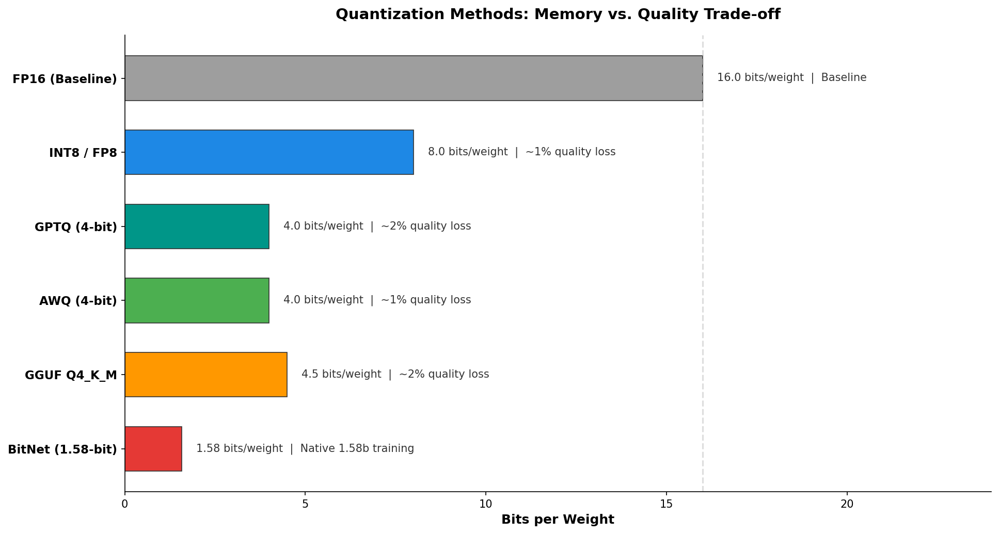
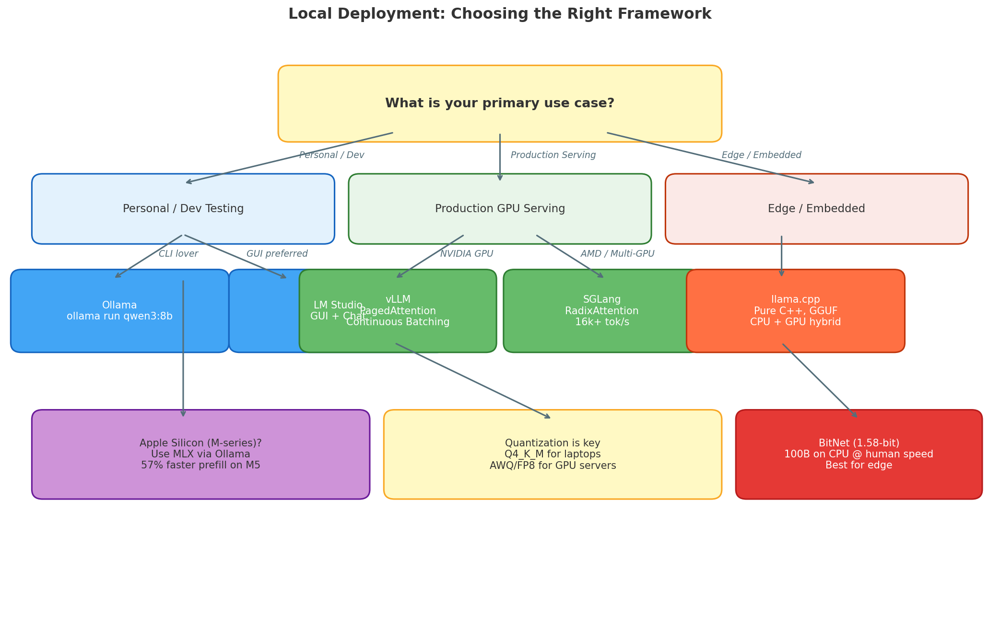
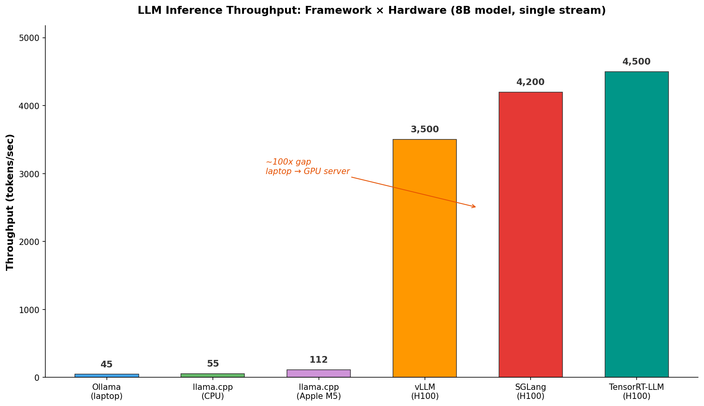

# Day 48: 本地部署 —— 在自己的硬件上运行 LLM

> **核心问题**: 怎样在自己的机器上 —— 从笔记本到 GPU 服务器 —— 运行大语言模型，而不依赖云端 API？

---

## 开篇

想象你在给产品做 AI 功能。用 OpenAI API 做原型，效果很好。然后账单来了 —— 生产环境每秒处理几千个请求，每月 API 费用轻松破千美元。更糟的是，每条用户消息都要离开你的基础设施，跑到别人的数据中心。

本地部署翻转了这个等式：你在自己控制的硬件上运行模型，只交电费，数据永远不离开你的网络。到了 2026 年，这已经不是极客的玩具了 —— 它是一个有成熟工具链、高质量开源模型和量化技术支撑的工程决策，让你在 MacBook 上就能跑一个够用的 LLM。

本文覆盖完整技术栈：量化（怎么把模型压缩到塞进你的硬件）、主流框架（Ollama、vLLM、llama.cpp、MLX、SGLang），以及一个帮你选择合适方案的选择框架。

---

## 1. 三层架构

#### 直觉：餐厅后厨

把本地部署想象成开一家餐厅后厨。**硬件**是厨房本身 —— 烤箱、炉灶、操作台。**引擎**是烹饪技法 —— 你怎么高效地使用这些工具。**体验层**是菜单和服务 —— 顾客（你的应用）直接交互的东西。你可以有一个好厨房（GPU）但技法差（推理效率低），也可以在一个普通厨房（CPU）里用聪明的做法（量化）做出好菜。


*图 1：三层本地 LLM 生态。每个体验层工具封装一个或多个引擎，引擎再指向特定的硬件平台。*

这个生态已经形成了清晰的三层架构：

| 层级 | 工具 | 角色 |
|------|------|------|
| **体验层** | Ollama、LM Studio、Open WebUI | 面向用户的界面：CLI、GUI 或 Web |
| **引擎层** | llama.cpp、MLX、vLLM、SGLang | 推理后端：实际计算 token 的组件 |
| **硬件层** | CPU、Apple Silicon、NVIDIA GPU、AMD GPU | 物理计算：内存带宽是关键 |

一个关键洞察：**大多数体验层工具只是引擎的薄封装**。Ollama 封装了 llama.cpp（2026 年 3 月起在 Apple Silicon 上也封装了 MLX）。LM Studio 封装了 llama.cpp。当你选择 Ollama 时，你本质上是在 llama.cpp 的原始能力之上选择了一个方便的 API。

---

## 2. 量化：让模型塞进硬件

#### 直觉：压缩照片

一张 1200 万像素的照片保存为 RAW 格式大约 36 MB。同样的照片保存为高质量 JPEG 大约 3 MB —— 12 倍压缩。你能看出区别吗？大多数人看不出来。LLM 量化的原理一样：把模型权重从 16 位浮点数降低到 4 位整数，模型体积缩小约 4 倍，质量损失极小。

### 2.1 为什么量化很重要

一个未量化的 8B 参数模型在 FP16 下需要约 16 GB 内存才能加载权重。一个 70B 模型需要约 140 GB。这超过了大多数消费级 GPU 的显存。量化把权重压缩到更少的位数，减少内存需求，而且往往还能提升推理速度 —— 因为更小的数意味着更快的内存传输（内存带宽，而不是计算量，通常是 LLM 推理的瓶颈）。

### 2.2 量化方法全景


*图 2：量化方法的内存与质量权衡。每权重比特数越低，内存占用越少，但质量可能下降更多。*

| 方法 | 比特数/权重 | 质量损失 | 适用场景 | 格式 |
|------|------------|---------|---------|------|
| **FP16** | 16 | 基线 | 开发调试，最高质量 | 原生 |
| **FP8** | 8 | ~1% | GPU 服务器（H100、MI300X） | 原生 |
| **AWQ** | 4 | ~1% | GPU 推理服务（vLLM、SGLang） | .pt / safetensors |
| **GPTQ** | 4 | ~2% | GPU 推理，模型支持广泛 | .pt / safetensors |
| **GGUF Q4_K_M** | ~4.5 | ~2% | CPU + GPU 混合，笔记本 | .gguf |
| **BitNet** | 1.58 | 不定 | 仅 CPU 的边缘场景，原生训练 | 自定义 |

### 2.3 各方法原理

**GGUF（GPT-Generated Unified Format）** 由 [llama.cpp](https://github.com/ggerganov/llama.cpp) 社区开发，是本地部署的事实标准。它把模型权重、tokenizer 和元数据打包成一个文件。K-quant 变体（Q4_K_M、Q5_K_S 等）使用基于重要性的分组：更重要的权重保持更高精度，不太重要的权重被进一步压缩。GGUF 独特地支持 **CPU-GPU 混合推理** —— 如果你的 GPU 有 8 GB 显存但模型需要 12 GB，多余的层可以在 CPU RAM 上运行。

**AWQ（Activation-aware Weight Quantization）**（[论文](https://arxiv.org/abs/2306.00978)，MIT HAN Lab 于 2023 年 6 月提出）发现权重通道中有一小部分（约 1%）格外重要 —— 它们产生大的激活值。AWQ 在量化过程中保护这些关键通道，因此在 4-bit 下只损失约 1% 的质量。它是 2026 年 vLLM 和 SGLang 部署的推荐量化格式。

**GPTQ（Generative Pre-trained Transformer Quantization）**（[论文](https://arxiv.org/abs/2210.17323)，ETH Zurich 和 UW-Madison 的研究者于 2022 年 10 月提出）使用近似二阶信息（Hessian 矩阵）逐层量化权重，同时最小化重建误差。2026 年，**MatGPTQ**（[论文](https://arxiv.org/abs/2602.03537)，2026 年 2 月）在此基础上改进，在 3-bit 下准确率提升了 1.34%，并支持每层异构比特宽度。

**BitNet**（[论文](https://arxiv.org/abs/2310.11453)，Microsoft Research 于 2023 年 10 月提出）走了一条根本不同的路：不是量化一个已经训练好的模型，而是**原生在 1.58-bit 下训练**（三值权重：-1、0、+1）。[BitNet.cpp](https://github.com/microsoft/BitNet) 框架在 2026 年 1 月的优化更新中，可以在单个 CPU 上以人类阅读速度（5-7 tokens/sec）运行 100B 参数模型 —— 通过用简单的加法替代浮点乘法实现。

### 2.4 如何选择量化等级

实用指南：

| 你的硬件 | 模型大小 | 推荐量化 | 所需内存 |
|---------|---------|---------|---------|
| 笔记本（16 GB RAM） | 8B | GGUF Q4_K_M | ~5 GB |
| 笔记本（32 GB RAM） | 14B | GGUF Q5_K_M | ~10 GB |
| MacBook M 系列（16 GB） | 8B | GGUF Q4_K_M via Ollama | ~5 GB |
| MacBook M 系列（64 GB） | 70B | GGUF Q3_K_M | ~35 GB |
| NVIDIA RTX 4090（24 GB） | 8B | AWQ 4-bit | ~5 GB |
| NVIDIA H100（80 GB） | 70B | FP8 或 AWQ 4-bit | ~40 GB |

---

## 3. 框架详解

### 3.1 Ollama：开发者的入口

[Ollama](https://ollama.com) 是开始使用本地 LLM 最简单的方式。一条命令安装，一条命令运行：

```bash
# 安装（macOS/Linux）
curl -fsSL https://ollama.com/install.sh | sh

# 运行模型（自动下载）
ollama run qwen3:8b

# 使用 OpenAI 兼容 API
curl http://localhost:11434/v1/chat/completions \
  -d '{"model":"qwen3:8b","messages":[{"role":"user","content":"你好"}]}'
```

**Ollama 的特别之处**：它会自动为你的硬件选择最佳量化。你不需要理解 GGUF 变体或内存计算 —— 只需 `ollama run` 就能工作。

2026 年 3 月，Ollama 在 Apple Silicon 上将默认引擎从 llama.cpp 切换为 **Apple 的 MLX 框架**，在 M5 芯片上实现了 57% 的 prefill 加速和 93% 的 decode 加速（从 58 提升到 112 tokens/sec，测试模型 Qwen3.5-35B-A3B）。

**局限**：Ollama 针对单用户场景优化。如果需要处理并发请求的生产环境服务，你需要 vLLM 或 SGLang 这样的专业服务引擎。

### 3.2 llama.cpp：基础设施

[llama.cpp](https://github.com/ggerganov/llama.cpp) 是启动本地 LLM 革命的 C/C++ 推理引擎。由 Georgi Gerganov 于 2023 年 3 月创建，它证明了 transformer 推理不需要 GPU —— 一个经过良好优化的 CPU 实现（使用 AVX/NEON 指令）也能跑起可用的模型。

**为什么它重要**：llama.cpp 是 Ollama、LM Studio 和许多其他工具底层的引擎。理解它有助于理解整个生态系统。它支持最广泛的硬件：x86 CPU（AVX、AVX2、AVX512）、ARM CPU（NEON）、Apple Metal、NVIDIA CUDA、AMD HIP/ROCm 和 Vulkan。

2026 年的主要更新：
- **GPU token sampling** —— 将采样移至 GPU，降低延迟
- **RPC sharding** —— 将大模型分片到多台联网机器
- **Speculative decoding** —— 使用小模型作为 draft model 加速生成

### 3.3 vLLM：生产级 GPU 服务

[vLLM](https://github.com/vllm-project/vllm) 是为生产环境 GPU 服务设计的高吞吐推理引擎。核心创新是 **PagedAttention**（在 [vLLM 论文](https://arxiv.org/abs/2309.06180)中提出，2023 年 10 月），它像虚拟内存系统一样管理 KV cache，消除内存碎片，实现比朴素实现高 14-24 倍的吞吐量。

```bash
# 用 AWQ 量化模型启动 vLLM 服务
python -m vllm.entrypoints.openai.api_server \
  --model TheBloke/Llama-2-7B-Chat-AWQ \
  --quantization awq \
  --tensor-parallel-size 2 \
  --max-model-len 8192
```

**2026 年进展**：
- **Model Runner V2 (MRV2)**：在 NVIDIA GB200 硬件上吞吐量提升高达 56%
- **FP8 推理**：在 H100 和 Blackwell GPU 上原生支持，使用 FP8 KV cache 将有效上下文容量翻倍
- **Speculative decoding**：内置支持 EAGLE、n-gram 和 DFlash draft 模型
- **多平台**：从 CUDA 扩展到 AMD ROCm、Google TPU 和 Apple Silicon

### 3.4 SGLang：性能挑战者

[SGLang](https://github.com/sgl-project/sglang) 在 2026 年成为 vLLM 的主要竞争者。PremAI 的基准测试显示，SGLang 在小模型上达到约 16,200 tokens/sec，而 vLLM 为约 12,500 tokens/sec —— 吞吐量领先 29%。SGLang 通过 **RadixAttention** 实现这一点：它在不同请求之间缓存和复用 KV cache 前缀（类似于基数树共享公共前缀的原理）。

SGLang 和 LMDeploy（来自 InternLM 的另一个高性能引擎）目前是吞吐量领跑者，vLLM 通过 MRV2 更新正在缩小差距。

### 3.5 Apple MLX：芯片级优化推理

[MLX](https://github.com/ml-explore/mlx) 是 Apple 为 Apple Silicon 上的机器学习开发的开源数组框架，专门利用统一内存架构（CPU 和 GPU 共享同一内存池）。在 [WWDC 2025](https://developer.apple.com/videos/play/wwdc2025/) 上，Apple 正式将 MLX 定位为 Apple Silicon 上的首选 LLM 推理框架。

[Apple 2026 年 1 月的研究](https://arxiv.org/abs/2601.19139)主要结果：
- 在 M5 上 TTFT（首 token 延迟）比 M4 **快 4.06 倍**（使用 Neural Accelerators）
- token 生成速度比 M4 **快 1.19 倍**
- 量化后的 14B 模型在 M5 上 TTFT 低于 10 秒

`mlx-lm` 包提供了简便的接口：

```python
from mlx_lm import load, generate

model, tokenizer = load("mlx-community/Qwen3-8B-4bit")
response = generate(model, tokenizer, prompt="解释量子计算", verbose=True)
```

---

## 4. 如何选择


*图 3：实用的决策树。从使用场景出发，按硬件缩小范围，再根据可用内存选择量化等级。*

### 4.1 混合模式

在实践中效果很好的一种模式：**用 Ollama 做原型开发，用 vLLM 或 SGLang 部署到生产环境**。因为两者都暴露 OpenAI 兼容的 API，你的应用代码在不同环境之间不需要改变 —— 只需改 base URL。

```python
# 同时兼容 Ollama（本地）和 vLLM（生产）
from openai import OpenAI

client = OpenAI(
    base_url="http://localhost:11434/v1",  # 本地用 Ollama
    # base_url="http://gpu-server:8000/v1",  # 生产用 vLLM
    api_key="not-needed"
)
```

### 4.2 框架对比

| 框架 | 适用场景 | 硬件 | 量化 | 吞吐量 |
|------|---------|------|------|--------|
| **Ollama** | 个人使用、开发测试 | 全部（CPU/GPU/Apple） | GGUF 自动选择 | 低-中 |
| **llama.cpp** | 最大控制权、CPU 优先 | 全部 | GGUF（1.5-8 bit） | 中 |
| **vLLM** | 生产级 GPU 服务 | NVIDIA、AMD | AWQ、GPTQ、FP8 | 非常高 |
| **SGLang** | 高吞吐服务 | NVIDIA | AWQ、GPTQ、FP8、GGUF | 最高 |
| **MLX** | Apple Silicon 优化 | Apple M 系列 | MLX 量化 | 高（Apple 上） |
| **LM Studio** | 非技术用户、GUI | 全部（通过 llama.cpp） | GGUF 自动选择 | 低-中 |


*图 4：8B 模型在不同框架和硬件上的代表性吞吐量。笔记本到 GPU 服务器约 100 倍的差距，解释了为什么生产环境需要专业服务引擎。*

### 4.3 内存才是真正的瓶颈

本地部署中最常见的问题是"我的硬件能跑什么模型？"答案几乎完全取决于**内存**（GPU 的 VRAM、Apple Silicon 的统一内存、CPU 的 RAM）：

$$
\text{内存 (GB)} \approx \frac{\text{参数量} \times \text{每权重比特数}}{8 \times 10^9} + \text{KV Cache} + \text{额外开销}
$$

实际估算：一个 8B 模型用 Q4_K_M 量化需要约 5 GB 存权重，加上约 1-2 GB 的 KV cache（取决于上下文长度），加上约 0.5 GB 额外开销。总共约 7 GB，在 16 GB 内存的笔记本上完全够用。

一个 70B 模型用 Q4_K_M 仅权重就需要约 40 GB。这需要高端 GPU（A100 80GB、H100 80GB）、多 GPU 张量并行，或者 Apple Mac Studio（128+ GB 统一内存）。

---

## 5. 常见误区

### ❌ "本地 LLM 太慢了，没法用"

事实：在 M4 MacBook Pro 上，8B 模型的生成速度是 40-60 tokens/sec —— 比大多数人的阅读速度还快。在 GPU 服务器上，吞吐量可以达到每秒数千 token。"太慢"的名声来自在硬件不足的情况下运行过大的模型。

### ❌ "你需要昂贵的 GPU 才能做本地推理"

事实：一台 16 GB 统一内存的 MacBook 可以跑 8B 模型。BitNet.cpp 在 CPU 上跑 100B 参数模型。真正的问题不是"你有没有 GPU"，而是"你的内存够不够"。

### ❌ "量化会严重损害模型质量"

事实：现代 4-bit 量化（AWQ、GPTQ）在大多数基准测试上保留了原始模型 98-99% 的质量。质量损失是可测量的，但在实际使用中几乎察觉不到。只有在极端压缩（2-bit）时质量才会显著下降。

---

## 6. 前沿：2026 年新动态

1. **Ollama + MLX 集成**（2026 年 3 月）—— Ollama 在 Apple Silicon 上采用 MLX 作为默认引擎，在 M5 上实现 57% 的 prefill 加速和 93% 的 decode 加速。这让 MacBook 可能成为了性价比最高的本地推理平台。（[Ollama 博客](https://ollama.com/blog/mlx)）

2. **MatGPTQ**（2026 年 2 月）—— GPTQ 的演进版，在 3-bit 量化下准确率提升 1.34%，并支持每层异构比特宽度。这意味着你可以给 attention 层分配更多比特，给 FFN 层分配更少比特，优化质量-内存权衡。（[arXiv:2602.03537](https://arxiv.org/abs/2602.03537)）

3. **Sparse-BitNet**（2026 年 3 月）—— Microsoft 将 1.58-bit 三值权重与动态 N:M 半结构化稀疏性结合，在训练和推理中都实现了进一步的加速。（[Microsoft Research](https://www.microsoft.com/en-us/research/publication/sparse-bitnet-1-58-bit-llms-are-naturally-friendly-to-semi-structured-sparsity/)）

4. **vLLM Model Runner V2**（2026 年 4 月）—— 通过 torch.compile 优化的核函数生成和图级变换，在 GB200 硬件上吞吐量提升高达 56%。（[vLLM 文档](https://docs.vllm.ai/)）

5. **SGLang 吞吐量领先**（2026 年）—— SGLang 成为开源服务引擎中的吞吐量领跑者，基准测试显示在 H100 GPU 上跑 8B 模型达到 16,200 tok/s，而 vLLM 为 12,500 tok/s。（[PremAI 基准测试 via techsy.io](https://techsy.io/en/blog/vllm-vs-sglang)）

---

## 7. 延伸阅读

### 入门
1. [Ollama 文档](https://github.com/ollama/ollama) —— 5 分钟开始使用本地 LLM
2. [llama.cpp 示例](https://github.com/ggerganov/llama.cpp/tree/master/examples) —— 从基础对话到 speculative decoding
3. [MLX 示例](https://github.com/ml-explore/mlx-examples) —— Apple Silicon 推理教程

### 进阶
1. [vLLM 文档](https://docs.vllm.ai/) —— 生产服务配置、多 GPU 部署
2. [SGLang 文档](https://github.com/sgl-project/sglang) —— RadixAttention、结构化生成
3. [Apple MLX 研究](https://arxiv.org/abs/2601.19139) —— Apple Silicon 上的 LLM 推理优化（2026 年 1 月）

### 论文
1. ["Efficient Memory Management for Large Language Model Serving with PagedAttention"](https://arxiv.org/abs/2309.06180) —— vLLM 论文（Kwon et al., 2023）
2. ["AWQ: Activation-aware Weight Quantization for LLM Compression and Acceleration"](https://arxiv.org/abs/2306.00978) —— AWQ 论文（Lin et al., 2023）
3. ["GPTQ: Accurate Post-Training Quantization for Generative Pre-trained Transformers"](https://arxiv.org/abs/2210.17323) —— GPTQ 论文（Frantar et al., 2022）
4. ["BitNet: Scaling 1-bit Transformers for Large Language Models"](https://arxiv.org/abs/2310.11453) —— 原生 1.58-bit 训练（Wang et al., 2023）
5. ["MatGPTQ: Generalizable Matrix-wise Pre-conditioning for Quantized LLM Inference"](https://arxiv.org/abs/2602.03537) —— MatGPTQ（2026 年 2 月）

---

## 思考题

1. 如果你要为隐私敏感的医疗应用部署 LLM，除了成本之外，你会如何权衡本地部署和云端 API 的利弊？
2. 为什么内存带宽（而不是原始算力）对 LLM 推理更重要？这对硬件采购决策意味着什么？
3. 混合模式（开发用 Ollama、生产用 vLLM）依赖 API 兼容性。什么情况下这种抽象会出问题？你会怎么处理？

---

## 总结

| 概念 | 一句话解释 |
|------|-----------|
| 量化 | 降低权重精度（16-bit → 4-bit）以缩小模型，质量损失极小 |
| GGUF | 本地部署的通用格式；支持 CPU-GPU 混合推理 |
| AWQ | 激活感知的 4-bit 量化；适合 GPU 服务，质量损失约 1% |
| BitNet | 原生 1.58-bit 训练；通过 BitNet.cpp 在 CPU 上跑 100B 模型 |
| Ollama | 运行本地 LLM 最简单的方式；封装 llama.cpp/MLX，提供简洁 API |
| vLLM | 使用 PagedAttention 的生产级 GPU 服务；并发请求吞吐量最高 |
| SGLang | 2026 年吞吐量领跑者；RadixAttention 实现前缀缓存 |
| MLX | Apple 为 Apple Silicon 开发的框架；M5 上 TTFT 提升 4 倍 |
| 混合模式 | 开发用 Ollama，部署用 vLLM/SGLang；同样 API，不同硬件 |

**核心要点**：2026 年的本地 LLM 部署不再是极客的爱好，而是一个实际的工程选择。量化（尤其是 GGUF 和 AWQ）让模型可以在消费级硬件上运行，Ollama 等框架让操作变得简单，vLLM 和 SGLang 等服务引擎让部署达到生产级。瓶颈几乎总是内存，不是算力 —— 所以根据可用的 RAM/VRAM 选择量化等级，根据你需要单用户便利还是多用户吞吐来选择框架。

---

*Day 48 / 60 | LLM 基础课程*
*字数：约 3200 | 阅读时间：约 15 分钟*
