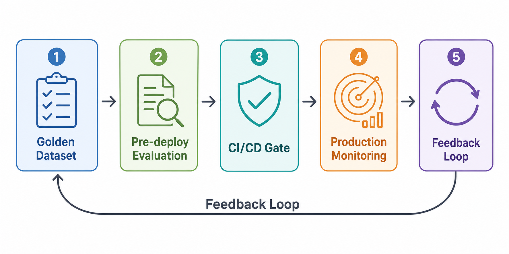
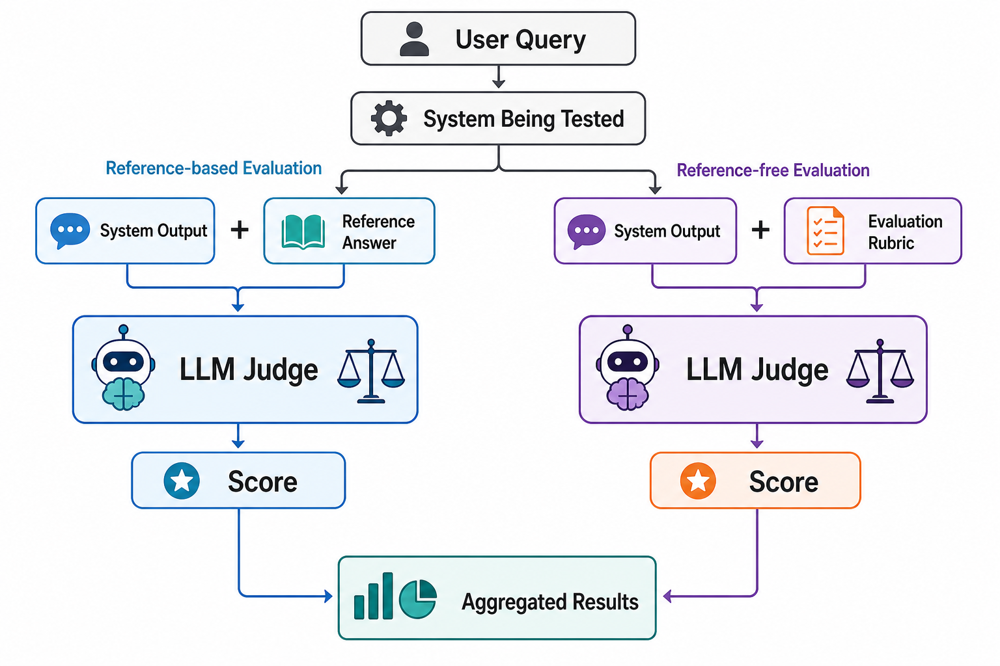
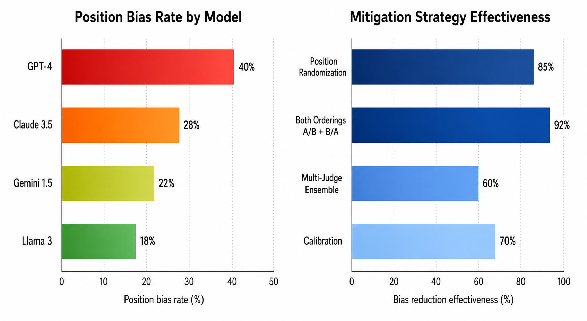
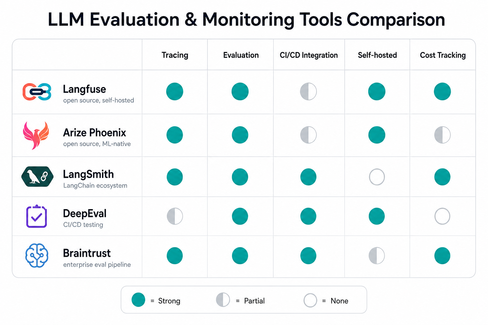

# Day 49: Evaluation 和 Monitoring — 如何确认你的 LLM 应用真的好用

> **核心问题**：你搭好了一个 LLM 应用。怎么在上线路前证明它靠谱——又怎么在生产环境中第一时间发现它出问题了？

---

## Opening

想象你刚上线了一个客服聊天机器人。测试阶段，它每个问题都回答得很漂亮。两周后，一次模型更新悄悄削弱了它处理退款请求的能力。没人注意到，直到客服团队反馈愤怒的用户投诉。

这种场景每天都在发生。LLM 的输出是概率性的、开放式的，对 prompt 的微小变化极其敏感。传统软件里，单元测试要么通过要么失败；但评估一个 LLM 应用，意味着你要在**质量谱系**上判断——流畅度、准确性、安全性、相关性——这些都不是非黑即白的。

好消息是：评估框架、LLM-as-Judge 技术和可观测性平台的生态正在成熟，让这件事变得可操作。本文覆盖从部署前测试到生产监控的完整评估生命周期。

---

## 1. 为什么 LLM 评估不同于传统测试

#### 直觉：餐厅检查员 vs. 美食评论家

传统软件测试就像建筑检查员检查厨房——灶台能打火还是不能，灭火器在不在。二元的、确定性的。

评估 LLM 应用更像做**美食评论家**。菜品不是"能用"或"坏了"——而是关于口味、一致性、安全性和是否达到预期的问题。你需要评分标准、经过训练的评审、以及多次光顾才能形成可靠判断。

三个属性让 LLM 评估从根本上更难：

| 属性 | 传统软件 | LLM 应用 |
|------|---------|---------|
| 输出空间 | 有限、可枚举 | 无限、开放式 |
| 正确性 | 二元（通过/失败） | 连续谱（好 ↔ 坏） |
| 稳定性 | 确定性的 | 随机的，对 prompt 敏感 |

这意味着你不能像传统软件那样靠测试赢得信心。你需要**结构化评估**——指标、数据集、自动化评审——加上**持续监控**来捕捉性能漂移。

---

## 2. 评估生命周期

成熟的 LLM 评估实践涵盖五个阶段，形成一个闭环：


*Caption：五阶段评估生命周期——从 golden dataset 创建到生产监控，再回到起点。*

### 2.1 Golden Dataset

**Golden dataset**（也叫 eval set 或 benchmark set）是一组精心策划的输入-输出对，代表你的应用应该解决好的问题。把它理解为你 LLM 的考试答案标准。

好的 golden dataset 的特征：
- **有代表性**：覆盖真实用户查询的分布，包括边缘情况
- **有标注**：每个输入有预期输出或质量评分标准
- **有版本控制**：变更被追踪，可以跨时间比较
- **持续增长**：生产故障被添加为新的测试用例

通常从 100-500 个样本起步，但大规模团队会维护数千个——每周用生产流量更新。

### 2.2 部署前评估

任何变更到达生产环境之前——不管是 prompt 调整、模型更换、还是检索管线更新——都要跑 golden dataset 并对结果评分。

这时框架就派上用场了：**DeepEval**（开源，pytest 风格的评估运行器，[github.com/confident-ai/deepeval](https://github.com/confident-ai/deepeval)）和 **RAGAS**（RAG 专用指标：faithfulness、context recall、answer relevancy，[github.com/explodinggradients/ragas](https://github.com/explodinggradients/ragas)）。它们结合 reference-based 指标（与标准答案对比）和 reference-free 指标（用 LLM 评审）来自动化评分。

### 2.3 CI/CD 门禁

评估结果进入部署管线。如果聚合分数低于阈值——比如 faithfulness 降到 0.85 以下——部署就被阻断。这把评估从人工审核步骤变成了自动化质量门禁，就像失败的单元测试阻断合并一样。

### 2.4 生产监控

部署之后，你需要对输出质量的实时可见性。这就是 **LLM 可观测性**——追踪每个请求、为每个响应评分、在用户投诉之前发现异常的能力。

### 2.5 反馈闭环

当监控检测到漂移，或者生产事故暴露了新的故障模式，出问题的输入被加入 golden dataset。闭环完成：下一次部署前评估就能在这些具体用例上捕获回归。

---

## 3. LLM-as-a-Judge：核心技术

#### 直觉：作文批改老师

如果你曾经被老师批改过作文，你就能理解 LLM-as-judge。老师（评审 LLM）阅读学生的作品（系统输出），对照评分标准（评估标准）给出分数。老师不需要自己写那篇作文——他们只需要识别质量。

**LLM-as-a-judge** 用一个能力强的 LLM 来评估另一个 LLM 系统的输出。这个想法由 Zheng 等人（2023）在 ["Judging LLM-as-a-Judge with MT-Bench and Chatbot Arena"](https://arxiv.org/abs/2306.05685) 中正式提出，已成为开放式生成任务的主流评估技术。


*Caption：两条评估路径——基于标准答案的对比，以及使用评分标准的 reference-free LLM 评审。*

### 3.1 工作原理

两种主要格式：

1. **单输出评分**：评审 LLM 接收一个输出和评分标准，生成一个分数（例如 faithfulness 1-5 分）。
2. **成对比较**：评审 LLM 接收同一输入的两个输出，判断哪个更好。Chatbot Arena 就是这么运作的——只不过用的是人类投票而不是 LLM 评审。

### 3.2 评分技术

几种提升评审可靠性的技术：

| 技术 | 做什么 | 好处 |
|------|--------|------|
| **Chain-of-thought** | 评审先推理再打分 | 减少随机评分 |
| **G-Eval**（Liu et al., 2023） | 生成评估步骤，然后用概率加权输出打分 | 更校准的分数 |
| **Few-shot rubric** | 在 prompt 中提供已评分的示例 | 锚定评审的评分尺度 |
| **Multi-judge** | 运行 3-5 个评审并聚合 | 降低方差 |

### 3.3 偏差问题

LLM 评审有系统性偏差。2026 年发表在 *Data & Knowledge Engineering* 上的一项综合调查（[Bavaresco et al., 2026](https://www.sciencedirect.com/science/article/pii/S2666675825004564)）记录了多种偏差：

- **位置偏差（Position bias）**：GPT-4 在成对比较中显示约 40% 的位置偏差——它倾向于选择先出现的答案。解决办法：总是随机化答案顺序，或者同时评估 (A,B) 和 (B,A) 两种排列。
- **冗长偏差（Verbosity bias）**：更长的回复被评得更高，不管实际质量如何。
- **自我偏好（Self-preference）**：模型倾向于偏好同族模型的输出。


*Caption：各模型的位置偏差率（左）和缓解策略的有效性（右）。数据综合自 Adaline AI (2026) 和 Li et al. (2025)。*

2026 年 5 月 Adaline AI 的分析发现，虽然 LLM 评审在受控环境中与人类达到约 80% 的一致率，但在类生产条件下，前沿模型在偏差测试上的错误率可能超过 50%（[Adaline AI, 2026](https://www.adaline.ai/blog/llm-as-a-judge-reliability-bias)）。

**实用规则**：在高吞吐量评分场景使用 LLM-as-judge（人工标注不现实的地方），但始终用一个人工标注的子集来校准（通常 100-200 个样本，定期审核），并应用位置随机化。

---

## 4. 按应用类型选择关键指标

不同的 LLM 应用需要不同的指标。不存在通用的"质量分数"。

### 4.1 RAG 应用

RAG 评估使用 **RAG 三元组**——三个覆盖检索-生成管线的指标：

| 指标 | 衡量什么 | 方法 |
|------|---------|------|
| **Faithfulness** | 答案是否基于检索到的上下文？ | 检查答案中的论断是否被上下文段落支持 |
| **Context Relevance** | 检索到的上下文是否真的有用？ | 对检索到的段落与查询的相关性评分 |
| **Answer Relevance** | 答案是否回答了问题？ | 比较答案语义与问题意图 |

RAGAS（[Es et al., 2024](https://arxiv.org/abs/2309.15217)）提供了这些指标的标准化实现。Faithfulness 最关键——它捕获模型编造检索上下文中不存在信息的幻觉问题。

### 4.2 聊天机器人和助手

多轮对话评估需要捕捉跨轮次的连贯性：

- **对话连贯性**：回复是否延续了对话历史？
- **意图识别**：系统是否正确识别并处理了用户的意图？
- **安全性**：回复是否避免了有毒、有害或有偏见的内容？

DeepEval（[github.com/confident-ai/deepeval](https://github.com/confident-ai/deepeval)）提供 50+ 指标覆盖这些维度，以 pytest 风格的测试框架集成到 CI/CD 管线中。

### 4.3 Agent 系统

Agent 最难评估，因为它们执行多步骤操作并调用工具。关键指标：

- **工具正确性**：Agent 是否调用了正确的工具并传入了正确的参数？
- **任务完成度**：Agent 是否真正解决了用户的问题？
- **效率**：与最优路径相比，它走了多少步？
- **Pass@k**：运行任务 k 次，至少成功一次即算通过——编程评估文献中的标准指标（[Chen et al., 2021](https://arxiv.org/abs/2107.03374)）。公式：

$$
\text{pass@k} = 1 - \frac{\binom{n-c}{k}}{\binom{n}{k}}
$$

其中 **n** 是总采样次数，**c** 是正确解的数量，**k** 是抽取的样本数。这个公式计算的是至少看到一次成功的组合概率。

SWE-bench（[Jimenez et al., 2024](https://arxiv.org/abs/2310.06770)）是评估编程 Agent 的事实标准基准：给定一个 GitHub issue，Agent 能否生成通过测试套件的补丁？

---

## 5. 生产监控与可观测性

评估帮你上线。监控让你活下来。

#### 直觉：汽车仪表盘

部署前评估是长途旅行前的车辆检查。生产监控是驾驶时的仪表盘——速度表、油表、发动机故障灯。两个都需要，但目的不同。

### 5.1 监控什么

| 信号 | 类别 | 告警阈值示例 |
|------|------|-------------|
| Faithfulness 分数 | 质量 | 低于 0.80 |
| 延迟 (p99) | 性能 | 超过 5 秒 |
| 每 1K token 成本 | 成本 | 周环比增长 >20% |
| 错误率 | 可靠性 | 超过请求的 1% |
| Toxicity 分数 | 安全 | 面向用户的输出任何分数 >0.5 |
| 检索相关性 | RAG 专项 | 平均相关性 <0.70 |

### 5.2 可观测性技术栈

现代 LLM 可观测性平台追踪每个请求经过你应用的全过程——从用户输入，到检索、prompt 构建、LLM 调用、工具调用，再到最终响应。概念上类似微服务中的分布式追踪，但聚焦于 LLM 特有的语义。

2026 年的格局已围绕几个关键平台收敛：


*Caption：评估和监控工具的能力对比。分数反映通用覆盖度，不是绝对排名——根据你的具体需求选择。*

| 平台 | 最适合 | 许可证 | 核心差异 |
|------|--------|--------|---------|
| [Langfuse](https://langfuse.com) | 自托管追踪，完全数据所有权 | MIT（开源） | 框架无关，支持 OpenTelemetry |
| [Arize Phoenix](https://github.com/arize-ai/phoenix) | 离线评估，ML 原生严谨性 | Apache 2.0（开源） | OpenTelemetry 原生，notebook 友好 |
| [LangSmith](https://smith.langchain.com) | LangChain/LangGraph 生态团队 | 闭源 | 深度 LangGraph Studio 集成 |
| [DeepEval](https://github.com/confident-ai/deepeval) | CI/CD 集成的评估测试 | Apache 2.0（开源） | Pytest 风格，50+ 指标 |
| [Braintrust](https://braintrust.dev) | 企业级评估管线与 SDK 集成 | 闭源 | 精细的 span 过滤和成本追踪 |

一个实用的 2026 技术栈，多个来源推荐（[MachineLearningMastery, 2026](https://machinelearningmastery.com/the-roadmap-for-mastering-llmops-in-2026/)；[DigitalApplied, 2026](https://www.digitalapplied.com/blog/agent-observability-platforms-langsmith-langfuse-arize-2026)）：

- **追踪**：Langfuse（自托管）或 LangSmith（如果使用 LangChain）
- **评估**：RAGAS 做 RAG 质量 + DeepEval 做通用评估
- **APM 集成**：Datadog LLM Observability（适合已使用 Datadog 的团队）

### 5.3 OpenTelemetry 与融合趋势

2025-2026 年的一个重要趋势是评估与可观测性通过 **OpenTelemetry (OTel)** 的融合。Langfuse 现在接受标准 OTLP 追踪（[Langfuse OTel 文档](https://langfuse.com/integrations/native/opentelemetry)），Arize Phoenix 使用基于 OTel 的 **OpenInference** 语义约定。这意味着你只需对 LLM 应用做一次埋点，就可以把追踪发送到任何兼容平台——避免供应商锁定。

这种融合正在模糊"评估"（部署前评分）和"监控"（生产评分）之间的界限。新兴模式：每条生产追踪自动评分，质量下降触发告警，追踪自动整理回你的评估数据集。Confident AI 把这叫做 **"evaluation-as-observability"**（[Confident AI, 2026](https://www.confident-ai.com/knowledge-base/compare/10-llm-observability-tools-to-evaluate-and-monitor-ai-2026)）。

---

## 6. 搭建评估管线：实践指南

以下是用 DeepEval 做评估、Langfuse 做追踪的具体实现：

```python
# eval_pipeline.py — 最小化评估管线
# 安装：pip install deepeval langfuse openai

from deepeval import evaluate
from deepeval.test_case import LLMTestCase
from deepeval.metrics import (
    FaithfulnessMetric,
    AnswerRelevancyMetric,
    HallucinationMetric,
)
from langfuse import Langfuse

# 1. 初始化 Langfuse 追踪
langfuse = Langfuse()

# 2. 从 golden dataset 定义测试用例
test_cases = [
    LLMTestCase(
        input="电子产品的退货政策是什么？",
        actual_output=your_llm_app("电子产品的退货政策是什么？"),
        context=retrieved_documents_for_this_query,
        expected_output="电子产品可在购买后30天内凭小票退货。",
    ),
    # ... 更多 golden dataset 中的测试用例
]

# 3. 配置指标
faithfulness = FaithfulnessMetric(
    threshold=0.8,  # 低于 0.8 即失败
    model="gpt-4o",  # 评审模型
)

relevance = AnswerRelevancyMetric(
    threshold=0.7,
    model="gpt-4o",
)

hallucination = HallucinationMetric(threshold=0.5)

# 4. 运行评估（pytest 风格）
results = evaluate(
    test_cases=test_cases,
    metrics=[faithfulness, relevance, hallucination],
)

# 5. 将结果记录到 Langfuse 用于监控
# 如果你用 Langfuse SDK 埋点了 LLM 调用，
# Langfuse 会自动捕获追踪

# 6. CI/CD 门禁：任何指标失败则退出报错
all_passed = all(
    result.success for metric_result in results.test_results
    for result in metric_result.metrics_data
)
if not all_passed:
    print("❌ 评估未通过 — 部署已阻断")
    exit(1)
else:
    print("✅ 所有指标通过 — 可以部署")
```

### 6.1 接入 CI/CD

核心洞察：把评估当作测试对待。你的 CI 管线应该：

1. 用 golden dataset 跑一遍当前构建
2. 用选定指标为每个输出评分
3. 任何聚合指标低于阈值就阻断部署
4. 将结果记录到可观测性平台用于历史追踪

这跟用单元测试通过率阻断部署完全一样——只不过"测试"现在衡量的是语义质量而不是功能正确性。

### 6.2 反馈闭环实践

```python
# 当监控检测到回归：
# 1. 在 Langfuse/Phoenix 中识别出失败的追踪
# 2. 人工审核确认是真正的失败
# 3. 加入 golden dataset

new_test_case = LLMTestCase(
    input=failing_user_query,
    actual_output=failing_llm_output,
    expected_output=corrected_output,  # 人工提供
    context=retrieved_context,
)

# 下次 CI 运行就能在这个用例上捕获回归
golden_dataset.append(new_test_case)
```

---

## 7. 常见误解

### ❌ "模型在 MMLU/GPQA 上分数高，我的应用就没问题"

通用基准衡量的是能力，不是应用适配度。你的 RAG 系统可能用一个在 MMLU 上拿高分的模型，但在你特定领域的数据上仍然产生幻觉。你需要**任务特定的**评估。

### ❌ "LLM-as-judge 不靠谱，应该只用人工评估"

人工评估是校准的金标准，但不可扩展。正确的做法：用 LLM 评审做高吞吐量评分，用一个人工标注的子集来校准（通常 100-200 个样本，定期审核）。

### ❌ "监控就是检查延迟和错误率"

传统 APM 指标是必要的但不够的。LLM 应用可以返回格式正确、快速、无错误的响应——但内容完全错误。你需要**语义监控**——在生产环境中对输出质量评分，而不仅仅是看运行时间。

### ❌ "上线时评估一次就够了"

LLM 应用持续漂移。模型提供方更新权重，你的检索库在增长，用户行为在变化。没有持续监控，质量会无声无息地退化。

---

## 8. 前沿：2026 年的新进展

| 进展 | 时间 | 意义 |
|------|------|------|
| **Evaluation-as-observability 融合** | 2026 | Langfuse、Confident AI 将评估评分融入生产追踪——每条追踪自动评分 |
| **Agent 评估成熟（pass@k, SWE-bench）** | 2025-2026 | 标准化 Agent 基准从研究走向生产 CI/CD 门禁 |
| **基于校准的偏差缓解** | 2026 年 4 月 | ["Judging the Judges"](https://arxiv.org/abs/2604.23178) 展示了带置信区间的校准式偏差修正 |
| **OpenTelemetry for LLM traces** | 2025-2026 | Langfuse 和 Phoenix 采用 OTLP，实现供应商中立的埋点 |
| **Rubric-based 评估框架** | 2026 年 4 月 | 结合 IRT（项目反应理论）的结构化评分标准，提升评审校准可靠性 |

总体趋势：评估正在从研究课题转变为工程学科——具有传统软件测试在过去十年中达到的同等严谨性、自动化程度和工具成熟度。

---

## 9. 延伸阅读

### 入门
1. [DeepEval 文档](https://docs.confident-ai.com/) — 带代码示例的 LLM 评估实践指南
2. [RAGAS 文档](https://docs.ragas.io/) — RAG 专用评估指标详解
3. [Langfuse 快速入门](https://langfuse.com/docs) — 5 分钟上手 LLM 可观测性

### 进阶
1. ["A Survey on LLM-as-a-Judge"](https://www.sciencedirect.com/science/article/pii/S2666675825004564)（Bavaresco et al., 2026 年 1 月） — LLM 评审评估的综合调查
2. ["Judging LLM-as-a-Judge with MT-Bench and Chatbot Arena"](https://arxiv.org/abs/2306.05685)（Zheng et al., 2023） — 奠基论文
3. ["Judging the Judges: Bias Mitigation Strategies"](https://arxiv.org/abs/2604.23178)（2026 年 4 月） — 偏差修正方法的系统性评估

### 论文
1. ["RAGAS: Automated Evaluation of Retrieval Augmented Generation"](https://arxiv.org/abs/2309.15217)（Es et al., 2024）
2. ["G-Eval: NLG Evaluation using GPT-4 with Better Human Alignment"](https://arxiv.org/abs/2303.16634)（Liu et al., 2023）
3. ["Evaluating Large Language Models Trained on Code"](https://arxiv.org/abs/2107.03374)（Chen et al., 2021） — pass@k 指标的原始论文
4. ["SWE-bench: Can Language Models Resolve Real-World GitHub Issues?"](https://arxiv.org/abs/2310.06770)（Jimenez et al., 2024）

---

## 思考题

1. 如果只能监控你的 LLM 应用的一个指标，你会选哪个？为什么？这个选择揭示了你的应用最大的风险是什么？
2. 你会如何为一个多轮客服聊天机器人设计 golden dataset？你会优先覆盖哪些边缘情况？
3. LLM-as-judge 引入了对另一个 LLM 的依赖。当评审模型自身被更新时会发生什么？你如何维持评估的稳定性？

---

## 总结

| 概念 | 一句话解释 |
|------|----------|
| Golden Dataset | 精心策划的输入-输出对，作为 LLM 应用的考试标准 |
| LLM-as-a-Judge | 用一个 LLM 来评估另一个 LLM 系统的输出 |
| RAG 三元组 | Faithfulness、context relevance、answer relevance——RAG 的核心指标 |
| Evaluation-as-Observability | 将部署前评估与生产监控融合为一条管线 |
| Pass@k | 运行任务 k 次，至少成功一次即通过 |
| Position Bias | 评审 LLM 倾向于选择先出现的答案 |
| OpenTelemetry for LLMs | LLM 追踪的供应商中立埋点标准 |

**核心要点**：LLM 应用质量不是一次性检查——它是一个持续的生命周期。构建 golden dataset，在 CI/CD 中自动化评估，在生产中监控语义质量，把故障反馈回测试集。工具已经存在；关键在于建立纪律。

---

*Day 49 of 60 | LLM Fundamentals*
*字数：约 3000 | 阅读时间：约 15 分钟*
