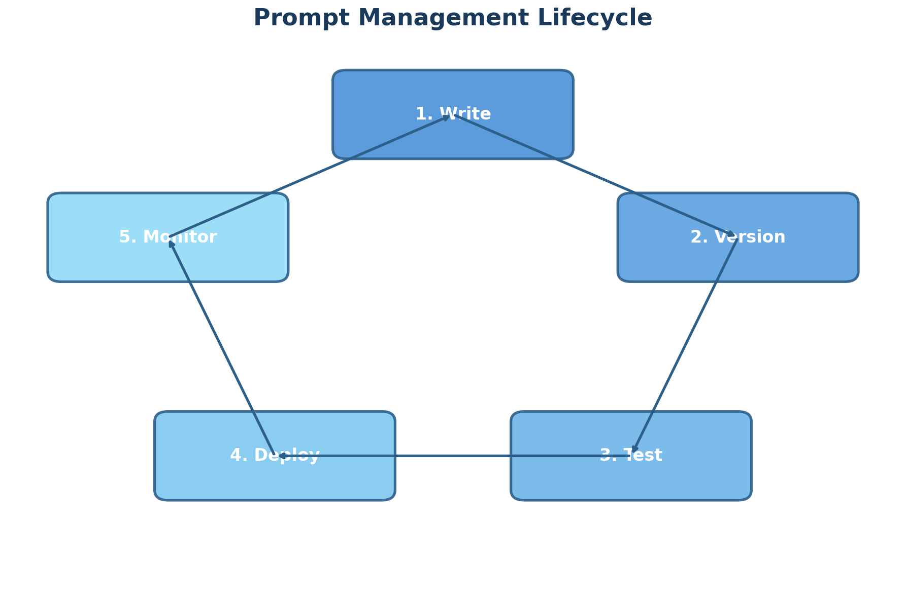
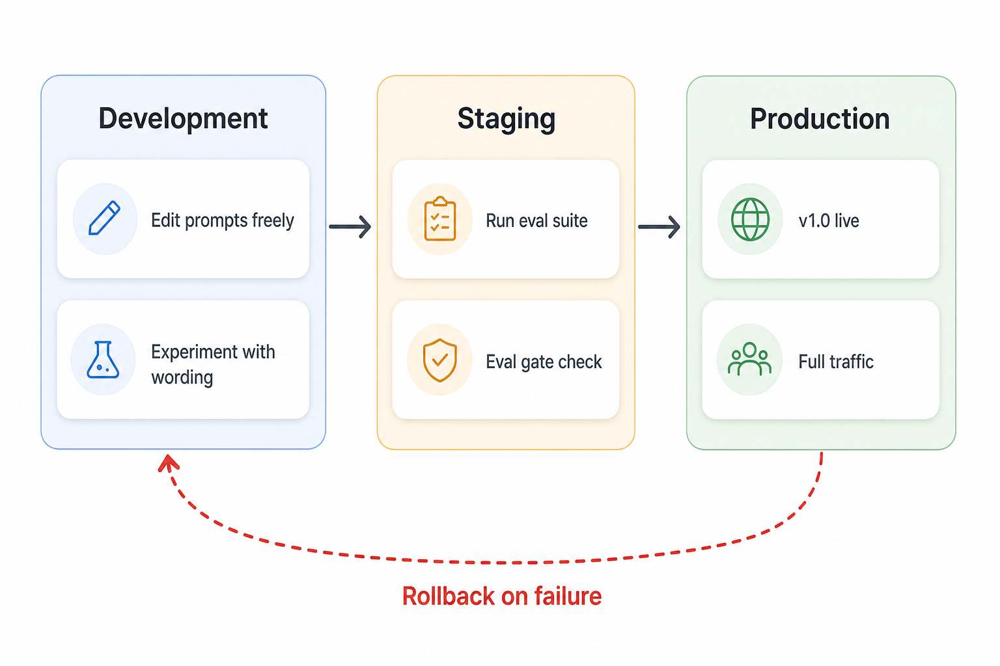
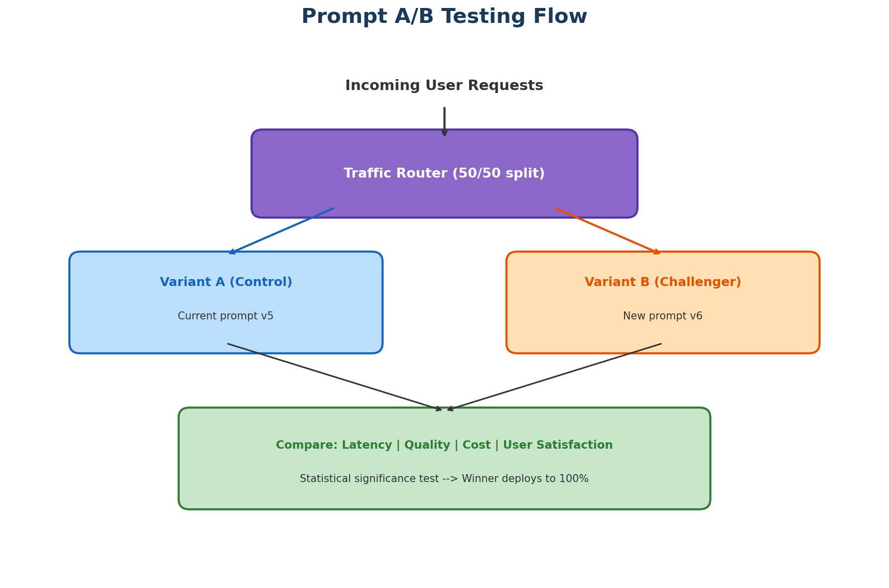
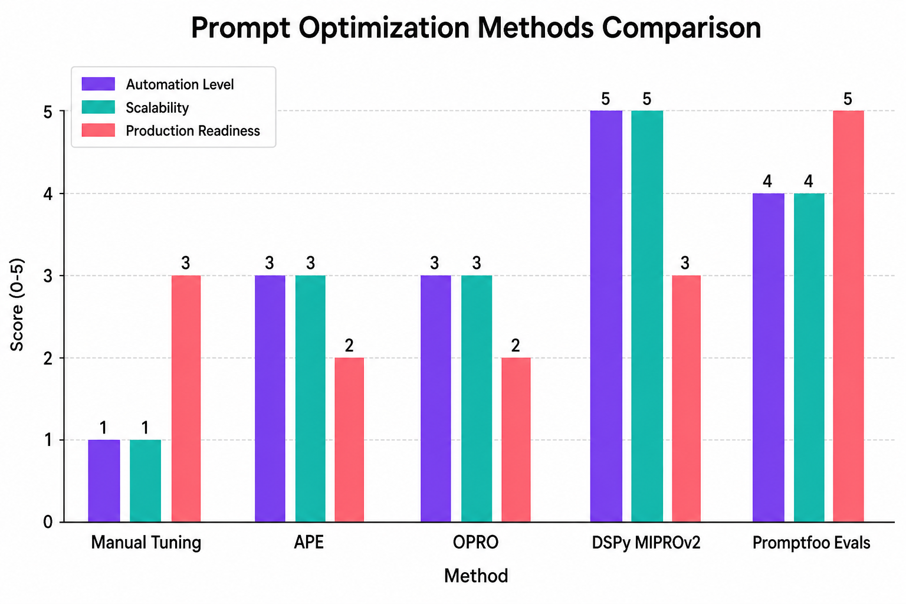
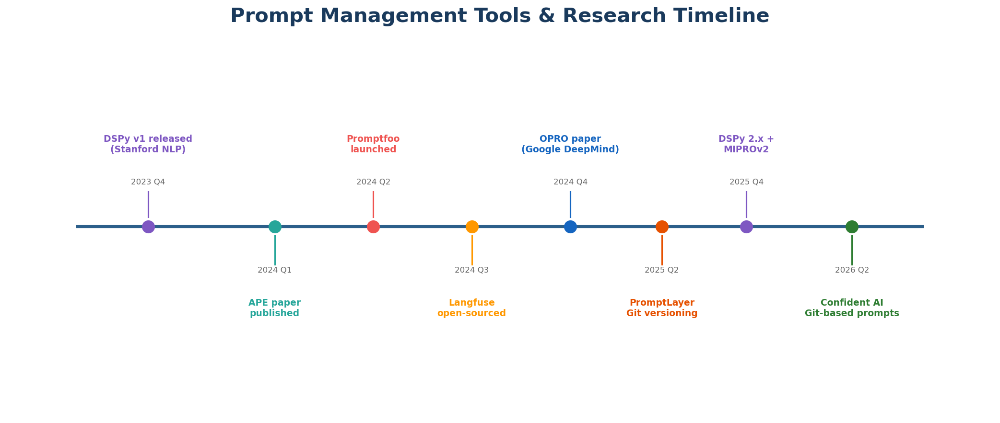

# Day 50: Prompt 管理 — 版本控制、A/B 测试与迭代优化

> **核心问题**：当你的 LLM 应用在 production 里有 50 个 prompt，被 3 个工程师改过、经历了 2 次模型升级——你怎么知道哪个版本在跑、它还管不管用、下一步该改什么？

---

## 开篇

想象你的团队上线了一个客服聊天机器人。最初的 prompt 是一个工程师下午花两小时写的 20 行指令。三个月后，这个 prompt 被四个人改过，在 Slack 里被复制粘贴了无数次，在 production 里被热修了两次，没人能告诉你现在跑的是哪个版本——更不知道最新的改动到底是好是坏。

这个场景在每家用 LLM 构建产品的公司都在上演。Prompt 是应用的控制器（control plane），但大多数团队把它当便利贴一样对待。

Prompt 管理就是将 prompt 当作 production artifact 来对待的工程实践——版本控制、测试、分阶段部署、持续监控。它借鉴了软件工程管理代码的同样原则，针对自然语言指令在每次模型更新后表现不同这一独特挑战做了适配。

---

## 1. 为什么 Prompt 需要工程化管理

### 直觉：Prompt 是会「静默损坏」的配置文件

把 prompt 想象成一个复杂系统的配置文件。在传统软件里，配置改错了要么正常工作要么报错。Prompt 改错了更棘手——它永远不会 crash，只会产生微妙变差的输出，可能要过好几天才被注意到，而且埋在成千上万条用户对话里。

Prompt 管理要解决的核心问题：

| 问题 | 会发生什么 | 影响 |
|------|-----------|------|
| **没有版本历史** | 有人改了 prompt，性能下降，没人知道改了什么 | 花几个小时调试 |
| **没有上线前测试** | "只改了几个字"就破坏了一个罕见但关键的场景 | 用户投诉 |
| **没有回滚能力** | 模型厂商更新，你的 prompt 失效 | 服务中断 |
| **没有 A/B 对比** | 两个团队成员对措辞有分歧，抛硬币决定 | 争论不休 |
| **没有归属追踪** | 这个 prompt 谁写的？为什么？解决了什么？ | 知识流失 |


*图 1：Prompt 管理的五阶段生命周期。每个 prompt 都经过编写、版本化、测试、部署和监控——然后循环往复。*

这个生命周期和 DevOps 对部署做的事情如出一辙：让每次改动都可追溯、可测试、可回滚。

---

## 2. Prompt 的版本控制

### 直觉：给文字用的 Git

如果你用过 Git 追踪代码变更，prompt 版本控制就是把同样的思路用在自然语言上。每个 prompt 有一个唯一标识，每次编辑都记录了谁在什么时候改了什么，你可以随时回滚到任何一个之前的版本。

#### 2.1 Prompt 版本控制长什么样

最基本的形式，一个 prompt 版本控制系统需要追踪：

- **唯一版本 ID** — 哈希值或语义版本号（如 `v2.3.1`）
- **时间戳和作者** — 谁在什么时候改了
- **Diff** — 增加了什么、删除了什么、修改了什么
- **提交信息** — 为什么要改
- **元数据** — 使用了哪个模型、temperature 和其他参数


*图 2：Git 风格的 prompt 版本控制工作流。Prompt 经过开发、Staging（带 eval gate）和 Production 环境，每个阶段都支持回滚。*

#### 2.2 跨环境部署（Environment Promotion）

和代码走 dev → staging → production 一样，prompt 也应该遵循跨环境部署路径：

1. **开发环境** — 自由编辑，实验措辞
2. **Staging** — 用测试数据集跑自动化评估
3. **Production** — 只有通过 eval gate 才能部署

核心原则：**永远不要直接编辑 production 的 prompt**。先在开发环境改，让它通过评估，再部署上去。

#### 2.3 回滚策略

当模型厂商发布更新（OpenAI 推出 GPT-4.1，Anthropic 发布 Claude 3.5 Sonnet v2），你现有的 prompt 可能表现不同。一个有版本管理的 prompt 系统让你可以：

- 将 prompt 固定到特定模型版本
- 用旧 prompt 跑新模型，对比结果
- 出问题立刻回滚

据 promptassay.ai 的版本管理博文所述：*"当新模型上线时，先用现有 prompt 跑一遍新模型，把对比结果作为新版本提交上去，然后再切换 production 标签。"*

---

## 3. 在 Production 中 A/B 测试 Prompt

### 直觉：给 Prompt 做「盲测」

Prompt 的 A/B 测试和网页设计的 A/B 测试完全一样。把流量分成两组，每组用不同版本的 prompt，然后测量哪个在你关心的指标上表现更好。

#### 3.1 测试工作流


*图 3：Prompt A/B 测试流程。流量在控制组（当前 prompt）和挑战组（新 prompt）之间分配，然后在质量、延迟、成本和用户满意度等维度上比较结果。*

关键步骤：

1. **定义假设** — "添加逐步推理指令会减少幻觉"
2. **选择指标** — 准确率、延迟、单次请求成本、用户满意度评分
3. **分配流量** — 通常 50/50，或风险厌恶型团队用 90/10
4. **跑到统计显著性** — 通常每组 500+ 样本
5. **推广获胜者** — 部署到 100% 流量

#### 3.2 关键指标

| 指标 | 怎么量 | 什么时候重要 |
|------|--------|-------------|
| **任务准确率** | LLM-as-Judge 或人工评估 | 所有 prompt 类型 |
| **延迟 (p50/p95)** | 从请求到响应的时间 | 实时应用 |
| **每千次请求成本** | Token 用量 × 定价 | 高流量 production |
| **用户满意度** | 点赞/踩、CSAT 分数 | 面向客户的应用 |
| **失败率** | 拒答、空响应、报错 | 所有应用 |

#### 3.3 常见陷阱

- **混淆因果** — Production 里一个版本常常包含多个改动，这是现实，不是错误。问题不在于「同时改了很多东西」，而在于明明同时改了语气、工具调用顺序、few-shot 示例和 fallback 文案，却还声称「语气改动带来了提升」。如果一个版本包含多项改动，你只能说这一组改动整体优于旧版本，这叫 bundle test。
- **没有拆分高风险改动** — 不是所有 PM idea 都值得单独占用一次 A/B 测试。更实际的做法是分层处理：bug、安全、合规修复可以直接上线；低风险文案和格式改动可以 bundle；会影响转化、质量、安全边界的改动，尽量用 feature flag、灰度发布或后续拆解实验隔离影响。
- **过早停止** — 50 个请求后看起来更好的 variant，到 500 个可能就反转了
- **忽略新奇效应** — 用户可能只是因为新风格不同而给更高评分
- **事后定义「更好」** — 如果你看了结果才决定什么算赢，那就是 p-hacking

---

## 4. 自动化 Prompt 优化

### 直觉：Prompt 的「编译器」

手工调 prompt 就像写汇编——有效但费力。自动化 prompt 优化工具就像编译器：你指定任务和度量标准，系统自动搜索更好的 prompt 表述。

#### 4.1 优化方法全景

学术界和工业界已经出现了几种自动 prompt 优化方法：

| 方法 | 来源 | 机制 | 最适合 |
|------|------|------|--------|
| **APE** (Automatic Prompt Engineer) | Zhou et al., 2022, NeurIPS | LLM 生成候选 prompt，评分，保留最优 | 短指令优化 |
| **OPRO** (Optimization by PROmpting) | Yang et al., 2023, Google DeepMind | LLM 充当优化器，基于得分历史迭代改进 prompt | 黑盒指令优化 |
| **DSPy MIPROv2** | Khattab et al., 2023, Stanford NLP | 联合优化指令和 few-shot 示例 | 多步骤 pipeline |
| **Promptfoo Evals** | Promptfoo, 2024 | 声明式测试配置，对比数据集上的 prompt 表现 | Production 回归测试 |


*图 4：Prompt 优化方法在三个维度上的对比：自动化程度、可扩展性和 production 就绪度。DSPy 在自动化和可扩展性上领先；Promptfoo 在 production 就绪度上最强。*

#### 4.2 APE 的工作原理

APE（Automatic Prompt Engineer）由 Zhou et al. 在 NeurIPS 2022 上发表，遵循一个简单但强大的循环：

1. **生成** — LLM 为任务提出多个候选指令
2. **执行** — 每个候选在测试数据集上运行
3. **评分** — 用某个指标（准确率、ROUGE 等）评估结果
4. **选择** — 得分最高的候选成为新 prompt
5. **变异** — 生成获胜者的变体，循环继续

这本质上就是在 prompt 空间里做进化搜索——而且它一致地找到优于人工编写的指令。

#### 4.3 OPRO：用 LLM 做优化器

Google DeepMind 的 OPRO（Optimization by PROmpting）在 2023 年底发表，采用了一种元方法。OPRO 不是随机变异 prompt 文本，而是让 LLM 自己提出改进建议：

1. 向 LLM 展示 (prompt, 得分) 对的历史记录
2. 要求 LLM 建议一个可能得分更高的新 prompt
3. 评估这个建议
4. 加入历史记录
5. 重复

那个著名的发现：OPRO 发现给数学 prompt 加上 "Take a deep breath and work step-by-step" 能显著提高准确率——这是人类工程师没有系统性地发现过的。

#### 4.4 DSPy：用代码编程 Prompt

Stanford NLP 的 DSPy 在 2023 年底发布，目前版本到了 2.x（含 MIPROv2 优化器，2025 年）。它走得最远——把 prompt 当作可编译的 artifact：

- **签名（Signature）** 定义输入/输出合约（`"question -> answer"`）
- **模块（Module）** 组合多步骤 pipeline（ChainOfThought、ReAct）
- **优化器（Optimizer）**（以前叫 "teleprompter"）根据训练数据和指标自动调优指令和 few-shot 示例

DSPy 的核心洞察：停止手写 prompt。写描述任务的 Python 代码，提供训练样本和度量标准，让优化器找到最好的 prompt 表述。

临床 QA 是一个具体例子。在 BioNLP 2025 的 ArchEHR-QA shared task 中，Bogireddy 等人的 Neural 系统把电子病历问答拆成「证据识别」和「带引用的答案生成」两个阶段，并用 DSPy 的 MIPROv2 为每个阶段自动搜索 prompt，联合调优指令和 few-shot 示例。2026 年的 Neural1.5 follow-up 又把这个思路扩展到问题解释、证据识别、答案生成和证据对齐四个子任务。

---

## 5. Prompt 管理工具全景

### 5.1 工具分类

工具生态在 2025-2026 年间快速成熟。主要类别如下：

| 类别 | 代表产品 | 核心功能 | 最适合 |
|------|---------|---------|--------|
| **Prompt 注册中心** | PromptLayer、PromptHub、Confident AI | Git 式版本控制、部署标签 | 管理大量 prompt 的团队 |
| **评估平台** | Promptfoo、DeepEval、Braintrust | 声明式测试配置、CI/CD 集成 | 回归测试 |
| **可观测性 + Prompt** | Langfuse、LangSmith、Arize | 将追踪与 prompt 版本绑定 | 调试 production 问题 |
| **全生命周期** | Confident AI、Maxim AI | 版本 + 评估 + 部署 + 监控 | 端到端管理 |

### 5.2 选择合适的方案


*图 5：从 2023 到 2026 年 prompt 管理工具和研究的演进。领域从学术优化方法（APE、OPRO）发展到具备 Git 工作流的生产级平台。*

根据你的阶段选择：

**个人开发者或小团队（1-3 个 prompt）：**
- 用 Git 做版本控制，prompt 存为 YAML/JSON 文件
- 用 Promptfoo 做声明式测试
- 费用：免费

**成长中的团队（5-20 个 prompt）：**
- 使用 prompt 注册中心（PromptLayer 或 Langfuse）
- 把评估集成到 CI/CD
- 预算：每月 $0-500

**企业级（50+ prompt，多个模型）：**
- 使用全生命周期平台（Confident AI、Maxim AI）
- 带有 eval gate 的跨环境部署
- 预算：每月 $500-5000

---

## 6. 构建 Prompt CI/CD Pipeline

### 直觉：测试驱动的 Prompt 开发

如果你不会不做测试就部署代码，那也不应该不做评估就部署 prompt。Prompt CI/CD pipeline 在每次改动后面加上自动化质量检查作为门禁。

#### 6.1 Pipeline 架构

```
在开发环境编辑 prompt
    |
    v
[1] 版本提交（自动标记哈希值）
    |
    v
[2] 用测试数据集跑评估套件
    |
    v
[3] 与 production 基线对比得分
    |
    +-- 得分 >= 阈值？ --> 部署到 staging
    +-- 得分 < 阈值？  --> 阻断，通知作者
    |
    v
[4] Staging：10% 流量 A/B 测试
    |
    v
[5] Production：全量上线
    |
    v
[6] 监控：漂移检测、质量告警
```

#### 6.2 评估数据集

每个 prompt 都应该有一个关联的黄金数据集——一组代表预期行为的输入/输出对。这个数据集是你的 eval gate 的基础。

**构建数据集：**
1. 从真实 production 流量中选取 20-50 个样本
2. 手动标注期望输出
3. 添加边界情况（长输入、模糊查询、对抗性样本）
4. 数据集与 prompt 一起做版本管理

**评估质量：**
- **精确匹配** — 用于结构化输出任务
- **LLM-as-Judge** — 用于开放式生成（用另一个模型给输出打分）
- **人工审查** — 抽样检查 production 输出

对于正式的评分框架，整体 prompt 质量得分可以综合多个指标：

$$
Q(p) = \alpha \cdot \text{Accuracy}(p) + \beta \cdot \text{LatencyScore}(p) + \gamma \cdot \text{CostEfficiency}(p)
$$

其中 **p** 是 prompt 版本，alpha、beta、gamma 是反映应用最关注哪些维度的任务特定权重。

#### 6.3 代码示例：Promptfoo 配置

[Promptfoo](https://github.com/promptfoo/promptfoo) 是一个开源工具，可以用声明式配置定义 prompt 测试：

```yaml
# promptfooconfig.yaml
prompts:
  - prompt_v5.txt
  - prompt_v6.txt

providers:
  - openai:gpt-4.1
  - anthropic:claude-sonnet-4-20250514

tests:
  - vars:
      question: "电子产品的退货政策是什么？"
    assert:
      - type: contains
        value: "30天"
      - type: llm-rubric
        value: "回复应该有帮助并引用政策编号"
        provider: openai:gpt-4.1
      - type: latency
        threshold: 2000  # 毫秒

  - vars:
      question: "我要找经理！"
    assert:
      - type: contains-any
        values: ["升级", "经理", "主管"]
      - type: not-contains
        value: "我无法帮助你"

# 运行: promptfoo eval -c promptfooconfig.yaml
```

这个配置测试两个 prompt 变体在两个 provider 上的表现，检查正确性、风格和延迟。它可以直接集成到 CI/CD pipeline 中，通过 `promptfoo eval` 命令运行。

---

## 7. 前沿：2026 年的变化

### 7.1 基于 Git 的 Prompt 工作流

2026 年最大的变化是将 prompt 纳入完整的 Git 语义体系。[Confident AI](https://www.confident-ai.com) 在 2025 年推出，2026 年迅速被采用，引入了分支、提交历史、Pull Request 和审批工作流——和代码审查一模一样，只是对象变成了自然语言。每次提交都能触发自动评估，merge 被 eval 结果门禁卡住。

### 7.2 多模型 Prompt 可移植性

随着团队采用多个模型 provider（OpenAI 做旗舰、Anthropic 做安全关键、开源模型省成本），prompt 可移植性成了真正的挑战。在 GPT-4.1 上得分 95% 的 prompt 在 Llama 4 上可能只有 70%。[Langfuse](https://langfuse.com)（开源、可自部署）和 [Braintrust](https://www.braintrust.dev) 等工具现在支持跨模型 prompt 评估，让团队在决定每个任务用哪个模型之前，先比较同一个 prompt 在不同 provider 上的表现。

### 7.3 Agentic Prompt 管理

当你的应用使用 agent（而不是单轮 prompt）时，prompt 管理变得更复杂。一个 agent 可能用 5-10 个不同的 prompt 来做规划、工具选择、自我修正和回复格式化。[Maxim AI](https://www.getmaxim.ai) 等平台正在构建编排级别的 prompt 管理，把多 prompt 的 agent 工作流当作一个统一的版本化单元来处理。

---

## 8. 常见误解

### "版本控制对 prompt 来说杀鸡用牛刀"

如果你只有一个 prompt 和一个开发者，也许吧。但 prompt 比代码改得更频繁——模型更新、用户反馈、新的边界情况都会触发 prompt 修改。版本控制的设置成本几乎为零，但在出问题时能省下数小时。

### "A/B 测试需要海量流量"

你不需要几百万用户。每个 variant 有 200-500 次对话就足以检测出有意义的质量差异——用 LLM-as-Judge 评估的话。对于内部工具，每组 50-100 个样本也能看出明显的赢家。

### "自动化优化可以取代人的判断"

DSPy 和 OPRO 等工具很强大，但它们优化的是你给定的指标。如果你的指标没有捕获你真正关心的东西（安全性、语气、品牌调性），优化器会找到钻指标空子的 prompt。人工审查优化后的 prompt 仍然必不可少。

---

## 9. 延伸阅读

### Prompt Engineering 学习资源
1. [Prompt Engineering Guide](https://www.promptingguide.ai/) — 系统覆盖 zero-shot、few-shot、CoT、self-consistency、ReAct 等技术
2. [OpenAI Prompt Engineering Guide](https://developers.openai.com/api/docs/guides/prompt-engineering) — 偏工程实践，强调 clear instructions、reference text、拆任务、给模型时间思考、用工具、系统化测试
3. [Anthropic Prompt Engineering Docs](https://platform.claude.com/docs/en/build-with-claude/prompt-engineering/overview) — Claude 的 prompt 结构、长上下文、角色、示例、格式控制
4. [Anthropic Interactive Tutorial](https://github.com/anthropics/prompt-eng-interactive-tutorial) — 像练习册一样的交互式教程，适合系统学一遍
5. [DAIR.AI Prompt Engineering Guide](https://github.com/dair-ai/Prompt-Engineering-Guide) — 社区维护，覆盖面广

### 工具入门
1. [Promptfoo 文档](https://github.com/promptfoo/promptfoo) — 开源 prompt 测试工具，支持声明式配置和 CI/CD 集成
2. [Langfuse Prompt 管理](https://langfuse.com/docs/prompts) — 开源平台，支持版本控制和部署标签

### 进阶
1. [DSPy 文档](https://dspy.ai) — Stanford 的基础模型编程框架
2. [Prompt Assay: How to Version Prompts (2026 Guide)](https://promptassay.ai/blog/how-to-version-prompts-2026-guide) — prompt 版本控制策略的详细指南

### 论文
1. ["Large Language Models Are Human-Level Prompt Engineers"](https://arxiv.org/abs/2211.01910) (Zhou et al., 2022) — APE 论文
2. ["Optimization by PROmpting"](https://arxiv.org/abs/2309.03409) (Yang et al., 2023) — Google DeepMind 的 OPRO
3. ["DSPy: Compiling Declarative Language Model Calls into Self-Improving Pipelines"](https://arxiv.org/abs/2310.03769) (Khattab et al., 2023) — DSPy 框架
4. ["Neural at ArchEHR-QA 2025: Agentic Prompt Optimization for Evidence-Grounded Clinical Question Answering"](https://aclanthology.org/2025.bionlp-share.13/) (Bogireddy et al., 2025) — 用 DSPy MIPROv2 优化临床 QA pipeline 的 shared task 系统论文
5. ["Neural at ArchEHR-QA 2026: One Method Fits All"](https://arxiv.org/abs/2605.10877) (Majeedi et al., 2026) — 将同一思路扩展到四个临床 QA 子任务的 follow-up
6. ["A Survey of Automatic Prompt Engineering: An Optimization Perspective"](https://arxiv.org/abs/2502.11560) (Li et al., 2025) — 自动 prompt 优化方法的全面综述

---

## 思考题

1. 如果你最关键的 prompt 因为一次模型更新在明天坏了，你需要多久才能发现并回滚？要怎样改动才能把响应时间缩短到 5 分钟以内？

2. 当你评估一个 prompt 改动时，你衡量的是你真正关心的东西——还是容易衡量的东西？如果你能量化任何东西，你会增加什么指标？

3. 像 DSPy 这样的自动 prompt 优化器会找到最大化分数的 prompt。Prompt 质量中有哪些方面确实很难用指标捕获？你会怎么处理这些差距？

---

## 总结

| 概念 | 一句话解释 |
|------|-----------|
| Prompt 版本控制 | 类 Git 追踪每次 prompt 变更，带 diff、作者和回滚能力 |
| 跨环境部署 | Prompt 经过 dev → staging → production，带 eval gate |
| A/B 测试 | 在 prompt 变体之间分配流量，测量哪个表现更好 |
| Eval Gate | 自动化质量检查，得分低于阈值时阻断部署 |
| APE / OPRO | 用 LLM 自动搜索更好 prompt 的学术方法 |
| DSPy | Stanford 的框架，将任务规格编译为优化后的 prompt |
| Promptfoo | 支持声明式 prompt 测试和 CI/CD 集成的开源工具 |
| Prompt 注册中心 | 存储、版本化和部署 prompt 的集中式平台 |

**核心要点**：Prompt 是 production artifact，不是便利贴。用管理代码一样的工程纪律来对待它们——版本控制、测试、分阶段部署、持续监控——这是区分可靠的 LLM 应用和脆弱的原型之间的关键。工具生态在 2025-2026 年间快速成熟，现在从 "prompt 放在文本文件里" 到 "prompt 跑在带自动化质量门禁的 CI/CD pipeline 里" 已经有了一条清晰的路径。

---

*Day 50 of 60 | LLM Fundamentals*
*字数：约 3000 | 阅读时间：约 15 分钟*
