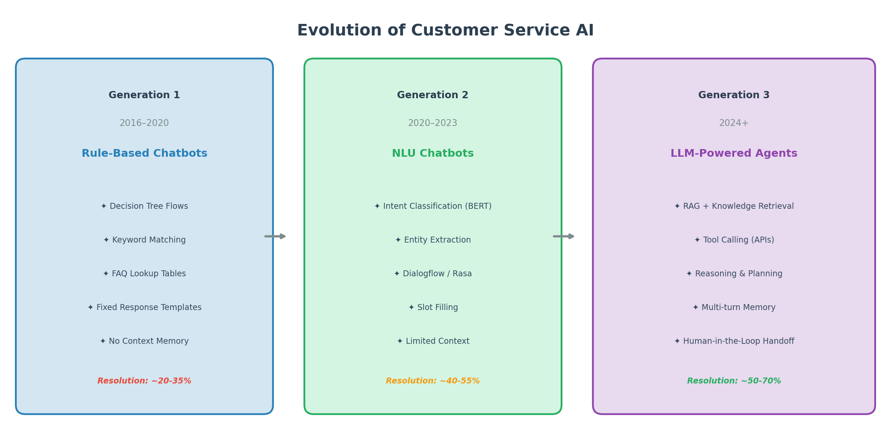
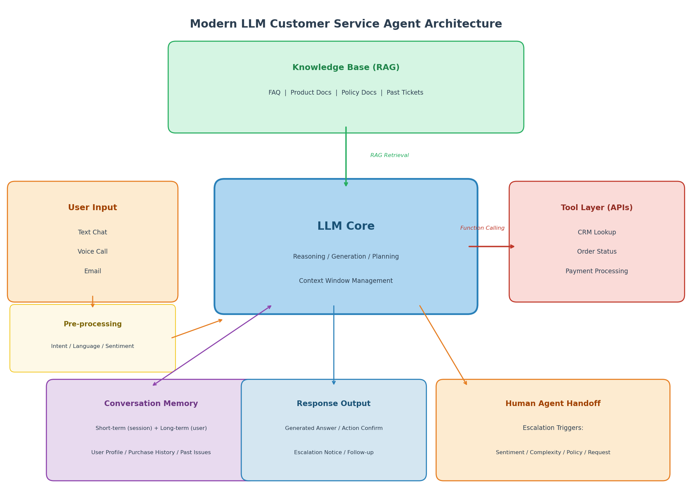
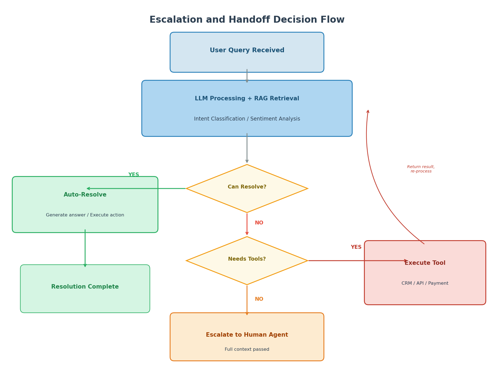
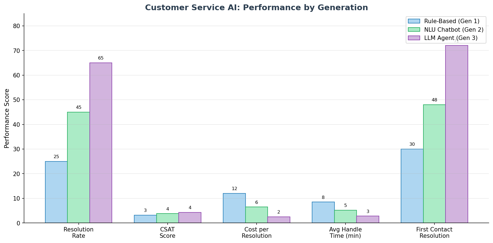

# Day 51: 对话与客服 — 构建 AI 客户支持的正确方式

> **核心问题**: 如何构建一个真正解决问题的客服系统，而不是把用户困在聊天机器人的死循环里？

---

## 开篇

你一定有过这种体验：给某个公司的客服发消息，几秒钟内一个热情的机器人弹出来说："你好！今天有什么可以帮到你？"你描述了问题，机器人回复了一个你早就读过的 FAQ 链接。你换个说法再说一遍，它又发了同一个链接。你输入"转人工"，它说"抱歉我没听懂"。你输入"人工客服！！！"它说"请重新描述您的问题"。

这就是聊天机器人的诅咒：本意是降低客服成本，结果反而增加了客户的愤怒。

好消息是，基于 LLM 的 Agent 和当年那种基于规则的聊天机器人有着本质区别。这个转变不只是语言能力更好——而是 AI 获得了推理、检索、执行操作、以及知道何时转交人工的能力。这篇文章会覆盖架构、设计模式、核心指标和常见陷阱，帮你构建真正好用的客服系统。

---

## 1. 客服 AI 的三代演进

#### 直觉：餐厅接待员的类比

把客服 AI 想象成餐厅的接待员：

- **第一代（基于规则）**：只会照着剧本念的接待员。"您有预约吗？有 → 跟我来。没有 → 等位时间大约 30 分钟。"任何预料之外的问题都会让他不知所措。
- **第二代（NLU 驱动）**：能听懂自然语言的接待员，但回复仍然只能从固定菜单里选。他能理解"我能坐窗边吗"，但没办法真正去查窗边的桌子有没有空。
- **第三代（LLM Agent）**：能理解上下文、会查预约系统、知道厨房的出菜速度、还能主动说"您常坐的那张窗边桌刚好空着，要安排吗？"


*图 1：从刻板的规则聊天机器人到灵活的 LLM Agent，每代典型的解决率对比。*

### 1.1 第一代：基于规则的聊天机器人（2016–2020）

第一波用的是**决策树和关键词匹配**。[Facebook Messenger Bot Platform](https://developers.facebook.com/docs/messenger-platform/)（2016 年发布）和早期的 [Google Dialogflow](https://dialogflow.cloud.google.com/) 让企业可以构建把用户输入匹配到预定义意图的机器人。

架构很简单：用户输入 → 意图分类 → 回复模板。如果意图不匹配任何预定义类别，机器人就回退到"抱歉，我没理解"。

**优点**：确定性强、可预测、容易审计。  
**缺点**：脆弱——任何训练数据之外的表述都会打断流程。解决率只有 20–35%，大多数对话最终还是得转人工。

### 1.2 第二代：NLU 聊天机器人（2020–2023）

第二波加入了 BERT 等模型驱动的**自然语言理解（NLU）**。[Rasa](https://rasa.com/)、[IBM Watson Assistant](https://www.ibm.com/products/watson-assistant) 和成熟的 [Dialogflow CX](https://cloud.google.com/dialogflow/cx/docs) 能更准确地分类意图、提取实体（日期、订单号、产品名称），并通过多轮对话完成 slot filling。

**优点**：输入处理更灵活，实体提取更准确。  
**缺点**：本质上还是脚本驱动。机器人能"理解""我想退货订单 #12345"，但没办法真正*执行*退货——只能给一个退货页面链接。

解决率提升到 40–55%，但"我要找人工"的问题依然没解决。

### 1.3 第三代：LLM 驱动的 Agent（2024+）

这里开始变得有趣了。LLM Agent 把**自然语言生成**、**工具调用**和 **RAG 检索**结合在一起。它们不按脚本走，而是推理客户的问题、从知识库检索相关信息、通过 API 调用执行操作。

[Zendesk AI](https://www.zendesk.com/service/ai/)、[Intercom Fin](https://www.intercom.com/fin)、[Kore.ai](https://kore.ai/) 等平台现在提供的 agentic AI 可以端到端解决 50–70% 的客户咨询——不只是跳转到自助页面。

---

## 2. 现代 LLM 客服 Agent 架构

#### 直觉：呼叫中心的类比

想象一个运作良好的客服呼叫中心。一个电话进来，坐席会（1）在 CRM 里查客户历史记录，（2）在知识库里搜相关政策，（3）用内部工具查订单状态或处理退款，（4）全程记住对话上下文，（5）准确判断什么时候该把电话转给主管。现代 LLM Agent 做的就是这些——只是数字化了，而且可以同时服务成千上万个客户。


*图 2：生产级 LLM 客服 Agent 的核心架构，展示用户输入如何流经预处理、LLM 推理、RAG 检索、工具执行、记忆和人工转交。*

### 2.1 核心组件

| 组件 | 职责 | 关键技术 |
|------|------|----------|
| **LLM 核心** | 推理、生成、规划 | GPT-4、Claude、Gemini、开源模型 |
| **RAG 管道** | 从文档/FAQ 检索知识 | 向量数据库 + 嵌入 + 重排序 |
| **工具层** | 执行操作（查询、退款等） | Function Calling / MCP |
| **记忆系统** | 短期上下文 + 长期用户历史 | 会话状态 + 用户档案存储 |
| **预处理** | 意图检测、语言、情感分析 | 轻量分类器或 LLM 本身 |
| **转交引擎** | 决定何时转人工 | 规则 + LLM 判断 |

### 2.2 请求生命周期

当客户发送"我的订单两周了还没到"时，系统内部发生了什么：

1. **预处理**：检测语言（中文）、标记情感（沮丧）、分类意图（订单问题）。
2. **RAG 检索**：检索物流政策、预计配送时间窗口、客户的订单记录。
3. **LLM 推理**：模型判断订单确实延误了（不只是慢），识别客户情绪，决定主动提供解决方案。
4. **工具执行**：调用物流追踪 API，发现包裹卡在中转站，查询退款政策。
5. **响应生成**："我查到您的订单 #12345 在配送中心出现了延误，非常抱歉。我可以为您办理全额退款（今天到账），或者安排加急补发（2 天内送达）。您希望怎么处理？"
6. **如果客户选择退款**：Agent 调用支付 API 发起退款，然后确认。

没有 FAQ 链接，没有"我没理解您的问题"。客户的问题被*真正解决了*。

---

## 3. 转交人工问题

#### 直觉：急诊室分诊

在急诊室里，分诊护士评估每位病人并决定：在这里处理，还是转给专科医生。护士不会尝试做手术。同样，一个设计良好的 AI Agent 必须清楚自己的能力边界，并把完整的上下文*优雅地*转交给人工。


*图 3：现代 Agent 如何在自动解决、工具辅助解决和人工转交之间做决策。*

### 3.1 什么时候该转交

不是所有对话都应该由 AI 处理。关键触发条件：

| 触发条件 | 示例 | AI 为什么处理不好 |
|----------|------|-------------------|
| **情绪激动** | "我已经三天没网了，损失惨重！" | 需要超越脚本的共情 |
| **政策模糊** | "你们竞争对手这个是免费的" | 商业判断，不是知识检索 |
| **跨系统复杂操作** | "我的航班取消了，酒店和租车也要改" | 跨系统编排，有实际约束 |
| **明确要求** | "给我找经理" | 客户自主权——必须尊重 |
| **安全/法律** | "你们的产品弄伤了我" | 法律责任需要人工记录 |
| **反复失败** | 客户连续问了三次同样的问题 | AI 死循环检测——及时止损 |

### 3.2 如何做好转交

关于聊天机器人转人工的第一大投诉是：客户必须把问题*从头再说一遍*。一个好的系统应该：

1. **传输完整对话历史**到人工坐席的工作台。
2. **附上 AI 的分析**：检测到的意图、情感、已尝试的操作、为什么决定转交。
3. **通知客户**："我正在为您转接专员。他们会看到您的完整对话记录，您不需要重复。"

[Zendesk](https://www.zendesk.com/) 和 [Intercom](https://www.intercom.com/) 等平台现在都在其工作流中自动处理上下文传递。

---

## 4. 关键指标

#### 直觉：体检的类比

用"AI 处理了多少对话"来衡量客服系统，就像用"你上了多少天班"来衡量健康——你需要的是反映系统是否真正在*帮忙*的具体指标。


*图 4：三代客服 AI 的代表性性能指标对比。LLM Agent（第三代）在解决率和成本效率方面有显著提升。数值为行业基准参考，非特定产品声明。*

### 4.1 指标层级

| 指标 | 衡量什么 | 2026 年良好基准 |
|------|----------|----------------|
| **解决率 (Resolution Rate)** | AI 无需人工介入完全解决的对话比例 | 50–70%（agentic 平台） |
| **CSAT（客户满意度）** | 对话后的调查评分（1–5） | 4.0–4.5（混合 AI+人工） |
| **每次解决成本** | 总成本 / 已解决的工单数 | 自助 $1.84 vs 人工辅助 $13.50（[Gartner](https://www.gartner.com/en/customer-service-support)） |
| **首次联系解决率 (FCR)** | 单次交互即解决的比例 | 60–80%（顶级 LLM Agent） |
| **转交率** | 转给人工的对话比例 | 20–40% 是健康范围 |
| **重复联系率** | 48 小时内因同一问题再次联系的比例 | < 15% |

### 4.2 解决率陷阱

**解决率是客服 AI 中最被滥用的指标。** 原因如下：

- **定义作弊**：有些平台把"提供了一个 FAQ 链接"就算"已解决"，即使客户第二天带着同样的问题回来。
- **挑选简单问题**：只把简单问题路由给 AI，复杂的直接给人，这样数字自然好看。
- **51% 问题**：[Intercom 的 Fin](https://fin.ai/learn/roi-ai-customer-service-agents-benchmarks) 报告其客户群平均解决率约 51%，但不同行业差异巨大——电商可能到 70%，技术支持可能只有 35%。

正确做法：永远把解决率跟**重复联系率**和 **CSAT** 放在一起看。一个解决率 65% 但重复联系率 25% 的系统，不如解决率 55% 但重复联系率 8% 的系统。

---

## 5. 语音 AI：下一个前沿

#### 直觉：不再像电话树的电话

还记得以前的电话语音导航吗？"按 1 进入账单查询，按 2 进入技术支持，按 3 等待 20 分钟。"语音 AI Agent 正在彻底消灭这种体验——不是改良电话树，而是用自然对话替代它。

### 5.1 语音 Agent 技术栈

构建语音 AI Agent 需要拼接多个组件：

| 层级 | 功能 | 主要玩家 |
|------|------|----------|
| **语音转文字 (STT)** | 将语音转为文本 | [Deepgram](https://deepgram.com/)、[AssemblyAI](https://www.assemblyai.com/)、OpenAI Whisper |
| **LLM** | 推理并生成回复 | GPT-4、Claude、Gemini |
| **文字转语音 (TTS)** | 将回复转为自然语音 | [ElevenLabs](https://elevenlabs.io/)、OpenAI TTS |
| **电话系统集成** | 连接到电话网络 | [Twilio](https://www.twilio.com/)、[Vapi](https://vapi.ai/) |
| **编排层** | 管理延迟、轮流发言、打断处理 | [Retell AI](https://www.retellai.com/)、[Bland AI](https://www.bland.ai/) |

核心约束是**延迟**。人类在电话对话中期望 500ms 内得到回应。如果 STT + LLM + TTS 超过这个时间，对话就不自然。Retell AI 和 Bland AI 等专用平台会将全链路优化到 500ms 以内。

### 5.2 主要玩家

- **[Bland AI](https://www.bland.ai/)**：专注于大规模外呼客服场景。支持私有化部署以满足数据合规需求。适合高通话量的企业场景。
- **[Retell AI](https://www.retellai.com/)**：专注呼入支持，500ms 以下延迟，对话自然流畅。适合需要托管式语音方案的团队。
- **[Vapi](https://vapi.ai/)**：面向开发者的 API 优先平台，提供最大的 STT、TTS 和 LLM 供应商选择自由度。
- **[OpenAI Realtime API](https://openai.com/index/introducing-gpt-realtime/)**（2026 年 5 月）：OpenAI 的 `gpt-realtime` 模型直接处理语音到语音，内置 SIP 电话支持和 MCP 服务器集成。大幅简化了技术栈。

---

## 6. 常见设计模式

### 6.1 混合 AI + 人工

2026 年的主流模式是**混合**：AI 处理常规查询和一线分诊，人工处理复杂或情绪敏感的案例。根据 [Digital Applied 2026 年调查](https://www.digitalapplied.com/blog/customer-service-ai-agent-statistics-2026-data)，混合方案报告 **4.25/5 CSAT**，同时比全人工基线降低 71% 的综合解决成本。

纯 AI 方案能再省一点成本，但会损失约 0.20 的 CSAT——大多数 CX 负责人已经不认为这个交换值得。

### 6.2 Agentic RAG 用于客服

传统 RAG（在[第 35 天](day35-rag-explained.md)讲过）检索文档然后生成答案。**Agentic RAG** 更进一步：Agent 自己决定*什么时候*检索、*检索什么*、检索到的信息*够不够*——不够就再搜、用工具、或者转交人工。

2026 年 1 月一篇介绍 [SSRAG](https://arxiv.org/abs/2601.12658) 的论文表明，将结构化检索（知识图谱）与语义检索（向量搜索）结合，对客服场景的答案质量有显著提升——因为客服的回答通常同时依赖政策文档和结构化数据（订单状态、账户信息）。

### 6.3 多渠道一致性

客户在网页聊天开始对话，通过邮件跟进，然后打电话。系统必须在所有渠道间保持**统一的上下文**。这需要：

- 共享的对话记忆层（不是每个渠道各自的状态）
- 针对渠道的格式适配（聊天要简短，邮件要详细）
- 无论输入渠道如何，转交逻辑保持一致

---

## 7. 常见错误

### ❌ "AI 会取代所有人工坐席"

2024–2025 年最昂贵的教训：在不了解客户旅程的情况下部署 AI 来裁减人员，只会导致大规模投诉。AI 会放大糟糕的流程。先修好流程，再自动化。

### ❌ "解决率就是一切"

70% 的解决率配上 30% 的重复联系率，意味着你的 AI 在*关闭工单*，而不是在*解决问题*。永远要同时跟踪重复联系率和 CSAT。

### ❌ "把 LLM 接上知识库就行了"

这会产生一个自信地用过时或错误信息回答问题的系统。你需要有新鲜度保证的 RAG、对源文档的引用、以及让 AI 能说"我不太确定，让我查一下"而不是编造答案的机制。

### ❌ "一个模型搞定所有场景"

每个查询都用 GPT-4 级别的模型是浪费。把简单的 FAQ 查询路由到快速便宜的模型（GPT-4o-mini、Haiku），复杂的推理才用贵模型。这样可以在几乎不影响质量的情况下降低 60% 以上的成本。

---

## 8. 代码示例：简单的客服 Agent

```python
"""
一个使用 function calling 的最小客服 Agent 示例。
这只是示意——生产系统还需要 RAG、记忆、转交逻辑和错误处理。
"""
import openai

# 定义 Agent 可用的工具
tools = [
    {
        "type": "function",
        "function": {
            "name": "lookup_order",
            "description": "根据订单号查询订单状态",
            "parameters": {
                "type": "object",
                "properties": {
                    "order_id": {
                        "type": "string",
                        "description": "订单号，例如 ORD-12345"
                    }
                },
                "required": ["order_id"]
            }
        }
    },
    {
        "type": "function",
        "function": {
            "name": "process_refund",
            "description": "为订单发起退款",
            "parameters": {
                "type": "object",
                "properties": {
                    "order_id": {"type": "string"},
                    "amount": {"type": "number", "description": "退款金额（美元）"},
                    "reason": {"type": "string"}
                },
                "required": ["order_id", "amount", "reason"]
            }
        }
    },
    {
        "type": "function",
        "function": {
            "name": "escalate_to_human",
            "description": "带着完整上下文转交人工坐席",
            "parameters": {
                "type": "object",
                "properties": {
                    "reason": {"type": "string"},
                    "conversation_summary": {"type": "string"},
                    "sentiment": {
                        "type": "string",
                        "enum": ["neutral", "frustrated", "angry"]
                    }
                },
                "required": ["reason", "conversation_summary"]
            }
        }
    }
]

SYSTEM_PROMPT = """你是一家电商公司的客服 Agent。
规则：
1. 在提供解决方案之前，必须先核实订单状态。
2. 退款超过 $100 需要先获得客户确认。
3. 如果客户情绪激动或要求找人工，立即转交。
4. 绝对不要编造订单信息——使用工具查询。
5. 回复简洁、以行动为导向。
"""

def handle_message(conversation_history, user_message):
    """处理一轮对话。"""
    conversation_history.append({"role": "user", "content": user_message})
    
    response = openai.chat.completions.create(
        model="gpt-4o",
        messages=[
            {"role": "system", "content": SYSTEM_PROMPT}
        ] + conversation_history,
        tools=tools,
        tool_choice="auto"
    )
    
    message = response.choices[0].message
    
    # 如果模型要调用工具，执行它们
    if message.tool_calls:
        for tool_call in message.tool_calls:
            result = execute_tool(tool_call.function.name,
                                  tool_call.function.arguments)
            conversation_history.append(message)
            conversation_history.append({
                "role": "tool",
                "tool_call_id": tool_call.id,
                "content": str(result)
            })
        
        # 工具执行后获取最终回复
        final = openai.chat.completions.create(
            model="gpt-4o",
            messages=[
                {"role": "system", "content": SYSTEM_PROMPT}
            ] + conversation_history,
            tools=tools
        )
        reply = final.choices[0].message.content
        conversation_history.append({"role": "assistant", "content": reply})
        return reply
    
    conversation_history.append(message)
    return message.content


def execute_tool(name, arguments):
    """存根——生产环境中这些会调用真实的 API。"""
    import json
    args = json.loads(arguments)
    
    if name == "lookup_order":
        # 生产环境：调用订单管理 API
        return {"status": "in_transit", "eta": "2 days", "carrier": "FedEx"}
    elif name == "process_refund":
        # 生产环境：调用支付 API
        return {"refund_id": "REF-67890", "status": "initiated"}
    elif name == "escalate_to_human":
        # 生产环境：在 Zendesk/Intercom 创建工单
        return {"ticket_id": "TKT-11111", "status": "escalated"}
    return {"error": "Unknown tool"}
```

这是骨架。生产系统还需要：
- **RAG 检索**在 LLM 推理之前（见[第 35 天](day35-rag-explained.md)）
- **对话记忆**用于多轮上下文（见[第 34 天](day34-memory-systems.md)）
- **安全护栏**防止跑题或有害输出（见[第 43 天](day43-safety-and-alignment.md)）
- **模型路由**让简单查询用更便宜的模型

---

## 9. 前沿：2026 年最新动态

### 9.1 OpenAI gpt-realtime + SIP 电话支持（2026 年 5 月）

OpenAI 在 2026 年 5 月的 [gpt-realtime 发布](https://openai.com/index/introducing-gpt-realtime/)中引入了直接 SIP 电话支持，意味着语音 AI Agent 可以直接连接到现有的电话系统，无需第三方电话中间件。结合 MCP 服务器支持和图片输入，构建语音优先的客服 Agent 变得显著更简单。

### 9.2 Agentic RAG 用于客服（2025–2026）

2026 年 4 月一篇 [Agentic RAG 综述](https://arxiv.org/html/2506.00054v1)指出，动态检索——由 Agent 决定何时搜索、如何搜索——在客服场景中远优于静态 RAG。Agent 可以重新组织查询、链接多次检索、在回答前验证结果。

### 9.3 混合 AI+人工方案 ROI 最优（2026 年）

[Digital Applied 2026 年数据集](https://www.digitalapplied.com/blog/customer-service-ai-agent-statistics-2026-data)（2026 年 4 月）显示混合方案以 71% 的成本降低达到 4.25/5 CSAT。纯 AI 方案边际多省一点但牺牲客户满意度。行业共识已经形成：**AI 处理量，人工处理复杂度**。

### 9.4 LinkedIn 的知识图谱 RAG（2024）

一篇来自 [Amazon Science 的论文](https://cdn.amazon.science/30/1b/6aca1b504a588cc204adbe49d34f/building-multi-turn-rag-for-customer-support-with-llm-labeling.pdf)和 LinkedIn 部署的系统表明，从历史支持工单构建知识图谱并与向量检索结合，可以将检索 MRR 提升 77.6%，中位解决时间缩短 28.6%。

---

## 10. 延伸阅读

### 入门
1. [Zendesk AI Platform](https://www.zendesk.com/service/ai/) — 看看生产级 AI 客服系统长什么样
2. [Intercom Fin](https://www.intercom.com/fin) — LLM 优先的支持 Agent 示例，附解决率指标

### 进阶
1. [OpenAI Voice Agents 指南](https://developers.openai.com/api/docs/guides/voice-agents) — 构建语音 AI Agent 的架构模式（2026 年 5 月）
2. [Agentic RAG 综述（2026 年 4 月）](https://arxiv.org/html/2506.00054v1) — Agentic 检索如何在客服中运作

### 论文
1. ["SSRAG: Structured-Semantic RAG"（2026 年 1 月）](https://arxiv.org/abs/2601.12658) — 混合向量 + 图谱检索架构
2. ["Building Multi-turn RAG for Customer Support" — Amazon Science（2025）](https://cdn.amazon.science/30/1b/6aca1b504a588cc204adbe49d34f/building-multi-turn-rag-for-customer-support-with-llm-labeling.pdf) — 用 LLM 标注实现自适应检索
3. ["HybridRAG"（2025 年 11 月）](https://arxiv.org/abs/2602.11156) — 预生成 QA 知识库 + 实时生成的混合方案

---

## 思考题

1. 如果你的客服 AI 解决率是 60% 但重复联系率是 25%，这说明了什么？解决的*质量*和解决的*数量*之间有什么区别？
2. 为什么"转交人工"不是 AI 系统的失败，而是一个关键*功能*？当系统试图不惜一切代价减少转交时会发生什么？
3. 你会如何设计一个模型路由策略，让 80% 的查询用便宜的模型处理，同时不损害剩下 20% 的客户体验？

---

## 总结

| 概念 | 一句话解释 |
|------|-----------|
| 解决率 (Resolution Rate) | AI 完全解决的对话比例——但也要跟踪重复联系率 |
| 混合 AI+人工 | AI 处理量，人工处理复杂度——CSAT/成本的最优平衡 |
| 转交设计 | 转交是功能不是缺陷——永远传递完整上下文 |
| RAG 用于客服 | 检索相关文档/政策，让 AI 回答有据可依 |
| Tool Calling | 让 AI 执行操作（查询、退款、预订），而不只是对话 |
| 语音 AI 技术栈 | STT → LLM → TTS 管道，要求 500ms 以下延迟 |
| 模型路由 | 简单查询用便宜/快速模型，复杂查询用强力模型 |

**核心观点**：构建有效的客服 AI 不是用最聪明的模型替代人类。而是设计一个系统：AI 用有依据的、可操作的回复处理常规查询；清楚自己的边界并优雅地转交；用上下文和工具增强人工坐席。目标是*解决问题*，不是*推卸问题*。

---

*Day 51 of 60 | LLM Fundamentals*  
*字数：约 2800 | 阅读时间：约 14 分钟*
