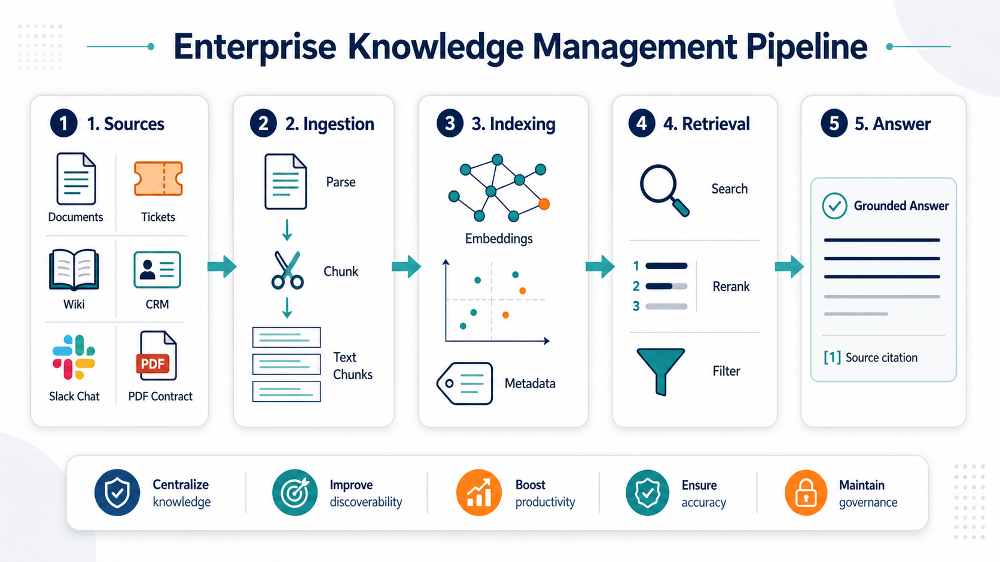
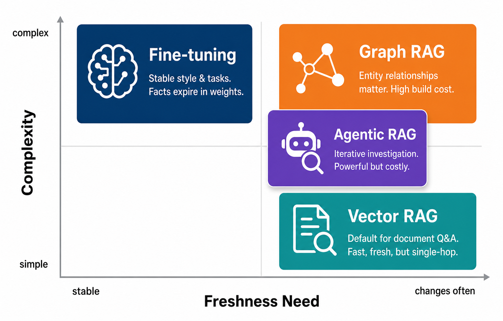

# Day 53: Knowledge Management — 企业知识库与文档问答

> **核心问题**：怎样把公司里杂乱分散的文档，变成一个能基于证据、权限和审计可靠回答问题的 LLM 系统？

---

## 开场

想象你周一刚入职一家公司，周五就被要求处理一个客户升级问题。答案大概率已经存在：去年的一条 support ticket、Salesforce 里的一个价格例外、某个已离职同事写过的 Confluence 页面、一份 PDF 合同，以及一段解释政策为什么变化的 Slack 讨论。传统 knowledge management 会说：“把文档整理好。”LLM 时代的 knowledge management 会问：“能不能在工作发生的那个时刻，把这些知识变成可用答案？”

这个变化听起来不大，但它改变了整个系统。搜索框返回链接；文档问答助手返回答案、引用来源、遵守权限，并且在证据不足时承认不知道。两者的区别，有点像图书馆目录和研究助理：它们面对同一个图书馆，但只有研究助理会帮你把分散证据串成一个判断。

真正难的不是“和 PDF 聊天”。真正难的是搭一个可信的知识运行时：摄取、切分、metadata、检索、rerank、权限过滤、答案生成、引用、评估、持续修复。今天这篇文章就从第一性原理拆开这个 stack。

---

## 1. 为什么企业知识这么难

#### 直觉：公司像一栋到处都是杂物抽屉的房子

可以把企业知识想成一栋房子，每个房间都有一个杂物抽屉。工程团队有设计文档，销售团队有 CRM 备注，客服团队有 ticket，法务有合同，HR 有政策 PDF。每个抽屉对每天使用它的人来说都很合理，但新人根本不知道该从哪里找。

传统搜索假设用户已经知道正确关键词。这个假设在公司里经常失败，因为同一件事会有很多名字：“customer churn”“logo loss”“renewal risk”“retention issue”可能描述的是相近问题。Dense embedding 有帮助，因为它匹配的是语义，而不只是字面词。但语义还不够。企业系统还需要 freshness、权限、provenance 和运维责任。


*图 1：知识管线把分散来源变成受治理、可测试的文档问答系统。*

| 问题 | 为什么会出现 | 如果忽略会怎样 |
|------|--------------|----------------|
| 来源分散 | 知识散落在很多工具里 | 助手只能从局部视角回答 |
| 文档过期 | 政策和产品行为会变化 | 旧答案听起来很自信，但其实错了 |
| 权限控制 | 不同员工权限不同 | 模型可能泄露受限信息 |
| 语言不统一 | 不同团队使用不同术语 | 关键词搜索漏掉相关证据 |
| 缺少评估 | 真实问题会随时间变化 | 上线后质量悄悄漂移 |

所以企业 knowledge management 不是“把所有 PDF 塞进 vector database”这么简单。Vector database 是有用组件，但用户真正需要的是一个能回答这些问题的系统：你用了什么证据？证据是否仍然有效？用户是否有权看到？我们怎么知道答案是好的？

---

## 2. 核心架构：把 RAG 当成知识运行时

#### 直觉：开卷考试，但旁边站着严格的图书管理员

Retrieval-Augmented Generation（RAG）像一场开卷考试。模型回答前可以查资料。但企业 RAG 旁边还必须站着一个严格的图书管理员：他检查学生能看哪些书，找到最相关的页面，排除过期版本，并记录引用。

最基本的 RAG 公式很简单：

$$
\begin{aligned}
q &= \text{user question} \\
D_q &= \text{TopK}(\text{retrieve}(q, D)) \\
a &= \text{LLM}(q, D_q)
\end{aligned}
$$

这个公式的意思是：先从文档集合中检索一小组证据，再让模型基于这些证据生成答案。它足够简洁，但也隐藏了生产环境里大部分复杂度。真实企业系统里的 `retrieve` 通常包含 query rewrite、稀疏搜索、dense vector search、metadata filter、访问控制过滤、reranking、去重和 context packing。


*图 2：生产级 retrieval stack 会在生成前完成 query 理解、hybrid retrieval、权限过滤和 context packing。*

检索栈通常有四层：

| 层级 | 主要职责 | 常见工具 |
|------|----------|----------|
| 来源层 | 连接文档、ticket、wiki、CRM、数据库 | [Confluence](https://www.atlassian.com/software/confluence), [SharePoint](https://www.microsoft.com/microsoft-365/sharepoint/collaboration), [Notion](https://www.notion.com/), [Salesforce](https://www.salesforce.com/) |
| 索引层 | 解析、chunk、embedding、存 metadata | [Pinecone](https://www.pinecone.io/), [Weaviate](https://weaviate.io/), [Elasticsearch](https://www.elastic.co/elasticsearch) |
| 检索层 | 搜索、rerank、过滤、组装证据 | BM25, vector search, cross-encoder reranker |
| 回答层 | 生成带引用的 grounded answer | [OpenAI API](https://openai.com/api/), [Anthropic Claude](https://www.anthropic.com/claude), [Google Gemini](https://gemini.google/) |

注意，这张表比较的是层级，不是“谁更强”。Source system、vector database 和 model API 是根本不同的产品类型。把它们放进一个排行榜会误导读者。正确问题不是“Pinecone 是否比 Confluence 更好”，而是“每个工具在哪一层，它必须满足什么接口契约”。

---

## 3. Chunking、Metadata 与 Hybrid Retrieval

#### 直觉：把一本书剪成索引卡

如果你把一本书剪成一页一张的索引卡，每张卡都很容易检索，但上下文可能丢失。如果把整本书当成一个 chunk，检索又会太粗，LLM 会浪费 context。Chunking 的艺术在于选择有用的卡片：足够大，能保留语义；足够小，能精确命中。

大多数文档问答失败发生在 LLM 看到内容之前。解析不好会丢表格；chunking 不好会把答案和定义切开；metadata 缺失会导致无法按产品版本、客户类型、日期、owner、地区过滤；检索弱会把不相关文本塞进 prompt，然后模型很配合地基于弱证据写出流畅答案。

最重要的三种检索模式是：

| 模式 | 是什么 | 最适合 |
|------|--------|--------|
| Sparse retrieval | BM25 这类关键词搜索 | 精确名称、错误码、政策编号 |
| Dense retrieval | Embedding 相似度 | 改写、同义表达、语义匹配 |
| Hybrid retrieval | Sparse + dense + reranking | 大多数企业文档问答 |

Hybrid retrieval 强，是因为公司里的问题经常同时包含精确信号和语义信号。用户问：“Can EU trial accounts use SSO?” 这里的 “EU”“trial”“SSO” 是精确过滤条件，而 “use” 可能意味着 enable、configure、purchase 或 access。Sparse search 抓缩写和专有名词，dense search 抓语义，reranker 再判断哪些 passage 真正回答了问题。

最新研究越来越把 metadata 当成一等公民。2025 年 12 月的论文 [Leveraging LLM-Generated Metadata to Enhance RAG Systems](https://arxiv.org/html/2512.05411v1) 描述了一个用 LLM 为文档 chunk 生成结构化 metadata 的 pipeline，以改善企业 RAG 检索。这个想法很务实：很多公司已经有有价值的文档，但 metadata 不完整、不一致，甚至完全没有。LLM 可以帮助生成标题、主题、实体、时间范围和目标读者，再由人工或自动检查验证高风险字段。

---

## 4. 权限控制与治理

#### 直觉：助手也需要门禁卡

企业助手应该像员工刷门禁一样工作。它不能说：“我在一个受限法务文件夹里找到了答案，但我可以总结给你听。” 如果用户无权访问底层文档，助手就不能把该文档当作证据。

最重要的治理规则很简单：权限过滤必须发生在生成之前，而不是生成之后。如果受限文本已经进入模型 context，泄露其实已经发生。事后 redaction 更弱，因为模型可能已经改写或概括了敏感内容。

实用系统通常会执行四类控制：

1. **身份传递**：retrieval service 接收到真实用户身份，或受限范围的 service token。
2. **文档级权限**：搜索索引存储 ACL（Access Control List），或保留对原权限系统的引用。
3. **字段级敏感性**：薪资、法务策略、健康数据等字段需要更严格处理。
4. **审计日志**：每个答案都记录用户、query、检索到的 source ID、模型版本和时间戳。

在受监管行业，治理还包括 retention、deletion 和 data residency。一个 RAG 系统如果永远索引已删除员工文档，并不会因为答案有用就变得合规。因此 knowledge management 一半是 AI 问题，一半是信息治理问题。

---

## 5. 策略选择：Fine-tuning、Vector RAG、Graph RAG、Agentic RAG

#### 直觉：背下来、查资料、画地图，还是自己调查

企业知识系统常见有四种策略。它们解决的问题不同，所以不应该被当成同一种产品来比较。


*图 3：用示意方式比较几种知识策略在 freshness、复杂度和治理适配上的差异。*

| 策略 | 最适合 | 主要风险 |
|------|--------|----------|
| Fine-tuning | 需要稳定风格或任务行为 | 事实会在权重里过期 |
| Vector RAG | 需要基于大量文档回答新鲜问题 | 检索可能漏掉多跳证据 |
| Graph RAG | 实体和关系很重要 | 图谱构建和维护成本高 |
| Agentic RAG | Query 本身需要调查 | 延迟、成本和评估负担更高 |

Fine-tuning 经常不是事实知识的正确工具。它可以教模型用你的客服语气写作、分类 ticket、遵循格式。它不适合频繁变化的产品事实，因为更新权重比更新索引慢得多。

Vector RAG 是文档问答的默认方案。它快、直观、容易更新。弱点是多跳推理：如果答案需要同时结合价格页面、地区政策和合同条款，一次性 retrieval 可能无法收集全部证据。

Graph RAG 加入结构。它表示实体和关系，适合回答“哪些客户受这个依赖影响？”或“这次收购后哪条政策变了？”这类问题。当关系是核心时它很强，但图谱本身必须被构建和维护。

Agentic RAG 让 LLM 自己决定什么时候再次搜索、什么时候深入阅读某个文档、什么时候改写 query。这更接近人类分析师的工作方式。但它也更难测试，因为每个 query 的路径可能不同。

---

## 6. 评估：怎么知道系统真的好用

#### 直觉：知识助手需要成绩单

Demo 可以靠十个友好问题看起来很漂亮。生产级知识助手需要一张来自真实用户任务的成绩单。这张成绩单要同时评估 retrieval 和 generation，因为从错误证据里写出的漂亮答案仍然是错的。

有用的指标包括：

| 指标 | 检查什么 | 能发现什么失败 |
|------|----------|----------------|
| Retrieval recall | 是否找到了包含答案的证据 | 正确文档没被检索到 |
| Citation precision | 引用 passage 是否支持 claim | 装饰性引用 |
| Answer faithfulness | 答案是否严格基于证据 | Hallucination |
| Abstention quality | 证据不足时是否拒答 | 过度自信乱猜 |
| Permission safety | 检索是否尊重用户权限 | 数据泄露 |


*图 4：可靠的文档问答需要 gold questions、离线评估、部署监控、漂移检测、语料修复和政策审查形成闭环。*

好的评估集应该包含普通问题、困难问题、不可回答问题、权限敏感问题，以及过期文档陷阱。例如：

- “德国企业年付合同的退款政策是什么？”
- “Trial users 能否启用 SAML SSO？”
- “总结 customer X 的升级历史。” 预期行为取决于用户是否有该账户权限。
- “三月价格更新改了什么？” 这测试时间 freshness。
- “谁批准了这个例外？” 这测试引用和审计能力。

系统还应该记录失败。当用户点击“答案错误”、改写问题，或者读完答案后立刻打开引用文档，这些都是有用信号。评估不是一次性 benchmark，而是一个运营闭环。

---

## 7. 代码示例：一个最小文档问答骨架

下面这段代码故意写得很小。它展示的是控制流，不是完整生产实现。真实系统里，应把 toy retriever 替换成 hybrid retrieval、metadata filter、权限检查和 model API 调用。

```python
from dataclasses import dataclass
from typing import Iterable
import math

@dataclass
class Chunk:
    doc_id: str
    text: str
    allowed_users: set[str]

def tokenize(text: str) -> set[str]:
    return {w.lower().strip(".,?!:;()") for w in text.split()}

def score(query: str, chunk: Chunk) -> float:
    # Toy sparse score: Jaccard overlap between query words and chunk words.
    # Production systems usually combine BM25, vector search, and reranking.
    q = tokenize(query)
    c = tokenize(chunk.text)
    if not q or not c:
        return 0.0
    return len(q & c) / len(q | c)

def retrieve(query: str, user_id: str, chunks: Iterable[Chunk], k: int = 3) -> list[Chunk]:
    visible = [chunk for chunk in chunks if user_id in chunk.allowed_users]
    ranked = sorted(visible, key=lambda chunk: score(query, chunk), reverse=True)
    return ranked[:k]

def answer(query: str, evidence: list[Chunk]) -> str:
    if not evidence or max(score(query, chunk) for chunk in evidence) < 0.08:
        return "I do not have enough evidence in the accessible corpus to answer."
    citations = ", ".join(chunk.doc_id for chunk in evidence)
    context = "\n".join(f"[{chunk.doc_id}] {chunk.text}" for chunk in evidence)
    return (
        "Draft answer should be generated from this evidence only.\n\n"
        f"Question: {query}\n\nEvidence:\n{context}\n\nCitations: {citations}"
    )

chunks = [
    Chunk("policy-2026-eu", "EU annual contracts allow refund review within 30 days.", {"alice", "bob"}),
    Chunk("trial-sso", "Trial workspaces cannot enable SAML SSO unless approved by sales engineering.", {"alice"}),
    Chunk("legal-private", "Restricted acquisition clause for customer X.", {"legal"}),
]

query = "Can trial users enable SSO?"
evidence = retrieve(query, user_id="alice", chunks=chunks)
print(answer(query, evidence))
```

关键行是 `retrieve` 里的权限过滤。即使在玩具系统里，access control 也发生在 evidence 进入回答阶段之前。

---

## 8. 前沿：2026 年发生了什么变化


*图 5：前沿正在从被动的一次性 retrieval，转向 agentic 和可导航的知识系统。*

### 2026 年 5 月：面向企业知识库的 AgenticRAG

2026 年 5 月的论文 [AgenticRAG: Agentic Retrieval for Enterprise Knowledge Bases](https://arxiv.org/html/2605.05538v1) 提出了一个面向企业文档搜索和问答的 agentic RAG 系统。它的关键变化是把一次性 retrieval 换成迭代循环：LLM 可以搜索、检查 passage、读取完整内容，并判断是否已经有足够证据再回答。

这很重要，因为很多企业问题本质上是调查任务。用户可能问：“客户 X 为什么流失？” 答案可能需要 support ticket、合同历史、产品事故和 account note。一次 retrieval 往往只能找到最明显的文档，而不是完整因果链。

### 2026 年 4 月：Corpus2Skill 与可导航知识

2026 年 4 月的论文 [Distilling Enterprise Knowledge into Navigable Agent Skills for QA](https://arxiv.org/html/2604.14572v1) 提出 Corpus2Skill：离线把文档语料蒸馏成层级化 skill directory，在线让 LLM agent 导航这个结构。它的动机是，普通 RAG 把模型当成 search results 的被动消费者；可导航语料则给 agent 一张地图，让它知道有什么、缺什么、下一步该去哪找。

这和课程前面讲过的 “skills” 概念直接相连：skill 不只是 tool call，而是带有说明、范围和结构的可复用能力。Corpus2Skill 把这个思路应用到了企业知识上。

### 2026 年 6 月 5 日：Google Enterprise Agentic RAG

2026 年 6 月 5 日，Google Research 和 Google Cloud 发布了 [Unlocking dependable responses with Gemini Enterprise Agent Platform's Agentic RAG](https://research.google/blog/unlocking-dependable-responses-with-gemini-enterprise-agent-platforms-agentic-rag/)。文章描述了一个 multi-agent workflow：它会拆解复杂企业 query，迭代搜索足够 context，再生成回答。

重要信号是产品化。Agentic RAG 已经不只是研究模式；主流 cloud provider 正在把它包装进企业平台，而这些平台里 security、data connector 和 monitoring 与模型质量同样重要。

### 2026 年产品方向：知识进入工作流

企业搜索厂商如 [Glean](https://www.glean.com/)，平台厂商如 [Microsoft Copilot](https://www.microsoft.com/microsoft-copilot/)，都在把知识助手推进日常工作流，而不是只放在独立搜索入口里。趋势很清楚：知识系统正在变成嵌入式助手，能在上下文里回答、引用，甚至行动。

风险也同样清楚。当知识助手从“answer this”走向“do this”，过期或未授权知识就会变成运营风险。所以 retrieval、governance 和 evaluation 必须一起设计。

---

## 9. 常见误解

### “我们已经有企业搜索，所以已经有 knowledge management”

Search 是 retrieval interface。Knowledge management 是完整生命周期：捕获、组织、检索、验证、治理、更新和退役知识。LLM 会让薄弱的知识卫生更明显，因为它会把混乱证据变成流畅答案。

### “更长 context window 可以替代 retrieval”

长 context 有帮助，但它不解决 source selection、access control、freshness 和 citation quality。把所有东西塞进 prompt，就像开会时把整个文件柜搬进会议室。你仍然要知道哪个文件夹才重要。

### “Fine-tuning 可以把公司事实教给模型”

Fine-tuning 更适合行为，不适合经常变化的事实。如果事实频繁变化，就把它们放在权重外面，在 inference 时检索。Fine-tuning 更适合风格、格式、分类或专门任务行为。

### “有引用就说明答案 grounded”

引用可能只是装饰。Grounded answer 的每个关键 claim 都必须被引用 passage 真实支持。评估时要检查 citation precision，而不是只检查有没有 citation。

---

## 10. 实用设计清单

上线文档问答助手前，先问这些问题：

| 领域 | 问题 | 好答案 |
|------|------|--------|
| 来源 | 哪些系统被索引？ | owner、connector、刷新计划都有记录 |
| 解析 | 表格、PDF、slides 是否保留结构？ | 测试覆盖常见文档格式 |
| Metadata | 能否按日期、owner、产品、地区过滤？ | metadata schema 是显式定义的 |
| 权限 | ACL 是否在生成前执行？ | 是，并且有审计日志 |
| 评估 | 是否有真实 gold questions？ | 有，包括不可回答和权限问题 |
| 运维 | 谁负责修坏答案？ | 有明确 owner 和修复流程 |

这张清单很朴素，但朴素得很重要。大多数企业 AI 失败不是因为模型出现了神秘错误，而是因为 owner 不清楚、数据过期、权限缺失、没有反馈闭环。

---

## 延伸阅读

### 入门

1. [What is Retrieval-Augmented Generation?](https://www.elastic.co/what-is/retrieval-augmented-generation) — 从搜索基础设施视角介绍 RAG。
2. [Pinecone: What is RAG?](https://www.pinecone.io/learn/retrieval-augmented-generation/) — 解释 retrieval、embedding 和 grounding 的入门材料。

### 进阶

1. [AgenticRAG: Agentic Retrieval for Enterprise Knowledge Bases](https://arxiv.org/html/2605.05538v1) — 2026 年 5 月关于企业文档搜索中迭代式 agentic retrieval 的论文。
2. [Distilling Enterprise Knowledge into Navigable Agent Skills for QA](https://arxiv.org/html/2604.14572v1) — 2026 年 4 月提出 Corpus2Skill 的论文。
3. [Leveraging LLM-Generated Metadata to Enhance RAG Systems](https://arxiv.org/html/2512.05411v1) — 2025 年 12 月关于企业 RAG metadata enrichment 的论文。
4. [Google Research: Gemini Enterprise Agent Platform's Agentic RAG](https://research.google/blog/unlocking-dependable-responses-with-gemini-enterprise-agent-platforms-agentic-rag/) — 2026 年 6 月 5 日的产品与研究说明。

---

## 思考题

1. 如果你的公司只能基于“用户确实有权访问”的文档回答问题，现在哪些知识来源会立刻变得不可用？
2. 在你的领域里，更危险的是系统经常拒答，还是系统基于弱证据自信回答？
3. 针对你团队的知识库，一组有用的 gold-question set 应该长什么样？

---

## 总结

| 概念 | 一句话解释 |
|------|------------|
| RAG | 先检索证据，再基于证据生成答案 |
| Hybrid retrieval | 结合关键词搜索、vector search 和 reranking |
| Metadata | 让检索可过滤、可审计的结构化上下文 |
| Agentic RAG | 让模型在回答前迭代搜索、检查和改写 |
| Governance | 权限、审计日志、freshness、retention 和 ownership |

**关键 takeaway**：企业 knowledge management 不再只是文档整理问题。在 LLM 时代，它是一个生产级 AI 系统：retrieval、governance、evaluation 和 repair 必须一起工作。最好的文档问答系统之所以对用户显得简单，是因为复杂部分都被系统在底层处理好了。

---

*Day 53 of 60 | LLM Fundamentals*  
*字数：约 5200 中文字 | 阅读时间：约 16 分钟*
