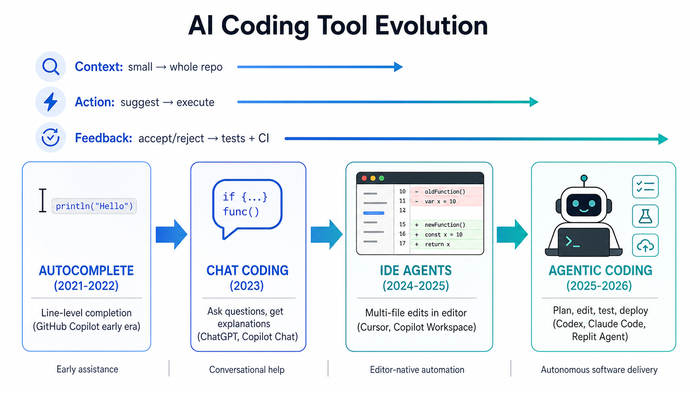
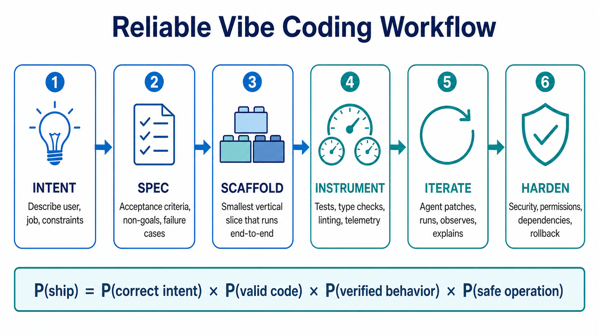
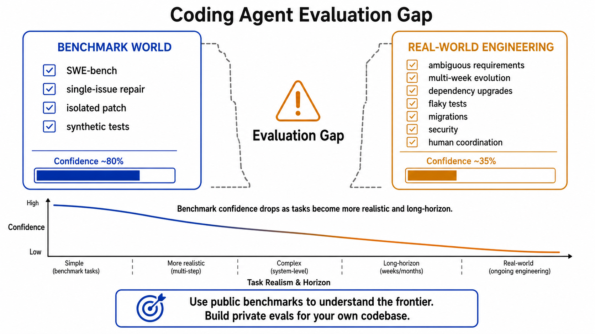

# Day 54: Developer Tools & Vibe Coding — AI 如何改变编程

> **核心问题**：AI 编程工具如何从 autocomplete 走向后台 Agent 和 vibe coding？开发者又该如何利用它们，而不是把速度误认为可靠性？

---

## 开场

想象你在做饭，旁边有一个动作非常快的助手。传统工作流里，洋葱每一刀都得你自己切。autocomplete 像是助手递给你下一片切好的洋葱。聊天式编程像是你问一句「这锅酱为什么不对劲？」，助手给你解释。到了 Agentic coding，助手可以读菜谱、看冰箱、先做一版、按清单试味道，再回来问你要不要加盐。这确实是变化。但它并不意味着你不再需要判断味道、食品安全，也不意味着你可以忘掉今晚到底要做什么菜。

AI developer tools 正在经历类似的变化。早期工具只是补全代码行。现在的 [GitHub Copilot](https://github.com/features/copilot)、[Cursor](https://cursor.com/)、[Claude Code](https://www.anthropic.com/product/claude-code)、[OpenAI Codex](https://openai.com/index/unrolling-the-codex-agent-loop/)、[Replit Agent](https://replit.com/agent4)、[Lovable](https://lovable.dev/) 已经可以规划、跨文件修改、运行命令、生成 pull request，甚至从一句自然语言需求出发部署一个完整应用。**vibe coding** 这个流行说法由 [Andrej Karpathy 在 2025 年 2 月提出](https://x.com/karpathy/status/1886192184808149383)，它抓住了那种「说出意图，代码自己长出来」的体验。

但更深的结论不是「开发者要消失了」。真正发生的是，编程劳动在上移：从敲语法，转向描述行为、建立反馈信号、审查 diff、运营别人真正依赖的系统。

---

## 1. 从 Autocomplete 到 Agentic Development

#### 直觉：从计算器到初级同事

可以把这条演进线想成办公工具的变化。计算器能帮你更快算数，但不会替你决定预算怎么编。电子表格能自动重算很多场景，但模型结构仍然要你设计。一个初级同事则可以接一张 ticket、问几个问题、做一版草稿，然后把可审查的结果交回来。现代 coding agent 正在从「计算器式辅助」走向「初级同事式辅助」。


*图 1：AI 编程工具从代码行补全，演进到可以跨文件、跨工具、跨部署流程行动的 Agentic system。*

这次变化之所以能发生，是因为三个能力同时进步了：

| 能力 | 早期形态 | Agentic 形态 |
|------|----------|--------------|
| Context | 当前文件或选中的代码片段 | 整个仓库、文档、终端输出、issue 历史 |
| Action | 建议文本 | 修改文件、运行测试、开 pull request、调用工具 |
| Feedback | 人类接受或拒绝补全 | 测试、lint、运行日志、code review、部署信号 |

重点是「同时」。一个会写代码但不能运行测试的模型，本质上仍然只是建议引擎。一个能运行命令但 context 很弱的工具，会做出局部看似正确、全局破坏假设的修改。一个界面很漂亮但缺少验证机制的产品，会让坏代码看起来很安全。

所以，今天的 developer tool 不再只是「AI model」。它们是系统：模型、harness、编辑器集成、sandbox、包管理器、测试运行器、权限边界、review 流程共同组成一个整体。

---

## 2. Vibe Coding 到底是什么

#### 直觉：先画草图，再做施工图

Vibe coding 像是在餐巾纸上画房子草图。草图很有价值，因为它能快速把一个想法变成可见的东西。你能看到厨房在哪里，楼梯要不要挪，判断这个想法值不值得继续推进。但没有人应该只凭餐巾纸草图就批准承重墙。

实际使用中，vibe coding 指的是把自然语言作为创建软件的主要界面。用户描述一个产品、功能、bug 或视觉改动；AI 工具写代码；用户运行、检查、再重定向。[Replit Agent 4](https://replit.com/blog/introducing-agent-4-built-for-creativity)、[Lovable](https://lovable.dev/guides/best-vibe-coding-tools-2026-build-apps-chatting)、[Bolt](https://bolt.new/)、[v0 by Vercel](https://v0.dev/) 让很多非程序员也能构建应用。[Cursor](https://cursor.com/blog/cursor-3)、[Claude Code](https://docs.anthropic.com/en/docs/claude-code/overview)、[Codex](https://openai.com/index/gartner-2026-agentic-coding-leader/) 则更面向仍然在仓库、终端、review 里工作的开发者。

这个词在文化上很有用，但在技术上并不精确。至少有三种不同工作流都被塞进了这个词里：

| 工作流 | 主要用户 | 最适合 |
|--------|----------|--------|
| Prompt-to-prototype | 创业者、设计师、学生、运营人员 | 落地页、内部工具、demo |
| Agent-assisted engineering | 软件开发者 | 功能开发、重构、测试、修 bug |
| Background delegation | 工程团队 | ticket、pull request、code review、维护任务 |

这三种工作流不应该用同一把尺子评价。原型工具追求的是最快看到可运行 demo。仓库 Agent 追求的是在既有约束下正确工作。后台 Agent 追求的是可委托、可审查、可追踪。混淆这些目标，就会产生失望：一个周末 demo 里非常神奇的工具，放进受监管的生产代码库里可能很危险。

---

## 3. Coding Agent Loop

#### 直觉：带实验记录本的侦探

Coding agent 不只是一个会吐文件的聊天窗口。它更像一个带实验记录本的侦探：接到案件，从代码库收集证据，形成假设，改一点东西，跑实验，记录结果，再修正假设。记录本很重要，因为如果没有行动轨迹，人类 reviewer 很难判断它的结论是否可靠。


*图 2：Coding agent 在目标理解、context 收集、规划、行动、验证、patch 生成和人工 review 之间循环。*

一个简化的 agent loop 可以写成：

$$
\begin{aligned}
c_t &= \text{Context}(r, g, h_t) \\
p_t &= \text{Plan}(g, c_t) \\
a_t &= \text{Act}(p_t, c_t) \\
o_t &= \text{Observe}(\text{tools}(a_t)) \\
h_{t+1} &= \text{Update}(h_t, a_t, o_t)
\end{aligned}
$$

这里 **r** 是 repository，**g** 是目标，**h_t** 是 agent 的工作历史，**a_t** 是行动，**o_t** 是测试或终端命令等工具返回的观察结果。这个公式不是为了显得学术，而是解释为什么 agent 质量取决于整个 loop。更强的模型有帮助，但更好的 context 选择、更安全的工具、更清晰的观察结果、更稳的更新规则同样重要。

OpenAI 在 2026 年 2 月发布的技术文章 [Unrolling the Codex agent loop](https://openai.com/index/unrolling-the-codex-agent-loop/) 明确把 Codex 描述为一个 orchestrate model call、prompt、tool 和 context 的 harness。[Anthropic 的 Claude Code 文档](https://docs.anthropic.com/en/docs/claude-code/overview) 也把 Claude Code 定义为能够读取代码库、编辑文件、运行命令、接入开发工具的 Agentic coding tool。行业正在收敛到同一个架构：模型是推理引擎，但 harness 决定推理如何变成可靠的工作。

---

## 4. Product Layers：不要把所有工具放进同一个排行榜

#### 直觉：不要拿发动机、汽车、道路和驾校硬比

问「哪个 AI coding tool 最好？」有时就像问发动机、汽车、道路和驾校谁更好。它们有关联，但位于不同层。一个模型可能很擅长代码推理。一个命令行 harness 可能很擅长安全地修改仓库。一个 IDE 可能很擅长本地导航和 review。一个 prompt-to-app 平台可能很擅长让新手快速部署。


*图 3：Developer tools 应该在同一层内比较，而不是被压成一个误导性的总榜。*

| 层级 | 提供什么 | 例子 |
|------|----------|------|
| Model / reasoning | 代码生成、规划、tool-use reasoning | [OpenAI GPT-5.3-Codex](https://openai.com/index/introducing-gpt-5-3-codex/)、[Claude Opus 4.6](https://www.anthropic.com/news/claude-opus-4-6)、Gemini models |
| Harness / CLI | Agent loop、sandbox、文件编辑、命令执行 | [Codex CLI](https://github.com/openai/codex)、[Claude Code](https://www.anthropic.com/product/claude-code)、Gemini CLI |
| IDE / workspace | 代码导航、inline change、review interface | [Cursor](https://cursor.com/)、[GitHub Copilot](https://github.com/features/copilot)、Windsurf |
| App builder | Prompt-to-app、hosting、集成能力 | [Replit](https://replit.com/)、[Lovable](https://lovable.dev/)、[Bolt](https://bolt.new/)、[v0](https://v0.dev/) |
| Governance layer | 安全、策略、评估、审计记录 | [Checkmarx](https://checkmarx.com/)、[Snyk](https://snyk.io/)、CI/CD controls |

这张表刻意不说哪一行「更好」。它们是不同产品类型。真正有用的问题是：我现在选的是哪一层？这一层必须满足什么 contract？哪种失败是不可接受的？

比如，一个独立创业者做一次性 demo，可能最在意 app builder 的速度、视觉迭代和一键部署。银行工程团队更在意仓库权限、审计日志、依赖策略、测试覆盖率，以及代码是否会离开受控环境。两者都合理，但它们不是同一个问题。

---

## 5. 可靠的 Vibe Coding：把 Vibes 变成 Contracts

#### 直觉：给 Agent 一张评分表

Agent 无法改进一个无法评分的任务。想象你让学生「写点好的」，和给他一张 rubric：目标读者、必需章节、例子、字数、禁用来源、评分标准。第二种要求并不会减少创造力，反而让结果更可检查。Coding agent 也需要这样的评分表。


*图 4：可靠的工作流会把模糊意图转化为验收标准、小的端到端切片、测试、telemetry 和 review。*

一个实用流程是：

1. **Intent**：描述用户、要完成的任务和约束。
2. **Spec**：写清验收标准、非目标、数据假设和失败场景。
3. **Scaffold**：先做最小的端到端 vertical slice。
4. **Instrument**：加入测试、类型检查、lint、日志和简单 telemetry。
5. **Iterate**：让 agent patch、运行、观察、解释改动。
6. **Harden**：审查安全、权限、依赖风险、部署和 rollback。

这里真正有用的是一个可靠性公式：

$$
\begin{aligned}
P(\text{ship}) &= P(\text{correct intent}) \times P(\text{valid code}) \times P(\text{verified behavior}) \times P(\text{safe operation})
\end{aligned}
$$

只要其中一个因子很弱，最终结果就会很弱。所以「能编译」远远不够。编译只能检查语法，不能证明功能符合用户意图、覆盖边界情况、保护隐私，也不能证明它可以安全回滚。

Cursor 在 2026 年 1 月发布的 [Best practices for coding with agents](https://cursor.com/blog/agent-best-practices) 强调了 verifiable goals：typed languages、linters、tests 和清晰的反馈信号。这个建议并不只适用于 Cursor。Agent 在环境能提供快速、客观反馈时最强；在唯一反馈只是人类事后看一眼大 patch 的模糊感觉时最弱。

---

## 6. Evaluation：为什么 Benchmark 重要，也为什么会误导

#### 直觉：驾照考试不等于暴雨夜送药

驾照考试有用。它检查后视镜、转弯、停车和交通规则。但通过驾照考试，并不证明一个人能在暴雨夜穿过拥堵城市去送急救药。Coding benchmark 也是这样。它们必要，但每个 benchmark 只能覆盖软件工程的一部分。


*图 5：任务越接近真实长期工程，benchmark confidence 通常越低，因为隐藏依赖和运营约束更多。*

[SWE-bench](https://www.swebench.com/) 被提出，是为了评估模型能否解决真实 GitHub issue。它很重要，因为它把 coding evaluation 从玩具函数推进到了真实 patch。但真实工程还包括含糊需求、多周演进、产品判断、依赖升级、flaky tests、迁移、observability、安全和人类协作。

所以新的 benchmark 工作正在超越单个 issue 修复。2025 年 12 月的论文 [SWE-EVO: Benchmarking Coding Agents in Long-Horizon Software Evolution](https://arxiv.org/html/2512.18470v5) 强调，真实软件工程是长周期过程：agent 必须理解高层需求，协调多文件修改，保持功能不回退，并在多轮迭代中演进代码库。SWE-bench 官网也在 2025 年 11 月宣布 [CodeClash](https://www.swebench.com/) 作为 goal-oriented developer evaluation，这说明领域正在尝试衡量不止是孤立 patch generation。

实践规则很简单：用公开 benchmark 理解前沿，但一定要为自己的代码库建立 private evaluations。支付公司要测支付边界情况。医疗公司要测隐私和临床安全流程。游戏工作室要测资源管线、性能和玩家体验。通用 benchmark 是天气预报；你的生产 eval 才是驾驶舱里的仪表。

---

## 7. 2026 年前沿更新

#### 直觉：前沿问题从「它会不会写代码」变成「它能不能工作」

最近的重要更新不只是更大的模型，而是更长任务、更好监督、更完整的软件生命周期能力。

| 日期 | 更新 | 为什么重要 |
|------|------|------------|
| 2026-02-05 | [Anthropic 发布 Claude Opus 4.6](https://www.anthropic.com/news/claude-opus-4-6)，强调更强 coding、更长 agentic tasks，并在 beta 中提供 1M-token context window | 更大的工作记忆让 repository-scale reasoning 更现实，但不自动等于正确 |
| 2026-02 | [OpenAI 发布 Codex agent-loop 技术文章](https://openai.com/index/unrolling-the-codex-agent-loop/) | 讨论重点从「模型写代码」转向「harness 如何组织 context、tools 和 observations」 |
| 2026-03 | [Replit Agent 4](https://replit.com/agent4) 强调 design canvas、团队协作、并行任务和发布工作流 | Vibe coding 从个人 prompt 走向协作式 app-building |
| 2026-04 | [Cursor 3](https://cursor.com/blog/cursor-3) 引入面向 local 和 cloud agents 的 unified workspace | IDE 正在变成 agent management surface，而不只是文本编辑器 |
| 2026-05 | [OpenAI 被 Gartner 2026 Enterprise AI Coding Agents Magic Quadrant 评为 Leader](https://openai.com/index/gartner-2026-agentic-coding-leader/) | 企业采用关注治理、规模和 workflow fit，而不只是 benchmark 分数 |
| 2026-06-10 | [Cursor 报告 Bugbot 改进](https://cursor.com/changelog)：速度超过 3x、成本降低 22%、每次 review 多发现 10% bug | Code review agent 正在变成可度量的运营产品 |

这里有两个结论。第一，agentic coding 正在基础设施化。工具竞争的不只是模型能力，还有速度、review 质量、context handling、企业控制和后台执行。第二，人类角色正在从每一行代码的作者，变成意图、反馈和风险的管理者。

---

## 8. 代码示例：一个极小的 Agent Evaluation Harness

下面的例子不是完整 coding agent。它只是一个极小的 evaluation harness，用来说明团队需要养成的习惯：定义任务、运行检查，把工具输出当作证据，而不是只凭感觉。

```python
from dataclasses import dataclass
from typing import Callable, List


@dataclass
class CodingTask:
    name: str
    prompt: str
    check: Callable[[str], bool]


def fake_agent(prompt: str) -> str:
    """
    Replace this with a real model or coding-agent call.
    The point of the harness is that every task has an objective check.
    """
    if "slugify" in prompt:
        return """
def slugify(text):
    return text.strip().lower().replace(" ", "-")
"""
    return "# no solution"


def run_eval(tasks: List[CodingTask]) -> None:
    passed = 0
    for task in tasks:
        patch = fake_agent(task.prompt)
        ok = task.check(patch)
        passed += int(ok)
        print(f"{task.name}: {'PASS' if ok else 'FAIL'}")

    print(f"Score: {passed}/{len(tasks)}")


tasks = [
    CodingTask(
        name="slugify basics",
        prompt="Write a Python function slugify(text).",
        check=lambda patch: "def slugify" in patch and ".lower()" in patch,
    ),
    CodingTask(
        name="handles spaces",
        prompt="Ensure slugify turns spaces into hyphens.",
        check=lambda patch: ".replace(\" \", \"-\")" in patch,
    ),
]

run_eval(tasks)
```

重点不是这个玩具 check 足够好，而是每个 agent 工作流都需要一条从 intention 到 measurement 的路径。在真实团队里，检查会包括 unit tests、integration tests、static analysis、安全扫描、benchmark suites、人工 review 和生产 telemetry。

---

## 9. 常见误解

### "Vibe coding 意味着没人需要懂代码了。"

错。Vibe coding 降低了创建软件的成本，但提高了审查行为的价值。如果用户不能检查代码，至少需要某种检查界面：测试、preview environment、日志、权限和 rollback。否则工具创造的是没有 accountability 的信心。

### "Benchmark 分数最高，就是最适合我团队的工具。"

错。Benchmark 是有用信号，不是采购决策。一个公开分数略低的工具，如果能接入你的仓库权限、支持你的语言栈、运行在你的环境里、生成可审查 diff，可能更适合你的团队。

### "Agent 会替代软件工程流程。"

错。Agent 会放大流程。好的 spec、tests、type systems、CI/CD、observability 和 code review 会变得更有价值，因为它们给 agent 提供反馈。弱流程会变得更危险，因为 agent 可以很快生成大规模改动。

### "No-code app builder 和 repository agent 是同一类东西。"

错。Prompt-to-app builder 优化的是快速创建和部署。Repository agent 优化的是在既有代码库和约束中工作。它们可以有重叠，但把它们当成同一个产品类别比较，会遮蔽真正的 trade-offs。

---

## 10. 延伸阅读

### 入门

1. [GitHub Copilot](https://github.com/features/copilot)  
   Copilot 官方页面，覆盖 pair-programming 和 agentic task 工作流。
2. [Lovable: Best Vibe Coding Tools in 2026](https://lovable.dev/guides/best-vibe-coding-tools-2026-build-apps-chatting)  
   按用户类型梳理 app-building 工具，适合入门读者。
3. [Replit Agent 4](https://replit.com/agent4)  
   Replit 关于 prompt-to-app 和协作式 Agent 工作流的官方介绍。

### 进阶

1. [Unrolling the Codex Agent Loop](https://openai.com/index/unrolling-the-codex-agent-loop/)  
   OpenAI 对 Codex 作为 agent harness 的技术解释。
2. [Claude Code Overview](https://docs.anthropic.com/en/docs/claude-code/overview)  
   Anthropic 对 Claude Code repository-level workflow 的文档。
3. [Cursor: Best Practices for Coding with Agents](https://cursor.com/blog/agent-best-practices)  
   关于 context、verification 和 agent collaboration 的实践建议。

### 论文与 Benchmark

1. [SWE-bench](https://www.swebench.com/)  
   评估模型解决真实 GitHub issue 的 benchmark 和 leaderboard。
2. [SWE-EVO: Benchmarking Coding Agents in Long-Horizon Software Evolution](https://arxiv.org/html/2512.18470v5)  
   2025 年 12 月提出的 benchmark，关注长周期代码库演进。

---

## 思考题

1. 你当前的编程工作流里，哪些部分是语法劳动，哪些部分是 specification、verification 和 risk management？
2. 如果把一个真实 ticket 交给 coding agent，你需要哪些测试或检查来判断结果正确？
3. 你的团队会如何划分「快速 vibe-coded prototype」和「必须经过工程 review 的生产代码」？

---

## 总结

| 概念 | 一句话解释 |
|------|------------|
| Vibe coding | 用自然语言驱动软件创建，适合快速原型，但没有验证就不安全 |
| Coding agent | 模型加 harness：收集 context、编辑文件、运行工具、观察结果并迭代 |
| Agent loop | Context、plan、action、observation、update 的循环 |
| Product layer | 工具所在的栈层：model、CLI harness、IDE、app builder 或 governance |
| Private eval | 团队自己的评估集，用来检查 agent 是否适合真实代码库和真实风险 |

**核心 takeaway**：AI developer tools 不只是更快的 autocomplete。它们正在把编程变成一种监督型工作：人类描述意图、建立反馈信号、审查结果并管理风险。Vibe coding 如果被当成草图和迭代，很强；如果被当成证明，就危险。

---

*Day 54 of 60 | LLM Fundamentals*  
*字数：约 5,000 中文字符 | 阅读时间：约 16 分钟*
