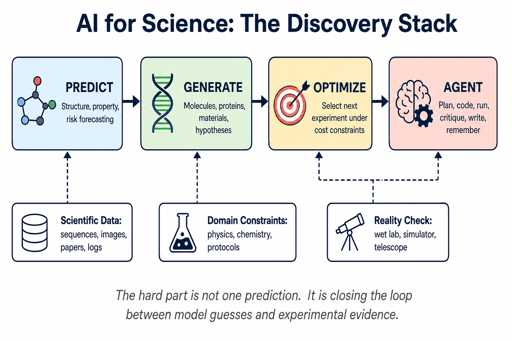
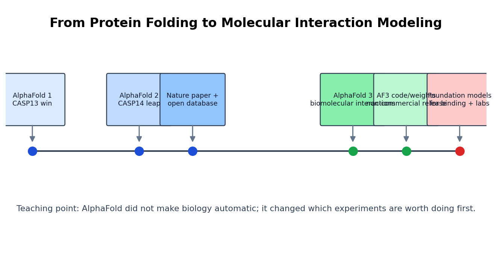
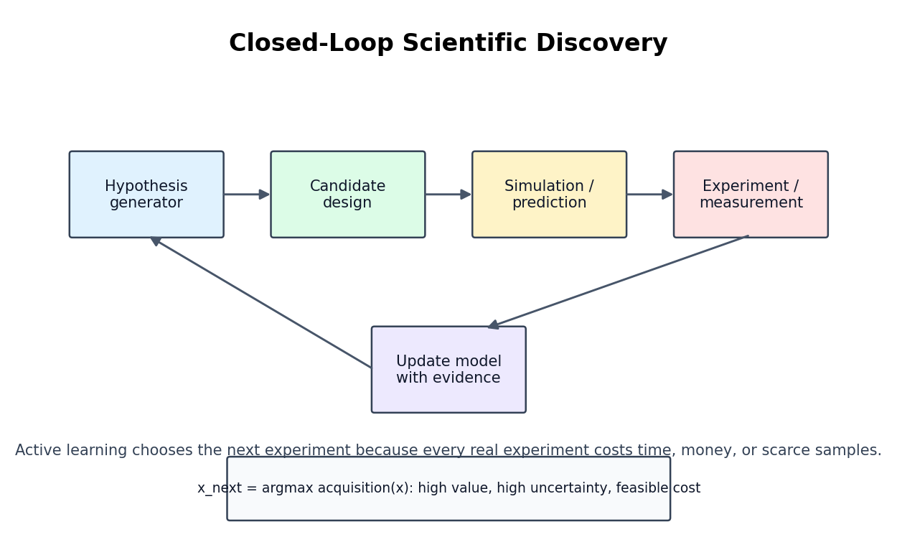
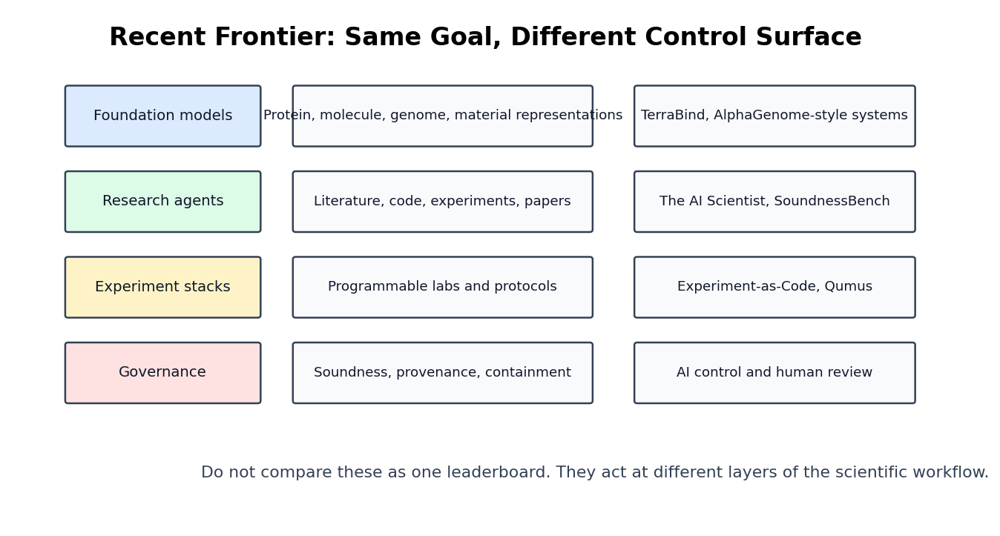

# Day 55: Research and Science（研究与科学）

> **核心问题**：为什么 AI for Science 不只是普通 LLM 应用？AlphaFold 又教会了我们什么，才能真正加速科学发现？

---

## 开篇

想象一个大型实验室。一个助手读论文，一个助手跑模拟，一个助手准备样品，一个助手记录实验日志，最后由资深研究者决定：明天那台昂贵显微镜的时间，到底该用来验证哪一个假设。Chatbot 可以在几分钟内模仿第一个助手；AI for Science 想做的是让整个实验流程的一部分变得可编程。

这也是为什么这个领域既令人兴奋，又很容易被夸大。[AlphaFold](https://deepmind.google/technologies/alphafold/) 改变结构生物学，是因为它击中了真实瓶颈：从蛋白质序列预测三维结构。但 AlphaFold 并没有“终结生物学”。它只是把一个昂贵步骤部分搬进了计算机，从而改变了人类科学家选择实验的方式。下一波系统会继续扩展这个思路：生成分子、设计实验、操作自动化实验室、批判研究想法、决定下一步该测什么。

本文要建立的核心直觉是：AI for Science 不是“LLM 写论文”，而是设计一种反馈循环，让数据、模型、领域约束和真实世界不断互相纠错。

---

## 1. 科学任务和普通软件任务有什么不同？

#### 直觉：科学像是在用一台很贵的烤箱做饭

在家做汤，你可以每分钟尝一口。如果每尝一口都要花 1 万美元、等一周，你就会非常谨慎地决定下一勺该尝哪里。很多科学领域都是这样。候选分子、材料、催化剂、基因编辑方案或天文观测计划，在计算机里可以大量生成；但在真实世界里验证它们，往往又慢、又贵、还带噪声。

这种成本结构改变了 AI 的任务。在客服场景里，模型主要需要“现在答对”。在科学场景里，模型常常要选择“下一次测量什么，才能学到最多”。


*图 1：AI for Science 覆盖预测、生成、优化和 agentic workflow 控制。真正困难的是把这些能力和证据闭环连起来。*

| 角色 | 做什么 | 典型失败方式 |
|------|--------|--------------|
| Predictor | 预测结构、性质、风险或实验结果 | 在训练分布之外自信外推 |
| Generator | 提出分子、蛋白、假设或实验方案 | 有新意但不可行 |
| Optimizer | 在预算约束下选择下一个候选 | 过度优化代理指标 |
| Agent | 规划、写代码、查文献、写报告、维护记忆 | 幻觉引用，或把执行误当成证据 |

这张表很重要，因为这些不是同一种产品形态。蛋白结构模型、实验室机器人、文献综述 agent、科学判断 benchmark，不应该被放进同一个排行榜里比较“谁更强”。它们控制的是科学发现流程中的不同层面。

从历史上看，AI for Science 也早于 LLM。符号回归、Bayesian optimization、专家系统、自驱动实验室，都是自动化发现的一部分。Foundation model 出现后的变化在于宽度：同一类模型现在能读方法部分、写代码、看图、调用工具，并用自然语言交流结果。这让“科研流程本身”开始变得可建模。

---

## 2. AlphaFold：最重要的锚点案例

#### 直觉：从猜一团金属丝，到读懂它的折叠历史

蛋白质序列像一根由氨基酸珠子串成的长线。科学问题不只是每颗珠子在哪里，而是整根线如何折成一个三维机器。AlphaFold 之前，研究者会结合物理模拟、进化信号、已知结构模板和昂贵实验。突破不在于一个神奇查表器，而在于让深度学习同时吸收进化历史和几何约束。

[AlphaFold 2](https://www.nature.com/articles/s41586-021-03819-2) 于 2021 年 7 月 15 日发表于 Nature，在 CASP14 中对许多蛋白结构达到接近实验水平的精度。它的实际影响来自结构是一个上游变量：一旦能得到可信的结构预测，研究者就能更好地优先选择突变、结合位点和后续实验。

[AlphaFold 3](https://www.nature.com/articles/s41586-024-07487-w) 于 2024 年发表，把目标从单个蛋白扩展到生物分子相互作用，包括蛋白、DNA、RNA、配体、离子和化学修饰。[AlphaFold Server](https://alphafoldserver.com/) 和 [AlphaFold Protein Structure Database](https://alphafold.ebi.ac.uk/) 让更多研究者能直接使用结构预测；同时，这个系统也提醒我们：科学 AI 经常位于开放科学、安全边界和商业药物发现之间。


*图 2：AlphaFold 将领域从单一结构预测推向相互作用建模，以及更下游的发现闭环。*

更深的启发是：AlphaFold 转移了瓶颈。它没有让生物学家失去作用，而是改变了他们的实验队列。过去团队可能花几个月问“这个结构可能是什么”；现在可以更快地问“哪个预测机制最值得验证”。这正是 AI for Science 在各领域反复出现的模式：模型压缩一个阶段的不确定性，然后瓶颈转移到实验验证、数据质量或因果解释。

---

## 3. 核心循环：生成、预测、选择、测试、学习

#### 直觉：像侦探一样昂贵地购买线索

侦探可以采访全城所有人，但时间有限。好的侦探会问下一个最能消除不确定性的问题。闭环科学发现也是如此：系统提出候选，预测结果，选择下一次实验，观察真实结果，再更新模型。


*图 3：Active learning loop 会把实验结果变成下一轮选择的依据，而不是把每次实验都当成孤立猜测。*

一个常见数学抽象是 active learning 或 Bayesian optimization。每一轮选择 acquisition function 最大的候选：

$$
\begin{aligned}
x_{\text{next}} &= \arg\max_x a(x) \\
a(x) &= \text{predicted value}(x) + \lambda \cdot \text{uncertainty}(x) - \gamma \cdot \text{cost}(x)
\end{aligned}
$$

不同领域会使用不同 acquisition function，但思想稳定：一个候选值得测试，是因为它看起来有价值、能减少不确定性，并且成本可接受。这个公式不是为了显得“数学”，而是解释为什么科学 AI 不能只看“预测分数最高”。如果系统总是选择预测最好的候选，它可能困在有偏模型里；如果只探索不确定性而不管成本，它会浪费实验资源。

上面的控制流图和公式一样重要。没有闭环，公式只是一个排序规则；有了闭环，每一次失败实验都会变成信息。

---

## 4. 不同科学领域需要不同形态的 AI

#### 直觉：工具箱相似，厨房完全不同

厨师刀、温度计、烤箱在很多厨房都有用，但做面包和做寿司仍然是不同约束。AI for Science 也一样。生物、化学、材料、气候、天文、数学都会用模型，但验证方式不同。

| 领域 | AI 帮什么忙 | 真实世界验证 |
|------|-------------|--------------|
| Biology | 结构、相互作用、表型、扰动设计 | 湿实验、临床数据、复现实验 |
| Chemistry | 逆合成、结合、反应优化 | 产率、选择性、毒性、可制造性 |
| Materials | 候选结构、相稳定性、性质预测 | 合成、表征、器件性能 |
| Physics and astronomy | 模拟替代模型、异常检测、方程发现 | 仪器、模拟、统计显著性 |

所以，“AI scientist” 是一个家族名，不是一个系统名。计算机科学研究 agent 可以完全在代码里跑实验；药物发现 agent 必须面对生物实验；量子材料 agent 需要仪器；数学 agent 需要 proof verification。架构必须匹配验证通道。


*图 4：近期前沿工作分布在不同层面：foundation model、研究 agent、实验系统和治理机制。*

真正的设计问题是：闭环在哪里结束？如果闭环结束在 Python benchmark，agent 需要很强的代码、评估和复现能力；如果结束在湿实验，agent 需要 protocol grounding、样品追踪、安全约束和能处理不确定性的实验选择。

---

## 5. 2026 年的前沿更新

#### 直觉：从聪明笔记本，走向初级实验搭档

过去 6 个月的趋势很清楚：研究者不再只问 AI 能不能预测一个性质，而是在问 AI 能不能管理科学方法的一部分。

| 日期 | 项目 | 贡献 |
|------|------|------|
| 2026-03-25 | Nature 论文 [The AI Scientist](https://www.nature.com/articles/s41586-026-10265-5) | 端到端 ML 研究 pipeline：生成想法、写代码、跑实验、写论文、自动评审 |
| 2026-02-08 | [TerraBind](https://arxiv.org/abs/2602.07735) | 用更快的粗粒度结构表示预测 protein-ligand binding 和 affinity，并支持不确定性选择 |
| 2026-05-06 | [Experiment-as-Code Labs](https://arxiv.org/abs/2605.04375) | 把 AI agent 连接到可编程科学仪器的声明式系统栈 |
| 2026-05-09 | [Agentic AI Scientists Are Not Built For Autonomous Scientific Discovery](https://arxiv.org/abs/2605.08956) | 指出当前 agent 缺少隐性实验知识、多样性和物理反馈闭环 |
| 2026-05-18 | [Qumus](https://arxiv.org/abs/2605.18407) | 用机器人测量和迭代学习构建量子材料 embodied AI experimentalist |
| 2026-05-28 | [SoundnessBench](https://arxiv.org/abs/2605.30329) | 测试模型能否区分方法论上可靠和不可靠的研究想法 |

其中两项尤其关键。第一，The AI Scientist 说明计算型研究 workflow 已经能自动化到通过 workshop 级别同行评审的程度；但论文也强调了弱点：想法不够深、实现错误、引用幻觉，以及伦理风险。第二，SoundnessBench 直接针对评估缺口：如果 AI research agent 不能可靠地拒绝不严谨想法，它加速的可能不是发现，而是噪声。

近期最有价值的系统大概率是 co-scientist，而不是完全自治的“诺奖机器”。它们会起草假设、查文献、写代码、提出实验方案、维护实验日志；而人类仍然负责问题选择、安全、解释和高风险验证。

---

## 6. 一个最小 active-learning 例子

#### 直觉：测试最能提供信息的候选，而不只是最漂亮的预测

下面的玩具代码模拟候选选择。每个候选都有预测价值、不确定性和成本。Acquisition rule 同时平衡 exploitation、exploration 和预算。

```python
import numpy as np

rng = np.random.default_rng(7)

# Imagine 20 candidate molecules or materials.
predicted_value = rng.normal(loc=0.5, scale=0.15, size=20)
uncertainty = rng.uniform(0.02, 0.30, size=20)
cost = rng.uniform(0.1, 1.0, size=20)

exploration_weight = 0.8
cost_penalty = 0.25

acquisition = (
    predicted_value
    + exploration_weight * uncertainty
    - cost_penalty * cost
)

chosen = np.argsort(acquisition)[-5:][::-1]

for rank, idx in enumerate(chosen, start=1):
    print(
        f"#{rank}: candidate={idx:02d} "
        f"value={predicted_value[idx]:.3f} "
        f"uncertainty={uncertainty[idx]:.3f} "
        f"cost={cost[idx]:.3f} "
        f"acquisition={acquisition[idx]:.3f}"
    )
```

真实系统里的 predicted value 可能来自 graph neural network、diffusion model、protein language model 或物理模拟器。Uncertainty 可能来自 ensemble、Bayesian model、conformal prediction，或多个工具之间的分歧。Cost 可能包括试剂价格、仪器时间、毒性风险、合成难度或机会成本。

重点不是这个简单公式能解决药物发现，而是：科学 AI 应该按它如何使用稀缺证据来评价。

---

## 7. 常见误解

### 误解 1：“AlphaFold 解决了生物学。”

AlphaFold 解决了许多情况下的结构预测瓶颈。生物学仍然需要理解动力学、细胞环境、疾病机制、扰动效应、毒性、因果关系和实验验证。结构是强线索，不是完整案件。

### 误解 2：“AI scientist 就是带工具的 LLM。”

工具是必要条件，但远远不够。Scientific agent 需要 provenance、可复现性、不确定性估计、安全约束、领域数据，以及来自真实世界的反馈闭环。一个 tool-calling demo 可以很炫，但仍然在科学上很脆弱。

### 误解 3：“benchmark 分数最高的模型就是最好模型。”

科学经常关心的是“下一次该做什么实验”，而不是静态预测榜单第一。一个校准良好、能表达不确定性的模型，可能比一个分数更高但在分布外过度自信的模型更有用。

### 误解 4：“自治程度越高越好。”

在高风险科学中，没有责任机制的 autonomy 很危险。系统越能作用于真实世界，就越需要 human oversight、audit trail、preregistration 和 containment。Human-AI collaboration 不是临时弱点，很多时候就是正确设计。

---

## 8. 延伸阅读

### 入门

1. [AlphaFold overview](https://deepmind.google/technologies/alphafold/) — Google DeepMind 对 AlphaFold 的产品与研究概览。
2. [AlphaFold Protein Structure Database](https://alphafold.ebi.ac.uk/) — 可公开访问的蛋白结构预测数据库。
3. [Stanford AI Index 2026: Science](https://hai.stanford.edu/ai-index/2026-ai-index-report/science) — 从数据角度观察 AI 在科学中的角色。

### 进阶

1. [Accurate structure prediction of biomolecular interactions with AlphaFold 3](https://www.nature.com/articles/s41586-024-07487-w) — AlphaFold 3 的 Nature 论文。
2. [Towards end-to-end automation of AI research](https://www.nature.com/articles/s41586-026-10265-5) — The AI Scientist 的 Nature 论文。
3. [Experiment-as-Code Labs](https://arxiv.org/abs/2605.04375) — 从系统角度理解 AI-driven scientific labs。

### 论文

1. [Highly accurate protein structure prediction with AlphaFold](https://www.nature.com/articles/s41586-021-03819-2)
2. [TerraBind: Fast and Accurate Binding Affinity Prediction through Coarse Structural Representations](https://arxiv.org/abs/2602.07735)
3. [Qumus: Realization of An Embodied AI Quantum Material Experimentalist](https://arxiv.org/abs/2605.18407)
4. [SoundnessBench: Can Your AI Scientist Really Tell Good Research Ideas from Bad Ones?](https://arxiv.org/abs/2605.30329)
5. [Agentic AI Scientists Are Not Built For Autonomous Scientific Discovery](https://arxiv.org/abs/2605.08956)

---

## 思考题

1. 如果实验很贵，AI 系统什么时候应该选择“不确定性”而不是“预测价值”？
2. 你所在领域哪些部分有清晰反馈闭环？哪些部分依赖人类隐性判断？
3. 你会如何审计一个 AI research agent，让失败实验也保留下来成为证据，而不是消失在日志里？

---

## 总结

| 概念 | 一句话解释 |
|------|------------|
| AI for Science | 通过建模数据、假设、实验和反馈循环来加速科学发现的 AI 系统 |
| AlphaFold | 里程碑式结构预测系统，把生物学中的一个重要瓶颈部分转移到计算中 |
| Closed-loop discovery | 生成候选、预测结果、选择实验、测试、再更新模型 |
| Active learning | 按信息价值选择下一次实验，而不只是按预测成功率选择 |
| AI scientist | 自动化科学 workflow 某些部分的 agentic system，但仍需要验证和治理 |

**核心 takeaway**：AI for Science 真正强大的地方，是尊重科学最核心的约束：现实世界才是裁判，而查询现实世界很贵。最好的系统不只是流畅或分数高，而是帮助研究者更聪明地使用稀缺证据。

---

*Day 55 of 60 | LLM Fundamentals*  
*字数：约 3,900 中文字符 | 阅读时间：约 17 分钟*
