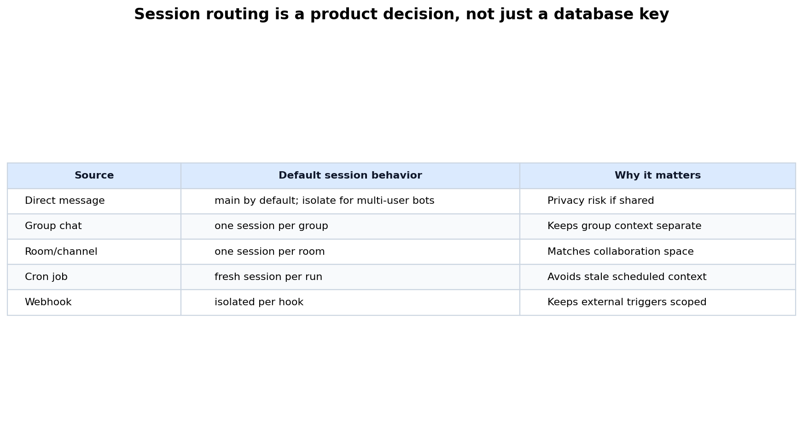

# Day 56: OpenClaw Architecture Overview（OpenClaw 架构总览）

> **核心问题**：为什么 OpenClaw 要把一切都围绕 Gateway 组织？Channel 和 Session 又是如何把日常聊天消息变成可控的 agent 行动的？

---

## 开场

很多 LLM 工具的起点是一个聊天框。OpenClaw 的起点更像一个总机。

想象一家深夜还在运转的小酒店。不同房间的客人打电话到前台，前台要知道是谁打来的、属于哪个房间、请求是否紧急，以及应该交给哪个员工处理。如果客人要毛巾，前台转给客房服务；如果有人要求打开上锁的储藏室，前台必须先确认这个人有没有资格提出这个请求。关键不是电话本身，而是那个负责路由、记忆上下文、执行规则、分派工作的前台。

OpenClaw 对 AI agent 采用的也是这个思路。一条消息可能来自 WhatsApp、Telegram、Slack、Discord、WebChat、CLI、cron job，或者移动端 node。系统不应该为每个入口都创建一个不同的“大脑”。它应该先把事件标准化，判断这条消息属于哪段对话，组装正确的上下文，运行 agent loop，再把回复送回当前应该送达的地方。这就是为什么 OpenClaw 的架构围绕三个概念展开：**Gateway**、**Channel** 和 **Session**。

这篇文章不是产品教程，而是一篇系统架构课。OpenClaw 是现代 agent infrastructure 的一个具体样本：难点已经不只是“调用 LLM”，而是如何跨多个入口管理 identity、memory、tools、delivery 和 trust。

---

## 1. 大图景：一个 Gateway，多个入口

#### 直觉：机场塔台

可以把 Gateway 想成机场塔台。飞机从不同方向飞来，但它们不会分别和跑道、油车、行李系统直接协商。塔台接收信号、分配跑道、防止冲突，并维护整个机场的共同态势。在 OpenClaw 里，channel 是这些飞机，session 是被分配的航线，tools 则是会触碰现实世界的地面作业。


*图 1：Gateway 位于 channel adapters、control clients、sessions、tools、memory 和 model providers 之间。重点不是做一个更大的聊天框，而是建立统一的协调中心。*

根据 [OpenClaw 官方概览](https://docs.openclaw.ai/)，OpenClaw 是一个 self-hosted gateway，用来把各种聊天应用和 channel surface 连接到 AI coding agents。[Gateway architecture 文档](https://docs.openclaw.ai/concepts/architecture)进一步说明，OpenClaw 使用一个长期运行的 Gateway 来拥有 messaging surfaces、暴露 WebSocket API，并作为 sessions、routing 和 channel connections 的 single source of truth。

“一个长期运行的 Gateway”是第一个重要架构选择。它让系统有一个统一位置来回答这些问题：

| 问题 | Gateway 的职责 | 为什么重要 |
|---|---|---|
| 谁发来的？ | 认证 clients、pair nodes、验证 channel identity | 防止随机输入变成可信行动 |
| 应该送到哪里？ | 把 channel events 解析成 session keys | 让上下文留在正确对话里 |
| 它能做什么？ | 应用 tool policy、approvals 和 runtime config | 限制错误或恶意指令造成的损害 |
| 输出怎么返回？ | 跟踪 delivery route 并 stream response events | 让同一任务可以跨入口继续执行 |

这张表很重要，因为很多人会把 agent system 描述成“LLM 加 tools”。这个说法太小了。一个真正有用的 personal agent 更接近“LLM 加 tools 加 routing 加 memory 加 delivery 加 policy”。OpenClaw 把这些职责收拢到 Gateway 后面，让每个入口都通过同一个 control plane 说话。

### 1.1 Gateway 拥有什么

Gateway 不只是一个 reverse proxy。它承担几类工作：

1. **连接管理**：channel adapters、Control UI、CLI、automations 和 nodes 都通过 Gateway 连接，control-plane clients 通常使用 WebSocket。
2. **协议校验**：inbound frames 在变成系统事件前，会先经过 typed schema 校验。
3. **事件发布**：clients 可以订阅 health、presence、chat、agent lifecycle、stream updates、cron events 等事件。
4. **Session routing**：每条 inbound message 会被映射到一个 session，而不是直接变成一次 model call。
5. **Agent execution**：Gateway 接受 agent run、排队、stream 输出，并持久化状态。
6. **Trust policy**：authentication、device pairing、allowlists、tool policy 和 security audit checks 都围绕 Gateway 协调。

这种中心化有 trade-off。它让运维推理更简单，因为每台 host 上只有一个权威入口；但它也意味着 Gateway 会成为非常重要的安全边界。如果随意暴露 Gateway，就等于暴露了能够路由消息、查看 session、委托 tool use 的系统。所以 OpenClaw 的 [security documentation](https://docs.openclaw.ai/gateway/security) 反复强调，Gateway 适合 personal-assistant trust boundary，而不是面向互不信任用户的 hostile multi-tenant isolation layer。

---

## 2. Channels：把混乱的人类入口标准化

#### 直觉：会议里的翻译

想象一场国际会议，参会者用不同语言和格式提问。有人对着麦克风说，有人在纸条上写，有人通过 app 发消息。主讲人不应该直接处理所有格式。翻译会先把问题转成一种共同结构，再送到台上。

Channel 在 OpenClaw 里做的就是这件事。Telegram message、Slack thread、WhatsApp DM 和 WebChat input 都带着不同的 metadata。Agent runtime 不应该关心每个平台的原生细节。Channel adapter 会把平台特定输入转换成标准事件：sender、account、channel、thread 或 room、attachments、text、command markers 和 delivery information。


*图 2：一条消息会经过 normalization、Gateway intake、session resolution、context assembly、agent execution 和 reply delivery，最后变成 agent action。*

OpenClaw 的 [channel docking documentation](https://docs.openclaw.ai/concepts/channel-docking) 提供了一个很好的例子，说明 channel 不只是输入管道。Docking 允许用户保持同一个 session context，同时改变未来回复送达的 channel。一个任务可以从 Telegram 开始，然后在 Discord 继续，而不需要重新创建 session。Session 没变，改变的只是 delivery fields。

这个区分很关键：

| 层 | 会改变什么 | 应该保持稳定什么 |
|---|---|---|
| Channel | Delivery surface、account、thread、formatting | 用户意图和消息内容 |
| Session | Conversation identity、transcript、active route | 任务连续性 |
| Agent runtime | Model、tools、context、output stream | 系统 policy 和 state invariants |

因此，把不同 channel 当作 model 来比较是 category mistake。Telegram、Slack、WebChat 和 cron 是约束不同的入口形态。正确问题不是“哪个更聪明”，而是“这个入口需要携带哪些 metadata 和 delivery behavior，Gateway 才能安全地路由它？”

### 2.1 Channel 设计要求

Agent system 里的 channel adapter 通常要处理五件事：

1. **Inbound parsing**：读取平台原生 payload，提取 message text、sender identity、thread context、attachments 和 command syntax。
2. **Authorization hints**：检查 allowlists、group mention rules、account bindings 和平台特定 identity data。
3. **Canonical routing fields**：生成稳定字段，让 Gateway 能解析 session。
4. **Outbound rendering**：把 agent replies 转成目标平台的消息格式，包括 chunking、attachments、edits 和 retries。
5. **Backpressure behavior**：决定如何处理快速 follow-ups、long-running jobs 和 interruption commands。

这些工作不花哨，但它们决定系统是 demo 还是可靠 agent。如果 adapter 丢了 thread identity，回复就会跑到错误房间；如果它把所有 DM 都当成同一个 sender，隐私上下文就可能泄漏；如果 tool 已经向用户发过消息，而 adapter 又重复发送确认，agent 就会显得混乱。架构经常通过这些小失败显形。

---

## 3. Sessions：memory、routing 和 concurrency 的基本单位

#### 直觉：案件档案

把 session 想成侦探的案件档案。档案里有访谈记录、证据、笔记和未完成任务。电话、邮件、面对面交谈都可以添加到同一个案件档案里，但前提是侦探知道它们属于同一件案子。如果两个无关案件共用一个文件夹，证据就会泄漏；如果同一案件被拆成五个文件夹，侦探就会忘记之前发生了什么。

OpenClaw sessions 就是这些案件档案。官方 [session management documentation](https://docs.openclaw.ai/concepts/session) 说明，OpenClaw 会根据来源把消息路由到 sessions：direct messages、group chats、rooms、cron jobs 和 webhooks。文档也提醒，如果多个人都能给 agent 发消息，就应该启用 DM isolation，否则 direct messages 可能共享同一个 conversation context。


*图 3：Session routing policy 决定上下文是共享、隔离、复用还是重置。这不只是存储细节，而是产品和安全设计。*

默认路由行为可以概括为：

| 来源 | 典型 session 行为 | 如果设计错了，主要风险是什么 |
|---|---|---|
| Direct message | 单用户场景下默认共享 | 多用户隐私泄漏 |
| Group chat | 每个 group 独立 | 不同群的上下文混淆 |
| Room 或 channel | 每个 room 独立 | 回复出现在错误协作空间 |
| Cron job | 每次运行新 session | 定时任务继承陈旧上下文 |
| Webhook | 每个 hook 隔离 | 外部触发互相污染 |

### 3.1 为什么 Session Key 不是 Authorization

Session key 选择上下文。它不应该被当成“调用者有权做某事”的证明。

这是一个细微但很重要的架构点。很多 web app 会不小心把 identifier 当成 security boundary：“只要知道这个 URL，就能访问这份数据。” Agent system 风险更高，因为 session 里可能包含 credentials、tool outputs、files、browser state 和 private messages。OpenClaw security docs 明确指出，`sessionKey` 是 routing 或 context selector，不是 per-user authorization token。

更清晰的设计是把三个概念分开：

| 概念 | 目的 | 混淆后可能出现的失败 |
|---|---|---|
| Identity | 谁在调用？ | 网站或陌生人伪装成可信设备 |
| Authorization | 这个调用者能做什么？ | 普通聊天 sender 可以触发 host-level tools |
| Session routing | 这条消息应该使用哪个上下文？ | Bob 复用了 Alice 的 transcript |

当这些概念分开后，系统就更容易推理。Session 可以 dock 到另一个 channel，而不会给新人授权；用户可以被允许聊天，但不代表他能运行 shell commands；node 可以被 paired 用于 device actions，但不代表每个 channel sender 都是 trusted operator。

### 3.2 Concurrency：一个案件档案一条 lane

#### 直觉：一个案板上只能有一个主厨

如果两个厨师同时在同一块小案板上切菜，问题不只是乱。他们可能覆盖彼此的工作、混在错误配料里，或者误解正在做哪道菜。Session transcript 也是这样。如果两个 agent runs 同时写入同一个 session，tool results 和 assistant replies 可能互相交错，最后变得难以解释。

OpenClaw 的 [agent loop documentation](https://docs.openclaw.ai/concepts/agent-loop) 描述了 per-session key 的 serialized runs，以及用 session write locks 保持 session history 一致。这是经典系统设计模式：保护共享可变状态的最小单位。

一个简化公式是：

$$
\begin{aligned}
\text{expected wait} &\approx \frac{\text{queued work for this session}}{\text{completion rate of this session lane}} \\
\text{collision risk} &\uparrow \quad \text{when independent runs write the same transcript concurrently}
\end{aligned}
$$

这个公式不是为了精确预测 latency，而是给出直觉：如果 session 是共享状态边界，那么这个 session 里的长任务会拖慢后续工作，但 serialization 避免了更糟糕的问题，比如冲突的 tool calls 和混乱的 transcript 顺序。对 agent infrastructure 来说，一致性通常比裸并行更重要。

---

## 4. Agent Loop：从消息到行动

#### 直觉：餐厅订单小票

在餐厅里，服务员不会对厨房大喊“做点吃的”。订单会变成一张小票：桌号、菜名、特殊要求、时间和送达位置。厨房根据小票做菜，服务员跟踪进度，最后把菜送回正确的桌子。

OpenClaw 的 agent loop 对消息做的也是这件事。Gateway 接受请求，解析 session，返回 accepted run identifier，准备 context，运行 model 和 tools，stream 部分输出，并记录结果。官方文档描述的 loop 包括 context assembly、model inference、tool execution、streaming replies 和 persistence。

关键在于区分 **accepting work** 和 **finishing work**。一个 long-running agent 可能会浏览网页、写文件、调用 tools、请求 approval，或者等待 model response。Gateway 必须能在最终答案出现前先告诉客户端：“你的请求已经被接受。”这就是 lifecycle events 重要的原因。

典型 event streams 包括：

| Stream | 表示什么 | 为什么重要 |
|---|---|---|
| lifecycle | Start、end、error、timeout | 让 clients 能显示可靠状态 |
| assistant | Text 或 reasoning deltas | 支持 streaming replies |
| tool | Tool start、update、result | 让 actions 可观察 |
| chat final | 渲染后的最终消息 | 保持 channel delivery 可预测 |

这种结构是 agent platform 不同于简单 chatbot API wrapper 的原因之一。Chatbot 可以只返回一个答案；agent 必须暴露 progress、tool activity、cancellation、timeout 和 partial delivery。架构必须把这些状态变成一等公民。

### 4.1 Context Assembly

在 model 看到 prompt 之前，runtime 会组装几层内容：

1. Base system prompt 和 runtime rules。
2. Workspace instructions，例如 `AGENTS.md`、`SOUL.md` 和本地 tool notes。
3. Loaded skills 和 tool descriptions。
4. Recent session transcript。
5. Retrieved memory 或 contextual documents。
6. Per-run overrides，例如 model choice、verbosity 或 thinking settings。

所以，OpenClaw 更适合被理解成一个 **context operating layer**，而不只是 chat client。Model 很重要，但用户体验很大程度上取决于哪些上下文进入 model，以及 runtime 随后暴露了哪些 actions。

---

## 5. Trust Boundaries：架构本身就是安全模型

#### 直觉：房门钥匙、保险箱钥匙和便利贴

一张写着“请用客房”的便利贴不是房门钥匙；房门钥匙也不是保险箱钥匙；有房门钥匙也不代表可以转账。在 agent system 里，session keys、gateway auth、node pairing、tool approvals 和 prompt instructions 经常被类似地混淆。


*图 4：Routing、authentication 和 delegated tool authority 应该是分开的层。把 routing key 当成 authorization boundary，是常见设计错误。*

OpenClaw security documentation 说得很直接：系统假设的是 personal-assistant deployment，也就是每个 Gateway 对应一个 trusted operator boundary。它不是为了让多个互不信任、甚至互相对抗的用户共享同一个强力 agent 和 host 而设计的 hostile multi-tenant boundary。对于 mixed-trust teams，文档建议用 separate gateways、credentials、OS users 或 hosts 来拆分 trust boundaries。

这不是 OpenClaw 独有的问题，而是所有 tool-using agents 的通用规则。一旦 agent 能执行 commands、读文件、控制浏览器或发送消息，安全问题就从“它能不能答对”变成“谁有权在什么机器上、用哪些 credentials、在什么 audit trail 下触发这个 action？”

### 5.1 Frontier Update：2026 年让 agent security 变得具体


*图 5：OpenClaw 在 2026 年的发展很快从 adoption 进入 architecture hardening 和 security analysis 阶段。*

过去六个月里，有两个近期动态对这篇架构课特别重要：

1. **2026 年 3 月 29 日 / 2026 年 5 月 13 日**：arXiv 论文 [“A Security Analysis of the OpenClaw AI Agent Framework”](https://arxiv.org/abs/2603.27517) 于 3 月 29 日提交，并在 5 月 13 日修订。论文把 OpenClaw 描述为一个把 LLM reasoning 连接到 execution surfaces 的 agent framework，这些 surfaces 包括 shell、filesystem、containers、browser automation 和 messaging。论文将系统拆成多个相互作用的层：channels、Gateway、plugins and skills、agent runtime、memory、LLM provider 和 local execution。它的核心教训是架构性的：如果 policy boundaries 只在局部层面执行，漏洞就可能跨层组合。
2. **2026 年 6 月 8 日**：Oasis Security 的 Elad Luz 在 [TechRadar Pro 文章](https://www.techradar.com/pro/what-the-openclaw-vulnerability-reveals-about-the-future-of-agentic-ai-security)中指出，AI agents 是 operational actors，不是简单的 productivity tools。文章描述了 local WebSocket Gateway attack scenario，并提到 OpenClaw maintainers 在 24 小时内发布修复。无论你使用 OpenClaw 还是其他 agent framework，教训都一样：一个拥有 credentials 和 host tools 的本地 agent，应该像拥有 operational authority 的 identity 一样治理。

还要注意项目发布节奏。在调研时，[OpenClaw GitHub repository](https://github.com/openclaw/openclaw) 显示最新 release 为 2026 年 6 月 21 日的 `2026.6.9`。这说明项目迭代很快。快速演进的 agent infrastructure 需要频繁 patch、明确 threat modeling，以及保守默认配置。

---

## 6. 这套架构给 OpenClaw 之外的启发

#### 直觉：城市基础设施，不是单个 app

城市不能只靠一条路运行。它需要道路、红绿灯、地址系统、应急规则、维护队伍和身份证明。Personal agent platform 也是类似的。Model 只是更大系统里的一个引擎。

OpenClaw 展示了五条适用于很多 agent frameworks 的架构原则：

| 原则 | OpenClaw 例子 | 通用教训 |
|---|---|---|
| 集中 control-plane authority | 一个 Gateway 拥有 routing 和 sessions | 避免 policy decisions 散落在 adapters 里 |
| 尽早标准化入口 | Channels 把原生消息转成 common events | 让 model/runtime code 不依赖平台细节 |
| 把 sessions 当成 state boundaries | Session store、transcripts、reset policy、write locks | 在正确粒度保护 memory 和 concurrency |
| 区分 routing 和 authorization | `sessionKey` 不是 auth token | 不要把 identifier 当 permission |
| 让 actions 可观察 | lifecycle、assistant、tool、final streams | Agents 需要 auditability，不只是 answers |

这些原则也帮助我们更公平地比较 OpenClaw 和其他系统，而不是把不同产品形态硬放在一起。Claude Code、OpenAI Codex 等 coding agents 更强调 development workspace 里的 code execution；Google ADK 和 LangGraph 风格系统更强调 application-level agent construction 和 orchestration；OpenClaw 更强调 self-hosted、multi-channel personal assistant Gateway。这些产品有重叠，但不完全相同。公平比较应该按 domain 和 control surface，而不是问谁“最好”。

---

## 7. 一个最小 Routing Model 代码示例

下面的代码不是 OpenClaw 实现，而是一个可运行的小模型，用来抓住核心思想：标准化 channel events、解析 session、按 session 串行化工作，并把 delivery 和 context 分开。

```python
from dataclasses import dataclass
from collections import defaultdict, deque
from typing import Deque, Dict, Optional


@dataclass(frozen=True)
class ChannelEvent:
    channel: str
    account_id: str
    sender_id: str
    room_id: Optional[str]
    text: str


@dataclass
class Session:
    session_id: str
    transcript: list[str]
    last_channel: str
    last_to: str


class MiniGateway:
    def __init__(self, dm_scope: str = "per-channel-peer"):
        self.dm_scope = dm_scope
        self.sessions: Dict[str, Session] = {}
        self.lanes: Dict[str, Deque[ChannelEvent]] = defaultdict(deque)

    def session_key(self, event: ChannelEvent) -> str:
        if event.room_id:
            return f"room:{event.channel}:{event.account_id}:{event.room_id}"
        if self.dm_scope == "main":
            return "dm:main"
        return f"dm:{event.channel}:{event.account_id}:{event.sender_id}"

    def accept(self, event: ChannelEvent) -> str:
        key = self.session_key(event)
        session = self.sessions.setdefault(
            key,
            Session(
                session_id=key,
                transcript=[],
                last_channel=event.channel,
                last_to=event.sender_id,
            ),
        )
        session.last_channel = event.channel
        session.last_to = event.sender_id
        self.lanes[key].append(event)
        return key

    def run_next(self, key: str) -> Optional[str]:
        if not self.lanes[key]:
            return None
        event = self.lanes[key].popleft()
        session = self.sessions[key]
        session.transcript.append(f"user({event.sender_id}): {event.text}")

        # A real system would assemble context, call the model, run tools,
        # stream events, and persist tool results. This sketch only records
        # the state boundary and delivery route.
        reply = f"assistant -> {session.last_channel}/{session.last_to}: acknowledged"
        session.transcript.append(reply)
        return reply


gateway = MiniGateway()
event = ChannelEvent("telegram", "default", "alice", None, "summarize my notes")
key = gateway.accept(event)
print(key)
print(gateway.run_next(key))
```

最重要的不是那句 fake reply，而是 `session_key` 函数。这个决定会定义 context sharing、privacy、concurrency 和 delivery behavior。在真正的 agent system 中，routing policy 同时是产品设计、安全设计和数据架构。

---

## 8. 常见误解

### 误解 1：“Gateway 只是 network proxy。”

不是。Proxy 负责转发 traffic；Gateway 负责协调 identity、sessions、events、agent runs、tools、nodes 和 delivery。它更接近 control plane，而不是一根哑管道。

### 误解 2：“只要 sessions 隔离，系统就安全。”

Session isolation 保护的是 context。它不会自动保护 host tools、credentials、browser state 或 node actions。安全还需要 authentication、authorization、least privilege、sandboxing、audit logs 和谨慎的 deployment boundaries。

### 误解 3：“Multi-channel support 只是方便。”

它确实方便，但不只是方便。Multi-channel support 会迫使架构分离 message content、sender identity、session continuity 和 delivery route。正是这种分离，让 docking、mobile use、cron triggers 和 multi-agent routing 成为可能。

### 误解 4：“OpenClaw 应该直接和所有 agent 产品比较。”

需要谨慎。OpenClaw 是用于 multi-channel personal agents 的 self-hosted Gateway。Code IDE agent、cloud customer-service agent、RL robot controller 和 workflow automation tool 都可能使用 LLM，但它们的 trust boundaries、latency needs、action spaces 和 user interfaces 都不同。

---

## 9. 延伸阅读

### OpenClaw 官方文档

1. [OpenClaw overview](https://docs.openclaw.ai/) — self-hosted Gateway model 的官方起点。
2. [Gateway architecture](https://docs.openclaw.ai/concepts/architecture) — Gateway、WebSocket protocol、clients、nodes 和 invariants。
3. [Session management](https://docs.openclaw.ai/concepts/session) — routing behavior、DM isolation、lifecycle 和 storage。
4. [Agent loop](https://docs.openclaw.ai/concepts/agent-loop) — accepted agent runs 如何变成 streamed model/tool events。
5. [Security](https://docs.openclaw.ai/gateway/security) — trust boundaries、audit checks 和 deployment guidance。

### Recent Frontier Items

1. [A Security Analysis of the OpenClaw AI Agent Framework](https://arxiv.org/abs/2603.27517) — arXiv 论文，2026 年 3 月 29 日提交，2026 年 5 月 13 日修订。
2. [What the OpenClaw vulnerability reveals about the future of agentic AI security](https://www.techradar.com/pro/what-the-openclaw-vulnerability-reveals-about-the-future-of-agentic-ai-security) — Elad Luz 于 2026 年 6 月 8 日发表在 TechRadar Pro 的分析。
3. [OpenClaw GitHub repository](https://github.com/openclaw/openclaw) — public source、releases 和 development cadence。

---

## 思考题

1. 如果你要给两个家庭成员部署 personal agent，你会使用一个 Gateway、两个 agents、两个 gateways，还是两个 OS users？你隐含的 trust boundary 是什么？
2. 对一个 tool-using agent 来说，哪个更危险：错误的 model output、错误的 session routing，还是过宽的 tool authority？为什么？
3. 你会如何设计一个 channel adapter，让 Slack thread、Telegram DM 和 cron job 都能使用同一个 agent runtime，同时不泄漏 context？

---

## 总结

| 概念 | 一句话解释 |
|---|---|
| Gateway | 长期运行的 control plane，拥有 routing、sessions、connections 和 agent run coordination |
| Channel | 把混乱的人类入口标准化为 common events 和 delivery routes 的 platform adapter |
| Session | Transcript、context、routing、lifecycle 和 concurrency 的状态边界 |
| Agent loop | 从 accepted message 到 context assembly、model/tool work、streaming 和 persistence 的执行路径 |
| Trust boundary | Identity、authorization、routing 和 delegated tool authority 之间的分离 |

**核心 takeaway**：OpenClaw 的架构有意思，是因为它把 agent 当成 always-available operational system，而不是孤立的 chat completion。Gateway 给系统一个 control plane；channels 把外部世界翻译成 normalized events；sessions 保存 context 并管理 concurrency；trust boundaries 决定谁能触发现实行动。理解这四块，就理解了很多实用 agent platforms 背后的核心架构模式。

---

*Day 56 of 60 | LLM Fundamentals*  
*字数：约 6,200 中文字符 | 阅读时间：约 18 分钟*
