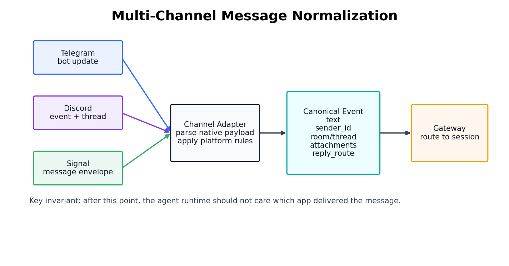
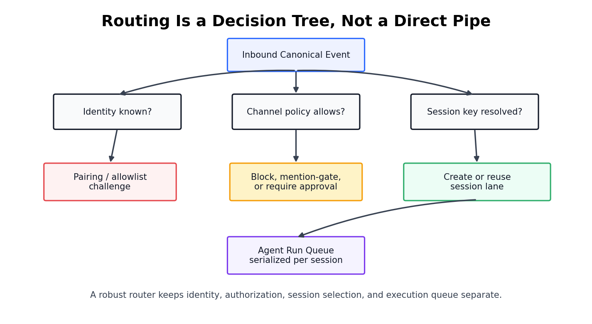
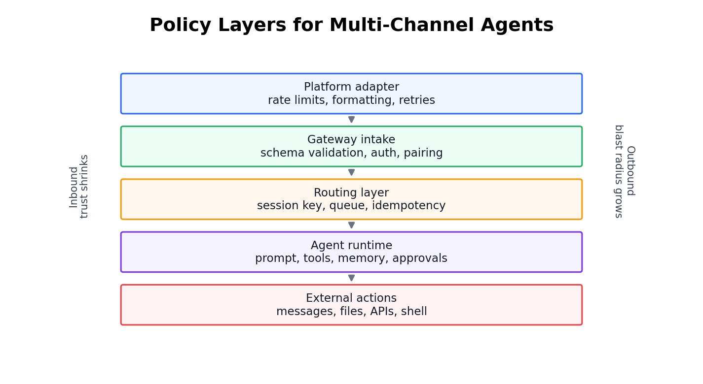
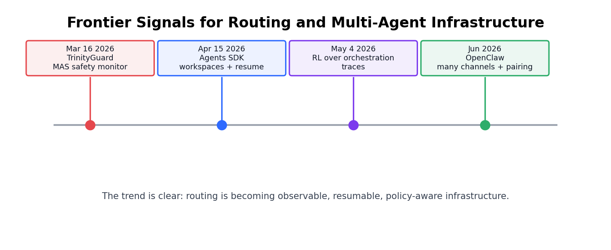

# Day 57: Message Routing and Multi-Channel（消息路由与多渠道接入）

> **核心问题**：一个个人 AI agent 怎样同时接收 Telegram、Discord、Signal 等渠道的消息，而不是把每个聊天软件都变成一个互相割裂的助手？

---

## 开场

很多人第一次看到 multi-channel agent，会以为这只是一个方便功能：“我可以从 Telegram、Discord、Signal、Slack 或 WebChat 找同一个助手。”听起来像 UI 层的小技巧，但真正困难的地方不在于把文字发到多个 app。难点是系统必须判断：**谁**发来了消息，消息属于**哪段对话**，这位发送者有什么**权限**，回复应该从**哪里返回**，以及这条新消息应该打断、加入还是排在某个正在运行的任务后面。

想象一家医院的前台。病人可能通过电话、网页表单、救护车电台或现场挂号进来。医院不能因为病人换了入口，就为同一个人新建一份病历；也不能因为两个人的问题听起来相似，就把他们的病历合并。前台要把混乱的入口请求整理成结构化记录，核对身份，分诊到正确科室，并留下可追踪的记录。

Multi-channel agent routing 就是 LLM 系统里的这个前台。模型只是医院里的一个工作人员。路由层决定工作人员看到的是不是正确病历、来访者有没有资格提问、最终回答会不会送回正确房间。

---

## 1. Multi-Channel Routing 到底解决什么问题

#### 直觉：很多扇门，一张楼内地图

可以把 Telegram、Discord、Signal、Slack 和 WebChat 想成同一栋楼的不同入口。入口很重要，因为每扇门都有自己的门锁、摄像头和告示牌。但人进楼之后，楼内应该使用同一张地图：房间、人员、权限和档案。Multi-channel routing 的工作，就是把每扇门的特殊信号转换成系统内部统一理解的地图。


*图 1：Channel adapter 先把各平台原生事件转换成 canonical event，Gateway 再解析 session 并启动 agent run。*

[OpenClaw repository](https://github.com/openclaw/openclaw) 把 OpenClaw 描述为一个可以在多种渠道上响应的个人助手，包括 WhatsApp、Telegram、Slack、Discord、Signal、iMessage、Matrix、Microsoft Teams、WebChat 等。[channel configuration docs](https://docs.openclaw.ai/gateway/config-channels) 暴露了真正的系统设计问题：每个 channel 都可能需要 DM policy、group policy、allowlist、mention gating、per-channel key 和 multi-account routing。

所以，channel adapter 不是一个很薄的 webhook。它至少要完成五件事：

| 工作 | 处理内容 | 忽略后的后果 |
|---|---|---|
| Parse | 原生 payload、正文、附件、发送者、房间、thread | agent 丢失上下文或漏掉文件 |
| Authenticate | bot token、平台身份、pairing 状态 | 陌生人可以直接进入系统 |
| Normalize | 把平台字段转换成 canonical field | runtime 代码里到处都是平台分支 |
| Render | 分块、编辑、引用、附件、重试回复 | 输出格式坏掉，或者重复发送 |
| Backpressure | rate limit、追问、取消、长任务 | 用户可以把 agent 冲垮或制造 race condition |

设计目标说起来很简单，但实现并不容易：normalize 之后，agent runtime 不应该关心这条消息来自 Telegram 还是 Discord。它应该收到一个 canonical event，里面有正文、发送者身份、room 或 thread 身份、附件和 reply route。

### 1.1 为什么“每个平台加一个 bot”不可持续

最朴素的做法是每个平台建一个 bot，让每个 bot 直接调用模型。Demo 可以这样做。一旦助手需要 memory、tool、approval 或长任务，这种设计很快会出问题。

| 设计 | 适合场景 | 会在什么时候崩 |
|---|---|---|
| 每个 app 一个独立 bot | 玩具 demo、很窄的客服 bot | 同一个用户跨 app 继续任务 |
| 共享 model API，但 app 逻辑分散 | 小型生产 chatbot | 权限和 memory 开始分叉 |
| 统一 Gateway + channel adapter | 个人 agent、多入口 agent、tool-using 系统 | Gateway 变成关键 trust boundary |

最后一行是 [OpenClaw](https://openclaw.ai/) 这类系统采用的模式：Gateway 位于 channel 和 agent runtime 之间。Gateway 不是比 Telegram 或 Discord “更聪明”。它的作用是让 routing、policy、state 和 delivery 在同一个控制面里保持一致。

---

## 2. Router 是决策树，不是水管

#### 直觉：先过安保台，再坐电梯

想象一栋办公楼。访客不能从大门进来后直接去任何会议室。安保台会核对身份、确认预约、打印访客证，再告诉他去哪一层。电梯只是运输机制，安保台才是 policy 机制。

Agent router 也是这样。把 routing 描述成 “message in, agent out” 很诱人，但真实系统里的 routing 是一棵决策树：


*图 2：Identity、authorization、session selection 和 execution queueing 是不同决策。把它们混在一起会制造隐私和可靠性问题。*

router 应该按顺序回答四个问题：

| 问题 | Routing layer 的回答 | 为什么必须分开 |
|---|---|---|
| 谁发来的？ | platform sender、account binding、pairing result | identity 不等于 conversation state |
| 是否允许？ | DM policy、group allowlist、mention gate、tool policy | authorization 会随 channel 和 action 变化 |
| 进入哪个 session？ | 来自 channel、sender、room、thread 或显式 docking 的稳定 session key | memory 不能在 case 之间泄漏 |
| 如何执行？ | queue、interrupt、resume、fork 或 reject | concurrency 会改变正确性 |

这个分离很重要，因为 session key 不是 authorization。session key 只是在选择上下文，它不应该证明发送者有权使用这个上下文。如果攻击者能猜到或注入某个 session key，系统仍然应该在暴露 memory 或运行 tool 前检查 identity 和 policy。

### 2.1 一个有用的 Routing 公式

Routing 通常靠规则和 schema 实现，不需要复杂数学。但下面这个公式能把设计边界说清楚：

$$
\begin{aligned}
E &= N(P_c) \\
R &= f(E.\text{channel}, E.\text{account}, E.\text{sender}, E.\text{room}, E.\text{thread}, E.\text{intent}) \\
S &= g(R, A(E), Q_R)
\end{aligned}
$$

其中：

- **P_c** 是 channel **c** 的平台原生 payload。
- **N** 是 normalization function，输出 canonical event **E**。
- **R** 是 routing decision：session key、delivery route 和候选 agent。
- **A(E)** 是这条 event 的 authorization result。
- **Q_R** 是当前 route 或 session 的 queue state。
- **S** 是 scheduling decision：立即运行、排队、打断、请求 approval，或者拒绝。

关键点是：routing 不是纯粹的字符串匹配。它同时结合了平台 metadata、用户身份、session policy 和 runtime state。

### 2.2 Idempotency：安静但关键的可靠性要求

#### 直觉：餐厅订单号

如果餐厅收银机因为 Wi-Fi 不稳定重试了一次，厨房不应该把同一份订单做两遍。它需要订单号。Multi-channel agent 也需要同样的机制，因为 messaging platform 会重试 webhook，用户会连续发送同一句话，长任务也可能在断线后重连。

可靠的 router 会给 inbound event 附上 idempotency key。一个简单的 key 可以由 channel、account、native message id 和 edited timestamp 组成。系统就能判断：“这条 event 我已经接收过，不要启动第二个 agent run。”

没有 idempotency，tool-using agent 可能重复发邮件、重复建日历事件，或者重复执行同一条 shell command。这就是为什么 routing 应该靠近 policy 和 action control，而不是藏在随手写的 UI wrapper 里。

---

## 3. Sessions：连续性的基本单位

#### 直觉：同一份案卷，不同的电话

律师上午可能通过电话讨论一个案子，下午通过 email 继续，晚上又在安全门户里补充材料。媒介变了，但案卷应该还是同一份。与此同时，两个客户绝不能因为都在问“合同问题”就共享一份案卷。

Session 就是 agent 系统里的案卷。它保存 transcript、memory pointer、active run、tool result，很多时候还保存当前 reply route。Multi-channel support 只有在 session 能跨渠道移动、同时不打破身份边界时，才真正有价值。


*图 3：session 可以保持任务连续性，同时切换 delivery route。Docking 改变的是回复 metadata，不应该悄悄授予新的权限。*

核心设计区分如下：

| 层 | 跨渠道保持稳定 | 允许变化 |
|---|---|---|
| Identity | 已验证的人或已批准的 account | 平台特定 sender id |
| Session | transcript、task state、memory pointer | active reply route |
| Channel | 平台格式和 delivery metadata | app、account、room、thread |
| Agent runtime | tool policy 和 system instructions | 在允许时改变 model choice 或 run settings |

这就是为什么不能把 Telegram、Discord、Signal 当成互相竞争的 “agent brain” 来比较。它们是 delivery surface。差异当然重要，但主要体现在 metadata、identity、group behavior、attachment handling 和 delivery guarantee 上。

### 3.1 Channel 差异真正影响什么

| Surface | 典型优势 | Routing 注意点 |
|---|---|---|
| Telegram | Bot API、群组、快速移动端流程 | bot privacy setting 和群组 mention rule 可能隐藏消息 |
| Discord | server、channel、thread 适合开发者社区 | server、channel、thread、user identity 必须分开 |
| Signal | 私密通信预期强，身份更偏 phone-centric | 自动化依赖账号设置和谨慎的 sender approval |
| Slack / Teams | 企业 workspace 上下文清晰 | workspace identity 和 channel membership 会影响 authorization |
| WebChat / CLI | 本地或 web 控制面更可控 | 不能把 localhost 自动等同于可信 |

这张表只比较 surface，不把它们拿去和 [OpenAI Agents SDK](https://openai.github.io/openai-agents-python/handoffs/)、[Google Agent Development Kit](https://docs.cloud.google.com/gemini-enterprise-agent-platform/build/adk) 或 [Model Context Protocol](https://modelcontextprotocol.io/docs/getting-started/intro) 排名。那些属于不同产品类型：agent framework、tool protocol 和 app channel 解决的是不同层的问题。

---

## 4. Policy Layers：Routing 本身就是安全模型的一部分

#### 直觉：大门钥匙、房门钥匙、保险柜钥匙

能打开家门，不代表能打开药箱、保险柜或每间卧室。Multi-channel agent 也需要这种分层权限。能给 bot 发 DM，不应该自动意味着可以读文件、运行 shell command、发送外部消息，或者把 session dock 到群聊里。


*图 4：action 越深入，blast radius 越大。每一层只应该检查自己真正能验证的权限。*

OpenClaw 文档把这一点具体化为 DM policy：pairing、allowlist、open 和 disabled，再加上 group policy 与 multi-account routing。安全默认值不是“能给 bot 发消息的人都可以操作助手”。更合理的默认值是显式 pairing 或 allowlisting，尤其是直接私聊场景。

一个实际可用的 policy stack 大概长这样：

| 层 | 控制示例 | 防止的问题 |
|---|---|---|
| Platform adapter | 验证 bot token、native sender id、platform message id | 伪造或畸形的平台事件 |
| Gateway intake | schema validation、pairing、allowlist、group policy | 陌生发送者进入系统 |
| Routing layer | session isolation、docking rule、idempotency | 上下文泄漏和重复 run |
| Runtime layer | tool approval、sandbox、model policy、memory scope | agent 获得过大行动权限 |
| External action layer | email confirmation、file permission、API scope | 不可逆的现实世界副作用 |

### 4.1 为什么 Group Chat 特别麻烦

#### 直觉：在会议室里说话

一对一聊天里，回复自然属于提问的人。在会议室里，回复会公开给房间里的所有人。同一句话在 DM 里可能完全没问题，在 group chat 里就可能是隐私泄漏。

Group chat routing 需要额外规则：

1. **Mention gating**：agent 是否只在被 @ 时响应？
2. **Room allowlist**：哪些 room 可以激活 agent？
3. **Participant identity**：系统能否识别群里具体是谁在问？
4. **Session scope**：一个 room 共享一个 session，还是每个人有独立私有 session？
5. **Delivery control**：敏感回答是否应该转到 DM，而不是留在群里？

没有通用答案。学习小组 bot 可能希望 Discord thread 里的所有人共享上下文。连接到 Signal 的个人助手则通常不应该在群里暴露私人 memory。架构必须把这些 policy 明确写出来。

---

## 5. Frameworks and Protocols：不要把不同层压扁

#### 直觉：道路、汽车、交通法规和地图

道路、汽车、交通法规和地图都服务于交通。但问“它们谁更好”没有意义。Agent infrastructure 也有同样的问题。Channels、gateway、agent framework、tool protocol 和 agent-to-agent protocol 彼此相邻，但不是同一种东西。

| 层 | 例子 | 核心问题 |
|---|---|---|
| Channel surfaces | Telegram、Discord、Signal、Slack、WebChat | 人从哪里和系统对话？ |
| Gateway / router | OpenClaw Gateway、自定义 webhook router | identity、session、policy、delivery 如何统一？ |
| Agent framework | OpenAI Agents SDK、Google ADK、LangGraph、AutoGen | tools、handoffs、state、runs 如何编排？ |
| Tool protocol | MCP | agent 如何连接外部 tool 和 data？ |
| Agent interoperability | A2A、ACP、ANP | 不同 agent 如何发现彼此并协作？ |

[MCP](https://modelcontextprotocol.io/docs/getting-started/intro) 由 Anthropic 于 2024 年推出，并在更广泛生态中持续演进，用来标准化 AI application 连接 tools 和 data sources 的方式。[Google A2A announcement](https://developers.googleblog.com/en/a2a-a-new-era-of-agent-interoperability/) 于 2025 年 4 月提出 agent-to-agent interoperability。[2025 年的综述论文 “A survey of agent interoperability protocols”](https://arxiv.org/abs/2505.02279) 比较了 MCP、Agent Communication Protocol (ACP)、Agent-to-Agent Protocol (A2A) 和 Agent Network Protocol (ANP)，并指出共同动机：ad-hoc integration 很难扩展、保护和泛化。

放回今天的主题，结论是：这些 protocol 要放在正确层使用。MCP 可以在消息已经被路由之后标准化 tool access。A2A 可以在系统决定哪些 agent 参与后帮助 agent 之间通信。它们都不能替代 channel identity、group policy 或 session routing。

---

## 6. Frontier Update：Routing 正在变成可观察的基础设施

#### 直觉：从对讲机到空管日志

早期 agent demo 像对讲机：发一句话，收一个回答。生产级 agent 更像空管系统：每一次 handoff、tool call、pause、resume 和 routing decision 都需要 trace。出了问题以后，你得能重建路径。


*图 5：近期前沿工作正在把 routing 从隐藏的 glue code 推向可观察、可恢复、policy-aware 的基础设施。*

过去六个月里，有两个新进展尤其相关：

1. **2026 年 3 月 16 日**：["TrinityGuard: A Unified Framework for Safeguarding Multi-Agent Systems"](https://arxiv.org/abs/2603.15408) 提出了面向 LLM-based multi-agent systems 的 safety evaluation 和 monitoring framework。它和本文相关，因为 multi-channel routing 会增加 agent 系统的入口数量。监控不只要看模型输出，也要理解哪个 agent、哪个 channel、哪条 interaction path 产生了输出。
2. **2026 年 5 月 4 日**：["Reinforcement Learning for LLM-based Multi-Agent Systems through Orchestration Traces"](https://arxiv.org/abs/2605.02801) 主张，面向 agent 系统的 reinforcement learning 不应只优化单步 action，还应该优化 orchestration event：spawning、delegation、communication、tool use、aggregation 和 stopping。这和 routing 直接相关，因为“谁在什么时候把什么交给了谁，为什么这样交接”的 trace，会变成训练数据和评估数据。

产品侧也有重要信号。**2026 年 4 月 15 日**，OpenAI Developer Community 关于新版 [Agents SDK](https://community.openai.com/t/the-next-evolution-of-the-agents-sdk/1379072) 的公告强调了 instructions、tools、approvals、tracing、handoffs、resume bookkeeping、workspace、sandboxing 和 snapshotting。这些不是 channel feature，但方向一致：agent run 必须能恢复、能检查、能被长期治理。

[Google ADK](https://docs.cloud.google.com/gemini-enterprise-agent-platform/build/adk) 文档也强调 flexible orchestration、dynamic routing、multi-agent delegation、evaluation tools 和可扩展部署。它同样不是 Telegram 或 Signal 那一层的东西，但强化了同一个大趋势：routing 和 orchestration 正在成为一等基础设施，而不是顺手写的 glue code。

---

## 7. Code Example：一个极简 Router Skeleton

#### 直觉：先分拣信封，再打开信

邮局工作人员不会先把每封信都拆开读内容。他们会先根据收件人、寄件人、部门和紧急程度分拣信封。router 也应该这样：先用 metadata 判断安全路径，policy 通过后，再让 agent 读取内容并推理。

```python
from dataclasses import dataclass
from enum import Enum
from typing import Optional


class Decision(str, Enum):
    RUN = "run"
    QUEUE = "queue"
    PAIR = "pair"
    BLOCK = "block"


@dataclass(frozen=True)
class NativeMessage:
    channel: str          # "telegram", "discord", "signal"
    account_id: str       # which bot/account received the message
    native_message_id: str
    sender_id: str
    room_id: Optional[str]
    thread_id: Optional[str]
    text: str


@dataclass(frozen=True)
class CanonicalEvent:
    channel: str
    account_id: str
    event_id: str
    sender_key: str
    conversation_key: str
    text: str
    reply_route: dict


def normalize(msg: NativeMessage) -> CanonicalEvent:
    """Convert app-specific metadata into stable routing fields."""
    room = msg.room_id or f"dm:{msg.sender_id}"
    thread = msg.thread_id or "main"
    conversation_key = f"{msg.channel}:{msg.account_id}:{room}:{thread}"
    event_id = f"{msg.channel}:{msg.account_id}:{msg.native_message_id}"

    return CanonicalEvent(
        channel=msg.channel,
        account_id=msg.account_id,
        event_id=event_id,
        sender_key=f"{msg.channel}:{msg.sender_id}",
        conversation_key=conversation_key,
        text=msg.text,
        reply_route={"channel": msg.channel, "room": room, "thread": thread},
    )


def route(event: CanonicalEvent, paired_senders: set[str],
          processed_events: set[str], busy_sessions: set[str]) -> tuple[Decision, str]:
    """Return a routing decision and the session key it applies to."""
    if event.event_id in processed_events:
        return Decision.BLOCK, event.conversation_key  # duplicate delivery

    if event.sender_key not in paired_senders:
        return Decision.PAIR, event.conversation_key

    session_key = event.conversation_key
    if session_key in busy_sessions:
        return Decision.QUEUE, session_key

    return Decision.RUN, session_key
```

这段代码故意写得很小，但边界是对的：

- `normalize` 处理平台 metadata。
- `route` 在真正做事前检查 idempotency。
- Pairing 和 session selection 是分开的。
- busy session 进入 queue，而不是启动互相冲突的 run。

生产系统会在同样结构上继续加入 group allowlist、mention gating、tool policy、docked delivery route、audit log 和 cancellation handling。

---

## 8. 常见误解

### “Multi-channel 就是每个平台配一个 bot token。”

那只是连接设置。Multi-channel architecture 关注的是跨平台一致的 identity、session routing、delivery、retry 和 policy。

### “用户能给 bot 发消息，就能使用 agent。”

不对。消息送达不是 authorization。发送者可以被允许聊天，但不一定有权运行 tools、访问某个 session、dock route，或触发外部 action。

### “模型可以从文本里自己推断正确的 channel 行为。”

模型可以帮助理解 intent，但不应该负责平台安全。Routing 应该先使用结构化 metadata 和显式 policy，再组装 prompt。

### “Telegram、Discord、Signal、OpenAI Agents SDK 和 MCP 是互相竞争的替代品。”

它们在不同层。Telegram、Discord、Signal 是 channels。OpenAI Agents SDK 和 Google ADK 是 agent frameworks。MCP 是 tool/data protocol。设计良好的系统可能同时使用它们。

---

## 9. Further Reading

### Beginner

1. [OpenClaw official site](https://openclaw.ai/)  
   一个通过多种渠道暴露个人助手的具体例子。
2. [OpenClaw channel configuration](https://docs.openclaw.ai/gateway/config-channels)  
   可以看到真实 channel policy knobs：pairing、allowlist、group policy 和 multi-account routing。
3. [OpenAI Agents SDK: Handoffs](https://openai.github.io/openai-agents-python/handoffs/)  
   解释 agent framework 中常见的 specialized agents 控制权转交模式。

### Advanced

1. [Model Context Protocol introduction](https://modelcontextprotocol.io/docs/getting-started/intro)  
   连接 AI application 与外部 tools/data 的标准。
2. [Google Agent Development Kit documentation](https://docs.cloud.google.com/gemini-enterprise-agent-platform/build/adk)  
   展示企业级 agent framework 如何思考 orchestration、evaluation、deployment 和 dynamic routing。
3. [Google A2A announcement](https://developers.googleblog.com/en/a2a-a-new-era-of-agent-interoperability/)  
   介绍 agent-to-agent interoperability protocol，注意它与 channel routing 不是同一层。

### Papers

1. ["A survey of agent interoperability protocols: MCP, ACP, A2A, and ANP"](https://arxiv.org/abs/2505.02279)
2. ["TrinityGuard: A Unified Framework for Safeguarding Multi-Agent Systems"](https://arxiv.org/abs/2603.15408)
3. ["Reinforcement Learning for LLM-based Multi-Agent Systems through Orchestration Traces"](https://arxiv.org/abs/2605.02801)

---

## Reflection Questions

1. 如果一条消息从私密的 Signal DM 开始，后来 dock 到 Discord thread，哪些 session 内容应该移动，哪些权限应该重新检查？
2. 如果你自己设计 agent stack，idempotency key 应该放在 channel adapter、gateway、queue，还是 runtime？
3. 单用户个人助手和团队共享 workspace 助手，在 routing policy 上应该有什么不同？

---

## 总结

| 概念 | 一句话解释 |
|---|---|
| Channel adapter | 把平台特定消息转换成 canonical event |
| Gateway router | 决定 identity、policy、session、delivery 和 execution behavior |
| Session | transcript、memory、tool result 和 active run 的连续性单位 |
| Docking | 在 policy 检查下改变 delivery route，同时保留 session |
| Idempotency | 防止平台重复投递触发重复 agent action |
| Interoperability protocols | MCP、A2A 等标准作用在 tool 或 agent 层，不替代 channel identity 层 |

**Key Takeaway**：Multi-channel routing 不是消息便利功能，而是核心安全与可靠性层。严肃的 agent 系统必须 normalize channel event，把 identity 和 session routing 分开，在模型执行前执行 policy，既保留跨渠道连续性又避免上下文泄漏，并让 orchestration 足够可观察，方便调试和治理。

---

*Day 57 of 60 | LLM Fundamentals*  
*字数：约 5,300 中文字符 | 阅读时间：约 16 分钟*
