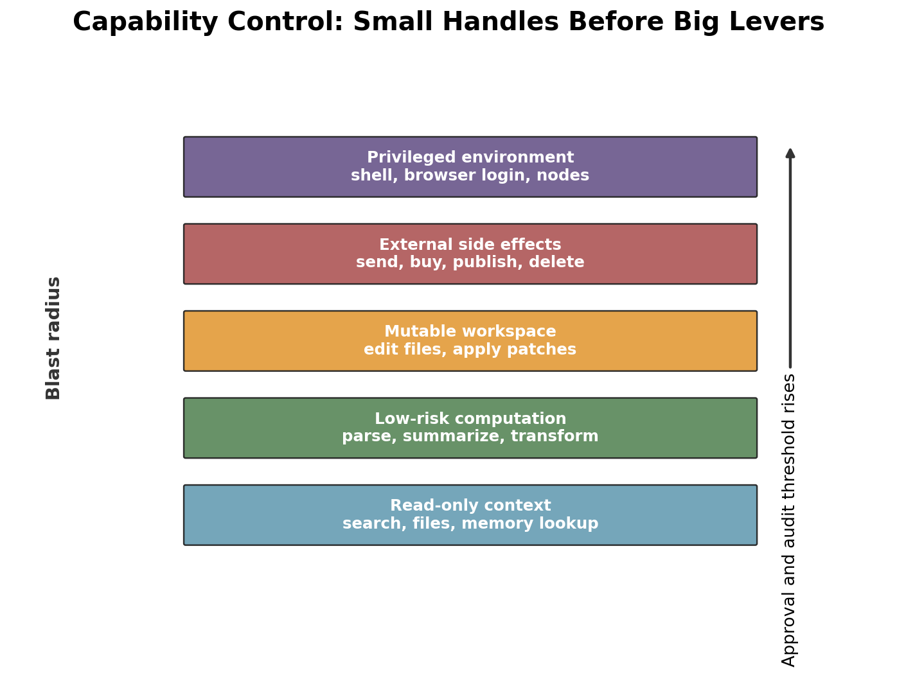

# Day 58: Tool System Design（工具系统设计）

> **核心问题**：AI agent 如何开放 browser 控制、shell 执行、文件编辑、API、local nodes 这些强能力，同时不把每一次 tool call 变成失控的自由行动？

---

## Opening

没有 tools 的模型，就像一个聪明的分析师被锁在图书馆里：不能打电话、不能用计算器、不能打开新书。它可以根据已有知识推理，但不能查今天的天气、检查你的代码仓库、查询数据库，也不能点开网页表单。带 tools 的模型更像坐在工作站前的初级操作员。它终于能行动了，但工程问题也完全变了。

Tool system design 负责决定：**agent 可以做什么**、**动作如何被描述**、**动作在哪里执行**、**返回什么证据**、以及**动作产生副作用时谁负责**。Function calling 只是露在外面的一小截。下面还有 schema、registry、sandbox、approval gate、trace、retry、quota 和 security boundary。

想象你给一位新员工办公室权限。你不会第一天就把总钥匙、公司信用卡、生产数据库密码和社交媒体账号全交出去。你会给门禁卡、工位、几个被批准的系统、一个负责人，以及操作记录。Agent tools 也需要同样的纪律。模型越强，tool boundary 越重要，因为强模型的危险不只是“不会做”，而是会把一个看似合理的计划执行到底。

---

## 1. Tool System 到底是什么

#### 直觉：它是工坊，不是魔法棒

把 agent 想成一个手艺人，把 tools 想成共享工坊。锤子、锯子、激光切割机、送货车不是同一种东西。每个工具都有握把、适用场景、安全规则和收尾步骤。Tool system 就是工坊管理员：给工具贴标签，检查谁能用，记录使用过程，并把危险机器放在额外的控制后面。


*图 1：生产级 tool system 是一层栈：用户入口、agent runtime、tool registry、policy gate、execution sandbox 和外部系统。模型不应该从文本直接跳到无限制行动。*

一个 tool system 至少有五个职责：

| 职责 | 含义 | 缺失时的常见失败 |
|---|---|---|
| Discovery | agent 能看到可用能力及其说明 | 模型会编造不存在的动作 |
| Schema | 输入输出有类型并可验证 | 无效参数进入真实系统 |
| Policy | 权限、approval、quota、risk check 在模型之外执行 | 模型变成自己的安全裁判 |
| Execution | Browser、shell、code、API、node 在受控环境运行 | Tool call 泄露凭证或改错状态 |
| Trace | 每次调用、结果、错误和 approval 都可观察 | 出错后无法调试和审计 |

所以 “tool” 这个词有点轻。Agent 工程里的 tool 更接近一个 **capability contract（能力合约）**：名字是什么、能做什么、参数是什么、在哪里运行、需要什么权限、结果长什么样、错误如何返回，都要写清楚。

[OpenAI Agents SDK tools 文档](https://openai.github.io/openai-agents-python/tools/)把这一层次拆得很明确：hosted OpenAI tools、local/runtime execution tools、function tools、agents-as-tools、MCP servers 是不同类别。[Google ADK](https://adk.dev/)也把 tools 放在从简单 prompt-and-tool agent 到 multi-agent orchestration、evaluation、deployment 的整体路径里。[MCP](https://developers.openai.com/apps-sdk/concepts/mcp-server) 最初由 Anthropic 在 2024 年提出，现在被多个客户端采用，用来标准化外部服务器如何向 AI 应用暴露 tools 和 resources。

### 1.1 为什么 Function Calling 只是第一步

早期 tool use 主要问：模型能不能选对函数，并填对 JSON？这仍然重要。但真实 agent 很快会需要更多东西：

| 阶段 | 核心问题 | 例子 |
|---|---|---|
| 单次 function call | 模型能否调用一次正确函数 | `get_weather(city="Singapore")` |
| 多步 tool use | 能否根据结果决定下一步 | 搜索、读网页、总结证据 |
| 多 tool orchestration | 能否在长任务中协调多个 tools | Browser + shell + file edit + tests |
| Governed tool system | 能否带着 approval 和 traces 安全行动 | 写邮件草稿，发送前确认，记录证据 |

2026 年 3 月 24 日的综述论文 ["The Evolution of Tool Use in LLM Agents: From Single-Tool Call to Multi-Tool Orchestration"](https://arxiv.org/abs/2603.22862) 很好地概括了这个转向：前沿问题已经从孤立调用转向带有状态、反馈、安全、效率和评估的长程 orchestration。这正是 `exec`、browser automation、app connectors、MCP servers 和 node controls 这类系统面对的问题。

---

## 2. Tool Call 的生命周期

#### 直觉：它像采购单，不像随口一说

在公司里，“买几台电脑”不够。采购单需要物品、数量、预算、供应商、审批人、收货地址和发票。请求可以从自然语言开始，但在钱真正花出去之前，必须变成结构化合约。Tool call 也应该这样。


*图 2：模型提出 tool call，但 runtime 负责 schema 验证、policy 检查、受控执行、结构化返回和 trace 记录。*

稳健的生命周期通常是：

1. **Intent formation**：模型判断光靠文本不够。
2. **Tool selection**：从 registry 中选择 tool，而不是凭空想象。
3. **Argument construction**：填写 typed schema。
4. **Validation**：runtime 检查必填字段、类型、范围和枚举值。
5. **Policy check**：身份、权限、风险、approval 和 quota 在模型外执行。
6. **Execution**：tool 在正确环境里运行。
7. **Result interpretation**：模型收到结构化输出或结构化错误。
8. **Trace and recovery**：日志支持 retry、debug 和 audit。

可以用一个小公式表达这条边界：

$$
\begin{aligned}
T &= \operatorname{select}(u, C, R) \\
A &= \operatorname{validate}(\operatorname{args}(u, C), S_T) \\
P &= \operatorname{authorize}(I, T, A, \rho) \\
Y &= \operatorname{execute}(T, A, E_T) \quad \text{only if } P = \text{allow}
\end{aligned}
$$

这里 **u** 是用户请求，**C** 是上下文，**R** 是 tool registry，**S_T** 是 tool **T** 的 schema，**I** 是 identity，**rho** 是 risk policy，**E_T** 是执行环境，**Y** 是结构化结果。这个公式的重点不是数学本身，而是把“模型选择”和“runtime 执法”分开。如果模型能绕过 validation 或 policy，这个系统就谈不上治理。

### 2.1 Schema 是小型安全边界

#### 直觉：边境的申报表

海关申报表不能保证每个人都诚实，但它会把信息放进可检查字段：姓名、护照、携带物品、价值、目的地。Tool schema 对 agent action 也起这个作用。它把模糊意图变成可检查参数。

好的 tool schema 应该说明：

| Schema 字段 | 为什么重要 |
|---|---|
| Name 和 description | 帮模型选择正确能力 |
| Required arguments | 防止不完整调用进入执行阶段 |
| Types 和 enums | 降低 mode、unit 等字段的歧义 |
| Risk metadata | 帮 policy 判断是否需要 approval |
| Output shape | 让后续推理和 trace inspection 更可靠 |
| Error shape | 让模型能恢复，而不是猜测 |

危险的反模式是过早暴露一个泛化的 `run(command: string)` tool。这相当于给模型一张空白支票。更好的顺序是先给窄工具：`list_files`、`read_file`、`apply_patch`、`run_tests`、`open_url`、`extract_table`、`send_draft_for_approval`。工具越窄，越容易验证、授权和解释。

---

## 3. Browser、Shell、APIs、Nodes 是不同风险类别

#### 直觉：菜刀、炉灶和送货车

菜刀、炉灶、送货车都能帮你做饭，但失败方式完全不同。菜刀可能切错食材；炉灶可能起火；送货车会离开家并影响别人。Agent tools 也是这样。Browser click、shell command、API call 和 node action 不应该共用一个权限桶。


*图 3：Capability control 应该随着 blast radius 上升。Read-only context、local computation、workspace mutation、external side effects 和 privileged environments 需要不同的 approval 与 audit 强度。*

| Tool family | 典型用途 | 主要风险 | 更安全的设计 |
|---|---|---|---|
| Search / retrieval | 收集证据 | 过期信息或被污染上下文 | 引用来源，区分数据和指令 |
| Browser control | 操作网页应用 | 点错按钮，网页里的 indirect prompt injection | 隔离 browser，对副作用要求确认 |
| Shell / code execution | 检查仓库、跑测试、转换数据 | 数据丢失、凭证暴露、任意执行 | 限定工作目录、命令 allowlist、日志 |
| File editing | 修改代码或文档 | 静默损坏或覆盖用户改动 | 先 diff，再 patch review，再 tests |
| External APIs | 发邮件、建 ticket、购买、发布 | 不可逆副作用 | Draft mode、scoped tokens、明确 approval |
| Nodes / local devices | 控制本地服务或硬件 | 物理影响或隐私影响 | Least privilege、本地确认、可撤销 |

这个表比较的是 tool families，不是产品。[OpenAI Agents SDK](https://openai.github.io/openai-agents-python/tools/)、[Google ADK](https://docs.cloud.google.com/gemini-enterprise-agent-platform/build/adk)、[MCP](https://modelcontextprotocol.io/docs/getting-started/intro)、OpenClaw tools、browser-agent infrastructure 位于不同层。Framework 可以 orchestrate tools；MCP 可以标准化 tool exposure；gateway 可以路由消息；sandbox 可以执行本地动作。把它们压平成一个“最佳 agent tool 排行榜”，会直接带来错误架构。

### 3.1 权限规则：先窄后宽，用表现换范围

#### 直觉：学开车

新手司机不会一开始就开油罐车走山路。他会先在停车场练，再上安静街道，最后上高速。Agent capability 也应该这样毕业：先 read-only，再 reversible local actions，再 externally visible actions，最后才是 privileged automation。

一个实用的权限梯子：

1. **Observe**：search、read、list、inspect。
2. **Compute**：parse、summarize、classify、生成本地 artifact。
3. **Propose edits**：只生成 diff 或 draft，不直接应用。
4. **Apply reversible local changes**：patch 文件、跑测试、更新本地状态。
5. **Request external side effects**：发送消息、发布、购买、删除、部署。
6. **Operate privileged surfaces**：登录态 browser、带 secrets 的 shell、本地设备。

关键点是：模型可以决定自己想做什么，但 runtime 决定什么被允许。高风险动作的 approval 应该绑定到精确动作：sender、recipient、body、file path、command、URL 或 API payload。模糊的 “go ahead” 比 “把这封确切邮件发给这个确切地址” 弱得多。

---

## 4. Registries、MCP 与 Capability Discovery

#### 直觉：带安全标签的 App Store

安装 app 时，你会期待看到名字、说明、版本、发布者、权限和评价。Tool registry 也应该提供类似 discovery layer。Agent 不应该收到一长串含糊函数名。它需要一个经过整理的 capability menu，让模型和 policy layer 都能理解。

[MCP](https://www.anthropic.com/news/model-context-protocol) 在 2024 年 11 月出现，是为了解决 AI 应用与外部系统之间大量一次性集成的问题。核心想法很简单：外部服务器通过共同协议暴露 tools、resources 和 prompts。[OpenAI Apps SDK 文档](https://developers.openai.com/apps-sdk/concepts/mcp-server) 把 MCP 描述为连接 LLM clients 与 tools/resources 的开放规范；MCP server 可以在对话中暴露可调用工具。[官方 MCP Registry](https://registry.modelcontextprotocol.io/) 则是生态信号：截至 **2026 年 6 月 22 日**，它仍在显示 live server updates。

Registry 应该帮助回答：

| Registry question | 为什么重要 |
|---|---|
| 谁发布了这个 tool？ | Supply-chain trust |
| 正在运行什么版本？ | 复现和回滚 |
| 需要哪些 scopes？ | Least privilege |
| 读取或写入什么数据？ | 隐私与合规 |
| 是 local、remote、hosted 还是 browser-based？ | 执行风险 |
| 会返回什么结构化错误？ | 恢复与 observability |

### 4.1 Dynamic Discovery 很强，也很危险

#### 直觉：游客可以看路牌，但不能进所有楼

路牌能帮助游客在城市里导航，但路牌不会授权他进入每一栋楼。Dynamic tool discovery 也是如此。它允许 agent 在运行时发现可用能力，但 discovery 不等于 authorization。

当不同用户有不同 connectors、apps、files 或 devices 时，dynamic discovery 很有用。危险在于模型把发现到的 tool 自动当成可信 tool。恶意或描述混乱的 tool 可以通过自己的 metadata 攻击模型：名字、描述、示例、返回内容都可能夹带诱导。Tool descriptions 不是 system instructions。它们是未完全可信的 metadata，应该被整理、签名、过滤或 scoped。

生产系统里要分清三件事：

| 概念 | 含义 |
|---|---|
| Available | runtime 知道这个 tool 存在 |
| Visible | 当前 agent 可以考虑它 |
| Callable | 当前 request、identity 和 risk policy 允许执行 |

这个区分能防止一个常见失败：agent 在环境里看到了强 tool，就以为任何用户都可以让它使用。

---

## 5. Parallel Tool Calling 与 Runtime Scheduling

#### 直觉：同桌的研究助理

如果你让五个助理查五个相互独立的事实，没必要排队一个个查。他们可以分头行动，再一起对笔记。Parallel tool calling 让 agent 在一个 reasoning step 里做类似事情：同时搜索多个来源、检查多个文件、调用多个 API，然后再综合。


*图 4：这张示意曲线说明独立 tool calls 为什么适合并行执行。它不是厂商 benchmark，而是用来讲清 scheduling 形状。*

Parallel calls 不只是加速技巧。它会改变 runtime contract：

| Runtime issue | Sequential calls | Parallel calls |
|---|---|---|
| Planning | 每个结果回来后再决定下一步 | 一次决定一批独立 calls |
| Cost control | 更容易提前停止 | 需要先分配 budget |
| Deduplication | 逐步反馈天然减少重复 | 同一批次里必须主动去重 |
| Error handling | 一次处理一个失败 | Partial success 和 aggregation 成为常态 |
| Policy | 每个 action 单独 approval | Batch approval 需要分组和限制 |

2026 年 2 月的论文 ["Scaling Parallel Tool Calling for Efficient Deep Research Agents"](https://arxiv.org/abs/2602.07359) 研究了 agentic search 沿 width dimension 扩展的思路：在一个步骤里协调许多 tool calls，而不是拉长单一路径。无论具体系统是否采用这篇论文的方法，工程结论都很明确：tool runtime 需要 concurrency limits、cancellation、deduplication、partial-result handling，以及能把 batch 看成一个整体的 trace view。

### 5.1 Idempotency 与 Retry 纪律

#### 直觉：电梯按钮按两次

电梯按钮按两次，不应该给同一个乘客叫来两部电梯。Tool call retry 也不应该发两封邮件、建两个日历事件、买两次东西。每个有副作用的 tool 都需要 idempotency。

安全的 tool system 会给高风险动作绑定 idempotency key。这个 key 可以组合 user id、session id、tool name、normalized arguments 和 request id。外部 API 支持 idempotency key 时就透传；不支持时，本地保存执行记录，并拒绝可疑重复。Retry 只有在不会放大副作用时，才是好工程。

---

## 6. Frontier Update：2026 年发生了什么

#### 直觉：从手工具到工厂车间

前沿正在从 “模型能不能调用函数” 转向 “组织能不能安全运营一整套工具车间”。工厂需要工位、负责人、日志、急停按钮、维护和质量检查。Agent tools 也在走向这个方向。


*图 5：近期前沿更关注 orchestration、真实用户行为评估、live registry 和 runtime categories，而不是孤立 function call。*

几个近期信号：

| 日期 | 项目 | 为什么重要 |
|---|---|---|
| **2026-03-24** | [The Evolution of Tool Use in LLM Agents](https://arxiv.org/abs/2603.22862) | 总结从单次调用到 multi-tool orchestration 的转向 |
| **2026-04-08** | [WildToolBench](https://arxiv.org/html/2604.06185) | 基于真实用户行为评估 tool use；报告称测试模型没有一个超过 15% accuracy，说明 robustness gap 很大 |
| **2026-06-01** | [On Effectiveness and Efficiency of Agentic Tool-calling and RL Training](https://arxiv.org/abs/2606.00135) | 研究 agentic tool-calling 与 RL efficiency，说明 tool use 正在成为训练目标，而不只是 prompting trick |
| **2026-06-22** | [Official MCP Registry](https://registry.modelcontextprotocol.io/) live updates | 显示生态正在走向可发现、可版本化的 tool servers |
| **2026 SDK direction** | [OpenAI Agents SDK tools](https://openai.github.io/openai-agents-python/tools/) 与 [Google ADK](https://adk.dev/) | Tool categories、orchestration、evaluation、deployment 正成为 SDK 一等概念 |

WildToolBench 尤其值得警惕。很多 demo 成功，是因为任务干净、tool list 很小、预期行为明显。真实用户会提出混杂约束、临时改主意、使用含糊名称，还会把多个目标揉在一起。只为 demo 设计的 tool system，到了这个分布上很难站住。

---

## 7. Code Example：一个最小 Governed Tool Runtime

#### 直觉：带规则手册的前台

好的前台不会亲自解决所有问题。他会检查来访者，查允许去哪个部门，需要时请求 approval，并记录发生了什么。下面这个 runtime 很小，但展示了同样的分离：model proposal、schema validation、policy、execution 和 trace。

```python
from dataclasses import dataclass
from typing import Any, Callable, Dict, Literal

Risk = Literal["read", "local_write", "external_side_effect"]

@dataclass(frozen=True)
class ToolSpec:
    name: str
    description: str
    required: set[str]
    risk: Risk
    handler: Callable[[dict[str, Any]], dict[str, Any]]

@dataclass(frozen=True)
class Identity:
    user_id: str
    approved_risks: set[Risk]

class ToolRuntime:
    def __init__(self, tools: Dict[str, ToolSpec]):
        self.tools = tools
        self.trace: list[dict[str, Any]] = []

    def call(self, identity: Identity, tool_name: str, args: dict[str, Any]) -> dict[str, Any]:
        if tool_name not in self.tools:
            return {"ok": False, "error": "unknown_tool"}

        spec = self.tools[tool_name]
        missing = spec.required - args.keys()
        if missing:
            return {"ok": False, "error": "missing_args", "fields": sorted(missing)}

        if spec.risk not in identity.approved_risks:
            return {
                "ok": False,
                "error": "approval_required",
                "risk": spec.risk,
                "tool": tool_name,
                "args": args,
            }

        try:
            result = spec.handler(args)
            event = {"user": identity.user_id, "tool": tool_name, "args": args, "result": result}
            self.trace.append(event)
            return {"ok": True, "result": result}
        except Exception as exc:
            return {"ok": False, "error": "tool_failed", "message": str(exc)}


def word_count(args: dict[str, Any]) -> dict[str, Any]:
    text = args["text"]
    return {"words": len(text.split())}

runtime = ToolRuntime({
    "word_count": ToolSpec(
        name="word_count",
        description="Count words in provided text.",
        required={"text"},
        risk="read",
        handler=word_count,
    )
})

identity = Identity(user_id="elar", approved_risks={"read"})
print(runtime.call(identity, "word_count", {"text": "tools need boundaries"}))
```

这个 toy runtime 不是生产实现，但它展示了关键形状。Tool handler 不负责判断用户是否有权限；模型不负责判断 schema 是否有效；trace 由 runtime 保存，而不是留给模型“记住”。生产系统还会加入 typed schemas、sandboxing、secret management、human approvals、idempotency keys 和 structured observability。

---

## 8. 常见误解

### 误解 1：“Tool use 就是 function calling”

Function calling 是模型与 runtime 的接口。Tool system design 包括 registry、policy、execution environment、approval、observability、retry 和 security。生产系统可以使用 function calling、MCP、hosted tools、local tools 或 browser tools，但治理问题不会消失。

### 误解 2：“模型足够聪明后，guardrails 可以少一点”

更聪明的模型会提出更可信的计划。这反而提高了显式边界的重要性。弱模型可能还没做成事就失败；强模型能把 browser、shell、files 和 APIs 串起来。能力越强，validation 和 approvals 的标准越应该提高。

### 误解 3：“所有 tools 都应该一直暴露”

更多 tools 可能让模型表现更差。巨大的菜单会增加 selection error、prompt injection surface、latency 和 policy complexity。好系统会根据当前 user、task、channel 和 risk level 筛选 visible tool set。

### 误解 4：“Sandbox 能解决一切”

Sandbox 可以降低环境内的损害，但不能解决发错收件人的邮件、错误购买、通过 tool output 泄露隐私、或者用户误解。Sandboxing 必须和 schemas、approvals、least privilege、traces 一起工作。

---

## 9. Further Reading

### Beginner

1. [OpenAI Agents SDK: Tools](https://openai.github.io/openai-agents-python/tools/) - hosted、local、function、agent、MCP tools 的实践分类。
2. [Google Agent Development Kit](https://adk.dev/) - 使用 tool calls、orchestration、evaluation、deployment 构建 agents 的概览。
3. [OpenAI Apps SDK: MCP Server](https://developers.openai.com/apps-sdk/concepts/mcp-server) - MCP server 如何暴露 tools 和 resources 的简明说明。

### Advanced

1. [Model Context Protocol official introduction](https://modelcontextprotocol.io/docs/getting-started/intro) - 外部工具与上下文的协议层。
2. [Official MCP Registry](https://registry.modelcontextprotocol.io/) - MCP servers 的 live registry，也是 ecosystem discovery 的例子。
3. [Anthropic: Introducing the Model Context Protocol](https://www.anthropic.com/news/model-context-protocol) - MCP 的历史来源与动机。

### Papers

1. [The Evolution of Tool Use in LLM Agents: From Single-Tool Call to Multi-Tool Orchestration](https://arxiv.org/abs/2603.22862)
2. [Benchmarking LLM Tool-Use in the Wild](https://arxiv.org/html/2604.06185)
3. [On Effectiveness and Efficiency of Agentic Tool-calling and RL Training](https://arxiv.org/abs/2606.00135)
4. [Scaling Parallel Tool Calling for Efficient Deep Research Agents](https://arxiv.org/abs/2602.07359)

---

## Reflection Questions

1. 你当前工作流里的哪些 tools 应该是 read-only，哪些可以 local-write，哪些必须 explicit external-action approval？
2. 如果一个 agent 在同一个任务里使用 browser 和 shell，trust boundary 应该放在哪里：model、runtime、sandbox，还是 user approval？
3. Tool registry 应该暴露哪些 metadata，才能让模型选得准，同时又不让它调用所有看得到的工具？

---

## Summary

| Concept | 一句话解释 |
|---|---|
| Tool system | 围绕 agent capabilities 的完整治理层：discovery、schema、policy、execution、trace |
| Tool schema | 把模型意图变成可检查参数和结构化结果的 typed contract |
| Capability control | 根据每类 tool 的 blast radius 匹配 approval 和 sandbox 强度 |
| MCP | 通过统一接口向 AI 应用暴露外部 tools 和 resources 的协议 |
| Parallel tool calling | 协调一批独立 tool calls，需要 scheduling、budget 和 partial-result handling |
| Idempotency | Retry 不会放大副作用的性质 |

**Key Takeaway**：Tool use 是 LLM 从文本生成器变成操作员的地方。核心设计问题不是“模型能不能调用函数”，而是“系统能不能把能力暴露成可治理的合约”。好的 tool system 让行动明确、typed、permissioned、sandboxed、observable、revocable。这样 browser、shell、APIs 和 local nodes 才能成为有用基础设施，而不是失控权力。

---

*Day 58 of 60 | LLM Fundamentals*  
*字数：约 5,600 中文字符 | 阅读时间：约 17 分钟*
