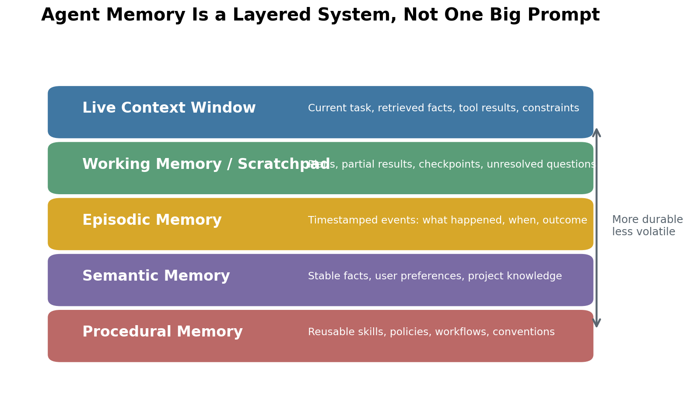
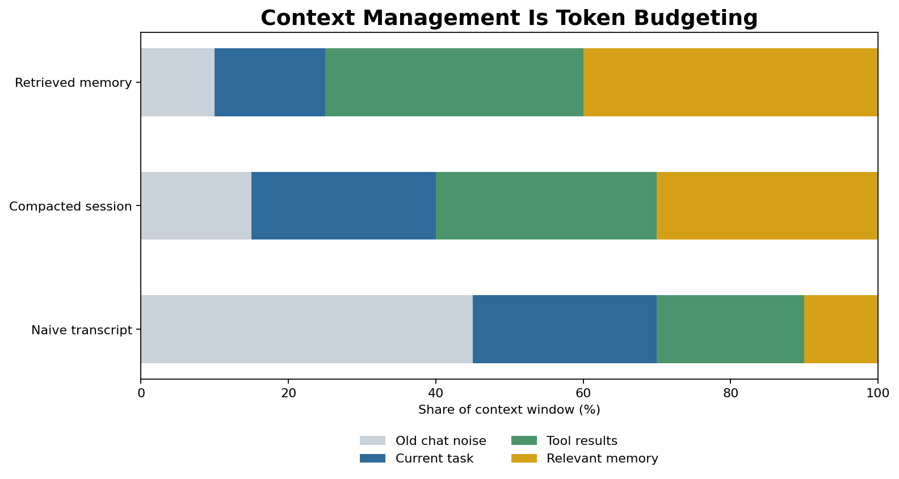
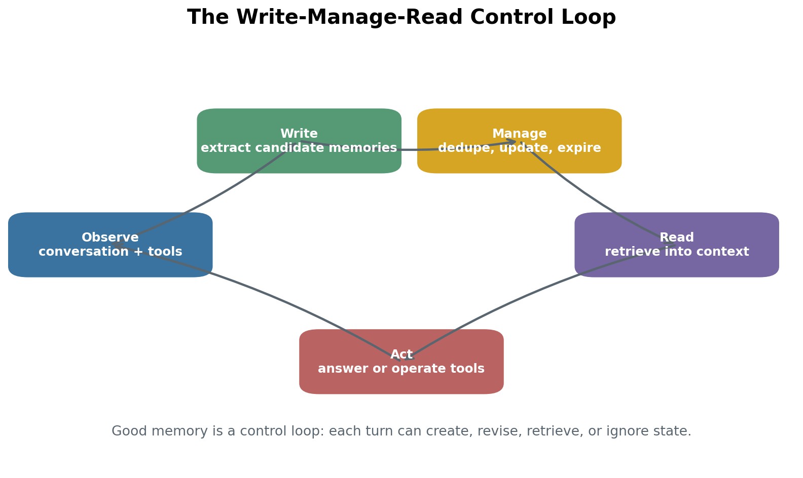
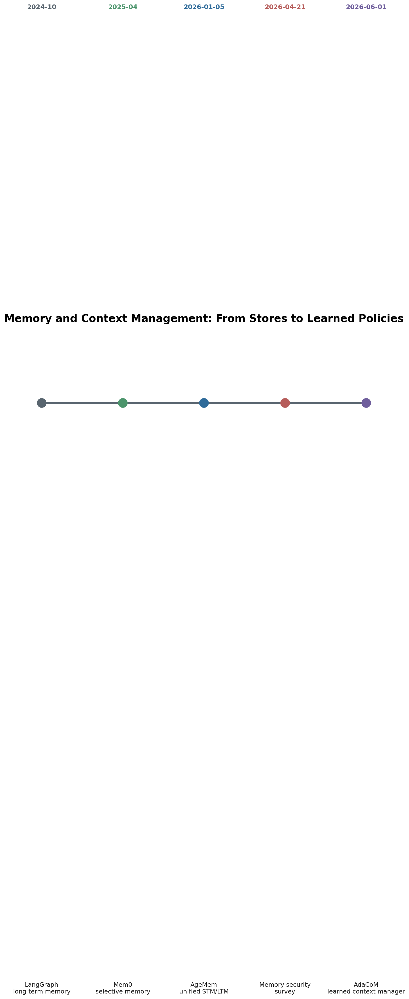

# Day 59: Memory and Context Management（记忆与上下文管理）

> **核心问题**：一个长期运行的 LLM agent，应该如何决定什么要记住、什么要忘掉、以及当前这一次模型调用到底该看哪些信息？

---

## 开场

想象你雇了一位非常聪明的实习生。他理解力很强，只要白板上写着相关信息，就能把问题分析得很清楚。问题是，他没有办公桌、没有笔记本、也没有文件柜。会议开到一半，白板写满了，他就必须擦掉一些内容。第二天早上，如果没人把关键信息重新写上去，他可能会忘记项目规范、客户偏好，甚至忘记昨天已经排查过的 bug。

这就是 LLM agent 的 memory 和 context management 问题。模型本身只能看到当前 prompt、当前 tool 输出，以及系统塞进上下文窗口里的历史和记忆。更长的 context window 有帮助，但不能从根本上解决问题。它更像是买了一张更大的桌子：能摊开更多纸，但桌面还是会乱，重要文件仍然可能被旧材料压住，敏感信息仍然需要权限和删除机制。

今天这篇文章要把两个经常被混在一起的概念拆开。**Memory management** 负责决定哪些状态要跨轮次、跨 session 保存下来；**context management** 负责决定在下一次模型调用时，哪些状态值得占用有限的 prompt 空间。一个好用的 agent 需要两者：既要有保存知识的资料库，也要有会整理材料的编辑。

---

## 1. 为什么 memory 不等于“更长的 context”

#### 直觉：更大的背包不是文件系统

把 context length 想成背包容量。如果只是下午出去徒步，一个大背包就够了。可是如果你要管理一年的研究项目，把所有笔记、地图、收据、实验结果都塞进一个巨大背包，只会越来越乱。你需要的是书架、标签、摘要、保留期限，以及每天出门前只带当天需要材料的习惯。

Memory system 之所以重要，是因为 LLM 应用已经从单轮聊天进入持续工作场景：coding agent、客服 agent、研究助手、工作流 agent、个人 copilot。它们需要记住稳定事实、历史决策、未完成任务和用户偏好，而不是每次都重读所有历史 token。


*图 1：Agent memory 按波动性和用途分层。实时 context window 只是最上面一层，不是整个 memory system。*

第一个常见设计错误，是把 transcript 当成 memory。Transcript 是证据，但不一定是有用状态。里面有修正、死路、重复日志、tool 输出、临时计划。如果 agent 直接把它塞进 prompt，会出现三个问题：

1. **成本上升**：重复 token 每次都要重新付费。
2. **延迟上升**：长 prompt 处理更慢。
3. **推理质量下降**：过时或无关内容会干扰模型。

[LangChain memory overview](https://docs.langchain.com/oss/python/concepts/memory) 也强调了同一个现实问题：conversation history 是常见的 short-term memory，但完整历史可能放不进 context window；即使能放进去，也会让模型更慢、更贵、更容易被无关内容分散注意力。

所以更现代的理解是：memory 是外部状态系统；context 是一次模型调用前，从这个状态系统里精心挑出来的视图。

---

## 2. Memory 的几层：到底该记住什么？

#### 直觉：日记、百科全书、操作手册

人不会把所有记忆放进同一个抽屉。“我昨天见过 Alice”不同于“Alice 喜欢简洁邮件”，也不同于“写 release notes 时必须包含迁移步骤”。Agent memory 也需要这样的分层。日记记录事件，百科全书记录稳定事实，操作手册记录流程和规则。

| 层级 | 存什么 | 最适合解决什么问题 |
|---|---|---|
| Short-term / working memory | 当前任务状态、活跃计划、未解决问题 | 让多步骤任务保持连贯 |
| Episodic memory | 带时间戳的事件、决策、结果、来源 | 审计发生过什么，并从经历中学习 |
| Semantic memory | 稳定事实、偏好、项目知识 | 个性化和重复使用的领域知识 |
| Procedural memory | Skills、policy、workflow、代码库规则 | 可复用行为和团队规范 |

这个区分也解释了为什么不同产品都在谈“memory”，但做法很不一样。[Claude Code memory](https://code.claude.com/docs/en/memory) 用 `CLAUDE.md` 保存显式持久指令，同时用 auto memory 记录学到的经验。[OpenAI Codex AGENTS.md](https://developers.openai.com/codex/guides/agents-md) 让 coding agent 在开始工作前读取项目级指导，而 [Codex Memories](https://developers.openai.com/codex/memories) 则把之前 thread 中有用的上下文带到未来工作里，并明确区分本地 recall 和必须遵守的团队规则。[LangGraph long-term memory](https://docs.langchain.com/oss/python/concepts/memory) 用 namespace 在不同 conversation 之间保存信息。[Zep](https://www.getzep.com/) 则强调 temporal context graph、provenance 和企业级治理。

这些不是同一种产品形态，所以不应该硬放进一个“谁最好”的排行榜。一个 checked-in instruction file、一个应用层 memory API、一个企业级 context graph，解决的是相关但不同的问题。更好的问题是：你到底想控制哪一层 memory？

---

## 3. Context management：模型调用前的编辑

#### 直觉：手术前给医生准备 briefing

手术前，医生不会从病人出生记录开始读完整病历。团队会准备一份聚焦的 briefing：当前诊断、过敏史、近期检查、相关病史、手术计划。信息太少很危险；无关信息太多也危险，因为真正的信号会被淹没。

Context management 对 LLM 调用起到类似作用。它决定哪些内容进入实时 context window：

| Context 内容 | 为什么放进去 | 如果不管理会怎样 |
|---|---|---|
| 当前任务指令 | 定义这次要完成什么 | Agent 优化错目标 |
| 系统与 policy 约束 | 设定边界和风格 | Agent 违反规则或用户偏好 |
| 当前 working state | 保留多步骤进度 | Agent 重复工作或丢失上下文 |
| Retrieved memories | 把持久事实带回注意力范围 | Agent 忘记稳定偏好或历史决策 |
| Tool outputs | 用当前证据 grounding 行动 | Agent 编造或使用过期数据 |


*图 2：朴素 transcript 会把大量 context 浪费在旧聊天噪声上。Compaction 和 retrieval 能把预算转向当前任务状态和相关 memory。*

从系统角度看，context management 是一种带不确定性的 token budget 分配。下面这个简单打分公式可以帮助理解控制问题：

$$
\begin{aligned}
\text{score}(m, q) &= \alpha \cdot \text{relevance}(m, q) + \beta \cdot \text{recency}(m) \\
&\quad + \gamma \cdot \text{authority}(m) - \lambda \cdot \text{token_cost}(m)
\end{aligned}
$$

这里 `m` 是一条 memory item，`q` 是当前任务。这个公式不是通用真理，而是设计 checklist。好的 context 通常相关、在需要时足够新、来源可靠，并且不会占用过多 token。坏的 context 可能真实但无关，相关但过时，便宜但不可信，或者很重要却太啰嗦。

关键在 trade-off。如果系统总选 lexical similarity 最高的片段，可能会错过 procedural rules。如果总选最新片段，可能会忘记稳定事实。如果总选短片段，可能会丢掉必要证据。Context engineering 的实践难点，就是在这些力量之间做平衡。

---

## 4. Write-Manage-Read Loop

#### 直觉：记笔记有用，但前提是有人整理笔记本

把所有东西都写下来，不等于拥有好 memory。一本混乱的笔记本甚至比没有笔记更糟：里面有矛盾、重复、过期计划、以及放错位置的隐私信息。严肃的 memory system 需要一个循环：先写入候选内容，再管理存储，最后有选择地读取。


*图 3：生产环境中的 memory 是和行动绑定的 write-manage-read 控制循环，每一步都可能单独失败。*

这个循环有三个控制点。

**Write** 问的是：当前事件是否应该成为 memory？有价值的候选包括持久偏好、决策、项目约定、从错误中学到的经验、以及有来源支撑的事实。临时 scratch thought 通常不应该进入 long-term memory。

**Manage** 问的是：已经保存的 memory 应该如何演化？重复内容要合并；矛盾内容要保留 provenance，而不是悄悄覆盖成“真相”；有时效性的事实要过期；敏感事实要有访问策略和删除路径。

**Read** 问的是：当前任务应该 retrieve 哪些内容？Retrieval 可以用 vector similarity、keyword search、graph traversal、时间过滤器或显式 ID。优秀系统通常会结合多种信号，因为 memory recall 不只是 semantic search。如果用户说“沿用上周五的格式”，时间戳很重要。如果客服 agent 处理账单争议，provenance 很重要。如果 coding agent 应用团队规则，procedural authority 很重要。

这也是为什么 memory security 成了前沿问题。2026 年 4 月的 survey ["A Survey on Long-Term Memory Security in LLM Agents"](https://arxiv.org/abs/2604.16548) 指出，可写入、跨 session 持久化的 memory 带来了具有 persistence、statefulness、propagation 特征的新威胁。被污染的 memory 可能在原始 prompt 结束后继续存在，影响后续 session，并通过下游行动传播。因此 memory 需要 validation、provenance、retention 和用户可见的编辑机制，而不只是更好的 embedding。

---

## 5. Compaction：保留线索，而不是保留每个 token

#### 直觉：写会议纪要

好的会议纪要不会逐字复制所有发言。它会保留决策、负责人、截止日期、开放问题和必要背景。差的纪要会丢掉决策原因；更差的纪要会把玩笑和旁枝都保留下来，直到真正的 action item 被淹没。

Compaction 是把长交互压缩成更小状态表示的过程。Coding agent 在 session 过长时会用它；research agent 在浏览大量文档时会用它；个人助手在保持连续性但不重放所有历史对话时也会用它。


*图 4：压缩太少会留下噪声，压缩太狠会丢掉约束。实践中的有效区间，是在保留信号的同时去掉干扰。*

难点在于，compaction 会改变 agent 的状态。摘要不是中性的。它会选择什么算重要。如果摘要丢掉了“不要修改早期文章”这样的约束，后续推理就可能变差，即使摘要本身读起来很流畅。如果摘要抹掉了不确定性，就可能把假设变成看似确定的事实。

让 compaction 更安全的三个习惯是：

1. **把 facts 和 plans 分开**。Facts 描述世界，plans 描述打算做什么。
2. **显式保留 unresolved questions**。压缩后的状态不应该假装未知问题已经解决。
3. **重要 claim 附 provenance**。如果未来步骤依赖某个说法，agent 应该知道它来自哪里。

2026 年 6 月的论文 ["Learning Agent-Compatible Context Management for Long-Horizon Tasks"](https://arxiv.org/abs/2605.30785) 把这个方向又推进了一步。它提出 Adaptive Context Management（AdaCoM），训练一个外部 LLM，通过 modification actions 和 reinforcement learning 管理 frozen agent 的 context。关键变化是：context editing 不再只是手写 heuristic，而是可以被优化的 policy，用来保留约束和进度，同时剪掉过时内容。

---

## 6. 实现草图：一个最小 memory manager

#### 直觉：带有淘汰规则的图书管理员

有用的图书管理员不只是搜索书架。他还会决定什么值得入库，哪个版本取代哪个版本，哪条笔记太模糊不该保留，以及哪些书只能进入受限阅览室。下面的 toy implementation 很小，但展示了生产系统的基本形状：存结构化 memory、根据 query 打分、构造有 token 上限的 context packet。

```python
from dataclasses import dataclass
from time import time
from typing import Iterable


@dataclass
class Memory:
    text: str
    kind: str              # "semantic", "episodic", or "procedural"
    source: str            # where the memory came from
    created_at: float
    authority: float = 1.0 # higher for checked-in docs or explicit user rules


def keyword_overlap(a: str, b: str) -> float:
    """Tiny stand-in for embedding similarity."""
    aw = {w.lower().strip(".,:;()") for w in a.split()}
    bw = {w.lower().strip(".,:;()") for w in b.split()}
    if not aw or not bw:
        return 0.0
    return len(aw & bw) / len(aw | bw)


def select_context(
    query: str,
    memories: Iterable[Memory],
    token_budget: int = 120,
) -> list[Memory]:
    now = time()
    scored = []

    for mem in memories:
        relevance = keyword_overlap(query, mem.text)
        age_days = max((now - mem.created_at) / 86400, 0)
        recency = 1 / (1 + age_days / 30)
        token_cost = max(len(mem.text.split()), 1)

        score = (
            0.55 * relevance
            + 0.25 * recency
            + 0.30 * mem.authority
            - 0.01 * token_cost
        )
        scored.append((score, mem, token_cost))

    chosen, used = [], 0
    for _, mem, cost in sorted(scored, reverse=True, key=lambda x: x[0]):
        if used + cost <= token_budget:
            chosen.append(mem)
            used += cost
    return chosen
```

真实系统会把 toy overlap 换成 embedding、hybrid search、graph query、reranking、access control 和 evaluation logs。但整体形状不变：每条 memory item 都在竞争有限的 prompt 空间，而且每条 item 都应该带足够 metadata，让系统判断它是否该出现。

---

## 7. 前沿：Memory 正从 store 变成 policy

#### 直觉：从仓库到空管系统

早期 memory system 更像仓库：把事实放进去，以后再搜出来。现在的前沿更像空管系统：agent 已经在行动中，系统要同时协调实时 context、long-term memory、tool outputs、safety policy 和用户控制。


*图 5：近期工作正在从外部存储，走向可学习的 memory 和 context 控制策略。*

最近两项更新尤其重要：

| 日期 | 项目 | 为什么重要 |
|---|---|---|
| 2026-01-05 | ["Agentic Memory: Learning Unified Long-Term and Short-Term Memory Management for Large Language Model Agents"](https://arxiv.org/abs/2601.01885) | 把 memory operation 当作 agent policy 内部的 action，统一 short-term 和 long-term memory 决策。 |
| 2026-06-01 | ["Learning Agent-Compatible Context Management for Long-Horizon Tasks"](https://arxiv.org/abs/2605.30785) | 训练外部 context manager 编辑 frozen agent 的 context，说明 context management 本身可以被优化。 |

其他 2026 年工作补全了这个图景。2026-01-06 发布的 ["SimpleMem"](https://arxiv.org/abs/2601.02553) 探索面向 lifelong agent memory 的 semantic lossless compression。2026 年 3 月的 ["Memory for Autonomous LLM Agents"](https://arxiv.org/html/2603.07670v1) 把 agent memory 形式化为 write-manage-read loop，并综述了到 2026 年初的机制。上面提到的 2026 年 4 月 memory-security survey 则说明：持久可写 memory 会改变安全威胁模型。

产品前沿也在分层。Coding tools 暴露持久 instruction file 和 learned memory：Claude Code 使用 `CLAUDE.md` 加 auto memory，Codex 使用 `AGENTS.md` 加可选本地 memories。LangGraph 这类应用框架提供 memory store 和 namespace。Zep 这类 memory infrastructure 公司则构建带 provenance 和治理能力的 temporal context graph。它们是互补层，不是互斥赢家。

---

## 8. 常见误解

### 误解 1：“一百万 token 的 context window 会消灭 memory。”

不会。大 context window 缓解了一个瓶颈，但它不会自动决定哪些事实应该持久化、哪些事实是隐私、哪些事实已经过期、哪些事实当前相关。更大的 context 也会带来更高成本，并可能让注意力更分散。

### 误解 2：“Vector search 就是 memory。”

Vector search 是 retrieval 方法。Memory 是更完整的生命周期：write、update、merge、delete、authorize、retrieve、compact、audit、evaluate。Vector database 可以是 memory 的一部分，但不是整个 memory system。

### 误解 3：“Summary 总是安全的压缩。”

Summary 是有损状态变换。它可能丢掉约束、制造连贯幻觉、抹掉不确定性。高风险任务里，summary 应该保留决策、开放问题、source links 和 policy constraints。

### 误解 4：“Agent 应该记住所有东西。”

什么都记会带来隐私风险、retrieval 噪声和运行成本。好的 memory system 是选择性的，也应该让用户和组织能查看、修正、删除持久状态。

---

## 9. 实用设计规则

#### 直觉：按真实行程打包行李

你不会为了一小时会议带雪地靴，也不会只带牙刷去出差两周。Context 也应该按当前任务打包。

1. **把持久规则放在显式文件或 policy store 里。** 对必须稳定、可 review 的规则，用 `AGENTS.md`、`CLAUDE.md`、checked-in docs 或 policy engine。
2. **把 learned memory 当作有用 recall，不当作法律。** Learned memory 可能错误或过期，需要 provenance 和编辑路径。
3. **区分 working state 和 long-term memory。** Plans 和 scratchpads 不应该自动变成永久事实。
4. **使用 compaction checkpoints。** 保留目标、约束、已完成工作、开放问题和下一步。
5. **用 long-horizon tasks 评估 memory。** 单轮准确率看不出多轮之后才暴露的问题。
6. **尽早设计删除机制。** 如果用户无法查看和删除 memory，系统迟早会损害信任。

---

## 延伸阅读

### 基础与系统

1. [LangChain Memory Overview](https://docs.langchain.com/oss/python/concepts/memory)  
   清楚区分 short-term conversation state 和 long-term memory namespace。
2. [Claude Code: How Claude remembers your project](https://code.claude.com/docs/en/memory)  
   `CLAUDE.md`、auto memory、scope 和排障的官方文档。
3. [OpenAI Codex: AGENTS.md](https://developers.openai.com/codex/guides/agents-md)  
   面向 coding agent 的 checked-in project instructions 官方指南。
4. [OpenAI Codex Memories](https://developers.openai.com/codex/memories)  
   官方说明本地 memories 如何工作，以及它们和必需项目规则的区别。

### 论文

1. ["Agentic Memory: Learning Unified Long-Term and Short-Term Memory Management for Large Language Model Agents"](https://arxiv.org/abs/2601.01885)
2. ["SimpleMem: Efficient Lifelong Memory for LLM Agents"](https://arxiv.org/abs/2601.02553)
3. ["Memory for Autonomous LLM Agents: Mechanisms, Evaluation, and Emerging Frontiers"](https://arxiv.org/html/2603.07670v1)
4. ["A Survey on Long-Term Memory Security in LLM Agents"](https://arxiv.org/abs/2604.16548)
5. ["Learning Agent-Compatible Context Management for Long-Horizon Tasks"](https://arxiv.org/abs/2605.30785)

---

## 思考题

1. 在你自己的工作流里，哪些信息应该成为 procedural memory，而不是留在 conversation history 里？
2. 哪些情况下，agent 即使知道某件事是真的，也应该忘掉它？
3. 你会如何评估一个 memory system 是否真的提升了 long-horizon task performance，而不只是让 agent 听起来更个性化？

---

## 总结

| 概念 | 一句话解释 |
|---|---|
| Memory management | 决定哪些持久状态跨轮次、跨 session、跨任务存在。 |
| Context management | 决定当前这次模型调用应该看到哪些状态子集。 |
| Compaction | 把长交互压缩成更小任务状态，但可能丢失约束。 |
| Episodic memory | 存带时间戳的经历和结果。 |
| Semantic memory | 存稳定事实和偏好。 |
| Procedural memory | 存规则、skills、policy 和 workflow。 |
| Provenance | 记录 memory 来自哪里，以便审计和修正。 |

**关键 takeaway**：真正可靠的 agent 不是靠把所有过去 token 都塞进未来 prompt 来“记住”。它靠结构化持久状态、持续管理这些状态、并为每次模型调用组装聚焦的 context packet。Long context 很有用，但 memory 和 context management 才是让长期运行 agent 变可靠的控制系统。

---

*Day 59 of 60 | LLM Fundamentals*  
*字数：约 4,900 中文字 | 阅读时间：约 13 分钟*
