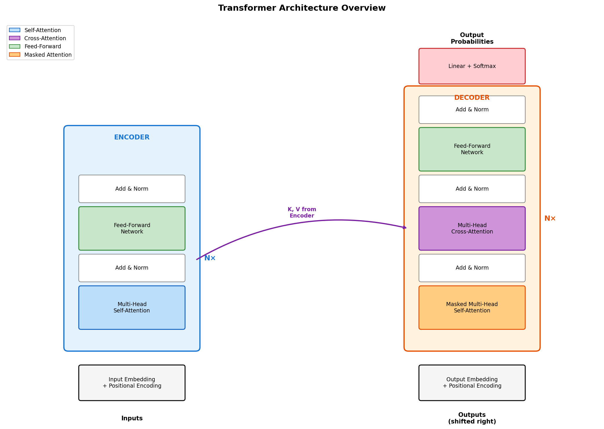
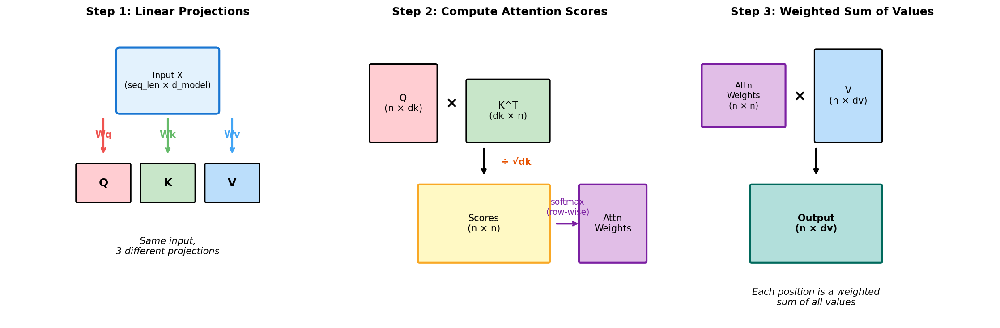
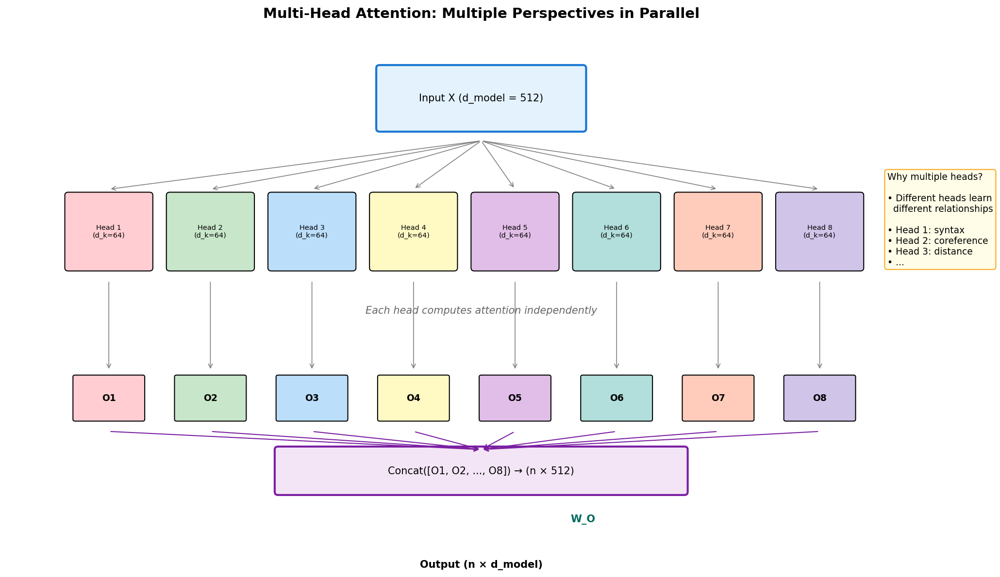
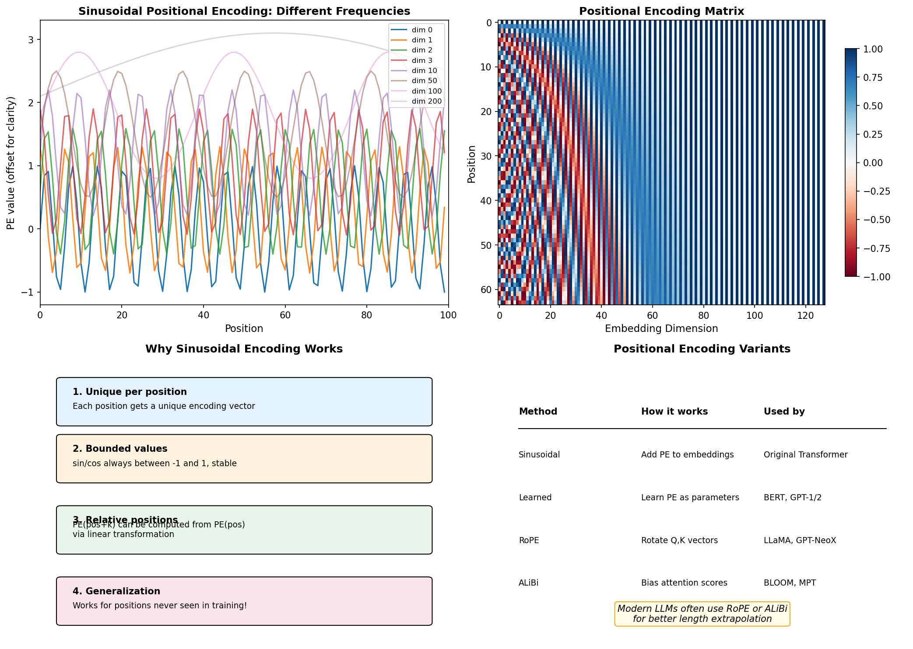
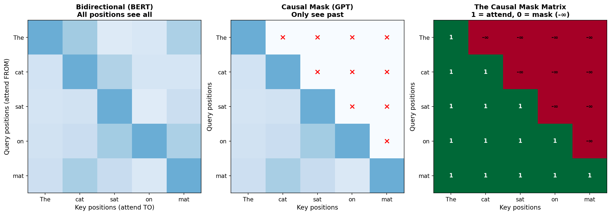
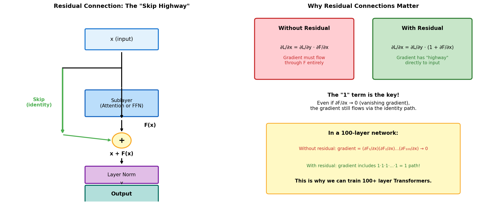
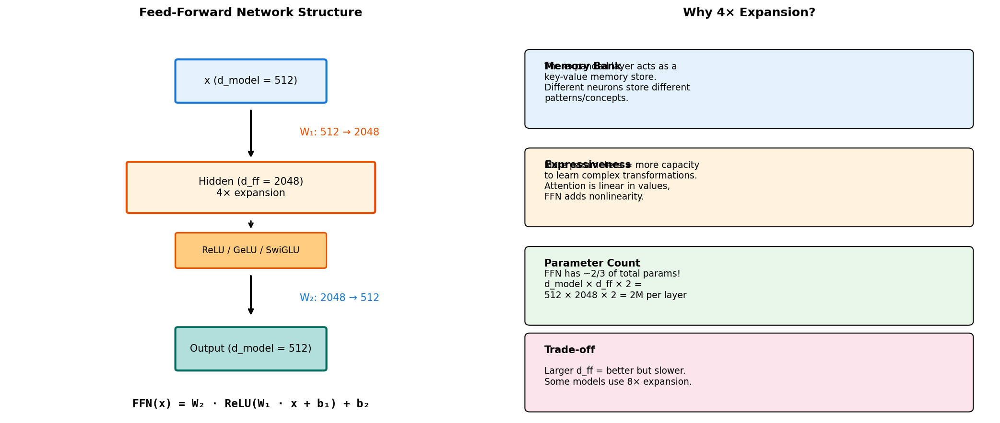

# Day 4: Transformer Architecture Deep Dive

> **Core Question**: How do self-attention, multi-head attention, and positional encoding combine to create the architecture that powers all modern LLMs?

---

## Opening

December 2017. A paper dropped on arXiv with an audacious title: "Attention Is All You Need."

The claim was bold. For years, the deep learning community had treated recurrence as essential for sequence modeling. RNNs, LSTMs, GRUs—all fundamentally sequential, processing one token at a time, maintaining hidden states that carried information forward.

The Transformer said: forget all that. No recurrence. No convolution. Just attention.

The results were stunning. On English-to-German translation, the Transformer achieved state-of-the-art BLEU scores while training in a fraction of the time. Where an LSTM-based model might take weeks on a cluster, the Transformer could train in 12 hours on 8 GPUs.

But the real impact came later. BERT (2018) used the encoder. GPT (2018) used the decoder. GPT-2, GPT-3, GPT-4, Claude, LLaMA—all Transformers. Every major language model today is a direct descendant of that 2017 paper.


*Figure 1: The original Transformer architecture. Left: Encoder stack (used by BERT). Right: Decoder stack (used by GPT). Modern LLMs typically use decoder-only variants.*

Yesterday, we understood how attention works—the query-key-value mechanism, scaled dot-product, the mathematics of soft addressing. Today, we go deeper into the Transformer itself: self-attention (where tokens attend to each other), multi-head attention (multiple perspectives in parallel), positional encoding (how position information enters a position-agnostic architecture), and the critical supporting components that make it all work.

By the end, you'll understand not just *what* the Transformer does, but *why* each design choice was made.

---

## 1. Self-Attention: Every Token Talks to Every Token

### 1.1 From Cross-Attention to Self-Attention

In Day 3, we discussed attention in the context of seq2seq translation: the decoder attends to the encoder outputs. Query comes from one sequence, keys and values from another. This is **cross-attention**.

**Self-attention** is different: query, key, and value all come from the *same* sequence. Each token attends to all tokens (including itself) in the same sequence.

Why would this be useful? Consider the sentence:

> "The animal didn't cross the street because **it** was too tired."

What does "it" refer to? "The animal" or "the street"? A human immediately knows: "it" = "the animal" (animals get tired, streets don't).

For a model to understand this, the representation of "it" needs to incorporate information from "animal." Self-attention makes this possible: when computing the representation of "it," the model can attend strongly to "animal" and incorporate that context.

### 1.2 The Self-Attention Mechanism

Given an input sequence X of n tokens, each represented as a d_model-dimensional vector:

**Step 1: Project to Q, K, V**

Each token is linearly projected into three different spaces:

$$
Q = X W^Q, \quad K = X W^K, \quad V = X W^V
$$

Where W^Q, W^K, W^V are learned parameter matrices.

> **Why three separate projections?**
> 
> The same token plays different roles depending on what you're asking:
> - As a **query**: "What information do I need?"
> - As a **key**: "What information do I offer?"
> - As a **value**: "What information do I provide if selected?"
> 
> A word like "bank" might have different query and key vectors—its query might seek financial context, while its key might signal its own ambiguity.


*Figure 2: Self-attention: each position computes Q, K, V from the same input, then attention scores determine how information flows between positions.*

**Step 2: Compute Attention**

Apply scaled dot-product attention (from Day 3):

$$
\text{SelfAttention}(X) = \text{softmax}\left(\frac{QK^T}{\sqrt{d_k}}\right) V
$$

The output has the same shape as the input: (n, d_model). But now each token's representation has been enriched with context from all other tokens.

### 1.3 What Self-Attention Learns

Through training, self-attention learns various linguistic relationships:

| Pattern | Example | What the model learns |
|---------|---------|----------------------|
| **Coreference** | "The cat... it" | "it" attends to "cat" |
| **Subject-verb** | "The cats **are** sleeping" | "are" attends to "cats" (plural agreement) |
| **Dependency** | "books on **the table**" | "on" attends to "table" (prepositional phrase) |
| **Long-range** | "Although it rained, ... still went" | "still" attends to "Although" (contrast marker) |

This is learned implicitly from predicting the next word. The model discovers that tracking these relationships helps it predict better.

### 1.4 Code: Self-Attention from Scratch

```python
import torch
import torch.nn as nn
import torch.nn.functional as F
import math

class SelfAttention(nn.Module):
    def __init__(self, d_model, d_k=None, d_v=None):
        super().__init__()
        self.d_model = d_model
        self.d_k = d_k or d_model
        self.d_v = d_v or d_model
        
        # Projection matrices
        self.W_q = nn.Linear(d_model, self.d_k, bias=False)
        self.W_k = nn.Linear(d_model, self.d_k, bias=False)
        self.W_v = nn.Linear(d_model, self.d_v, bias=False)
    
    def forward(self, x, mask=None):
        """
        Args:
            x: Input tensor (batch, seq_len, d_model)
            mask: Optional attention mask
        Returns:
            Output tensor (batch, seq_len, d_v)
        """
        # Project to Q, K, V
        Q = self.W_q(x)  # (batch, seq_len, d_k)
        K = self.W_k(x)  # (batch, seq_len, d_k)
        V = self.W_v(x)  # (batch, seq_len, d_v)
        
        # Compute attention scores
        scores = torch.matmul(Q, K.transpose(-2, -1)) / math.sqrt(self.d_k)
        # scores: (batch, seq_len, seq_len)
        
        # Apply mask if provided
        if mask is not None:
            scores = scores.masked_fill(mask == 0, float('-inf'))
        
        # Softmax to get attention weights
        attn_weights = F.softmax(scores, dim=-1)
        
        # Weighted sum of values
        output = torch.matmul(attn_weights, V)
        
        return output, attn_weights


# Test it
batch_size, seq_len, d_model = 2, 10, 512
x = torch.randn(batch_size, seq_len, d_model)

self_attn = SelfAttention(d_model)
output, weights = self_attn(x)

print(f"Input shape: {x.shape}")
print(f"Output shape: {output.shape}")  # Same as input!
print(f"Attention weights shape: {weights.shape}")  # (batch, seq, seq)
print(f"Weights sum per query: {weights[0].sum(dim=-1)}")  # All 1.0
```

Output:
```
Input shape: torch.Size([2, 10, 512])
Output shape: torch.Size([2, 10, 512])
Attention weights shape: torch.Size([2, 10, 10])
Weights sum per query: tensor([1.0000, 1.0000, 1.0000, 1.0000, 1.0000,
                               1.0000, 1.0000, 1.0000, 1.0000, 1.0000])
```

---

## 2. Multi-Head Attention: Multiple Perspectives

### 2.1 The Limitation of Single-Head Attention

Single-head attention has a problem: it can only learn one "type" of relationship at a time.

Consider: "The lawyer who saw the banker at the dinner filed a lawsuit."

Multiple relationships exist simultaneously:
- "lawyer" ↔ "filed" (subject-verb)
- "lawyer" ↔ "who" (relative clause)
- "banker" ↔ "dinner" (location context)
- "lawyer" ↔ "lawsuit" (semantic role)

A single attention head must choose one attention pattern. But language has multiple simultaneous structures!

### 2.2 Multi-Head: Parallel Attention with Different Views

The solution: run multiple attention heads in parallel, each with its own Q, K, V projections.

$$
\text{MultiHead}(X) = \text{Concat}(\text{head}_1, \ldots, \text{head}_h) W^O
$$

Where each head is:

$$
\text{head}_i = \text{Attention}(X W^Q_i, X W^K_i, X W^V_i)
$$


*Figure 3: Multi-head attention runs 8 parallel attention operations with different learned projections, then concatenates and projects the results.*

### 2.3 The Dimension Math

In the original Transformer:
- d_model = 512 (total embedding dimension)
- h = 8 (number of heads)
- d_k = d_v = d_model / h = 64 (dimension per head)

Each head operates on a 64-dimensional subspace. After concatenation:
- 8 heads × 64 dimensions = 512 dimensions
- Final W^O projection: 512 → 512

**Key insight**: The total computation is roughly the same as single-head attention with full d_model dimensions, but we get 8 different "views" of the data.

### 2.4 What Different Heads Learn

Research has analyzed what different attention heads learn:

| Head Type | What it captures | Example |
|-----------|------------------|---------|
| **Positional** | Attend to adjacent tokens | "the" → "cat" (next word) |
| **Syntactic** | Grammatical structure | Subject → Verb |
| **Semantic** | Meaning relationships | "bank" → "money" or "river" |
| **Rare token** | Unusual words (OOV handling) | Attend to delimiter tokens |

Not all heads are equally useful. Some papers show that pruning 30-50% of heads barely affects performance—there's redundancy. But during training, this redundancy provides robustness.

### 2.5 Code: Multi-Head Attention

```python
class MultiHeadAttention(nn.Module):
    def __init__(self, d_model, n_heads):
        super().__init__()
        assert d_model % n_heads == 0, "d_model must be divisible by n_heads"
        
        self.d_model = d_model
        self.n_heads = n_heads
        self.d_k = d_model // n_heads
        
        # All projections in one matrix for efficiency
        self.W_q = nn.Linear(d_model, d_model, bias=False)
        self.W_k = nn.Linear(d_model, d_model, bias=False)
        self.W_v = nn.Linear(d_model, d_model, bias=False)
        self.W_o = nn.Linear(d_model, d_model, bias=False)
    
    def forward(self, x, mask=None):
        batch_size, seq_len, _ = x.shape
        
        # Project and reshape to (batch, n_heads, seq_len, d_k)
        Q = self.W_q(x).view(batch_size, seq_len, self.n_heads, self.d_k).transpose(1, 2)
        K = self.W_k(x).view(batch_size, seq_len, self.n_heads, self.d_k).transpose(1, 2)
        V = self.W_v(x).view(batch_size, seq_len, self.n_heads, self.d_k).transpose(1, 2)
        
        # Attention per head: (batch, n_heads, seq_len, seq_len)
        scores = torch.matmul(Q, K.transpose(-2, -1)) / math.sqrt(self.d_k)
        
        if mask is not None:
            scores = scores.masked_fill(mask == 0, float('-inf'))
        
        attn_weights = F.softmax(scores, dim=-1)
        
        # Apply attention to values
        context = torch.matmul(attn_weights, V)
        # context: (batch, n_heads, seq_len, d_k)
        
        # Concatenate heads: (batch, seq_len, d_model)
        context = context.transpose(1, 2).contiguous().view(batch_size, seq_len, self.d_model)
        
        # Final projection
        output = self.W_o(context)
        
        return output, attn_weights


# Test
mha = MultiHeadAttention(d_model=512, n_heads=8)
output, weights = mha(x)

print(f"Input: {x.shape}")
print(f"Output: {output.shape}")
print(f"Attention weights: {weights.shape}")  # (batch, n_heads, seq, seq)
```

Output:
```
Input: torch.Size([2, 10, 512])
Output: torch.Size([2, 10, 512])
Attention weights: torch.Size([2, 8, 10, 10])
```

---

## 3. Positional Encoding: Telling the Model Where Things Are

### 3.1 The Position Problem

Here's a subtle but critical issue: attention is **permutation invariant**.

Consider the self-attention computation:
```
output[i] = Σ_j attention_weight[i,j] × value[j]
```

The attention weights depend only on the *content* of Q and K, not their positions. If we shuffle the input tokens, the output would be a corresponding shuffle—but within each output, the content would be the same.

This means: **attention alone cannot distinguish "The cat sat on the mat" from "mat the on sat cat The"!**

For language, position matters. "Dog bites man" ≠ "Man bites dog."

### 3.2 Sinusoidal Positional Encoding

The original Transformer solution: add position information to the input embeddings.

For position pos and dimension i:

$$
\begin{aligned}
PE_{(pos, 2i)} &= \sin\left(\frac{pos}{10000^{2i/d_{model}}}\right) \\
PE_{(pos, 2i+1)} &= \cos\left(\frac{pos}{10000^{2i/d_{model}}}\right)
\end{aligned}
$$

This produces a unique vector for each position. The final input to the Transformer is:

$$
\text{Input} = \text{TokenEmbedding} + \text{PositionalEncoding}
$$


*Figure 4: Top-left: Different dimensions have different frequencies, creating unique patterns. Top-right: The full PE matrix showing the sinusoidal structure. Bottom: Why this design works and alternatives.*

### 3.3 Why Sinusoidal Functions?

Several clever properties:

**1. Bounded values**: sin and cos are always in [-1, 1], so they don't disrupt the scale of embeddings.

**2. Unique per position**: Different positions get different encoding vectors—the combination of frequencies creates uniqueness.

**3. Relative position encoding**: There's a linear transformation that can convert PE(pos) to PE(pos + k):

$$
PE(pos + k) = T_k \cdot PE(pos)
$$

where T_k depends only on k, not pos. This means the model can potentially learn to attend to "3 positions ahead" regardless of absolute position.

**4. Extrapolation**: Works for positions beyond training length (though with degrading quality).

### 3.4 Learned vs. Sinusoidal

BERT and GPT-2 used **learned positional embeddings**: just treat positions as tokens and learn their embeddings.

| Aspect | Sinusoidal | Learned |
|--------|------------|---------|
| Extrapolation | Works (theoretically) | Fails beyond max position |
| Parameters | 0 | position × d_model |
| Performance | Similar | Similar |
| Modern usage | Replaced by RoPE/ALiBi | Replaced by RoPE/ALiBi |

Modern models like LLaMA use **RoPE** (Rotary Position Embedding) or **ALiBi** (Attention with Linear Biases), which we'll cover in Week 4.

### 3.5 Code: Positional Encoding

```python
class PositionalEncoding(nn.Module):
    def __init__(self, d_model, max_len=5000):
        super().__init__()
        
        # Create position encoding matrix
        pe = torch.zeros(max_len, d_model)
        position = torch.arange(0, max_len).unsqueeze(1).float()
        
        # Compute the div_term for each dimension
        div_term = torch.exp(
            torch.arange(0, d_model, 2).float() * (-math.log(10000.0) / d_model)
        )
        
        # Apply sin to even indices, cos to odd
        pe[:, 0::2] = torch.sin(position * div_term)
        pe[:, 1::2] = torch.cos(position * div_term)
        
        # Register as buffer (not a parameter, but saved with model)
        pe = pe.unsqueeze(0)  # (1, max_len, d_model)
        self.register_buffer('pe', pe)
    
    def forward(self, x):
        """
        Args:
            x: Token embeddings (batch, seq_len, d_model)
        Returns:
            x + positional encoding
        """
        seq_len = x.size(1)
        return x + self.pe[:, :seq_len, :]


# Visualize
import matplotlib.pyplot as plt

pe = PositionalEncoding(d_model=128, max_len=100)
pos_enc = pe.pe[0].numpy()

plt.figure(figsize=(10, 6))
plt.imshow(pos_enc, aspect='auto', cmap='RdBu')
plt.xlabel('Dimension')
plt.ylabel('Position')
plt.colorbar()
plt.title('Positional Encoding Matrix')
plt.show()
```

---

## 4. The Causal Mask: Preventing Information Leakage

### 4.1 The Autoregressive Constraint

In language model training, we predict the next token given the previous tokens:

$$
P(x_1, x_2, \ldots, x_n) = \prod_{i=1}^{n} P(x_i | x_1, \ldots, x_{i-1})
$$

But self-attention sees all positions simultaneously! If position 5 can attend to position 8, it's "cheating"—using future information to predict itself.

### 4.2 The Solution: Causal Masking

We mask out (set to -∞) all attention scores where the query position is before the key position:

$$
\text{Mask}_{ij} = \begin{cases} 0 & \text{if } j \leq i \\ -\infty & \text{if } j > i \end{cases}
$$

After softmax, -∞ becomes 0, so future positions contribute nothing.


*Figure 5: Left: Bidirectional attention (BERT) sees all positions. Middle: Causal masking blocks future positions. Right: The mask matrix with 1s (attend) and -∞s (block).*

### 4.3 Causal Mask in Code

```python
def create_causal_mask(seq_len):
    """
    Creates a causal (lower triangular) mask.
    Returns 1 where attention is allowed, 0 where it should be -inf.
    """
    mask = torch.tril(torch.ones(seq_len, seq_len))
    return mask


# Example
seq_len = 5
mask = create_causal_mask(seq_len)
print("Causal mask:")
print(mask)
```

Output:
```
Causal mask:
tensor([[1., 0., 0., 0., 0.],
        [1., 1., 0., 0., 0.],
        [1., 1., 1., 0., 0.],
        [1., 1., 1., 1., 0.],
        [1., 1., 1., 1., 1.]])
```

Position 0 can only see itself. Position 4 can see positions 0-4.

### 4.4 Encoder vs Decoder Attention

| Component | Masking | Use Case |
|-----------|---------|----------|
| **Encoder self-attention** | Bidirectional (no mask) | BERT: see full context |
| **Decoder self-attention** | Causal mask | GPT: can only see past |
| **Cross-attention** | No mask (decoder queries, encoder keys) | Translation: decoder queries encoder |

Modern LLMs like GPT-4 and Claude are **decoder-only**: they use only causal self-attention, with no encoder or cross-attention.

---

## 5. Residual Connections and Layer Normalization

### 5.1 The Residual Connection

Every sub-layer in the Transformer (attention, FFN) has a residual connection:

$$
\text{Output} = \text{LayerNorm}(x + \text{SubLayer}(x))
$$

This is the "skip connection" from ResNet, and it's critical for training deep networks.


*Figure 6: Left: The residual "skip highway" allows gradients to flow directly. Right: Why this matters—the gradient always includes a "1" term that prevents vanishing.*

### 5.2 Why Residuals Matter

**Gradient flow perspective**:

Without residual:
$$\frac{\partial L}{\partial x} = \frac{\partial L}{\partial y} \cdot \frac{\partial F}{\partial x}$$

With residual (y = x + F(x)):
$$\frac{\partial L}{\partial x} = \frac{\partial L}{\partial y} \cdot \left(1 + \frac{\partial F}{\partial x}\right)$$

The "1" term means gradients can flow directly from output to input, bypassing the transformation. Even if ∂F/∂x → 0 (vanishing gradient in the sublayer), the gradient still propagates.

**Function space perspective**:

Residual connections make it easy for the model to learn the identity function. If a layer should do nothing, it just needs to output 0, and the residual passes the input through unchanged. Without residual, learning "do nothing" is hard.

### 5.3 Layer Normalization

Layer Norm normalizes across the feature dimension:

$$
\text{LayerNorm}(x) = \gamma \cdot \frac{x - \mu}{\sigma + \epsilon} + \beta
$$

Where μ and σ are computed per-sample across features, and γ, β are learned scale/shift parameters.

Why LayerNorm instead of BatchNorm?
- **Sequence length varies**: BatchNorm stats would differ for different lengths
- **No batch dependency**: Important for inference and small batches
- **Works with variable-length sequences**: No padding complications

### 5.4 Pre-Norm vs Post-Norm

**Original Transformer (Post-Norm)**:
```
x → SubLayer → + x → LayerNorm → output
```

**Modern LLMs (Pre-Norm)**:
```
x → LayerNorm → SubLayer → + x → output
```

Pre-Norm is more stable for very deep networks because the residual path carries un-normalized activations, keeping gradients consistent.

---

## 6. Feed-Forward Network: The Hidden Workhorse

### 6.1 What is the FFN?

After attention, each position passes through a position-wise feed-forward network:

$$
\text{FFN}(x) = \max(0, xW_1 + b_1)W_2 + b_2
$$

Or with GeLU (used in GPT):
$$
\text{FFN}(x) = \text{GeLU}(xW_1 + b_1)W_2 + b_2
$$


*Figure 7: Left: The FFN expands dimension 4×, applies nonlinearity, then projects back. Right: Why the expansion matters.*

### 6.2 The 4× Expansion

Key dimensions:
- Input: d_model = 512
- Hidden: d_ff = 2048 (4× expansion)
- Output: d_model = 512

Why expand? Research suggests the FFN acts as a **key-value memory**:

1. **Keys**: The first layer W_1 creates "patterns" in high-dimensional space
2. **Values**: The second layer W_2 stores corresponding "outputs"
3. **Lookup**: A given input activates certain patterns, retrieving associated information

This is why FFN has most of the parameters (2/3 of a Transformer layer) and where much of the "knowledge" is stored.

### 6.3 Modern Variants: SwiGLU

Many modern LLMs use **SwiGLU** instead of ReLU:

$$
\text{SwiGLU}(x) = \text{Swish}(xW_1) \otimes (xW_3)
$$

Where Swish(x) = x · σ(x) and ⊗ is element-wise multiplication.

SwiGLU adds a third projection (W_3), making the FFN larger but more expressive. LLaMA, PaLM, and Claude use variants of this.

### 6.4 Code: Transformer Block

Putting it all together:

```python
class TransformerBlock(nn.Module):
    def __init__(self, d_model, n_heads, d_ff, dropout=0.1):
        super().__init__()
        
        # Multi-head attention
        self.attn = MultiHeadAttention(d_model, n_heads)
        self.norm1 = nn.LayerNorm(d_model)
        
        # Feed-forward
        self.ffn = nn.Sequential(
            nn.Linear(d_model, d_ff),
            nn.GELU(),
            nn.Linear(d_ff, d_model)
        )
        self.norm2 = nn.LayerNorm(d_model)
        
        self.dropout = nn.Dropout(dropout)
    
    def forward(self, x, mask=None):
        # Pre-Norm variant (modern)
        
        # Self-attention with residual
        attn_out, _ = self.attn(self.norm1(x), mask)
        x = x + self.dropout(attn_out)
        
        # FFN with residual
        ffn_out = self.ffn(self.norm2(x))
        x = x + self.dropout(ffn_out)
        
        return x


# Stack multiple blocks
class Transformer(nn.Module):
    def __init__(self, vocab_size, d_model, n_heads, n_layers, d_ff, max_len=5000):
        super().__init__()
        
        self.token_emb = nn.Embedding(vocab_size, d_model)
        self.pos_enc = PositionalEncoding(d_model, max_len)
        
        self.blocks = nn.ModuleList([
            TransformerBlock(d_model, n_heads, d_ff)
            for _ in range(n_layers)
        ])
        
        self.norm = nn.LayerNorm(d_model)
        self.output = nn.Linear(d_model, vocab_size)
    
    def forward(self, x, mask=None):
        # x: (batch, seq_len) token IDs
        x = self.token_emb(x)
        x = self.pos_enc(x)
        
        for block in self.blocks:
            x = block(x, mask)
        
        x = self.norm(x)
        logits = self.output(x)  # (batch, seq_len, vocab_size)
        
        return logits


# Create a small GPT-like model
model = Transformer(
    vocab_size=50000,
    d_model=512,
    n_heads=8,
    n_layers=6,
    d_ff=2048
)

# Count parameters
total_params = sum(p.numel() for p in model.parameters())
print(f"Total parameters: {total_params:,}")  # ~44M
```

---

## 7. Math Derivation [Optional]

> This section is for readers who want deeper understanding. Feel free to skip.

### 7.1 Complexity Analysis

**Self-attention complexity**:

For sequence length n and dimension d:
- QK^T computation: O(n² × d)
- Softmax: O(n²)
- Attention × V: O(n² × d)

**Total: O(n² × d)**

This quadratic dependence on n is why Transformers struggle with very long sequences. A 100K-token context would require 10 billion attention computations per layer!

**FFN complexity**:
- Linear 1: O(n × d × 4d) = O(4nd²)
- Linear 2: O(n × 4d × d) = O(4nd²)

**Total: O(nd²)**

Linear in sequence length, but quadratic in model dimension.

**The n² vs d² trade-off**:
- Short sequences (n < d): FFN dominates
- Long sequences (n > d): Attention dominates

### 7.2 Parameter Count

For a single Transformer block:

**Attention**:
- W_Q, W_K, W_V: 3 × d² = 3d²
- W_O: d²
- Total: **4d²**

**FFN**:
- W_1: d × 4d = 4d²
- W_2: 4d × d = 4d²
- Total: **8d²**

**Ratio**: FFN has 2× the parameters of attention.

For GPT-3 (d_model=12288, 96 layers):
- Attention per layer: 4 × 12288² ≈ 604M
- FFN per layer: 8 × 12288² ≈ 1.2B
- Total for all layers: 96 × 1.8B ≈ **173B parameters**

(Plus embeddings, layer norms, etc. → 175B total)

### 7.3 Why Transformers Parallelize Better

RNN forward pass:
```
h_1 = f(x_1, h_0)
h_2 = f(x_2, h_1)  ← Must wait for h_1
h_3 = f(x_3, h_2)  ← Must wait for h_2
...
```
n sequential steps. Cannot parallelize.

Transformer forward pass:
```
Q, K, V = Linear(X)           ← Parallel across all positions
Attention = softmax(QK^T) V   ← Matrix operations, parallel
Output = FFN(Attention)       ← Position-independent, parallel
```

All positions computed simultaneously. One step regardless of sequence length.

This is why a Transformer can process 10,000 tokens as fast as 100 tokens (memory permitting), while an RNN takes 100× longer.

---

## 8. Common Misconceptions

### ❌ "Transformers have no inductive bias for sequences"

People often say attention is "position-agnostic" as a weakness. But:

1. **Positional encoding adds position information**. The model knows positions—it's just added explicitly rather than built into the architecture.

2. **Causal masking is a strong sequential bias**. For language modeling, the model can only see past tokens—this is a fundamentally sequential constraint.

3. **Attention patterns learn sequential structure**. Heads often learn to attend to adjacent tokens, previous sentences, or syntactically related positions.

The bias is there—it's just more flexible than RNN's hardcoded sequential processing.

### ❌ "More heads = better performance"

Not necessarily. Research shows:

- **Head redundancy**: Many heads learn similar patterns
- **Pruning works**: You can often remove 30-50% of heads with minimal performance loss
- **Optimal varies by task**: Some tasks benefit from more heads, others don't

8 heads became standard due to the original paper, not because it's optimal for all cases.

### ❌ "The FFN is just a simple MLP, nothing special"

The FFN is where most of the "knowledge" lives:

1. **Parameter count**: 2/3 of each layer's parameters
2. **Knowledge storage**: Factual knowledge seems to be stored in FFN neurons
3. **Key-value memory**: Research shows FFN acts as a memory lookup system

Attention routes information; FFN transforms and stores it. Both are crucial.

---

## 9. Further Reading

### Beginner
1. **The Illustrated Transformer** (Jay Alammar)  
   The definitive visual guide, start here  
   https://jalammar.github.io/illustrated-transformer/

2. **The Annotated Transformer** (Harvard NLP)  
   Line-by-line PyTorch implementation with explanations  
   http://nlp.seas.harvard.edu/annotated-transformer/

### Advanced
3. **Transformer Circuits Thread** (Anthropic)  
   Deep dive into what Transformers learn internally  
   https://transformer-circuits.pub/

4. **A Mathematical Framework for Transformer Circuits** (Anthropic)  
   Rigorous analysis of attention head computations  
   https://transformer-circuits.pub/2021/framework/index.html

### Papers
5. **Attention Is All You Need** (Vaswani et al., 2017)  
   The original paper—required reading  
   https://arxiv.org/abs/1706.03762

6. **On Layer Normalization in the Transformer Architecture** (Xiong et al., 2020)  
   Pre-Norm vs Post-Norm analysis  
   https://arxiv.org/abs/2002.04745

---

## Reflection Questions

1. **Self-attention has O(n²) complexity in sequence length. Why is this a problem, and what approaches have been proposed to address it?** (Hint: sparse attention, linear attention, chunking)

2. **We said multi-head attention allows "multiple perspectives." But if we just have one large head with the same total dimension, would that be worse? Why or why not?**

3. **The FFN uses a 4× expansion to d_ff=2048, then compresses back to d_model=512. What would happen if we removed this bottleneck structure and used a single linear layer? What capability would be lost?**

---

## Summary

| Component | Purpose | Key Detail |
|-----------|---------|------------|
| Self-Attention | Each token attends to all tokens | Q, K, V from same input |
| Multi-Head | Multiple parallel attention views | h=8 heads, d_k=d_model/h |
| Positional Encoding | Add position information | Sinusoidal or learned |
| Causal Mask | Prevent seeing future tokens | Lower triangular mask |
| Residual Connection | Enable gradient flow | x + SubLayer(x) |
| Layer Normalization | Stabilize activations | Per-token normalization |
| Feed-Forward Network | Transform and store knowledge | 4× expansion, 2/3 of params |

**Key Takeaway**: The Transformer is an elegant composition of attention and feed-forward layers, connected by residuals and stabilized by normalization. Self-attention provides global context mixing (every token sees every token), multi-head attention captures multiple relationship types simultaneously, positional encoding injects sequence order into a position-agnostic architecture, and the FFN provides the nonlinear transformation and knowledge storage. Together, these components create the foundation for every modern LLM.

Tomorrow, we'll explore why the field evolved from encoder-decoder (original Transformer) to decoder-only (GPT), and why BERT's bidirectional approach lost to GPT's autoregressive paradigm.

---

*Day 4 of 60 | LLM Fundamentals*  
*Word count: ~4200 | Reading time: ~20 minutes*
